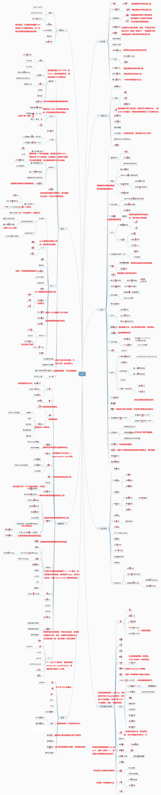

我以前保存了一个整理的相对全的 OI/ICPC 知识图，根据自己的理解标上了难度和注释，给从零开始学 ACM 的同学参考。难度总共分为了 $1,2,3$ 三层（未标的要不不算知识点，要不是太偏的知识点）。

1.  熟练应用难度 1，leetcode 周赛题应该能乱杀了。
2.  熟练应用难度 1 和 2，差不多能和队友混个 ICPC 金牌了。
3.  熟练应用难度 3，应该能单挑拿 ICPC 金/组队出线 WF 了。

学完 ICPC 需要的 C++ 很简单，学完图上的知识点也不难，难的是如何运用自如并保持火热的的手感。

**希望每一个有梦想的人都能有前进的方向**。

