## 目录

普通世界+超自然设定的剧情展开：
+ [命运石之门](#命运石之门)：时间旅行/剧情/爱情
+ [死亡笔记](#死亡笔记)：剧情/犯罪/推理
+ [JOJO的奇妙冒险](#jojo的奇妙冒险)：冒险/战斗/剧情
+ [某科学的超电磁炮](#某科学的超电磁炮)：科幻/剧情/校园
+ [异度侵入](#异度侵入)：剧情/推理
+ [博多豚骨拉面](#博多豚骨拉面)：剧情/犯罪/友情
+ [魔法禁书目录](#魔法禁书目录)：奇幻/剧情

魔幻架空世界的全人类战斗
+ [进击的巨人](#进击的巨人)：剧情/战斗
+ [鬼灭之刃](#鬼灭之刃)：剧情/冒险/战斗
+ [咒术回战](#咒术回战)：剧情/冒险/战斗
+ [天狼 Sirius the Jaeger](#天狼)：冒险/战斗/剧情
+ [darling in the franxx](#darling-in-the-franxx)：科幻/剧情/战斗/情感
+ [罪恶王冠](#罪恶王冠)：科幻/剧情/战斗/情感
+ [Fate Stay Night](#fate-stay-night)：剧情/战斗/爱情

在无限可能的异世界冒险：
+ [刀剑神域](#刀剑神域)：冒险/爱情/剧情
+ [Overlord](#overlord)：冒险/剧情
+ [六花的勇者](#六花的勇者)：冒险/剧情/推理
+ [宝石之国](#宝石之国)：剧情/战斗/人性
+ [Re:从零开始的异世界生活](#从零开始的异世界生活)：奇幻/剧情/爱情

## 命运石之门
*时间旅行/剧情/爱情*

内容介绍
- “这一切都是命运石之门的选择！”
- 男主冈部是一个疯狂而中二的科学家，一直致力于时间机器的开发。在一次意外中他切入了另外一条世界线，从而开始了时间旅行。在助手牧濑红莉栖的帮助下，他成功掌握了时空跳跃的方法。
- 他未来的 SERN 会因为窃取时间机器而统治世界，所以他要不断与其做斗争。
- 由于世界线的收束，他发现无论怎样改变过去，这条世界线里他的青梅竹马真由里都会死去……于是他一次次地尝试，终于在某时跳回了原来的世界线，但意外地发现此线他的知音牧濑必定会死亡……
- 最终男主成功解决了这个“送命题”，跳到了美好的R世界线。

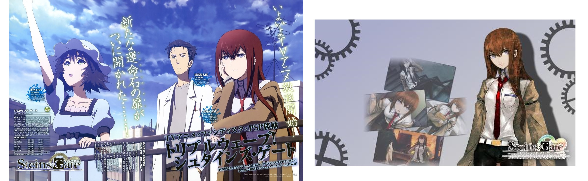

简评
- 石头门绝对是浑然一体的神作！
- 初看前几集，可能会因为不知所云而弃坑。只要你坚持下去，所有剧情会成一条直线，之前的种种伏笔都跃然纸上。对于爱好科幻的人，绝对不能错过这番。
- 这个番里的爱情也是特别深刻的；冈部每次时空跳跃的时候，只有自己才能保留记忆；但是无论他位于何时何地，都有一个理解他的牧濑在倾听他、协助他。毫无疑问，无论在哪个世界线，牧濑红莉栖都是他最信赖的人。**陪伴是最长情的告白**。

评分
+ 设定有趣程度：★★★★★
+ 剧情：　　　　★★★★★
+ 人物刻画：　　★★★★
+ 深刻意义：　　★★★☆
+ 作画：　　　　★★★☆
+ 补完时间：　　2017.07.12（第一季）

## 进击的巨人
*剧情/战斗*

内容介绍（**严重剧透预警**）
- 进击的巨人，构建了一个人与巨人战斗的庞大的世界观。
- 第一季
	+ 人类在巨人面前极其弱小，是巨人口中的食物。人类建造起了高达50米，以牺牲自由为代价抵御巨人的入侵。10 岁的少年艾伦·耶格尔对墙外的世界充满了好奇。艾伦不满足于墙内暂时和平的生活，一心想加入调查军团，探索墙外世界。
	+ 某天，越过墙壁的超大型巨人出现了，人们的“和平”瞬间土崩瓦解，被迫走向了和巨人战斗之路……艾伦和青梅竹马三笠、好朋友阿尔敏进入新兵训练营，学习如何和巨人战斗。
- 第二季
	+ 自从人类的和平被超大型巨人打破的那天起，艾伦每天都持续着没有尽头的战斗。
	+ 在一次意外中，艾伦发现自己也会变成巨人的姿态。起初大家对他十分不信任，他靠着真诚，一步一步重获人们的信任，协同调查军团一起抵御巨人入侵。
	+ 巨人的起源迷雾重重。人类内部也有巨人的间隙……
- 第三季
	+ 埃尔文团长指挥调查军团与巨人进行殊死搏斗。
	+ 巨人的迷雾逐渐揭开，原来巨人是人变的，世界外还有世界……

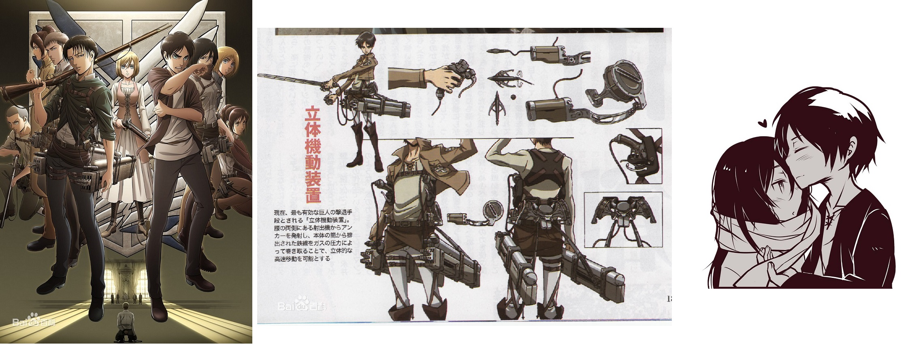

简评
- **进击的巨人是名副其实的神作**。有战斗，有剧情，有催泪，有人性，令人叹为观止。
- 作者（原作是漫画，目前还在连载）伟大之处在于，他肯定在最开始就已经构思好了整个世界观。动画的第一季第二季埋下了大量的伏笔，后来揭晓伏笔的时候，一切就变得那么得自然，全都在情理之中……剧情让人欲罢不能，我连追三集，看完大呼过瘾。
- 进击的巨人很注重人物的刻画。
	+ 艾伦深陷男主的常规套路：情商低脑筋直，前期让人看得很窝火。
	+ 我很喜欢阿尔敏的成长过程：他是全剧的智商担当，但是性格懦弱腼腆；他在一次次的历练中，学会了坚强，充分感受到了别人对他的信任，成长成了一个了不起的男子汉。在第三季中还拼死保护艾伦，让人敬佩至极。
	+ 女主角三笠对艾伦可谓是呵护至极。她是一个武艺高强却又心思细腻、懂得感恩的女孩子。
	+ 还有外表冷酷、内心温柔的利威尔兵长，当机立断、取舍得当的埃尔文团长……

评分
+ 设定有趣程度：★★★★★
+ 剧情：　　　　★★★★★
+ 人物刻画：　　★★★★☆
+ 深刻意义：　　★★★★
+ 作画：　　　　★★★☆
+ 补完时间：　　2019.07.07-08.06（1-3季）

## 死亡笔记

*剧情/犯罪/推理*

内容介绍
- 日本警视厅厅长夜神总一郎的儿子夜神月在高中时就有极强的推理能力和正义感。他觉得世界上的邪恶人物太多，想要构建一个没有犯罪的完美世界。有一天，死神路克把他的死亡笔记本掉在了人间，恰好夜神月捡到。只要在死亡笔记本上写上一个人的名字并在写的时候回忆他的相貌，就能控制他的死亡时间和死因。于是夜神月开始不断杀戮新闻报道里的凶恶罪犯，被支持们称为基拉。
- 一个可以调用联合国军队的神秘人物 $L$ 来到日本，试图找出基拉的真面目；夜神月则自信迎战，试图得到 $L$ 的面貌和名字以把他杀死。夜神月机缘巧合加入了包括 $L$、他父亲在内的“基拉作战指挥部”。$L$ 高度怀疑他的身份并不断设下陷阱，月则小心应对，两人你来我往明争暗斗……
- 更刺激的是，世界上突然出现了第二个基拉，能力还在夜神月之上。月要掩人耳目地接近他……
- $L$ 最终棋差一招被夜神月用笔记本杀死，但是 $L$ 的继承者又卷土重来……

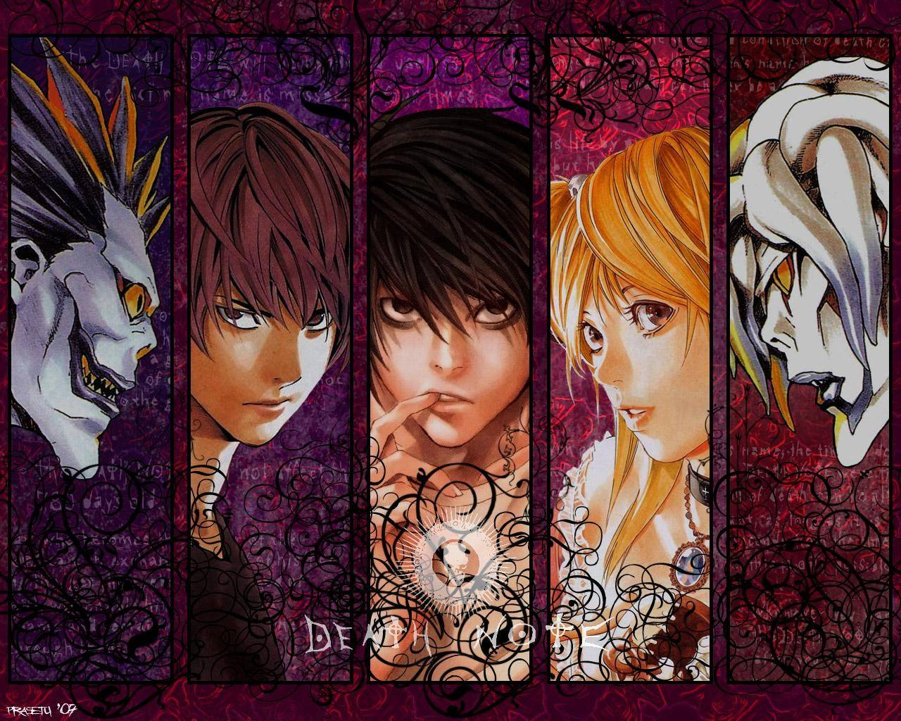

简评

- 作者在死亡笔记本上的设定下足了功夫。不仅仅是如何杀人、如何转借、如何见到死神等基本问题，作者还一五一十地列举了很多使用细节，最大可能地降低情节漏洞，提高剧情严密性。
- 夜神月是一个充满争议的亦正亦邪的角色。他双商超群（和 $L$ 同为日本高考第一名），推理和决断能力能力极强，为了建设“美丽新世界”有强大的精神执念，不惜杀掉无辜的人。主流观点认为他的行为和连续杀人犯无疑，但我却十分尊重和钦佩他。他配得上“基拉”这个神的称号（最终棋差一招好难受）。
- 本片对于其他人物刻画都很深刻。夜神总一郎是一个典型的“绝对正义”的日本警察，坚定地抵制基拉，在被解职后即使身处险境也拒绝用枪。$L$ 是一个秉持传统正义的推理专家，他多次用直觉和间接证据锁定了夜神月，却因为证据不足（还有点高手间的惺惺相惜）而犹豫不决，最终惨遭杀害。我的理解是，如果 $L$ 盲从自己的直觉提前杀掉了基拉（夜神月），他会觉得自己和杀人魔基拉无异。
- 本片最惨的人当属第二基拉弥海砂。她深深地爱上了夜神月，相信他对美丽新世界的构建，并愿意为他做任何事情（甚至两次用余下一半寿命去换死神之眼），但一直被夜神月所利用和伤害着。

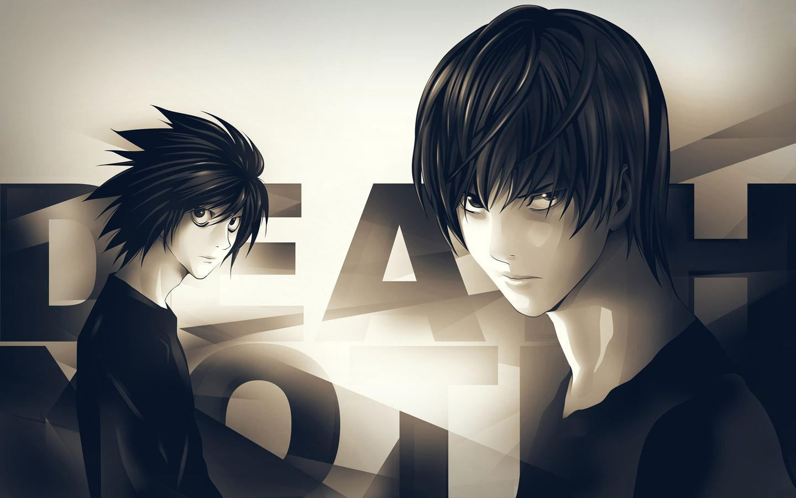

评分

- 设定有趣程度：★★★★★
- 剧情：　　　　★★★★
- 人物刻画：　　★★★★☆
- 深刻意义：　　★★★★☆
- 作画：　　　　★★★☆
- 补完时间：　　2020.11.08

## 鬼灭之刃

*剧情/冒险/战斗*

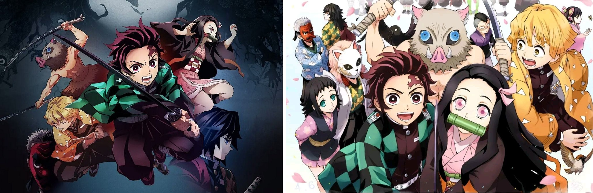

内容介绍
- 卖炭少年炭治郎，他那平凡而幸福的日常生活，在家人遭到恶鬼袭击的那一天发生了剧变。母亲与四个弟妹惨遭杀害，而与他一起生还的妹妹祢豆子亦异变成凶暴的鬼。
- 在猎鬼人的指引下，立志成为猎鬼人的炭治郎与变成鬼却尚存理智的祢豆子踏上了旅程。通过艰苦的剑术修行与赌命试炼，炭治郎成为了猎鬼人组织“鬼杀队“的一员。在鬼杀队里，他遇到了很多相爱相杀的好朋友，比如性格胆怯、擅长昏睡中攻击的剑客我妻善逸，赤裸上身、擅长双刀流的嘴平伊之助……
- 灶门炭治郎将联合传说中的柱们，向鬼的领袖鬼舞辻无惨发起总攻。

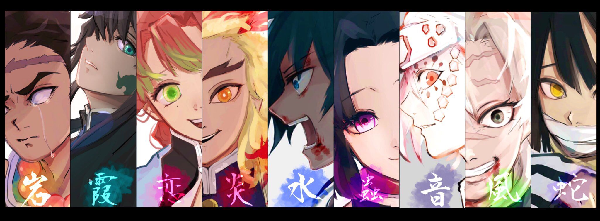

简评
- 鬼灭之刃为我们营造了一个有食人鬼的架空世界。灶门炭治郎为了给父母报仇、让妹妹还原成人，毅然背上祢豆子，朝着险恶的世界进发。他在历练中越来越强，也逐渐揭开了自己的身世。
- 主角炭治郎是一个真正意义上兼顾着温柔与强大的角色。面对穷凶极恶的鬼，他会毫不犹豫地拼上自己的血肉之躯将其斩杀。但是天性温柔的炭治郎在挥刀后仍然会为鬼吊唁，祈祷他们早日升天。
- 为了更好地体现战斗的真实和残酷，《鬼灭》的很多画面都很壮烈，剧情也大开大阖。

评分
+ 设定有趣程度：★★★★
+ 剧情：　　　　★★★★☆
+ 人物刻画：　　★★★★☆
+ 深刻意义：　　★★★
+ 作画：　　　　★★★★
+ 补完时间：　　2019.09

## 刀剑神域

*冒险/爱情/剧情*

内容介绍
- 完全的虚拟现实游戏被成功开发。主角桐人使用 NERvGear，以内测者的身份进入正式版的SAO游戏。就在游戏四小时多后，桐人发现到“登出”指令竟然消失。然后传来了游戏设计者的死亡游戏说明：不能登出是游戏的正常现象，只有打倒位于“艾恩葛朗特”顶楼的头目，达成“完全攻略”才是离开这个世界唯一的方法……
- 于是桐人就凭借着高超的技术，一步一步地向终点迈进。他曾碰到一个沉默寡言的女孩亚丝娜，第二次遇见她的时候，她已经是血盟骑士团的副团长了。桐人和亚丝娜很快坠入爱河。在一次战役中，桐人击败了游戏设计者，解放了囚禁在SAO里的玩家。
- 可是，亚丝娜却被须乡扣下，囚禁在另一个游戏ALO中；而且桐人还得知她将在一周后和须乡结婚！？。桐人立即进入游戏，去拯救自己的公主……

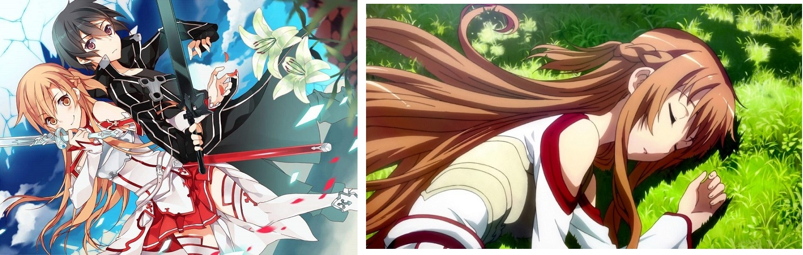

简评
- 作者在以前就已精准地预言了VR和AR等技术的发展潜力，令人叹服！基于此的冒险设定感觉很有趣。
- 不过SAO的100层还没被攻到就结束了，有点遗憾呢QAQ。由于太憎恶须乡，不想看女主受辱，也不想看桐人在ALO拼命挣扎，我就跳过了ALO部分，直接看了结尾┭┮﹏┭┮。最后他们还是幸福地在一起了啦啦啦，还有一个萌炸的孩子~
- 特别特别喜欢亚丝娜这个形象(≧o≦)！我竟然是开开心心地看她和桐人的恩爱瞬间的QAQ。她坐在桐人肩上去森林里逛的那一幕真是萌炸啦！啊啊啊好想偷偷吻一下右图！

评分
- 设定有趣程度：★★★★
- 剧情：　　　　★★★★☆
- 人物刻画：　　★★★★☆
- 深刻意义：　　★★★☆
- 作画：　　　　★★★☆
- 补完时间：　　2017.09.18（第一季）

## JOJO的奇妙冒险
*冒险/战斗/剧情*

内容介绍
- 《不灭钻石》是JOJO的第四部，讲的是乔瑟夫·乔斯达的私生子东方仗助在日本M县S市杜王町的奇遇。东方仗助的替身能力是疯狂钻石，可以修复一切没有死亡的生物体（这个能力为剧情的设计带来很多方便），但唯独不能修复自身。东方仗助将和回音·广濑康一、时空切割·虹村亿泰一起，一次次守护杜王町的安危；白金之星·空条承太郎的到来也为他们增加了一些战力。
- 《黄金之风》是JOJO的第五部，讲的是DIO的儿子乔鲁诺·乔巴纳在意大利的奇遇。他厌恶黑帮的种种丑恶行径，想加入混入黑帮高层并净化他们。乔鲁诺的技能是黄金体验，可以将任意无生命体变成任意生命。他遇到了干部 钢链手指·布加拉提，忧郁蓝调·阿帕基，性感手枪·米斯达，航空史密斯·纳兰迦，紫烟·福葛，与他们一起经历种种奇妙的事情。
- 《石之海》是JOJO的第六部，讲的是空条承太郎的女儿19岁徐伦因被男友诬陷进了女子监狱，在监狱这个“石造的大海”中为了出去重获自由而进行着不懈的努力。与母亲多年未见的父亲空条承太郎来到监狱却被夺取了记忆和替身能力，而徐伦放弃逃出监狱的机会回到监狱里和夺取了父亲灵魂的敌人斗智斗勇。

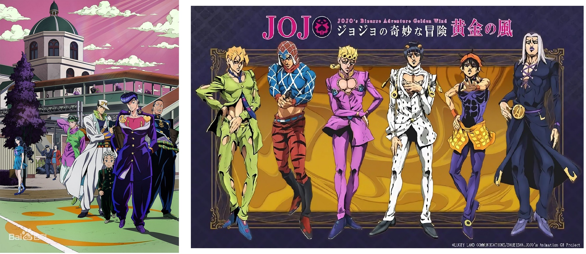

简评
- 很喜欢JOJO后几部的设定：每个人都有一个替身能力，能发挥出不同的作用。编剧充分考虑到了各种能力的应用场景，剧情就变得荒诞又合乎情理。JOJO对于人物性格的刻画也入木三分。
- 一开始看的时候完全接受不了 JOJO 的画风。浮夸怪诞的着色，还是不是给你来个变色。习惯也也就那样。
- JOJO有超高的人气，细节表达上也颇有特色——所以很多金句就是来源于JOJO的：
	+ JOJO 里面人物站立姿势都略奇怪——有难以模仿的潇洒之感。所以被称为“JOJO立”。
	+ JOJO 里“比喻”的修辞用得特别传神，于是被称为“JOJO的奇妙比喻”。“就像是穿着新内裤迎接新年来到的早晨一样爽呢”，“快让她像冬眠的鲶鱼一样安静下来”，“就像掰断铅笔时发出咔的一声一样理所当然”……
	+ JOJO，我不想再做人了！
	+ 人类的赞歌就是勇气的赞歌！人类的伟大之处就是勇气的伟大之处！

评分
- 设定有趣程度：★★★★☆
- 剧情：　　　　★★★★★
- 人物刻画：　　★★★★☆
- 深刻意义：　　★★★
- 作画：　　　　★★★☆
- 补完时间：　　2017.09.18 （第四、五季）

## 咒术回战

*冒险/战斗/剧情*

内容介绍：

+   人类产生的负面情感，化为诅咒，潜入日常生活。诅咒是蔓延于世界的祸源。
+   少年·虎杖悠仁原本过着普通的高中生活有一天，为了拯救被“诅咒”袭击的同伴，他吃下了特级咒物“两面宿傩之指”，让让诅咒寄宿于自己的灵魂之中。
+   在最强咒术师五条悟的指引下，虎杖悠仁进入对诅咒专门机关「东京都立咒术高等专门学校」。在那里他遇到了许许多多和他相同背景的队友，并踏上了无法回头的壮阔征程。

简评

+   咒术回战的设定和天狼、鬼灭之刃等差不多，在世界上弥漫着黑暗势力——诅咒，主角团不断历练和成长来击败诅咒保护人类。其中，主角团也各负绝技各具特色，同伴钉崎野蔷薇、伏黑惠，老师五条悟，校长夜蛾正道……最有趣还存在另一个学校「京都府立咒术高等专门学校」，与主角团之间亦敌亦友勾心斗角。
+   最为最强咒术师，五条悟的一切都是无敌的存在，让这部番直接变成了爽番= =

评分

- 设定有趣程度：★★★★☆
- 剧情：　　　　★★★★☆
- 人物刻画：　　★★★★
- 深刻意义：　　★★★
- 作画：　　　　★★★☆
- 补完时间：　　2019.05

## 天狼

*冒险/战斗/剧情*

内容介绍
- 这是一场狼人和吸血鬼之间的冤仇故事。
- 时间在昭和初期，背景还是人类大舞台。“猎人”是一种狩猎吸血鬼的职业，我们的主人公尤里也是其中之一。他身为狼人和人类的混血儿，被吸血鬼摧毁了故乡……
- 随着剧情的深入，尤里的身世之谜逐渐被揭开。他终于与久未蒙面的哥哥相遇，但是……
- 尤里将围绕着天狼族的圣器“天狼之匣”，与吸血鬼们展开殊死搏斗。

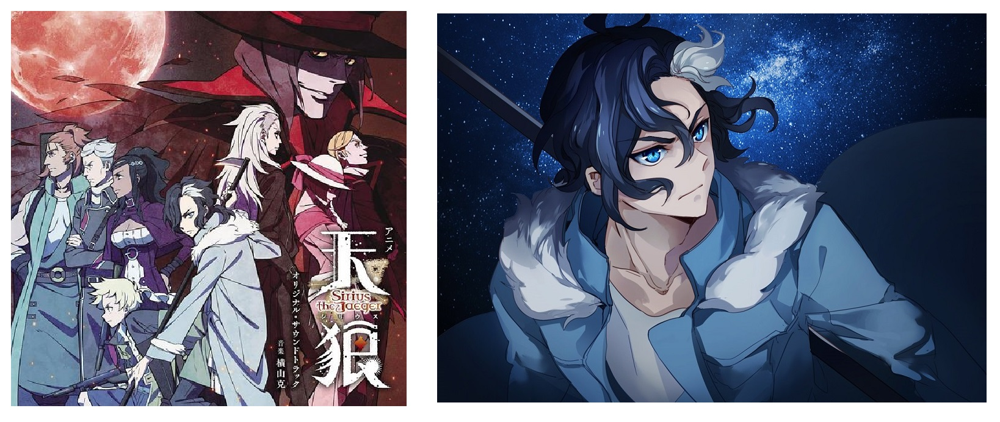

简评
- 很喜欢天狼的作画风格和剧情展开，完全被帅气的尤里所迷住。
- 狼人在危机时刻能迸发出强大的力量，这个设定也很容易叙事。
- 尤里的哥哥这个角色深入人心（即便这种剧情很套路）。他既是一个武艺高强的战士，也是一个温柔的哥哥，更是一个顾全大局、懂得牺牲的天狼族人。
- 最遗憾的就是剧情铺得太开，最后收势不住赶紧刹车，有种烂尾的感觉。
- 啊尤里真是太帅帅帅帅了！（疯狂舔屏）

评分
- 设定有趣程度：★★★★☆
- 剧情：　　　　★★★★☆
- 人物刻画：　　★★★★
- 深刻意义：　　★★★
- 作画：　　　　★★★★
- 补完时间：　　2018.09.29

## darling in the franxx
*科幻/剧情/战斗/情感*

内容介绍
- “他们拥有梦想。总有一天，飞向广阔天空的梦想。知晓被玻璃遮盖的这片天空有多么遥远。”
- 故事设定在遥远的未来。人类利用岩浆能量获取能源，并将城市移动到底下，文明高度发达。经过改造，生命可以不断延续，而生育反而成为了多余。
- 开采岩浆的时候会遇到“叫龙”的袭击。于是人类在荒废的大地上建设了移动要塞都市“种植园”。“孩子们”在那里被一步步训练起来，最优秀的那一批将会成为驾驶员，驾驶人类研制出的兵器“弗兰克斯”来对抗叫龙。孩子们始终坚信，乘坐其中，就是对自己存在的证明。
- 有一位曾被称作神童的少年。代号016，名字是广。但他似乎失去了驾驶弗兰克斯的能力。但某天，一位被称作02的神秘少女出现了。她的额头，长着两根艳丽的角。广从此踏上了拯救世界的道路……

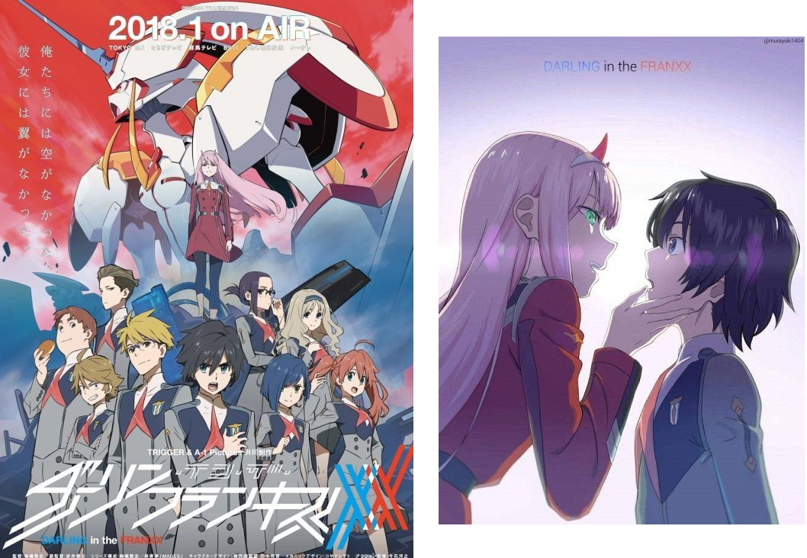

简评
- 这种战斗+情感+未来幻想的番，正合我的胃口咩……
- 国家队的世界观铺得很宏大，对未来的人类做出了合理的设想，引发观者的思考，我觉得还是挺有意义的。那时候，科技十分发达，人类选择了改造身体、抑制情感、获得永生。但是这样的永生到底有什么意义呢？缺少了情感，缺少了繁衍，还能算作是“人类”吗？而且，人类无节制开采地球的资源，导致生态不断恶化，逼出了深藏地底的“叫龙”（后来随着剧情的深入，其实叫龙曾是统治地球的高度文明的物种）。这对当今世界也是很有讽刺意义的。
- 弗兰克斯的驾驶员必须要是身体不经过改造的“孩子们”。他们从小就按战斗的标准培养，把战斗作为生命的唯一内容，且带有情感的行为都是严格禁止的。然而，13部队的孩子们，在广和莓的带领下，一起度过了一个又一个的危难，并互相产生了浓厚的情感。最后，他们在浩劫中幸存了下来，重新“学会”了耕种和繁殖，变回了真正的人类……我想，该番就想讲述这一个温情而又美妙的故事吧~
- 爱情线也很令人瞩目。主人公广和莓是青梅竹马，却一眼就爱上了“天降”女主：02（莓在与02的“竞争”中落入下风，也成为很多观者调侃的对象）。随后我们会发现，广和02小时候就有过一个在槲寄生树下的约定。此后，战斗不断，危险不断，他们的心却紧紧联结在了一起……
- 虽然堪称神作，还是有一些缺憾的。比如，战斗部分做得挺粗糙，核心元素机甲“弗兰克斯”画得特别丑，前几集的垃圾打斗画面差点把我劝退了。此外，最后几集铺得太大了，人类和叫龙竟然一致对外打外星人？感觉世界观越大，越不好合起来，坑也不容易填得好。

评分
- 设定有趣程度：★★★★☆
- 剧情：　　　　★★★★★
- 人物刻画：　　★★★☆
- 深刻意义：　　★★★★
- 作画：　　　　★★★☆
- 补完时间：　　2018.07.08

## 罪恶王冠
*科幻/剧情/战斗/情感*

内容介绍
- 2029年，日本突然爆发天启病毒；处于无政府状态的日本，受到了由超国家之间所组织成的名为“GHQ”的组织的武力介入并接受其统治。
- 樱满集本是一个普通的高中生。在一次意外中，他搭救了一个女孩楪祈，右手还得到了一种 **能取出别人体内空洞** 的力量（ 空洞 是每个人都拥有的专属技能，往往和本人的性格有关，若被取出使用则身体暂时休克）。随后他加入了葬仪社，追随着年轻首领恙神涯，为解放日本作斗争。
- 因为女二的死亡，樱满集变得不再善良。为了最终拯救日本，它选择成为残酷而冷血的“王”（印证标题“罪恶王冠”）。随着革命的不断深入，他才发现一切祸患都是源自他的父母、姐姐以及恙神涯……他也逐渐喜欢上了楪祈，虽然楪祈仅仅是他姐姐的复制品……

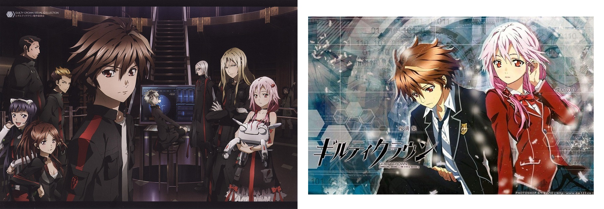

简评
- 一气呵成地追完！主流评论认为，《罪恶王冠》想象力太丰富，涉及内容太多，导致剧情逻辑混乱，最后有些烂尾。
- 但我仍然想把它提升到“神作”的高度。谈谈我印象深刻的几点：
      1. 空洞的设定。每个人都拥有属于自己的空洞，它能反应真实的内心世界；空洞各式各样，能当做武器使用；空洞被取出后人不能动弹，被破坏后人就死亡。这个设定有点像超电磁炮里的超能力，每一个人的能力都会给你带来新鲜感。而且，恙神涯能够看出一个人的空洞是什么，而樱满集能够取出一个人的空洞——这一系列的设定，让剧情变得更为复杂。
          2. 樱满集“称王”前后“丰满”的心理变化。他本来是一个很单纯、对谁都很善良的人，但在一次次事件中，认识到了社会的残酷。特别是有一次，他的部下不听命令擅自出去，喜欢他的女二用自己的空洞出去救人却惨遭不幸，从此他坚定了自己“残酷统治”的理念，坚信只有淘汰弱者才能让大部分人幸福的道理。
          3. 人物之间复杂的情感纠葛。
          4. 由“天启病毒”导出的有关“救赎”的主题。

评分
- 设定有趣程度：★★★★☆
- 剧情：　　　　★★★★☆
- 人物刻画：　　★★★☆
- 深刻意义：　　★★★★
- 作画：　　　　★★★
- 补完时间：　　2017.10.09

## 异度侵入 ID:INVADED

**剧情/战斗/推理**

内容介绍

+   利用检测杀意的系统“罔象女”搜查犯罪事件的组织，通称“仓”。然后，神探·酒井户身为“罔象女”的操作员进入犯人的深层心理“杀意世界（井）”，对事件进行推理。
+   他不断追寻着频繁发生、谜团重重的凶恶事件，以及在其中若隐若现的连续杀人鬼制造者“约翰·沃克”的影子。

简评：异度侵入属于经典的快节奏推理番，看得根本停不下来。“操作员通过睡眠来入侵犯人的精神世界进行推理”这个设定很不错。期待第二季！

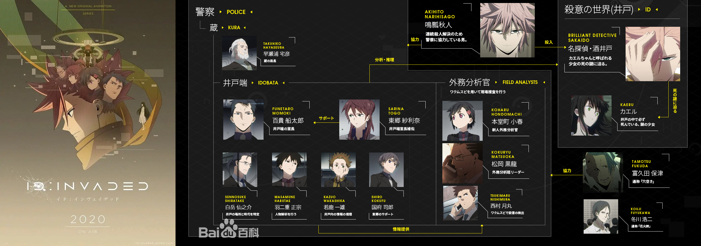

评分

- 设定有趣程度：★★★★★
- 剧情：　　　　★★★★☆
- 人物刻画：　　★★★☆
- 深刻意义：　　★★★☆
- 作画：　　　　★★★☆
- 补完时间：　　2020.07

## Fate Stay Night

*剧情/战斗/爱情*

内容介绍
- 这是宏幅巨制的 Fate 系列的其中一部动画。
- 圣杯是传说中可实现持有者一切愿望的宝物。而为了得到圣杯的仪式就被称为圣杯战争。 参加圣杯战争的7名由圣杯选出的魔术师被称为Master，与7名被称为Servant的使魔订定契约。他们是由圣杯选择的七位英灵，被分为七个职阶，以使魔的身份被召唤出来。能获得圣杯的只有一组，这7组人马各自为了成为最后的那一组而互相残杀。
- 卫宫切嗣的养子卫宫士郎，偶然地与servant中的剑士Saber订定契约，被卷入圣杯战争当中。随后，他和另一位master远坂凛“相爱相杀”，共同经历了一段惊险的圣杯争夺之战。在这期间，主人公卫宫士郎不断犹疑自己的理想，最终坚定地走向不负内心的道路。

右图是女朋友送我的 Saber 手办！

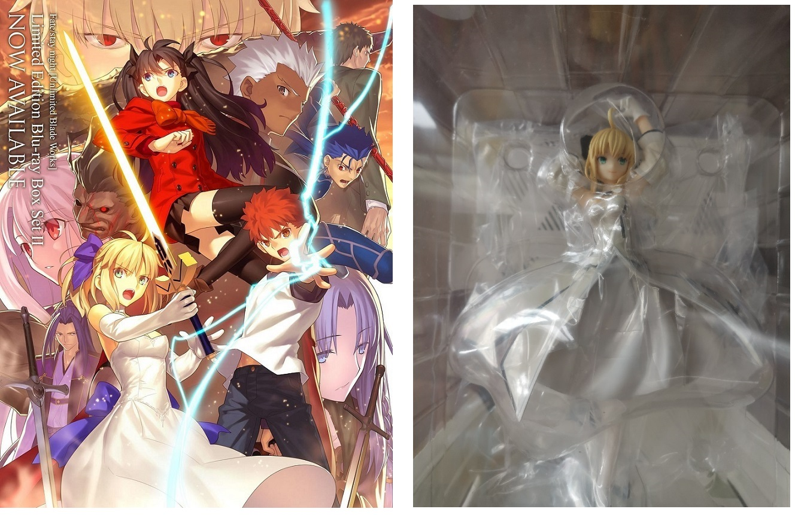

简评
- 这期的fate实在是制作精良。就连一片雪、一团火焰都能做出非常炫酷的3D效果，帧数爆炸！
- 圣杯战争的设定很宏大，蛮有意思的。可惜的是TV版集数有限，剧情转折太快，还有进步的空间。
- 最让我感受深刻的就是卫宫士郎的“理想”。被切嗣收养后，他一直有着一种“让所有人都能活着幸福”的想法。然而现实是残酷的，他也逐渐发现，所谓的“正义”，就是牺牲小部分人的幸福，来换取大部分人的幸福。但直到最后的最后，他都没有放弃，一直追寻着自己的内心。
- 哎，番里的男主怎么都这样呀！心地善良，敢于吃苦，~~虽然情商低但都可以把妹归~~。
- 下图是我曾经的桌面。为吾王和远坂凛打call！！！

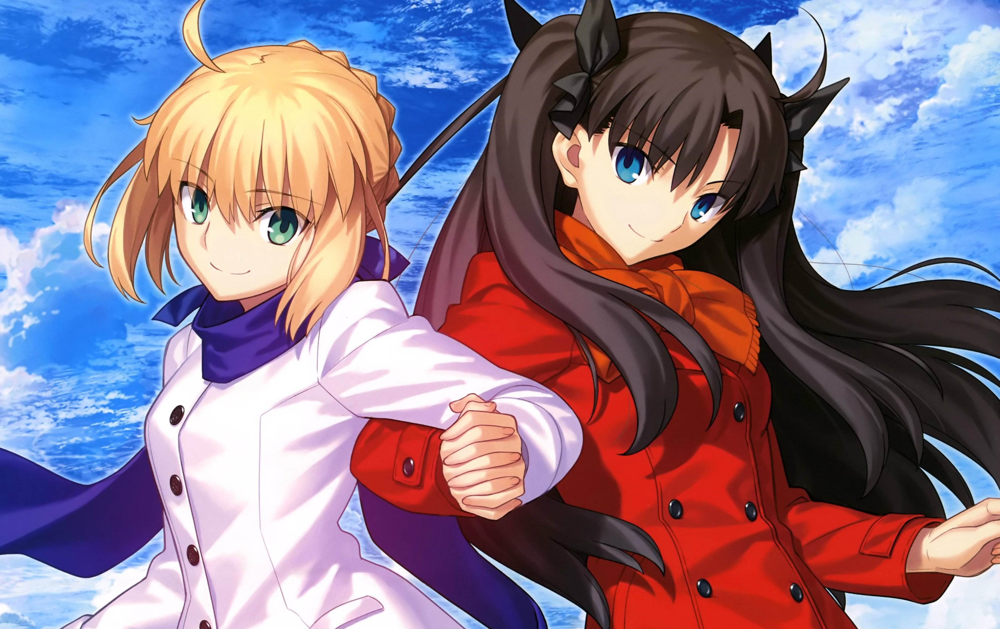

评分
- 设定有趣程度：★★★★
- 剧情：　　　　★★★☆
- 人物刻画：　　★★★☆
- 深刻意义：　　★★★☆
- 作画：　　　　★★★★★
- 补完时间：　　2017.11.03	 

## 某科学的超电磁炮
*科幻/剧情/校园*

内容介绍

- 这是魔法禁书目录的外传，重点介绍了科学侧的种种事件。动画背景是科学侧的大本营——学院都市。学生们拥有各种超能力，例如 空间移动、超电磁炮、空力使等。
- 剧情主要围绕着善良而傲娇的女主人公御坂美琴的生活展开的。御坂是少数最高级别的超能力者，她在在看似有趣的校园生活中，逐渐发现学园都市高层的阴谋，并不断追寻内心，承担自己的一份责任。

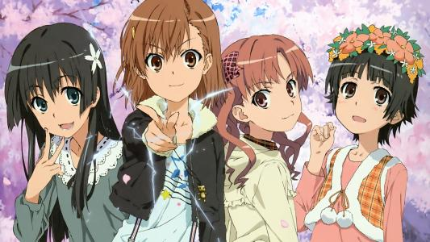

简评

- 超炮虽然是魔禁的番外，人气却比魔禁高很多。超炮减少了魔法侧的内容，更注重对校园生活的描绘、超能力的描绘以及四名主人公之间的友情。支线没有那么庞大，效果就比魔禁好很多。
- 超炮对于人物刻画也很生动。傲娇的御坂，坏坏的黑子……表白泪爷和御坂~

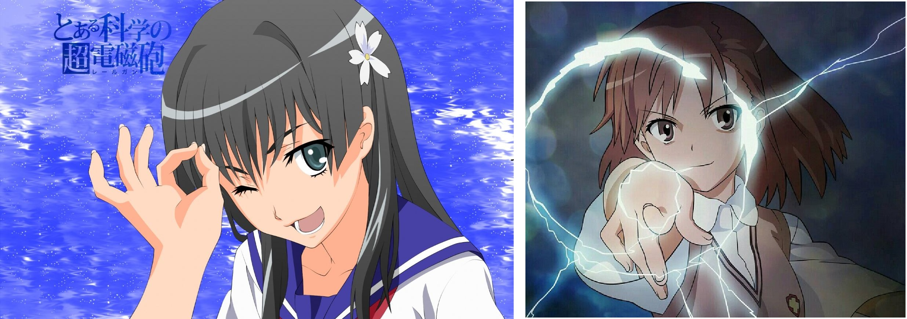

评分
- 设定有趣程度：★★★★★
- 剧情：　　　　★★★★
- 人物刻画：　　★★★★☆
- 深刻意义：　　★★☆
- 作画：　　　　★★★☆
- 补完时间：　　2017.06（第一、二季） / 2020.10.27（超炮 T）

## Overlord

*冒险/剧情/战斗*

内容介绍

- 虚拟现实体感型网络游戏《YGGDRASIL》即将迎来停服。铃木悟在等待系统强制登出时，意外穿越到了异世界，自己还变成了拥有骷髅外表的最强魔法师。NPC们开始以自己的意志行动，不止如此，纳萨力克之外展开了从未见过的异世界。住了共为了寻找过去的同伴，以公会名安兹·乌尔·恭自称，与宣誓绝对忠诚的部下一同向新的地域进军。

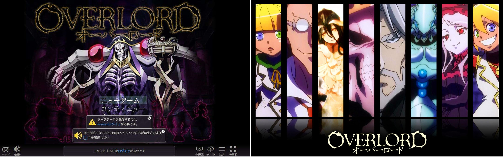

简评
- 刚开始看 Overlord 时，主人公的外貌有点劝退。不过我立刻被骨王那种坏坏的贱贱的性格所吸引。
- Overlord 的世界观极其宏大。主人公为了寻找同在异世界的现实伙伴，同时也为了巩固自己的统治，和忠诚的手下一起去征服各个世界。可以在动画里领略到作者天马行空的想象力。
- 我看这个动漫更像看“爽文”。主人公拥有无限强大的战力，依然小心翼翼地去攻略各个世界。

评分
- 设定有趣程度：★★★★
- 剧情：　　　　★★★★
- 人物刻画：　　★★★☆
- 深刻意义：　　★★★☆
- 作画：　　　　★★★☆
- 补完时间：　　2019.10（第一、二季）

## 宝石之国

*剧情/战斗/人性*

内容介绍（摘自百度百科）
- **这是关于成长的故事**——宝石中最年少的磷叶石，仅有3.5的脆弱硬度，韧性也很弱，因而不适于战斗。此外，也没有对其他工作的适应性。被看做是只会出一张嘴，完完全全的吊车尾。这样的磷叶石，在即将满三百岁时终于被交付了第一件工作。那是，名为编纂博物志的工作。磷叶石对这不起眼的工作感到不满，但他在通过自己的双眼看见世界，经历各种各样事情的同时，接连被巨大的波澜吞没。之后，他终于获得了梦寐以求的“强大”，却并非是以自己所期望的形式。
- **这是关于友情的故事**——拥有比磷叶石更为特殊的体质的辰砂。仅仅是在那里，身体就会散播毒液的辰砂，为了不给周围人添麻烦，而在夜晚独自将自己关在室内，并封锁了心灵。某天，就在即将被月人掳走时被辰砂所救的磷叶石，和他做了“接下来就该我来救你了”的约定。磷叶石一边为编纂博物志而奔走，一边为了将辰砂带往光明的世界而寻找着适合他的工作。究竟磷叶石的想法能否传达给辰砂呢？两人的约定究竟会不会有实现的一天呢——？
- **这是关于战斗的故事**——从月球飞来的神秘敌人“月人”。他们将宝石作为装饰品，特别中意美丽的宝石，将宝石们一个接一个地掳走，真实身份不明。而且被掳走的宝石被加工成为武器，反过来加害于宝石。得到月人的不断改良，变得更加强力。面对接连现身的月人，二十八位宝石能否赢得胜利？他们的真正目的是什么？这场无止境的战斗，能否画下终止符？

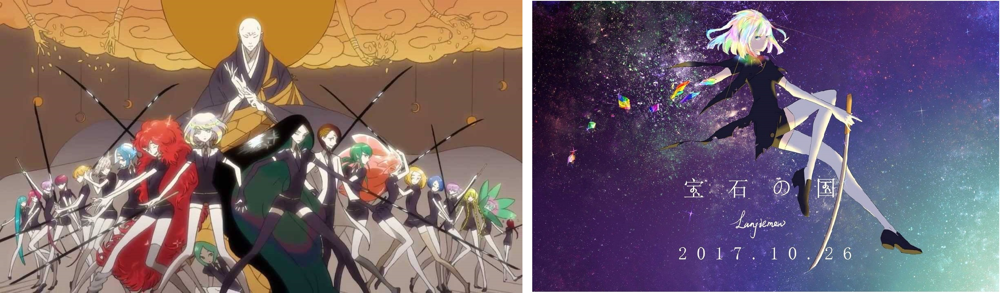

简评：被豆瓣和B站的高分吸引而看的。果不其然，高分动漫一般都以表达的内涵见长。宝石之国的设定十分有趣：讲述的是一些宝石人（都是萌妹子哈哈哈）和他们的老师之间的故事。每一种宝石都按照实际的硬度和韧度分配实力。宝石人内部分工明确。医生，裁缝，战斗者（和时不时来骚扰的月人进行战斗），议长……

主角**磷叶石**是一个十分让人揪心的家伙。这种宝石太脆了，什么都干不了。但她特别想找一份适合自己的工作。磷叶石磕磕绊绊地成长，后来因为断了手足，和金熔合被制作成了合金。她的战斗力从最低变成了最高，但她也逐渐少了那份以前的天真幼稚的性格……

评分
- 设定有趣程度：★★★★
- 剧情：　　　　★★★☆
- 人物刻画：　　★★★★☆
- 深刻意义：　　★★★★
- 作画：　　　　★★★
- 补完时间：　　2018.07.24

## 六花的勇者
*冒险/剧情/推理*

内容介绍
- 魔神即将再次苏醒，命运之神将会挑选出六名勇者，授与其拯救世界的力量。
- 自称地表最强的少年亚德雷，获选为六位“六花勇者”之一，与同为六花的彼埃纳公主娜榭塔妮亚结伴前往集合地点，试图阻止魔神复活。然而不知为何，在约定之地集结的却有七位勇者? 
- 紧接着雾幻结界随之启动，将七人全数困在森林中。发现其中混入一名内奸后，勇者们变得疑神疑鬼，人人自危。而首当其冲的，正是不具有任何身份亚德雷！他要在别人的猜疑甚至追杀中，证明自己的清白，并揭露真正的敌人……

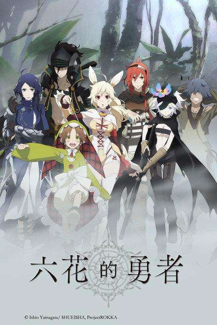

简评
- 整部番的主旋律就是推理——谁才是假冒的“六花”？
- 在推理和怀疑中，自然也会有信任。在没有确定真正的凶手之前，拥有一份来自某人的绝对信任，绝对是一件很幸福的事情！凶魔和人类的孩子“芙雷米”就是在亚德雷的信任和帮助下，才融入这个集体。而后来亚德雷被合力围攻、四面楚歌的时候，因为一个细节获得了汉斯的信任，并在其的帮助下逐渐摆脱了自己嫌疑。
- 亚德雷没有被命运之神赋予特殊能力，全靠着自身的努力才被选为六花，他那份执着追求让人动容。
- 当找出了假冒的六花后，众人离开了森林，发现又来了一个六花？？？然后就暂时完结了QAQ。小说铺得很宏大，之后还有很多的情节……想看第二季……

评分
- 设定有趣程度：★★★★
- 剧情：　　　　★★★☆
- 人物刻画：　　★★★★☆
- 深刻意义：　　★★★☆
- 作画：　　　　★★★
- 补完时间：　　2017.11.22

## **博多豚骨拉面**
*剧情/犯罪/友情*

内容介绍

- 在博多这个”民风淳朴”的城市，暗地里犯罪行为四处蔓延。只要有钱，就可以去杀手公司雇佣杀手；甚至有了“专杀杀手的杀手”这种都市传说。杀手、侦探、复仇专家、情报商人、拷问师……围绕着地下社会的男人们的故事交织汇聚。
- 主人公林宪明自小背井离乡，被训练成为一个杀手。他本是个冷酷无情的杀手，在博多却逐渐找到了友情甚至爱情（emmmm假装是吧）。随着剧情的展开，我们逐渐了解到林宪明不为人知的过去，了解到被背叛的痛苦，以及他对幸福安定生活的憧憬……

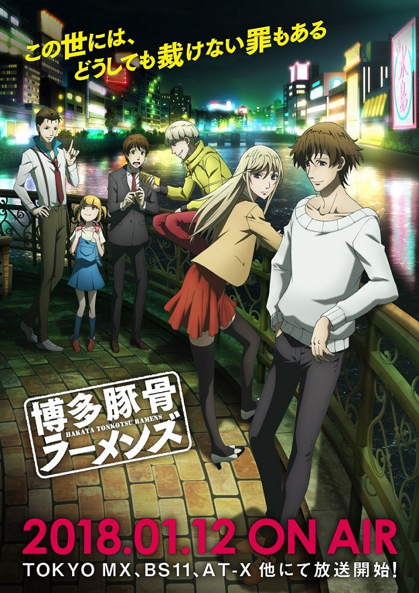

简评

- 2018年1月最火的新番之一。我本来就喜欢看这种带推理和犯罪的内容；而且设定还特有趣，讲的是一系列的杀手们的故事。
- 本番的剧情设计也是很不错的，虽然推理上不够专业，但是伏笔埋的还是挺多的，后来一一揭开的时候感觉还是挺妙的。
- 男主马场善治是一个深藏不露的高手——杀手们谈虎色变的“仁和加武士”。但是他其实很善良很温情，喜欢打棒球，被弹幕称之为“热心市民马先生”。哎呀超喜欢这个角色呢！
- 感到略可惜的是，竟然没有“女主”。另一个主角林宪明喜欢女装，大概是顺应ACG界的一种潮流，广受好评（？），但我总觉得怪怪的QAQ。emmmm果然在马场这个暖男的照顾下，林林开始越来越信任和依赖他了，甚至各种发糖QAQ……
- 主人公团体实在是太厉害了（有一种大家“团宠林林”的说法），以至他们在遇到一些危机的时候，我总是毫不担心，因为这肯定是“计划中的事”。在一些故事里，敌人在寻找帮手时甚至会找到林林的“后援团”里，让人不禁感叹“世界真是太小了”。

评分
- 设定有趣程度：★★★★★
- 剧情：　　　　★★★★
- 人物刻画：　　★★★☆
- 深刻意义：　　★★★
- 作画：　　　　★★★
- 补完时间：　　2018.04

## 从零开始的异世界生活
*奇幻/剧情/爱情*

内容介绍
- 中二的主人公菜月昴忽然被召唤到“异世界”，从此开始在这个充满魔法的世界里冒险。
- 他唯一的能力就是“读档”——死去后会退回到以前的某一个随机“存档点”。
- 他首先认识了王选候选人爱蜜莉雅，住在她支持者罗兹瓦尔的城堡里。随后他又认识了城堡里的女侍蕾姆。爱蜜莉雅参加王选时，菜月昴一直竭力帮助她，却反而招致反感。同时，他凭借自己的能力，“预知”了即将到来的灾难，并毅然踏上了联合王选竞争者、创造和平的道路……

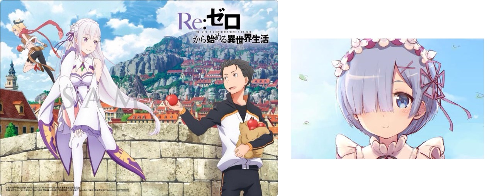

简评
- “死去读档”这个设定还是蛮有趣的。可惜的是，菜月昴没有别的能力，我只能眼睁睁地看着他四处碰壁，最后被“打会原型”。
- 比较有意思的是“cp之争”。菜月昴一直喜欢着爱蜜莉雅，但他后期常和蕾姆在一起，还冒死救了蕾姆，与蕾姆也变得非常亲近QAQ。三次元里，蕾姆的人气非常之高，可能是因为她可爱的造型和关心他人的性格。表白右图的蕾姆！！！

评分
- 设定有趣程度：★★★★★
- 剧情：　　　　★★★★
- 人物刻画：　　★★★☆
- 深刻意义：　　★★☆
- 作画：　　　　★★★
- 补完时间：　　2017.09.12

## 魔法禁书目录
*奇幻/剧情*

内容介绍

- 魔法禁书目录2。世界分为科学侧和魔法侧。在学园都市上学的主人公上条当麻，拥有一个“将所有异能之力无效化”的神奇能力。有一天，他意外“收养”了一个 脑袋里藏有十万三千本魔道书的英国清教少女，从此经历了一系列神奇而刺激的故事，目睹了科学侧和魔法侧的各种强烈碰撞……

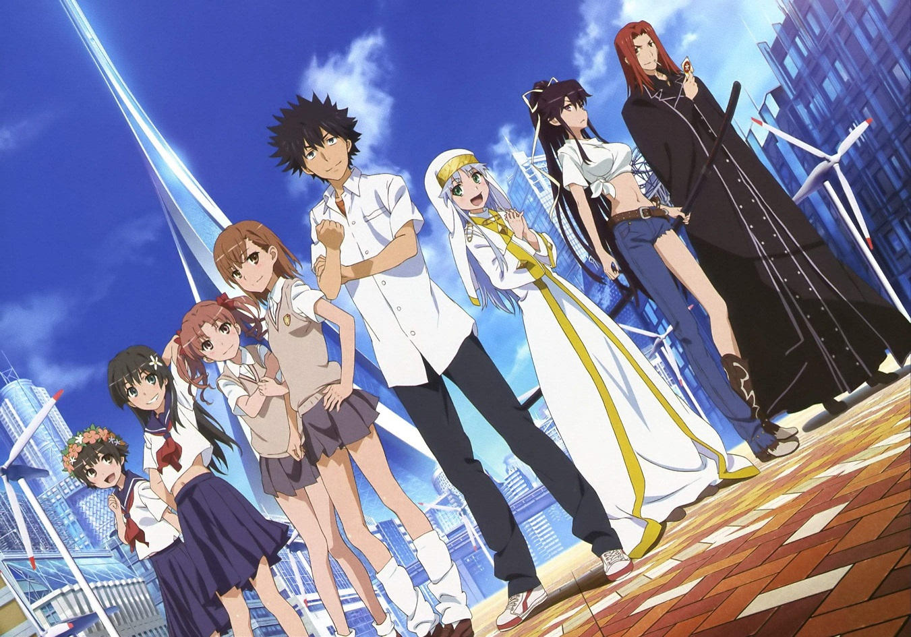

简评
- 魔禁的想象力真的特别丰富！在这大大的脑洞下，加之主人公的单纯善良，自然会发生一系列有趣刺激的故事。唯一遗憾的是，原小说规模宏大，导致世界观越来越大、想象力越来越丰富，容易让人疲乏。
- 新出的魔禁3真是惨不忍睹……剧情跳跃也太快太没逻辑了吧……

评分
- 设定有趣程度：★★★★☆
- 剧情：　　　　★★★☆
- 人物刻画：　　★★★★
- 深刻意义：　　★★☆
- 作画：　　　　★★★
- 补完时间：　　2017.06.29（魔禁1-2）