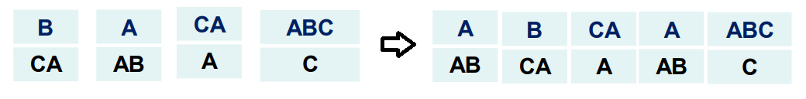
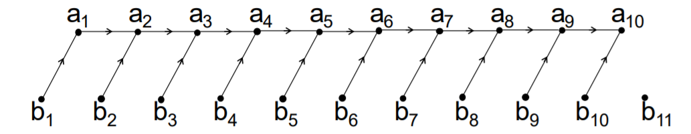
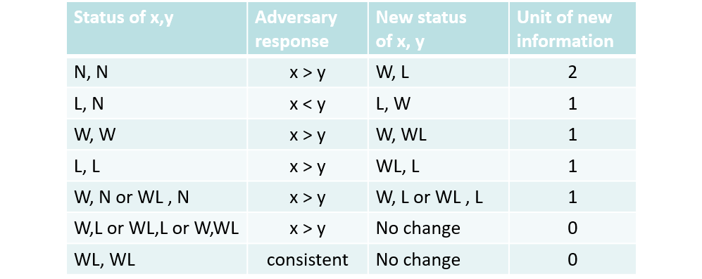
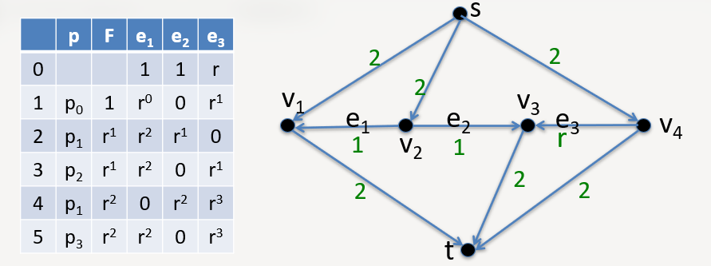
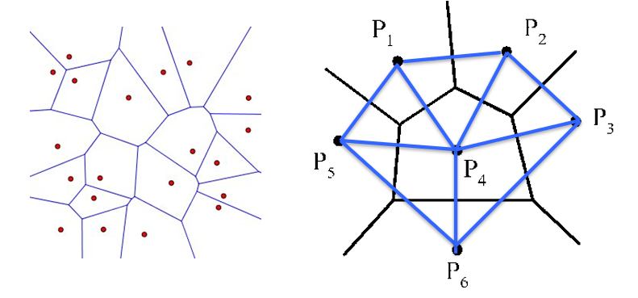
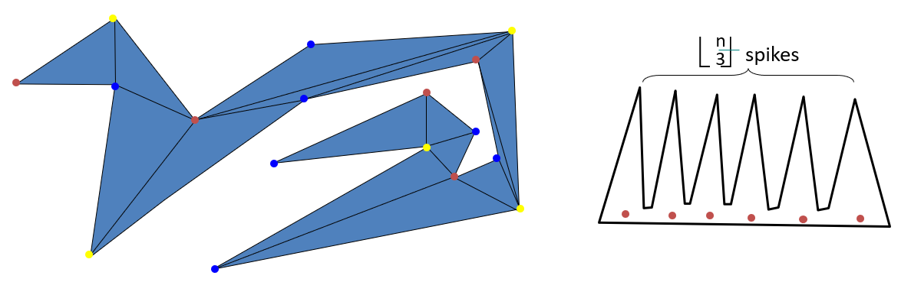

## Undecidable Problems

罗素悖论（Russell’s Paradox）是一个很著名的悖论：设集合 $S$ 是由一切不属于自身的集合所组成（即 $S=\{x|x \notin x\}$），那 $S$ 属于 $S$ 吗？

我们通常用理发师悖论（The Barber paradox）去解释罗素悖论。假设城里只有一个理发师，且任何一个不能自己理发的人会由理发师帮他理发。定义 $S(x)$ 为所有被 $x$ 理发的人的集合，则 $S(barber)=\{x|x \notin S(x)\}$ 。但是 $barber \in S(barber)$ 是否成立呢？成立和不成立都会导致矛盾。

经典的停机问题（Halting problem）就是从以上的悖论中构造出来的。于是我们用 Undecidable Problem 去描述那些不存在算法能正确判定 yes/no 的问题。判定两个 CFG 是否同构也是不能解的。

下面介绍一下 Post Correspondence Problem。给出一个 dominos 集合，每一个 domino 的上下部分各印有一个字符串，且可以翻转。现在要找一个有限的 domino 序列（每一种 domino 可以重复选），使得上下部分各自连成的字符串完全相同。左图展示了 $4$ 种 domino，右图是一个可行排列。

那么是否存在一种算法能判定一个 PCP 实例的解的存在性？答案是否定的。当字符集 $\ge 2$ 时，PCP 是一个 Undecidable Problem。PCP 甚至可以模拟图灵机的计算过程。

## Merge-Insertion-Sort

先从一个问题引入：有 $N$ 个互不相同的数，最少需要几次比较才能排出它们之间的大小关系？

首先，**基于比较** 的排序算法的复杂度下界是  $O(N \log N)$。这个结论可以用决策树（Decision Tree）证明：总共有 $N!$ 种可能的序列，每次比较最多排除掉一半，所以至少要 $O(\log{N!})=O(N\log N)$ 次。

可是归并排序也只需 $O(N \log N)$ 次比较就能使数组有序，此问题不是解决了吗？并不是。注意，我们考查的是 **精确步数**，而非在大 $O$ 意义下。目前，这个问题在很小的 $N$ 下也未研究清楚。

一个经典且有效的策略是 **Binary Comparison Sort**：每次把第 $k$ 个数二分插入前 $k-1$ 个有序的数字里（其实就是插入排序）。总步数是 $\sum \limits_{k=1}^N \lceil \log_2k \rceil$。

上述做法在 $N=5$ 时就失败了。几乎所有算法都需要 $8$ 步才能确定顺序，但最优解只要 $7$ 步：
1.   首先任意挑 $4$ 个数字分两组比较，设比较完后的 $5$ 个数字是 $b_1<a_1,b_2<a_2,b_3$
2.   比较 $a_1$ 和 $a_2$ 的大小，不妨设 $a_1<a_2$。
3.   将 $b_3$ 插入 $b_1<a_1<a_2$ 这条链里，只需要 $2$ 步。
4.   将 $b_2$ 插入 $(b_1,a_1,b_3)$ 这条链里。因为我们知道 $b_2<a_2$，所以也只需要 $2$ 步。

**Merge-Insertion-Sort** 从这个例子受到启发进行递归设计的，具体操作如下：

1.   首先将数字分成 $\lfloor N/2 \rfloor$ 个组两两比较。如果是奇数那就多出一个数字。设比较完的序列是 $b_i<a_i(i \in 1..N)$ ，以及可能存在单个 $b_{N/2+1}$
2.   对于 $a$ 这 $N/2$ 个数调用一次小规模的 Merge-Insertion-Sort 使其有序。
    
3.   依次把 $b$ 序列插入到主链上。具体地，首先分别花 $2$ 步把 $b_3,b_2$ （通过二分）插入到 $(b_1,a_1,a_2)$ 的链上；然后花 $3$ 步把 $b_5,b_4$ 插入到链上；然后花 $4$ 步把 $b_{11}\sim b_6$ 插入到链上……

现在我们来分析一下 Merge-Insertion-Sort 的具体步数。

1.  设 $F(N)$ 是 $N$ 个数的比较次数，可知 $F(N)=\lfloor N/2 \rfloor+F(\lfloor N/2 \rfloor)+G(\lfloor N/2 \rfloor)$，其中 $G(N)$ 表示将 $N$ 个数按上述顺序插入链中的方案数。
2.  下面我们来计算一下 $G(N)$。在插链这步，如果把相同步数的分到同一组，那么这个序列是 $(0,2,2,6,10,\dots)$，前缀和数列 $(1,1,3,5,11,\dots)$ 满足 $t_{k-1}+t_k=2^k$。
3.  若 $t_{k-1} \le m \le t_k,G(m)=(t_1-t_0)+2(t_2-t_1) \dots +k(m-t_{k-1})=km-\sum t_i$
4.  注意到 $\sum \limits_{i=0}^{m-1} t_i=\lfloor 2^{k+1}/3 \rfloor$
5.  最后我们可以得到 $F(N)=\sum \limits_{k=1}^N \lceil \log_2(3k/4) \rceil$

我们再来考虑一下这个问题的 Lower_bound。总共有 $N!$ 种可能的序列，通过决策树（**Decision Tree**）定理我们得到下界是 $\lfloor \log_2{N!} \rfloor$。

下面我们来感受一下 Binary Comparison Sort，Merge-Insertion-Sort 和 Lower_bound 的效果：

| 算法 | 4  | 5  | 6  | 7  | 8  | 9  | 10 | 11 | 12 |
| ----|----|----|----|----|----|----|----|----|----|
|LB|5|7|10|13|16|19|22|26|29|
|MI|5|7|10|13|16|19|22|26|30|
|BC|5|8|11|14|17|21|25|29|33|

## Adversary Argument

除了 Decision Tree 外，我们有一个强有力的工具 Adversary 来分析一个算法的**下界**。它的核心思想是：Release the least information and change the scenario to make the algorithm work hard.

先来考虑一个 **Find Second Maximum Element** 问题。我们都知道，找最大值至少需要也仅需要 $N-1$ 次比较；如果我们重复这个过程，在剩下数里面再找一个最大值，得到该问题的比较次数上界：$2N-3$

那么如何分析出下界呢？首先我们观察一个很有趣的结论：**次大值只能在那些与最大值比较过的数字里产生**。所以该问题的下界其实是 $N-1+M-1$，其中 $M$ 是曾经与最大值比较过的数字。假设回答的策略已经确定，那么最终对下界分析产生影响的 $M$ 其实是该策略面对所有算法后取得的最小值，即 $M_{min}=\min\limits_{a \in A}M_a$。为了分析出原问题 **更紧** 的下界，我们要找到一种策略，使得它的 $M_{min}$ 尽可能大 。

现在我们要借助 Adversary 分析出尽量大的 $M_{min}$ 。考虑这样一种策略：

1.  给每一个数字 $x$ 一个“战胜指数” $g(x)$，初始时 $g(x)=1$。
2.  假设某一次询问的数对是 $(x,y)$ ，Adversary 采用的回答是：若 $g(x) \ge g(y)$，那么回答 $x>y$，且执行 $g(x) = g(x)+g(y),g(y)=0$，反之亦然（这个策略有点像并查集的按秩合并）。

注意到，无论你用什么算法来给出 $(x,y)$，每次比完一组后，$g(x)$ 都不可能超过原来的 $2$ 倍，而最终时候最大值 $z$ 必然满足 $g(z)=N$，所以 $z$ 至少经过了 $\lceil \log N \rceil$ 次比较后才能确认。即该策略的 $M_{min}=\lceil \log N \rceil$。顺着之前的思路，要确定次大值，必须把这些曾经输掉的数字之间再比试一次。所以得 **Find Second Maximum Element 问题的一个比较次数下界是 $N+\lceil \log N \rceil-2$**。

再来考虑一个 **Median** 问题：有 $N$ 个互不相同的数，最少比较几次可以知道这些数里的中位数？ 

显然排序问题的比较次数是其上界。那么下界是什么样的呢？想象一棵 $N$ 个点的树，树边表示我们已知的大小关系。我们幻想的最优情况是：median 这个点成功地把其他点区分开了。即对于一个小于它的邻居，它子树下面也是递减关系；对于一个大于它的邻居，它子树下面也是递增关系。

称 $(x,y)$ 为 **Crucial Comparison**，如果它满足 $x>y \ge median$，或者 $x<y\le median$ 。反之就是 **Non-Crucial Comparison**。可以发现，如果去对应那 $N$ 个点的树，CC 是树边而 NCC 是非树边。

Adversary 提供这样一种策略：使每次询问得到的结果尽量都是 Non-Crucial Comparison。具体地，设状态 $N$ 表示还未分配，$S$ 表示这个数已小于 Median，$L$ 表示这个数已经大于 Median。对于询问的 $(x,y)$：
+   如果状态是 $(N,N)$，分配 $(S,L)$
+   如果状态是 $(N,L)$ 或者 $(N,S)$，将 $N$ 分配成余下那种状态。
重复这样的分配方案，直到 $(N-1)/2$ 个 $L$ 或者 $S$ 被分配出去了为止。如果按这种方式分配，最终得到的树里至少有 $(N-1)/2$ 条非树边。再加上 $N-1$ 条树边，得 **Median 问题的比较次数下界是 $3(N-1)/2$**

来看 Median 问题里 $N=5$ 的例子。之前说过，排序的下界是 $7$ 次，但 Adversary 提供更紧的 $6$ 次的下界。事实上，只需 $6$ 次比较的算法确实能构造出来：
1.  先花 $3$ 步决策出 $(a<b<d,c<d)$。
2.  此时我们知道 $d$ 必然比中位数大，丢掉 $d$。
3.  把 $e$ 和 $c$ 拿去比较，再把大者和 $b$ 去比较。花了 $2$ 步可得 $a<b<e,c<e$。
4.  最后花 $1$ 步比较 $b$ 和 $c$，大者就是中位数。

我们再来设计一种 **普适的算法** 求解 Median 问题，使得比较次数尽量少。一般化问题，设 $Select(S,k)$ 表示集合 $S$ 里第 $k$ 小的数，同时设 $W(N)$ 表示 $|S|=N$ 时的  $Select(S,k)$ 比较次数。
1.  将 $S$ 按每组 $5$ 个划分，分别求中位数。这一步比较次数是 $6(N/5)$ 的。
2.  递归调用 $W$ 求这 $N/5$ 个中位数的中位数 $m^\ast$，比较次数 $W(N/5)$。
3.  以 $m^\ast$ 为关键字将 $S$ 划成两部分 $S_1,S_2$。如果 $m^\ast$ 不是中位数：
    +  如果 $k \le |S_1|$ 就调用 $Select(S_1,k)$
    +  否则调用 $Select(S_2,k-|S_1|-1)$
4.  任何情况下 $|S_1|,|S_2| \le 7N/10$，所以 $W(N)=6N/5+W(N/5)+2N/5+W(7N/10)$

可以用数学归纳法证明 $W(N) \le 16N$。也就是说，**Median 问题的比较次数上界是 $16N$**。

再来看一个 **Find Max and Min** 问题。 一个很优秀的分治做法是：
1.  设 $f(S)$ 表示 $S$ 集合的最大值和最小值。
2.  如果 $|S|=2$，只要比较一次就能返回结果。
3.  若 $|S| > 2$，将其划分为 $S_1$ 和 $S_2$ 两个集合，分别求 $f(S_1)$ 和 $f(S_2)$，把两者的最大值求一个 $\max$，把两者的最小值求一个 $\min$。所以步数 $T(N)=2T(N/2)+2$。

最后解得 $T(N)=\lceil \frac{3}{2}N \rceil-2$。现在我们用 Adversary 证明这是下界。

定义四种状态 $\mathrm{(N,Win,Loss,Both)}$。其中所有数字都会经过 $\mathrm{N}$ 到 $\mathrm{W/L}$ 的转变，还有 $N-2$ 个数字会经过从 $\mathrm{W/L}$ 到 $\mathrm{B}$ 的转变，总信息量是 $2N-2$。我们希望询问者知道的信息量尽量得少，具体决策如图：

+   如果比较 $\mathrm{(N,N)}$，被迫让其获得 $2$ 信息量变成变成 $\mathrm{(W,L)}$
+   如果比较 $\mathrm{(N,W)}$，持续让 $\mathrm{W}$ 赢，获得 $1$ 信息量变成 $\mathrm{(L,W)}$
+   如果比较 $\mathrm{(W,L/B)}$，保持，让其徒劳无获。
+   如果比较 $\mathrm{(W,W)}$，被迫让其获得 $1$ 信息量变成 $\mathrm{(W,B)}$

至多有 $N/2$ 组比较带来了 $2$ 的信息量。剩下 $N-2$ 的信息量每个至少消耗一次比较。所以不管以怎样的策略询问，比较次数都不会少于 $\lceil \frac{3}{2}N \rceil-2$，即这就是该问题的下界。

再看一个 **Find x in Matrix**  问题：有一个 $N \times N$ 的数字矩阵，矩阵里的数字都互不相同，且每行从左到右和每列从上到下都严格递增。用尽量少的比较次数找到 $x$，每次返回 $>,<,=$。

考虑这样一个算法：从右上角开始询问，假设当前的数字是 $e$。若 $e < x$ 就向下走，若 $e > x$ 就向左走，这样总能找到 $x$。可以发现，最坏情况下要走 $2N-1$ 次。

现在用 Adversary 证明这就是下界。

$$\begin{matrix}   1 & 2 & 3 & 4 & 5 & 6 & 8 \\  2 & 3 & 4 & 5 & 6 & 8 & 6 \\  3 & 4 & 5 & 6 & 8 & 6 & 5 \\  4 & 5 & 6 & 8 & 6 & 5 & 4 \\ 5 & 6 & 8 & 6 & 5 & 4 & 3 \\ 6 & 8 & 6 & 5 & 4 & 3 & 2 \\ 8 & 6 & 5 & 4 & 3 & 2 & 1\end{matrix}$$

上述矩阵给出了一个形式化构造（以 $N=7$ 举例）。任何一个 $6$ 或者 $8$ 都有可能被替换成 $7$ ，所以 $x$ 必须和这些数字都比较一遍。那么如果是 $N \times N$ 的，得出下界是 $2N-1$。

再来看一个 **Merge Sorted Sequence** 问题。将两个长度为 $N$ 的有序序列合并成一个有序序列，最少需要几次比较？直觉告诉我们，归并排序的 $2N-1$ 次比较最少。下面用 Adversary 来证明这一点。

构造数列 $X,Y$ 使得 $Y_i<X_j$ 当且仅当 $i<j$（比如 $X_i=2i-1,Y_i=2i$）。最终合并完后的序列是 $X_1,Y_1,X_2,\dots,X_n,Y_n$，假设存在一个算法能在 $2N-2$ 步（或更少）完成，那么至少存在一个 $i$ 满足：
+   如果 $i \ge 2$，$X_i$ 没有和 $Y_i$ 和 $Y_{i+1}$ 比较
+   如果 $i=1$，则 $X_1$ 没有和 $Y_1$ 比较。

现在我们把 $X_i$ 和 $Y_i$ 交换，依然符合题目条件，但是该算法失败了。所以 $2N-1$ 次是比较下界。

## Unbound Searching

假设有这样一个定义在正整数域上的函数 $F(x)$ ：

$$ F(x)=\left\{ \begin{aligned} & 0 \quad &0<x<N \\ & 1 \quad &x \ge N \end{aligned} \right. $$

如何用最少的步数来确定 $N$ 的大小？

最先想到的肯定是二分，但是这个问题里 $N$ 可能无限趋向于 $+\infty$。于是提出了下面这个算法：

定义 **Binary search** $B_1$：

1.    从小到大询问 $F(2^i-1)$（即 $F(1),F(3),F(7),\dots$）直到 $F(2^m-1)=1$
2.    现在我们知道 $N \le 2^m-1$，即 $m = \lfloor \log_2N \rfloor + 1$
3.    在 $[2^{m-1},2^m-1)$ 上进行二分查找，需要 $\lfloor \log_2N \rfloor$ 步。
4.    总步数 $S_{B_1}=2\lfloor \log_2N \rfloor + 1$

可不可以做得更好呢？我们可以用迭代的方法更快地算出 $m$！

定义 **Double Binary search** $B_2$： 
1.  套用 $B_1$ 去求出 $m$，需要 $2 \lfloor \log_2m \rfloor+1$ 步。
2.  重复 $B_1$ 的步骤 $2\sim3$，总步数 $S_{B_2}=\lfloor \log_2N \rfloor + 2 \lfloor \log_2(\lfloor \log_2N \rfloor+1) \rfloor + 1$

那么对于 **k-Binary Search** $B_k$：$S_{B_k}(N) = L^1(N) + L^2 (N) + \dots + L^{k-1}(N) + 2L^k (N) +1$

现在还有一个问题：如何找出我们想要的 $k$ ？设 $g(n)$ 满足：

$$ g(n)=\left\{ \begin{aligned} & 2 \quad &n=1 \\ & 2^{g(n-1)}-1 \quad &n \ge 2 \end{aligned} \right. $$

我们从小到大尝试 $g$ 数列直到 $F(g(k))=1$

## Reduction

Reduction 是个经典的话题。来看一个经典的 **Integer Distinctness Problem**。

给出一个数的集合 $\{x_1,x_2,\dots,x_n\}$ ，要用尽量少的比较次数，判断其中是否有重复的元素。

显然可以通过 sorting 解决这个问题。神奇的是，我们可以反过来证明 **sorting** $\propto$  **IDP**。

1.  假设 $x$ 已经从小到大排好序了，一个结论是：任何解决了 IDP 的算法必然比较过所有 $(x_i,x_{i+1})$ pair。证明很简单：如果 $x_j$ 和 $x_{j+1}$ 没有比较过，将改成 $x_j$ 改成 $x_{j+1}$ 。算法输出不变，但是结果和之前不同了。
2.  现在我们开始规约。本来手里有一个 sorting 问题，我们先求解这个序列的 IDP 问题。
3.  求解 IDP 过程中涉及了若干次比较。把这些比较的结果都保留下来，建成一个有向拓扑图，最后对其跑线性的拓扑排序。由结论 $1$，所有相邻的 pair 必然出现在图中，所以必然能恢复完整的 sorting 结果。
4.  所以我们用了和求解 IDP 一样的复杂度，把 sorting 规约到了 IDP。

再来看一个连续规约的例子：**3-SUM $\propto$ Collinearity $\propto$ Segment Splitting**。  

+   3-SUM 问题：有 $N$ 个不同的数，是否能选出其中的三个数  $(a,b,c)$ 使得 $a+b+c=0$
+   Collinearity 问题：平面上有 $N$ 个点，是否能选出三个共线的点。
+   Segment Splitting 问题：平面上有 $N$ 条线段，是否存在一条直线能将不触碰地将他们划成非空两部分。

3-SUM $\propto$ Collinearity 有两种证明方法。一是把原来 3-SUM 里的每个点 $a$ 对应到平面上 $(a,a^3)$ 这个点。 如果 $a+b+c=0$，充要于 $(b^3-a^3,b-a) \times (c^3-a^3,c-a)=0$，反之亦然。二是把原来 3-SUM 里的每个点 $a$ 对应到平面上的 $(a,0),(a,2),(-\frac{a}{2},1)$ 三个点。如果 $a+b+c=0$，则 $(a,2),(-\frac{b}{2},1),(c,0)$ 共线，反之亦然。注意这两个方法都要用到斜率，所以都有 $(a,b,c)$ 三个数互不相同的前提。 

Collinearity $\propto$ Segment Splitting 可以沿用上面的证明二。我们在 $y=0,1,2$ 上画三条线，对于每个 $a$，在对应三个点处“开一个小洞”。这样如果 Collinearity 有解，我们就得到了穿过所有小洞的直线，反之亦然。

因为 3-SUM 是很多问题简化版本，对其的研究突破至关重要。可惜的是，人们已经证明：对于任何一个 $\epsilon > 0$, 不存在 $O(N^{2-\epsilon})$ 的 3-SUM 解法。

3-SUM 还有一个变种问题 3-SUM'：选数时可以重复选，即 $a,b,c$ 可以相同。看上去变得更难了？实际上它比 3-SUM 更简单，因为我们可以轻松构造出  **3-SUM'** $\propto$ **3-SUM**：对于 3-SUM' 里的每个数  $x$ ，映射 3-SUM 里的 $\{a,a-3max,a+3max\}$ 三个数（其中 $max$ 是原数集里最大的数字）。

再来看一个厉害的 Reduction：**矩阵乘法和矩阵求逆是可以相互规约的**。这里只证明前者规约后者。对于矩阵乘法 $A \times B$，我们可以花 $O(N^2)$ 的时间构造出以下 $3N \times 3N$ 的矩阵。注意矩阵求逆后包含 $AB$ 这一项。
$$
D=
\begin{pmatrix}
I_n & A & 0 \\
0 & I_n & B \\
0 & 0 & I_n
\end{pmatrix}
\quad 
D^{-1}=
\begin{pmatrix}
I_n & -A & AB \\
0 & I_n & -B \\
0 & 0 & I_n
\end{pmatrix}
$$

## Flow and Match

**Ford-Fulkerson** 算法是最朴素的最大流算法：每次任意找一条增广路进行增广。值得注意的是，该算法可能永远也不会停止，下图就是一个例子。$r^2 = 1 - r, r=\frac{\sqrt 5 – 1}{2}\simeq 0.618$。更糟糕的是，该算法甚至没有收敛到最大流，因为 $1 + 2(r^1 + r^2+ r^3 + …)=3+2r<5$ 

**Edmonds-Karp Algorithm** 算法改进了上述过程。它先用 BFS 对点进行标号，每次选择最短的增广路。一条增广路上至少存在一条边 $e=(u,v)$ 满足它的流量等于本次新增的流量，我们称之为 critical edge（其实就是增广路上残余流量最少的那些边）。critical edge 会使边完全反向（不存在原方向的流量了），当它下一次又成为 critical edge 时，增广路的长度至少增加 $1$。每条边最多只会成为 critical edge $N$ 次，一共有 $M$ 条边，每次增广复杂度是 $O(M)$，所以总复杂度是 $O(NM^2)$

我们熟知的 **Dinic** 算法其实是 EK 算法的多路增广版本。Dinic 引入了分层机制——每次把到终点距离相同的最短路径同时增广，使得复杂度降成 $O(N^2M)$，而实际速度也很快。下面我们来证明一下：把 Dinic 应用到匹配问题上最多只有 $\sqrt N$ 个 Stage。

+   我们用 $V_i$ 表示从起点开始顺着流走 $i$ 步能到的点的集合。
+   假设最终的最大流是 $f$，我们有 $|V_i| \ge f$（想要流这么多，每一层至少需要这么多点）。
+   对以上不等式求和。假设起点到终点的距离是 $D$，则 $D \le |V|/f$。
+   如果 $f \le \sqrt {|V|}$ 就已经证完了，因为每个阶段至少增加 $1$ 的流量。
+   如果 $f > \sqrt{|V|}$，根据以上性质，$D \le \sqrt{|V|}$。每轮增广完后下次距离至少加 $1$，所以最多加 $\sqrt{|V|}$ 次。

[知乎里](https://www.zhihu.com/question/266149721) 讨论了如何构造出让 Dinic 跑 $\Theta(N^2M)$ 的图。

说起匹配问题，还不得不提到一个 **霍尔定理**。对于左右各 $N$ 个点的匹配问题来说：
$$
\forall_{P \in L}|Right(P)| \ge |P| \Leftrightarrow \text{|Match(L,R)|=|L|=|R|}
$$
右推左是显然。左推右可以反证：考虑网络流跑完的残量网络，取 $P$ 为 $S$ 割里所有左侧点 。

## Computational Geometry

凸包这个话题想必大家都不陌生。

通过构造点 $(x_i,x_i^2)$，我们可以把排序问题规约到求凸包，也就证明了其下界是 $O(N\log N)$。

因为凸包的计算几何里的应用很广，如何构建凸包是一个脍炙人口的话题。在算法竞赛里，我们一般用 sort +扫两遍分别求上下凸壳的方法，速度快代码短。下面再来介绍几种有趣的构建方法：

1.  Jarvis March - **gift wrapping**：从下面的点 $s$ 开始，每次枚举一个点 $t$  使得 $(s,t)$ 这条线段在所有点的右侧。把 $t$ 加入集合并重复这一过程。这个算法很是直观啊，复杂度就是 $O(Nh)$。
2.  我们同样熟悉的 **Graham Scan** 其实就是对上述算法的优化，用极角排序把复杂度降为 $O(N \log N)$。
3.  **Quickhull**：初始时找到 $x$ 最小和最大的两个点连上一条线 $(p,q)$。线的两侧分别做一遍，每次找到一个距离线最远的点 $r$，连上 $(p,r)$ 和 $(q,r)$ 并重复这个过程。平均复杂度 $O(N\log N)$，最坏复杂度 $O(N^2)$。
4.  **分治算法**：每次按 $x$ 大小关系分成两半，各自求凸包并把凸包合并。复杂度 $O(N \log N)$。

下面我们再来看一个 **Line Segment Intersection** 问题：给出平面上的 $N$ 条线段，求它们两两的交点（如果有的话）。直接暴力是 $O(N^2)$ 的，但是如果交点很少，我们就想要找一个更快的做法。

维护一条垂直于 X 轴的 **sweeping line**（扫描线）。从左往右扫，保证扫描线左边的交点已经全找到了。这里有一个小结论：最近相交的两条线段，它们一定会与扫描线都有交点，而且这两个交点是 **相邻** 的。所以我们用平衡树按顺序维护所有与扫描线产生交点的线段。我们再用一个堆维护一些关键节点，包括 一条线段的终点位置 和 两条在扫描线上相邻线段的交点。每次弹出最近的关键节点（把扫描线移到那里），更新扫描线上（平衡树里）的点，同时也更新堆里的点。总复杂度是 $O((N+K)\log N)$，$K$ 是交点个数。

##  Voronoi Diagram

V 图是分析和处理平面图的一个有力的工具，而且他的定义也十分自然。

所谓 **V图**，就是把平面（无限或者有限）分割成若干个部分。初始时有 $N$ 个互不相同的点 $s_k$，每一个区域 $C_k$ 就是由所有到 $s_k$ 最近的点构成。这个定义比较拗口，我们来看个直观的例子。

结合左图的例子我们还能发现，每一段区域的边界都是一组 $(s_i,s_j)$ 的垂直平分线。如果我们在这些 $s$ 之间连上线，就可以得到右图这个形状。没错，它就是外围 $s_k$ 构成的凸包的三角剖分！

定理：若 $N \ge 3$，V 图最多有 $2N-5$ 个顶点和 $3N-6$ 条边。

证明：假设有 $v$ 个顶点和 $e$ 条边。

+   欧拉定理：$(v+1)-e+N=2$
+   注意一个顶点至少和三条边关联，所以 $3(v+1) \le 2e$
+   由以上两个式子即可推出 $v \le 2N-5$ 且 $e \le 3N-6$

知道了 V 图的点数和边数都是 $O(N)$ 的，我们就可以放心地用 V 图来做各种分析了。

+   $O(N)$ 找到 $N$ 个点里最近的 Pair：直接枚举 V 图三角剖分里的那些边。
+   $O(N)$ 求 $N$ 个点的凸包：把外围的无限区域里的点顺次连接起来即可。

所以问题的关键是：我们如何高效地建出 $N$ 个点 $s_i$ 对应的 V 图？还是用我们的万金油：分治算法。每次合并都是线性的，所以 V 图可以 $O(N \log N)$ 建出来。具体合并细节有点麻烦。

下面我们来看一个经典的 **Art Gallery Problems**：（凹）多边形内最少布置多少守卫才能看到所有位置。

注意这个问题已被证明是 NP-Hard 的，所以我们尝试求一些紧的界。首先一个显然的上界是 $N-2$，因为我们可以在三角剖分后每个三角形的中心放一个守卫。至于为什么 $N$ 个点的（凹）多边形能剖分成 $N-2$ 个三角形呢？可以用归纳法证明：

1.  $N=3$ 时是 $1$ 个。
2.  $N>3$ 时，设 $u$ 是最左边的点，$v,w$ 是它相邻的点。如果连接 $(v,w)$ 后不与别的边相交，就把三角形 $(u,v,w)$ 切下来归纳。否则我们在相交侧的点里找一个与 $u$ 最近的点 $u'$，用 $(u,u')$ 把多边形切割成两半，每一半调用结论归纳。

现在我们再来证明一个更紧的上界。如果把多边形（任意一个）三角形剖分后的边也连上去，我们可以用对偶证明，新图的顶点是可以三染色的。更厉害的是，如果我们在三染色的任意一种颜色处放置守卫，均能覆盖整个多边形！那么挑一种出现次数最少的颜色，我们可以得到 Art Gallery Problems 的上界：$\lfloor \frac{N}{3} \rfloor$。

事实上我们还能构造出达到这一上界的多边形，见右图。