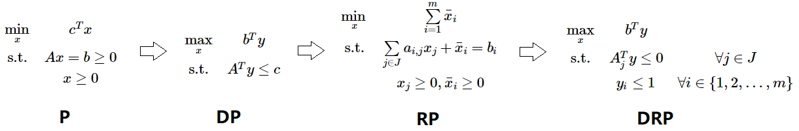
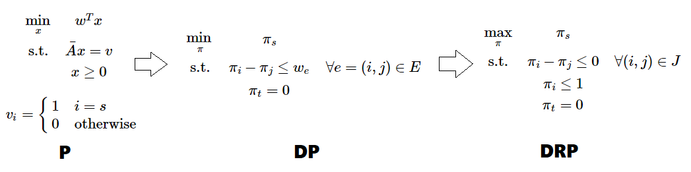
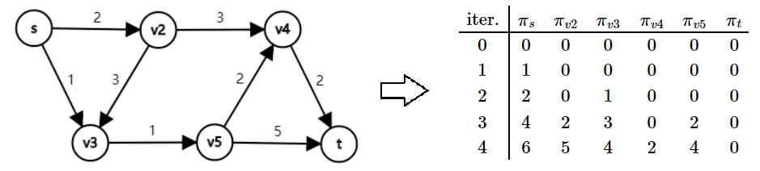
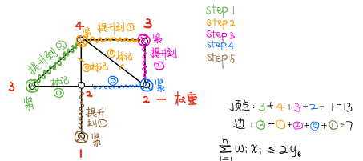

原计划基于 [TSR 学长的博客](https://www.cnblogs.com/tsreaper) 补充知识点的，由于《应用运筹学基础》将“上课笔记整理”也作为了考核方式之一，于是我把 TSR 学长的部分内容也结合进来了。这篇文章是系列之二，还有两个系列分别是：

+   [线性规划理论](https://jiangshibiao.github.io/Linear-Programming-Theory)
+   [近似算法选讲](https://jiangshibiao.github.io/Selection-of-Approximation-Algorithm)

## 原始对偶方法

基本思想：
- 灵活运用了互补松弛条件 $(y^{\ast {\rm T}}A-c^{\rm T})x^\ast=0$ 且 $y^{\ast {\rm T}}(Ax^\ast-b) = 0$.
- 给出一组对偶的解，强行去满足互补松弛条件。每次观察 $x$ 是否满足原问题的约束，若不满足就不断地修正 $y$。

**原始对偶算法** 流程

1. 我们先列出原问题（**P**）的对偶问题（**DP**），并找到 $y$ 的一组可行解。
   + 如果 $c \ge 0$，直接取 $y=\pmb{0}$ 即可。
   + 否则我们给原问题增加一个变量与一条约束 $x_1 + x_2 + \dots + x_n + x_{n+1} = b_{m+1}$，其中 $b_{m+1}$ 需要足够大，至少要大等于 $x_1 + x_2 + \dots + x_n$ 可能的最大值。
   + 加入新约束后，对偶问题的约束变成了 $A^Ty + y_{m+1}\begin{bmatrix} 1,1,\dots,1 \end{bmatrix}^T \le c$，目标函数变成了 $\max b^Ty + b_{m+1}y_{m+1}, y_{m+1} \le 0$。取可行解 $y_i(i \in [1..m])=0,y_{m+1}=\min c_i$
2. 现在我们需要寻找一个原问题的可行解 $x$ 满足互补松弛定理。设 $A_j$ 表示矩阵 $A$ 的第 $j$ 列，定义 $J = \{ j | A_j^Ty = c_j \}$。根据原问题的定义和互补松弛定理，我们想要找到符合要求的 $x$ 使得 $x_j = 0,\forall j \not\in J$ 且 $x_j \ge 0,\forall j \in J$ 。
3. 构造一个带限制的原问题（**RP**）。如果 **RP** 的目标值取 $0$，我们就找到了符合要求的 $x$。
4. 再构造 **RP** 的对偶问题（**DRP**），设 $\bar{y}$ 是**DRP**的最优解。显然 $\bar{y}=\pmb{0}$ 是一组可行解，若其也是最优解，则当前对偶可行的 $y$ 就是对偶问题的最优解。
5. 若 $y$ 目前不是最优解，则 $\bar{y}>\pmb{0}$ ，我们想办法用 $\bar{y}$ 改进 $y$：设 $\hat{y} = y + \theta\bar{y}$（其中 $\theta \ge 0$）。注意到，$\hat{y}$ 仍然需要是对偶可行的，即 $A^T\hat{y} = A^Ty + \theta A^T\hat{y} \le c$ 仍要满足。
6. 考虑 $\theta$ 的取值范围。对于 $j \in J$，因为 $A^T_j\bar{y} \le 0$，无论 $\theta$ 取多大，都不会超过 $c$ 的限制，所以这些项不会限制 $\theta$ 的取值；对于 $j \not\in J$，我们选择 $\theta = \min_{j \not\in J, A^T_j\bar{y} > 0} \frac{c_j - A^T_jy}{A^T_j\bar{y}}$ 。这样就能让 $j \not\in J$ 中的一条限制变紧，且其它限制则不会超过。
7. 将 $y$ 调整为 $\hat{y}$ 之后，进入下一轮迭代调整，直到 **DRP** 的最优解让目标函数值为 0

经典例子：最短路问题

1. 我们用图的点 - 弧关联矩阵表示 $s$ 到 $t$ 的线性规划问题。因为矩阵 $A$ 是全幺模矩阵，解出的实数最优解必然是整数解。下面我们尝试用原始对偶方法解这个线性规划。
2.  $A$ 矩阵显然是线性相关的（把 $A$ 的每一行加起来得到零向量）不妨从 $A$ 中去掉代表终点 $t$ 的那一行，得到新矩阵 $\bar A$。即新的线性规划是原问题（**P**）。
3. 我们写出对偶问题（**DP**）（它其实就是差分约束系统）和带限制的对偶问题（**DRP**）。
4. 这个 **DRP** 非常得清晰。如果想要让 $\pi_s$ 取成 $0$，必须保证 $t$ 也在和 $s$ 相关的连通块（右$\pi_i-\pi_j=w_e$ 的 $e$ 组成的连通块）里。所以我们不断更新 $\pi$ ，每次把 $J$ 里的点的 $\pi_i$ 集体提升到尽可能的大。每次提升 $J$ 里的元素单调增加，复杂度为 $O(NM)$。
   

对偶问题 **DP** 优化的函数值就是最短路的直接证明（作业题）
1. 找到 $s$ 到 $t$ 的任意一条最短路。向量 $\pmb{f}$ 满足：$\pmb{f}_i$ 是这条最短路从 $s$ 到 $i$ 经过的边的权值和，同时记 $F=\pmb{f}_t$.
2. 设向量 $\pmb{g}$ 是该对偶问题取到最大值时的一组解，记 $G$ 为最大值。
3. 因为 $\pmb{f}$ 表示一条最短路，由最短路性质，我们发现 $\pmb{f}$ 是满足上述线性规划限制的一组可行解。由 $\pmb{g}$ 是一组最优解，所以 $F \le G$.
4. 现在只需证明 $F \ge G$ 即可说明 $F=G$。反证，假设 $F < G$.
5. 由 $\pmb{f}_s \ge \pmb{g}_s=0,\pmb{f}_t < \pmb{g}_t$，$\pmb{f}$ 表示的最短路径上必然存在一条边 $e=(u \rightarrow v,w)$，满足 $\pmb{f}_u \ge \pmb{g}_u,~\pmb{f}_v < \pmb{g}_v$. 所以 $\pmb{f}_v-\pmb{f}_u < \pmb{g}_v - \pmb{g}_u$. 因为 $\pmb{f}$ 表示最短路径，所以 $\pmb{f}_v-\pmb{f}_u=w$，即 $\pmb{g}_v-\pmb{g}_u>w$，这和 $\pmb{g}$ 是该线性规划的一组可行解矛盾。所以假设不成立，即 $F \ge G$。
6. 最终我们得到 $F=G$，原命题得证。

[tsr 讲解原始对偶方法](https://www.cnblogs.com/tsreaper/p/aop5.html)

## 整数线性规划

TSP 问题
- 考虑如何用线性规划表示
    + $\min{\sum \limits_{e=(i,j)} c_{i,j}x_{i,j}}$
    + 其中 $x_{i,j} \in \{0,1\}$，$x_{i,j}=1$ 当且仅当 $(i,j)$ 是环上的相邻两点。
- 尝试更形式化地表达
    + 构成环的必要条件：$\forall i\sum \limits_{j=1}^n x_{i,j}=1$ 且 $\forall j \sum \limits_{i=1}^n x_{i,j}=1$。
    + 若只有这两个限制，会导致**多个不相交圈**的情况：要强制让所有点都与 $1$ 号点同圈。
    + 因此，新增 $u1,\dots,u_n$ 这 $n$ 个辅助变量并加一个新约束：$u_i - u_j + n x_{i,j} \le n-1$，其中 $1 \le i \le n, 2 \le j \le n, i \ne j$.
- 证明以上约束的正确性
    + 对于一个多圈的解，必然存在一个圈不包含 $1$。沿圈上走一圈，上述限制 $x_{i,j}$ 都会取 $1$。将这些不等式全部加起来，会得到 $kn \le k(n-1)$（$k$ 是圈的长度），产生矛盾。说明必然有约束不能满足。
    + 对于一个单圈的解，一种 $u_i$ 的可行取法是：$u_1=0,u_{p_2}=1,u_{p_3}=2,\dots,u_{p_{n-1}}=n-1$，其中 $p_i$ 表示TSP问题里从 $1$ 出发顺次访问到的第 $i$ 个点。对比上一条，约束能满足的原因是：$j$ 是从 $2$ 开始取的，$u_{p_{n-1}}$ 到 $u_1=1$ 是没有限制的。
    + 对于不在圈上的边，$x_{i,j}=0$，即 $u_i-u_j \le n-1$。审视上一条，最大的 $u_i$ 也是 $n-1$，所以可行。
    + $u_i$ 就像是每个点在环上的“势”，可以集体地增减。我认为只要限制 $u_i \ge 0$ 就能正确地求出一组解（无需 $u_i$ 是整数的限制，因为也可以 $u_i$ 全体是实数）。如果加一条适当的限制（如 $\sum u_i = \frac{n\times(n-1)}{2}$），跑出来的最优解必然是整数。

01 背包
- 线性规划模型
    + $\max \limits \sum_{i=1}^{n} v_{i} x_{i}$
    + $\text { s.t. } x_{i} \in\{0,1\},\sum_{i=1}^{n} w_{i} x_{i} \leq C$
- 贪心解及其近似度分析
    + 朴素贪心做法：将物品按 $\frac{v_i}{w_i}$ 从大到小排序，依次塞入背包直到装不下。
    + 该算法近似比是**无穷大**，分析如下：
        - 我们求上述线性规划的实数解，记为 $\mathrm{LP(I)}$。
        - 观察 $\mathrm{LP(I)}$ 解的结构：性价比前 $m$ 大的物品一定是完整地取走，剩下的某**一个**物品取了“分数”个（可以用调整法证明）。不妨设前 $m$ 个物品的总价值是 $\alpha$，剩下取的那个物品价值是 $\beta$，我们可以得到 $\mathrm{OPT(I) \le LP(I) \le \alpha + \beta, Greedy(I) \ge \alpha}$
        - 基于以上分析，贪心解近似比 $=\mathrm{\frac{OPT(I)}{Greedy(I)}} \le \frac{\alpha+\beta}{\alpha} = 1 + \frac{\beta}{\alpha}$
        - 若前 $m$ 个物品体积和是 $2 \epsilon$、单位价值是 $v_0$，剩下选的物品是 $C-\epsilon$、$\frac{v_0}{2}$，则 $\frac{\beta}{\alpha} = \frac{C-\epsilon}{4\epsilon} \rightarrow +\infty$
    + **Trick**：我们修改一下上述贪心做法：当 $\alpha < \beta$ 时我们只取后者。这样 $\mathrm{Greedy(I) \ge \max(\alpha, \beta)}$，近似比为 $=\mathrm{\frac{OPT(I)}{Greedy(I)}} \le \frac{\max(\alpha, \beta)}{\alpha} \le 2$，即近似比为 $2$.
- 近似做法
    + 朴素反向背包算法：设 $f_{j,i}$ 表示前 $j$ 个物品中，选的价值总和恰好是 $i$，最少需要的空间。直接做的复杂度是 $O(n^2V_{max})$，能得到最优解。
    + 现在对价值进行 Scaling：把每个物品的价值调整成 $\lfloor \frac{V_i}{k} \rfloor$后再DP，$k$ 是某个常数。
- 下面证明：该 Scaling 做法是**完全多项式算法**。
    + 完全多项式算法：既是读入规模的多项式，也是近似比$\epsilon$ 的多项式。
    + 设原问题最优集合是 $S$，答案是 $O$；小规模问题最优集合是 $S'$，答案是 $O'$.
    + $O'=\sum \limits_{j \in S'} V_{j}^{'} \ge k \sum \limits_{j \in S'}V_j \ge \sum \limits_{j \in S} (\frac{V_j}{k}-1) \ge O-nk$
    + 令 $k = \frac{\epsilon}{n}V_{max}$，则 $O' \ge (1-\epsilon) O$，且复杂度是 $O(\frac{n^3}{\epsilon})$

匹配问题
- 设图的点集为 $V$，边集为 $E$， $(i, j) \in E$ 表示从第 $i$ 个点连到第 $j$ 个点的一条有向边，$x_{i, j}$ 表示这条边是否为匹配边。那么一般无向图的最大匹配问题可以写成：
    + $\max \sum\limits_{(i, j) \in E} x_{i, j}$
    + $\text{s.t.} \quad \sum\limits_{(i, j) \in E} x_{i, j} \le 1 \quad  \forall i \in V$ 且 $\sum\limits_{(i, j) \in E} x_{i, j} \le 1 \quad \forall j \in V$
    + 其中 $x_{i, j} \in \{0, 1\}$。
- 我们也可以用图的点 - 边关联矩阵来描述匹配问题。设图中有 $n$ 个顶点，$m$ 条边，那么图的点 - 边关联矩阵是一个 $n \times m$ 的矩阵。该矩阵每列对应一条边，每行对应一个顶点。若第 $i$ 个顶点是第 $j$ 条边的端点，那么矩阵第 $i$ 行第 $j$ 列为 1，否则为 0（可以看出，这个矩阵描绘的是无向边）。这样，一般无向图的最大匹配问题写为：
    + $\max\limits_{(i, j) \in E} \sum x_{i, j}$
    + $\text{s.t.} \quad Ax \le b$，其中 $x_{i, j} \in \{0, 1\}$.
-  注意，**用线性规划求解二分图的最大匹配问题，最优解的 $x_i$ 取值非 0 即 1**。因为可以证明（数学归纳法），二分图的点-边关联矩阵是**全幺模矩阵**。
-  二分图最大匹配的对偶问题是**二分图的最小点覆盖**。

**Gomory 割平面法**

- 基本思想：不断增加限制平面，直到某一次求得的最优解为整数。
- 若我们用单纯形法求解后获得的不全是整数解，选择一个**非整数的变量 $x_i$**，其必然满足：
    $x_i + \sum\limits_{j=m+1}^n \bar{a_{i,j}}x_j = \bar{b_i} \quad \text{①}$ 
- 既然 $x_i$ 不是整数且 $x_{m+1 \sim n} = \pmb{0}$，说明 $\bar{b_i}$ 一定不是整数，则加入以下限制不会影响原来的整数解空间：
      $x_i + \sum\limits_{j=m+1}^n \left\lfloor \bar{a_{i,j}} \right\rfloor x_j \le \left\lfloor\bar{b_i}\right\rfloor \quad \text{②}$
  - 现在我们就多了②这个限制，把它加进约束里进一步求解即可。一般我们会加入①-②，这样限制更简单些：
      $\sum\limits_{j=m+1}^n(\bar{a_{i,j}} - \left\lfloor \bar{a_{i,j}} \right\rfloor) x_j \ge \bar{b_i} - \left\lfloor \bar{b_i} \right\rfloor \quad \text{①}-\text{②}$

**分枝定界法**

- 分枝定界法的思想和最优性剪枝或者 min-max 搜索树类似。
- 我们先解实数线性规划，得到了整数规划最优解的**上界**。假设最优解中 $x_i(k < x_i < k+1)$ 不是整数，就会有两种可能：$x_i \le k$ 或 $x_i \ge k+1$，对两种情况分别进行搜索。
- 如果在某一枝内算出了一个整数解，我们就得到了原整数规划最优解的**下界**。
- 某个搜索分支结束有三种可能：
    + 当前线性规划无可行解（*死枝*）。
    + 当前（实数）最优解未超过下界（*枯枝*）。
    + 当前已经是整数解（*活枝*）。

- [tsr 讲解割平面法和分枝定界法](https://www.cnblogs.com/tsreaper/p/aop6.html)

## 基于线性规划的近似算法

带权点覆盖问题的 LP 解法
- 设 $x_i$ 表示第 $i$ 个点是否选，我们可以列出一个整数线性规划问题；每条边 $(u,v)$ 即为一个限制 $x_u+x_v \ge 1$，目标函数即为 $W=\sum v_i x_i$.
- 将这个线性规划一般化: $0 \le x_i \le 1$。这样能在多项式内求出一个最优解 $W^*$，其优于原来的最优解。
- 现在我们把 $W^*$ 对应的 $\pmb{x}$ 做这样的改动：$x'_i=[x_i]$（四舍五入）。
- 显然，$\pmb{x'}$ 也是符合该线性规划的一组解（对于任意一组限制，至少存在一个 $x_i \ge 0.5$；这时候对应的 $x'_i$ 取成 $1$，满足限制要求）
- 然后，每一个取 $1$ 的 $x'_i$ 增幅最多只有 $0.5$，即新的 $W'$ 满足 $W' \le 2W^\ast$。
- 所以该做法的近似度是 $2$。

带权点覆盖问题的对偶解法
- 接下来这种 2-近似做法只需用到原始对偶的思想，可以避开线性规划求解。
- 原问题的对偶问题是：求 $\max \limits_{e \in E} y_e$，使得对于所有的 $i \in V$，$\sum \limits_{i \in e} y_e \ge w_i$ 且 $y_e \ge 0$.
- 列出互补松弛条件
    + PCS: $x_i(\sum \limits_{e \in E} y_e-w_e)=0$
    + DCS: $y_e(x_i+x_j-1)=0$ 其中 $e=(i,j)$
- 在整数线性规划上考虑一个**弱化后的互补松弛条件**：
    + PCS**成立**：$x_i = 0$ 或 $x_i \ne 0$ 且 $w_i = \sum \limits_{i \in e} y_e$
    + DCS**不太差**：$y_e = 0$ 或 $y_e \ne 0$ 且 $1 \le x_i + x_j \le 2$
- 首先我们证明：若该条件成立，近似比为 $2$（$x^{\ast}$ 表示原问题的最优解）。
    + $\sum \limits_{i=1}^n (\sum \limits_{i \in e} y_e)x_i = \sum \limits_{e \in E} y_e(x_i+x_j) \le 2\sum \limits_{e \in E}y_e \le 2\sum \limits_{i=1}^n w_ix^{\ast}_i \le 2\mathrm{OPT}$
- 算法
    1. 初始设 $\pmb{x}=0, \pmb{y}=0$，所有边未标记。此时 $\pmb{x}$ 不可行但是 $\pmb{y}$ 可行。
    2. 任选一条未标记的边 $e$，增加 $y_e$ 的值直到某一端点 $i$ 约束变紧。
    3. 设 $x_i=1$，将 $i$ 放入顶点覆盖集，并把与 $i$ 相关的边都标记。
    4. 重复以上两步直到所有边都被标记。
- 引用 MCL 大佬的图
    

Unrelated Parallel Machine Scheduling 问题
- [tsr 的 UPMS问题讲解](https://www.cnblogs.com/tsreaper/p/aop8.html)
- 有 $m$ 台机器和 $n$ 件物品，每件物品都要在一台机器上加工，第 $i$ 台机器加工第 $j$ 件物品的时间为 $a_{i, j}$。求一种把物品分配给机器的方案，使得加工总时长最长的机器加工时间最短。
- 优化模型很简单：
    + $\min\limits_{x, t} t$ 
    + $\text{s.t.} \quad \sum\limits_{i=1}^m x_{i, j} = 1 \quad \forall j \in \{1, 2, \dots, n\}$
      $\qquad \sum\limits_{j=1}^n a_{i, j}x_{i, j} \le t \quad \forall i \in \{1, 2, \dots, m\}$
    + $x_{i, j} \in \{0, 1\}$
- 注意到 **$t$ 有二分性**。现在我们二分 $t$，每次直接解实数线性规划来判是否存在可行解。设最终稳定的值是 $T$，对应的实数解是 $x^\ast$。显然 $T$ 是答案的一个下界，即 $T \le \text{OPT}$.
    + 对于第 $j$ 件物品，若 $\exists i ~ x^\ast_{i, j} = 1$ 那么称该物品为“整数物品”，否则称为“分数物品”。设共有 $n_1$ 个“整数物品”，$n_2$ 个“分数物品”，显然有 $n_1 + n_2 = n$
    + 若第 $j$ 件物品为“分数物品”，那么 $x_{i, j}$ 中至少有两个非零值。原问题有 $n+m$ 条限制，根据单纯形法，非零的变量至多有 $n+m$ 个，那么 $n_1 + 2n_2 \le n + m$，得到 $n_2 \le m$。
- 下面我们给每台机器分配物品，使得每台机器的加工总时长都不超过 $2T$，以此说明近似比是 $2$。
    - 先做一个小处理：把用时大于 $T$ 的物品都移除（显然是等价的）。
    - 构造一张二分图：左边有 $m$ 个点，每个点表示一台机器；右边有 $n$ 个点，每个点表示一件物品。若 $x_{i, j} > 0$ 则连接第 $i$ 台机器和第 $j$ 件物品。
    - 一个重要的性质：该二分图**边数不超过点数**。
    - 首先考虑“整数物品”。很显然，每个“整数物品” $j$ 都只和一台机器 $i$ 有连边 $(i, j)$，那就把“整数物品” $j$ 放在机器 $i$ 中加工，并去掉物品 $j$ 和边 $(i, j)$。由于每次恰好去除一个点和一条边，性质依然成立。
    - 这样，图中就只剩机器和“分数物品”了。考虑所有度数为 $1$ 的机器 $i$。假设唯一连接机器 $i$ 的边是 $(i, j)$，那么我们把“分数物品” $j$ 放在机器 $i$ 中加工，并去掉机器 $i$、物品 $j$ 和物品 $j$ 的所有连边。由于每件“分数物品”都有至少两条连边（度数至少为 2），所以我们每次都会去掉两个点以及至少两条边，性质依然成立。
    - 反复操作直到最后不存在度数为 $1$ 的机器为止，剩下的图一定是由**若干个偶环**构成。所以从始至终，我们总能通过合理分配，使得**每台机器至多分配到一个“分数物品”**。每台机器在完成原来若干整数任务的同时，独立地把分配给自己的那个“分数物品”做完。注意一件物品的加工时间至多为 $T$，所以现在的用时最多是 $2T$。