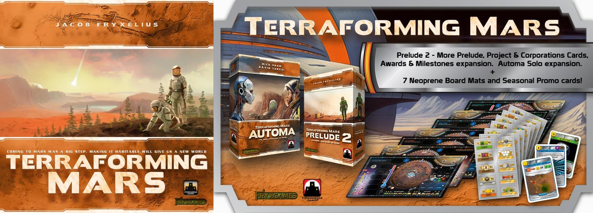
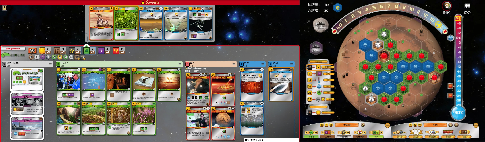
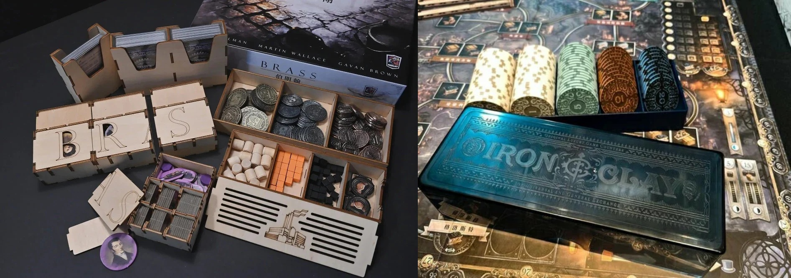
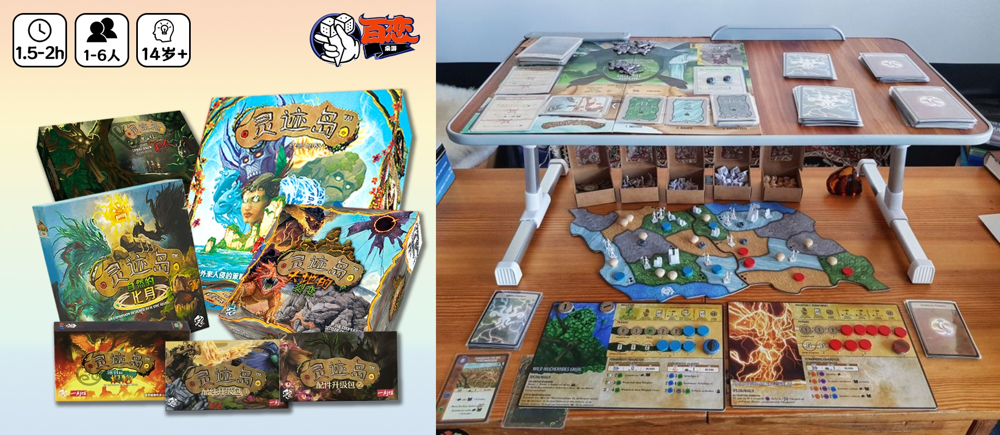
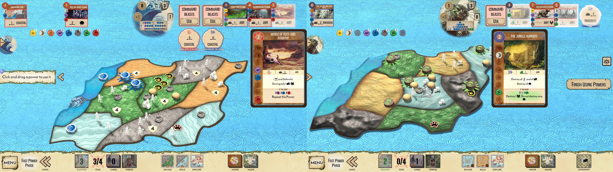
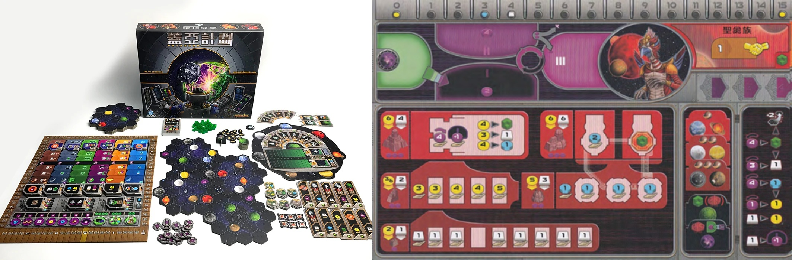

桌游，顾名思义是桌上游戏，发源于德国，内容涉及战争、贸易、文化、艺术、城市建设、历史等多个方面，大多使用纸质材料加上精美的模型辅助。本文会为我玩过的 **重度桌游**（$BGG > 2.5$）进行汇总和评价。

桌游圈的 Wikipedia 是 [BGG](https://boardgamegeek.com/)，很多热门桌游都可以在线上桌游平台 [BGA](https://en.boardgamearena.com/) 中找到。

| 打分 | 释义                                 |
| :--: | :----------------------------------- |
|  S   | 我会主动邀请朋友玩这款桌游，至今百玩不厌 |
|  A   | 我乐意和朋友一起游玩这款桌游   |
|  B   | 我可以接受朋友的邀请游玩，但不会主动去玩 |
|  C   | 因为某些原因，我不想玩这款桌游          |

|                            中文名                            |   年份    |     (最佳)人数      | 评分 | 重度 | BGA |    打分情况    |
| :----------------------------------------------------------: | :-------: | :-----------------: | :-----: | :-----: | :------------: | -------------- |
| [重塑火星](https://boardgamegeek.com/boardgame/167791/terraforming-mars) |   2016    |    1,2,**3**,4,5    |   8.4   |  3.26   |  [有](https://zh-cn.boardgamearena.com/gamepanel?game=terraformingmars)  |  🦐S 🌚A 😂A 💎B   |
| [盖亚计划·失落的舰队](https://boardgamegeek.com/boardgameexpansion/396802/gaia-project-the-lost-fleet) |   2024   |     1,2,**3**,**4**     |   9.0   |  4.45  |  无  | 🦐S 🍦S |
| [工业革命·伯明翰](https://boardgamegeek.com/boardgame/224517/brass-birmingham) |   2018    |    2,**3**,**4**    |   8.6   |  3.88   |  无  | 🦐S 🍦S 😂S 🌚B 💎B |
| [葡萄酒庄园·精华版](https://boardgamegeek.com/boardgame/183394/viticulture-essential-edition) |   2015    | 1,2,**3**,**4**,5,6 |   8.0   |  2.89   | [有](https://zh-cn.boardgamearena.com/gamepanel?game=viticulture) | 🦐S 🍦A 😂A 🌚A 💎A |
| [灵迹岛](https://boardgamegeek.com/boardgame/162886/spirit-island) |   2017    |     1,**2**,3,4     |   8.3   |  4.06   |  无  | 🦐S 🍦S 😂S 💎B 🌚C |
| [看板·电动汽车](https://boardgamegeek.com/boardgame/284378/kanban-ev) |   2020    |     1,2,**3**,4     |   8.4   |  4.30   |  无  |     🦐S 💎A      |
| [沙丘帝国·起义](https://boardgamegeek.com/boardgame/397598/dune-imperium-uprising) |   2023    |    1,2,3,**4**,6    |   8.8   |  3.42   |  无  |  🦐S 🍦S 🌚S 😂A   |
| [沙丘帝国](https://boardgamegeek.com/boardgame/316554/dune-imperium) |   2020    |   1,2,**3**,**4**   |   8.4   |  3.04   |  无  | 🦐S 🍦S 🌚A 😂A 🐎B |
| [方舟动物园](https://boardgamegeek.com/boardgame/342942/ark-nova) |   2019    |      1,**2**,3      |   8.5   |  3.77   | [有](https://zh-cn.boardgamearena.com/gamepanel?game=arknova) |  🦐S 💎S 🌚B 😂B   |
| [星空觅迹](https://boardgamegeek.com/boardgame/418059/seti-search-for-extraterrestrial-intelligence) | 2024 | 1,2,**3**,4 | 8.4 | 3.81 | 无 | 🦐S |
| [工业革命·兰开夏](https://boardgamegeek.com/boardgame/28720/brass-lancashire) | 2007 | 2,3,**4** | 8.2 | 3.85 | 无 | 🦐A |
| [勃艮第城堡](https://boardgamegeek.com/boardgame/271320/castles-burgundy) | 2011,2019 |     1,**2**,3,4     |   8.4   |  2.94   | [有](https://zh-cn.boardgamearena.com/gamepanel?game=castlesofburgundy) |  🌚S 🦐A 🍦A 🐎B   |
| [大西部之路](https://boardgamegeek.com/boardgame/193738/great-western-trail) | 2016 |      2,**3**,4     |   8.2   |  3.70   | [有](https://zh-cn.boardgamearena.com/gamepanel?game=greatwesterntrail) |  🍦S 💎S 🦐A   |
| [奋进号：深海](https://boardgamegeek.com/boardgame/367966/endeavor-deep-sea) | 2024 | 1,2,**3**,4 | 8.2 | 2.88 | 无 | 🦐A |
| [大五月花号](https://boardgamegeek.com/boardgame/122515/keyflower) | 2012 |     2,3,**4**,5,6    |   7.7   |  3.33   | [有](https://zh-cn.boardgamearena.com/gamepanel?game=keyflower) |  🦐A  |
| [盖亚计划](https://boardgamegeek.com/boardgame/220308/gaia-project) |   2017    |     1,2,**3**,4     |   8.4   |  4.39   |  [有](https://zh-cn.boardgamearena.com/gamepanel?game=gaiaproject)  | 🍦S 😂S 🦐A 🌚A 💎A |
| [地外文明](https://boardgamegeek.com/boardgame/418059/seti-search-for-extraterrestrial-intelligence) | 2024 | 1,2,**3**,4 | 8.4 | 3.80 | 无 | 🦐A |
| [大创造时代](https://boardgamegeek.com/boardgame/383179/age-of-innovation) |   2023    |    1,2,3,**4**,5    |   8.7   |  4.24   | [有](https://zh-cn.boardgamearena.com/gamepanel?game=ageofinnovation) |     🦐A 😂B      |
| [电力公司](https://boardgamegeek.com/boardgame/2651/power-grid) | 2004 | 3,**4**,**5**,6 | 7.8 | 3.25 | 无 | 🦐A |
| [历史巨轮](https://boardgamegeek.com/boardgame/25613/through-the-ages-a-story-of-civilization) | 2006 | 2,**3**,4 | 7.8 | 4.18 | [有](https://zh-cn.boardgamearena.com/gamepanel?game=throughtheages) | 🦐A |
| [卓越的洛伦佐](https://boardgamegeek.com/boardgame/203993/lorenzo-il-magnifico) | 2016 | 2,**3**,**4** | 7.8 | 3.29 | [有](https://zh-cn.boardgamearena.com/gamepanel?game=lorenzo) | 🦐A |
| [天堂与美酒](https://boardgamegeek.com/boardgame/227789/heaven-and-ale) | 2017 | 2,3,**4** | 7.5 | 3.18 | 无 | 🦐A |
| [时空乱序](https://boardgamegeek.com/boardgame/185343/anachrony) |   2017    |   1,2,**3**,**4**   |   8.1   |  4.01   |  [有](https://zh-cn.boardgamearena.com/gamepanel?game=anachrony)  |    🦐A 🌚A 😂A    |
| [阿纳克遗迹](https://boardgamegeek.com/boardgame/312484/lost-ruins-of-arnak) |   2020    |     1,2,**3**,4     |   8.1   |  2.92   |  [有](https://zh-cn.boardgamearena.com/gamepanel?game=arnak)  |  🦐A 🍦A 😂B 🌚C   |
| [姬路城](https://boardgamegeek.com/boardgame/371942/the-white-castle) |   2023    |     1,2,**3**,4     |   8.0   |  3.03   | [有](https://zh-cn.boardgamearena.com/gamepanel?game=thewhitecastle) |  🦐A   |
| [方舟保护区](https://boardgamegeek.com/boardgame/441696/sanctuary) | 2025 | 1,**2**,**3**,4 | 7.6 | 2.86 | 无 | 🦐A |
| [复仇女神号·全面封锁](https://boardgamegeek.com/boardgame/310100/nemesis-lockdown) |   2022    |     1,2,3,**4**,5     |   8.3   |  3.90   |  无  |  🦐A   |
| [核子激荡](https://boardgamegeek.com/boardgame/396790/nucleum) |   2020    |     1,2,**3**,4     |   8.2   |  4.13   |  无  |     🦐A 😂B      |
| [奥丁的盛宴](https://boardgamegeek.com/boardgame/177736/a-feast-for-odin) |   2016   |     1,2,**3**,4     |   8.2   |  3.86  |  [有](https://zh-cn.boardgamearena.com/gamepanel?game=feastforodin)  |       🦐A       |
| [特奥蒂瓦坎·众神之城](https://boardgamegeek.com/boardgame/229853/teotihuacan-city-of-gods) |   2018    |     1,2,3,**4**     |   7.9   |  3.78   | [有](https://zh-cn.boardgamearena.com/gamepanel?game=teotihuacan) |    🦐B 😂A 🌚B    |
| [帕米尔和平](https://boardgamegeek.com/boardgame/256960/pax-pamir-second-edition) | 2015,2019 | 1,2,3,**4**,5 | 8.1 | 3.85 | [有](https://zh-cn.boardgamearena.com/gamepanel?game=paxpamir) | 🦐B |
| [两河流域](https://boardgamegeek.com/boardgame/42/tigris-and-euphrates) | 1997 | 2,3,**4** | 7.7 | 3.48 | [有](https://zh-cn.boardgamearena.com/gamepanel?game=tigriseuphrates) | 🦐B |
| [星蚀·黎明重现](https://boardgamegeek.com/boardgame/72125/eclipse-new-dawn-for-the-galaxy) |   2011    |  2,3,**4**,5,**6**  |   7.8   |  3.70   |  无  |     🦐B 💎A      |
| [茂林源记](https://boardgamegeek.com/boardgame/237182/root)  |   2018    |      2,3,**4**      |   8.1   |  3.81   |  无  |       🦐B       |
| [大领主](https://boardgamegeek.com/boardgame/93/el-grande) |   1995   |     2,3,4,**5**     |   7.8   |  2.94  |  [有](https://zh-cn.boardgamearena.com/gamepanel?game=elgrande)  |       🦐B       |
| [旭日战魂录](https://boardgamegeek.com/boardgame/205896/rising-sun) |   2018    |    3,**4**,**5**    |   7.8   |  3.30   |  无  |  🍦S 🌚S 🦐B 💎A   |
| [虚空降临](https://boardgamegeek.com/boardgame/337627/voidfall) |   2023    |     1,2,**3**,4     |   8.6   |  4.63   |  无  |     🦐B 😂B      |
| [优势物种](https://boardgamegeek.com/boardgame/62219/dominant-species) | 2010 | 3,**4**,5,6 | 7.8 | 4.04 | 无 | 🦐B |

## 重塑火星 Terraforming Mars

《重塑火星》是 BGG 前十的桌游，代入感很强。玩家们各自扮演一个公司，以卡牌构筑的方式不断改造火星并获取相应的分数，最终让火星的温度、氧气浓度和水分三个全球参数都达到宜居的要求，从而结束游戏。

做为德式中策桌游，重塑火星的规则很清晰，玩起来很休闲。在我看来其至少具有以下优点：

1.  卡牌紧扣重塑火星的主题，代入感强，设计精美，效果和背景的拟合度很高。
2.  流派众多，不同的流派都可能获得胜利，比如收入流、绿化流、科技流、自动机流、钛金属流等。
3.  玩家在每个时代跳过前，每回合可选择一动或两动，增加了操作空间（两动抢资源或一动拖回合）。
4.  卡牌构筑之余仍需规划地盘、抢夺里程碑、投资奖励，存在很合适的玩家交互性。
5.  拥有序幕、金星、殖民地等优秀的扩展，精美的板块模型和不同地图（感谢金主何柱），重开率高。

在线下游玩中，重塑火星对于非专业玩家（或是说休闲玩家）来说会有一些缺点：

+ 很多卡牌存在扣分效果（可能是为了加强互动性），经常会导致某两方进行互干操作。
+ 火星很难动态估计彼此的分数，后期经常会出现没人愿意花钱提升温度或水，导致迟迟无法结束游戏。

在实际游玩时，可以考虑加入金星扩里提出的新机制，每个时代由先手玩家强制推动一格全球参数。

《重塑火星》是 [BGA 热门桌游](https://boardgamearena.com/gamepanel?game=terraformingmars)，我有段时间沉迷于在上面玩单人火星。线上单人模式完全解决了以上两个缺点，无论是移动端还是 PC 端，想玩就玩想停就停，一把半小时左右。单人模式的规则有变化，要求在固定的 $14$ 回合内提满全球参数，如果使用序幕扩展则需提前到 $12$ 回合。从多人模式切换到单人模式的时候会很不适应，原来那些终局计分的强卡已经没用了，反而是产水行动卡、电产氧气卡、太空事件卡等成了热门卡。玩久了我能很稳地在 $12$ 回合提满全球参数（要是天崩开局那就刷新吧），如果开局或中期顺的话能控制在 $10$ 回合以内。本以为这是单人模式的极限，直到我某天深夜刷出了 $9$ 回合！绿化公司、标准科技卡、产水行动卡，可遇而不可求。

除了 BGA 外，《重塑火星》还有 steam 版和 [网页版](](https://boardgamearena.com/gamepanel?game=terraformingmars) )。网页版上扩展更新即时，很多玩家反映比 BGA 上体验好。

## 盖亚计划·失落的舰队 Gaia Project: The Lost Feet

我之所以把《失落的舰队》扩展单独拿出来讲，**因为我觉得它相比基础版的《盖亚计划》更上一层楼**。

这个扩展增加了圆巨星和小行星两种行星，并增加了以此作为初始基地的两个面板（$4$ 个种族）。和基础里普遍拥有 $1$ 个初始基地（除异空族 $3$ 个和蜂人 $1$ 个）、一定拥有母星的种族相比，拓展提供的种族变得更加灵活：他们都只有 $1$ 个初始基地，而且没有母星（初始选择一个圆巨星或小行星）。

引入新地形和新种族是很多扩展都会做到的事，而《失落的舰队》做得更多更出色：

1. 引入了四艘神秘的科技飞船，提供了比公共面板更加强大的能力。同样每个格子在每个时代只能被盖住一次，而且每个人最多只能上玩家数量 $-1$ 的飞船，如何避开人流选择适合自己种族的飞船至关重要。
2. 引入了 $1 \times 1$ 和 $1 \times 3$ 的地形片，能够完美插入在原来 $3 \times 3$ 的版图里，且做到星球之间的距离平衡。
3. 针对基础版盖亚轨太弱的问题，引入了“快速盖亚”和“扔掉盖亚机上小行星”的新机制。
4. 为了更好地适配新机制，增加（或部分替换）了推进版、科技片、终局任务等 token，丰富了可玩性。
5. 针对基础版魔力豆剩余的现象，在反叛号飞船上引入了“爆豆换取圣器”的玩法。很多圣器都会带来额外的任务分数，使得后期玩家之间的争抢和博弈更加复杂；有些圣器甚至会提供强大的收入，前期就得勾心斗角。

在新机制加持下，基础版的三巨头伊塔星人、地球、蜂人变得不再强势。官方对新机制下的强势英雄和弱势英雄分别做了削弱（如利爪族上飞船后把大魔力豆推至盖亚区）和增强（如格伦星人增加每回合 $+2$ 航距的八角片），使得整个游戏总体变得更加平衡，不同英雄都具有可玩性和争胜能力。而且习惯了这个扩展后，很难再回到基础版了——量子方块换科技片更加困难、提升航距只能硬爬航距轨，种种弊端会让前期玩得非常不爽。

引入《失落的舰队》扩展后，分数超过 $200$ 不是奢望。可惜的是，现在 BGA 上还未引入扩展。

## 工业革命·伯明翰 Brass Birmingham

《伯明翰》是**当前 BGG 总榜第一**的桌游。虽然是标准的德式重策，行动清晰、收纳容易，大大提高了重开性。

伯明翰总共分为运河时代和铁路时代两个阶段，连接件分别是工业革命标志性的 **船** 和 **铁路**，极具时代感。铁路时代的连接件在价格从 $3$ 变贵到 $5$ 的基础上还会额外消耗一个煤，符合设定且增加了后期的策略感。注意伯明翰存在 **半开** 的教学局，即仅保留运河时代并修改计分规则：手上的钱计分，二级及以上的建筑算双倍分等。当我们玩过一把教学局再步入正式的局后发现，教学局的计分规则其实是在引导我们为铁路时代做准备。

尽管伯明翰的初始个人版面和全局地理版面都是固定的，可玩的套路和变化却很多，让我百玩不厌。

再写一段带“剧透”的感受，我们玩伯明翰的总体迭代如下：

1. 开局造煤厂起手，各区块煤多了就在附近造铁厂。把着连向贸易区的城市但暂不连船，可以将贸易区的酒桶随时占为己用。两个阶段要不狂造建筑，打出一动多卖的帅气操作；要不到处造船/铁路那份。
2. 适当研发，适当贷款，造高质量建筑卖钱。多造酒桶“无私公用“，因为酒桶性价比更高。
3. 看了世界大赛开局后：开局不造煤厂，改为研发、贷款、路铁。**几乎不造不连通市场的煤场。**
4. 每局一般总有一个人（但也不超过一个人）玩棉花流，运河时代逐渐能造出高级别棉花厂。
5. 逐渐提高酒桶的地位，运河时代会抢（即使用不掉）的酒桶位。德比酒桶战略优先级很高。
6. 开局第一回合趋于固定，四号位相对弱势。**铁路时代会造不连通市场的煤场**，紧接着修路。
7. 铁酒流统治天下，运河时代建钢铁厂快的胜率很高，棉花流式微（即使只有一个人玩也非常难赢）。

## 葡萄酒庄园·精华版 Viticulture Essential Edition

《葡萄酒庄园》在本文显得格格不入——它是非常休闲的德式中策，玩家要扮演葡萄酒大户，一条龙地体验播种葡萄、收获葡萄、酿酒、卖酒全过程。这种身临其境的代入感和带来神秘性的各类卡牌，让我爱不释手。

我们按照 [莫雷尔的推荐](https://www.bilibili.com/video/BV1dQ4y1t7Hy/)，早早地在基础版上加入了《莱茵河谷的访客》和《托斯卡纳扩展》：前者为了解决访客卡牌随机性过大的问题，用一组更平衡的卡牌替换；后者极大地丰富了游戏内容，例如扩展主板图（把主要工放环节从夏冬两季的拓展成春夏秋冬四季）、增加了代表区控的星星模组、增加了特殊的工人和设施模组。

虽然游戏的分值不大，得分手段倒是设计得非常多样：你可以做一位踏踏实实的酿酒者，从造葡萄藤架到造酒窖一个不落，完整地种植葡萄、酿酒来完成订单获得分数；你也可以做一位投机取巧的商人，通过开放酿酒室或风车来刷分，或借助访客卡牌来灵活地调整自己的产业。我喜欢这种需要钻营但又不算厚重复杂的算分机制。

## 灵迹岛 Spirit Island

灵迹岛是一款披着美式背景的偏德式合作游戏。每个人会扮演一个具有专属技能和成长性的精灵，在灵迹岛中的土著——达昂人的协助下，对抗从海边漂流而来、尝试在岛上建出村庄和城镇的探索者。

灵迹岛能很灵活地适配不同玩家人数，只需要把等同于人数的地图拼装在一起并新增一些 token（如初始污染物）即可。灵迹岛的一大爽点和重开性就是种类繁复的精灵和他们彼此之间的配合。初始版图、精灵组合、初始手牌为整局游戏带来确定性的目标，而敬畏牌、探索牌、新法术牌和事件牌会带来有趣的随机性。

曾经的我只喜欢快速法术，例如火鸟这种猛猛推、猛猛给 buff 的角色；在接触了大量新精灵、新技能后，慢慢适应了慢速法术的节奏（大部分精灵的伤害型天赋法术都是慢速法术），学会了动态应对下一阶段入侵者。

如果你正在找寻强度高的或好玩的精灵，可以参考贴吧老哥搬运自 Red 大神的 [千把见解](https://tiebac.baidu.com/p/8941449004)。

我认为线下灵迹岛的主要缺点是：容易忽视某些牌和精灵的施法限制导致村规，超过三人游戏时互动性不佳。

灵迹岛的电子版包括手机版（安卓/IOS）和 steam 版。我目前沉迷于后者的 solo，完美解决上述两个问题。

## 看板·电动汽车 Kanban-EV

《看板·电动汽车》是标准的德式重策，有非常多的得分渠道和手段，工放背后是复杂的资源置换。玩家之间的对抗不仅仅是工放的格子，还包括某张优秀的图纸、每个岗位的高绩效奖励、某个已推向测试的汽车、会议的高价值得分牌等。它总是总给我带来一种奇怪的割裂感：一方面其板件精美、情境有趣（每个玩家都扮演一个正在汽车制造公司里轮岗的实习生，基于一个格子数量不多的工放系统来合理安排在各岗位的产出，同时要“逃避”按一定规则移动的主管曼德拉），玩起来很流畅；另一方面其规则细节比较琐碎，token 数量多，重度非常高。

这个桌游让我了解到，Kanban 是一个标准的英文单词，对应于日语里的“看板”，特指在精益/敏捷生产中使用的一种可视化的工作流程管理工具和方法，由日本丰田公司在 20 世纪 40 年代创造并被英语吸收。

## 沙丘帝国·起义 Dune Imperium Uprising

## 沙丘帝国 Dune Imperium

## 方舟动物园 Ark Nova

## 工业革命·兰开夏 Brass: Lancashire

## 勃艮第城堡 The Castles of Burgundy

## 大西部之路 Great Western Trail

## 奋进号：深海 Endeavor: Deep Sea

## 大五月花号 Keyflower

## 盖亚计划 Gaia Project

《盖亚计划》是神秘大地系列桌游，保留了经典的转魔力机制和地形改造度，把主题拓展为宇宙旅行和星球改造。作为重度 $>4$ 的桌游，《盖亚计划》没有卡牌，没有任何随机性（当然多人局存在操作的混沌性），强调资源的高效转换——因此新手入门时会非常非常卡，而玩熟练后前期就能把资源转得非常爽。

《盖亚计划》属于重度很高但规则很清晰的重策，种族面板和公共版图上各个标记图案清晰、格式统一，存在歧义的细节很少。整个游戏的 token 数量较多但分类清晰，set up 时间在重策里算是偏短的，配合良好的收纳盒能做到事半功倍。在统一的框架下引入不同的种族，有效地增加了游戏的趣味性和重开性：共有 $7$ 种母星 $14$ 个种族（每两个种族共享种族面板和同一颗母星），每个种族都有自己独特的被动和要塞能力。游戏总共分为六个时代，每个时代先跳过的玩家在下一时代先动，第一回合先行动的后选回合推进版——我觉得是很公平的设计。

由于本游戏对精算的要求很高，普通人和高手之间的差距会被拉大，只推荐势均力敌的搭子之间游玩。目前 BGA 上提供 [基础版本的《盖亚计划》](https://boardgamearena.com/gamepanel?game=gaiaproject)，但体验上不如《方舟动物园》那么丝滑（无法进行完整一个行动的撤回）。

## 地外文明 SETI: Search for Extraterrestrial Intelligence

## 大创造时代 Age of Innovation

## 电力公司 Power Grid

## 历史巨轮 Through the Ages: A Story of Civilization

## 卓越的洛伦佐 Lorenzo il Magnifico

## 天堂与美酒 Heaven & Ale

## 时空乱序 Anachrony

## 阿纳克遗迹 Lost Ruins of Arnak

## 姬路城 The White Castle

## 方舟保护区 Sanctuary

## 复仇女神号·全面封锁 Nemesis: Lockdown

## 核子激荡 Nucleum

## 奥丁的盛宴 A Feast For Odin

## 特奥蒂瓦坎·众神之城 Teotihuacan City of Gods

## 帕米尔和平 Pax Pamir

## 两河流域 Tigris & Euphrates

## 星蚀·黎明重现 Eclipse: New Dawn for the Galaxy

## 茂林源记 Root

## 大领主 El Grande

## 旭日战魂录 Rising Sun

旭日战魂录是我接触的少有的美式桌游。它以充满了妖怪神话色彩的战国日本为背景，每个玩家扮演一个家族。其浓浓的美式风格从各家族互不相同的武士、僧侣造型，和精致的妖怪模型中可见一斑。

我认为旭日战魂录的特点主要有两个：

+   嘴炮漫天的茶话阶段。玩家需要在春、夏、秋三个季节的茶话阶段两两达成同盟，同盟会给后续的政令阶段带来不少好处，但背叛同样会带来好处。游戏允许玩家在茶话和政令阶段通过口头承诺甚至是物品交换来完成某一目的。这也是我不太喜欢旭日的原因，因为我不太喜欢通过嘴炮来达到目的或者建立优势。
+   勾心斗角的战斗阶段。我很喜欢旭日战斗阶段的设定，所有参与本场战斗的玩家需要给四个依次的行动押注，每个行动押注最多的人才能执行该行动，但战胜者需要把自己押注的钱分给战败者。本场战斗到底是拼尽全力搏一把，还是偷偷切腹/唱歌来获取分数，抑或是说一分钱都不押保留实力去打下一场战斗？

## 虚空降临 Voidfall

## 优势物种 Dominant Species
