## 前言

桌游，顾名思义是桌上游戏，发源于德国，内容涉及战争、贸易、文化、艺术、城市建设、历史等多个方面，大多使用纸质材料加上精美的模型辅助。本文会为我玩过的 **轻中度桌游**（$BGG \le 2.5$）进行汇总和评价。

桌游圈的 Wikipedia 是 [BGG](https://boardgamegeek.com/)，很多热门桌游都可以在线上桌游平台 [BGA](https://en.boardgamearena.com/) 中找到。

标签说明：
+ 玩家类型：多人竞争/分两组竞争/双人竞争/多人合作。
+ 核心玩法：卡牌收集/卡牌打出/卡牌管理，推理/猜词/拼图/数字/几何/纸笔/闯关/记忆力/赌狗/嘴炮/棋类/赛车，种族选择/资源运营/成套收集/艺术性。

## 综合打分表格

| 打分 | 释义                                 |
| :--: | :----------------------------------- |
|  S   | 我会主动邀请朋友玩这款桌游，至今百玩不厌 |
|  A   | 我乐意和朋友一起游玩这款桌游   |
|  B   | 我可以接受朋友的邀请游玩，但不会主动去玩 |
|  C   | 因为某些原因，我不想玩这款桌游          |

|                            中文名                            |   年份    |         (最佳)人数          | 评分 | 重度 | BGA |          打分情况          |
| :----------------------------------------------------------: | :-------: | :-------------------------: | :--: | :--: | :------------------------: | -------------------------- |
| [七大奇迹](https://boardgamegeek.com/boardgame/68448/7-wonders) |   2010    |       2,3,**4,5**,6,7       | 7.7  | 2.32 | [有](https://zh-cn.boardgamearena.com/gamepanel?game=sevenwonders) | 🦐S 🍦A 🌚A 😂A 🐎A 💎A 🐳A 🏓A 🔫B |
| [X行星之谜](https://boardgamegeek.com/boardgame/279537/the-search-for-planet-x) |   2020    |       1,**2**,**3**,4       | 7.9  | 2.42 | 无 |           🦐S 💎S            |
| [炸弹克星](https://boardgamegeek.com/boardgame/413246/bomb-busters) |   2024    |        2,3,**4**,5        | 8.0  | 1.99 | 无 |    🦐S        |
| [谍报风云](https://boardgamegeek.com/boardgame/225694/decrypto) |   2018    |        **4**,**6**,8        | 7.8  | 1.81 | [有](https://zh-cn.boardgamearena.com/gamepanel?game=decrypto) |        🦐S 🍦S 🌚S 😂A         |
| [行动代号](https://boardgamegeek.com/boardgame/178900/codenames) |   2015    |        2,3,4,5,**6**,7,**8**        | 7.5 | 1.26 | 无 |        🦐S         |
| [欢迎来到月球](https://boardgamegeek.com/boardgame/339789/welcome-to-the-moon) |   2021    |  1,2,**3**,**4**,5,...,100  | 7.9  | 2.45 | [有](https://zh-cn.boardgamearena.com/gamepanel?game=welcometothemoon) |             🦐S             |
| [欢迎来到](https://boardgamegeek.com/boardgame/233867/welcome) |   2018    |  1,2,**3**,**4**,5,...,100  | 7.5  | 1.84 | [有](https://zh-cn.boardgamearena.com/gamepanel?game=welcometo) |    🦐S 🔫S 🏓S 🍦A 😂A 🐳A 🌚B    |
| [卡斯卡迪亚之旅](https://boardgamegeek.com/boardgame/295947/cascadia) |   2021    |       1,**2**,**3**,4       | 8.0  | 1.83 | 无 |        🦐S 🍦S 🐎S 🌚B         |
| [国家公园](https://boardgamegeek.com/boardgame/266524/parks) |   2019    |        1,2,**3**,4,5        | 7.7  | 2.13 | [有](https://zh-cn.boardgamearena.com/gamepanel?game=parks) |        🦐A 🐎A 🍦B 🌚B         |
| [展翅翱翔](https://boardgamegeek.com/boardgame/266192/wingspan) |   2019    |        1,2,**3**,4,5        | 8.1  | 2.46 | [有](https://zh-cn.boardgamearena.com/gamepanel?game=wingspan) |       🐎S 🦐A 🌚A 😂A 🍦B       |
| [森森不息](https://boardgamegeek.com/boardgame/391163/forest-shuffle) |   2023    |        **2**,3,4,5        | 7.7  | 2.20 | [有](https://zh-cn.boardgamearena.com/gamepanel?game=forestshuffle) |       🦐A       |
| [星际探险队·深海任务](https://boardgamegeek.com/boardgame/324856/crew-mission-deep-sea) |   2021    |         2,3,**4**,5         | 8.2  | 2.05 | [有](https://zh-cn.boardgamearena.com/gamepanel?game=thecrewdeepsea) |        🍦S 🦐A 😂B 🌚C         |
| [拼布艺术](https://boardgamegeek.com/boardgame/163412/patchwork) |   2014    |            **2**            | 7.6  | 1.60 | [有](https://zh-cn.boardgamearena.com/gamepanel?game=patchwork) |           🦐S 🌚C            |
| [并购风云](https://boardgamegeek.com/boardgame/5/acquire) |   1963   |            2,3,**4**,5,6            | 7.4 | 2.49 | 无 |           🦐A            |
| [璀璨宝石·对决](https://boardgamegeek.com/boardgame/364073/splendor-duel) |   2022    |            **2**            | 8.0  | 1.97 | [有](https://zh-cn.boardgamearena.com/gamepanel?game=splendorduel) |          🦐A 🐎A 😂B          |
| [冠军挑战者](https://boardgamegeek.com/boardgame/359970/challengers) |   2022    | 1,2,3,**4**,5,**6**,7,**8** | 7.1  | 1.78 | [有](https://zh-cn.boardgamearena.com/gamepanel?game=challengers) |    🍦S 🐳S 🔫S 🏓S 🦐A 😂A 🌚B    |
| [卡波](https://boardgamegeek.com/boardgame/271321/cabo-second-edition) | 2010,2019 |        2,**3**,**4**        | 7.3  | 1.27 | 无 |        🐳S 🦐A 🔫A 🏓A         |
| [郎中闯江湖](https://boardgamegeek.com/boardgame/244521/quacks) | 2018 | 2,3,**4** | 7.8 | 1.94 | 无 | 🦐A |
| [重筑家园](https://boardgamegeek.com/boardgame/417197/rebirth) | 2024 | 2,**3**,4 | 7.8 | 1.99 | 无 | 🦐A |
| [自然和弦](https://boardgamegeek.com/boardgame/9209/ticket-to-ride) |   2024    |         1,**2,3**,4         | 8.0  | 2.00 | [有](https://zh-cn.boardgamearena.com/gamepanel?game=harmonies) |           🦐A            |
| [卡卡颂](https://boardgamegeek.com/boardgame/822/carcassonne) |   2000    |         **2**,3,4,5         | 7.4  | 1.90 | [有](https://zh-cn.boardgamearena.com/gamepanel?game=carcassonne) |    🍦S 🐳S 🌚S 🦐A 😂A 🔫B 🏓B    |
| [铁路环游](https://boardgamegeek.com/boardgame/9209/ticket-to-ride) |   2004    |         2,3,**4**,5         | 7.4  | 1.82 | [有](https://zh-cn.boardgamearena.com/gamepanel?game=tickettoride) |           🦐A 🌚B            |
| [无间风云](https://boardgamegeek.com/boardgame/153064/good-cop-bad-cop) | 2014 | 4,5,**6**,7,**8** | 6.5 | 1.26 | [有](https://boardgamearena.com/gamepanel?game=goodcopbadcop) | 🦐A |
| [马戏星探](https://boardgamegeek.com/boardgame/291453/scout) |   2019    |         2,3,**4**,5         | 7.8  | 1.34 | 无 |        🍦S 😂S 🦐A 🌚A         |
| [海盐折纸](https://boardgamegeek.com/boardgame/9209/ticket-to-ride) |   2022    |         **2**,3,4         | 7.5  | 1.48 | [有](https://zh-cn.boardgamearena.com/gamepanel?game=seasaltpaper) |           🦐A            |
| [花砖物语](https://boardgamegeek.com/boardgame/230802/azul)  |   2017    |          **2**,3,4          | 7.8  | 1.76 | [有](https://zh-cn.boardgamearena.com/gamepanel?game=azul) |  🦐A 🍦A 🐎A 🌚B 😂B 🐳B 🔫B 🏓B   |
| [璀璨宝石](https://boardgamegeek.com/boardgame/148228/splendor) |   2014    |          2,**3**,4          | 7.4  | 1.78 | [有](https://zh-cn.boardgamearena.com/gamepanel?game=splendor) |    🏓S 🦐A 🍦A 🌚A 😂A 🔫A 🐳B    |
| [战争之匣](https://boardgamegeek.com/boardgame/249259/war-chest) |   2018    |          **2**,3,4          | 7.9  | 2.30 | [有](https://zh-cn.boardgamearena.com/gamepanel?game=warchest) |        🦐A 🍦A 🌚A 😂A         |
| [火力狂飙](https://boardgamegeek.com/boardgame/366013/heat-pedal-metal) |   2022    |     1,2,3,4,**5**,**6**     | 8.1  | 2.19 | [有](https://zh-cn.boardgamearena.com/gamepanel?game=heat) |        🍦A 🦐B 🌚B 😂B         |
| [礼尚往来](https://boardgamegeek.com/boardgame/375651/thats-not-a-hat) | 2023 | 3,4,**5**,6,7,8 | 7.0 | 1.05 | 无 | 🦐A |
| [小城大案·罪恶都市](https://boardgamegeek.com/boardgame/318977/micromacro-crime-city) |   2020    |          1,**2**,3          | 7.5  | 1.10 | 无 |          🦐A 😂A 🌚B          |
| [时空神探·巴黎1920](https://boardgamegeek.com/image/8476488/kronologic-paris-1920) |   2024    |          1,**2**,**3**,4          | 7.5  | 2.16 | 无 |          🦐A          |
| [荣耀之城](https://boardgamegeek.com/boardgame/205398/citadels) | 2000,2016 |      2,3,4,**5**,6,7,8      | 7.3  | 2.03 | [有](https://zh-cn.boardgamearena.com/gamepanel?game=citadels) |          🌚S 🦐A 🍦C          |
|  [彩虹数列](https://boardgamegeek.com/boardgame/335609/ten)  |   2021    |        1,2,3,**4**,5        | 7.1  | 1.47 | 无 |           🦐A 🐎A            |
|  [画物语](https://boardgamegeek.com/boardgame/39856/dixit)   |   2008    |     3,4,**5**,**6**,7,8     | 7.2  | 1.20 | 无 |          🦐A 🍦C 🌚C          |
| [印加宝藏](https://boardgamegeek.com/boardgame/15512/diamant) | 2005 |        3,4,5,**6**,**7**,**8**        | 6.8  | 1.12 | [有](https://zh-cn.boardgamearena.com/gamepanel?game=incangold) |             🦐B             |
| [动物元老院](https://boardgamegeek.com/boardgame/368061/zoo-vadis) | 2023 | 3,4,**5**,6,7 | 7.5 | 2.13 | 无 | 🦐B |
| [七来运转](https://boardgamegeek.com/boardgame/420087/flip-7) | 2005 |        3,4,**5**,**6**,7,8        | 7.2  | 1.05 | [有](https://zh-cn.boardgamearena.com/gamepanel?game=flipseven) |             🦐B             |
| [遥远之地](https://boardgamegeek.com/boardgame/385761/faraway) |   2023    |      **2**,**3**,4,5,6      | 7.6  | 1.94 | [有](https://zh-cn.boardgamearena.com/gamepanel?game=faraway) |        🦐B 🍦B 🌚B 😂B         |
| [城堡嘉年华](https://boardgamegeek.com/boardgame/416851/castle-combo) |   2024   |      **2**, 3, 4, 5      | 7.6  | 1.74 | [有](https://zh-cn.boardgamearena.com/gamepanel?game=castlecombo) |        🦐B         |
| [谁是牛头王](https://boardgamegeek.com/boardgame/432/take-5) |   1994    | 2,3,4,**5**,**6**,7,8,9,10  | 7.0  | 1.20 | [有](https://zh-cn.boardgamearena.com/gamepanel?game=sechsnimmt) |        🦐B 🍦B 🌚B 🐎B         |
|   [拉密](https://boardgamegeek.com/boardgame/811/rummikub)   |   1977    |          2,3,**4**          | 6.5  | 1.72 | 无 |           🦐B 🌚C            |
|  [马尼拉](https://boardgamegeek.com/boardgame/15817/manila)  |   2005    |          3,**4**,5          | 7.0  | 2.04 | 无 |           🦐B 🍦C            |

## 七大奇迹 7 Wonders

**主要特征**：多人竞争；卡牌收集，资源运营，种族选择；人数灵活，并行操作。

《七大奇迹》是我迄今为止最爱的桌游，他有几个让我沉迷的特点：

+   顺逆时针的卡牌传递模式。从万千卡牌中选择适合自身的发展，并能掌握下家的手牌信息。
+   无人打扰的独立发育模式。可以选择绿牌科技流、红牌打架流、蓝牌得分流等，甚至是赚钱流。
+   灵活的人数增减模式。$3-7$ 人的游玩体验都挺不错，灵活性吊打一众桌游。
+   独特的邻家互动模式。资源可以找上下家买，缓解了部分桌游资源卡手的问题，增加了和上下家的互动性。
+   不折不扣的并行模式。选牌+出牌+算分都能并行操作，大大提速单局游戏时长。
+   清晰而不冗杂的计分模式。流派和计分手段保持了德式桌游的丰富，结算分数时又清晰简单。

目前我觉得主要以下几个瑕不掩瑜的缺点：   

+   7 个奇迹的种族技能强度不平衡——当然在我们的低端局里这个问题被无限缩小。
+   如果上家不想赢专卡你，你会获得很糟糕的游戏体验。特别是顺时针上家，能恶心你整整两个时代。
+   玩家多的时候，打架情况受制于己方所处的位置。两侧都招兵买马，或两侧都摆烂，对己方的影响相差过大。

七大奇迹的领袖扩展加强了游戏的变化和可玩性，并带来了两个全新的种族面板。

## X 行星之谜 The Search for Planet X

**主要特征**：多人竞争；推理，纸笔；宇宙背景，依赖 APP 获取答案。

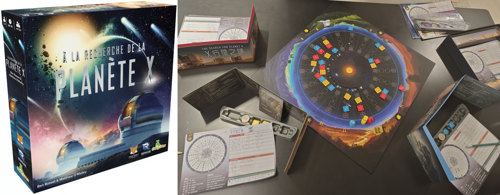

《X 行星之谜》宇宙漫游的背景和推理解密的主题都很符合我的口味，而且它把这两点有机地结合在了一起：清晰简单的搜寻规则，趣味十足的行星会议（猜测和揭示环节），紧张刺激地定位 X 行星（猜错有大量惩罚）。

《X 行星之谜》的一大特色是游依赖于官方提供的 APP 进行 X 行星的初始设置和每一步的结果校验。玩家们一步步向 APP 发出搜寻指令并获得对应结果，用纸笔记录线索（包括自己的搜寻结果和其他人的搜寻行为），以最终定位 X 行星的位置并赚取高分。这种模式我还玩过《时空神探》，解密工具设计得很高级但可玩性远远不及。

由于这款桌游暂无 BGG 或其他官方渠道游玩，我的一个狂热桌友自己制作了联机版：[X 行星之谜](https://planetx-online.top/)。

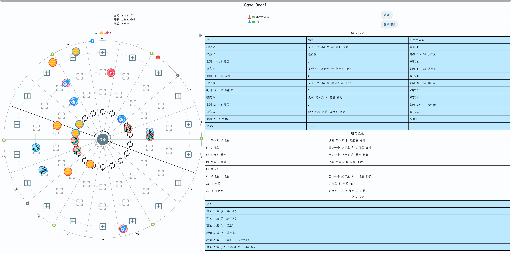

## 炸弹克星 Bomb Busters

**主要特征**：多人合作；数字，推理，闯关；适合聚会和推新。

《炸弹克星》的名字很容易和毛线桌游《爆炸猫》搞混，但实际上这款游戏很新，与《爆炸猫》在重度和游戏性上都有着天壤之别。**我的癖好是德式 >> 美式，竞争 >> 合作，但我愿意将这款合作游戏摆到非常高的位置。**游戏是经典的多关卡难度递增模式，所有关卡的玩法核心很接近：大家要严格保证自己手牌的数字递增，通过猜测每一方的手牌去两两配对相同数字来 “拆弹”，但对于危险的黄线或红线数字要尽量规避，随机性和推理性并存；每一关又有独自的特色，甚至会修改某个核心机制，初玩时总让人眼前一亮。我觉得**这是一款非常适合给四个人在桌游店推新的游戏**，大家花掉一个下午的时间来闯关，有时不担责任甩锅队友，有时嘻嘻哈哈压力队友，有时紧张兮兮生怕爆炸。从这里我们也能看出来，游戏稍显颓势的地方就是重开性不足，特别是固定搭子一起玩通关后。

锐评一下当前《炸弹克星》的桌游配置：我觉得线下游玩的唯一问题是数字牌的材质是塑料，手动混洗的时候手感不佳；如果出个豪华版把数字牌换成麻将材质就好了，这样也不需要多余的塑料架子来辅助站立了。

## 谍报风云 Decrypto

**主要特征**：分两组竞争；猜词（重词汇区分）；适合聚会和推新，考验默契。

《谍报风云》作为我最爱的词汇类游戏，具备一个很大的特点：一局游戏只需花费 $4 \times 2$ 张词条，可能能持久地玩上一个小时。由此推算，即使不想遇到重复的词，标准包提供的词汇依然能玩很久。

我理解游戏中的数字应该都处于精心设计后的最佳状态：

+   双方各有 $4$ 个词，不多不少，正好看得过来。
+   每次抽出 $3$ 个来描述，其实变相要求队友还能识别出未被选中的词，降低描述的抽象性。
+   排列一共有 $A_4^3=24$ 种情况，盲猜的效率较低/排列的可能性较多，同时卡片能保持合理的数量。

玩了几局后，双方都倾向于描绘得尽可能的抽象，会促使大家更深入地去理解这些看似普通的词汇。首先你需要让队友能判断出这次的三个词描述的是哪三个词汇，接下来就可以描述地尽量阴间，连队友都不能放过，这样才能让对手的提示卡上写满毫不相关的词汇。某个描述词有歧义完全没关系，你只要保证队友能通过排除法猜出来。

我觉得这个游戏的六人局反而比四人局好玩，因为每方猜词的人从一个变成了两个，描述词合理性的判别从 1v1 变成了 3 人投票，能直观地看出来“谁的思维更怪”。**词向量**或许是判定谁是责任方最好的工具。

在这里我可以举几个大家思维有别的例子：

+ 想象排除法剩下《黄金》和《家庭》两个词汇，队友给出了“每天”的提示，该选择哪个？
+ 想象总共有《鸽子》、《编织》、《小屋》和《衣领》四个词汇。
  + 队友给出了“白的”、“黑的”、“高的”的提示应该选哪个？
  + 队友给出了“闪电”、“偶尔更换”和“经常更换”的提示应该选哪个？

揭晓谜底：

+ 描述者（女性）认为显然是黄金（首饰每天戴着），我和另一个队友（都是男性）认为显然是家庭。
+ 描述者认为白的是衣领（比鸽子程度深），高的是小屋，黑的剩下编织；队友和事后复盘的我都觉得鸽子的白色意向更深，小屋和衣领都可以高但小屋显然更黑，所以高的是衣领。
+ 假设闪电和编织已对应上（想吐槽这个脑回路也是有点东西）。描述者本意“偶尔更换”是小屋，可能对应了租房；队友和事后复盘的我觉得是鸽子（用于信鸽场景）。

## 行动代号 Codenames

**主要特征**：分两组竞争；猜词（重词汇联想）；适合聚会和推新，考验默契，队长任务重。

《行动代号》是一款词汇类桌游，非常考验队长对词汇的联想能力（特别是将多个词汇聚合的能力）以及队友对队长的理解能力。先手目标 $9$ 个词后手目标 $8$ 个词，双方的对抗会非常激烈，有时候多出一个词就是获胜的关键。刚玩时我很不理解为什么队友的猜词数量最多能到队长指示的数量 $+1$，玩过两局才慢慢明白这个参数的精妙。当某一回合队长试图包裹大量词汇但被队友中断时，队友可以在后面几回合慢慢再尝试本回合的词语。

《行动代号》和《谍报风云》都是我非常喜欢的桌游，他们的相同点很鲜明：

+ 都是分两组对抗的桌游，只要凑齐 $4$ 个人就能完整游戏，而且任意扩展至多人。
+ 规则简单易学，无算分门槛，非常适合参与者桌游基础不一的聚会场景。
+ 两者都高度依赖词库。官方准备的词库已经非常充分，一般不会重开到山穷水尽的时候。
+ 都是要在组内对队长的抽象信息进行揣摩，这也意味着 **结束后的“分锅大会”一定很热闹**。

这两者的不同点也很鲜明：

+ 《谍报风云》是组内轮流当 C 位，而《行动代号》的全程有一个固定的 C 位，**后者对队长的要求很高**。
+ 《行动代号》的单局游戏时间非常可控，而《谍报风云》的终局触发机制方差很大。
+ 《谍报风云》里要从一无所知开始慢慢探索对方的词汇，适合那种探索欲和解谜欲很强的人；《行动代号》里一开始本方和对方的词汇都已全部公开，没有黑盒，只需要联想（队长）和揣摩（队员）。

## 欢迎来到月球 Welcome to the Moon

**主要特征**：多人竞争；数字，成套收集，闯关；支持任意人数，适合聚会和推新，可以全程抄袭高手。

《欢迎来到月球》是《欢迎来到》的进阶与融合版，借用了美式的思路，采用八关独立但又相互串联的闯关结构，每一关都有独特的图纸布局、得分方式和额外机制。例如某一章会加入“能源线路连通”、某一章加入“轨道飞船移动”，甚至还有章节引入小游戏式的目标系统，让玩家在熟悉基础机制后不断获得新鲜感。

本作同样支持任意人数并行游玩，但由于关卡花样更多、内容更复杂，新手上手并不如《欢迎来到》顺滑。作为休闲类的聚会桌游，一整套流程体验下来用时太长不太划算，所以我更愿意拆开成单独的关卡和朋友们玩。尽管我只带朋友玩过前两关，其设计感、趣味性都是非常在线的，这也是为什么我将其排在原版之前来推荐。

## 欢迎来到 Welcome to

**主要特征**：多人竞争；数字，成套收集；支持任意人数，适合聚会和推新，可以全程抄袭高手。

见识到了号称能同时容纳 100 个人进行的纸笔游戏~

游戏流程很简单，一共有三叠牌，每张牌的正面是数字 $1 \sim 15$，背面是种树/泳池/施工/升级/扩建五种图案中的一种。每轮每叠牌都会翻出一张数字+一种图案，每名玩家并行地三选一，并在自己的图纸里完成规划。

游戏偏重娱乐性，决策性不强，得分方式多样——玩家可以自由选择喜欢的流派来得分，只需遵守基本的房号递增的原则即可。纸笔操作强化了线下体验，可擦拭笔迹的布的质量也很不错。由于玩家之间彼此独立（除了竞争施工标记和任务分数），不存在卡资源的现象，你甚至可以完全复制某位玩家的行动来获得一样的分数。

完全并行有利有弊，利是加速了游戏整体进程、适配多人游玩，弊是玩家之间的交流性不足。线下玩的时候，我没有精力去研究别人的图纸，只能大致记忆一下大家的街区情况来判断三个任务的走向。

## 卡斯卡迪亚之旅 Cascadia

**主要特征**：多人竞争；拼图，资源运营，艺术性；休闲向算分。

《卡斯卡迪亚之旅》是一款兼具艺术性和游戏性的桌游。整体玩法是拼图，从《卡卡颂》的四角拓展为六角、共同拼图改为各自拼图，减少了不确定性，增加了趣味性和休闲感。每位玩家要在适宜的地形上养小动物，不同小动物需要摆出所需的形状才能得分，大名鼎鼎的《自然和弦》想必就是借鉴了这一机制。

这款游戏我总共只玩过两把（三人局和四人局），属于固定搭子里重开性不高但非常适合推新的休闲向桌游。

## 国家公园 Parks

**主要特征**：多人竞争；资源运营，成套收集，艺术性；休闲向算分。

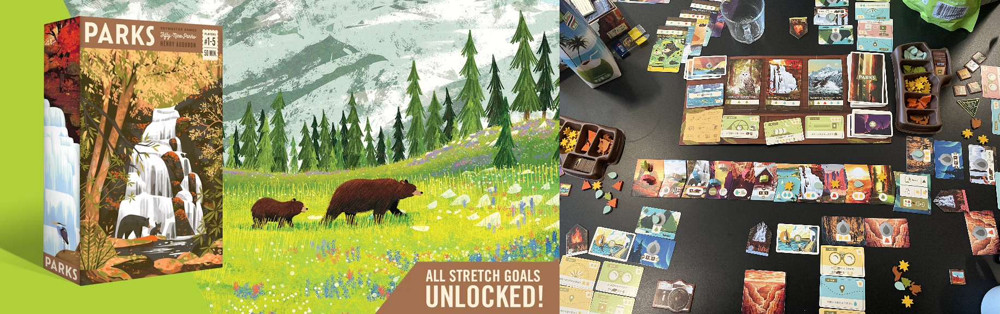

（美国）《国家公园》是一款兼具高趣味性和高收藏价值的桌游，和《卡斯卡迪亚之旅》、《展翅翱翔》风格接近接近（我的排名也接近）。这个游戏的 token 细节设计得不错，比如箭头型方便拼接的天气牌 和 精致的资源标记（太阳，水滴，山峰，树林，动物等）。在购买公园牌、水壶牌或拿取资源时，有一种更立体充实的资源收集感。

国家公园的重度很低，主要表现在每回合决策空间很小（棋子二选一，且往往是走一两步空位），很适合桌游咸鱼来休闲——这也是我打 S 的原因。照相机和篝火的设定有点意思，而天气系统和水壶牌给游戏增加了趣味性和随机性，玩到最后大家都会有相对好看的得分。不过这也导致游戏玩法的丰富性不够，玩久了容易腻。

在玩家互动性方面，国家公园控制得很微妙——采用 人物产生互动和冲突 和 资源独立收集并算分 的双形态。有时候会被上家走位卡住关键格子让人很恼火，所以我觉得国家公园不适宜超过五个人玩。

## 展翅翱翔 Wingspan

**主要特征**：多人竞争；卡牌收集，资源运营，艺术性；休闲向算分。

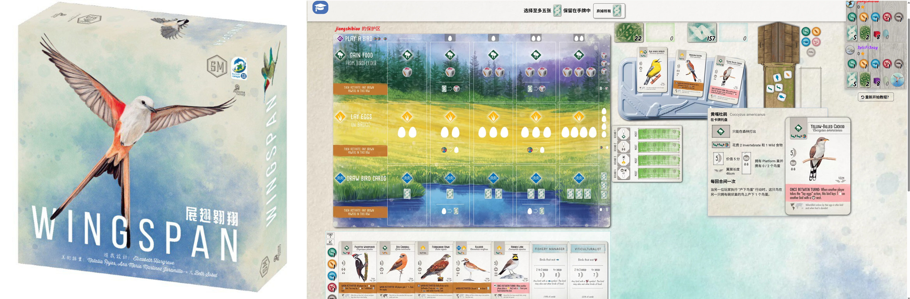

《展翅翱翔》是一款兼具艺术性和玩法性的桌游，在圈子里大名鼎鼎，拿过很多奖，所以我们很早就接触到了。其同时具有 steam 和 BGA 两个版本，后者的在线游玩桌数都是几千级别的。正因为高人气，这款桌游陆续出了《欧洲篇》、《大洋洲篇》和《亚洲篇》，甚至在 2024 龙年推出了《龙翼翱翔》版本。

这款游戏的评分里艺术加成是非常大的。用纸板搭成的鸟屋，大量手绘的鸟儿，鸟蛋和饲料等辅助道具，给人一种身临其境之感。所以我们在游玩时往往不会过分追求得分，而是重在体验。

对于追求德式体验的我来说，这款游戏存在以下缺点：

+ 标准版里有四张非常超模的卡（双领鸻、弗式鸥、渡鸦和奇瓦瓦渡鸦），被世界桌游大赛 WSBG ban 掉。
+ 整个游戏是串行的，但玩家之间的交互非常少，大家都是闷头构筑自己的体系。
+ 初始任务卡设计得比较古怪（如“收集名字里带颜色/人名的鸟”），而且任务卡分值偏少总是被忽略。
+ 每个季节过后动数都会减一，总是刚刚构筑完一套自己的体系就要结束游戏了，后期没有爽够。
+ BGA 上翻译得不够彻底（采用了牌面原版+鼠标悬浮出中文的形式），我推新时萌新们常常望而却步。

正因如此，这款游戏我们重开的次数很少。但我认为它仍然是非常不错的推新桌游，特别是喜欢艺术的玩家。

## 森森不息 Forest Shuffle

**主要特征**：多人竞争；卡牌收集，成套收集，艺术性；休闲向算分。

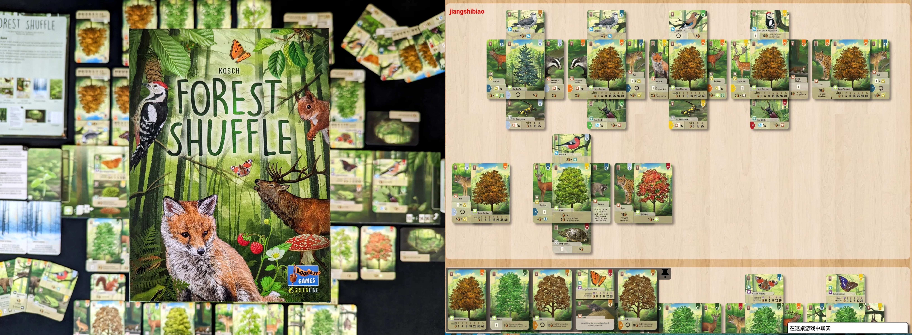

《森森不息》是一个非常火的艺术性+休闲向算分的桌游，我目前只在线上（BGA）玩过。其使用了独特的“树四周拼动物卡牌”机制，完成游戏后真能给予玩家一种构建出优美森林的成就感。卡牌上的动物围绕着这个体系设计，如树顶多为鸟和蝴蝶，树底多为昆虫和爬行动物，树的两侧多为哺乳类动物。不过说到底，**这个桌游的本质其实就是成套收集**，很多卡牌之间都会有联动 combo 来增加行动数或者增加终局计分。

此类休闲向的轮抽游戏对德式重策玩家不太友好，因为超过两人游玩时整体呈现混乱博弈：你可能会因为位次不好而收集困难（如你和上家在收集同一套物种），或者没人愿意牺牲自己去卡当前高分。

## 星际探险队·深海任务 The Crew: Mission Deep Sea

**主要特征**：多人合作；数字，卡牌打出，推理，闯关；适合聚会和推新。

《星际探险队·深海任务》是《星际探险队》（第九行星任务）的扩展，我们很早就接触到了这款合作型桌游。这是一个扑克游戏，由四色 $1 \sim 9$ 和四张大小王构成。这个游戏的基本规则很简单：从上轮赢家（第一轮是队长）开始轮流出牌，从二号位开始必须严格与一号位的颜色相同（如果做不到就能任意出牌），同色里最大者视为赢家并吃下这一墩，持续整个过程直到手牌打完。每人会配备一个声呐，用于在一局的任意时刻标识一次手牌信息。在整局游戏的关键是利用游戏机制和出牌行为做出暗示，大家齐心合力解读各自的手牌情况最终完成目标。

这个游戏设计了难度层层递进的关卡，每局开始时会抽取指定难度之和的任务卡，或者被指派一些特殊任务（如队长需要接下所有任务，声呐不可用，计时等等），适合一大伙人消磨一下午时光看看谁脑子不灵光。

最开始在线下接触这款桌游时，我们通常作为大型桌游结束后的收尾甜点，玩得关数不多所以 get 不到乐趣。后来机缘巧合拉着同伴专门腾出时间在线上 BGA 游玩，这才慢慢感受到了设计者的良苦用心。有些任务卡各自难度不高但组合起来会让难度变得异常得大，卡关情况时有发生。线下卡关最久的如上图，四人必须各领一个任务而任务之间存在一些关联；线上卡关最久的是一个特殊任务，每回合永远不能先手打粉色牌。

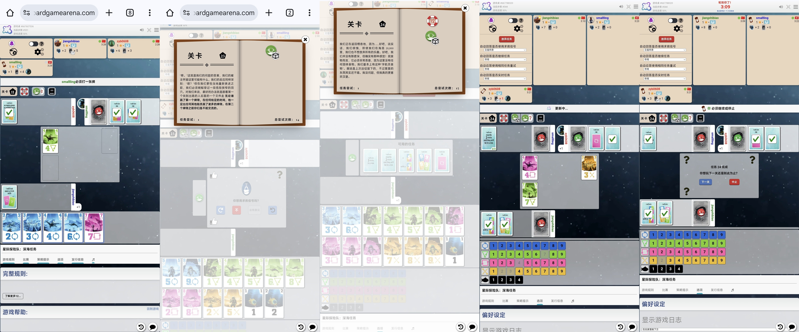

## 拼布艺术 Patchwork

**主要特征**：双人竞争；拼图，几何；适合情侣等双人场景。

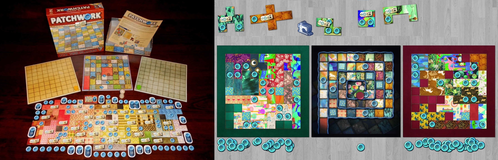

《拼布艺术》是一款二人限定的桌游，经常出现在情侣桌游推荐榜的前列。重度只有 $1.6$，非常适合给没玩过桌游的玩家推新。每位玩家各自维护一张 $9 \times 9$ 的画布，按一定规则和方向从选购几何图形拼到自己的画布上。几何图形越是奇形怪状往往就越便宜，如果能严丝合缝拼上就很有成就感。由于整个几何图形的列表在一开始就已经给出，这个游戏可以玩得很休闲也可以玩得比较策略。我们没有购买线下版桌游，BGA 上的体验挺不错。

## 并购风云 Acquire

**主要特征**：多人竞争；资源运营，卡牌打出，拼图；适合聚会和推新。

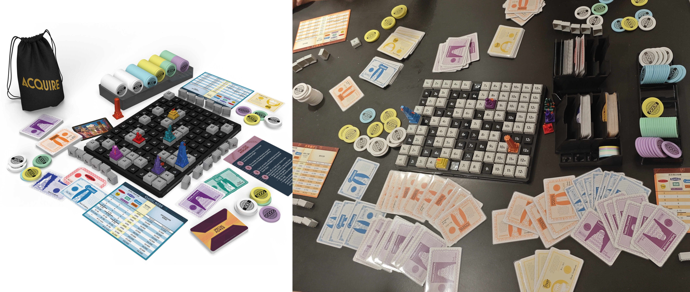

《并购风云》作为一款 1963 年发行的游戏，能经久不衰足以证明其设计的优秀。整个游戏由玩家轮流放置板块推动，过程中会触发连锁酒店的构建、扩展和并购，同时通过购买/出售这些酒店的股票来盈利。游戏的核心在于对酒店规模发展的预判和股票投资的时机把握，既要积极扩张自己的酒店，也要适时投资对手的酒店来分一杯羹。

玩家需要同时把控当前现金流和未来增长潜力，如果前期只进行长远投资，现金用完+手牌不行的情况下只能慢慢被蚕食。好在“随机抽取板块”和“每回合最多购买三张卡牌”这两个设定足够友好，我们的两次线下游戏都用在了推新场景，一把玩下来大家的经济差距不会太大。《并购风云》虽然规则简单但场面足够混沌、决策足够复杂，并购的触发和判定逻辑有点像《两河流域》，不同的触发时机和触发位置会极大地影响酒店潜力和股东收益。

## 璀璨宝石·对决 Splendor Duel

**主要特征**：双人竞争；资源运营，成套收集；璀璨宝石成功的双人改版。

《璀璨宝石·对决》在保留原版核心玩法的基础上，为双人对弈做了精心优化。

+ 除了总分 $\ge 20$ 的胜利条件外，还增加了皇冠数 $\ge 10$ 或单颜色分数 $\ge 10$ 的胜利条件，使玩法更加灵活。
+ 引入了特殊的 token 版图、连续拾取规则和卷轴机制，强化了拿取 token 的策略性。
+ 在一些卡牌上增加了获得新回合、拿取颜色一致的token、拿取卷轴、窃取对手 token 等功能性效果。

相比原版，《璀璨宝石·对决版》在保持原版优雅简洁的同时减少了二人对决时的运气成分，增强了互动性和策略深度，提供了更加紧张刺激的对弈体验，受到了广泛好评（评分高于原版）。我玩得局数不多，理解还不够深刻。

## 冠军挑战者 Challengers

**主要特征**：多人竞争；卡牌管理；分组对战，适合聚会。

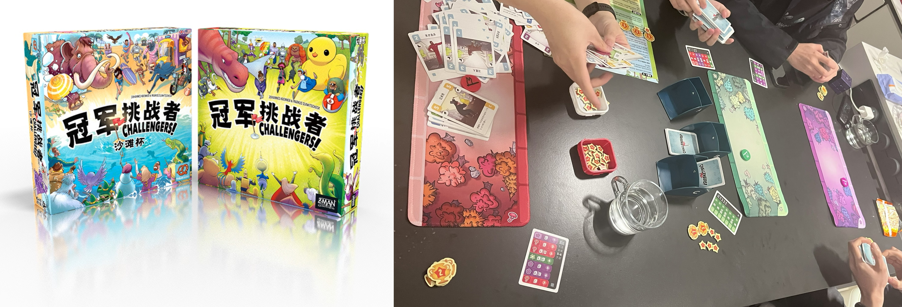

《冠军挑战者》是一个非常休闲的卡牌构筑和对战游戏。总共进行若干轮，每轮两两分组对战，胜者能够加积分但无论胜负都能进行下一轮卡牌构筑，这类模式通常被称为“自走棋”。底层对战逻辑很简单，双方将手牌混洗，轮流对对手牌堆顶亮着的牌进行“进攻”，正好拿下胜利的那张牌牌放在牌堆顶供对手下一轮进攻，如此重复直到某个人无牌可进攻或板凳席（存放已退场的卡牌）种类数超过 $6$ 种。不同系列的卡牌会带来不同的数值和机制，尽量收集相同系列的卡牌能够让牌之间形成更大的 combo。总结来说这是款随机性大、玩起来很欢乐的游戏。

+ 基础版里总共分为城堡、电影、游乐场、鬼屋、太空和海难六个系列的卡牌。
+ 沙滩杯的扩展里引入了沙滩俱乐部、童话森林、大学、玩具店和山顶卡组六个系列的卡牌。

这个游戏重度不高、过程欢乐，很适合推新。不过我只推荐偶数玩家游玩，不然会引入机器人和轮空的人战斗。

## 卡波 CABO

**主要特征**：多人竞争；卡牌管理，记忆力；只适合线下，适合聚会。

《CABO》是一款 **只适合线下** 的极低重度、高随机、考记忆的欢乐桌游，其中最难能可贵的一点是 **游玩方便**，一副普通扑克即可满足要求。游戏的核心机制是每位玩家维护面前的若干张纸牌（初始时是暗置的四张），每回合轮流选择一项操作：将弃牌堆顶和任意一张面前的牌交换；从剩余的牌堆里摸一张，如果点数符合要求（偏大的点数）可通过弃掉此牌来查看己方任意一张牌、查看敌方任意一张牌、和敌方交换任意一张牌等操作，也可以选择将其暗置换入眼前的纸牌。当某一方觉得自己纸牌点数之和足够小时可以宣布“CABO”，绕一圈后本局游戏结束。

每局的游戏是比较清晰的，玩家会通过摸到特殊点数的牌或进行交换操作来搞清楚自己面前的牌，在凑到满意的点数后尽快结束游戏。觉得记住区区几张暗置牌非常容易？线下实际游玩时大家总是会忘记曾经看过的牌。

## 郎中闯江湖 Quacks

**主要特征**：多人竞争；赌狗，卡牌管理；适合聚会。

早就听闻《郎中闯江湖》是个赌狗类桌游，本以为是和 FLIP7 和 21 点类似的无脑抽卡桌游，实际体验下来趣味性超过预期。游戏分为九大轮，每一轮都要进行一次药物炼制（即玩家们并行执行某种赌狗类抽卡），结束后会根据炼制结果获得对应的钱财和道具，前者可以去市场采购新一轮药材以强化未来的药物炼制。总之这个桌游同时结合了卡牌构筑（虽然构筑的是小块的药材塑料片）和赌狗抽卡，选购药材时会简单考察策略性，而赌狗抽卡环节保持了赌狗游戏里的人性考验：我是要多抽一次来白嫖更多的收益，还是见好就收防止整个锅爆炸导致惩罚。

这个游戏的数值和机制设计非常合理。不同能力的药材被精心定价，一把玩下来平衡性没有太大问题。更令人惊艳的是，它会在实时计分的格子上增加一些老鼠尾巴，每轮开始时如果你的当前得分低于领先者，能够获得等同于差距格子里的老鼠个数的起始位置偏移，通过这种方式来进行弱者保护，增加聚会时所有人的参与感。

## 重筑家园 Rebirth

**主要特征**：多人竞争；拼图，卡牌打出；混沌博弈。

《重筑家园》是一款2024年新推出的文明建设类拼图游戏，整体玩法和《卡卡颂》很接近但“地基”已事先确定。游戏融合了引擎构筑和资源管理，每轮玩家通过放置六边形板块来扩展自己的领地。游戏的特色在于其"连锁反应"机制——每个新放置的板块会触发相邻建筑的技能，精心规划的板块放置能产生强大的 combo 效果。

玩家需要平衡短期收益和长期发展，既要合理规划地盘，又要快速抢夺任务卡（得分机制和《欢迎来到》相同）。游戏在多人对局中呈现出很经典的"混沌博弈"特性。版图状态变化频繁，玩家间的互动性强，精心规划的策略可能因为对手的板块放置而被打乱。这种高互动性既增加了游戏的趣味性，也带来了一定的不可预测性。

## 自然和弦 Harmonies

**主要特征**：多人竞争；拼图，成套收集，艺术性；休闲向算分。

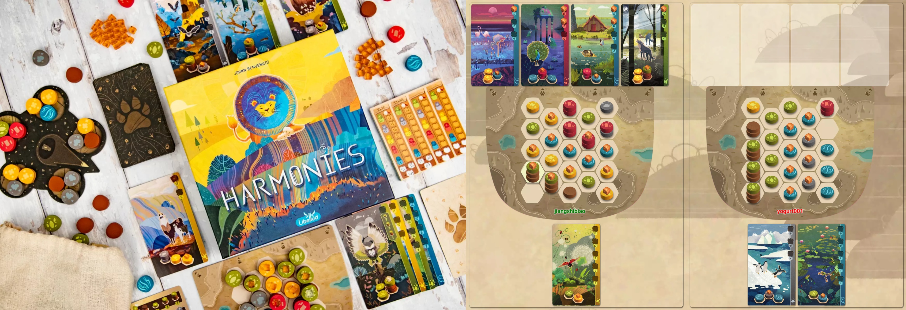

《自然和弦》是 2024 年非常火的游戏，我在 BGA 上和线下都体验过，但玩的局数很少。它的风格和《卡斯卡迪亚之旅》、《森森不息》很接近：艺术气息浓厚，每位玩家都会拼出自己构筑的一个世界；玩家之间的互动比较少，主要是公共资源的轮流拿取；竞争性不是很强，任务卡和 token 组的随机性较强。相比之下《自然和弦》的策略性会更强一些，因为开局拿 token 时你就要对整块空地有个初步规划，而且要根据对手行动、刷出来的任务卡和 token 组来实时调整自己的策略。它的终局条件也有点耐人寻味，速铺流的玩家 A 可能会完全打乱精心铺地的玩家 B 的规划，有点像《欢迎来到》里数字乱填的玩家多次触发停工让精心规划的玩家来不及做完任务。

《自然和弦》看起来兼具了休闲性和策略性，但这种模糊性导致了我给予其的评分要低于竞品。如果我想玩一个休闲的桌游，就不想在开局思考那么多规划（开局可以乱玩，但后期肯定会懊悔自己的糟糕起手，仍然导致游戏体验的降低）；如果我想玩一个策略性强的桌游，就不希望引入过多的随机性和混沌性（超过二人时）。

## 卡卡颂 Carcassonne

**主要特征**：多人竞争；拼图，艺术性；适合聚会。

卡卡颂是一款经典的不能再经典的拼图式桌游。尽管玩法不是特别复杂，拼图后带来的趣味性还是很让人着迷的。游戏终局后的图案往往不是开始时能预料的，所以尽可能的找一张大一点的桌子或者地毯。

根据我的游玩体验，总结出几个比较有代表性的场景：

+   最有成就感的场景就是把寺庙周围的八个格子硬生生地填满了（即使在对手的百般阻挠下）。
+   最欣喜若狂的场景是一个无限扩大的城市在获得某个关键卡牌后终于闭合了。
+   最无奈的场景是盼望着某几张牌，结果一直摸到两端含路的牌，被迫不断修路。
+   最恶心的场景是明明再来一块常见的牌就能拼完城市，结果被对手在旁边放了块导致永远不可能闭合。

经典桌游都会存在一个小问题，就是不同版本之间的规则会有出入。例如城堡得分计算中，到底是有红旗的城市多算分还是门外有道路的棋子多算分，或者最小闭合的城堡（大小为 $2$）到底是否翻倍计分。这个游戏在不加扩展前玩到后来套路比较恒定，我们的“高玩们”前期就在疯狂押宝草原，各种勾心斗角和小草原拼运气连入大草原。这种内卷下限低，我看前期玩农民的人多了就会放弃最大草原改为刷分，往往也能偷到第一。

一直想入手个《卡卡颂·大盒版》（包含全扩）以作纪念，国内版高达 $700^+$ 还一直断货，终于在 2025 年蹭到了亚马逊的活动，以 $300^+$ 入手了德文版（事实上这个游戏在版图里完全没有文字）。全扩规则可参考 [莫雷尔的视频](https://www.bilibili.com/video/BV1PZ4y187Hf)，扩展的推荐程度和他的讲解顺序接近，即最推荐最大的两个扩展《主教堂和餐馆》和《小猪与建筑师》。

## 铁路环游 Ticket to Ride

**主要特征**：多人竞争；成套收集，拼图；适合聚会和推新。

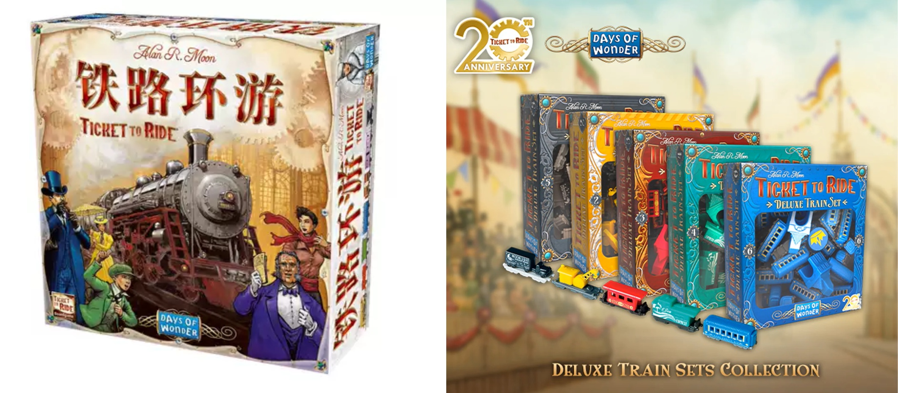

《铁路环游》是桌游圈的经典入门作品，规则简单但策略丰富。基础版要追溯到 2004 年，玩家通过收集不同颜色的车厢卡来连接美国的大城市，完成秘密任务卡获得高分。后来陆续推出了欧洲、北欧各国、亚洲、荷兰、非洲等大量扩展地图。游戏最大的优点是规则清晰上手简单，但玩好需要良好的路线规划和风险预判。

游戏的互动性体现在对关键路线的争夺上，有时候故意卡住对手的关键连接能带来巨大优势。我只在 BGA 上和伙伴们小玩过两把，不知道基础地图会有什么技巧。可以想象不同人数下（特别是双人和多人）的策略差异明显。

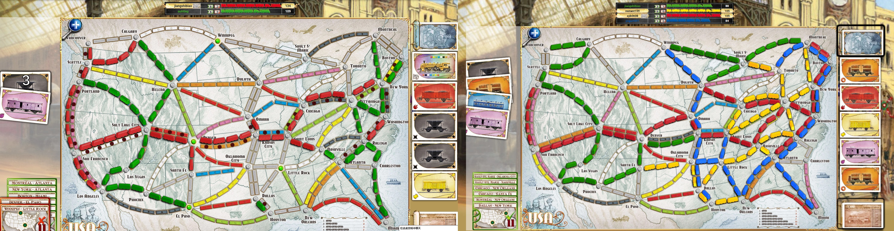

## 无间风云 Good Cop Bad Cop

**主要特征**：多人合作；角色扮演；适合聚会。

在《无间风云》里，玩家都身处一个警匪交织的危险城市。每个人都有一个秘密身份，不是蓝方警探，就是红方卧底。其中，警探们的“探长”和卧底们的“主谋”是双方阵营的核心领袖——游戏的核心目标就是保护己方老大，并找机会干掉对方的老大。游戏开局时每人会分配三张代表身份倾向的牌，最终哪一方颜色更多，你就属于哪一方。行动、装备

《无间风云》作为一个 BGG 评分并不是很高的桌游，我喜欢它如下几个优点：

+ **上手简单，适合推新**。行动规则通俗易懂，$5$ 分钟即可介绍完毕，一局游戏大约 $20$ 分钟就能分出胜负。
+ **过程充满戏剧性**。游戏的核心乐趣不在于复杂的逻辑推理，而在于观察和“嘴炮”——通过调查到的蛛丝马迹和玩家的反应（比如谁总是不敢拿枪？），来猜忌和揪出敌方首领。装备牌带来的意外性和“神反转”也让场面时常充满戏剧性，是聚会破冰、活跃气氛的绝佳选择。
+ **不绑定嘴炮**。作为

这就意味着，你最初对自己的身份判断都可能是“薛定谔的忠诚”，充满了不确定性。

我认为《无间风云》最大的两个优点是 **上手简单** 和 **道具**。节奏非常快。

## 马戏星探 SCOUT

**主要特征**：多人竞争；卡牌打出，数字；适合聚会和推新。

《SCOUT》是一种多人扑克的变种，其最大的特色是 **双向数字** 和 **不可重排** 的设定：游戏开始时你可以决定使用正向或者反向，之后你要严格按照当前的手牌的顺序来打出顺子或对子。玩家每轮必须打出比上家更大或更长的牌组来赢得回合，否则会失去出牌权且必须抽取一张插入己方牌库，当某一方打完手牌时一局游戏结束。这种固定顺序的机制带来了全新的思考方式，需要玩家在出牌时机和牌组组合间找到平衡。有时候你为了攒一波大牌选择隐忍补牌，但憋太久可能会让其他玩家偷鸡打光手牌。一次性小车的设定也很有意思，能带给玩家一轮爆发的机会。

我手上的这盒《SCOUT》是在日本旅游时购入——这可能是迄今为止我们在线下开得次数最多的桌游，得益于其明显的优点：**机制有趣**、**盒小容易携带**、**节奏快互动性强**，很适合重策结束之余玩几把放松一下。因为游戏是积分制，我们通常会轮流当一把先手来结算总分，经常会出现戏剧性场面。开得太多到后来我反而有些抵触心理。

## 海盐折纸 Sea Salt & Paper

**主要特征**：多人竞争；卡牌收集，成套收集，艺术性；适合聚会和推新。

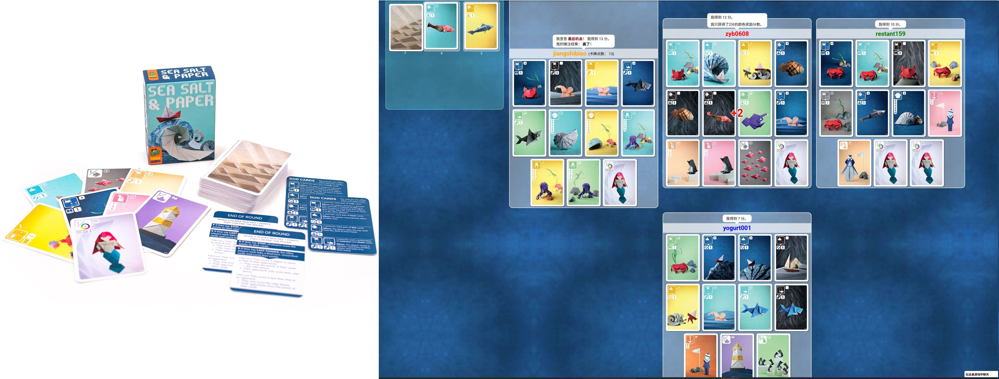

《海盐折纸》以其独特的手绘折纸风格吸引眼球，规则简单、得分结构清晰：玩家通过收集相同颜色或类型的卡牌来组成得分组合，同时要判断何时喊出"最后一轮"来获得额外奖励。这应该是成套收集里最简单的桌游了，重度类似于 faraway，算是《自然和弦》、《森森不息》的推新版。当然和很多桌游一样，二人对弈时博弈性很强（既要构建自己的组合又要干扰对手的计划）而多人游戏时就比较混沌，会出现谁要站出来去卡领先方的问题。

正版的小盒不贵，不过我是在 BGA 线上游玩。整体体验轻松愉快，适合作为暖场游戏或休闲对局。

## 花砖物语 Azul

**主要特征**：多人竞争；拼图，成套收集，艺术性；适合聚会和推新。

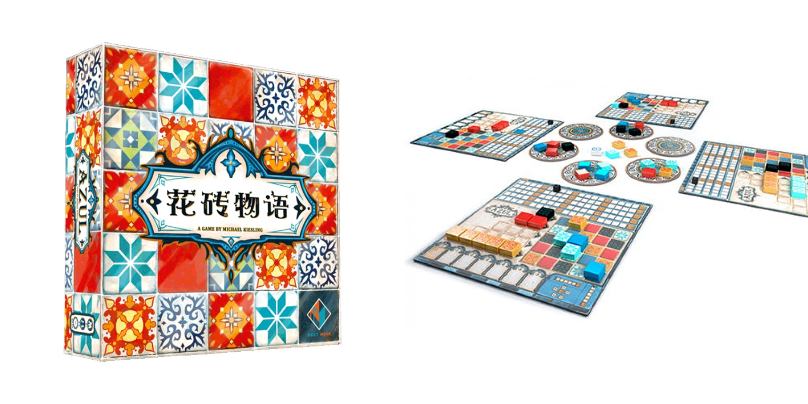

《花砖物语》是极具代表性的拼砖游戏。玩家从厂房抽选颜色瓷砖摆放到自己墙格中，不仅要考虑自己得分，也要阻止别人。实物 token 以其精美的树脂花砖组件闻名，颜色绚丽、质感良好。游戏机制简单但决策深刻 ：拿取的花砖多余部分会落入地板行扣分，如何在完成墙面和避免扣分间平衡是关键。大于二人游戏时会变得非常混沌，大家往往混沌到最后几轮再开始计算，常见剧情是玩家在努力避开一坨非常大的自己无法接收的颜色。

这个游戏我在线上和线下都游玩过，我更喜欢在线下摸着花砖游玩，而且在盲抽袋的加持下 set up 非常容易。

## 璀璨宝石 Splendor

**主要特征**：多人竞争；资源运营，卡牌收集，成套收集；适合聚会和推新。

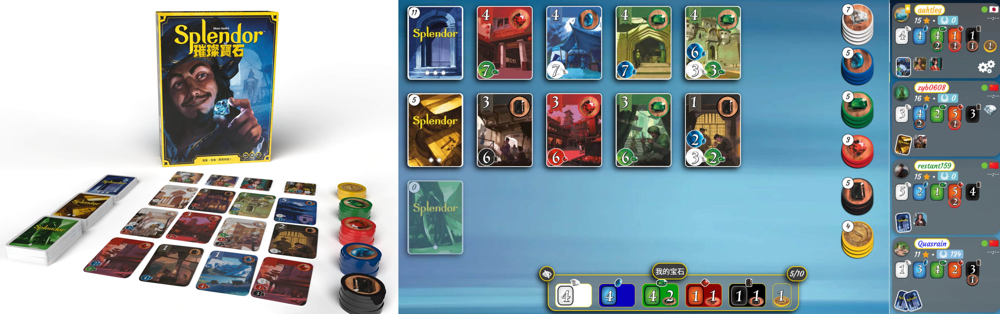

《璀璨宝石》是一款经典的引擎构筑游戏，规则简单但策略丰富。玩家通过收集宝石 token 来购买发展卡，发展卡不仅提供永久宝石折扣，还能积累声望分数。游戏节奏明快，通常 20-30 分钟就能结束一局，重开率很高。游戏的魅力在于简单的规则下蕴含的深度：是要快速凑齐贵族拜访的条件，还是稳扎稳打构建高效的引擎；是要专注某种颜色专精，还是要均衡发展；何时该卡对手的关键牌（存在多人游戏里经典的你卡还是我卡之间的博弈）。

总结来说，《璀璨宝石》规则清晰、token 质感好、卡牌的美术风格统一，很适合作为桌游推新。宝可梦有一款联名的桌游《璀璨宝石·宝可梦》，在保留原版的玩法上引入了进化机制，据说改得不错。值得一提的是，我早期接触桌游时玩过 100 游出的高仿版《宝石商人》，吐槽一下里面的贵族卡数值不太合理，属于是抄都抄不明白。

## 战争之匣 War Chest

**主要特征**：分两组竞争；棋类；适合精通某项传统棋类的玩家。

《战争之匣》将卡牌构筑与区域控制巧妙结合，创造出了独特的策略体验。游戏开始时玩家从公共池中轮抽组建自己的军队，每个单位都有独特的技能和行动方式。通过袋构筑机制，玩家每回合从袋中抽取指令币来激活对应单位进行操作，既要考虑单位的战场部署，又要管理抽袋概率。游戏最大的亮点是高度的不对称性和丰富的策略维度。不同单位的组合能产生各种战术配合，而版图控制的目标迫使玩家在进攻和防守间找到平衡。

《战争之匣》在传统棋类的基础上增加了很多现代桌游的元素，适合 1v1 或者 2v。我在前几把里津津有味地探索兵种之间的 combo，但玩着玩着就发现它和传统棋类一样具有森严的等级制度。在大家都不具备充足经验的情况下，往往谁的搜索步数多，所以如果你和桌游搭子之间有很大的棋力差距，很快会失去对这个游戏的兴趣。

## 火力狂飙 Heat: Pedal to the Metal

**主要特征**：多人竞争；赛车；不是很重的策略类桌游

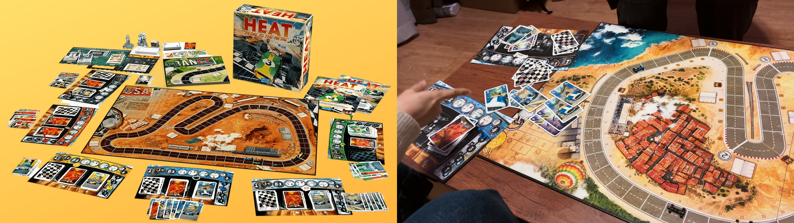

Heat 是一个上限很高的游戏，需要合理地控温、控牌、控冲刺，来让赛车跑得最快。精心设计的地图、灵活的过热机制、微缩的赛车模型，都给人很强的代入感。我们很早接触这个游戏但后来玩得很少，可能因为：

+   Heat 的高上限不在于即时决策而在于控制。我玩桌游更偏向娱乐，完全不想去记牌控牌。
+   Heat 给予落后者过多的补偿机制（无条件加速降温），非高玩间拉不开差距，过程欢乐，结局比较随机。

再次拾起这个游戏时我们已加上扩展，数值爆炸或效果爆炸的黑白牌赋予了游戏更高的灵活性。

## 礼尚往来 That's Not a Hat

**主要特征**：多人竞争；猜词；适合聚会和推新。

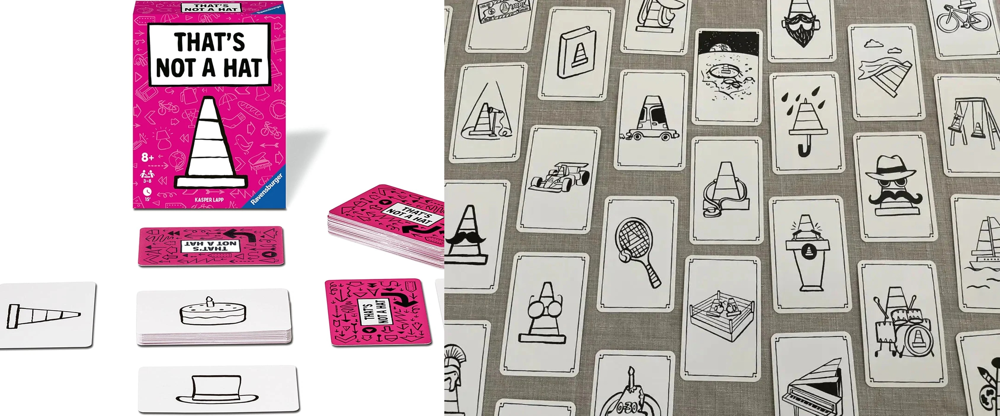

《礼尚往来》这个游戏的规则很简单，每张卡牌的正面印有一个图案，背面印有顺时针或逆时针的方向。卡牌在正常情况下都是暗置的，当前玩家要按照当前卡牌的背面方向指示传递给相邻玩家，并用一句话描述卡牌上的图案。接收者可以选择质疑，此时这张牌会被明置，根据猜对或者猜错惩罚对应的玩家。

简单的图案、场上等同于游戏人数的稀少卡牌、清晰甚至幼稚的规则——相信大家会和刚接触这个游戏的我一样，觉得能很轻易地记住全场流动的卡牌。玩了几把后我就意识到不对劲。这个游戏应该是巧妙地利用了人类记忆的弱点，除非我们刻意按某种规则来强行记忆，否则卡牌多次旋转后很容易就会忘记原始图案。

## 小城大案·罪恶都市 Micromacro Crime City

**主要特征**：多人合作；推理，闯关；适合人数少的聚会，特别是情侣。

《小城大案》以其独特的巨幅犯罪城市地图和创意玩法脱颖而出。玩家在一张详细描绘城市各个角落的地图上，通过观察和推理来解决各种案件。每个案件都是一个独立的故事，需要玩家追踪人物的行动轨迹、发现关键线索、还原事件真相。游戏的魅力在于那种“侦探破案”的沉浸感。看着地图上密密麻麻的细节，一点点拼凑出案件的完整经过，很有成就感。案件难度循序渐进，后期案件还需要结合多个时间线的信息来推理。

这款游戏非常适合喜欢解谜和推理游戏的玩家，单人游玩和双人合作都很不错。体验下来主要有两个缺点，一是这张大地图对空间、灯光、视力和腰都有很大的要求，二是重开性约等于零所以不适合买来收藏。

## 时空神探·巴黎1920 Kronologic Paris 1920

**主要特征**：多人竞争；推理，纸笔；简易版的《X 行星之谜》。

## 荣耀之城 Citadels

## 彩虹数列 TEN

## 画物语 Dixit

## 印加宝藏 Diamant

## 动物元老院 Zoo Vadis

嘴炮。

## 七来运转 Flip 7

## 遥远之地 faraway

## 城堡嘉年华 Castle Combo

## 谁是牛头王 Take-5

## 拉密 Rummikub

## 马尼拉 Manila

嘴炮。