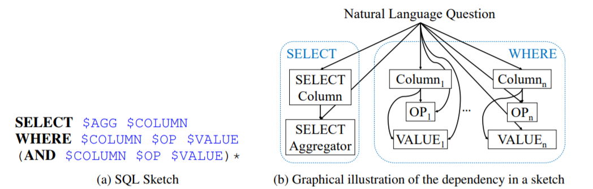
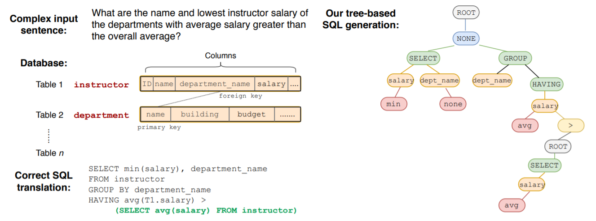
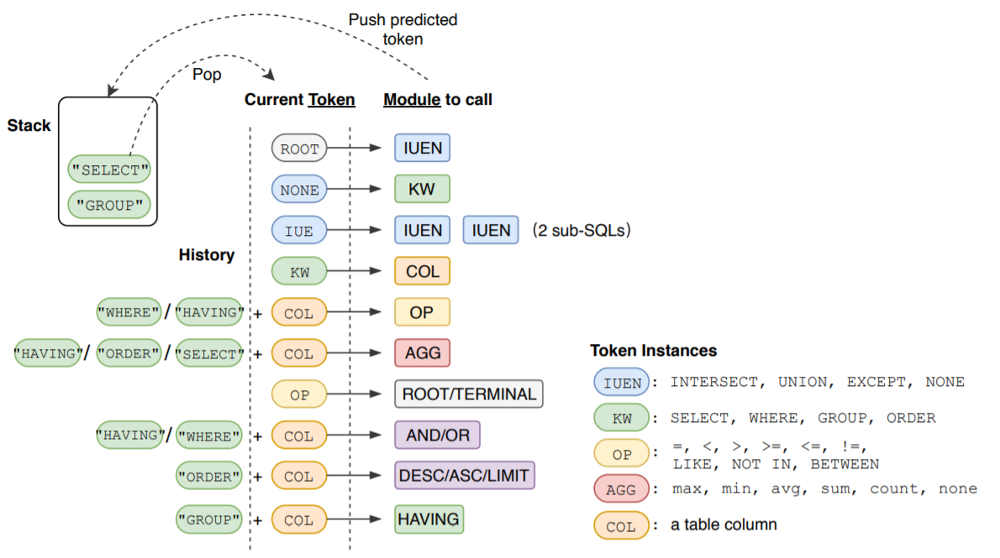
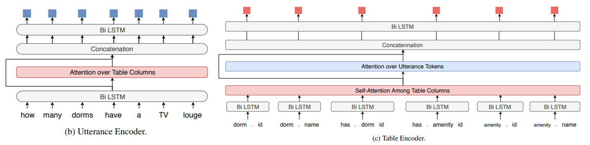

《机器学习》这门课的大作业是选择一个深度学习的排行榜去刷 rank。

本文介绍 Text-to-SQL 领域的 CoSQL 数据集，并应用一些相关的深度学习方法测试准确率。

#### 什么是 CoSQL

+   [CoSQL](https://arxiv.org/abs/1909.05378) 全称 **Co**nversational text-to-**SQL**，是耶鲁大学在 EMNLP2019 提出的 NLP 领域的数据集。
+   [官方网站](https://yale-lily.github.io/cosql) 。与经典的 text-to-SQL 任务（如 Spider）相比，CoSQL 的难度增加了不少：
    +   为了模拟现实场景，用户的询问可能有多轮，要求系统有整合信息的能力。
    +   系统生成 SQL 语句并得到查询结果后，要用自然语言反馈给用户。
    +   用户与系统的多轮对话之间，可能需要 clarify ambiguous questions（如下图 $Q3$ 和 $R3$）。

+   CoSQL 包含到 3k+ 组对话（$2164$ Train，$292$ Dev，$551$ Test），共计 10k+ 标注过的 SQL 询问。值得注意的是，CoSQL 的内容横跨 $200$ 个数据库，而且不同组数据所用到的数据库 **没有交集**（$140$ Train，$20$ Dev，$40$ Test），以考察模型的鲁棒性。
+   CoSQL 一共有三个任务：
    1.   **SQL-grounded dialogue state tracking**：给出 interaction history，转化成对应的 SQL 语句。可能会包含表述模糊的问题，此时会同时给出确认信息。以上图为例，给出 $(Q_1,Q_2,Q_3,Q_4,R_3)$ 求 $S_4$。
    2.   **natural language response generation**：以 SQL 语句和返回结果为基础，生成自然语言回答。
    3.   **user dialogue act prediction**：对每一个用户的提问，判断属于以下哪个 DB user 标签。
         
+   **我们组重点关注 DST 任务**。原因如下：
    +   第一个 **DST** 任务对标传统的 Text2SQL 数据集的任务，并在难度上做了拔高，适合我们挑战。
        +   **Spider** $\to$ **CoSQL** $\to$ **DST** 的难度递增。Spider 在以往的数据集的基础上，提出了 Cross-Domain 的要求。而 SparC 和 DST 进一步要求解决多轮对话的场景。
        +   那 **DST** 与 **SParC** 的区别呢？作者在论文中提到，SparC 数据集中代表性的做法CD-Seq2Seq 和 SyntaxSQL-con 在 **DST** 任务下正确率均下降，说明 CoSQL 比 SparC 任务更琐碎更难。
    +   第二个任务与 Test2SQL 的关系不大，倒是更接近翻译任务。
    +   第三个任务其实就是做一个 $11-$分类器
        +  分类问题已经很成熟，加上部分标签很容易预测，baseline 算法已经有 60-80% 的准确率。
        +  准确率提高到上面应该会有个瓶颈，因为关键标签的预测还是要靠理解 Text 并转化为 SQL，而 CoSQL 的难度摆在那里。而且，最终的真实标签仅仅是一个类别，不利于模型的学习。
        +  由以上两条，我们发现该任务改进空间不大，难以大幅提高准确率。
+   **DST 任务** 主要有两个指标：
    1.  Question Match：把一个 dialog 里不同提问视为不同的 Question，对 SQL 做 Exact Match。
    2.  Intersection Match：一个 dialog 里的全部 Question 正确才算正确。

#### SQLNet

+   [SQLNet](https://arxiv.org/abs/1711.04436) 选自 ICLR2018，在 WikiSQL 的正确率在 65%-70%。[开源代码](https://github.com/xiaojunxu/SQLNet)。
+   **SQLNet 是一个比较基础的 Text2SQL 模型，在本任务中并不适用**，但它的思想还是比较有趣的，所以我去了解了一下具体原理，总结在下面。可能会对解决 CoSQL 问题带来启发。 
+   SKETCH-BASED QUERY SYNTHESIS
    +   传统的 Seq2Seq 对顺序敏感，但是在 NL2Seq 问题中，Where 语句后并列的条件顺序无关。
    +   所以 SQLNet 提前规划好了 Sketch（模板），针对 sketch 里的每个 slot 进行预测和填充。
        
+   SEQUENCE-TO-SET PREDICTION USING COLUMN ATTENTION
    +   **Sequence-to-set**：根据上述思想，把 Where 语句模板化后，我们转而预测是否要选择每一列，即求 $P_{\text {wherecol }}(col | Q)=\sigma\left(u_{c}^{T} E_{c o l}+u_{q}^{T} E_{Q}\right)$，其中 $u$ 是我们要训练的参数，$E$ 是 embedding（用 LSTM 生成，两个 $E$ 不共享权重）。
    +   **Column attention**：上述做法存在一个问题：不同的列对于问题 $Q$ 里不同的地方敏感程度不同。
        1.  考虑引入 attention 机制，使得 $P_{\text {wherecol }}(c o l | Q)=\sigma\left(u_{c}^{T} E_{c o l}+u_{q}^{T} E_{Q | c o l}\right)$
        2.  具体地，设 $L$ 是单词总数，$d$ 是每一个 LSTM 节点输出的 embedding 大小，我们用 $H_{d \times L}$ 矩阵表示问题 $Q$ 里每一个 token 的结果。
        3.  假设我们训好了一个 attention 矩阵 $W_{d \times d}$，那么问题 $Q$ 里第 $i$ 个 token 对当前表项的 attention 权重是：$v_i=(E_{col}^T)WH_Q^i$。其中 $H_Q^i$ 表示 $H$ 的第 $i$ 个列向量。
        4.  所以问题 $Q$ 里 $L$ 个 token 对该表项的贡献是 $E_{Q|col}=H~\text{softmax}(v)$
    +   最终预测方法如下：
        +   **Column slots** 当我们预测出了 $P(col|Q)$ 后，有两种方法决定如何选择：
            1.  直接卡一个概率阈值，高于这个阈值的全选。
            2.  再训练一个 $0 \sim N$ 的分类器表示选择的列数，从高到低选取对应的列。
        +   **OP slots** 是 `>,<,=` 的三分类问题。
        +   **VALUE slot** 直接用 Seq2Seq 生成。
        +   Select 与 Where 的列选择差不多，但只要选择一列。

#### SyntaxSQLNet

+   [SyntaxSQLNet](https://arxiv.org/pdf/1810.05237) 是第一个专门针对 Spider 数据集的算法，Exact Matching 的准确率 为19.7%，进行数据增强后准确率为27.2%。[开源代码](https://github.com/taoyds/syntaxSQL)。
+   SyntaxSQLNet 也是 SParC 数据集的 baseline 之一。虽然准确率不高，这种动态 Schema 的思想十分重要。**而且作者提出了数据增强的方法，也提示我们后期可以从这个角度进行调优**。
+   Tree-based SQL generation
    
    +   因为 Spider 数据集包含复杂的嵌套结构，不能用 SQLNet 里固定的 sketch 了，要用动态的 Schema。
    +   所以 SyntaxSQL 用树形结构是预测 SQL 语句，定义以下几个概念：
        +   **Current Token**：描述了当前要填充的 token 种类。
        +   **Module to call**：下一个要调用的函数是什么。
        +   **Stack**：故弄玄虚，其实就是个递归的人工栈啦！
        +   **History**：根据 SQL 的 Grammar，会对后来判断造成影响的 token 历史。
            
    +   模型输入有 Question，Table Schema，SQL History 三个部分。
        +   对于 **Table Schema**，SyntaxSQLNet 把Table Name，Column Name，Column Type 一起作为输入，然后通过Bi-LSTM把Table和Column的信息都在一个 encoding 里来表示。
        +   对于 **SQL History**，根据不同的情况定义不同的编码方式。注意训练阶段和预测阶段的处理有所区别：training的时候，会直接使用标注数据中提供的 gold query（类似地跑一个递归树结构）来作为 SQL History；而在 test数据上，会使用前序预测出来的SQL语句来替代。
+   数据增强
    +   SyntaxSQLNet 论文中给出了通过数据增强来提升模型表现的方法（效果提高了不少）。
    +   首先在Spider的标注样本上分析提炼出通用的 Question-SQL 模板，将一些过于简单模板过滤掉后，得到280 个复杂度较高的模板。然后利用 WikiSQL 数据集，对 **每个数据表** 任意挑 10 个模板，随机选择表格中的 Columns 进行填充。
    +   填充的时候会考虑所选择 Column 的数据类型与需要填充的 Slot 的数据类型是匹配的，比如都是数值型。这样共产生了约 98000 个 Question-SQL 样本用于训练。

#### IRNet, RatSQL

+   [IRNet](https://arxiv.org/abs/1905.08205)，[RatSQL](https://arxiv.org/abs/1911.04942) 是 Spider 数据集里 SOTA 的两个模型。目前还未深入阅读论文。
+   估计这两个模型也能直接应用在 CoSQL 上，**目前还未尝试**。为了解决 CoSQL 里多轮对话的机制，我觉得 **可以把每轮对话都拆开来当做独立的来训练**。具体地，如果有一轮 interaction 里有 $3$ 组对话 $\{Q_1,A_1,Q_2,A_2,Q_3,A_3\}$，我们拆成三组来训练，即 $\{Q_1,A_1\}$，$\{Q_1+Q_2,A_1+A_2\}$ 和 $\{Q_1+,Q_2+Q_3,A_1+A_2+A_3\}$。注意模型预测时我们只有 $\{Q_1,Q_2,Q_3 \}$，我们每次要解出上一轮的结果才能带入预测下一轮，每迭代一次准确率都会降低好多。

#### CD-Seq2Seq

+   [CD-Seq2Seq](http://arxiv.org/abs/1804.06868) 是 NAACL2018 的 Outstanding Papers，提出了一种基于上下文的 seq2seq 模型将自然语言转换为SQL查询语句。记录交互的历史，模型中维持着一个交互对话级别的编码器，在每轮对话结束后更新它，把之前曾经预测过的查询语句中的子序列加入到之后的预测中，精简预测过程。
+   CD-Seq2Seq 在 SParC 的论文里被优化，加入了 cross-domain 和 multiple turns 的信息。这个做法被 CoSQL 官方设为 baseline，**所以也是我们实验的 baseline**。我们重新训练了 CD-Seq2Seq，并用了官方 evaluation 工具测试其正确率和性能。
+   **普通 Seq2Seq 模型**
    +   Seq2Seq 模型是解决 Text2SQL 一个直接的方案。
    +   Encoder 阶段，正向 LSTM： $\mathbf{h}_{j}^{\vec{E}}=\mathrm{L} \mathrm{STM}^{\vec{E}}\left(\phi^{x}\left(x_{i, j}\right) ; \mathbf{h}_{j-1}^{\vec{E}}\right)$
    +   引入 Attention 机制：$s_{k}(j) =\mathbf{h}_{j}^{E} \mathbf{W}^{\mathbf{A}} \mathbf{h}_{k}^{D}, \alpha_{k}=\operatorname{softmax}\left(\mathbf{s}_{k}\right), \mathbf{c}_{k} =\sum_{j=1}^{\left|x_{i}\right|} \mathbf{h}_{j}^{E} \alpha_{k}(j)$
    +   Decoder 阶段，用 Attention vector 更新：$\mathbf{h}_{k}^{D}=\mathrm{LSTM}^{D}\left(\left[\phi^{y}\left(y_{i, k-1}\right) ; \mathbf{c}_{k-1}\right] ; \mathbf{h}_{k-1}^{D}\right)$
    +   对 $\mathbf{h}_k^D$ 求每种 token 的概率分布
        +   设 $\mathbf{m}_{k} =\tanh \left(\left[\mathbf{h}_{k}^{D} ; \mathbf{c}_{k}\right] \mathbf{W}^{m}\right)$
        +   $P\left(y_{i, k}=w | \bar{x}_{i}, \bar{y}_{i, 1: k-1}\right) \propto \exp \left(\mathbf{m}_{k} \mathbf{W}_{w}^{o}+\mathbf{b}_{w}^{o}\right)$
+   **CD-seq2seq模型**
    +   在原本的基础上加入历史交互信息。引入 dicourse state：$\mathbf{h}_{i}^{I}=\mathrm{LSTM}^{I}\left(\mathbf{h}_{i,\left|\bar{x}_{i}\right|}^{E} ; \mathbf{h}_{i-1}^{I}\right)$
    +   在 Hidden state 的预测中加入 discourse state：$\mathbf{h}_{i, j}^{\vec{E}}=\mathrm{LSTM}^{\vec{E}}\left(\left[\phi^{x}\left(x_{i, j}\right) ; \mathbf{h}_{i-1}^{I}\right] ; \mathbf{h}_{i, j-1}^{\vec{E}}\right)$
    +   在 Attention vector 的预测中也加入 discourse state
        +   $s_{k}(t, j)=\left[\mathbf{h}_{t, j}^{E} ; \phi^{I}(i-t)\right] \mathbf{W}^{\mathbf{A}} \mathbf{h}_{k}^{D}$
        +   $\mathbf{c}_{k}=\sum_{t=i-h}^{i} \sum_{j=1}^{\left|\bar{x}_{t}\right|}\left[\mathbf{h}_{t, j}^{E} ; \phi^{I}(i-t)\right] \alpha_{k}(t, j)$
    +   现在的 token 预测概率分布如下：
        +   $
            P\left(y_{i, k}=w | \bar{x}_{i}, \bar{y}_{i, 1: k-1}, \bar{I}[: i-1]\right) \propto \exp \left(\mathbf{m}_{k} \mathbf{W}_{w}^{o}+\mathbf{b}_{w}^{o}\right)$
    +   将之前对话的一些 Segment 加入到当前对话中，可以缩短预测过程。
        +   将第 $l$ 次到第 $r$ 次交互过程中出现的 segment 进行预测 $\mathbf{h}^{S}=\left[\mathbf{h}_{l}^{Q} ; \mathbf{h}_{r}^{Q} ; \phi^{g}(\min (g, i-a))\right]$
        +   segment预测概率分布 $P\left(y_{i, k}=\bar{s} | \bar{x}_{i}, \bar{y}_{i, 1: k-1}, \bar{I}[: i-1]\right) \propto \exp \left(\mathbf{m}_{k} \mathbf{W}^{S} \mathbf{h}^{S}\right)$
    +   正则化 embedding function $\phi^{y}(\bar{s}=\langle a, b, l, r\rangle)=\frac{1}{r-l} \sum_{k=l} \phi^{y}\left(y_{b, k}\right)$
    +   token 预测交叉熵 $\mathcal{L}\left(y_{i, k}^{(l)}\right)=-\log P\left(y_{i, k}^{(l)} | \bar{x}_{i}^{(l)}, \bar{y}_{i, 1: k-1}^{(l)}, \bar{I}^{(l)}[: i-1]\right)$
    +   定义 interaction loss：$\mathcal{L}=\frac{n}{B} \frac{1}{\sum_{i=1}^{n}\left|\bar{y}_{i}^{(j)}\right|} \sum_{i=1}^{n} \sum_{k=1}^{\left|y_{i}^{(j)}\right|} \mathcal{L}\left(y_{i, k}^{(j)}\right)$
+   训练结果如下（$P$ 表示 CoSQL paper 里的结果，$T$ 表示我们重新训练后的结果；针对 Dev 数据集）

| P: Question Match | P: Interaction Match | P: Interaction Match | T: Interaction Match |
| ----------------- | -------------------- | -------------------- | -------------------- |
| **13.8**          | 12.6                 | 2.1                  | **2.4**              |

+   在不同难度的 Dev 数据上的正确率。

| T: easy | T: medium | T: hard | T: extra | T: all | T: joint all |
| ------- | --------- | ------- | -------- | ------ | ------------ |
| 25.5    | 4.4       | 3.7     | 0.9      | 12.6   | 2.4          |

+   对于轮数的正确率统计如下。可以发现，从第二轮开始正确率就大幅下降，因为要基于第一轮的结果。

| T: turn 1 | T: turn 2 | T: turn 3 | T: turn 4 | T: turn > 4 |
| --------- | --------- | --------- | --------- | ----------- |
| 21.6      | 10.9      | 8.2       | 6.1       | 8.5         |

#### EditSQL

+   [EditSQL](https://arxiv.org/abs/1909.00786) 是耶鲁大学在 EMNLP2019 提出的多轮对话的 Text2SQL 解决方案。
+   EditSQL 最开始是针对 SParC 的任务进行设计的（CoSQL 也是刚发表在 EMNLP2019 上的，所以论文并没有测在 CoSQL 上的正确率）。目前它是 SParC 和 CoSQL 的 SOTA，在两个数据集的 Question Match 上均达到了 $40+\%$ 的成绩。**本次实验我们主要基于 EditSQL 进行一些修改和调优**。
+   EditSQL 并没有提出 fancy 的 backbone，而是多次利用基于Attention 的 LSTM 搭模型。
    
+   Utterance-Table Encoder and  Interaction Encoder
    +   注意查询可能会涉及多个表，所有的 column header 均用 `<table_name>.<column_name>` 表示。
    +   对于 Utterance Encoder 的处理比较常（bao）规（li）。先用 bi-LSTM 把用户的每个 token 都连起来，再用 hidden state 对所有 column header 做一遍 Attention。最后，把每个 token 的 hidden state 和对应的 Attention Vector 连接起来，再套一层 bi-LSTM。记最终的状态为 $\mathbf{h}^E$。
    +   注意在 turn $t$ 时不仅要用到 $h^E_t$ 的信息，可能还会用到 $h^E_{i(i<t)}$ 的信息。作者提到了一个 **Turn Attention** 机制。训一个 $W_{turn-att}$，把当前的 $h^E_t$ 和和之前的 $h^E_{i(i<t)}$ 都做一遍点乘并 $\mathrm{softmax}$ 一下。最终的 $\mathbf{h}^{E'}_i$ 是由前几个 Utterance Encoder 复合而成，即 $\mathbf{h}^{E'}_t=\mathbf{h}^E_t+\sum \limits_{i=1}^{t-1}\alpha_i\mathbf{h}^E_i$。
        
    +   对于 Table Encoder 的处理略复杂一些。注意到 column header 彼此可能会产生关系（**foreign-key**），所以先对 Columns 做一个 Self-Attention，再对 Utterance 做一个 Attention。记为 $\mathbf{h}^C$。
    +   Utterance 和 Table 在代入前可以先用 **BERT** 处理一下。
+   Table-aware Decoder
    +   用 $\mathbf{q}$ 表示要求的 SQL 语句。我们再套一层 LSTM 来预测 $\mathbf{q}$。具体地，假设已预测好前 $k$ 个词，则下一个 LSTM 节点满足 $\mathbf{h}_{k+1}^{D}=\operatorname{LSTM}^{D}\left(\left[\mathbf{q}_{k} ; \mathbf{c}_{k}\right], \mathbf{h}_{k}^{D}\right)$ 。其中 $\mathbf{c}_{k}$ 综合了之前的 $\mathbf{h}^E, \mathbf{h}^C$ 等上下文信息；$\mathbf{q}_k$ 对应答案第 $k$ 个 token 的 embedding（可能是 Table Header 也可能是 SQL Keyword）。
    +   那么怎么用 $\mathbf{h}^D_k$ 来预测 $\mathbf{q}_k$ 呢？在所有  Table Header 和 SQL Keyword 后训一层全连接网络。
+   **Query Editing Mechanism**
    +   除了 Utterance Encoder 和 Table Encoder $(\mathbf{h}^E, \mathbf{h}^C)$，作者还用了一个 $\mathbf{h}^Q$ 去影响 $\mathbf{c}$ 。
    +   这个机制的初衷是：通过统计发现，从第二个 turn 开始，SQL 答案里有一半以上的 tokens 是从上一个 turn 里复制过来的。所以作者想更好地利用上一轮答案的信息。
    +   称上一轮复制过来的 token 是 copy，新增加的 token 是 insert。在 Decode SQL 结果的每一步，都去计算一下本次 token 的类别分布。即： $P_{copy}=\sigma(\mathbf{c}_k\mathbf{W}_{copy}+\mathbf{b}_{copy}),P_{insert}=1-P_{copy}$。
    +   知道了 $P_{copy}$ 和 $P_{insert}$ 后，针对之前预测 $\mathbf{q}_k$ 的概率分布，可以乘上各自的类别概率来修正。 
+   复现和测试
    1.   与 baseline 相比，该做法用到大量 LSTM 结构，产生了 **大量** 的参数，对内存的要求很大。
    2.   我在 NVIDIA TESLA 16G 上开 `batch_size = 1` 训练依然 `out of memory`。
    3.   给原作者提了一个 [issue](https://github.com/ryanzhumich/editsql/issues/19)  目前还未被答复。
    4.   为了先复现出结果，先在服务器上用 CPU 训练。跑了 1.5 周，测试结果见下。
    5.   **后续两个方向的改进：1. 减少模型参数，使其能在 GPU 上训练；2. 数据增强，减少过拟合**。
+   总体结果（$P$ 是 editSQL github 里的官方结果，$T$ 表示我们重新训练后的结果；针对 Dev 数据集）

| P: Question Match | T: Question Match | P: Interaction Match |
| ----------------- | ----------------- | -------------------- |
| 39.9              | **43.54**         | 13.3                 |

+ 观察训练后的一些 log 信息，发现 **过拟合现象** 十分严重。

| T: Train Token Match | T: Dev Token Match | T: Train String Match | T: Dev String Match |
| ----------------- | --------------- | ------------------ | ---------------- |
| 99.81 | 88.66 | 99.14 | 43.54 |

+   在不同难度的 Dev 数据上的正确率。相比于 CD-Seq2Seq，在难的 Case 上有更大的提高。

| P: easy | P: medium | P: hard | P: extra | P: all | P: joint all |
| ------- | --------- | ------- | -------- | ------ | ------------ |
| 62.7    | 29.4      | 22.8    | 9.3      | 39.9   | 12.3         |

+   对于轮数的正确率统计如下。从第二轮正确率也会下降，但是比 CD-Seq2Seq 下降得缓慢。

| P: turn 1 | P: turn 2 | P: turn 3 | P: turn 4 | P: turn > 4 |
| --------- | --------- | --------- | --------- | ----------- |
| 50.0      | 36.7      | 34.8      | 43.0      | 23.9        |

#### 数据增强

数据增强的思路和样例已经在 report 里介绍了。详细测试结果如下：

| 方法                     | N    | L    | 问题准确率 | 全对准确率 |
| ------------------------ | ---- | ---- | ---------- | ---------- |
| 原方法1（没在天河跑）    | 2157 | 200  | 19.4%      | 5.5%       |
| 原方法2                  | 2157 | 200  | 18.9%      | 4.8%       |
| 原方法3                  | 2157 | 200  | 19.3%      | 3.8%       |
| Baseline（原方法取平均） | 2157 | 200  | 19.2%      | 4.7%       |
| 原方法 换限制            | 2157 | 250  | 18.6%      | 4.7%       |
| jsb 数据增强             | 3276 | 250  | 19.0%      | 4.1%       |
| jsb 数据增强             | 3276 | 200  | 20.1%      | 5.5%       |
| lgl 数据增强             | 5457 | 200  | 18.2%      | 3.8%       |
| lgl 数据增强             | 5457 | 150  | 17.3%      | 3.8%       |