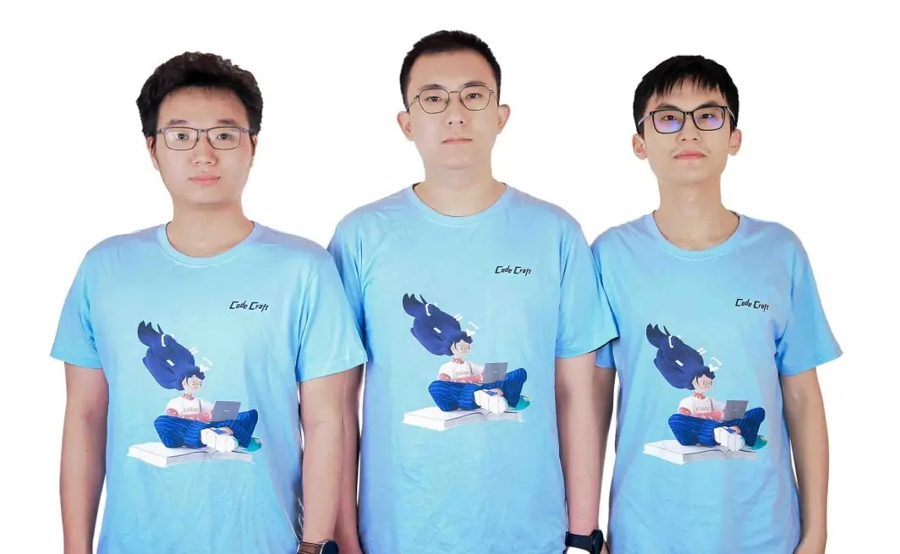
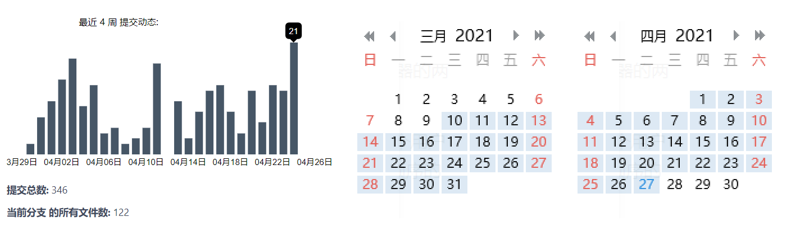
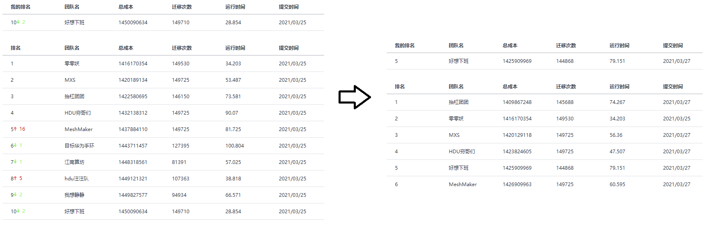
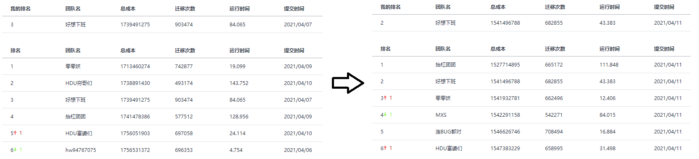
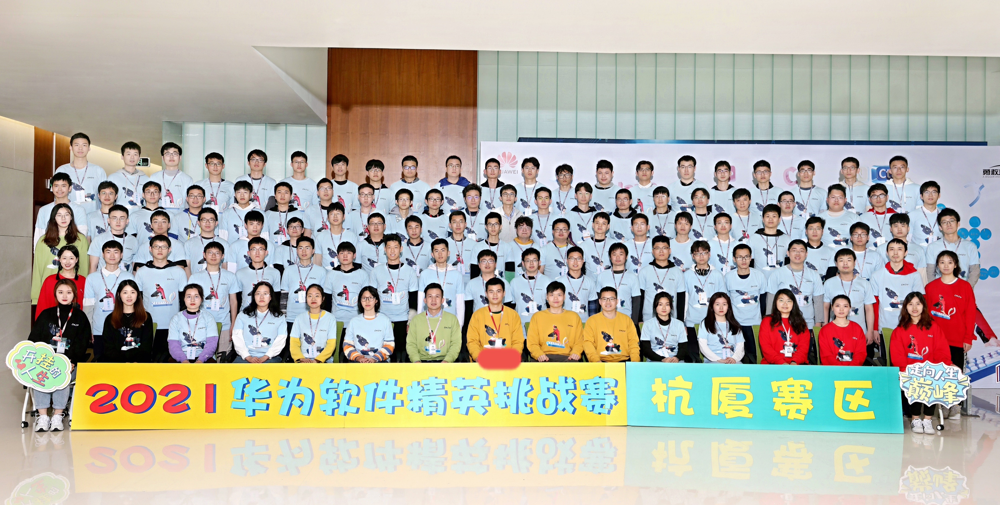
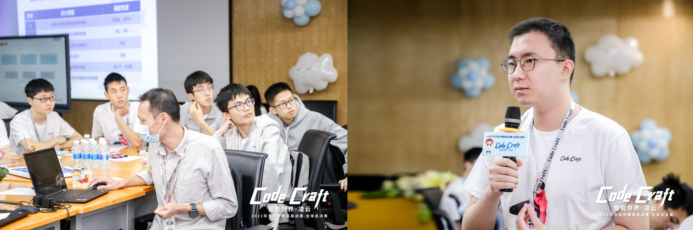
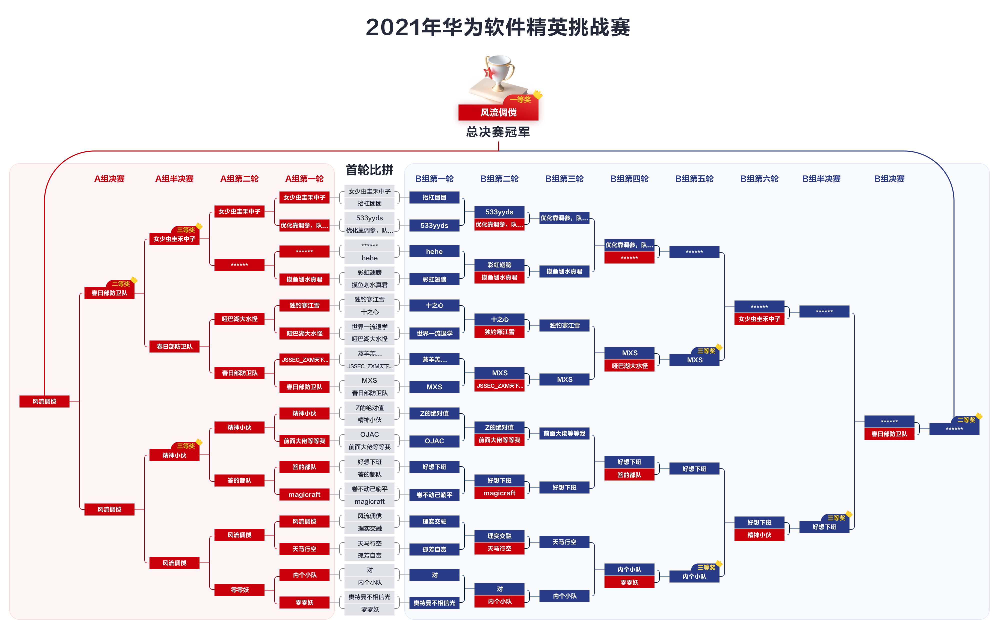
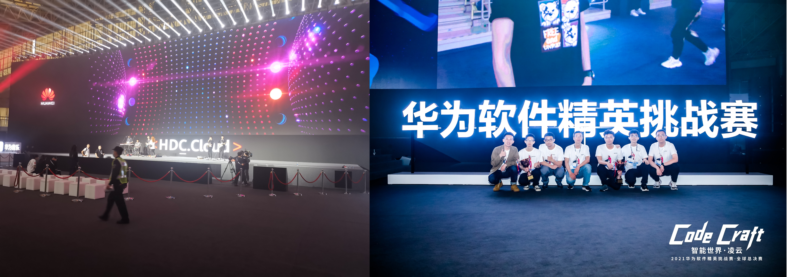

[CodeCraft 2021](https://competition.huaweicloud.com/codecraft2021#introduction) 如期而至。本届软挑以云资源调度为背景，历时一个半月（$2021.03.10 \sim 2021.04.24$）。

软挑总共分为三大阶段：初赛，复赛和决赛。

+   全国共分八个赛区，初赛和复赛在赛区内部 PK，$N \rightarrow 32 \rightarrow 4$。决赛时全国的 $32$ 支队伍线下 PK。
+   每个阶段开始时，会有十天左右的练习赛，每天可以提交 $100$ 次。此时，官方会给出这个阶段的赛题，开放线上测试平台，并提供所有线上的数据（可以尽情地过拟合，也可以尽情地藏分）。练习赛结束一段时间后就是正式赛（初赛是线上 $3$ 天，复赛是线下 $3$ 小时，决赛是线下 $3.5$ 小时）。正式赛会有小部分的需求更新，线上测试数据也会替换成未知的，最多只能提交 $30$ 次。
+   在今年的赛题中，初赛和复赛是复杂模型的纯优化问题，可以直接统计每支队伍的分数并择优晋级；决赛套上了一个双人博弈，练习赛时采用天梯积分制，总决赛则采用双败制，实力和运气缺一不可。

作为好想下班队的成员，我在这一个半月里潜心于赛题，获得了很多经验和感触，在此记录一下。

<!-- more -->

## 建队

我在 2018-2019 年奋战 ACM，在 2020 年挣扎大三的专业课，所以今年是第一次打软挑。

"组一个好队就是成功了一半"——秉持着这个理念，我攀到了两个牛逼学长：

+   王禹程（reku），精通华为软挑，2019 年咕咕咕队（全国冠军），2020 年鸽鸽鸽队（全国第四）。
+   陈诗翰（shb），擅长意识流解题，我曾经的 ACM 队友，2020 年鸽鸽鸽队（全国第四）。

我们~~苦上班久矣~~，**好想下班** 这个队名一拍即合。

虽然抱上了大腿，我身上的压力依然不轻。我们经常开玩笑说，要是进不了决赛或者决赛打不到第四，根据控制变量法（本质上是我替换了 2020 年鸽鸽鸽队的 Claris），我就是那个头号战犯（哭）。

github 速度不稳定 ，故我们选用 [gitee](https://gitee.com/) 作为代码托管平台。我们在这个项目里建了格子的文件夹，独立更新代码，这样就不用处理 merge 的问题；每当有一个队员搞出了一个新花样时，其他人可以选择 pull 这个 feature 并加入自己的代码里。以下是码云上的 commit 统计和 QQ 群的聊天记录统计。

## 初赛练习赛

初赛赛题需要模拟云公司在 $T(\le 1000)$ 天内接受用户订单并完成资源创建、分配和调度的过程。用户依次给出一些虚拟机（vm）订单，云公司需要为它们分配合适的服务器（server）。**可以离线**。

有 $N(\le 100)$ 种可购买的双节点服务器，CPU 核数和内存大小是 $(cpu_i,ram_i)(1 \le cpu_i,ram_i \le 512)$，购买价格是 $fix_i$。如果它装有至少一台虚拟机，每天会产生能耗 $daily_i$。

有 $M(\le 1000)$ 种可能的虚拟机订单，它要求服务器提供 $(cpu_i,ram_i)$ 的空间，双节点部署（在一个服务器的两个节点上同时占用空间）或单节点部署（在一个服务器的任意一个节点占用空间）。

在第 $i$ 天开始前，你可以进行至多 $\lfloor \frac{5}{1000}vm \rfloor$ 次免费的虚拟机迁移（$vm$ 是目前的虚拟机总数），每次可以把一个用户虚拟机从一个服务器迁移至另一个服务器（或将单节点虚拟机迁移至服务器的另一个节点）。随后接收按顺序的 $R_i$ 个用户请求，创建某种型号的虚拟机订单或删除之前已有的某个订单（创建总数 $\le 10^5$）。

最终成本由服务器购买成本和服务器每天的电费构成。在 $90s$ 内模拟完所有操作，使成本尽可能低。

比赛刚开始出了个小插曲：杭厦赛区的 Martin 哥开源了一份不含算法的 baseline 代码，且这份代码击败了当时绝大多数队伍。在每次装不下虚拟机时，该算法会指定购买 `13` 号服务器，估计是这种服务器性价比很高吧。著名的大赛纪检员 **赤耳** 认为这一举动很不公平，就混入了杭厦群狂喷 Martin。

在这件事情上，我认为正反都有一定道理。首先，开源一份 **合适** 的框架有利于大赛的进行，因为它可以让选手脱离繁琐无意义的编码，从而专注于算法的设计和开发（比赛中期有人开源了可视化分析脚本，比赛末期官方提供了一个博弈的判题器，都是这个原理）。坏就坏在，Martin 哥随手指定的 `13` 号服务器效果竟然如此之好。也就是说，什么都不会的队伍靠着 clone 这份 baseline 就能跃至赛区前列，对其他认真写代码的选手就很不公平。总结来说，**合适** 这一词其实很难界定，一不小心就有作弊之嫌。所以选手选择在比赛结束后开源更合适。

我们刚拿到这个题目时，没啥很好的思路。shb 先写了一个自带 checker 的框架，我和 reku 轮流修缮了一下。购买的同种服务器需要合并在一起并连续标号，这个重标号问题坑了我们好久。

我做的主要修改是：把文件解耦成几个独立的单元，并把核心算法全都提取在主文件里。

1. `resource.hpp`：定义 vm 和 server 的类，并完成一些基本接口的实现。
2. `op.hpp`：维护输出时各种格式的信息，包括实际编号和输出重标号之间的映射。
3. `maintain.hpp`：维护购买、分配、迁移接口的具体操作。
4. `CodeCraft-2021.cpp`：只包含算法实现的主程序，底层操作都会调用 `maintain.hpp` 的接口。

给 vm 分配 server 的过程是一个二维装箱问题，我们自然而然地采用了 Best-Fit 的策略。但是什么时候买服务器呢？我们觉得难以估价，就用了最简单的策略：能装就装，否则去能装下它的所有种类的 server 里，找一个“性价比”最优的买。一直到决赛我们都沿用了这个框架，只是对性价比函数进行了反复地修改。

迁移主要有两个用处：1. 整理碎片；2. 把 vm 从快空的 server 迁走以节省电费。整理碎片很难下手，所以我们考虑优化第二点：把所有只含有 $1/2$ 台 vm 的 server 按 $daily_i$ 从大到小排序，优先对靠前的 server 执行迁移。

练习赛阶段我们陆续用到了以下的算法细节：

1.  $(cpu, ram)$ 这两维的“重要性”是不一样的。我们在练习赛数据上测试后发现：CPU 这一维普遍比 RAM 这一维装得满，所以在估价时需要调高 CPU 的权重。在 Best-Fit 时，假设剩余 $(c,r)$，用 $3c^2+r^2$ 估价会比较优。注意到，剩余空间很小时利用价值会变得特别低，所以采用平方和而非线性相加。
2.  为了更好地上述问题，我们在外层套用了超参搜索的框架。即枚举 $c^2$ 前面的系数，挑最好的结果。
3.  装 vm 和买 server 时都需要暴力遍历。我们尝试过双线程加速和数据结构加速，效果都不是很好。
4.  因为电费的问题，Best-Fit 时如果当前 server 是空的，塞入 vm 会有一个额外的惩罚（$\times 1.4$）。
5.  FFD 会比 BF 优秀。所以我们把相邻两个 delete 之间的 add 按大小降序后再装箱。
6.  如果某个 vm 装箱后剩余 cpu/ram 比和当前所有 vm 的 cpu/ram 比相差很大（比如总体比例是 $1:1$，装完后却剩下 $1:10$ 的畸形空间），我们会禁止此次装箱行为。具体可以用 JS 散度结合参数去控制。
7.  选购服务器时，设  $remains$ 是剩余天数，用 $fix_i+remains \cdot daily_i$ 来估计服务器 $i$ 的成本。
8.  我们希望购买的服务器和当前 cpu/ram 分布尽量的接近（计算两者的 JS 散度）。
9.  我们还尝试用动态规划求解。比如我试过把每相邻 $10$ 个装不下的 vm 打包成一组，用 $O(3^{10})$ 的动态规划去求出最便宜的 server 组来装下它们，效果并不比原来一个一个装好。

杭研所为了激励杭厦赛区的队伍刷分，在练习赛中后期根据排行榜给出额外的奖励（$\mathrm{rk}~1$ 是耳机，$\mathrm{rk}~2 \sim 4$ 是手环）。我们在前期一直是第一，后来被 **hdu 穷哥们** 穷追猛打，最后自暴自弃拿手环。

## 初赛正式赛

正式赛时，我们排名一度从 $6$ 跌到了 $10+$。好在取前 $32$ 进入复赛，压力不是很大。

正式赛后两天我们主要研究迁移。写了个两阶段的新迁移，前者主要为了搬空 server，后者则用来整理碎片：

1.  按剩余空间比例把 server 从大到小排序，依次考虑每个 server，内部 vm 只能向后迁移。
2.  把 vm 按“删除时间+大小”从大到小排序。依次检查 vm 能否移动到 best-fit 分数更高的 server 上去。

最后只保留了第一种迁移，速度快且效果好。迁移框架会对程序的其他参数高度敏感，比如调整了购买服务器的参数后，线上用时可能会突然增加 $20s$。靠着 reku 强大的调参技巧和过拟合技巧，我们在结束前挤进了第 $5$。

杭厦去年还有很多摸鱼队，今年真是卷翻天——落榜的 $33$ 名去京津东北赛区能进前 $4$。

晋级名单里，有 $5$ 只队伍不含杭电队员，有 $2$ 只包含杭电队员，剩下的 $25$ 支全是纯杭电队伍！我们是唯一进的纯浙大队伍。reku 总结道：**我们要守卫浙大最后的尊严**。

## 复赛练习赛

初赛时所有数据均是离线的，而复赛会“部分在线”。一开始读入一个参数 $K$，你在第 $i$ 天时，只能提前知道 $i\sim i+K-1$ 这 $K$ 天的用户订单。每天的迁移上限也从 $\lfloor \frac{5}{1000}vm \rfloor$ 扩充到了 $\lfloor \frac{3}{100}vm \rfloor$。

感谢 B1ACK917 开源的 [线下判题器](https://github.com/B1ACK917/2021HWAutoGrader) ，使得我们在跑完数据后，能很方便地可视化当前算法的 CPU/RAM 利用率折线图、迁移数量折线图、服务器购买的饼状图、电费折线图和硬件成本等。

对于“部分在线”的改动，我们处理得很谨慎：总的大框架和“强制在线”差不多，因为 $K$ 的取值是由每个数据单独决定的，万一来个 $K=1$，所有离线算法都得爆炸；但如果 $K$ 很大，我们也会参考一些未来信息防止吃亏。

初赛 $\rightarrow$ 复赛的改动挺适配我们的框架，有些队伍则叫苦不迭。由去年冠军+我高中同学联袂的上合赛区“闵大荒天才少年”队就吃尽了苦头，听说他们的总体框架是离线用线段树维护 vm 的有效区间，本来做迁移操作就特别吃力；现在不仅迁移次数大量增加，还改成部分在线，整个框架几乎都得重构了。

练习赛刚开始我们就遇到了一个麻烦：把初赛代码的迁移数量拉到新上限后，线上两组数据总共花了 $120s$（本地 $30s$ 左右）。更诡异的是，排行榜前排有很多运行时间是 $1 \sim 3s$、迁移数量依然很多、效果也很好的代码。

Reku 凭借一些魔性剪枝把线上时间压进了 $30s$。但是问题又来了：我们的迁移数量远远到不了上限。如果我们把初赛时的第二种迁移加上，迁移数量可以提高很多（效果也会变好），但在线上又回到了原来的用时。

杭厦赛区竞争也太激烈了，截止到 $4.2$ 中午，我们全国排名第 $5$，在杭厦赛区却只能排第 $4$ ……

那段时间我被毕设开题疯狂折磨，总共要写 $3000$ 字的论文翻译、$3000$ 字的领域综述和 $3500$ 字的开题报告。白天去实习，晚上写报告，忙忙碌碌到 $4.3$ 才结束。回来后发现我们已经杭厦第一了，感谢队友扛着我前进！

当时我们面临以下两个问题：

1. 加上第二种迁移后，程序在超时边缘徘徊。
2. 可能存在严重的过拟合，因为复赛最优版本在初赛数据集上反而没有原先的程序跑得好。

我就从第一个问题入手。第二种迁移时，会按一定顺序枚举所有的 vm，并尝试将其迁移到 best-fit 分数更小的地方去（相同种类的 vm 只要迁移失败一次就会跳过）。总共有 $1000$ 天需要迁移，每天会迁移 $1000$ 种 vm，每次要循环所有 server（万级），所以目前暴力的做法复杂度是几百亿。我希望能把循环 server 的部分给优化掉。一个麻烦的问题在于，假设当前 vm 大小是 $(cpu_0,ram_0)$，枚举的 server 的剩余空间是 $(cpu_i,ram_i)$，我们的 best fit 估价函数的形式不是 $f(cpu_i,ram_i)$ 而是 $f(cpu_i-cpu_0, ram_i-ram_0)$。这个差值的存在会让数据结构优化变得特别困难，但去掉差值的话结果就会拉垮。我对此一筹莫展。

单步了一下，有超过  $90\%$ 的 vm 在枚举 server 时找不到更优的位置，但是这个性质也不知道怎么用。

考虑到 $(cpu,ram)$ 的范围只有 $512$，我突然想到了一种实现简单的加速方法：开一个长度为 $512$ 的 vector，假设第 $i$ 个 server 的剩余空间是 $(cpu_i,ram_i)$，我在第 $cpu_i$ 个 vector 里插入 $i$，且内部以 $ram_i$ 递增排序。每当考虑到 $(cpu_0,ram_0)$ 这个 vm 后，我只会遍历编号 $\ge cpu_0$ 的 vm，在里面二分 $ram_0$ 并向后枚举。而且不管是外层向后枚举 vector还是内部向后枚举 $ram_i$，best-fit  的估价函数 $f(cpu_i-cpu_0, ram_i-ram_0)$ 某个维度会增加，可以加一个关于 $f()$ 的最优性剪枝。如果选出了新的 server，将它在 vector 里 erase 再 insert 至正确位置。

加上了上述优化后，速度快了接近一倍，我们就把优化重心转到了继续刷分上。令人沮丧的是，我们在随后的一周里没有什么大进步，每天都在群里哭诉实验又失败了，只能靠着 reku 高超的调参（过拟合）技巧苟延残喘。

$4.6$ 时，shb 脑补了一个新的迁移方向：对于某个 server 的某个结点，假设其占有率不满（$< 95\%$）也不太空，那么可以尝试把它其中一个单节点 vm 迁移到另一侧的结点上。这个 idea 的原理是：原先结点很可能再也放不下新的 vm，特别是那种双节点的 vm；加上了这个操作后它的剩余空间会变大些，可利用价值就大了。当然这个分析比较感性，实际操作时也会遇到各种各样的问题，shb 只写了个简单的版本，也的确进步了一些。

$4.11$ 周日比赛，我在 $4.9$ 请了个假，回学校和队友们线下讨论。用 reku 的话说，**“此诚危急存亡之秋也”**。找了校内的一家咖啡厅，三台电脑风扇满载跑实验。要来了 Magicraft 牛逼的可视化报告，发现它们和我们购买的服务器没什么交集，所以猜想购买服务器的策略还有很大的进步空间。我尝试了一个 trick：找了一个 Magicraft 购买最多的服务器 $S$（占了他们总量的 $20\%$），在我们的购买函数里以 $20\%$ 的概率强制指定购买 $S$。结果居然有提升！继续替换服务器，效果也更进一步。希望的曙光就在眼前，只差修缮购买服务器的估价函数了，但我们偏偏倒在了这一步——无论怎么调权重，最后的服务器饼状图总是不理想；忙碌了很久都没拟合出来，最终选择了放弃。

练习赛结束时，我们勉强稳在了第三，心态也放得很平。用 reku 的话说，**一切都是命运的指引**。

## 复赛正式赛

比赛场地设在杭研所，插座串联给选手们供电。每个队桌上放了三瓶印有队名的可乐，有点惊喜。

正式赛现场的需求更新是：允许在某一天实行大规模迁移（迁移次数不能超过当前虚拟机总量）。这个改动很好地诠释了现场赛的变动宗旨：选手直接提交代码也能获得分数，但利用变更点效果更好。

我们在前五分钟先提交了一份练习赛的代码，但是当榜第一次刷出来的时候我们惊呆了：原本杭厦的前排都稳定在 $158+\sim 160+$，只有我们跌到了 $170+$，暂列杭厦第 $14$ 名。沉稳老练的 reku 也不禁脸上变色。

只能死马当活马医，假设某个奇怪的地方过拟合了。reku 凭着直觉一点一点地删掉参数，先在练习赛数据上验证再提交。只见分数条在 $170,167$ 附近不断震动，当删掉 `is_extreme` 和 `is_useless` 后，突然跃至 $160$！

所以我们花了一个小时，终于到了前排开场的水平。这时候我们兵分两路，reku 继续在线上测试集上调参，我和 shb 去开发新需求。我的想法是：在大规模迁移前，先假设把所有 vm 从 server 里抽出来，调用 FFD 把它们重新塞进去。这样每个 vm 有一个初始位置和目标位置，贪心把它们移动过去。在调完了重重 bug 后，我发现这个策略并没有效果：因为 server 的利用率一直很高，vm 的迁移路线构成了大量的死锁，实测发现只有 $10\%$ 的 vm 能移动到目标位置。这下我傻眼了>_<。当时还剩下半小时，我和 shb 分头行动，最后双双 fix 失败。

正式赛的最后一小时是封榜的，不过主办方只是简单地在网页上隐藏了内容，被人直接爬出了结果。杭厦赛区，杭电的 **抬杠团团**、浙大的 **好想下班**、福大的 **零零妖**、浙工大-浙大的 **MXS** 晋级。

整个正式赛 reku 全力 carry，我和 shb 躺得好爽。

杭厦赛区的 hr 还让我们每个队去照相馆拍合照，要求提供相机的 Raw 格式。我们在玉泉附近的小照相馆拍了合照，老板并没有 Raw 格式。后来 reku 在网上找了个“人工智能 webp 转 Raw” 居然混过去了。

## 决赛练习赛

决赛赛题从单人的优化问题转为了双人博弈。用户订单 $i$ 会多给一个参数 $user_i$ 表示用户的虚拟机报价，每天开始时，双方需要对当天所有的订单给出一个售价 $price_i(0 \le price_i \le user_i)$。用户会选择售价低的一方进行购买，那一方则需要持续维护该虚拟机订单直至被删除。如果双方售价相同则用户会在两方同时购买。某一方也可以出价 $-1$ 表示强制放弃该笔订单。最后比较双方的总利润（售出的订单价格之和减去成本）判断胜负。

每天订单出价环节结束后，你会被告知你在哪些订单上竞价成功，以及 **对手在所有订单上给出的价格**。此外，主机订单里还会同时给出 **该主机的生命周期**（保证这么多天后一定会出现删除操作）。

在新题面里，用低成本维护服务器固然重要，如何出合适的价格来抢夺订单也尤为关键。如果某份虚拟机订单的用户报价是预计成本的若干倍，该打几折来确保能抢到？如果某份虚拟机订单与成本接近，是否还需要进行抢夺？是否要用超低价和对面对刚？决赛时某个队的口号 **“主机零元购，一起卷到负”** 就生动地反应了这一现象。

练习赛时维护了一个很大的天梯池子，每隔 $20$ 分钟会把每个队最新程序和 rating 相近的队伍打一打，并在提交记录里会返回结果日志。这种机制有两个严重的问题：1. 从提交程序到返回新程序的第一波结果需要 $20 \sim 40$ 分钟，节奏拖得很慢； 2. 既不能指定对手较量，也不能指定版本较量，不利于针对性地调试，也会带来“藏分”的现象——如果一个队伍在比赛中期就做出了很强的版本，它可以交一个编译错误的版本来隐藏自身策略。

我们首先在复赛版本上加了个“对用户报价进行固定折扣”。刚开始能全胜，因为大部分对手都在编译错误、运行错误、输出 $-1$；后来大家都纷纷调对了代码，我们也沉到了积分榜的中游位置。

$4.13$ 晚上，我写了个“升级版”的策略：把对面非 $-1$ 的售价折扣都收集起来取一个历史平均值 $avg\underline{}discount$。如果现在是前一半日子，或者目前的利润为正，我在出价时就会直接出 $\lfloor avg\underline{}discount \cdot user_i \rfloor-1$ 来抢订单。这种策略可以稳定击败固定折扣的代码，第二天早上我们就冲到了排行榜第 $2$。

这种 trick 撑不了太久，我预想的博弈框架如下：

1. 成本估计函数 $F$ 来估计订单 $i$ 的成本 $cost_i$。
2. 对手价格预测函数 $G$ 来估计对手对订单 $i$ 的出价 $enemy_i$。
3. 若 $cost_i < user_i$，出价 $small \cdot enemy_i$ 或 $enemy_i-small$；否则在成本 $cost_i$ 附近出价。

$F$ 会随着当前服务器状态（空置率、CPU/RAM 利用率）和时间的推移而改变。而 $G$ 就更加难估计了，因为对手本身也可能带有成本估计，很难用简单的函数拟合。当双方程序进化到足够理智后，$G$ 应该会失去用处——假设 $F$ 的估计是百分百准确的，大家都会用 $F+1$ 来出价，最后比拼的就是分配、迁移等基本功了。

大赛官方提供了一个线下 PK 的模拟器 `simulate.py`，能够模拟两个 exe 的 PK 过程，省去了我们不少功夫。我们还创了一个 `run_pk` 文件夹存放历次修改后的可执行文件。每当测试新程序时，就用多线程地和之前所有可执行文件都打一遍，确保迭代新版本时的稳定性和有效性。

练习赛中期我还在悠悠地实习，全靠 reku 在原来的代码上叠了许多人类智慧，使我们在排行榜首页末苟延残喘。reku 构建了一个较为科学的成本评价机制：把服务器代价均摊到每个主机上，计算每天每单位大小的空间值多少钱。在剩余 $remains$ 天时购买了一个新的服务器后，分子会加上 $fix_i+remains \cdot energy_i$，分母会加上 $remains \cdot size(server_i)$。最开始没有服务器，reku 先把每一种服务器都带入了一次计算初始 $avg\underline{}cost$，之后买服务器就加权上去。vm 的成本就是 $avg\underline{}cost \cdot size(vm) \cdot lifetime(vm)$。

感谢杭厦赛区的 MXS 提供的 [可视化分析脚本](https://github.com/Martin20150405/HWCodeCraft2021)，它能读取官方的结果日志并结合本地的输入数据，打印出双方博弈的折线图，如每天的定价折扣、累积 vm 购买量、累积利润等。我同时让 `simulate.py` 输出和线上一致的结果日志，使得可视化脚本可以在本地兼容运行；我顺便在可视化代码里加了一些新的统计。

我们在实验时发现：估价策略和定价策略起了决定性的作用，而购买服务器、分配主机、迁移等算法已经不关键了（后者的参数我们自决赛开始后就一直没改）。正因如此，我迟迟没去实现“一天里的大规模迁移”，最后直接鸽了。此外，对于每个人来说订单都减少了很多，时间不再是瓶颈。

我们还想到了一个秘密武器：**在程序里同时模拟对手的操作，这样就能获得他们当前的服务器数量、利润、电费等参数。**因为根据上述性质，即使我们用自己的系统估计，和对手真实情况的差别也不会太大。

这里涉及到一个问题：我们开了很多全局变量，如何在修很少、无破坏性的情况下，同时模拟我们和对面两个独立的操作？shb 灵机一动，把所有文件都复制到`enemy.hpp` 里，并在外层套上了一个 `namespace`。这么做完美达到了上述的要求，只是我们肯定无缘“最优美代码奖”了。$4.17$ 周六，shb 呕心沥血完成了上述的秘密武器。

$4.23$ 周五就要飞深圳了，我们在杭研所 hr 的邀请下，于 $4.20-4.22$ 在杭研会议室集训三天。

杭厦赛区的另外三支队伍都没有来，我们只能闭门造车了。在这三天里，我们一睡醒就在杭研集合，除了吃饭就一直呆在会议室里，一直到晚上十二点离开。我还连续好几个晚上做了和软挑有关的梦，比如终于搞了个版本击败 Magicraft，或者决赛里被打飞了。

杭研所 hr 很热情，总是问我们要吃啥要喝啥，但我们**“食不下咽、寝不安席”**：杭研集训的三天已经是练习赛末期了，我们却迟迟没有搞出强力的版本，天梯排名不断下跌却毫无办法。

练习赛下发的两个数据（也即是当时天梯赛里用的数据）有如下性质：

+ `training-data-1` 包含若干天的峰（订单量 $> 1k$）和大量的谷（订单量 $\sim 40$），峰的订单会在后面几天有规律地删除。由于同一天的定价策略趋于稳定，峰的存在经常会让某一方在吃下所有订单：他有时候会因为购买服务器太多而爆亏，有时候却会因为抢走了所有订单而爆赚并零封对手。
+ `training-data-2` 每天的订单都趋于均衡（订单量 $\sim 100$），更考验双方真实实力。一般而言，前期的订单可以多抢一点，越到后期越需谨慎；但前期抢得太多容易让后期电费支撑不住最终变负。

reku 在三天里一直在改进我们的线上代码，从 `fuck，fuck-2`，`fuck-4/5` 一直更新到 `fuck-8`。

+ 把对手定价的打折率做一个历史平均，如 $avg'=0.05 \cdot cur+0.95 \cdot avg$。
+ 放弃订单的操作会在后期越来越多，优先放弃那些试装后难以装下或偏大的主机订单。
+ 比较我方和对方目前的每日电费，并根据大小关系进行不一样的决策。

我继承了 reku 的成本估算方法和对手折扣加权估计，写了份新的博弈框架，还时不时纠缠 shb 讨论算法细节。

+ 对于每日的虚拟机订单，若 $user_i < 0.8 \cdot cost_i$ 就直接拒绝，若 $0.8 \cdot cost_i < user_i \le cost_i$ 就原价出售，若 $cost_i < user_i \le 1.2 \cdot cost_i$ 就按 $rand(1.0,1.2)\cdot cost_i$ 出售，若 $user_i > 1.2 \cdot cost_i$ 则按对手可能出价的一定折扣出售（但是要和最低售价 $1.1 \cdot cost_i$ 取 $\max$，防止压价压到亏本）。
+ 对于同一天的所有订单按 $cost_i$ 排序，不同的位置订单有一个小比例的调整。这个举动可以在爆发天时分化订单成本，使我方抢订单的数量更加平滑。
+ 把所有 $user_i > 1.2 \cdot cost_i$ 的订单设为重要订单，统计每天重要订单的抢夺成功率。让大量参数（比如第一点里的随机范围和最低售价比例，第二点的调整幅度）随着成功率而自适应变化。
+ 用一些统计量（本方和对手的 server 利用率、本方和对手的剩余 cpu 比剩余 ram、本方和对手的当前电费等）去修正 $cost_i$。举例来说：若当前 vm 的 cpu/ram 和我方剩余空间 cpu/ram 的比例接近/远离，估价会调低/调高，调整幅度由我方利用率决定（利用率低则调整得更多，利用率满则不变化）；若对手比例十分接近/远离，我方也会相应地调低/调高成本，来相应地抢夺/推脱订单；若对手目前的每日电费高于我方，成本会相应地降低，降低幅度由对面的利用率决定（利用率越低我们越抢）。

shb 还提出：reku 的成本估价是一点点加权上去的，$avg\underline{}cost$ 在后期不会有剧烈的变化；但实际上后期需要更加谨慎，$avg\underline{}cost$ 应该会显著增加。所以他给出了一种修正后的服务器成本均摊方案：
$$
\begin{align}
avg\underline{}cost&=\frac{\sum fix_i+remains \cdot energy_i}{\sum remains \cdot size(server_i)} \\
&\simeq \mathbb{Average}\{\frac{ fix_i+remains \cdot energy_i}{remains \cdot size(server_i)}\} \\
&=\mathbb{Average}\{ \frac{fix_i}{size(server_i)}remains\}+\mathbb{Average}\{ \frac{energy_i}{size(server_i)}\} \\
&\simeq \frac{\sum fix_i}{\sum size(server_i)}\frac{1}{remains}+\frac{\sum energy_i}{\sum size(server_i)}
\end{align}
$$
维护的是左右两个式子的分子分母。在某天计算 $avg\underline{}cost$ 需要把当天的 $remains$ 带进去。

这种做法看起来更科学，但在后期会变得过度谨慎。想象后 $\frac{1}{5}$ 天有一份订单可以直接装进 server 里，但此时的 $avg\underline{}cost$ 是最开始的 $5$ 倍，我们很有可能高估成本并拒绝订单。事实上这里带入的 $remains$ 应该是“该 vm 最终装入的 server 在创建那天的 $remains$”。一个很自然的改动是：去装的下这份订单的所有 server 里找创建时间最早（成本最低）的来替换 $remains$。注意如果某天订单爆发，大量订单会汇聚在一部分 server 里计算成本，但这些 server 并不能提供足够的空间。所以对于一份订单，我会找若干个能放下它且 $remains$ 小的 server 取平均。

出发前一天晚上我们面面相觑，讨论这个烂摊子应该如何收拾。reku 觉得我的框架可能更好些，就把它的拒绝订单的逻辑合并进来，然后我们仨共同在这份代码上调优。当时我们连交都没交过几次，别的队可能以为我们在藏分，其实已经把自己藏没了。更糟糕的是，我发现我并没有在 `training-data-1` 上好好调过，导致这个版本在 $1$ 上被打得一败涂地。这天晚上我们临时加了个关于 `training-data-1` 硬编码（如果当天订单数 $>1000$，在前 $400$ 天估价 $\times 0.88$，$500\sim 700$ 天估价 $\times 1.5$，$700$ 天后估价 $\times 1.8$），效果才勉强过得去。于是这就出发了。

出发前的晚上梦到我们进了前八，凯旋回家后发现桌边的香蕉烂掉了。第二天醒来，看到桌边果然有一串香蕉——我就让香蕉静静地躺在那里，希望这个美梦能够成真。

周五中午，杭研所 hr 钱安琪带领我们三个队飞往深圳，001 则高铁前往。大飞机上有触摸屏，reku 感到很新奇。

下榻的是华为专属的安朴逸城酒店，附带游泳池，感觉很高级。$17:30$ 到酒店后我们立马聚在房间里，商量怎么力挽狂澜。除了 $19:00$ 去楼下吃了自助餐（大虾吃到饱），我们一直搞到凌晨 $1:30$ 才睡觉。

当晚在做最后的挣扎时，我发现有些对手会刻意压低我们的剩余空间里 CPU/RAM 的比例。具体来说，`training-data-2` 里会有两种不同 CPU/RAM 的 vm 批次，一批是 $0.4$ 一批是 $0.6$，间隔 $100$ 天交替出现。在之前几天的实验里，对战双方的剩余空间 CPU/RAM 会随着不同批次上下或者下上波动，即 $0.4$ 批次的 vm 会导致 server 剩余空间 CPU/RAM 的比例不断变大，反之亦然。 在对战时，对手的剩余空间比例能顺着 vm 批次在 $0.1 \sim 0.9$ 来回波动，但是我们始终被压在 $0.1$ 以下无法动弹，cpu 紧张而 ram 浪费。我们代码里本来就有调整平衡的策略，于是我加大了权重，试图扭转糟糕的比例，收效却是甚微。

搞了一晚上都没能彻底解决，我们只能找了个相对稳定的版本保留下来。把针对 `training-data-1` 的硬编码也改了改，定义了什么是峰（超过历史日平均的 $10$ 倍），并在不同日期给予相应的成本调整。

## 决赛正式赛

决赛当天六点半起床，七点就在楼下集合，坐大巴去东莞。八点半的时候抵达华为松山湖。

入口的过道两侧摆满了团队的简介，大家的口号都别出心裁。最有趣的是上楼的时候，两侧摆满了气球。我说道：“好想戳破这些气球。”reku 大概手也痒了，顺手戳向一个正放在转角立柱上的“气球”。哪只它居然是一个不加固定的灯，一戳后直接从旁边的缝隙掉下去了，reku 吓得花容失色。最后我和 shb 买饮料时去捡了回来。

进入会场后有一个很有趣的签到墙，墙上挂着印有所有参赛选手的灯，一开始是灭的，按压后就会亮起来。整个大厅富丽堂皇，前面是舞台和大屏幕，中间稀稀落落地摆着 $32$ 张参赛桌椅，两侧则有每个团队的巨幅照片。

决赛的双败制有点奇怪：每个队会抽到一个 $0 \sim 31$ 的编号，无论在胜者组还是败者组，会优先匹配异或和最小的队伍战斗。这就导致了一个可怕的现象：如果队伍 $A$ 实力很强但是被编号相邻的对手 $B$ 克制，它们首轮掉到败者组后即便疯狂乱杀，等 $B$ 从胜者组掉下来后一定会与它再次遇上，并第二次输给 $B$ 出局（补：实际上这种状况会缓解，因为 $B$ 从胜者组掉下来用的数据、$A$ 战胜某个队的数据、$A$ 和 $B$ 相遇时比的数据都是一样的）。

值得注意的是，现场赛时的天梯数据和双败第一轮的数据相同，所以可以做一定地过拟合来保证进入胜者组。

派 reku 去赛前抽签，抽得我们人都傻了：被分在平均实力更强的下半区，而且最近的三只队伍里有一只就是我们怎么也打不过的 Magicraft。Reku 总结道：也许最终结果在抽签结束后就已经决定了。

九点公布了变更点并正式开始比赛。每天双方可以选择至多 $3$ 笔订单进行“强制绑定”：必定能买到该笔订单，而且收入就按你的出价来（但是不能超过 $user_i$）。如果双方同时对某笔订单绑定，仍然按原来的规则判断归属。

天梯数据前半段有若干个峰，后半段则是均匀订单（像是 `training-data-1/2` 的合体版）。

比赛开始后，我们迅速兵分两路。reku 和 shb 去实现强制绑定的 baseline，我则去修改本地 `simulator.py` 和可视化脚本，使其兼容新题目。baseline 的逻辑很简单，把每天的所有订单按 $price_i-cost_i$ 排序，挑最大的三个直接赋值成 $price_i$。这里有一个问题是：**如果对手碰巧和我们撞在了一起，又变成了原来的价格战**。shb 灵机一动，随机取了前五大里的三个，尽可能回避和对面冲撞。

我文件后在本地测试了一下，发现决赛的需求变更出乎意料得有效！如果只有我们代码用上了强制绑定，在底下能稳定吊打所有可执行文件，且利润至少是两倍以上。reku 的线上提交也证明了这一点。

通过分析对战日志我们发现：和对面的强制绑定冲突依然很常见（因为后几天只有十几份订单，哪个赚得多一目了然），而只要对面有一定的压价（即使是 naive 的固定九折优惠），我们就完全占了下风；我们还发现，战胜我们的程序大多在前几个峰抢走服务器，把后几个峰让给我们，让我们前期赚不到后期一起付电费。

中期时我们依然兵分两路。reku 和 shb 去解决峰的问题，我去强化强制绑定算法。

因为无法提前预测到“前峰后平”的现象，很难自适应参数去修正峰时的订单成本。我们就搞了个不是很 general 的做法：每遇到一个峰成本就强制 $+10\%$，同时有一个 $+50\%$ 的上限。这么做至少在首轮数据上会比较稳健。

当时我求胜心切，写了一套很复杂的绑定算法：观察双方都抢到的强制绑定，统计我方加权成功率和对方的平均折扣；每次定价是对方平均折扣减一，如果我方加权成功率过高或者过低，会有一个自适应的加价率/折扣率。 

现场赛的天梯的结果刷新频率从 $20$ 分钟降低成 $10$ 分钟，但每次只能刷出 $2 \sim 4$ 条结果，还是很不利于调试。更尴尬的是，reku 合并代码完我俩代码后，一紧张交了一发 CE 的版本。我们在下一次刷新之前匆匆替换成正确的代码，但下一个整点刷出来的结果依然是 CE 的版本（当时还罕见地刷出了 $5$ 条结果，可惜我们全都编译错误不战而降；估计对面也很沮丧，“好不容易出了结果却匹配到了一个现在还在藏分的傻逼”）。

等最新代码第一次刷新结果后，时间只剩下了半小时。当时的结果让我们又喜又忧，喜的是大部分都击败了，忧的是有一场我们居然被卡 RE 了。我们三个人赶紧打开代码细细查看，终于在我新加的一行里找到了一个 bug（可能会又强制绑定又放弃订单）。此时时间不多了，如果同时修改其它参数会承受很大的风险，我们改完 bug 后选择了直接提交并躺尸。总结来说，**整个决赛过程像是 OI 赛制，天梯榜的反馈信息太少导致根本无法调参**。

现场赛结束后的一段时间，天梯榜迎来了最后一次刷新（相当于直接就是我们和一些队伍在首轮数据上的最终对决）。我在大巴上颤抖地打开榜单，刷出来两对成功、两对失败。大致符合预期。

天梯榜只是展现了首轮数据的相对实力，参考意义不大。 但一个可怕的事实是：我们首轮的对手是天梯榜第一的队伍 **答的都队**！即我们大概率 **在首轮直接被打到败者组**。Magicraft 和答的都队必然会输一个，根据开头的分析，我们在败者组很快又会遇上其中之一，出线渺茫。只是保佑他们都在首轮数据上过拟合了……

## 旅游见闻

决赛结果是次日下午公布的，所以我们怀着大半失落小半侥幸的心理参与各项活动。主办方把两天的活动安排得满满的，可谓用心良苦。美中不足的是没考虑到我们这种赛前还会肝到一点半的垃圾队伍，第二天六点半起床坐大巴去东莞也太痛苦了！决赛现场靠着红牛和咖啡撑过，后两天我就一直精神萎靡。

决赛当天下午逛欧洲小镇。~~听说马甲家是东莞除了华为园区以外最大的地方，松山湖之大名不虚传~~。

主办方还搞了一个以哈利波特为背景的小游戏：$32$ 个队伍分成四组，穿上特质的黑袍，去欧洲小镇各个地方拍照打卡、做小游戏来积攒魔法石，还要躲避“伏地魔”的追击，赢取最后的神秘大奖。

时值周六下午，阳光正好，路上满是带着娃的女人和老人，据说都是华为员工的家属。我们还坐上了园区小火车，在不同的城堡之间穿梭，真是太赞了。可惜参观的游客太多了，小火车上特别拥挤。

还记得吃西瓜、爆气球和诸葛吃糖这几个小游戏。

+ 堡堡是去年的吃西瓜冠军，可是不管我们怎么劝他都不肯去卫冕。**Xavier**（去年 #507 队员，今年 MXS 队员）居然还珍藏着去年堡堡的神迹，于是我要来视频膜拜了一下，太强了哈哈。reku：当时我蒙眼他吃瓜，我就一直摁着他脑袋往他嘴里塞，塞着塞着就赢了；shb：我当时痛苦极了。
+ 需要头戴头盔脚踏踏板，比谁先把一个大号气球充破。我和 shb 觉得危险，就在旁边围观 reku 参赛。旁边的小哥双脚一跳一跳，一下子就把气球充爆了；reku 则单脚慢条斯理地踩着，搞了好久才爆。
+ 诸葛吃糖需要带上一个特质的帽子，帽子上粘了根绳子，绳子上挂了颗糖，比谁先不用手吃到。练习阶段我一次都没吃到，一咬牙还是参赛了。当 reku 和 shb 率先以第一和第二结束比赛后，我觉得我即将社死。不知怎么搞的糖突然飞进我的嘴巴，就这么包揽了前三。

游玩手册要求我们在五个地方打卡。同组的老哥们积极性很高，我就负责在边上 OB 和拍照。“伏地魔”会时不时出来干扰大家拍照，或者假意抢夺魔法石。不过参赛者们并不吃这一套，纷纷叫嚷着“看我来大战伏地魔”。我怀疑我有躺赢 buff，杭厦复赛玩游戏躺到了小组第一，这里又躺到了小组第一，每人送了一本魔法书。

最后大家在晚宴厅附近的 KFC 集合，一起站在阶梯上向无人机挥手合照。

晚上是带舞台节目的自助餐，相继开展了”收集物品“、“BB King 之王”、”击鼓传花“等活动。”收集物品“也太难了，那时候大家的背包还放在比赛场地（两手空空去吃饭），怎么会随身携带”眼镜布“、”假发条“、”吸油纸“等精致的东西。因为牵挂正赛的成绩，我吃得不怎么用心，玩得也不怎么用心。最激动人心的场面是：有一对情侣上台合唱，唱完后男生突然跪倒掏出戒指求婚，场下一起起哄”亲一个，亲一个“。在场的华为高管还随了个红包哈哈。

游玩罢大巴回深圳的安朴酒店。昨晚睡得迟+上午比赛用力过猛，晚上一下子就沉沉睡去。

第二天早上去华为深圳展厅参观。高高的大厅上挂满了十分好看的灯，reku 不禁叹道：**不知道这个灯要多少钱，要是我家别墅里也装上就好了**。同样，因为牵挂比赛成绩，我们参观得心不在焉。

上午的活动时圆桌讨论，这种模式我在杭研所也体验过。我们组讨论的是如何优化华为触摸屏的业务。华为目前采用红外的感应方式（相比于电容能省 $2 \sim 3$ 倍的成本），手指碰到屏幕后会阻挡从左到右、从上到下的红外光，从而识别障碍物。但是红外目前的实践两个问题：1. 指尖和笔帽的相似度特别高，光用红外提取的特征无法分辨，该如何提高精度；2. 如果不增加不同方向的红外光，一个三角形会被只有横竖的红外光识别成矩形。我们主要就 1 进行了探讨，我提出了用连续多点识别来修正结果，受到了专家的认可（专家说用一个点和用两三个点，准确率可以从 $92\%$ 到 $98\%$）。让我惊艳的答案是可以用声音来辅助，据说华为手机的指关节操作就用到了声音。最后专家突然掏出了三本书送给发言的同学，我正好坐在他旁边，看到另外两本都是奇怪的书，而当中厚厚的那本是黑色大理石花纹的《人工智能》，赶紧先下手为强抢了过来。拥有了等于学过了.jpg。

中午在张三丰餐厅吃饭，好多菜上面都漂满了辣油。校 ACM 集训队的王灿教练和杭研所的 hr 章颖涛今日从杭州飞过来。灿哥：这次比赛感觉怎样？reku（苦涩地摇摇头）：估计杭厦的兄弟们都 GG 了；不过根据控制变量法，锅都是彪爷的！灿哥：哦，说明选手一届比一届强！说罢微笑出门，留下我们怔怔回味他的理解能力。

## 结果揭晓和颁奖

中午吃完饭后，我们仨在走廊里来来回回，讨论剧本应该如何写。是大爆冷门首轮击溃答的都队呢，还是进入败者组后乱杀？讨论来讨论去都觉希望渺茫，只盼我们能在败者组多赢几把，不要二轮游。

随后大家来到会议室等待结果揭晓。除了华为方的致辞，灿哥和中大教练也分别上台讲话。主持人还采访了很多队伍强行拖延时间，让我们仨在座位上坐得很不自在：不知道要按下加速键，还是先来个时空停滞。当时的时间点还有无限的可能，但结果公布后一切就再也无法修改了——想到这里我就浑身不自在。

该来的还是来了，组委会做得很认真，还把每一场的动态 PK 图打印出来了。首轮果不其然地败给了 **答的都队**，虽然有心理准备，大家仍然很失落。败者组击败 **卷不动已躺平** 后，我们果然与 **magicraft** 狭路相逢。我的心砰砰乱跳，不敢直视大屏幕，只是焦急地凝望着两个队友的脸色。见到 reku 激动地跳起来后我才宽心，**好想下班** 势如破竹，接连击败了 **magicraft** 和 **前面大佬等等我**，要与胜者组下来的 **答的都队** 决一死战了。我紧盯着双方不断变化的利润条，我们那条稳中有进，最终复仇成功！我们仨不由自主全体起立，战歌起！

接下来还击败了 **精神小伙**，但是倒在了 **\*\*\*\*\*** 的铁蹄之下，抱憾获得了第四名。虽然与 10w 擦肩而过，我们仍然十分开心。只要有一局稍有差池，前八就灰飞烟灭，想来真后怕。

首轮进败者组，然后连胜六把获得第四，请叫我们 **败者组战神**！

当天华为正举办开发者大会，组委会特地把我们的颁奖典礼安插在了晚上的音乐会里。所以结果揭晓完后，我们还没来得及吃晚饭，直接被大巴运到了活动举办地——深圳大学城体育馆。

到时正是傍晚时分，体育馆门口摆满了各色的免费小吃。我们一百号人一来，小吃集市顿时拥挤不堪。为了吃一串鱿鱼或两个肉串，要在烧烤摊前排长队。我还把衣服给吃脏了，赶紧去卫生间冲了冲。

开发者大会的音乐之夜规格很高，节目比我想象得要丰富很多。来自清华、北大、哈工大研究生院的小姐姐们分别跳了一支舞。shb：哈工深的女生居然最多！我：可能是汇集了全校所有的资源。接着是很多乐队的演出，其中有一首歌是华为的经典曲目 Dream It Possible，搜了搜版权费花了八千万，壕。

印象最深的是一个古风团队，三个小哥哥分别使用吉他、阮和笛子，搭配起来毫无违和感。笛子时而宛转悠扬，时而窃窃私语，像是模仿春日里不同的鸟叫声。呜呜呜小哥哥的花舌太好听了，为什么我小时候学不会。

这个奖项的头衔着实霸气，是 **全球总决赛 冠/亚/季军**。冠军就是 PK 赛的第 $1$ 名 **风流倜傥**，亚军是 PK 赛的第 $2,3$ 名 **\*\*\*\*\*** 和 **春日部防卫队**，季军则是 PK 赛的第 $4 \sim 8$ 名 **好想下班**，**秒娃种子**，**精神小伙**，**MXS**，**内个小队**。还有最优美代码奖 **Z的绝对值**。

这两天的活动是在太累了，颁完奖后一直在抠时间等待回酒店。因为不允许单独行动，和在深室友的约饭计划泡汤了。回酒店后，杭厦 hr 约 $10:30$ 吃烧烤，我和 shb 都鸽了，派 reku 作为代表出场。

回到家后香蕉果然烂了，原来美梦成真了。~~为什么不做一个更大胆的梦呢。~~