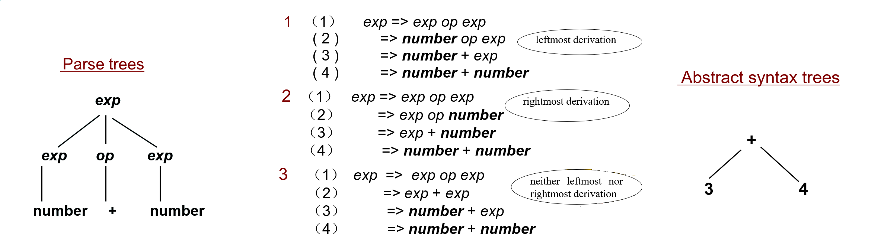
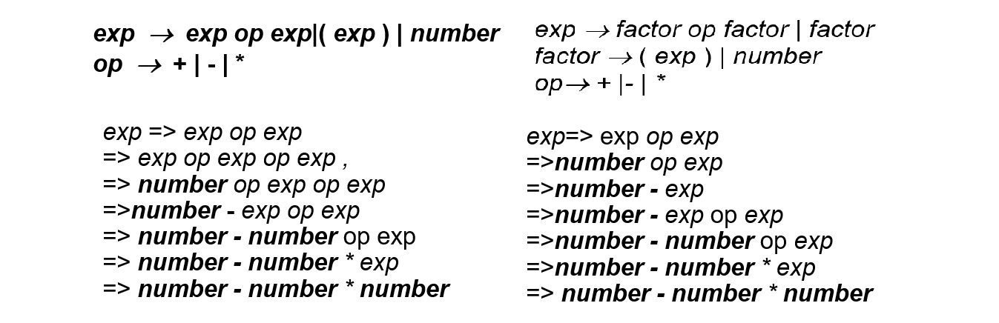
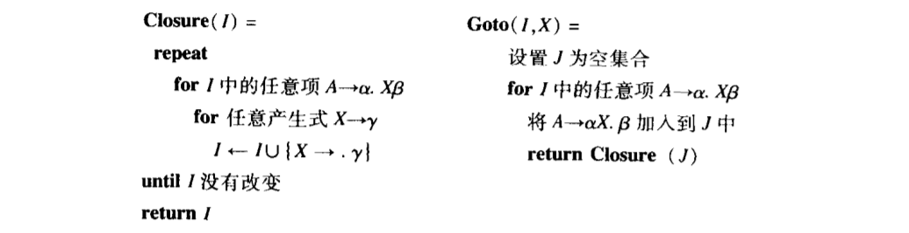
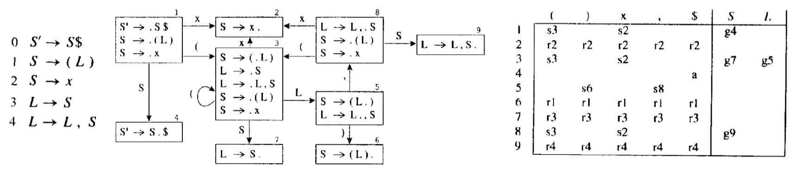
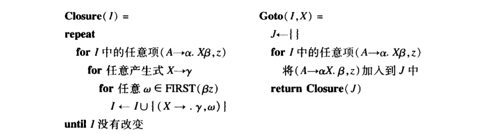
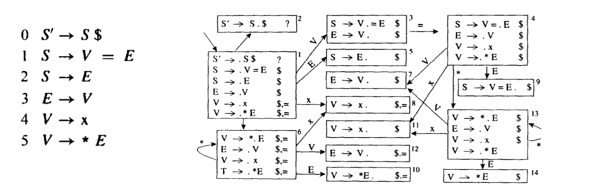
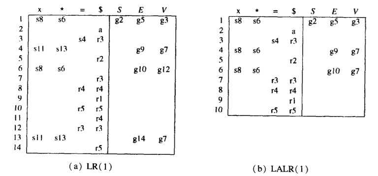
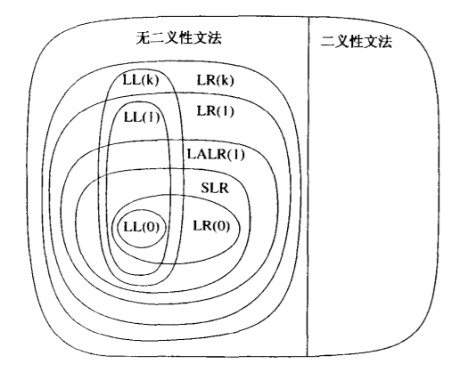
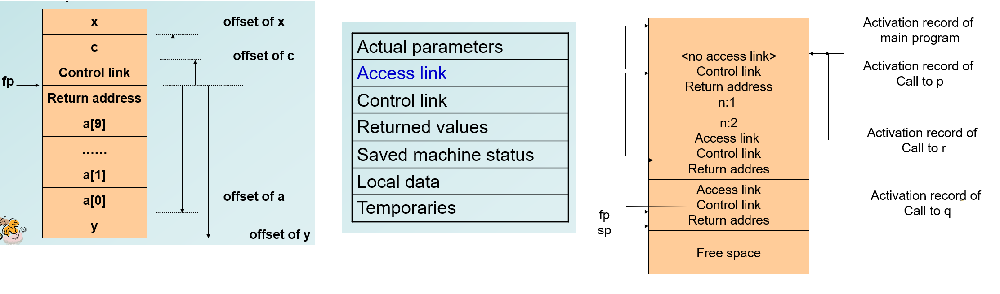
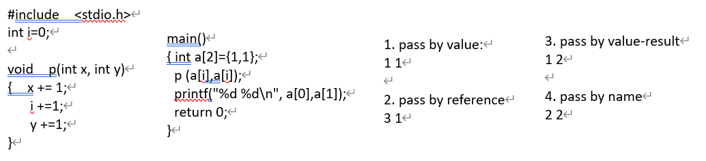

整个编译的流程包括如下两个阶段：
+   front end: scanner $\to$ parser  $\to$ semantic analyzer $\to$ source code optimizer 
+   back end:  code generator $\to$ target code optimizer

编译原理就是围绕这两个阶段展开的知识点。

## 词法分析 lexical analysis

#### Regular Expression 

+   Rules
    +   **R*** zero or more strings from L(R): R(R\*)
    +   **R+** one or more strings from L(R): R(R\*)
    +   **R?** optional R: (R|ε)
    +   **[abce]** one of the listed characters: (a|b|c|e)
    +   **[a-z]** one character from this range: (a|b|c|d|e|…|y|z)
    +   **[^ab]** anything but one of the listed chars (Lex)
    +   **[^a-z]** one character not from this ranges
+   The same language may be generated by many different regular expressions.

#### Finite Automata

+   包括 **Transition**，**start state** 和 **accepting states**
+   将 FA 用 Code 实现
    +   如果直接按 state 进行 if-嵌套 地判断，程序会十分复杂。
    +   一个更好的方法是：外层有一个大的 Case 语句，对不同的状态并列处理。
+   DFA 转 NFA：
    1.  定义 $F(A)$ 为：$A$ 集合里的所有 state 连同它们的 $\epsilon$-transitions 构成的集合。
    2.  原图中不同的点集对应新图中不同的点。把 $F(S)$ 设置成新图的出发点 $S'$。
    3.  对于新图上的每个点 $V'$，枚举字符 $ch$，对应的新集合为 $W=F(\{w|v~\underrightarrow{ch}=w,v \in V\})$ 如果原图的集合 $W$ 在新图中没有出现过，就创建 $W'$，然后从 $V'$ 到 $W'$ 连一条边。
    4.  重复 2-3 直到连完所有的点。
+   RE 转 NFA：关注最外层的 RE 的 Rule，然后递归地转化 NFA
+   DFA 的最小化原理：把原有状态划分为一些不想交的子集， 使得任何两个不同子集的状态是可区别的，而同一子集的任何两个状态是等价的。最后，让每个子集选一个代表，同时消去其他状态。

## 语法分析 Syntax Analysis

#### Context Free Grammar

+   **Derivatrion**
    +   **left recursive:** the nonterminal A appears as the first symbol on the right-hand side of the rule defining A.  e.g. $A \to A \alpha | \beta$（$\beta$ doesn't start with $A$）
    +   **right recursive:** the nonterminal A appears as the last symbol on the left -hand side of the rule defining A.  e.g. $A \to \alpha A | \beta$（$\beta$ doesn't start with $A$）
+   **Parse Tree** = concrete syntax trees 语法树
+   Abstract Syntax Tree **AST** 抽象语法树
    +   用 leftmost-child right-sibling 优化存储 
    
+   **ambiguous grammar**: generates a string with two distinct parse trees.
    +   左上是 ambiguous grammar，对应下面两种 parse，右上是改进。
    
+   The dangling else problem 解决方法
    1.  添加一个非终结符（变成 *matched-stmt* 和 *unmatched-stmt*），会使 else 尽量早地匹配。
    2.  C 中要求加大括号。
    3.  LISP 等语言要求必须给出 else-part。
    4.  Ada 里用 end-if 去识别。

#### LL(1): Top Down Parsing

+   [参考资料](https://www.cnblogs.com/yuanting0505/p/3761411.html)
+   就是从左向右扫描输入，维护一个栈，每次都把最左边的非终结字符用产生式代替。
    +   一个自然的需求是，每当我们看见一个非终结字符，需要知道它是属于哪个产生式的。 
+   **LL(1)文法的充要条件**：对于任意 $U \rightarrow A|B$：
    1.   不存在 $a$ 同时存在于 $First(A)$ 和 $First(B)$ 中。
    2.   $A$ 和 $B$ 最多只能有一个能导出 $\epsilon$。
    3.   如果 $B \stackrel{*}{\Rightarrow} \epsilon$，那么 $Follow(U)$ 与 $First(A)$ 不能有交；反之亦然。
+   LL(1)文法也可以定义成：其 Parsing table 每一格不存在多个转移。
+   **First 集合**
    +   $First(A)$ 表示能出现在 $A$ 开头的终结字符的集合。
    +   统计规则
        +   直接收取：若存在 $T \rightarrow a...$，则将 $a$ 放入 $First(T)$
        +   反复推送：若 $T \rightarrow E...$，把 $First(E)$ 的所有元素加入 $First(T)$
+   为了处理 $\epsilon$  的情况，再引入 **Follow 集合**：
    +   $Follow(A)$ 是可能在某些句型中紧跟在 $A$ 右边的终结符号的集合。
    +   统计规则
        +   $\$ \in Follow(S)$
        +   若 $A \rightarrow ...UP$，$First(P)$ 中除了 $\epsilon$ 都放入 $Follow(U)$（直接根据定义）
        +   若 $A \rightarrow ...U$ 或 $A \rightarrow ...UP$ 且 $First(P)$ 中包含 $\epsilon$ ，则 $Follow(A)$ 的所有元素加入 $Follow(U)$
+   Parsing table M[N,T]（N 是非终结符，T 是终结符）
    +   构建规则：考虑 $U \rightarrow A$ 的转移
        1.   对于 $First(U)$ 中的每个元素 $a$，都将 $U \rightarrow A$ 添加到 M[U, a] 中。
        2.   若 $\epsilon \in First(A)$，对于 $Follow(U)$ 中的每个元素 $a$ 都将 $U \rightarrow A$ 添加到 M[U, a] 中。
+   消除左递归
    +   若转移形如 $A \rightarrow A\alpha_1|A\alpha_2|\dots|A\alpha_n|\beta_1|\beta_2|\dots|\beta_m$
    +   则化简后的转移为
        +   $A \rightarrow \beta_1A'|\beta_2A'|\dots|\beta_mA'$
        +   $A' \rightarrow \alpha_1A'|\alpha_2A'|\dots|\alpha_nA'|\epsilon$

#### LR(k): Bottom-Up Parsing

+   $\mathrm{LR(k)}$ 代表从左至右分析（Left-to-right parse）、最右推导（Rightmost-derivation）、超前查看 $k$ 个单词（$k$-token lookahead）。
+   $\mathrm{LR(k)}$ 有一个栈和一个输入，输入中前 $k$ 个单词是超前查看的单词。共有两种动作：
    1.   移进（shift）：将第一个输入单词压入至栈顶
    2.   规约（reduce）：选择一个文法规则 $X \to ABC$，依次从栈顶弹出 $C,B,A$，然后将 $X$ 压入栈。
+   $\mathrm{LR(0)}$ 的分析引擎
    +    一个 **状态** 包含所有可能的（解析当下输入的）产生式，产生式右边用圆点（`.`）表示解析到的位置。
    +    定义两个基本操作 **Closure(I)** 和 **Goto(I,X)**：
        
    +    我们试图对所有可能的 **状态** 建立 DFA，边即为字符集（包含终结符和非终结符）。
    +    我们实时维护了一个**栈**，记录了从头解析到现在曾到过那些状态。每次转移时要不是读入一个 **终结字符** 跳到一个新状态（将这些信息压入栈），要不进行规约弹栈得到一个 **非终结字符**，同时依据这个非终结字符在 DFA 上跳到新的状态并压栈。
    +    根据 DFA 可以得到一张 $\mathrm{LR(0)}$ 的分析表。
         
    +   如果一个状态某个时刻既可以移进当前字符、又可以规约（存在已经结束的产生式），就产生了 **冲突**。我们称这样的文法不是 $\mathrm{LR(0)}$ 文法。
+   $\mathrm{SLR}$ 的分析引擎（Simple LR）
    +   为了解决上述的冲突问题，我们引入范围更大的 $\mathrm{SLR}$。它提出了一个简单而有效的方案。 
    +   自动机状态的表示、移进和规约的操作都和 $\mathrm{LR(0)}$ 差不多，但让规约变得**更严格了**：若状态中存在已经结束的表达式 $A \to ...\cdot$，只有当下一个字符 $\alpha$ 满足 $\alpha \in Follow(A)$ 时才规约。
+   $\mathrm{LR(1)}$ 的分析引擎
    +   $\alpha \in Follow(A)$ 只是一个必要条件而非充分条件，$\mathrm{LR(1)}$ 试图找到更紧的规约条件。
    +   定义项目 $(A \to \alpha \cdot \beta,x)$ （$\alpha,\beta$ 是序列，$x$ 是终结符，称为搜索符）：目前序列 $\alpha$ 在栈顶，且输入序列的开头可以解析成 $\beta x$。**和 Follow 集合的思路类似**，但是非终结符不再共享同一个集合。
    +   一个状态依然对应了若干个项目，但闭包求法也变复杂了：
        
    +   DFA 的构建、分析表的构建和 $\mathrm{LR(0)}$ 类似，但是移进字符等于产生式对应的搜索符才能规约。
        
+   $\mathrm{LALR(1)}$ 的分析引擎
    +   $\mathrm{LALR(1)}$ 的意思是超前查看（Look  Ahead）的 $\mathrm{LR(1)}$
    +   $\mathrm{LR(1)}$ 的表太大了不方便，$\mathrm{LALR(1)}$ 会把产生式和圆点完全一样的状态 **合并** 成同一个，对应的搜索符合并。这样状态减少很多，可能会导致冲突。
    +   以下是上面那个文法对应的 $\mathrm{LR(1)}$ 分析表和 $\mathrm{LALR(1)}$ 分析表的比较。
        
    +   所有合理的程序设计语言都有一个 $\mathrm{LALR(1)}$ 文法。

#### LL 和 LR 的关系总结

## 语义分析 Semantic Analysis

#### 属性文法 Attribute Grammars

+ **Attributes**: any property of a programming language construct
    + Static attributes: fixed prior to the compilation process.
    + Dynamic attributes: only determinable during program execution. 
+ Type checking: set of rules that ensure the type consistency of different constructs in the program
+ An **attribute grammar** for attributes $(a_1, a_2,\dots, a_k)$ is the collection of all attribute equations or semantic rules of the following form, for all the grammar rules of the language.
    + $X_i.a_j=f_{i,j}(X_0.a_1,\dots,X_0.a_k,X_1.a_1,\dots,X_1.a_k, \dots, X_n.a_1, \dots, X_n.a_k)$
+ Dependency Graphs：必须是 DAG
    + 在语法树（虚线）上画出属性的决定关系（实线）
+ 属性分为两种：
    + synthesized attributes 综合属性：“自下而上”传递信息，由其子结点的属性值确定。
    + inherited attributes 继承属性：“自上而下”传递信息，一个结点的继承属性由此结点的父结点和/或兄弟结点的。
    + 几条约束
        + 不允许 $N$ 的继承属性通过 $N$ 的子节点来定义
        + 允许 $N$ 的综合属性依赖于它本身的继承属性来定义
        + 终结符号有综合属性（来自词法分析）但是没有继承属性。
+ L-attributed attribute grammar
    + 对于所有产生式 $X_0 \to X_1X_2\dots X_n$ 满足：$X_i.a_j$ 只由 $X_0 \sim X_{i-1}$ 决定。
    + 显然 S-attributed（仅由综合属性决定）属于 L-attributed。
    + 对于 Top-down parser 来说，它可以有效决定所有属性（把继承属性放在参数里，把综合属性当做返回值传递上来）。
    + 对于 Bottom-up parser 来说，LR parsers 只适合处理综合属性，但不能处理继承属性。
+ LR parser 在解析属性文法时
    + 在 parsing stack 基础上额外维护 **Value stack**: store synthesized attributes.
+ Knuth [1968]：经过等价的语法修改后，任何继承属性都能转化成综合属性。

#### 符号表 Symbol Table

+   Symbol Table: Store the information about identifiers, like their scope or type.
+   维护方法
    +   linear list
    +   search tree (binary search trees, AVL trees, B trees) 
    +   hash tables (most frequently in practice)
        +   **open addressing**：冲突时放到下一个格子。
        +   **separate chaining**：哈希挂链。
+   符号寻找方式：the most closely nested rule for block structure

#### Type check

+   type equivalence
    1.  Structural equivalence：递归地检查，每一层的两个 type 的类型和组成（属性顺序）必须一致。
    2.  Name equivalence：他们的类型名（基本类型，自定义类型）完全一样才算一致。
        
        +   `t1:int; t2:int`：则 `t1` 和 `t2` 算不同的类型。
    3.  Declaration equivalence 是 Name 的弱化版。`t2=t1` establishing type aliases, rather than new types. 
        ~~~c
        t1 = array [10]  of  int;
        t2 = array [10]  of  int;
        t3 = t1;
        // t1 = t3,但是都不等于t2
        ~~~

#### Runtime Environments 

+   三种运行环境
    +   Fully static environment **FORTRAN77**
    +   stack-based environment **C/C++**
    +   fully dynamic environment **LISP**

#### Activation Records

+   用于 Stack-based runtime environments，可以用 Activation tree 来分析
+   在不允许函数嵌套的语言（比如 C）中
    +   **Frame pointer**: a pointer to the current activation record to allow access to local variable.
        +   在大多数编程语言中，可以通过 fp + static offset 来 access variables.
    +   **Control(Dynamic) Link**: a point to a record of the immediately preceding activation.
    +   **Stack Pointer**: a point to the last location allocated on the call stack. 
+   **The calling sequence**
    1.  计算函数参数，将它们放入新的 AR 里。
    2.  把新 AR 的 control link 设为当前 fp，再把当前 fp 移动到新 AR 里。
    3.  在新 AR 里保存 return address，调用函数。
+   当函数调用结束时
    1.  把新的 sp 设为 fp，把新的 fp 设为 control link 
    2.  根据 return address 跳转到原 AR，并用 sp 不断弹栈。
+   注意有些函数可能会接受不同长度的参数。
    +   C 语言的策略是：将参数逆序放入 AR。这样我们总能用固定的 fp + offset 去访问每个参数。

+   在允许函数嵌套的语言（比如 Pascal）中
    +   增设 **Access(static) Link**：the defining environment of the procedure.

#### Heap Management
+   In most language, needs some dynamic capabilities in order to handle pointer allocation and de-allocation. $\to$ Heap
    
    +   allocate and free
+   A standard method
    +   a circular linked list of free blocks
    +   用 malloc 新建，用 free 释放
    +   缺点：无法判断 free 是否合法；很容易变成一段一段的。
+   Automatic Management
    +   manual method：用户手动新建和释放
    +   garbage collection：回收那些没有被指的量
+   mark and sweep garbage collection
    +   no memory is freed until a call to malloc fails, which does this in two passes.
    1.  Follows all pointers recursively,starting with all currently accessible pointer values and marks each block of storage reached.
    2.  Sweeps linearly through memory.
    +   returning unmarked blocks to free memory.
    +   perform memory compaction to leave only one large block of contiguous free space at the other end.
+   stop-and-copy (two-space) garbage collection

#### Parameter Passing Mechanisms

+   pass by value：传值引用
+   pass by reference：传地址引用
+   pass by value-result：传值进去，函数结束后再绑定回参数。
+   pass by name：直接把参数的表达式传进去。

## Code Generation 
+   **Intermediate Representation**A data structure that represents the source program during translation. Intermediate code can be very high level.
+   **Three-Address Code** 三地址码
    +   4 fields are necessary: one for the operation and three for the addresses
    +   Such a representation of three-address code is called a **quadruple.** 
    +   三地址码还有一种实现是：把 Instruction 编号也作为 temporary 存计算结果（这样就可以少开一个地址了）。缺点是，这样一段代码位移起来还要修改。
+   **P-Code**
    +   在 P-machine 上运行的码
    +   The **P-machine** consists of a code memory, an unspecified data memory for named variables, and a stack for temporary data, together with whatever registers are needed to maintain the stack and support execution. 
    +   一个 `2*a+(b-3)` 的例子
        ~~~assembly
        ldc 2;  load constant 2 (pushes 2 onto the temporary)
        lod a;  load variable a (pushes a onto the temporary)
        mpi;    integer multiplication  (pops these two values from the stack, multiplies them (in reverse order), and pushes the result onto the stack.)
        lod b;   load value of variable b
        ldc 3;   load constant 3
        sbi;   integer subtraction (subtracts the first from the second)
        adi;   integer addition
        ~~~
    +   P-code instructions require fewer addresses than Three-Address Code, less compact, and closer to actual machine code.
+   From Intermediate Code to Target Code
    +   Macro expansion：逐句翻译
    +   Static simulation：等效替换