## 计算机网络概述

+   A **protocol**  is an agreement between the communicating parties on how communication is to proceed. 
    +   A protocol is a set of rules governing the format and meaning of the packets, or messages that are exchanged by the peer entities within a layer. 
+   A **service** is a set of primitives (operations) that a layer provides to the layer above it.
    +   Service interface defines which primitive operations and services the lower layer makes available to the upper one.
    +   Connection-oriented service 面向连接的服务
    +   Connectionless service 无连接的服务
+   The **OSI** (Open Systems Interconnection) Reference Model OSI七层模型
+   The **TCP/IP** Reference Model 五层模型

## 物理层 THE PHYSICS LAYER

| 通信方式                      | 解释                               |
| ------------------------------- | -------------------------------- |
| simplex system（单工通信）       | 只有一个方向                          |
| half-duplex system（半双工通信） | 通信双方都能发送和接受，但不能同时发送 |
| full-duplex system（全双工通信） | 通信双方可以**同时**发送和接受信息     |

+ Signal 信号：数据的电气/电磁表现，是数据在传输过程中的存在形式。
+ Bandwidth 带宽：The range of **frequencies** transmitted without being strongly attenuated.
+ Symbol 码元：one of several voltage, frequency, or phase changes. $1$ Symbol/s  = $1$ Baud
    + data rate = symbol rate * bits per symbol
    + Manchester encoding: data rate = $\frac{1}{2}$ symbol rate
+ **Nyquist Limit** (noiseless)
    + Max data rate: $B \le \mathrm{2H\log_2V}$ ，单位是 $\mathrm{bit/sec}$，$V$ 是 discrete levels.
    + Max symbol rate: $S \le \mathrm{2H}$
+ **Shannon Limit** (random noise)
    + Max data rate: $B \le \mathrm{H\log_2(1+S/N)}$
        + where $\mathrm{S/N}$ is the signal to noise ratio.
        + $\mathrm{dB=10\log_2(S/N)}$
+ 信道
    + 按传输信号的离散或连续划分为 **数字信号**（Digital Signal）和 **模拟信号**（Analog Signal）
    + 按信道传输方式划分为 **基带传输**（Baseband Transmission）和 **通带传输**（Passband Transmission）
        + Baseband: signal occupies frequencies from zero up to a maximum
        + Passband: signal occupies a band of frequencies around the frequency of the carrier signal
+ 编码和调制 Digital Modulation
    + 设备
        + 调制解调器（**mo**dulator **dem**odulator）
            + 调制：数字信号翻译成可沿普通电话线传送的模拟信号
            + 解调：将模拟信号转回数字信号
        + 编码解码器 (**co**der **dec**oder）：对一个信号或者一个数据流进行变换的设备或者程序。
    + PCM (**P**ulse **C**ode **M**odulation) 
    + Baseband Transmission 基带传输
        + **N**on-**R**eturn-to-**Z**ero：高 $1$ 低 $0$
        + **NRZI**：翻转表示 $0$，不变表示 $1$
        + Manchester Encoding：由 $1$ 变 $0$ 表示 $1$，由 $0$ 变 $1$ 表示 $0$
        + Differential Manchester Encoding：异 $0$ 同 $1$  
        + 4B/5B：不存在三个连续 $0$
        + AMI：中间电平表示 $0$，高低表示 $1$ 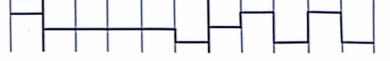
    + Passband Transmission
        + 振幅、频率、相位
        + Constellation diagrams 星座图
        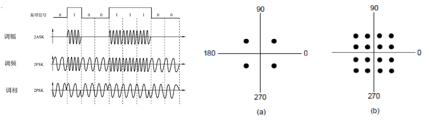
    + Digital Modulation and Multiplexing: Code Division Multiplexing 
        + 每一个 Station 有一个 $\pm 1$ 的序列，任意两个序列正交。
        + 编码时直接把发送信号的 Station 求和 $S$。
        + 解码时用当前 Station 的序列点乘 $S$。
+ 数据传输
    + GUIDED TRANSMISSION MEDIA 有线数据传输
        + Magnetic media 磁介质
        + Twisted pair 双绞线：可以同时传播数字信号和模拟信号。
        + Coaxial cable 同轴电缆：抗干扰性比双绞线好，传输距离远，费用较贵。
        + Fiber optics 光纤
            + Multimode 多模：many different rays. Using LED.
            + Unimode 单模： single rays, longer distance. Using Semiconductor laser
    + WIRELESS TRANSMISSION 无线传输
        + The Electromagnetic Spectrum 电磁波谱：频带越宽，速率越高。
        + Microwave transmission 微波传输：发射塔越高，传播距离越远；广泛应用。
        + Infrared and millimeter waves/Lightwave transmission 红外线和毫米波/激光
+ PUBLIC SWITCHED TELEPHONE SYSTEM 公用交换电话系统
    + Switching offices
    + **Local loops**: the wires between the customers and the switching offices: xDSL.
    + **Trunks**: the long-distance connections between the switching offices: TDM & FDM.

## 数据链路层 THE DATA LINK LAYER

+   数据链路层的功能
    +   Providing a well-defined service interface to the network layer
    +   Dealing with transmission errors
    +   Regulating data flow so that slow receivers are not swamped by fast senders.
+   services
    +   Unacknowledged connectionless service 无确认的无连接服务
        +   适用于错误率很低的场景，如实时交通系统。
    +   Acknowledged connectionless service 有确认的无连接服务
        +   Useful for unreliable channels, such as wireless systems (WIFI).
    +   Acknowledged connection-oriented service 有确认的面向连接服务
        +   面向连接一定有确认；在传输之前就建立了连接。
+   链路层发出的数据包称为 **frame**（帧），网络层发出的数据包称为 **packet**（包）。
    +   从上到下，frame 就是在 packet 的前后加上 header 和 Trailer 后封装而成的。
    +   从下到上，frame 就是在 bit stream 里分组截取出来的数据。
+   数据链路层分装成帧的策略
    +   Byte count 字符计数法：在 header 里声明总长度。
    +   Flag bytes with Byte Stuffing 在比特流的开头和结尾填充上固定的 $\text{FLAG}$ 串作为标识符。如果传输数据里也有 $\text{FLAG}$，就在前面加上转义串 $\text{ESC}$。
    +   Flag bits with bit stuffing：假设起始和终止的标识符都是 $01111110$，那么对于比特流中的内容，每遇到连续的五个 $1$ 就在后面添一个 $0$。
    +   physical layer coding violations 违规编码法：用不可能出现的电平变化作为开头结尾
        +   比如在曼彻斯特编码中，低-高 表示 $0$，高-低 表示 $1$，则用 低-低 和 高-高 来声明。
+   差错的检测和纠正
    +   Parity 奇偶检验：检查出奇数个比特的错误，检错率 $50 \%$
    +   Checksum：将比特流每隔 $N$ 个分组，把得到的这些数字在模 $2^N$ 域下相加，作为 $N$ 位校验码。 
    +   Cyclic Redundancy Check 循环冗余码：将传输数据的 $01$ 串对一个固定的生成多项式取模，然后把传输数据和模数一起传过去，对面就可以拿生成多项式检验了。
        +   CRC-12： $x^{12}+x^{11}+x^3+x+1$
        +   CRC-16：$x^{16}+x^{15}+x^2+x$
    +   Hamming Code 海明码
        +   为了检测 $d$ 位错误，海明距离至少要是 $d+1$ 
        +   为了纠正 $d$ 位错误，海明距离至少要是 $2d+1$
        +   若比特流有 $m$ 位，若要能纠正一位错误：
            +   添加的 $r$ 位校验位须满足：$m+r+1 \leq 2^r$
            +   在所有 $2$ 的幂次的位置处插入校验位，剩余的位置按顺序摆放数据位。
            +   第 $k$ 个校验位的取值由所有下标里带 $2^k$ 的数据位决定。要求那些位和校验位的异或值等于 $0$。
            +   接收方依次检查每一个 $k$ 的异或值，如果非 $0$ 就记下来。出错位就是非 $0$ 位的叠加态。
+   数据链路层流量控制和传输机制
    +   Stop-wait Control 停止-等待协议：单工，每发完一组数据就停止发送，收到对方确认再继续发送。
        +   接收方回复 ACK 表示已收到，回复 NCK 表示数据有误请求重传。
        +   发送方设置一个 timer（超时计时器），若到期后仍未收到 ACK 就重新发送。
        +   接收方会丢弃重复收到的帧，但是依然会发送 ACK（因为可能上一次 ACK 丢了）。
        +   Utilization：$U=\frac{T_{frame}}{T_{frame}+RTT},T_{frame}=\frac{frame~size}{bit~rate}$
    +   sliding windows protocol 滑动窗口协议，分为以下两种。Utilization：$U=\frac{NT_{frame}}{T_{frame}+RTT}$
    +   go back N Control 后退 N 帧协议：发送方用 Sliding Windows 发消息，接收方只有一个接受窗口。
        +   采用 **累计确认** 的规则发送和接受 ACK。
        +   当发送方的超时计时器超时，会一次性重传所有未被确认的帧。
        +   若帧的编号的位数是 $N$（最多有 $2^N$ 种帧），滑动窗口的大小不能超过 $2^N-1$
    +   Selective Repeat Control 选择重传协议：发送方和接收方都用 Sliding Windows 收发消息。
        +   ACK 只会返回收到的帧的编号。发送方会保留所有还未被确认的帧，因为可能会重传。
        +   若帧的编号的位数是 $N$（最多有 $2^N$ 种帧），滑动窗口的大小不能超过 $2^{N-1}$
+   Example Data Link Protocols:  **P**oint to **P**oint **P**rotocol
    +   send packets over the links, including the SONET fiber optic links and ADSL links
    +   A framing method
    +   A link control protocol 链路控制协议
    +   have a different **NCP** (Network Control Protocol, 网络控制协议) 

## 介质访问子层 The Medium Access Control 

+   这层可以视为数据链路层的子层（sublayer）
    +   LLC子层：负责识别网络层协议，进行封装；为网络层提供 services。
    +   MAC子层：数据帧的封装卸撞，帧的寻址识别；屏蔽了不同物理链路的差异。
+   两种网络类型：点对点（point-to-point），广播式（broadcast）
+   在广播式类型里，需要考虑信道分配问题，涉及到多路复用技术。
    +   **Multiple Access Protocols** 信道划分介质访问控制协议
+   静态信道划分 Static channel allocation
    +   频分多路复用 **F**requency **D**ivision **M**ultiplexing
    +   时分多路复用 TDM $\rightarrow$ 统计时分复用 STDM
    +   波分多路复用 WDM：传输不同波长的光波
    +   码分多路复用 CDM
        +   码分多址 CDMA：将不同设备的 $0$ 和 $1$ 编码成 $2^m$ 位的包含 $1$ 和 $-1$ 的向量，且两两正交。发送时同时把多个设备的码线性相加，接收的时候点乘上自己的码再除掉 $m$ 即可得到比特。

|CSMA 类型|Persistent CSMA|Non-persistent CSMA|$p$-persistent CSMA|
|--------|---------------|-----------------|--------------------------|
| 信道空闲 | 马上发 |  马上发 | $p$ 概率马上发，$1-p$ 概率等待 |
| 信道忙   | 继续监听  |  一段时间后再监听   |   一段时间后再监听 |

+   动态信道划分 Dynamic channel allocation
    +   Pure ALOHA：不监听信道，不按时间槽发送，随机重发。
        +   帧时 $T$：发送一个标准长的帧所需的时间
        +   吞吐率 $S$：在一个帧时T内发送成功的平均帧数（$0<S<1$，$S=1$ 时信道利用率 $100\%$）
        +   $P_0$：发送成功的帧在已发送的总帧中所占的比例
        +   运载负载 $G$：一个帧时T内所有通信站总共发送的帧平均值（包括原发和重发帧）$S=GP_0$
        +   $P_0$ 的推导：用泊松分布近似，一个帧时内发了 $k$ 个帧的概率是 $\frac{G^ke^{-G}}{k!}$，所以 $P_0=(e^{-G})^2$
        +   所以 $S=Ge^{-2G}$，当 $G=0.5$ 时 $S_{max}=0.184$
    +   Slotted ALOHA：时间被切成等长的片，要等到下一个时间片开始才能发送。
        +   $S=Ge^{-G}$, 当 $G=1$ 时 $S_{max}=0.368$
    +   **C**arrier **S**ense **M**ultiple **A**ccess  载波侦听多路访问协议（见上面表格）
    +   CSMA with **C**ollision **A**voidance 
        +   主动避免冲突，主要应用于无线网络。缺陷： hidden problem。
        +   监听到信道空闲（**idle**）时，并不是立即发送，而是等待一段时间再发送数据。 
        +   IEEE 802.11：监听到信道空闲的时候，先发送一个很小的信道侦测帧 **R**equest-**T**o-**S**end ，如果收到 目标地址的 **C**lear-**T**o-**S**end 再发送数据。一定程度上缓解 hidden problem。
    +   CSMA with **C**ollision **D**etection
        +   在半双工网络中考虑问题（冲突仅为发送接收双方的碰撞），主要应用于有线网络。
        +   若传播时延是 $\tau$，则最坏在 $2\tau$ 检测到冲突。
        +   **binary exponential backoff** 二进制指数退避算法：基本推迟时间是 $2\tau$，从小到大枚举正整数 $k$，每次从 $[0,1,\dots,2^{\min(k,10)}-1]$ 里选一个数 $r$，延迟 $2r\tau$ 后发送。$k>16$ 放弃。
        +   当帧长过短的时候 CSMA/CD 可能不会有用。能确保有用的最小帧长是 $2\tau \times speed$
    +   Collision free protocols: A Bit-Map Protocol
        +   如果想发送数据，Station $i$ 在 slot $i$ 时插入一个 $1$。
        +   按 bitmap 1的顺序发送数据。
        +   设 $N$ 是 slot 的长度，$d$ 是数据帧大小。
            +   At  low load,  $E=\frac{d}{N+d}$
            +   At high load, $E=\frac{d}{d+1}$
    +   Collision free protocols: Token Passing 令牌传递协议
        +   令牌到来时如果消息队列非空，就放入令牌里
    +   Collision free protocols: Binary Countdown
        +   每个 Station 如果要发送数据，先广播自己地址这个 bit string。
        +   每单位时间，每个 Station 会收到所有 Station 地址这一位的 **OR** 值。
        +   一旦某个 Station 发现自己这一位是 $0$ 但是收到的是 $1$ （说明还有 high-order 的和他抢）就放弃。
        +   这个做法相当于每次只允许地址最高的发送。
    +   Limited-Contention protocols: Adaptive Tree Walk Protocol 自适应树搜索协议
        +   Station 是一棵 binary tree 的叶子。从根开始，在每个时间槽询问左右两个子树的需求。
        +   每次决策往那边走（左右都有先左），走 $\log N$ 层便可确定本次发送数据的 Station。
+   局域网（**L**ocal **A**rea **N**etwork）
    +   数据传输率高，延迟低，可靠性高；分布式控制和广播式通信。
    +   拓扑结构：星型，**总线型**，环形，树形。
    +   介质访问控制方法
        +   CSMA/CD：常用于总线型局域网
        +   令牌总线（只有令牌持有者才能控制总线，才有发送信息的权利）：常用于总线型局域网
        +   令牌坏：用于环形局域网。
+   Ethernet 以太网：应用最广泛的局域网。
    +   两个标准：DIX Ethernet V2 或 IEEE 802.3
    +   Destination address and source address: 6 bytes each
        +   Unicast address, Broadcast address, Multicast address
    +   传输字节： $46\sim 1500$，checksum 采用 32 位 CRC
    +   标准以太网 10Mbps，快速以太网 100Mbps。
    +   逻辑拓扑总线型，物理拓扑星型或拓展星型
    +   造价低廉，应用最广泛；能满足网络速率的要求：10Mb/s-10Gb/s
    +   使用CSMA/CD。无连接，不可靠。只实现无差错接受，不实现可靠传输。
    +   每一个适配器对应一个唯一的MAC地址（48位）
+   **W**ireless **L**ocal **A**rea **N**etwork
    +   采用 IEEE 802.11 标准，p-persistent CSMA
    +   Sublayer Protocol：DCM 分布协调功能；PCF 集中协调功能
+   Data Link Layer Switching: Uses of Bridges
    +   Operation of a LAN bridge from 802.11 to 802.3. 
    +   The first 802 bridge is a learning bridge or transparent bridge.
    +   使用 **backward learning** 算法。
        +   初始时有一张空的哈希表。
        +   若 Station A 请求 Station B 时到了目前的 Bridge，查看 B 是否在哈希表里。
            +   如果不在，采用 Flooding 遍历每个除消息源的端口，把消息都传一遍。
            +   如果在，直接Forward 到目标端口。
            +   同时把 Station A 的端口信息记录在哈希表里。
    +   缺点：如果有环就会出问题，一般会搭 spanning tree 来工作。

## 网络层 THE NETWORK LAYER

+   DESIGN ISSUES
    +   Store-and-Forward Packet Switching 分组交换技术
        +   收到 packet 后，进行验证、存储和转发，然后再送往下一个 router。
    +   Services Provided to the Transport Layer 为传输层提供的服务
        +   路由技术与传输层独立；路由的数量、状态和拓扑结构对传输层隐藏。
        +   The network addresses made available to the transport layer should use a uniform numbering plan, even cross LANs and WANs
    +   Connection-less service 无连接服务
        +   不需要提前建立连接。
        +   Packets are injected into the subnet individually and routed independently of each other. 
        +   每一个 packet 被称为 **datagrams** 数据报。子网络叫做 datagram subnet。
    +   Connection-oriented service 面向连接的服务
        +   用 **Virtual Circuit**  虚电路技术 实现。
        +   建立虚电路 $\to$ 数据传输（全双工通信）$\to$ 释放连接
        +   仅在建立阶段需要用到目的地址，后续每个节点会用虚电路号代替。保证分组有序转发。
    
+   ROUTING ALGORITHMS 路由算法
    +   按传播范围分类
        +   Unicast: point-to-point, one-to-one. *eg. DV routing, LS routing*
        +   Broadcast: one-to-all. *eg. Flooding, Reverse path forwarding*
        +   Multicast: one to many
        +   Anycast: one to any
        +   Collection: all-to-one. *Used in sensor network*
    +   按是否动态分类
        +   Nonadaptive algorithms 非自适应算法：手动配置路由。应用于军事网络和小部分商业网络。
        +   Adaptive algorithms 自适应算法：按照路由算法实时优化路由表项。
    +   一些指标：Hops 跳数，physical distance 物理距离，bandwidth 带宽，traffic 流量，cost，measured delay，mean queue length 平均队列长度
    +   **Distance Vector routing** 距离矢量路由算法
        
        1.   每一个路由器都维护一张表，记录了到所有目的地的最短路以及对应的邻居（下一跳路由）。
        2.   这些表会通过邻居之间交换信息得到更新。
        +   DV算法对 good news 的反应迅速，但是对 bad news 收敛慢。
        +   改进：Poisoned reverse 毒性逆转：如果 $C$ 是通过 $B$ 到达 $A$ 的，$C$ 给 $B$ 传信息时把到 $A$ 的距离设为无穷大。不能完全解决坏消息收敛慢的问题；在链上可以解决。
        +   对应 Routing Information Protocol **RIP** 协议，通过广播 UDP 报文交换路由信息。
    +   **Link State routing** 链路状态路由算法
        
        1.   给邻居发 Hello packet，期望邻居回复以获取地址。
        2.   给邻居发 ECHO packet，要求快速返回消息，用 RTT 来度量 metric。
        3.   每个路由器建立 link state packet，依次包括 identity of the sender, sequence number, age, a list of neighbors (and costs to them)。每新建一个 pkt，sequence number 都会增加；age 表示有效时间，每隔一秒会减一，减到 $0$ 后就无效。
        4.   用 Flooding 方式把 packet 传播到自治系统里的所有节点。
        5.   每个节点都能建立一张全网拓扑图，用 Dijkstra 算法来计算最短路。
        +   对应 Open Shortest Path First **OSPF** 协议，直接采用 IP 交换信息。
    +   Hierarchical routing
        
        +   理论最优的层级结构是：$N$ 个 router 设置 $\ln N$ 层，平均每个路由器有 $e \ln N$ 个连接。
    +   Broadcast routing
        +   Sink-tree based broadcast 汇集树：只往生成树邻居 broadcast，最优。
        +   Reverse path forwarding 逆向路径转发：当一个广播分组到达一个路由器的时候，观察该线路是否就是该路由器往广播源发送的最优线路，如果是就保留转发，不是就丢弃。
    
+   Internetworking
    +   Tunneling 隧道：路由器不支持 IPv6，可以用 IPv4 包起来构成隧道。
    +   Autonamous System 自治系统：each network is operated independently of all the others
        +   Internet (inter-AS) / Intranet (intra-AS) routing: Exterior/Interior gateway protocol
    +   Fragmentation 分片；不能超过 MTU，每个必须是 $8$ 字节的倍数。
+   IPv4 Protocol：无连接、不可靠
    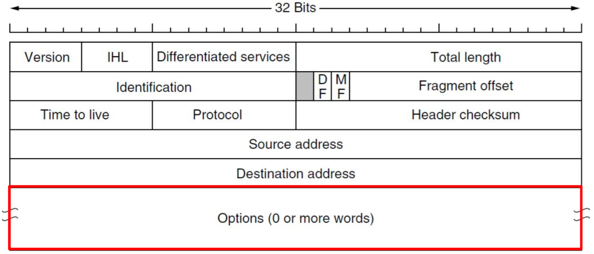
    
    +   **Version**：IPv4/6
    +   **IHL**：表示首部长度，单位是 4B。$5 \le \text{IHL} \le 15$，即表示的最小长度是 20B。
    +    **differentiated services **：优先级。
    +   **Total length**：header 和 data 的总长度，单位是 1B。理论最大值是 65535，不过并达不到。
    +   **Identification**：当前 telegram 的 ID 号。被分片的数据拥有同一个数值。
    +   **D**on't **F**ragment：DF=1 禁止分片；DF=0 允许分片。
    +    **M**ore **F**ragment：MF=1 后面还有分片；MF=0 最后一片/未分片。
    +   **Fragment offset**：目前分片在电报中的相对位置。单位是 8B。

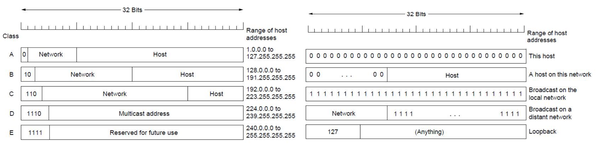

+   IP addressing
    +   Prefixes：Splitting an IP prefix into separate networks with subnetting.
    +   Classful and Special Addressing（见上图）
    +    Classless Inter-Domain Routing (**CIDR**)：
        +   用 IP/Mask 表示一个地址。
        +   IP 地址可以进行 Aggregation。
        +   路由器寻址时使用 Longest matching prefix。
    +   Network Address Translation（**NAT**）
        +   To assign each company a single IP address for Internet traffic.
        +   reserved private IPs:
            +   10.0.0.0/8
            +   172.16.0.0/12
            +   192.168.0.0/16
        +   对 NAT box 负责内外的 IP+Port 的翻译工作。
        +   NAT traversal problem: Since the mapping in the NAT box is set up by outgoing packets, incoming packets cannot be accepted until after outgoing ones.

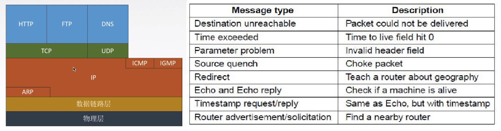

+   Relevant Protocols（左上图）
    +   Internet Control Message Protocol **ICMP** 网际控制报文协议
        
        +   路由器在处理 packets 时如果遭遇差错，会给 sender 一个 ICMP 错误报文（右上图）。
    +   The Address Resolution Protocol **ARP** 协议
        +   从 IP 地址到 MAC 地址的转换。
        +   子网内：在子网内广播 ARP 请求分组，对应目标地址单播响应请求。
        +   非子网内：先用 ARP 协议获得网关地址，路由器跳到目标网络，再用一次 ARP 获取目标地址。
    +   Dynamic Host Configuration Protocol **DHCP **动态主机配置协议
        +   即插即用的机制，主机可以从服务器动态获取 IP地址、子网掩码、默认网关。
        +   属于应用层协议，使用客户/服务器方式，通过广播交互，基于 UDP。
        1.  host broadcasts “DHCP discover” msg 
        2.  DHCP server responds with “DHCP offer” msg
        3.  host requests IP address: “DHCP request” msg 
        4.  DHCP server sends address: “DHCP ack” msg
    +   Border Gateway Protocol **BGP** 协议
        +   Exterior Gateway Routing Protocol
            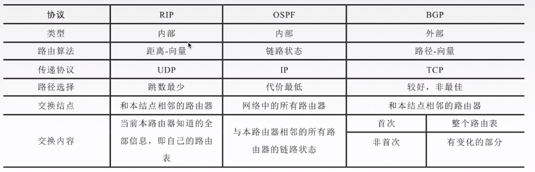
        +   为保证可靠传输，采用 TCP 协议（放入 TCP 报文的字段里面）

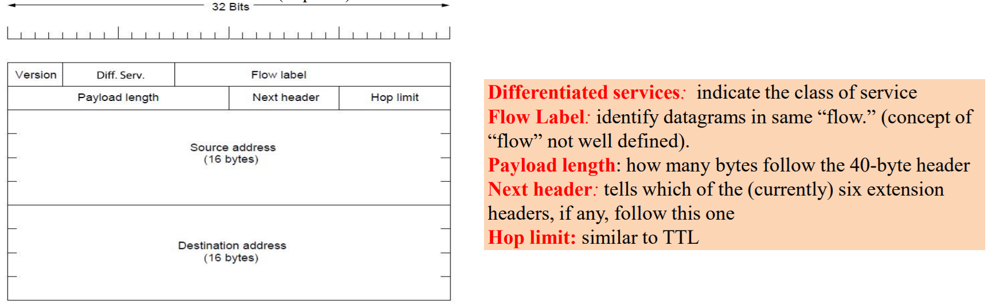

+   IPv6
    +   将地址从 $32$ 位或占到 $128$ 位，增加了扩展首部（提高路由器效率），校验和子段被移除（加速）。
    +   IPv6 支持即插即用，不需要 DHCP 协议。
    +   IPv4 的首部是 4B 整数倍，IPv6的首部是 8B 整数倍。
    +   只能再主机处分片，不能在路由器分片了。
    +   使用冒号十六进制记法。可以省略首位 $0$。连续的十六进制 0 可以被压缩成两个冒号（最多一次）。
        +    8000:0000:0000:0000:0123:4567:89AB:CDEF 或 8000::123:4567:89AB:CDEF

## 传输层 THE TRANSPORT LAYER

+   The Transport Service
    +   与网络层的服务类似，都是 Establishment $\to$ data transfer $\to$ release 的过程，都有 Addressing 和 Flow control。
    +   区别：传输层完全应用于主机上，而网络层还应用于路由器上；传输层比网络层 **更可靠**。
+   Primitives
    +   **Hypothetical Primitives** 见左图；现在广泛应用的 API 的是右图的 **Berkeley Socket**。
        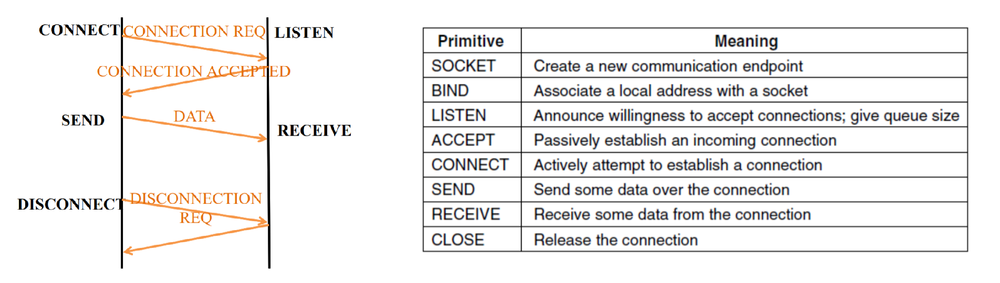
+   Elements of Transport Protocols
    +   Addressing
        +   NSAP: Network service access point $\to$ **IP** (32 bit)
        +   TSAP: Transport service access point $\to$ **Port** (16 bit)
    +   Connection Establishment
        +   ...
    +   ...
+   RPC (Remote Procedure Call) : make a remote procedure call look as much as possible like a local one. 
+   User Datagram Protocol **UDP协议**
    +   发送封装后的 IP 数据报，无连接服务。没有 flow control, error control 和 retransmission。
    +   UDP 协议首部的大小是 8 B。注意 UDP Length 是包括首部的（最小 20 B）。主要应用：RTP, DNS
        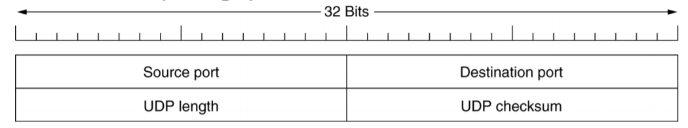
    +   Real-time Transport Protocol **RTP协议**：RTP is to multiplex several real-time data streams onto a single stream of UDP packets and unicast or multicast the UDP packets.
+   Transmission Control Protocol **TCP协议**
    +   点对点的虚连接，可靠有序，不丢失不重复，全双工通信（full duplex）。
    +   无结构的字节流：A TCP connection is a byte stream, not a message queue。
    +   TCP Header 的固定部分是 20B，可以额外加 options（注意填充成 4B 整数倍）。
        +   Window size: tell how many bytes may be sent starting at the byte acknowledged.
        +   Urgent pointer: indicate a byte offset at which urgent data are to be found. 
        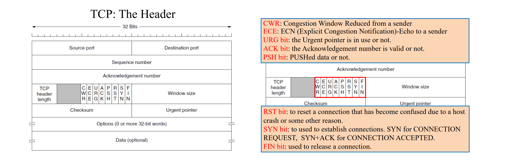
    +   Nagle’s algorithm: When data come into the sender one byte at a time, just send the first byte and buffer all the rest until the outstanding byte is acknowledged. 
    +   Connection Management
        +   Establishment:  Three-way Handshake
            1.  SYN=1, SEQ=x
            2.  SYN=1, SEQ=y, ACK=x+1
            3.  SEQ=x, ACK=y+1
        +   Two-army problem: 若消息可能会被拦截，两军无法真正确认对方是否收到消息。
        +   Release: Four-Way Wavehand
            1.  FIN=1, SEQ=u，此后发送方不再发送数据，并进入等待状态。
            2.  ACK=u+1, SEQ=v，接收方可能还会正常发送消息。
            3.  FIN=1, ACK=1, SEQ=w，接收方也发送了断开连接的请求。
            4.  ACK=1, SEQ=u+1, ACK=w+1，发送方发送收到断开请求的确认信息。为了避免 Two-army problem，在等待一段时间后直接关机。
    +   采用 Sliding Windows 机制，
    +   Timer Management
        +   Retransmission Timer 重传计时器
            +   Smoothed Round-Trip Time. $\text{SRTT'}=\alpha \text{SRTT}+(1-\alpha)\text{RTT}$ （$\alpha=\frac{7}{8}$）
            +   Round-Trip Time VARiation. $\text{RTTVAR'}=\beta \text{RTTVAR}+(1-\beta)|\text{SRTT}-\text{RTT}|$ （ $\beta=\frac{3}{4}$）
            +   Retransmission TimeOut. $\text{RTO}=\text{SRTT}+4 \text{RTTVAR}$
        +   Persistent Timer 坚持计时器。如果接收端从 $0$ 窗口（禁止发送端发送）变回正常窗口的报文丢失，发送端会一直等待这个报文导致死锁。所以发送端被限制为 $0$ 后，每隔一段时间发送一个确认信息。
        +   Keeplive Timer 保活计时器：检测另外一端是否是 live 状态。
    +   TCP Tahoe Congestion Control 
        +   cwnd, Threshold, slow-start, congestion-avoidance
        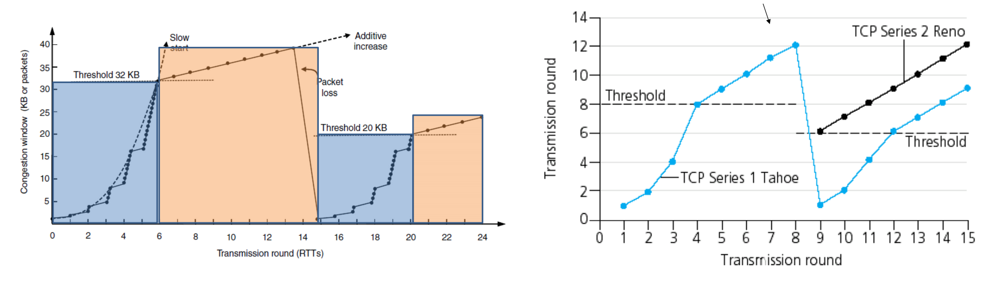
    +   TCP Reno Congestion Control 
        +   **slow start**: When cwnd is below Threshold, window grows exponentially.
        +   **congestion-avoidance**: When cwnd is above Threshold, window grows linearly.
        +   When a triple duplicate ACK occurs, Threshold set to cwnd/2 and cwnd set to Threshold. 
        +   When timeout occurs, Threshold set to cwnd/2 and cwnd is set to 1 MSS. 

## 应用层 THE APPLICATION LAYER

+   Domain Name System 域名服务
    +   Domain names are case insensitive, $|component| \le 63, |full| \le 255$.
    +   The top-level domains come in two flavors
        +   generic (com, edu, gov, int, mil, net, org, biz, info, pro, aero, coop, museum, …) 
        +   countries (cn, uk, …).
    +   A resource record is a five-tuple (Domain_name, Time_to_live, Class, Type, Value). 
        +   An **authoritative record** is one that comes from the authority that manages the record and is thus always correct $\to$ authoritative server. 
    +   **Cached records** may be out of date.
    +   **root name servers**: There are $13$ root DNS servers, unimaginatively called *a-root-servers.net* through *m.root-servers.net*. They have information about each top-level domain.
    +   Example of a resolver looking up a remote name robot.cs.washington.edu in $10$ steps.
        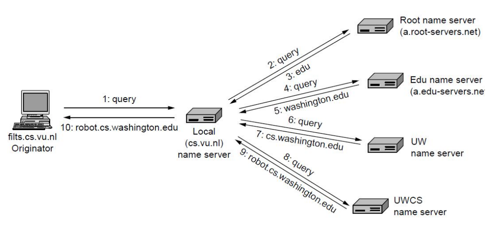

+   Email
    +   Message Format
        +   RFC 5322: The Internet Message format
            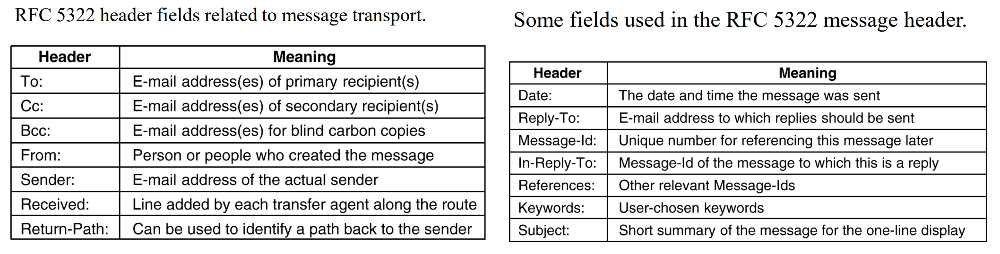
        +   MIME (Multipurpose Internet Mail Extensions) message format
            +   *international languages* and *media file*.
    +   Message Transfer: **SMTP** = Simple Mail Transfer Protocol
    +   Final Delivery
        +   **POP3** (Post Office Protocol v3): simple
        +   **IMAP 4** (Internet Message Access Protocol v4): complex
        +   Webmail
+   WORLD WIDE WEB
    +   Architectural overview: Browser
        +   What is the page called? (Filename)
        +   Where is the page located? (DNS Name)
        +   How can the page be accessed? (HTTP, FTP, …)
    +   **URL**: Universal Resource Locator
        +   URL = protocol (http) + DNS name + path name
    +   **URI** (Uniform Resource Identifier)
    +   What does the browser do when one link is selected:
        1.  The browser determines the URL (by seeing what was selected).
        2.  The browser asks DNS for the IP address of www.zju.edu.cn.
        3.  DNS replies with 210.32.0.9.
        4.  The browser makes a TCP connection to port 80 on 210.32.0.9.
        5.  It then sends over a request asking for file /home/index.html.
        6.  The www.zju.edu.cn server sends the file /home/index.html.
        7.  The TCP connection is released.
        8.  The browser displays all the text in /home/index.html.
        9.  The browser fetches and displays all images in this file.
    
+   **HTTP** (HyperText Transfer Protocol)
    +   RTT (**ping time**):  the time it takes for a small packet to travel from client to server and then back to the client.
    +   HTTP: Connections
        +   HTTP 1.0 with multiple connections: 每个 TCP 只进行一次请求和回复。
        +   HTTP 1.1 with persistent connections (sequential requests) : 同一个 TCP 里请求和回复。
        +   HTTP 1.1 with persistent connections and pipeline requests: 一次可以多个请求回复。
    +   HTTP: Methods **case sensitive**
        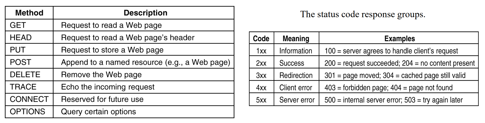
    +   HTTP has built-in caching support.
        +   First strategy: page validation.
        +   Second strategy: send a GET to server to ask.
    
## NETWORK SECURITY

+   Network security problems can be divided roughly into four intertwined areas
    +   Secrecy 机密性，Authentication 认证，Integrity 完整性
    +   Nonrepudiation 不可否认性 e.g. personal signature)
+   Cryptography
    +   Substitution Ciphers & Transposition Ciphers
    +   One-Time Pads + quantum cryptography
    +   Kerchoff’s principle: all algorithms must be public while the key is secret. 
    +   Two principles: Redundancy, Freshness
+   SYMMETRIC-KEY ALGORITHMS: DES, 3DES, AES
+   PUBLIC-KEY ALGORITHMS: RSA
+   DIGITAL SIGNATURES
    +   use Symmetric-Key Signatures：每一个人掌握一个私钥，有一个权力中心 **BB** (Big Brother) 知道所有人的私钥。$A$ 给 $B$ 发送消息时，先加密传给 BB，它解密再加密传给 $B$.
    +   use Public key signatures：传输前套 $A$ 私钥 $B$ 公钥，解密时套 $B$ 私钥 $A$ 公钥。
        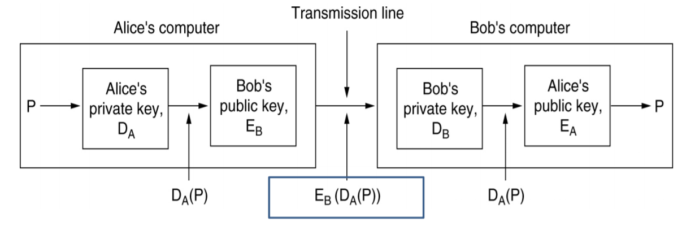
    +   Use of Message Digests: SHA, MD5
    +   message digest 消息摘要：对任意长度的序列生成对应哈希值，可以认为不同输入的哈希值不同。
+   Management of Public Keys: X.509 is the standard for managing the certificates
+   AUTHENTICATION PROTOCOLS