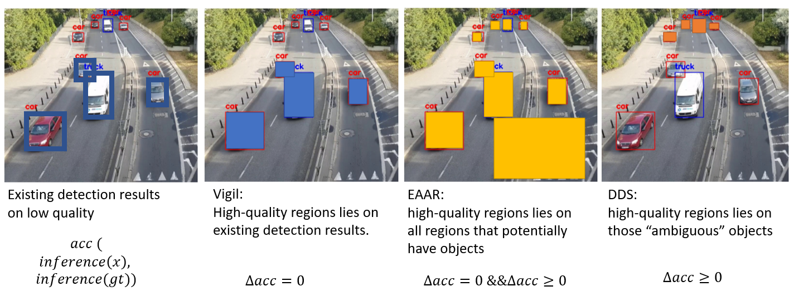

This is the reading notes for ***Server-Driven Video Streaming for Deep Learning Inference***.

<!-- more -->

#### Iterative Workflow

+   Stream A: Camera $\to$ uniform low quality video $\to$  server $\to$ inference & propose feedback regions $\to$  send feedback regions to camera
+   Stream B: Camera $\to$  re-encode feedback regions in high quality $\to$  server $\to$  inference

Note:  By deriving feedback directly from the server-side DNN, it sends high-quality content only in the **minimal** set of relevant regions **necessary** for high inference accuracy.

#### Performance metrics

+   **Accuracy**: Use the *similarity* between DNN output on each frame with limited bandwidth (low quality) video and the DNN output on each frame with the original (highest quality) video.
    +   *object detection*: F1 score $2 \cdot \frac{pre \times recall}{pre+recall}$
    +   *semantic segmentation*: IoU
+   **Bandwidth usage**: In this paper, measure the bandwidth usage by the size of the sent video divided by its duration (leave out the camera cost)
+   **Average response delay (freshness)**:  Average processing delay per object/pixel.

#### Feedback Regions

+   **Object detection** (based on bounding boxes): If DNN uses region proposal networks (RPNs), each proposed region is directly associated with an *objectness score*. If it is not RPN-based like Yolo, sum up the scores of non-background classes as the *objectness score*. Consider all possible regions with objectness score over a threshold and apply two following filters. The remains are feedback regions.
    1.  Filter out those regions that have over 30% IoU overlap with the labeled bounding boxes.
    2.  Empirically remove regions that are over 4% of the frame size (roughly 20% of each dimension). *Motivation*: If an object is large, DNN should have successfully detected it.
+   **Semantic segmentation** (based on pixels): Semantic segmentation DNNs give a score of each class for each pixel. We assign a new score of $1+max_1-max_2$ to each pixel ($max_1$ is the maximum score of one class, and $max_2$ is the second largest). Repeat $k$ times, each time choose a $n \times n$ rectangle in which the pixels have maximum average score and zero out the scores of corresponding pixels.

#### Handling Bandwidth Variation

DDS applies a **feedback control system**.

1.  Estimates the *base bandwidth* usage with default parameters.
2.  Compare the difference with the *estimated available bandwidth*.
3.  Change the tunable **resolution** and **quantization** parameters of both the low and high quality.

#### Optimization

+   **Saving bandwidth by leveraging codec**:  Instead of encoding each feedback region as a separate high-quality image, DDS sets the pixels outside of the feedback regions in the high quality image to black (to remove spatial redundancies) and encodes these images into a video file (to remove temporal redundancies).
+   **Reducing average delay via early reporting**: About $90\%$ of the DNN output from the low-quality video (Stream A) already has high confidence and thus can be returned without waiting for Stream B.