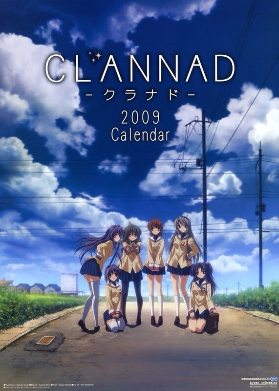
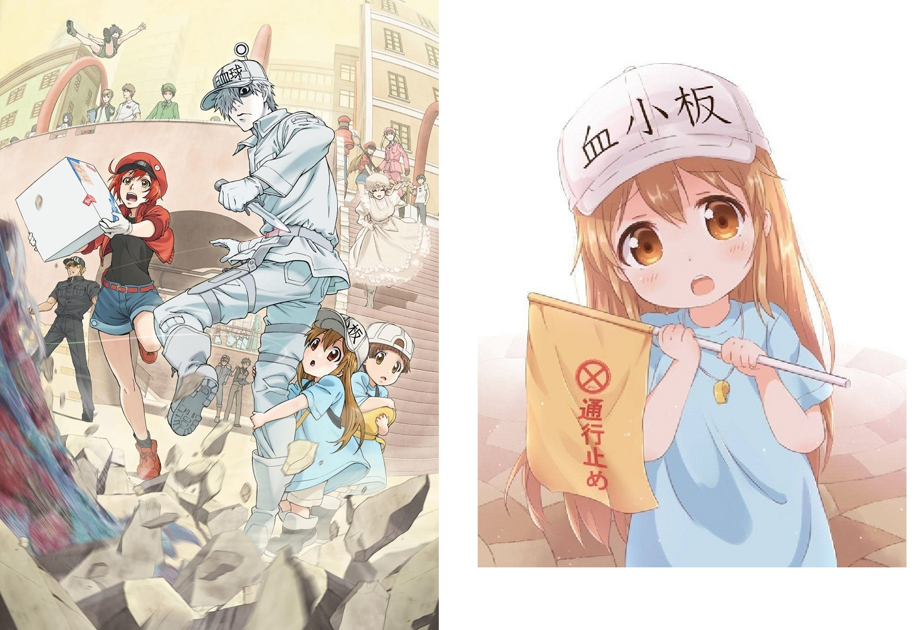
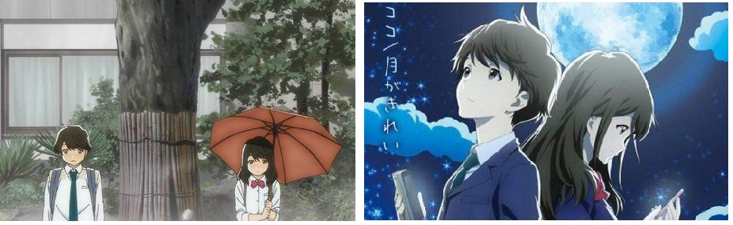

## 目录

+ [Clannad](#clannad)：爱情/成长/人生
+ [ReLIFE](#relife)：成长/友情/爱情
+ [工作细胞](#工作细胞)：日常/卖萌/医学科普
+ [干物妹！小埋](#干物妹！小埋)：日常/校园
+ [月色真美](#月色真美)：恋爱/校园
+ [白色相簿](#白色相簿)：恋爱/校园
+ [欢迎来到实力主义至上的教室](#欢迎来到实力主义至上的教室)：校园/推理/烧脑

## Clannad

*爱情/成长/人生*

内容介绍
- 冈崎朋也凭借篮球特长进入高中；然而，他在和父亲的一次打架中右肩受伤，从此不能把右手举过肩，自然也得痛苦地放弃篮球梦。后来，他整天和基友阳平厮混在一起，没有梦想、常常翘课、喜欢打架，是一名不折不扣的“不良少年”。
- 古河渚是一名善解人意、从不为自己着想的女生。然而，她自小就体弱多病——因为长时间的疾病，高三时她甚至连毕业的出勤天数要求不都没有达到，不得不留级。作为留级生她，根本就交不到知心朋友，只能把这份痛苦默默藏在心底。
- 就在这樱花飞散的坡道上，他们两个邂逅了，从此彼此人生轨迹发生了天翻地覆的变化。

简评
- [我的读后感链接](http://www.cnblogs.com/jiangshibiao/p/7284474.html)
- Clannad 是我挚爱的神作！总共分为两部：
    + 第一部讲的是冈崎朋也和古河渚在校园里相识的故事，算是校园爱情番吧。整体节奏欢乐而轻快，而且有不少对第二季的铺垫。可以用来消磨无聊的时间。
    + 第二部才是Clannad的精华，讲的是冈崎朋也和古河渚毕业后住在一起的故事。男主和女主成家了，但是必须面对各种生活的压力和痛苦。尽管朋也已经很努力，但他无法挽救和小镇联系在一起的妻子古河渚；最后，命运还夺走了他在这世界上唯一的牵挂——他的女儿汐。显然，朋也的精神上受到了严重的打击，开始进入萎靡的生活。
- 身为观者的我明白了很多道理，比如第一季中，他的父亲是一种怎样的心境（他父亲在家庭美满的时候后，也失去了自己的妻子，也就是男主的母亲），以及人生会是怎样的一种无情，我们要如何学会坚强地活下去。整篇故事浑然一体，深藏哲理，我觉得很少有番能达到这样的高度。不过，与第一部的幸福美满相比，第二部一改画风，十分沉郁（我是不会说出来我哭了好多好多次的）.
- **“如果再让你选择，你会在樱花树下叫住我吗？会！”**

评分
- 设定有趣程度：★★★
- 剧情：　　　　★★★★☆
- 人物刻画：　　★★★★☆
- 深刻意义：　　★★★★★
- 作画：　　　　★★☆
- 补完时间：　　2017.08.07

## ReLIFE

*成长/友情/爱情*

内容介绍
- 27岁的海崎新太是一个失败的上班族。前辈的自尽给了他巨大的压力，他离职后在家里穷困潦倒。
- 有一天，一个叫做夜神了的男人拦住了他，问他要不要进行重生实验：服药后将会恢复年轻时的模样，去高三读书一年。迫于生活压力（重生实验中的开销是试验所提供的），海崎最终同意了……
- 就这样，海崎获得了 ReLIFE 的机会，在高三的校园里经历种种温情故事。

简评
- 重生实验只维持一年，根据设定，回到现实后会，与受试者接触过的所有人会失去与他的记忆。起初海崎新太只是迫于生活压力而选择了实验，但是随着他与同班的伙伴们的情感日益积累，他意识到自己终将是他们记忆里逝去的幻影，主旋律就蒙上了一层忧伤甚至绝望的气氛。
- 海崎新太的成熟和克制让我十分动容。无论是重生实验的工作人员杏投其怀抱，还是后来他意识到自己已经喜欢上了日代，他都克制住了情感，忍痛拒绝了自己的内心。理论上来说，一年后大家都会失去他的记忆，在这一年里谈一段“青涩而短暂的恋爱”是没有问题的。但是新太是这么想的：如果日代最终会失去与我的记忆，那他记忆里的高三生活将充满了空白，所以我不能与她走得太近……**太温柔了吧！**
- 虽然主基调是忧伤的，日常的剧情还是充满了欢乐和温情。本剧的画风特别萌，在一些关键场景下，主角们会变得特别卡通，以夸张的方式体现人物情感，有趣而不失流畅。

评分
- 设定有趣程度：★★★★☆
- 剧情：　　　　★★★★
- 人物刻画：　　★★★★
- 深刻意义：　　★★★★
- 作画：　　　　★★★☆
- 补完时间：　　2020.11.11（第一季13话）

## 工作细胞

*日常/卖萌/医学科普*

内容介绍
- 故事是在人体内展开的。人体内的每一个细胞，包括红细胞、白细胞、杀手T细胞、血小板，甚至是病毒细胞，都被作者巧妙地拟人化了，形成了一个个鲜明的形象。
- 剧情是日常向的，观者将跟随各种细胞，去了解它们的职责与行动。
- 科学和艺术的结合真是美妙。动画里还夹带了轻松愉快的科普，让观者**易于接受**。

简评
- 在赋予细胞以人的性格特征以后，就是剧情上尽情发挥的时刻了。主角红细胞的路痴属性，白细胞的护妻属性，血小板则是以萌来打动网友的（工作细胞热播后，出现了各种血小板周边，帽子啊抱枕啊衣服啊，啊我要被萌化了）
- 每当我看到了新一集的标题，我就会思考：作者将用什么样的拟人手法来刻画这种细胞的形象呢？哈哈哈天马行空，很好玩。哎呀血小板实在是太萌了~
- 红细胞的声优是香菜诶！此时我耳边又想起了《恋爱循环》！

评分
- 设定有趣程度：★★★★★
- 剧情：　　　　★★★
- 人物刻画：　　★★★☆
- 深刻意义：　　★★★
- 作画：　　　　★★★☆
- 补完时间：　　2018.09.17

## 干物妹！小埋

*日常/校园*

内容介绍
- 这是一个纯粹的日常番，但是拍得实在是很棒……
- 主人公土间埋是在外头是一位高颜值、高智商、体育一流的女神级人物，受很多同学的青睐；
- 然而，她只要一回到家，就会转变成另一种模式：裹在风衣里的干物妹小埋——她成天宅在家里，不是打游戏就是吃零食，薯片和可乐是她的标配……
- 她能这么生活，因为有一个十分宠她的哥哥，帮她做饭、洗衣、打扫房间，对她的要求也百依百顺。

简评
- 两种形态的小埋，形成了一种强烈的反差萌。而且小埋还能“切换”这样的状态。比如同学海老名一来她家拜访，她就能变成那位高冷的女神，不禁让人直呼“美女你谁？”假借一些日常生活，作者进一步凸显出小埋这个人物的设定，把两种反差表现到极致。
- 小埋的形象，肯定是众多妹子向往的形象(#^.^#)：在家里懒懒散散，看剧打游戏，还有一个很疼自己的哥哥；出去风度翩翩，照样是一名高颜值的学霸！

评分
- 设定有趣程度：★★★★
- 剧情：　　　　★★★☆
- 人物刻画：　　★★★★☆
- 深刻意义：　　★★☆
- 作画：　　　　★★★☆
- 补完时间：　　2017.12.28

## 月色真美

*恋爱/校园*

内容介绍
- 安昙小太郎是一个喜爱读书的文静的少年。它自幼就听着附近神社的祭典音乐，并被要求练习笛、太鼓与舞蹈，在浓厚的本地风情下长大。水野茜从小就喜欢跑步，初中开始隶属于田径部；由于“容易紧张”，现在会对着红薯吉祥物使用消除紧张的咒语。
- 两个腼腆的学生逐渐形成了好感，但一直没勇气表达……
- 之后就全是虐狗情节了……

简评
- 起初，这两位小朋友都很害羞，就连见个面彼此都要脸红个半天……两人始于网聊，并互相鼓励，互相观看对方的表演/比赛……后来他们也经历了“感情危机”。帅帅高高的体育部比良拓海钟情于茜，而西尾千夏也喜欢上了安昙……当然……最后这两者都失败了……
- 动画结尾，安昙和茜遭遇了终极boss——异地恋。但……他们甚至……还成功结婚了……
- 这就是一个纯情的校园恋爱番QAQ。没有套路，只有单纯。相信大家都想经历一下这样的恋爱。

评分
- 设定有趣程度：★★★
- 剧情：　　　　★★★
- 人物刻画：　　★★★★★
- 深刻意义：　　★★☆
- 作画：　　　　★★★
- 补完时间：　　2017.09.24

## 白色相簿

*恋爱/校园*

内容介绍
- 北原春希为了制造学生时代最后的回忆加入了轻音乐同好会，而乐队却因为感情的纠葛而崩溃。
- 春希为了能够在学园祭上成功演出而开始召集成员，并成功劝诱了在屋顶唱歌的学院偶像小木曾雪菜。在发现了班级的问题儿童冬马和纱的天才般音乐才能之后，两人经过千辛万苦最终使她也加入了乐队。原本毫不相关的三个人经过全神贯注的、拼命的奋斗之后在学园祭上大获成功，三个人完全结合了起来……但从这以后各自的爱恋却走向了残酷的悲剧……（摘自百度百科）

简评
- “又到了白色相簿的季节——”，这是经典的胃疼动漫。
- 动画可以简单地分为两个部分
    + 三位主人公融洽相处，并在学园祭前刻苦训练，建立起了深厚的友谊。
    + 随着三人感情的深入，小木曾雪菜和冬马和纱都爱上了北原春希，春希在迷茫中做出着抉择。
- 动画对人物形象的刻画很是细腻。小木曾雪菜外表可爱，歌声甜美，是全校的偶像；但是她害怕被背叛，渴望永恒的友谊；冬马和纱孤高冷艳，热爱钢琴，却是班上的一个“问题学生”。雪菜大胆地追求春希，冬马却无法说出口。当她看到他们俩形影相随时，内心有说不出的痛苦。最后，东马为了追求梦想，也为了离开让她伤心的故乡，即将起飞离开日本。春希这才明白自己的心意，但是已经变成了“届不到的爱恋”了~
- 东马和雪菜之争，引出了“白学家”这个概念。最后我的结论是：~~雪菜适合当女朋友，东马适合当妻子。~~

评分
- 设定有趣程度：★★★
- 剧情：　　　　★★★
- 人物刻画：　　★★★★★
- 深刻意义：　　★★☆
- 作画：　　　　★★★
- 补完时间：　　2017.11.15	 

## 欢迎来到实力主义至上的教室

*校园/推理/烧脑*

内容介绍
- 真正的实力，平等究竟是什么？ 故事发生在全国首屈一指的名门校──高度育成高等学校。这间简直如同乐园般的学校。在这座学校，唯有优秀者才能享受优待！主人公绫小路清隆被分配到年级里最底层的D班。在那里，他遇见了成绩优异个性却超难搞的美少女──堀北铃音和其他一些同学，并开始了向“升为A班”的目标努力着。
- 感受到被路哥支配的恐惧吧！一切都是路哥的棋子！

简评：在这个校园里，大家都勾心斗角，为了达到自己的目的而不择手段。虽然价值观有点扭曲（？？？），但是日常的一些校园活动都“暗藏杀机”，十分烧脑。原作小说的评价比较高，但可能是因为动画难以展现这种高智商剧情，TV版的效果感觉不尽如人意。不过，还是要给路哥打CALL!

评分
- 设定有趣程度：★★★★☆
- 剧情：　　　　★★★
- 人物刻画：　　★★★★
- 深刻意义：　　★★
- 作画：　　　　★★★
- 补完时间：　　2017.10.11