《数据库系统》这门课的 Workload 很大，期中和期末分别有一个 Project，还有个硬核的期末考试：

+   期中 Project：实现一个[图书管理系统](https://github.com/jiangshibiao/Simple-Library-Manage-System)
+   期末 Project：实现一个迷你版的 [SQL查询系统](https://github.com/jiangshibiao/MiniSQL)

## Relational-algebra Expression

- 基本功能
    + $\cup, -,$ 并，差
    + $r \times s = \{(t,q) | t \in r, q \in s \}$：笛卡尔积
    + $\rho_X(r)$: 将 $r$ 重命名为 $X$。
    + $\sigma_X(r)$：选取 $r$ 中符合条件 $X$ 的记录。
    + $\prod_{X,Y}(r)$：投影 $r$ 中的部分属性。
- 拓展功能
    + $r \cap s = r - (r - s)$ 交
    + $r \Join s$ 自然连接
    + $r \Join_{\theta} s$ 带条件连接

## MySQL 语法

#### 约束（Constraints）

1. 普通约束
    + `not null`
    + `unique`
    + `check()`
    + `create assertion <name> check()`
2. 键约束
    + 单一主键 `id numeric(4,0) primary key`
    + 复合主键 `primary key(...)`
    + 外键 `foreign key (name1) references name2`
        + 可以添加 `on delete/update cascade` 来定义 transaction

#### 函数和过程（Functions and Procedures）

1. 函数
    + 定义
     ```SQL
         create fuction <fuc_name>(参数列表) returns (返回参数列表)
             return(返回值列表)
     ```
    `return` 前后可以加`begin`和`end`
    + 调用
     ```SQL
         select * from table(<fuc_name>(参数列表))
     ```
2. 过程
    + 定义
    ```SQL
    	create procedure <fuc_name>(in name varchar(20), out ans integer)
    		select count(*) into ans from dict
    		where dict.name == name
    ```
    + 调用
    ```SQL
    	declare cnt integer;
    	call <fuc_name>('Bob', cnt)
    ```

#### 常用语法

1. 基本语法
    + 定义变量： `declare n integer`
    + 赋值： `set A = B;`
    + 删除表 $r$ 中的属性 $A$： `ALTER TABLE r DROP A `
    + 选择时： `select distinct/all` 不能重复/需要重复
    + `Group by` 
        - 注意：Attributes in select clause outside of aggregate functions must appear in group by list.
        - 如：
        ```SQL
                 SELECT branch_name, avg(balance) avg_bal
                 FROM account
                 GROUP BY brach_name
        ```
           - `HAVING ...` 用来对 `group by` 之后的结果选择
     + 按某属性排序： `order by ...` 结尾加：`asc` 升序 `desc` 降序。
    + `where` 中可以加的表达式：`AND`, `OR`, `NOT`, `BETWEEN ... AND ...`
    + 字符串
        - 连接： `||`
        - 正则表达式： `where A LIKE ...`
            + `%` 匹配任意字符
            + `_` 匹配任意字符串
    + 集合操作
        - `UNION`
        - `INTERSECT`
        - `EXCEPT`
    + 一些函数
        - `avg, sum, count, min, max`
        - 用 `GROUP BY` 来聚合
        - `Having ...` 一般跟在 `GROUP` 后面用来描述条件
    + `with ... as ...` 局部定义（类似于函数）
    + 修改表 $A$ 中数据
2. 分支结构
    ```SQL
    if boolean_expression
    	then compound_statement
    else if boolean_expression
    	then compound_statement
    else compound_statement
    end if
    ```
3. 循环结构
    + for
    ```SQL
    	declare n integer default 0;
    	for r as
    		selet budget from department
    		where dept_name == 'Music'
    	do
    		set n = n - r.budget
    	end for
    ```
    + while
    ```SQL
    	while boolean_expression do
    		statements;
    	end while
    ```
    + repeat

    ```SQL
    	repeat
    		statements;
    	until boolean_expression
    	end repeat
    ```

## ER模型

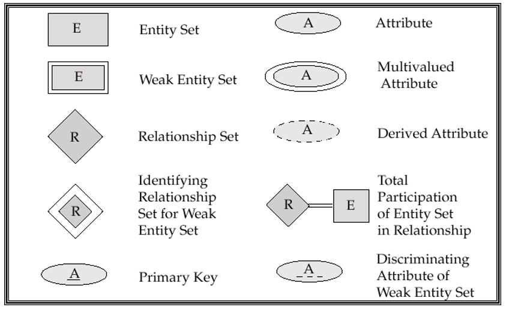
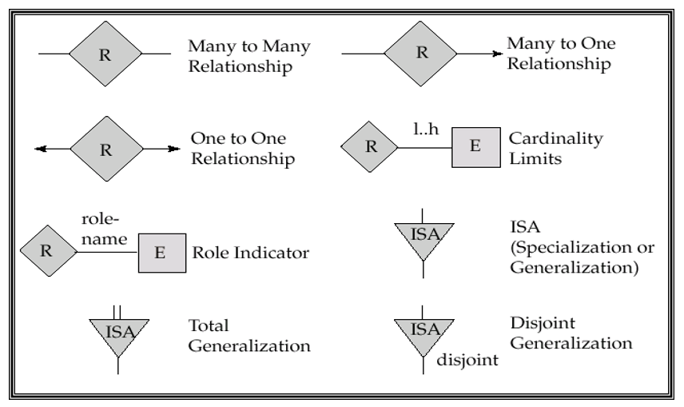
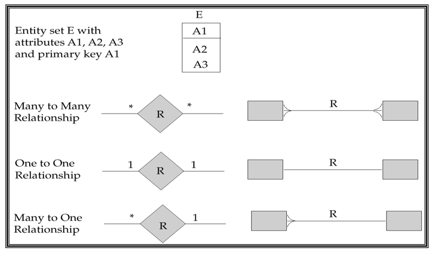

## 范式理论

+ **第一范式（First Normal Form，1NF）**
    - 定义：所有 Domain 都是不可分的（atomic）。
    - 关系型数据库要求都是满足 1NF 的。
+ **函数依赖（Functional dependency）**
    - 函数依赖 $\alpha \rightarrow \beta$ 在 $R$ 上成立，当且仅当对于所有关系 $r(R)$，$\forall (t_1,t_2)$
        $$ t_1(\alpha)=t_2(\alpha) \Rightarrow t_1(\beta)=t_2(\beta)$$
        $\alpha$ 的值确定了，那么 $\beta$ 的值也确定了。
        - 举例：比如主键 K 能推出所有属性。
    - 如果一个函数依赖集 $F$ 对于所有 $r$ 成立，则称 $F$ 在 $R$ 上成立。
    - $F$ 能推出的极大函数依赖集，称为 $F$ 的闭包（closure），记作 $F^+$。
+ 函数依赖集闭包
    - **Armstrong’s 公理**
        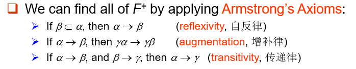
    - 推导 $F^+$
        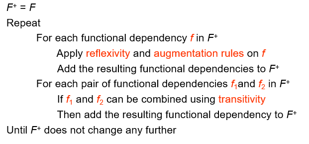
    - 属性 $a$ 在 $F$ 下的闭包记为 $a^+$。
        + 求 $a^+$ 的方法
            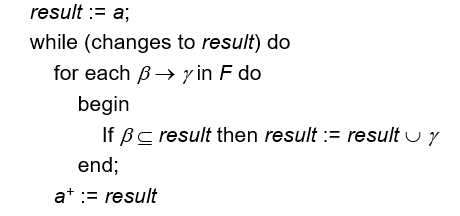
    - 检验
        + $a$ 是否是 `super key`。 $R \subseteq a^+$
        + $\alpha \rightarrow \beta$ 是否成立。$\beta \subseteq \alpha^+$
+ **正则覆盖（Canonical Cover）**
    - 函数依赖集 $F$ 的“最小表示”。
    - 三种去重方式：
        + 能被别的函数依赖直接推出的。
        + 在箭头左侧的对象，可能可以变少。
        + 在箭头右侧的对象，可能可以因为拆开后重复导致变少。
    - **无关属性（Extraneous Attributes ）：**
        $\quad$ 首先设 $\{ \alpha \rightarrow \beta \} \subseteq F$。
        1. 称 $A$ 是 $\alpha$ 的无关属性（$A \in \alpha$），如果 $F$ 能推出 $F'=\{F-\{\alpha \ \beta\}\} \cup \{(\alpha-A) \rightarrow \beta\}$
            + 检验：$\beta \subseteq (\alpha -A)^+$
        2. 称 $A$ 是 $\beta$ 的无关属性（$A \in \beta$），如果 $F'=\{F-\{\alpha - \beta\}\} \cup \{\alpha \rightarrow \{\beta -A \}\}$ 能推出 $F$。
            + 检验：$A \in \alpha^+$
    - 正则覆盖过程：每次去掉无关属性。
+ **分解（Decomposition）**
    - 将 Schema $R$ 分解成 $(R1，R2)$，必须满足 $R1 \cup R2 =R$。
    - **无损连接分解（Lossless-join decomposition）**：
        对于 Schema $R$ 的所有关系 $r$，满足 $\prod_{R1}(r) \Join \prod_{R2}(r) =r$
        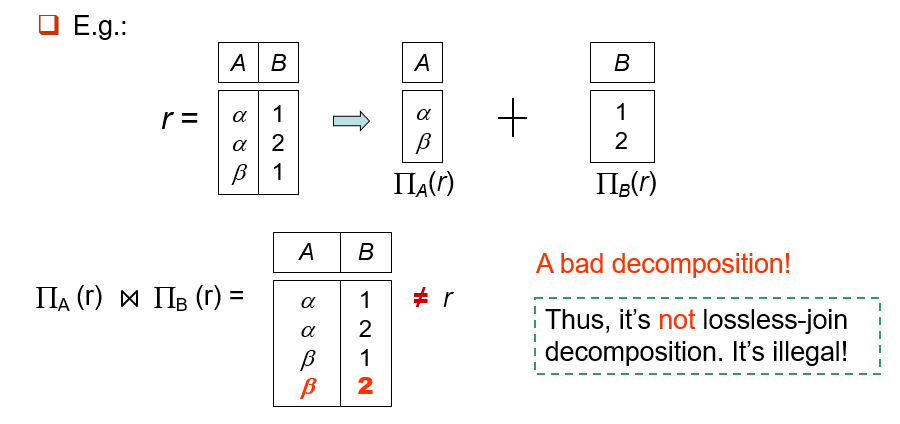
        + 二元分解的判定：以下依赖在 $F^+$ 至少有一个成立：
            $$\{R_1 \cap R_2 \} \rightarrow R_1$$
            $$\{R_1 \cap R_2 \} \rightarrow R_2$$
    - 依赖保持（Dependency preservation）
        + $(\cup F_i)^+ = F^+$
+ **BCNF（Boyce-Codd Normal Form）**
    - 定义：对于 $F^+$ 里的每一个非 trival 的 $\alpha \rightarrow \beta$，满足 $\alpha$ 是 $R$ 里的 super key。
    - 注意：只检验 $F$ 和检验 $F^+$ 是在 $R$ 处等价，在分解 $R_i$ 处不等价。
+ **Third Normal Form (3NF)**
    - 定义：对于 $F^+$ 里的每一个非 trival 的 $\alpha \rightarrow \beta$，至少满足以下的某一条：
      + $\alpha$ 是 $R$ 里的 super key。
      + $\forall A \in \{\beta - \alpha\}$， $A$ 包含于 $R$ 的一个 candidate key 里。
    - 一定存在一种满足函数依赖、所得关系都是第三范式的无损连接分解。

## 索引

+ Two basic kinds of indices:
    - Ordered indices
        1. + `Clustering(Primary) index（聚集索引）`
            + `Secondary index`
        2. + `Dense index (稠密索引)`
            + `Sparse index (稀疏索引)`
            + `Sparse index` 只能用于顺序文件, 而 `dense index` 可以用于顺序和非顺序文件，如构成索引无序文件。
        3. + `Secondary Indices(辅助索引)`
    - Hash indices
+ B+ 树
    - 实时满足的性质
        + 对于 $M$ 阶 `B+树` ，每个节点拥有最多 $M$ 个孩子，$M-1$ 个键值。
        + 对于叶节点，储存 $\lceil \frac{M-1}{2} \rceil \sim M-1$ 条记录。
        + 任意一个非根非叶节点，有 $\lceil \frac{M}{2} \rceil \sim ~ M$ 个孩子。
        + 如果根不是叶节点，至少要有两个孩子。
    - 高度和size的估算
        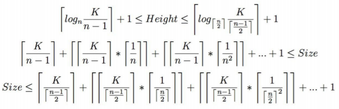

## 查询

+ Measures of Query Cost
    - cost：
        + $t_T$ – time to transfer one block.  (≈ 0.1ms)
        + $t_S$ – time for one seek.  (≈ 4ms)
        + Cost for b block transfers plus S seeks：$b \times t_T + S \times t_S $
    - **cost for selection**:
        + 不使用 `index`
            - linear search：$b_r$ block transfers, 1 seek
            - binary search: $\lceil \log_2(b_r) \rceil$ `block transfer` + $\lceil \log_2(b_r) \rceil$ `seek`
                如果不是 `key`，`block transfer`要额外加上 $ex = \lceil \frac{b_r}{f_r} \rceil - 1$
        + 使用 `index`
            - 用`key`：$(h_i + 1)$ `block transfer` + $(h_i + 1)$ `seek`。
            - 非 `key` 同样也要加上 $ex$ 个`block transfer`.。
        + 非等值查询一般用 `linear search`。
        + 查询 Conjunction ：根据耗时最少的条件找到记录并 `check` 剩余。
        + 查询 Disjunction ：直接暴力查询，除非所有条件都有 `index`。
    - **cost for join**:
        + Nested-Loop Join
            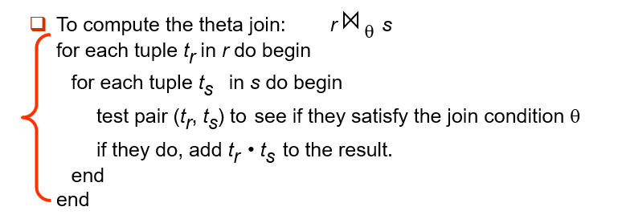
            - 最坏情况：$n_r \times b_s + b_r$ `transfer`， $n_r + b_r$ `seek`
            - 最好情况：$b_r + b_s$ `transfer`，$2$ `seek`
        + Block Nested-Loop Join
            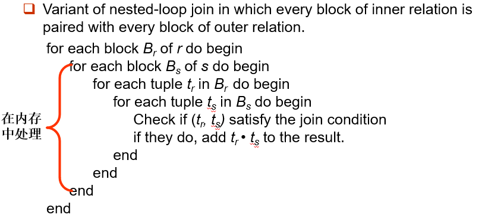
            - 最坏情况 $b_r \times b_s + b_r$ `transfer`。
            - Let the relation with smaller number of blocks be outer relation.
            - 最好情况：与上同理。
        + Indexed Nested-Loop Join
            - `inner relation` 要有索引。
            - 枚举每一个 $n_s$，用索引去找符合要求的 $t$。
            - 代价：$b_r (t_T + t_S) + n_r \times c$
        + Merge-Join（排序归并连接）
          
            - $br + bs$  `transfers`  ， $\lceil \frac{b_r}{b_b} \rceil + \lceil \frac{b_s}{b_b} \rceil$ `seeks`
        + Hash-Join Algorithm
            1. 对 $s$ 用外层哈希对 $r$ 和 $s$ 进行 `Partition`。
            2. 对每一个 $s_i$ 进行 `in-memory hash`.
            3. 对每一个 $t_i$，找到对应的 $s_i$。
            - $s$ 称为 `build input`，$t$ 称为 `probe input`。
            - 一般 $n = \lceil \frac{b_s}{M}\rceil  * f $，$f = 1.2$。
            - 代价大概是 $3(b_r+b_s)$
            - 如果 $n>M$，进行 `Recursive partitioning`。
+ Cost Estimation
    - Statistical Information
        + $n_r$ : number of tuples in a relation r.
        + $b_r$ : number of blocks containing tuples of r.
        + $l_r$ : size of a tuple of r.
        + $f_r$ : blocking factor of r — i.e., the number of tuples of r that fit into one block.
        + $V(A, r)$ : number of distinct values that appear in r for attribute A;  same as the size of $\prod_A(r)$.
        + If tuples of $r$ are stored together physically in a file, then: $$ b_r = \lceil \frac{n_r}{f_r} \rceil $$
    - Selection Size Estimation
        + $\sigma_{A=v}(r) : \frac{nr}{V(A,r)}$

## 事务（Transaction）

+ 概念：a unit of program execution that accesses and possibly updates various data items.
+ 在 `transaction` 期间数据可以不一致，结束后必须一致。
+ 四个特性：
    - Atomicity.
    - Consistency.
    - Isolation.
    - Durability.
+ Transaction state
    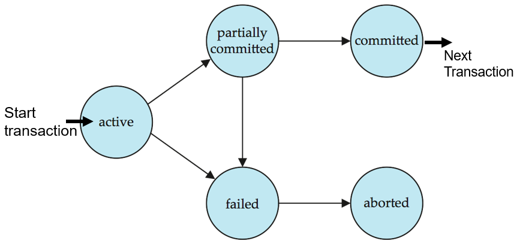
      - `aborted`: `roll back` 结束后返回到的初始状态。
+ The shadow-database scheme
    - 始终指向正确的数据库。
    - 每次 `update` 时新开一个 `new copy` 来更新。`commit` 了后再指向新的。
+ Concurrent Executions（并发）
    - `Schedules`
        + indicate the chronological order in which instructions of concurrent transactions are executed.
        + `Serial schedule` (串行调度)：必能保证一致性，但是低效。
    - `Conflict Serializability`（可串行化）
        + 若2个操作是有冲突的，则二者执行次序不可交换；若2个操作不冲突，则可以交换次序。
        + 如果 `S` 可以通过交换次序到达 `S'`，称它们 `conflict equivalent`.
        + 如果 `S` 是等价于 `serial schedule`，称为 `conflict serializable`.
    - `View Serializability`
+ Recoverability
    - `Recoverable schedule` — if a transaction $T_j$ reads a data item previously written by a transaction $T_i$ , then the commit operation of $T_i$  appears before the commit operation of $T_j$.
    - `recover` 会导致 `Cascading rollback `.
    - `Cascadeless schedules` — $T_j$ reads a data item previously written by  $T_i$, the commit operation of $T_i$ appears before the read operation of $T_j$.

## 并发控制（Concurrency Control）

| .    | S    | X    |
| ---- | ---- | ---- |
| S    | T    | F    |
| X    | F    | F    |

+ Lock-Based Protocols
    - `Exclusive (X) mode`: 只允许事务 T 读取和修改，其他任何事务都不能读取、写入和加锁，直到 T 释放。
        - `Shared (S) mode`: 允许 T 读但不能修改，其他事务只能加 S 锁但不能加 X 锁，直到 T 释放。
        - `deadlock`：双方都施加过 S 锁，想申请 T 锁时都要等待对方释放。
        - `strict two-phase locking` 事务结束前不能释放锁。
+ Graph-Based Protocols
    - If $d_i \rightarrow d_j$  then any transaction accessing both $d_i$ and $d_j$ must access $d_i$ before accessing $d_j$.
    - `Tree Protocol`
        + 只有 $X$ 锁。
        + 事务 $T$ 第一次可以给任何点加锁，之后给点 $t$ 加锁时必须保证 $t$ 的父亲目前被 $T$ 锁住。
        + 一个 `item` 可以在任何时候被解锁，但不能重新再上锁。
    - 优缺点
        + 保证了 `conflict serializability`，防止了 `deadlock`。
        + 不保证 `recoverability`，增加了无用的 `lock`。

+ Multiple Granularity（多粒度）
    - 描述成一个树结构
        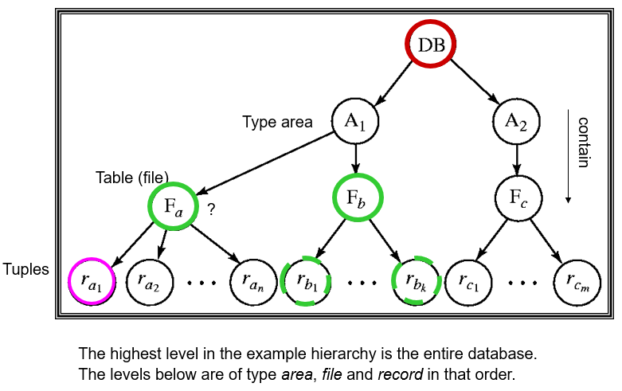
        - 意向锁
            + `Intention-shared` (IS，共享型意向锁)
            + `Intention-exclusive` (IX ，排它型意向锁)
            + `Shared and intention-exclusive` (SIX，共享排它型意向锁)
        - Compatibility Matrix
            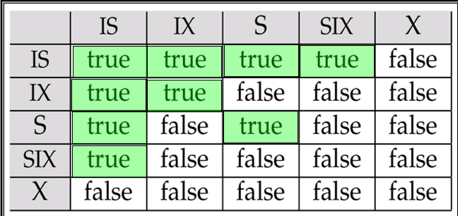
        - Transaction Ti can lock a node Q, using the following rules:
        1. The lock compatibility matrix must be observed.
        2. The root of the tree must be locked first, and may be locked in any mode.
        3. A node Q can be locked by Ti in S or IS mode only if the parent of Q is currently locked by Ti in either IX or IS mode.
        4. A node Q can be locked by Ti in X, SIX, or IX mode only if the parent of Q is currently locked by Ti in either IX or SIX mode.
        5. Ti can lock a node only if it has not previously unlocked any node (that is, Ti is two-phase).
        6. Ti can unlock a node Q only if none of the children of Q are currently locked by Ti.

## 恢复（Recovery）

+ **Log-Based Recovery**
    - 语法
        + `<Ti start>`，`<Ti commit>`，`<Ti abort>`
        + `<Ti, X, V1, V2>` X 从 V1 变成了 V2（在输出操作前）
        + `<Ti, X, V>` 将 X 以值 V 输出。
        + `checkpoint <L1, L2 ...>` 设立断点，将所有数据保存下来
    - 分类
        + Deferred Database Modification（所有写操作在 `commit` 后进行）
        + Immediate Database Modification（后来的讨论都是针对它）
    - 先进行 `undo` 操作（有 `start` 无 `commit`）再进行 `redo` 操作（有 `start` 有 `commit`）
    - `recover` 时，只有那些在最近一次 `checkpoint` 里或者之后开始的事务，才需要对其 `redo` 或者 `undo`。
    - 并发恢复
        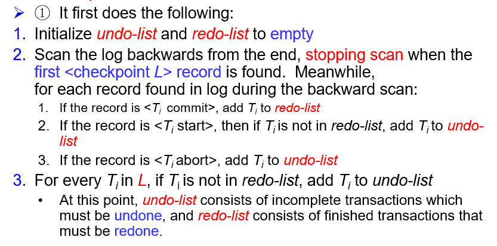
        
+ ARIES：a state of the art recovery method

## XML

+ `<tagname>...</tagname>` 嵌套时必须严格匹配
+ XML 主要用于数据传输
+ 元素（Element）
    - 元素可以拥有一些属性（attribute）
        + 用 `name = value` 标注
            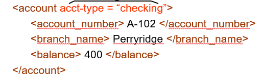
        + 元素中还可以定义 子元素（Subelement）
            + use attributes for identifiers of elements, and use subelements for contents.
+ 用命名空间来防止变量名重复
    
+ 用 `![CDATA[...]]` 套起来的是不套用XML语法的纯字符串
+ Document Type Definition (DTD)
    - 不含有类型（全以字符串储存）
    - 语法
        + `<!ELEMENT element (subelements-specification)>`
        + `<!ATTLIST element (attributes)>`
    - ELEMENT 定义规则
        
        - ELEMENT 支持正则表达式
            
        - Attribute 定义规则
            
+ XPath
    - Result of path expression:  set of values that along with their containing elements/attributes match the specified path.
    - 查询 []
        + `/bank-2/account[balance > 400]`：Returns account elements with a balance value greater than 400. 
        + `/bank-2/account[balance]`：Returns account elements containing a balance sub-element.
    - 选择 attribute @
        + `/bank-2/account[balance >400] /@account_number`：Returns the account numbers of accounts with balance > 400.
    - 并操作 |
    - 跳过一级目录 `//`
    - `ID` 和 `IDREF`
        + 可以给attribute一个唯一的 `ID` 值，这样如果有个地方有一个 `IDREF`，就可以实现联系和跳转。
        + `IDREFS` 可以建立与 0 或 多个 `ID` 的联系。
+ XQuery
    - 基本语法
        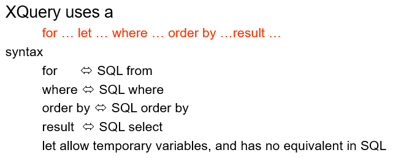
        - FLWOR Syntax
            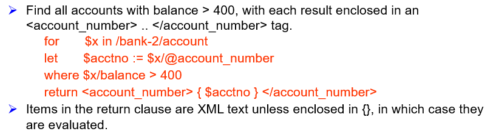
        - join 操作
            
        + 这句话等价于
            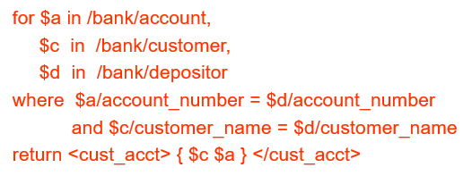