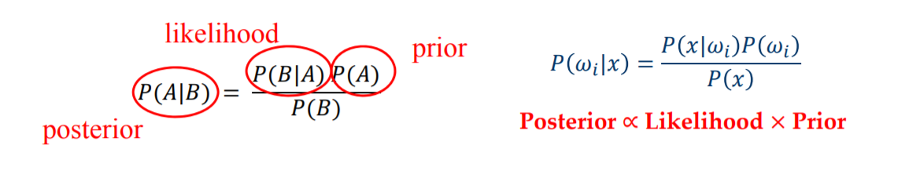
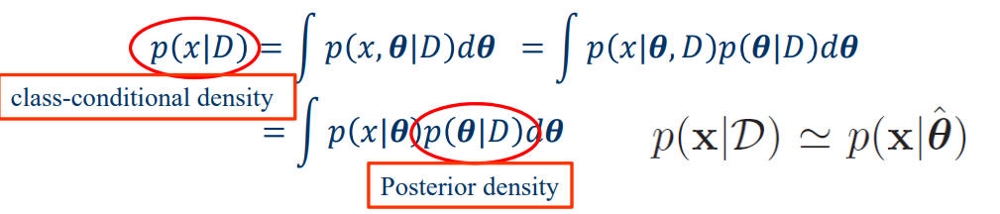
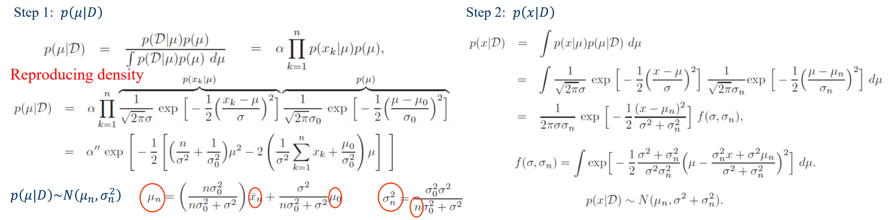

《数据挖掘导论》课程内容涉及机器学习入门主题，包括以下内容：

+   贝叶斯模型和线性分类器 
+   非线性方法，包括 Kernel 和 神经网络
+   KNN，决策树和随机森林
+   聚类和降维
+   主题模型和矩阵分解
+   Adaboosting

## 贝叶斯决策理论 Bayesian Decision Theory

在 Supervised Learning 里，通过对 Samples $\{(x_1,\omega_1),\dots,(x_n,\omega_n\}$ 的训练，我们要做到对于每一个给出的 Sample $x$，预测它的标签 $\omega$。

**贝叶斯决策理论**（**Bayesian Decision Theory**）：基于贝叶斯公式进行有监督地预测。

+ **先验**（Prior）：$P(w_i)$。获得新数据前，基于历史经验或知识对事件发生概率的初始信念。
+ **似然函数**（Likelihood）：$P(x|w_i)$。在已知某个参数或状态的情况下，观察到新数据的概率。
+ **后验**（Posterior）：$P(w_i|x)$。观察到新数据后，对事件发生概率的最新、最完整的信念。

**最大似然决策**（**Maximum Likelihood Decision**）：用 Likelihood 预测，选择 $P(x|\omega_j)$ 最大的 $\omega_j$。

+ 隐含了所有类别的先验概率相同，即 $P(w_1)=P(w_2)=\dots=P(w_n)$。

**最优贝叶斯决策**（**Optimal Bayes Decision Rule**）：用 Posterior 去预测二分类（即选择 $P(\omega_j|x)$ 大的 $\omega_j$）能最小化错误概率。证明如下：

+ 假设只有两个标签，则 $P(error|x)=P(\omega_{\sim o}|x)=\min(P(\omega_1|x), P(\omega_2|x))$。（$\omega_o$ 为预测值）

+   $P(error)=\int_xP(error|x)$，因为每个点都取到 $\min$，所以积分起来的概率值也取到最小。

在现实情况下，我们可能会对 Loss Function 有不同的要求，所以形式化的贝叶斯估计如下：

+   假设总共有 $\{\omega_1,\dots,\omega_c\}$ 这些标签，一共进行了 $\alpha_1,\dots,\alpha_n$ 这些预测。
+   定义损失函数 $\lambda(\alpha_i|\omega_i)$ 的值为：标签为 $\omega_j$ 时预测了 $\alpha_i$ 后的损失。
+   那么 Conditional risk 就是 $R(\alpha_{i} | x)=\sum_{j=1}^{c} \lambda(\alpha_{i} | \omega_{j}) P(\omega_{j} | x)$。
+   定义 **Bayes Risk** 为 $R$ 函数关于所有 $x$ 的积分，我们就是想让 Bayes Risk 尽量小。
+   刚才讲到的用 Posterior 去预测，其实取的就是 $\lambda_{i,j}=[i=j]$

对于 Prior 的估计，可以直接用训练集里每一种标签出现的频率。但是如何估计 **Likelihood** 呢？

这就涉及到 **Parameter Estimation** 的知识了。假设 **Likelihood** 的分布满足某个已知函数，我们要根据训练数据估计出这个函数的参数 $\theta_j$，以便最终估计 $P(x|\omega_j)$。一般设为正态分布，即 $P(x|\omega_j) \sim N(\mu_j,\sigma_j)$。

注意到，对于一个给定的标签 $\omega_j$，只有等于这些标签的数据才会对 $P(x|\omega_j)$ 产生贡献，即 $w_j$ 彼此之间独立。具体地，假设标签为 $\omega_j$ 的数据一共有 $n$ 个，分别是 $D=\{x_1,x_2,\dots,x_n\}$ ，求 $P(x|\omega_j)$ 就是求 $P(x|D)$。

参数估计主要分为两种方法：**Maximum‐Likelihood**  和 **Bayesian Estimation**。

 **Maximum‐Likelihood** 认为参数 $\theta$ 是固定不变的未知数，通过估计 $\theta$ 来估计 $P(x|D)$。具体地，要求一组 $\hat \theta$ 使得似然函数 $P(D|\theta)=\prod \limits_{i=1}^nP(x_i|\theta)$ 的概率取到最大。例如，假设数据满足正态分布，且 $(\pmb{\mu},\sigma)$ 都未知：

1.  回忆正态分布的矩阵表示：$P(\boldsymbol{x})=\frac{1}{(2 \pi)^{\frac{d}{2}}|\Sigma|^{\frac{1}{2}}} \exp \left[-\frac{1}{2}(\boldsymbol{x}-\boldsymbol{\mu})^{T} \Sigma^{-1}(\boldsymbol{x}-\boldsymbol{\mu})\right]$
2.  则参数 $\pmb{\mu}$ 的对数似然函数为： $\ln P\left(x_{k} | \mu\right)=-\frac{1}{2} \ln \left[(2 \pi)^{d}|\Sigma|\right]-\frac{1}{2}\left(\pmb{x}_{k}-\pmb{\mu}\right)^{T} \Sigma^{-1}\left(\pmb{x}_{k}-\pmb{\mu}\right)$
3.  导函数等于 $0$，解得 $\boldsymbol{\hat \mu}=\frac{1}{n} \sum_{k=1}^{n} x_{k}$，$\boldsymbol{\hat \Sigma}=\frac{1}{n} \sum_{k=1}^{n}\left(\mathbf{x}_{k}-\hat{\boldsymbol{\mu}}\right)\left(\mathbf{x}_{k}-\hat{\boldsymbol{\mu}}\right)^{t}$

**Bayesian Estimation** 则是把参数 $\theta$ 也看做随机变量。注意到 $P(x|D)=\int _\theta P(x|\theta)P(\theta|D)$，前一项可以直接表示，所以 BE 的核心就是在给定的 $D$ 下，估计每一个 $\theta$ 的概率密度 $P(\theta|D)$（也就是 **$\theta$ 的关于 $D$ 的分布**）。

注意到，如果 $\theta$ 在 $\hat \theta$ 处的取值特别大，$P(x|D)$ 的积分式就可以直接用 $P(x|\hat \theta)$ 来近似，这其实就是 Bayesian Estimation 退化成 Maximum‐Likelihood 了。在应用时其实很难搞出解析解，一般用数值方法做。

举一个理论推导的例子，假设 $P(x|D) \sim N(\mu,\sigma^2)$，且我们知道 $\mu$ 服从分布 $N(\mu_0,\sigma_0^2)$。为了表示 $P(\theta|D)$，我们得 **再套一次贝叶斯公式**，即 $P(\theta|D) \propto P(D|\theta)P(\theta)$ （分母只是个系数不影响）。具体过程如下：

最后总结一下解决实际问题的 **Naïve Bayes Classifier** 步骤。

1.  为了预测 $P(\omega|\pmb{x})$，我们把 $P(\omega_j)$ 设成 $\omega_j$ 的频率，并对每一个 $j$ 尝试去估计 $P(\pmb{x}|\omega_j)$。
2.  上面讨论的所有做法里，每一条数据默认只有一个特征。现实里如果有多个特征，我们可以简单地假设它们之间条件独立，即 $P(\pmb{x}|\omega_j)=\prod P(x_i|\omega_j)$。
3.  对于离散的特征，$P(x_i|\omega_j)$ 直接用 $x_i$ 在 $\omega_j$ 条件下出现的频率近似。连续的特征有以下几种方法：
    +   把分布函数划成离散的几段（bin），和离散的方法一样，每段统计频率。
    +   假设它是正态分布，直接用 MLE 的结论去估计 $(\mu,\sigma)$，带进去得到 $P(x_i|\omega_j)$
4.  注意：因为条件独立的假设，数据量不足时可能会因为某个特征的 $P(x_i|\omega_j)=0$，导致 $P(\pmb{x}|\omega_j)$ 被强制计算成 $0$ 了。对此我们可以用 **Laplace smoothing**，把 $P(x_{i} | \omega_{k})$ 的估计从 $\frac{|x_{ik}|}{N_{\omega_k}}$ 变成 $\frac{|x_{i k}|+1}{N_{\omega_{k}}+K}$

## 线性模型 Linear Model

**线性模型**（**Linear Model**）：已知训练数据 $(\pmb{x}_i,y_i)$，学一个向量 $\pmb{w}$ 使得预测函数为 $f(x)=\pmb{w}_0+\pmb{w}^T\pmb{x}$。

**线性回归**（**Linear Regression**）：用均方误差（**M**ean **S**quared **E**rror）估价，即  $J_n=\frac{1}{n} \sum (y_i-f(\pmb{x}_i))^2$。
$$
X=[\pmb{x}_1,\pmb{x}_2,\dots,\pmb{x}_n], Y=[y_1,y_2,\dots,y_n]\\
J_n(w)=(Y-X^T\pmb{w})^T(Y-X^T\pmb{w}) \\
\nabla J_n=-2X(Y-X^T\pmb{w}) \\
\nabla J_n =0 \leftrightarrow \pmb{\hat w}=(XX^T)^{-1}XY
$$
推论：如果样本数小于特征数，$XX^T$ 一定不满秩，即推不出最优解。

拓展：为什么用均方误差估价是合理的？

1.  一个线性模型的实际效果记为 $y=f(\pmb{x},\pmb{w})+\epsilon$，样本量充足时噪声 $\epsilon$ 服从高斯分布 $N(0,\sigma^2)$。
2.  如果我们已经有了个模型，那么当前标签分布出现的概率是 $L=\prod \limits_{i=1}^n P(y_i|\pmb{x}_i,\pmb{w}_i,\sigma)$。
3.  我们希望找到一个模型使得 $L$ 尽可能得大，用最大似然理论去估计，得出极大化 $L$ 等价于极小化 MSE。 

$$
\log L=-\frac{1}{2\sigma^2}\sum(y-f(\pmb{x},\pmb{w})^2)+c(\sigma)
$$

拓展：使用 $\lambda |\pmb{w}|_q$ 惩罚项来缓解标准线性回归中的过拟合和多重共线性的现象。当 $q=1,2,3 \dots$ 时优化函数是凸的，所以我们总能解出最优的解（即使是数值解）。但是当 $q=0.5$ 时就没有那么好的性质了。

**岭回归**（**Ridge Regression**）：特指 $q=2$ 的 L2 惩罚项。解的系数会向零收缩，但不会完全变为零。
$$
J’_n=\sum \limits_{i=1}^n(y_i-\pmb{x}_i^T\pmb{w})^2+\lambda \sum \limits_{i=1}^p \pmb{w}_j^2 \\
\nabla J'_n=-2X(Y-X^T\pmb{w})+2\lambda \pmb{w} \\
\nabla J_n =0 \leftrightarrow \pmb{\hat w}=(XX^T+\lambda\pmb{I})^{-1}XY
$$
**套索算法**（**LASSO**）：特指 $q=1$ 的 L1 惩罚项。解会变得稀疏的，即很多维会被压缩到 $0$。

**逻辑回归**（**Logistic Regression**）：在线性变换的基础上又套了一个 $\text{Sigmoid}$ 函数。
$$
P(y_i=\pm 1|\pmb{x},\pmb{a})=\frac{1}{1+e^{-y_i\pmb{a}^T\pmb{x}}}
$$
由于 $\text{Sigmoid}$ 可以把 $(-\infty,+\infty)$ 转化到 $(0,1)$，我们可以认为 LR 学到的就是标签的分布概率。

之前说的贝叶斯模型被称为 **Generative Modeling** （生成模型），因为该模型表示了从给定输入 $X$ 到概率分布 $Y$ 之间的生成关系。而 Logistic Regression 是正好与之对应的 **Discriminative Modeling**（判别模型），它会直接学习概率分布，但是不能反映训练数据本身的特性。

现在我们想找一组参数 $\pmb{a}$，使得以下式子取到最大（又是最大似然的套路）。
$$
E(\pmb{a})=\prod \limits_{i \in I} \frac{1}{1+e^{-y_i\pmb{a}^T\pmb{x}_i}}
$$
当然在具体训练时，我们会对 $E(\pmb{a})$ 取对数，即使得下列式子取到最小。
$$
\ln E(\pmb{a})=\sum \limits_{i \in I} \ln (1+e^{-y_i\pmb{a}^T\pmb{x}_i})
$$

下面我们来简要证明 $\ln E(\pmb{a})$ 是凸函数（所以可以直接用 Gradient Descent 解）。

1.  先把 $\sum$ 拆开，证明每个部分都是凸函数，凸函数的和还是凸函数。
2.  设 $\theta_i=\pmb{a}^T\pmb{x}_i$。根据凸函数的定义，证明 $\ln E(\pmb{a})$ 凸性等价于证明 $\ln E(\theta_i)$。
3.  所以我们现在想证明 $J(\theta)=\ln(1+e^{-y_i\theta})$ 是凸函数。
4.  求一阶导 $J'(\theta)=-\frac{y_i}{e^{y_i\theta}+1}$，二阶导 $J''(\theta)=\frac{e^{y_i\theta}}{(e^{y_i\theta}+1)^2}=\frac{e^\theta}{(e^\theta+1)^2} \ge 0$
5.   所以 $J(\theta_i)$ 是凸的，即 $\ln E(\pmb{a})$ 也是凸的。

## 模型评估 Model Assessment and Selection

**Bias & Variance Decomposition** 是模型评价的理论基石。

对于有一个有监督学习 $(\pmb{x}_i,y_i)$ ，假设我们的模型是 $f(\pmb{x})$，那么期望的损失函数为：
$$
E(L)=\iint L(y,f(\pmb{x}))~p(\pmb{x},y) d\pmb{x}dy 
$$
假设损失函数使用平方误差，那么得到的 Expected Prediction Error 是：
$$
EPE(f)=\iint (y-f(\pmb{x}))^2~p(\pmb{x},y)dxdy
$$
现在我们想化简这个积分式。把 $(y-f(\pmb{x}))^2$ 换成 $(y-E(y|\pmb{x})+E(y|\pmb{x})-f(\pmb{x}))^2$ 展开化简
$$
EPE(f)=\int (f(\pmb{x})-E(y|\pmb{x}))^2p(\pmb{x})d\pmb{x} + \int var(y|\pmb{x})p(\pmb{x})d\pmb{x}
$$
我们会发现，无论我们怎么选择模型都不可能让 EPE 变为 $0$。

虽然最优的 $f(\pmb{x})$ 满足 $f(\pmb{x})=E(y|\pmb{x})$，但是实际操作时我们只能从训练数据里构建模型，所以我们学到的 $f(\pmb{x})$ 其实是 $f(\pmb{x}|D)$。重新推导式子后，可以将 EPE 分成以下三个部分：
$$
\begin{align}
\text{bias} &= \int \{E_D(f(\pmb{x};D)-E(y|\pmb{x}))\}^2p(\pmb{x})d\pmb{x} \\
\text{variance} &= \int E_D\{[f(\pmb{x};D)-E_D(\pmb{x};D)]^2\}p(\pmb{x})d\pmb{x} \\
\text{noise} &= \int var(y|\pmb{x})p(\pmb{x})d\pmb{x}
\end{align}
$$
之前说的正则化操作，大的 $\lambda$ 会导致更大的 bias，小的 $\lambda$ 会导致更大的 variance。

在模型选择时，常用 **Cross-Validation** 的方法。将训练数据集划成 $k$ 份，每次留一份 $i$ 作为 Validation，其它$k-1$ 份用来训练，挑选 bias 或者 variance 比较小的模型。不同的 Validation 能重复 $k$ 次。当训练数据比较少时，可能会用到比较极端的 leave-one-out 方法，即取 $k=N$。 

## 决策树 Decision Tree

**决策树**（**Decision Tree**）是一个简单而有效的分类问题的解决方案。训练时，它每次从当前（带标签的）样本中选择一个“方差”最大的属性 $a$，不同属性值的数据会被分配到不同的分叉里；重复这个操作，直到当前样本的标签均相同或是特征均相同。预测时直接沿着对应分叉往下走。

**熵**（**entropy**）是随机变量不确定性的度量。设 $E$ 是离散随机变量，概率分布为 $P(X=x_k) = p_k$，则熵：
$$
Ent(E)=-\sum \limits_{k=1}^{K} p_k\log(p_k)
$$
 $Ent$ 越小，$E$ 就越稳定。注意到 $\lim \limits_{p\to 0^+} p_k\log(p_k)=0$，所以额外定义 $0 \log 0=0$。

我们尝试把熵应用到决策树的属性选择上。对于样本 $D$，设 $K$ 是标签总数，$n_0$ 是样本总数，$n_1 \dots n_k$ 是每个标签对应的样本数。定义样本 $D$ 的熵  $H(D)$ 为：

$$
H(D)=-\sum \limits_{k=1}^{K} \frac{n_k}{n_0}\log(\frac{n_k}{n_0})
$$
$H(D)$ 越小，则决策树节点的“纯度”就越高。但是我们应该根据什么来决定用来划分的属性呢？

如果样本 $D$ 选了属性 $a$ 作为分支属性，且不同取值有 $V$ 个，定义选 $a$ 对 $D$ 的 **信息增益**：
$$
g(D,a)=H(D)-\sum \limits_{v=1}^V \frac{|D_v|}{|D|}H(D_v)
$$
显然，$g(D,a)$ 越大说明使用属性 $a$ 进行划分所获得的“纯度提升”越大，著名的 **ID3 决策树** 就是靠这个决定属性的。注意，该准则对可取值数目较多的属性有所偏好，这种偏好可能带来不良影响。

为了改进上述问题，**C4.5算法** 引入了 **信息增益率** 的新准则。
$$
g_R(D,a)=\frac{g(D,a)}{H_a(D)}
$$
这里的 $H_a(D)$ 和之前的 $H(D)$ 含义不一样：$H(D)$ 是针对标签的信息熵，而 $H_a(D)$ 是针对属性 $a$ 划分的信息熵。引入的 $H_a(D)$ 有点像平衡（惩罚）因子，因为分叉多了之后 $H(a)$ 也会偏高，可抑制原来的信息增益带来的负面效果。在实际测试中，信息增益率 比 信息增益 效果更好一些。

此外，**CART 算法** 用 **基尼不纯度**（gini impurity） 来构建决策树的划分函数。基尼指数就是独立取值两次后不相等的概率。设 $E$ 是离散随机变量，概率分布为 $P(X=x_k) = p_k$，则：
$$
I(E)=\sum \limits_{k=1}^K p_i \sum \limits_{k \ne i}p_k=1-\sum \limits_{k=1}^K p_k^2
$$
推广到决策树，定义属性 $a$ 对样本 $D$ 的基尼指数增益为：
$$
g_I(D,a)=I(D)-\sum \limits_{v=1}^V \frac{|D_v|}{|D|}I(D_v)
$$
更加优美的是：**基尼不纯度增益** 和 **信息熵增益** 还有神秘的联系！当 $p$ 很小的时候，$\log(p) \sim p-1$，于是 $-p \log p \sim p(1-p)$！也就是说，我们可以用基尼指数近似熵里的对数来加速。

单一的决策树往往会遇到过拟合的问题。所以我们往往会留下一部分数据作为 Validation，同时在构建决策树时利用它们做一些 **剪枝**。下面是两个有效的剪枝技巧：

+   Prepruning 预剪枝：在某个点决定完分支后，我们把 Validation 的数据分别用不分支（即直接在这个点投票决定统一的预测）和分支验证一遍。如果前者优于后者，我们就在这个节点进行剪枝。
+   Postpruning 后剪枝：我们先建好整棵搜索树，在回溯的时候同时维护当前子树的 Validation 结果。如果某个点直接投票的答案优于产生分支的答案（即子树结果和），我们就在这个节点进行剪枝。

预剪枝的剪枝本身带有估计的成分（因为下一层其实还没有继续分叉），剪枝力度往往很大；实际中一般会采取比较稳定的后剪枝方法。下面是我对 **Titanic** 数据集进行决策树剪枝的实验结果：

| 方法            | 总运行时间 s | 平均节点 | 平均训练集正确率 % | 平均测试集正确率 % |
| --------------- | ------------ | -------- | ------------------ | ------------------ |
| **No pruning**  | 3.85         | 217.7    | 86.11              | 79.43              |
| **Prepruning**  | 1.84         | 14.6     | 79.88              | 78.47              |
| **Postpruning** | 2.91         | 44.4     | 81.87              | 80.76              |

## 集成模型 Ensemble Model

我们通常用 **committee** 来形容多个模型集成的方法。首先来证明一下集成模型的有效性。

假设 $h(x)$ 是真实模型，$y_m(x)$ 是我们给出的单一预测模型。定义继承模型 $y_{com}=\frac{1}{M}y_m(x)$。

（这里待续......）

那么如何来科学地生成 $M$ 个不同的小模型呢？有以下两种方法：

+   **Bagging** (**B**ootstrap **Agg**regat**ing**)：通过采样多组数据构建不同的模型。这些 Base Learners 之间需要略微不同，且允许有过拟合的现象发生。Bagging 分为以下两个阶段：
    1.  **Bootstrap Sampling**：每次从 $N$ 组数据里随机抽取 $D$ 组构建模型并放回。 
    2.  **Aggregating**：每一个模型都训练一套参数，并把它们的预测结果聚合起来。
+   **Boosting**：通过修改每组数据的权重来构建不同的模型。

决策树是一个很好的 Base Learner，而用决策树来 Bagging 的方法被称为 **随机森林（Random Forest）**。为了保证每次构建的决策树之间有更多的特异性，在每次决定分支时，我们往往先在总特征 $F$ 里面随机选择一个子集 $f$，并在 $f$ 里寻找最优的特征。经验性地来说，一般分类问题 $|f|=\sqrt{|F|}$  回归问题 $|f|=|F|/3$。

**AdaBoost** 全称 **Adaptive Boosting**，是 Boosting 最经典的实践。首先我们先介绍它的流程。

有 $n$ 个训练集样本 $\{(x_1,y_1),\dots,(x_n,y_n)\}$，其中 $y_i \in \{-1, 1\}$。

最开始设参数组 $w^1_i=1$，其中 $w^m_i$ 表示第 $m$ 轮时每个样本的权重。

按顺序迭代 $T$ 轮，假设当前是第 $m$ 轮：

1. 训练一个分类器 $g_m(x)$ 使得在当前权重下的训练集误差最小，即 $\epsilon_m=\min \sum w^m_i [g_m(x_i)\ne y_i]$。
2. 设第 $m$ 轮的分类器的权重为 $\alpha_m=\frac{1}{2}\ln(\frac{1-\epsilon_m}{\epsilon_m})$，总集成模型为 $F_m(x)=F_{m-1}(x)+\alpha_mg_m(x)$。
3. 更新下一轮样本权值，$w^{m+1}_i=w^m_i\exp(-y_i\alpha_mg_m(x_i))$。

$F_T(x)$ 就是最后的 AdaBoost 集成模型。注意我们只关心 $w^m_i$ 的相对大小，所以每轮开始前可以对其归一化。

下面我们来说明，为什么 AdaBoost 的流程是这样的，里面的函数是如何推出来的。

设 $E_m=\sum \exp(-y_iF_m(x_i))$ 为 AdaBoost 的参考损失函数。可以证明，以该损失函数为导向，并在集成规则是 $F_m(x)=F_{m-1}(x)+\alpha_mg_m(x)$ 的情况下，按上述流程取 $w^m_i,\alpha_m$ 并训练分类器 $g_m(x)$ 能使 $F_m(x)$ 最优。
$$
E_m=\sum \limits_{i=1}^n \exp(-y_iF_m(x_i))=\sum \limits_{i=1}^n \exp(-y_iF_{m-1}(x_i)) \cdot \exp(-y_i\alpha_mg_m(x_i))
$$

所以我们设 $$w^m_i=\exp(-y_i\alpha_mg_m(x_i))$$ 来简化 $E_m$ 的表达式。
$$
\begin{align}
E_m&=\sum \limits_{i=1}^n w^m_i\exp(-y_i\alpha_mg_m(x_i)) \quad\\
&=\sum \limits_{y_i = g_m(x_i)}w^m_i\exp(-\alpha_m)+\sum \limits_{y_i \ne g_m(x_i)}w^m_i\exp(\alpha_m) \quad (1)\\
&=\sum \limits_{i=1}^nw^m_i\exp(-\alpha_m)+\sum \limits_{y_i \ne g_m(x_i)}w^m_i(\exp(\alpha_m)-\exp(-\alpha_m))  \quad (2)
\end{align}
$$

对于公式1，我们把 $g_m(x_i)$ 和 $w^m_i$ 固定，把 $E_m$ 看做关于 $\alpha_m$ 的函数以确定 $\alpha_m$ 该如何取值。
$$
\begin{align}
dE_m/d\alpha_m&=0 \\
\sum_{y_i = g_m(x_i)}w^m_i\exp(-\alpha_m)&=\sum_{y_i \ne g_m(x_i)}w^m_i\exp(\alpha_m) \\
-\alpha_m+\ln(\sum_{y_i = g_m(x_i)}w^m_i)&=\alpha_m+\ln(\sum_{y_i \ne g_m(x_i)}w^m_i) \\
\alpha_m&=\frac{1}{2}\ln(\frac{\sum_{y_i \ne g_m(x_i)}w^m_i}{\sum_{y_i = g_m(x_i)}w^m_i})
\end{align}
$$

对于公式2，我们把 $\alpha_m$ 和 $w^m_i$ 固定，本质上就是想让 $\sum \limits_{y_i \ne g_m(x_i)}w^m_i$ 最小，所以会对新带权样本做分类 $g_m(x)$。

以上分析摘自 Wikipedia 有关 AdaBoost 的[介绍](https://en.wikipedia.org/wiki/AdaBoost)，下面再引入一个蔡登教授课程中的推导角度。

我们用另一个角度来解释 $w^m_i$ 和 $g_m(x)$ 的关系。观察 $g_m(x)$  所有猜错的样本，即 $\sum_{i=1}^n w^m_i [g_m(i) \ne y_i]$。在集成模型的思想中，我们希望 $g_{m+1}(x)$ 能弥补一些 $g_m(x)$ 犯的错，所以设计新的样本权重 $w^{m+1}_i$。为了能让 $g_m(x)$ 和 $g_{m+1}(x)$ 尽量 diverse，我们构造新的 $w^{m+1}_i$ 使得原来的 $g_m(x)$ 在 $w^{m+1}_i$ 环境下的正确率只有 $50\%$：
$$
\frac{\sum_{i=1}^n w^{m+1}_i[g_m(i) \ne y_i]}{\sum_{i=1}^n w^{m+1}_i[g_m(i) \ne y_i]+\sum_{i=1}^n w^{m+1}_i[g_m(i) = y_i]}=\frac{1}{2}
$$
大部分情况下 $\sum_{i=1}^n w^m_i [g_m(i) \ne y_i]$ 比较小，上面这种构造相当于放大了 $g_m(i) \ne y_i$ 处的 $w^{m+1}_i$ 至总体的 $50\%$，希望 $g_{m+1}(x)$ 能更好地从错误样本中学习。如果我们把之前证明里的 $w^{m+1}_i=w^{m}_i\exp(-y_i\alpha_mg_m(x_i))$ 和 $\alpha_m=\frac{1}{2}\ln(\frac{1-\epsilon_m}{\epsilon_m})$ 带入上述构造的等式中，等式恰好成立——这进一步说明 AdaBoost 算法的有效性。

## 主题模型 Topic Model

主题模型多用于文本分析，比如判断一篇文档的主题。或者说给出一个文档集合和一些 queries，每次要回答与当前 query 最相近的页面（搜索引擎）。

注意，我们在这里探讨的主题模型属于 Bag‐of‐Words（词袋模型），即我们不考虑单词出现的顺序问题，只考虑整篇文档里单词的概率分布。这样可以简化问题。

一个最直接的做法是 **Salton’s Vector Space Model**。对于每一个文档，统计各个单词出现的次数，并用一个向量去描述它——该向量的长度就是字典大小。我们可以开一个 $weight$ 向量去给每个单词加权，最后用 cos 相似度去衡量两个文档之间的相似程度。

这样做有什么问题呢？topics 和 words 之间可能会存在不匹配的现象！
+   一词多义会让两个远离向量的距离变小
+   同义词会让两个相近向量的距离变大

在 **Language Model Paradigm** 里，我们应用贝叶斯公式去完成文档查询。设 $R_d \in \{0,1\}$ 表示文档 $d$ 和当前询问 $q$ 是否有关。我们知道 $P(R_d=1|q) \propto P(q|R_d=1)P(R_d=1)$，所以可以用后两者去估计前者。
+   Prior $P(R_d=1)$ 对应搜索引擎技术里的一个重要概念——**Page Rank**。
+   Likelihood $P(q|R_d=1)$ 就是我们要从数据中训练出来的。

一次询问 $q$  通常包含若干个词，即 $q=(w_1,w_2,\dots,w_q)$。此时我们又要像以前那样，假设词和词之间是独立同分布的 ，所以 $P(q|R_d=1)=\prod \limits_{w \in q}P(w|d)$，我们要估计的核心就是 $P(w|d)$。

一个 Naive 的尝试是：取 $\hat P(w|d)=\frac{n(d,w)}{\sum _{w'} n(d,w')}$，即直接用每个单词（在训练数据）出现的频率去估计。但是这会遇到严重的 zero frequency 问题，当我们训练数据不足时会有很大的影响。

下面介绍一下经典的 **Probabilistic Latent Semantic Analysis** 方法。在 Document 和 Vocabulary 之间添加一个新的关系 Topic。我们认为一篇文档里的 $n$ 个单词是按这样的方法独立生成的：每次带权随机一个和这个文档有关的 Topic $z$，然后再带权随机一个该 Topic 下的单词 $w$，即 $P(w|d)=\sum \limits_z{P(w|z)P(z|d)}$。

这样做有什么好处呢？本来我们需要求一个 $N \times M$ 的参数矩阵，表示文档 $i$ 下单词 $j$ 出现的概率，但是这个矩阵可能很大。现在我们引入了 $K$ 个 Topic，只要分别估计 $N \times K$ 和 $K \times M$ 两个参数矩阵就行。

考虑用最大似然估计去求参数。对于一篇文档，当前单词集合出现的概率是：
$$
P(w|d)=\sum \limits_{z} P(w|z;\theta)P(z|d;\pi)
$$
我们需要估计参数 $\theta$ 和 $\pi$。它的对数似然函数如下：
$$
l(\theta,\pi;N)=\sum \limits_{d,w}n(d,w)\log(\sum \limits_{z=1}^K P(w|z;\theta)P(z|d;\pi))
$$
注意这个 $l(\theta,\pi;N)$ 不是凸函数，我们要使用 **Expectation Maximization** 方法来求、EM 算法采用迭代的方式，专门用来求解包含“隐含变量”或者“缺失数据”的概率模型参数估计问题。

首先我们要明白，估计参数 $\theta$ 和 $\pi$，本质上就是求 $N\times K$ 和 $K \times M$ 两个矩阵里的参数。在 EM 算法开始前，我们先随机生成这些参数，然后通过重复以下两个步骤来不断迭代。

+   **E-step**：我们可以利用当前的结果计算最新的后验：
    $$
    P\left(z_{k} | d_{i}, w_{j}\right)=\frac{P\left(w_{j} | z_{k}\right) P\left(z_{k} | d_{i}\right)}{\sum_{l=1}^{K} P\left(w_{j} | z_{l}\right) P\left(z_{l} | d_{i}\right)}
    $$

+   **M-step**

    1.  利用这些后验概率修正最大化函数。
        $$
        E(d_i,w_j,z_k)=\sum_{i=1}^{N} \sum_{j=1}^{M} n\left(d_{i}, w_{j}\right) \sum_{k=1}^{K} P\left(z_{k} | d_{i}, w_{j}\right) \log \left[P\left(w_{j} | z_{k}\right) P\left(z_{k} | d_{i}\right)\right] \\
        \text{s.t.}
        \sum_{j=1}^{M} p\left(w_{j} | z_{k}\right)=1,\sum_{k=1}^{K} p\left(z_{k} | d_{i}\right)=1
        $$

    2.  用拉格朗日乘子法，拉格朗日函数为：
        $$
        \mathcal{H}=E(d_i,w_j,z_k)+\sum_{k=1}^{K} \tau_{k}\left(1-\sum_{j=1}^{M} P\left(w_{j} | z_{k}\right)\right)+\sum_{i=1}^{N} \rho_{i}\left(1-\sum_{k=1}^{K} P\left(z_{k} | d_{i}\right)\right)
        $$

    3.  对 $NK+MK$ 个变量分别求偏导，得：
        $$
        \begin{align}
        \sum_{i=1}^{N} n\left(d_{i}, w_{j}\right) P\left(z_{k} | d_{i}, w_{j}\right)-\alpha_{k} P\left(w_{j} | z_{k}\right)&=0\\
        \sum_{j=1}^{M} n\left(d_{i}, w_{j}\right) P\left(z_{k} | d_{i}, w_{j}\right)-\beta_{i} P\left(z_{k} | d_{i}\right)&=0
        \end{align}
        $$

    4.  最终解得新的迭代方程为：
        $$
        \begin{array}{l}P\left(w_{j} | z_{k}\right)=\frac{\sum_{i=1}^{N} n\left(d_{i}, w_{j}\right) P\left(z_{k} | d_{i}, w_{j}\right)}{\sum_{m=1}^{M} \sum_{i=1}^{N} n\left(d_{i}, w_{m}\right) P\left(z_{k} | d_{i}, w_{m}\right)} \\P\left(z_{k} | d_{i}\right)=\frac{\sum_{j=1}^{M} n\left(d_{i}, w_{j}\right) P\left(z_{k} | d_{i}, w_{j}\right)}{n\left(d_{i}\right)}\end{array}
        $$