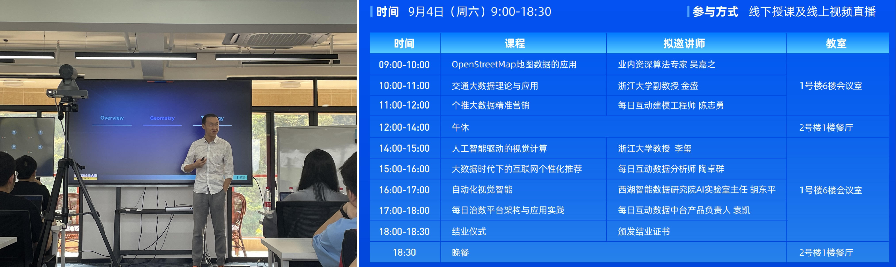
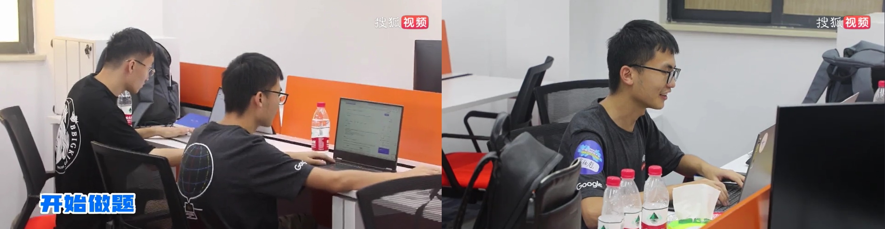
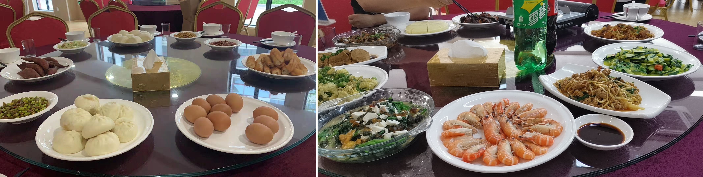
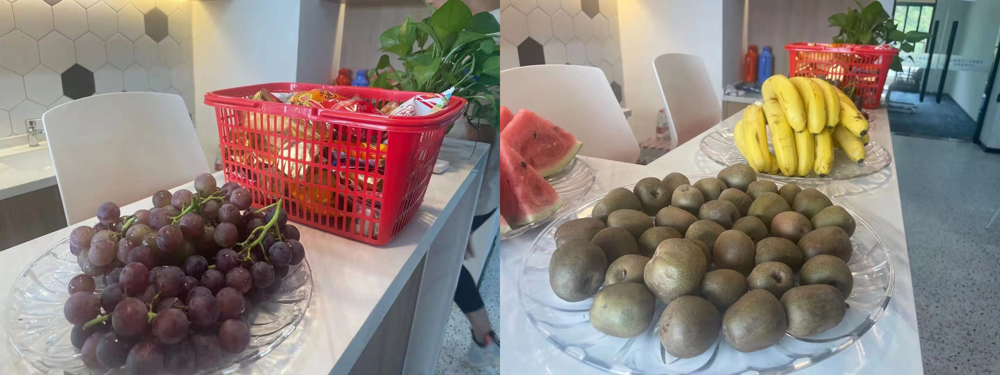
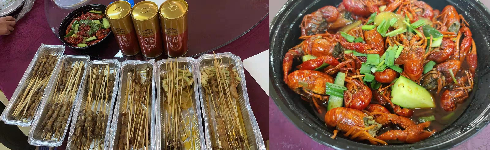
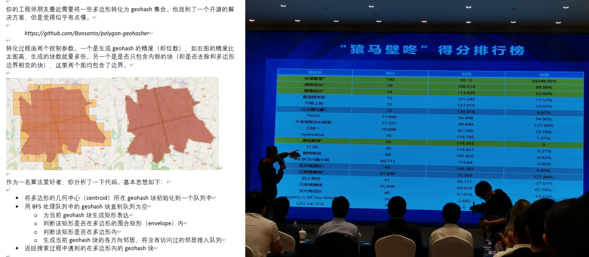
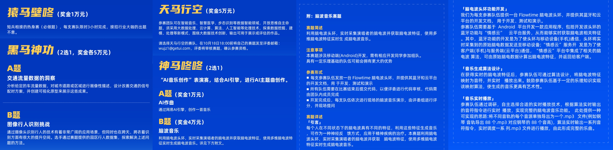
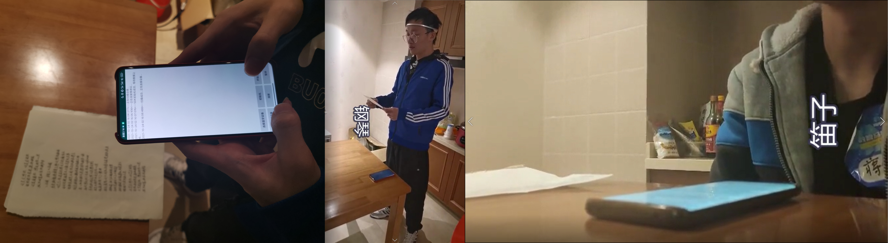
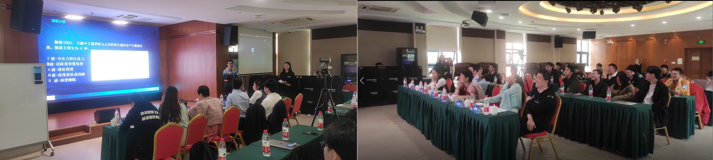
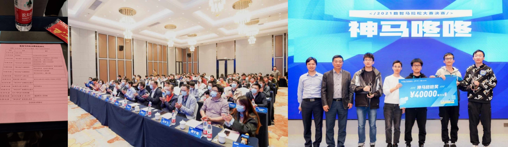

从学长那儿听说了 [数智马拉松 2021](https://www.getui.com/event/2021-datathon)。我以前只打算法类比赛，就想以这个作为切入口，体验一下大数据 & AI 方向的比赛。~~加之官网上标的奖金比较高~~，我就去报名参加啦。

数智马拉松由每日互动和杭州市政府举办，规格很高，服务也很到位。要是宣传做得再大一些就好啦~

## 海选 & 组队

数智马拉松 2021 的海选赛时间 $8.1-8.30$。我在八月中旬打听到比赛，加了群但一直没时间做海选题。到 $8.30$ 上午 $10:30$ 的时候猛然想起，打开官网一看只剩 $1.5$ 小时了……于是迅速下数据准备 rush 一波……

海选赛提供了一段高速上若干个检测点的信息（该点附近各条道路的通车量和通车速度），最后让你预测在某个时刻通过这段高速要花的时间。我本打算随便训个 sklearn 模型，但是提取数据了后发现模型不是那么显然，而且已经没时间构造特征了。最后我分别统计了历史时期正反方向通过这段高速的平均时间，直接用这两个值进行预测。

结束前 $10min$ 才搞完，惊出我一身冷汗。提交时还遇到了一些小插曲：我这 DC 网站崩了，托大赛的 QQ 小助手帮忙提交。当小助手告诉我分数是 $2250.029$ 且成功晋级时，感觉十分侥幸。

本来我是决定一个人组队的。后来组委会联系我说，因为我的账号在 DC 网站上没有记录，复赛时候提交可能不方便，建议我组个队。他们向我推荐了张皓焜，也就是我后来的队友。

临行前我还去请教一位对 AI 比赛造诣很深的学长，他说结构化数据用 **lightgbm** 和 **xgboost** 就能搞定。 

## 抵达现场 & 夏令营

作为本科毕业后刚上班的社畜，抽空来参加比赛着实不容易。由于组委会要求提供三天内的核酸阴性证明，我还得在周五下班后去医院挂急诊做核酸，花了 $100+$。这是我新冠以来第一次做核酸，做的是鼻拭子，痒了好久。

看群里大家周五中午已陆续抵达，在分享风景有多好看、晚宴有多好吃，我却只能干流口水。

周六早上拿完核酸报告后，我从杭州东站乘高铁到千岛湖，再打车去比赛场地——千岛湖两山高层次人才集聚区。这个地方坐落在千岛湖边，集会议室 & 餐厅 & 客房为一体，风景甚是漂亮。好多选手都说想去外面捕鱼。

周六全天是培训课程，干货满满。旅途匆匆，没赶上心心念念的吴嘉之老师的讲课，可惜了。

我从上午的《个推大数据营销》开始听，一直听到最后的《每日治数平台架构与应用实践》，还很积极地在结束后向讲课人提问。听下来最喜欢的是胡东平主人的自动化视觉智能，讲得很接地气很实在。李玺老师正好是我本科时的班主任，他的视觉计算 PPT 像是《实验室最新科研成果报告》，看得我云里雾里。

**不得不强调**，比赛的组织者们真的很用心，一日三餐都很丰盛，零食水果不间断供应，晚上还有豪华夜宵。可惜后两天我一门心思都在比赛上，根本没时间静下来吃东西。~~早知道把女朋友带来享受生活了~~。

我的队友 & 室友叫张皓焜，是浙大舟山校区海洋学院的研究生一年级，~~属于背着导师偷偷来比赛这种~~。我们简单地商量了一下，取了个霸气的队名“只想要赚钱”。中午的时候顺便去外面合了个影~

比赛前一天晚上组织了环岛一周的散步。想到第二天就没这个闲情逸致了，我连忙跟上了大部队。可惜晚上太黑了啥也看不见（而我早上又起不来欣赏美景呜呜呜）。只能放几张白天时候的千岛湖照片充充数~

## 复赛比赛记录

初赛赛题和公共交通预测有关，由资深算法专家**吴嘉之**领衔出题。

~~~
我们给出的数据包括公交轨迹数据和公交线路设置两部分。公交轨迹数据包含22条路线，时间范围为3月8日至3月21日两周，选手需要预测的数据分为以下两种情况：

A:	22条公交线路在3月22日至3月28日一周内的站到站运行时间
B:	7条相同区域内未给出轨迹数据的路线在3月7日至3月28日三周内的站到站运行时间

待预测的起始和到达车站至少距离5站。
~~~

`train.csv` 里给出了 1kw+ 条车载设备的上传数据，包括：

+ `(line, dir)`：公交车的线路名称和方向（上行、下行或环行）。
+ `device`：该车载设备的唯一识别号（可理解和公交车绑定）。
+ `(time, long, lat)`：该记录的形成时间，以及此时所在的经纬度。

`route.csv` 里给出了所有公交车线路，包括线路名称和方向、经过的每个车站的经纬度。

`challenge.csv` 里给出了所有待预测数据，总共有 2.5w+ 条。AB 类型的问题的询问格式相同，每条包括公交车的线路名称和方向、出发站和到达站的站名、出发站的时刻，让你预测抵达到达站的运行时间（以秒为单位）。

评分标准是：预测值和真实值之间求 MSE。即如果每个询问误差 $5min$，得分为 $MSE=9 \times10^4$。

#### 9.5 10:00-18:00

公交站点和线路均选自温州市，且大部分站点可以直接在高德地图上查询到（除了一年内变动的站点）。

下载数据后，我首先在 `route.csv` 里发现了这样一件事：同名的公交车站可能具有不同（但是相差很小）的经纬度，因为它们是两个方向上面对面的站。在预处理时数据时还遇到更极端的情况，有些站甚至有 $3\sim4$ 个位置。

把 `train.csv` 里的数据按不同 device 划分是自然的想法。划分完后我发现：每趟车会有一段连续的记录，然后会无信号直到下一次发车；正常情况下，设备会在运行途中每隔 $8s$ 记录一次数据。因为是取自现实的场景，总有各种奇奇怪怪的现象发生，需要用更细致的规则去处理，如：

1. 某个设备可能在相同时刻记录多条数据。
2. 相邻两次记录的间隔不是 $8s$，而是 $1,2,3,\dots,7,9,10s$ 。
3. 相邻两次记录的间隔是 $16s, 32s, 40s, \dots$ （$8s$ 的倍数），中间有几个点短暂丢失。
4. 相邻两次记录的间隔很大（可视化后应该是同一趟车），中间连续的一段记录都丢失。

张同学通过可视化，推定每 $1h$ 分趟比较好（同一 device 相邻两次记录的间隔过长视为两趟）。

为了方便后续的训练和预测，还有一个很重要的预处理是：把当前 **每趟车的轨迹点数据** 转化成 **每趟车经过每个车站时的时间戳数据**。这中间有个近似的过程，我在实现的时候先枚举每个站点，然后找离它经纬度坐标最近的那些轨迹点，最后找个前 $k(k=2/3)$ 小的轨迹点，并取它们时间戳的平均值。为了优化速度和准确性，我会按前后顺序枚举站点，每个站点枚举的轨迹点下标必须大于前一个站点的最优轨迹点下标。

#### 9.5 18:20 - 9.5 24:00

有了转化后的历史车次的到站时间戳数据，得到 A 问题的 baseline：找到询问中对应线路和方向的所有车次，把它们花的时间求个平均值。这里无须考虑中间站点的停靠时间，因为历史车次的时间戳已经包含了这个情况。

B 问题可以间接的做。虽然 $a_0 \rightarrow a_1 \rightarrow a_2 \rightarrow \dots \rightarrow a_n$ 的整条轨迹没有出现过，但相邻车站的通路 $a_i \rightarrow a_{i+1}$ 很可能被某些车次的轨迹覆盖过。我们可以参考历史上经过这段路的平均用时，如果一条都不存在，就用近似距离除上公交车平均速度来暴力估计。根据统计数据，大概 $85\%$ 的相邻通路被至少一条轨迹覆盖过。

我在调程序的过程中发现 `routes.csv` 里的环形线路存在问题。温州的环形公交不是圆形而是 $\rho$ 形，所以经过的公交站形式是 $a_0 \rightarrow a_1 \rightarrow \dots \rightarrow a_k \rightarrow a_{k+1} \rightarrow \dots \rightarrow a_m \rightarrow a_k \rightarrow a_{k-1} \rightarrow \dots \rightarrow a_0$（重复的那段路的公交站名可能不完全重合）。而 `routes.csv` 里描述环形线路时会省去末尾 $a_k \rightarrow a_{k-1} \rightarrow \dots \rightarrow a_0$ 这段路。更准确地说，会省去后面这段路中所有在之前 $a_0 \rightarrow \dots \rightarrow a_k$ 里出现过的公交站（大概出题人做了错误地去重操作）。

我找张同学确认了这个问题，并着手修复数据。一个很大的挑战是：环形线路从 2020 年到 2021 年有很大的变化，现在的高德地图和 `routes.csv` 不一致（四条环形线路里只有一条完全对上）。我在网上搜了好久，找到一个和数据集比较接近的公交车线路网站；张同学在此基础上凭借自己的想象力开始补充。

皓焜快补充完时，嘉之老师也在微信上肯定了我的质疑，还决心修复这个 bug：“我希望选手能把控整个题目，而不是把精力放到这些细节上去”。这下完蛋，我们的上分秘籍被公开了，张同学的一小时工作还毁于一旦。

$21:30$ 的时候写完第一版代码，提交后获得 $20w+$ 的成绩，暂列第二（此时总共只有五六个提交）。

**注意可以把询问输入到手机里的高德地图 APP，从而获得相对准确的估计值。**

我通过这个操作来评估结果，发现对环形公交的预测全炸了。经过分析，环形公交相邻两趟的间隔会小很多（因为它们不用折返），我就把环形线的间隔阈值改成了 $10\min$。$23:00$ 提交获得 $16w+$ 的成绩。

代码里有多处取平均值操作，张同学用 numpy 检测并删除了异常点。这一改动把线上分数提升到 $122749$。

前三发结果一发比一发强，后续调了些异常点检测参数却没有变优。

#### 9.6 0:00 - 9.6 12:00

这段时间是我队的“**至暗时刻**”。除去 $2:30 \sim 8:00$ 的睡觉时间，我们一直在旁门左道且徒劳无功。

最开始我是从手机 APP 的查询功能尝到了甜头，和张同学讨论把前 $100$ 个测试集的数据都去查一下，标个测试集。我们查了几个后发现十分麻烦，就想寻求一个自动化查询的方法。

通过搜索，我们发现高德地图还提供 Web API 服务。虽然没有直接对口的服务，但是能提供更一般的路径规划，且每个账号每天有多达 $30000$ 次的查询！询问恰好只有 $2.5w$ 个，这不就是天意吗？

高德 Web API 里的路径规划正好有 $1.0$ 和 $2.0$ 两个版本。我们一合计，张同学开发 $1.0$ 的交互，我开发 $2.0$ 的交互（因为不同版本的格式不太一样）。一直开发到两点多，我们差不多时间调完，然后挂在后台去睡觉了。

回去路上我们在畅聊明早的结果。如果直接把高德结果提交会怎样？万一出题人就是拿高德做的标签，我们的误差岂不就是 $0$？这个 Web 服务虽然是公开的，但是是不是不太好？要不要和出题人去说一下？

第二天早上我们汇总结果时，发现 **事情没那么简单**。每条询问会返回大量的结果，还要在其中筛选唯一合适的那条路线。此外，因为当前公交线路和数据集的不同，部分数据查不到结果或者误差会很大。

我先写了个解析脚本，把高德能跑出结果的数据都提取了出来，不能提取之处就用原来的代码替换。满怀信心地提交了一发，结果竟然爆到了 $32w+$？？？随后我们进行了反复的实验，包括：A 问题用程序跑，B 问题调高德；把我们的结果和高德的结果取平均；切换 1.0 和 2.0 的结果……

结论只有一个：**高德跑出来的结果就是垃圾，而且用的越多分数越差**。

因为付出的沉默成本，到这我们还是不死心，变得鬼迷心窍了起来。通过对比，Web API 返回的结果比手机 APP 上的普遍偏大。于是张皓焜决定把前 $30$ 条询问在 APP 上手动查询，并替换原来我们的提交的前 $30$ 条，以此确定手机 APP 的查询结果是否有帮助；我则浪迹于其他企业的 Web API 服务，如百度地图、腾讯地图等。

最后我们双双 **遇到了最坏的结果**。张同学的新提交变劣了，说明高德地图 APP 也是垃圾；我则证明了百度和腾讯也都是垃圾。

#### 9.6 12:30 - 9.6 23:30

**吃完午饭后我们决定彻底抛弃之前的错误战略，从头再来**。整个下午我们的排名一路从第 $3$ 掉到了第 $8$。前排的竞争特别激烈，前三都是 $10w$ 零一些，第一甚至达到了 $1000070$。我们猜测他们队今日的提交次数已经用完了，否则随便手调两个结果就能破 $10w$。

我思考了很久，没想到怎么很好地套用机器学习模型。和我们一个房间的 **三缺一队** 正好相反：他们比赛一开始就搞机器学习模型，各种 lightgbm、catboost，各种 cnn 结构，讨论得不亦乐乎。

统计了一下不同时间段的轨迹信息，发现一天中变化很大（特别是早高峰和晚高峰），工作日和周末也有区别。

于是我着手优化之前的模型。把一天的时间每隔 $1h$ 拆开，连同当天是星期几，划成了若干个 **时间段**。某个历史信息如果量足够大，我就会将其按不同时间段分类储存，调用时也是分类调用。

改完 A 问题后提交获得 $11.8w+$ 分，下午 $17:00$ 改完 B 问题提交获得了 $11.6w+$ 分，日子感觉入了正轨。可惜的是，我们的排名只有略微上升，还是在 $6 \sim 8$ 徘徊。而对面的三缺一队始终在我们后面一名，难兄难弟。

晚饭后的这段时间里，我脑补出了一个利用原数据生成近似标签的方法，并搭建了系统的评估平台，能对一组参数下的整个模型求出 MSE 的参考大小。我想通过这个方式来更加方便和准确地调参。

+   对于 A 问题，从 `train.csv` 涉及的时间段里均匀地挑出一些，并在轨迹集合里把与他们相关的暂时删除。在这些删除的轨迹集合上随机起点和终点建立带标签的询问并测试。
+   对于 B 类型问题，假设某条公交线路 R 存在在轨迹集合里，可以从总轨迹中暂时删除 R 并建立前文的模型，同时在 R 上随机起点和终点建立带标签的询问。我们可以依次枚举所有存在的 R 并测试。

可惜 python 的多线程是假的，写多进程传参又太麻烦。我的模型每次重跑大概要 $15min$，只能开着 jupyter notebook 在那里傻等。还好调的方向比较正确，在整个晚上一直在微小地进步。

举个例子，我通过统计 B 问题的预测值与“标签”的偏差，发现我们的预测值大多偏小；随后我引入了“停靠时间”这一概念，把 B 问题的结果加上与站点个数成比例的停靠时间，成功改造成了近似无偏的估计。

#### 9.6 23:30 - 9.7 10:00

正当人困马乏之际，大赛微信群里出了个劲爆消息：DC 平台上的打分有漏洞，评估方式将从 MSE 改成 RMSE。重测后，好多前排队伍瞬间消失，我们队直接从第八跃到第二，**三缺一队** 紧随其后跳到第三。

我开始还觉得奇怪，评估方式不就是开个根号嘛，单调性又没变，难道某些深度学习的 loss 函数因为多了根号导致反向传播走了弯路？后来结合微信群的消息我才明白，DC 平台对分数的储存有一定 bug：超过某个数量级的得分会被截取一个固定的前缀。难怪榜一一直在 $100070$ 不动，因为变小地扰动反而会将分数更新成 $999xxx$。

这 bug 对前排的队伍影响巨大，有些队员直接在微信群里崩溃了，但是大赛组委会拒绝了延期的提议（估计颁奖流程都准备好了，延期太麻烦了）。而方总一直在群里给大家进行哲学引导。反思我们的做题流程，一直在寻求对预测结果正确性的把控（前期的高德 or 后期的平台），所以遇到这种 bug 应该也能及时发现。

凌晨时候我一边刷着参数，一边写了点 PPT 的文字。感觉好像在做梦一般。

## 返程 & 颁奖

作为社畜，我周二早上 $6:25$ 起床，坐滴滴去赶高铁，在 $8:55$ 抵达杭州东站， $9:45$ 抵达公司。

返程路上我一直在刷着排行榜，最后成功苟住了第三！哎，实力不济运气来凑，要是没出 bug 不知能排第几。

PPT 展示和颁奖就交给队友张皓焜啦。我也在线上观看了 PPT 展示。可惜不能和颁奖的专家合影了。

## 决赛

$2021.10.24$ 的决赛比较肝，时隔两年回来补充一些经过。

决赛热身赛题是吴嘉之老师出的计算几何代码性能优化。作为 World Final Team 里唯一指定计算几何手，这题我本势在必得。可惜三小时的时间限制太短，我没法深入理解代码的用意，只能粗略地对一些表层运算做了优化，效果不佳。从最终的排行榜中可以看出，我们（不想上班）虽然比大部分队伍得分高，但被吴老师的基础优化完虐。

决赛正式赛从 $10.21$ 晚上开始选题，一直持续到 $10.24$（上午进行最终答辩）。有多个赛道，大致分为《城市画像描述》、《园区内图像行人识别挑战》、《AI 音乐创作》、《脑电波实时生成音乐》和《开放性 AI 应用》五个题目。每个队伍只能选择其中一个赛道，每个赛道只有第一名能获得现金奖励。

这其中，水最深的课题是《开放性 AI 应用》，因为部分有“积淀”的参赛队伍可以随手把他们实验室的数据和成果拿过来，无非就是做个 PPT 展示即可。我和张皓焜没啥积累，这个赛题当然最先放弃。最易上手的课题是《AI 音乐创作》，因为赛题组已经给出了网易音乐生成的轮子，随便给几个提示词再微调一下生成的词曲即可。由于参赛门槛太低（势必导致参赛人数较多），而奖金只有一万块，我和张皓焜也放弃了。剩下三个赛题比拼的是硬实力，都有较为客观的评价体系（准确度 or 成品展示），我们没啥选择的偏好，就一咬牙选了最难的《脑电波实时生成音乐》。当最后得知有四支队伍选了这个赛道时（比想象中的多），我其实还是蛮后悔的。

三天的艰难程度自然不必多说。发了一个脑电波仪，通过连接 SDK，可以实时传递一些测量数据。

+   我以为的场景：当一个人在歌唱时，脑电波会直接反映出音调，做个映射即可；
+   实际的场景：脑电波不仅无法传达歌唱者的声音，甚至无法区分一个人是在唱歌还是静默地坐着。

由于缺少睡眠，张皓焜经常在头戴脑电波仪时睡去——此时我发现，测量的数据会有断崖式地下降。前两天，我们除了搭建了 SDK 和手机 APP 等工程操作，唯一的探究成果是：**脑电波只能准确区分一个人是否在睡眠状态**。

第三天实在太急了，通宵测试+写映射代码。经过反复的尝试，我们发现当朗诵或歌唱时，**过强和过弱的情绪反应会使脑电波的数值有微小的变化**。我们抓住了这根救命稻草，决定开发一个“伴奏”的思路：通过脑电波检测演唱者当前的情绪状态，并生成对应情绪的伴奏。由于时间不足，我们没办法细化从无到有生成伴奏，只能去搜集了一些诸如钢琴、笛子、架子鼓等现成的片段，嵌在 APP 里。然后 APP 对脑电波数据做一个简单的多分类，再转化成音乐输出。效果差强人意，还是有概率出现“假装很高亢，伴奏很安静”的尴尬局面，所以我们决定预录制视频。我和张皓焜分头录制，我选了《北京欢迎你》和《本草纲目》作为慢和快的代表，而他选了林达浪的《还是会想你》。我们在深夜找了个房间，一遍又一遍尝试和录制，勉强搞出一个成品，清晨再胡乱糊一个 PPT。

$10.24$ 上午是 PPT 展示。和预期的差不多，当开始播放视频时，我俩浮夸的演技逗得评委和观众哈哈大笑。

$10.24$ 下午是颁奖典礼，揭晓每个赛道的冠军。到场的嘉宾都比较重量级，除了个推和其他商业公司的领导外，还有很多来自淳安县和杭州市的领导。我们赛道比较特殊，由包括我们在内的两支队伍共同获得大奖——估计是评委从专业性和搞笑性两个维度各选了一支出来。结束后匆匆坐高铁回家，满脑子都是补觉。

