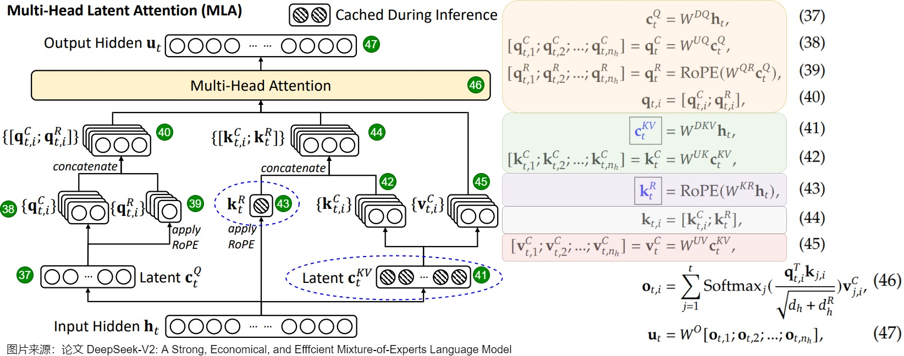

## MLA 机制

这一章主要参考苏剑林老师的科学空间博文：[缓存与效果的极限拉扯：从MHA、MQA、GQA到MLA](https://kexue.fm/archives/10091)。

#### MHA

**M**ulti-**H**ead **A**ttention 指的就是多头注意力，是开山之作 [*Attention is all you need*](https://kexue.fm/archives/4765) 中所提出的一种注意力机制。下面考虑增量模式下的 MHA 计算公式（方便起见，已忽略 $\boldsymbol{q}\boldsymbol{k}^T$ 除以 $\sqrt{d_k}$ 的归一化步骤） 。不妨设输入的行向量序列为 $(\boldsymbol{x}_1,\boldsymbol{x}_2,\dots,\boldsymbol{x}_t),x_i \in \mathbb{R}^{d}$，现在要计算 Attention 层的结果 $\boldsymbol{o}_t$。用 $1 \le s \le h$ 表示某个注意力头。
$$
\begin{equation} \begin{gathered} \boldsymbol{o}_t^{(s)} = Attention\left(\boldsymbol{q}_t^{(s)}, \boldsymbol{k}_{\leq t}^{(s)} ,\boldsymbol{v}_{\leq t}^{(s)}\right)\triangleq\frac{\sum_{i\leq t}\exp\left(\boldsymbol{q}_t^{(s)} \boldsymbol{k}_i^{(s)}{}^{\top}\right)\boldsymbol{v}_i^{(s)}}{\sum_{i\leq t}\exp\left(\boldsymbol{q}_t^{(s)} \boldsymbol{k}_i^{(s)}{}^{\top}\right)} \\[15pt] \boldsymbol{q}_i^{(s)} = \boldsymbol{x}_i\boldsymbol{W}_q^{(s)}\in\mathbb{R}^{d_k},\quad \boldsymbol{W}_q^{(s)}\in\mathbb{R}^{d\times d_k}\\ \boldsymbol{k}_i^{(s)} = \boldsymbol{x}_i\boldsymbol{W}_k^{(s)}\in\mathbb{R}^{d_k},\quad \boldsymbol{W}_k^{(s)}\in\mathbb{R}^{d\times d_k} \\ \boldsymbol{v}_i^{(s)} = \boldsymbol{x}_i\boldsymbol{W}_v^{(s)}\in\mathbb{R}^{d_v},\quad \boldsymbol{W}_v^{(s)}\in\mathbb{R}^{d\times d_v} \end{gathered} \end{equation}
$$
实践上，常见的设置是 $d_k = d_v = d / h$。对于 LLAMA2-7B 有 $d=4096, h=32, d_k = d_v = 128$，LLAMA2-70B则是 $d=8192,h=64, d_k = d_v = 128$。

预测后续所有 token 时，$\boldsymbol{k}_{\leq t}^{(s)} ,\boldsymbol{v}_{\leq t}^{(s)}$ 的值一直保持不变，这部分结果就可以缓存下来供后续生成调用，以避免不必要的重复计算，这就是所谓的 **KV Cache**。当模型参数量变大后，每个 Attention 结构要耗费 $d \times (d_k+d_v) \times h$ 大小的存储空间，因此就推出了 **M**ulti-**Q**uery **A**ttention 和 **G**rouped-**Q**uery **A**ttention 来优化显存。MQA 将 KV Cache 全部重复使用（即 $\boldsymbol{k}_1^{(s)}=\dots=\boldsymbol{k}_t^{(s)},\boldsymbol{v}_1^{(s)}=\dots,=\boldsymbol{v}_t^{(s)}$ ），而 GQA 则将其分组重复使用。

#### MLA 缘起

MLA（**M**ulti-head **L**atent **A**ttention）应用于 DeepSeek V2 和 V3，利用低秩分解和矩阵吸收来减少 MHA 的 KV Cache 占用，同时让效果不逊于 MQA 和 GQA。其核心思想是引入了 $\boldsymbol{W}_c$ 和 $\boldsymbol{c}_i$：
$$
\begin{equation} \begin{gathered} \boldsymbol{c}_i = \boldsymbol{x}_i \boldsymbol{W}_c\in\mathbb{R}^{d_c},\quad \boldsymbol{W}_c\in\mathbb{R}^{d\times d_c} \\[10pt]  \boldsymbol{q}_i^{(s)} = \boldsymbol{x}_i\boldsymbol{W}_q^{(s)}\in\mathbb{R}^{d_k},\quad \boldsymbol{W}_q^{(s)}\in\mathbb{R}^{d\times d_k}\\ \boldsymbol{k}_i^{(s)} = \boldsymbol{c}_i\boldsymbol{W}_k^{(s)}\in\mathbb{R}^{d_k},\quad \boldsymbol{W}_k^{(s)}\in\mathbb{R}^{d_c\times d_k} \\ \boldsymbol{v}_i^{(s)} = \boldsymbol{c}_i\boldsymbol{W}_v^{(s)}\in\mathbb{R}^{d_v},\quad \boldsymbol{W}_v^{(s)}\in\mathbb{R}^{d_c\times d_v} \end{gathered} \end{equation}
$$
上述形式在推理时仍然要缓存彼此不同的 $\boldsymbol{k}_i^{(s)}$ 和 $\boldsymbol{v}_i^{(s)}$。注意到以下恒等变换：
$$
\begin{equation}\boldsymbol{q}_t^{(s)} \boldsymbol{k}_i^{(s)}{}^{\top} = \left(\boldsymbol{x}_t\boldsymbol{W}_q^{(s)}\right) \left(\boldsymbol{c}_i\boldsymbol{W}_k^{(s)}\right){}^{\top} = \boldsymbol{x}_t\left(\boldsymbol{W}_q^{(s)}\boldsymbol{W}_k^{(s)}{}^{\top}\right)\boldsymbol{c}_i^{\top} \end{equation} \\
$$
如果用 $\boldsymbol{W}_{qk}^{(s)}=\boldsymbol{W}_q^{(s)}\boldsymbol{W}_k^{(s)}{}^{\top}$ 替换 $\boldsymbol{W}_q^{(s)}$ ，MHA 里的 $\boldsymbol{k}_i^{(s)}$ 就能视为此处的 $\boldsymbol{c}_i$，这样后者可以在不同注意力头之间共享——我们称这种变换为 **吸收变换**。MHA 的 $\boldsymbol{v}_i^{(s)}$ 同样能做吸收变换视为 $\boldsymbol{c}_i$，因为 $\boldsymbol{o}_t^{(s)}$ 最后会拼起来过一遍投影矩阵 $[\boldsymbol{o}_t^{(1)},\boldsymbol{o}_t^{(2)},\dots,\boldsymbol{o}_t^{(h)}]\boldsymbol{W}_O,\quad \boldsymbol{W}_O \in\mathbb{R}^{d_vh\times d}$，所以 $\boldsymbol{W}_v^{(s)}$ 可以和 $\boldsymbol{W}_O^{(s)}$ 合并。

注意：吸收变换虽然在数学上等价，在低精度运算下误差会增大。

#### 兼容 RoPE

DeepSeek 使用了 RoPE 这种“用绝对坐标包含相对关系”的位置编码。RoPE 是 $d_k \times d_k$ 的分块对角矩阵 $\boldsymbol{\mathcal{R}}_m$，满足 $\boldsymbol{\mathcal{R}}_m\boldsymbol{\mathcal{R}}_n^{\top}=\boldsymbol{\mathcal{R}}_{m-n}$。加上 RoPE 后无法进行吸收减缓，因为两个 $\boldsymbol{W}$ 之间会出现和位置相关的 $\boldsymbol{\mathcal{R}}_{t-i}$ 项：
$$
\begin{equation} \boldsymbol{q}_i^{(s)} = \boldsymbol{x}_i\boldsymbol{W}_q^{(s)}{\boldsymbol{\mathcal{R}}_i}\quad,\quad\boldsymbol{k}_i^{(s)} = \boldsymbol{c}_i\boldsymbol{W}_k^{(s)}{\boldsymbol{\mathcal{R}}_i} \\ \boldsymbol{q}_t^{(s)} \boldsymbol{k}_i^{(s)}{}^{\top} = \left(\boldsymbol{x}_t\boldsymbol{W}_q^{(s)}{\boldsymbol{\mathcal{R}}_t}\right) \left(\boldsymbol{c}_i\boldsymbol{W}_k^{(s)}{\boldsymbol{\mathcal{R}}_i}\right){}^{\top} = \boldsymbol{x}_t\left(\boldsymbol{W}_q^{(s)}{\boldsymbol{\mathcal{R}}_{t-i}} \boldsymbol{W}_k^{(s)}{}^{\top}\right)\boldsymbol{c}_i^{\top} \end{equation}
$$

MLA 的解决方法是将 $\boldsymbol{q}_i$ 和 $\boldsymbol{k}_i$ 的维度从 $d_k$ 扩展到 $d_k+d_r$，其中 $d_r$ 是专为兼容 RoPE 而设计的，即这部分无法进行吸收变换。MLA 对于 $\boldsymbol{q}_i$ 和 $\boldsymbol{k}_i$ 的处理略有不同，前者正常训练 $h$ 个 $\boldsymbol{W}_{qr}^{(s)}$，后者却借用了 MQA 的思想全局共享一个 $\boldsymbol{W}_{kr}$（即 $\boldsymbol{k}_i=\boldsymbol{x}_i\boldsymbol{W}_{kr}{\boldsymbol{\mathcal{R}}_i}$），这样能尽可能降低新引入的 $d_r$ 个维度的 K Cache。

#### 标准 MLA

标准的 MLA 结构（吸收变换前）如下。有两个需要注意的点：

+   计算 $\boldsymbol{q}_i^{(s)}$ 时模仿了 $\boldsymbol{k}_i^{(s)}$ 的方式引入了 $\boldsymbol{c}_i'$ 降维，这一步和减少 KV Cache 无关。猜测是想前向时缓存 $\boldsymbol{c}_i'$。
+   计算 $\boldsymbol{k}_i^{(s)}$ 时两个部分左乘的两个向量不一致，右边仍然保持 $\boldsymbol{x}_i$，可能 RoPE 时想尽可能保持原向量。

$$
\begin{equation} \begin{gathered} \boldsymbol{o}_t = \left[\boldsymbol{o}_t^{(1)}, \boldsymbol{o}_t^{(2)}, \cdots, \boldsymbol{o}_t^{(h)}\right] \\[10pt] \boldsymbol{o}_t^{(s)} = Attention\left(\boldsymbol{q}_t^{(s)}, \boldsymbol{k}_{\leq t}^{(s)} ,\boldsymbol{v}_{\leq t}^{(s)}\right)\triangleq\frac{\sum_{i\leq t}\exp\left(\boldsymbol{q}_t^{(s)} \boldsymbol{k}_i^{(s)}{}^{\top}\right)\boldsymbol{v}_i^{(s)}}{\sum_{i\leq t}\exp\left(\boldsymbol{q}_t^{(s)} \boldsymbol{k}_i^{(s)}{}^{\top}\right)} \\[15pt] \boldsymbol{q}_i^{(s)} = \left[\boldsymbol{c}_i'\boldsymbol{W}_{qc}^{(s)}, \boldsymbol{c}_i'\boldsymbol{W}_{qr}^{(s)}{\boldsymbol{\mathcal{R}}_i}\right]\in\mathbb{R}^{d_k + d_r},\quad \boldsymbol{W}_{qc}^{(s)}\in\mathbb{R}^{d_c'\times d_k},\boldsymbol{W}_{qr}^{(s)}\in\mathbb{R}^{d_c'\times d_r}\\ \boldsymbol{k}_i^{(s)} = \left[\boldsymbol{c}_i\boldsymbol{W}_{kc}^{(s)}, \boldsymbol{x}_i\boldsymbol{W}_{kr}{\boldsymbol{\mathcal{R}}_i}\right]\in\mathbb{R}^{d_k+d_r},\quad \boldsymbol{W}_{kc}^{(s)}\in\mathbb{R}^{d_c\times d_k}, \boldsymbol{W}_{kr}\in\mathbb{R}^{d\times d_r} \\ \boldsymbol{v}_i^{(s)} = \boldsymbol{c}_i\boldsymbol{W}_v^{(s)}\in\mathbb{R}^{d_v},\quad \boldsymbol{W}_v^{(s)}\in\mathbb{R}^{d_c\times d_v} \\[10pt] \boldsymbol{c}_i' = \boldsymbol{x}_i \boldsymbol{W}_c'\in\mathbb{R}^{d_c'},\quad \boldsymbol{W}_c'\in\mathbb{R}^{d\times d_c'} \\ \boldsymbol{c}_i = \boldsymbol{x}_i \boldsymbol{W}_c\in\mathbb{R}^{d_c},\quad \boldsymbol{W}_c\in\mathbb{R}^{d\times d_c} \\ \end{gathered} \end{equation}
$$
经过吸收变换后的 MLA 结构如下：
$$
\begin{equation} \begin{gathered} \boldsymbol{o}_t = \left[\boldsymbol{o}_t^{(1)}\boldsymbol{W}_v^{(1)}, \boldsymbol{o}_t^{(2)}\boldsymbol{W}_v^{(2)}, \cdots, \boldsymbol{o}_t^{(h)}\boldsymbol{W}_v^{(h)}\right] \\[10pt] \boldsymbol{o}_t^{(s)} = Attention\left(\boldsymbol{q}_t^{(s)}, \boldsymbol{k}_{\leq t} ,\boldsymbol{c}_{\leq t}\right)\triangleq\frac{\sum_{i\leq t}\exp\left(\boldsymbol{q}_t^{(s)} \boldsymbol{k}_i{}^{\top}\right)\boldsymbol{c}_i}{\sum_{i\leq t}\exp\left(\boldsymbol{q}_t^{(s)} \boldsymbol{k}_i{}^{\top}\right)} \\[15pt] \boldsymbol{q}_i^{(s)} = \left[\boldsymbol{c}_i'\boldsymbol{W}_{qc}^{(s)}\boldsymbol{W}_{kc}^{(s)}{}^{\top}, \boldsymbol{c}_i'\boldsymbol{W}_{qr}^{(s)}{\boldsymbol{\mathcal{R}}_i}\right]\in\mathbb{R}^{d_c + d_r}\\ \boldsymbol{k}_i = \left[\boldsymbol{c}_i, \boldsymbol{x}_i\boldsymbol{W}_{kr}{\boldsymbol{\mathcal{R}}_i}\right]\in\mathbb{R}^{d_c+d_r}\\ \boldsymbol{W}_{qc}^{(s)}\in\mathbb{R}^{d_c'\times d_k},\boldsymbol{W}_{kc}^{(s)}\in\mathbb{R}^{d_c\times d_k},\boldsymbol{W}_{qr}^{(s)}\in\mathbb{R}^{d_c'\times d_r},\boldsymbol{W}_{kr}\in\mathbb{R}^{d\times d_r} \\[10pt] \boldsymbol{c}_i' = \boldsymbol{x}_i \boldsymbol{W}_c'\in\mathbb{R}^{d_c'},\quad \boldsymbol{W}_c'\in\mathbb{R}^{d\times d_c'} \\ \boldsymbol{c}_i = \boldsymbol{x}_i \boldsymbol{W}_c\in\mathbb{R}^{d_c},\quad \boldsymbol{W}_c\in\mathbb{R}^{d\times d_c} \\ \end{gathered} \end{equation}
$$

在 DeepSeek V3 671B 的配置中，$d=7168,d_c'=1536,d_c=512,d_k=d_v=128,d_r=64$。

## 推理中的 MLA

详细的分析可见 [探秘Transformer系列之（28）--- DeepSeek MLA](https://www.cnblogs.com/rossiXYZ/p/18827618)。

【重点内容待总结】

每一层 MLA 的 Attention 结构用到的权重矩阵整理如下：

| 向量（矩阵用于左乘） |           大小           |         V3/R1 数值          |
| :------------------: | :----------------------: | :-------------------------: |
|      $W^{DKV}$       |      $[d \to d_c]$       |      $[7168 \to 512]$       |
|   $W^{UK},W^{UV}$    | $[d_c \to d_{k(v)}n_h]$  | $[512 \to 128 \times 128]$  |
|       $W^{KR}$       |      $[d \to d_r]$       |       $[7168 \to 64]$       |
|       $W^{DQ}$       |      $[d \to d'_c]$      |      $[7168 \to 1536]$      |
|       $W^{UQ}$       | $[d'_c \to d_{k(v)}n_h]$ | $[1536 \to 128 \times 128]$ |
|       $W^{QR}$       |    $[d'c \to d_rn_h]$    | $[1536 \to 64 \times 128]$  |
|       $W^{O}$        |     $[d_vn_h \to d]$     | $[128 \times 128 \to 7168]$ |




## DeepEP 源码

【待整理】

零基础分析一下 DeepEP 的开源代码。网上找到 [zartbot](https://mp.weixin.qq.com/s/1Cz7oQbVkPMam3eoKQWz0w) 和 [Qzhangyu](https://www.cnblogs.com/CQzhangyu/p/18741625) 的两份资料，仍觉不够详细。

#### 公共函数和变量

| 变量                               | 含义                                                         |
| ---------------------------------- | ------------------------------------------------------------ |
| `threadIdx.x` | 当前线程在线程块中的 x 坐标，范围 $[0, \text{blockDim.x-1}]$ |
| `blockIdx.x`                       | 当前线程块在网格中的 x 坐标，范围 $[0, \text{gridDim.x} - 1]$ |
| `blockDim.x`        | 当前线程块在 x 方向的线程数                                  |
| `gridDim.x` | 当前网格在 x 方向的线程块数 |
| `channel` | 每两个 SM 构成一个 channel，偶数用于发送，奇数用于接收 |

| 前缀用法      | 含义                                               |
| ------------- | -------------------------------------------------- |
| `__device__`  | 定义设备（GPU）级别的共享内存                      |
| `__global__`  | 声明一个 CUDA 的内核函数，由 CPU 调用、GPU 执行    |
| `__managed__` | 定义统一内存，可以同时被 CPU 和 GPU 的所有线程访问 |
| `__shared__`  | 定义线程块级别的共享内存                           |

| 不同的同步机制   | 含义  |
| ------| ------- |
| `__syncwarp()` | 同步当前线程束内的所有线程      |
| `__syncthreads()`| 同步当前线程块内的所有线程 |
| `bar.sync(%1, %2)` |               |
| `value_1 = __shfl_sync(0x????????, value_2, lane_id, width=32)` | 将当前线程束里的线程 `lane_id` 的数值 `value_2` 广播给满足掩码的其他线程 |
| `__any_sync(0xffffffff, true/false)` | 当前线程束里满足掩码的任意线程返回真则结果为真 |

函数或编译器指令：

| 函数名 | 含义  |
| ---- | -------|
| `__launch_bounds__(kNumThreads, 1)` | 指定每个线程块里的线程数，和每个 SM 上驻留的线程块数 |
| `__ldg()` | 从 GPU 的全局内存里读取数据，并用只读缓存加速   |

`warp_reduce_sum` 这个函数用来将同一个线程束里所有线程的值进行求和：

```C++
__forceinline__ __device__ int warp_reduce_sum(int value) {
    value += __shfl_xor_sync(0xffffffff, value, 16);
    value += __shfl_xor_sync(0xffffffff, value, 8);
    value += __shfl_xor_sync(0xffffffff, value, 4);
    value += __shfl_xor_sync(0xffffffff, value, 2);
    value += __shfl_xor_sync(0xffffffff, value, 1);
    return value;
}
```

【TODO】

```C++
CUDA_CHECK(cudaMallocHost(&moe_recv_counter, sizeof(int64_t), cudaHostAllocMapped));
CUDA_CHECK(cudaHostGetDevicePointer(&moe_recv_counter_mapped, const_cast<int*>(moe_recv_counter), 0));
    *moe_recv_counter = -1;
```

#### intranode 代码梳理

变量定义：

+ per_rank_buffer：`[rank][i,j]` 记录了设备 i 要向设备 j 发送的 tokens 数量（每个 rank 都是统一的）。
+ per_expert_buffer：`[rank][i,j]` 记录了设备 rank 要向设备 i 上的专家 j 发送的 token 数量。

91 行 dst_rank 不会缺少或溢出吗？没有做任何处理。

目标（对于每一个 GPU）

+ `Buffer.rank_prefix_matrix[i,j]` 表示编号为 0~i 的 GPU 向编号为 j 的 GPU 要发送的 token 的数量之和，其中 `Buffer.moe_recv_counter_mapped` 记录了到本 GPU 之和。 
+ `Buffer.moe_recv_expert_counter_mapped[j]`：本 GPU 的第 j 个专家总共要接收多少 token（对齐到 expert_alignment 的倍数）。
+ `Buffer.channel_prefix_matrix[i,j]` 表示本 GPU 要往设备 i 发送的 token 中，归属于 channel 0~j 的数量的前缀和。

注意有 `__launch_bounds__` 声明，把每个线程块的线程数固定在了 512，且 SM 和线程块可视为一一对应（下面的 `sm_id=blockIdx.x` 的写法用到了这一性质）。`knumRanks` 是机器内 GPU 数量，可视为 8。

我对 `responsible_rank=thread_id / num_threads_per_rank` 的式子琢磨了好久，疑问是 `thread_id` 明明是线程块里的唯一线程标识，为何看起来像是横跨机器内 8 个 GPU 的线程唯一标识。后来想通了，`thread_id` 的定义没有发生变化，只是说将当前线程块里的线程按照 GPU 数量划分了，每部分负责发送/接收对应 GPU。

```c++
__global__ void __launch_bounds__(kNumThreads=512, 1)
const auto num_sms = static_cast<int>(gridDim.x), sm_id = static_cast<int>(blockIdx.x);
const auto thread_id = static_cast<int>(threadIdx.x);
// Several warps are response for a single rank
const auto num_threads_per_rank = kNumThreads / responsible_rank;
const auto num_channels = num_sms / 2;
const auto responsible_rank = (static_cast<int>(thread_id)) / num_threads_per_rank;
```