在这篇文章里，我系统性地整理了《赛尔号》近几年每周活动中的 **决策类游戏**。其中：

+   主要是精灵对战或走剧情的不收录，例如 光与影的试炼、午夜追魂剧场、探索远坠盆地、一日城主。
+   主要靠键鼠操作的不收录，例如 植树送精灵（兔子跳地球）、星海的研究、密室机关盒。
+   过于老套或几乎不用动脑子的不收录，例如 破解幽契/幻光之门（扫雷）、法莉的烦恼（连连看）。

这些游戏基本都是 **技术+运气** 相结合的 **趣味游戏**，而且只用简单策略并全勤参与往往也能拿满有用的奖励。

+ 每个游戏的标题源于官方命名，底下还标有具体的更新时间，可以在 B 站搜索标题来获取更详细信息。
+   游戏总体上按月日的时间顺序排序。考虑到小游戏会复刻，多次出现时会取平均数或中位数参与排序。
+   每个游戏都有图片展示，一般至少会有界面/规则+得分展示两张图。规则图大多是去 B 站搜的，如有水印保留了水印，侵删；分数图基本是靠自己打的，我有把自己的周活动高分结果保存下来的习惯。

## 吉斯的能源网络

**更新时间**：2024-1-3 千年赫尔卡之谜-传承-吉斯的能源网络

**游戏规则介绍**：每局游戏开始时己方和对方有若干张正/负/无电子的能量卡。双方每轮打出一张，如果双方互为正负或都为无电子则玩家获胜。要求在十轮能获得尽量多的轮数胜利。

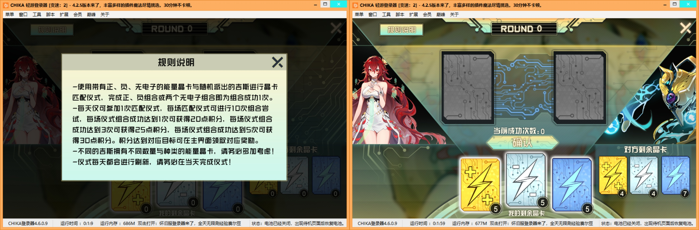

**个人攻略和感想**：主要靠赌，不过结合双方实时剩卡情况能做出期望更高的操作。

## 神秘俱乐部

**更新时间**：2023-1-19 神秘俱乐部 / 2024-2-16 神秘俱乐部。

**游戏规则介绍**：有三种牌，分别为太阳牌、月亮牌和星星牌。

一共有四个人玩游戏。每个人都有唯一的身份，对应关系未知。当他们同时看到一张牌时：

+   真言者：如实回答当前的牌型。
+   欺骗者：回答一个和当前牌型不同的牌型。
+   混沌者：随机回答一种牌型。
+   月/阳/星之谎者：当看到指定牌时行为同欺骗者，否则行为同真言者。

每一轮桌上会亮出一张牌，四个人会根据规则分别回答自己眼中的牌型，你需要确定真实牌型。

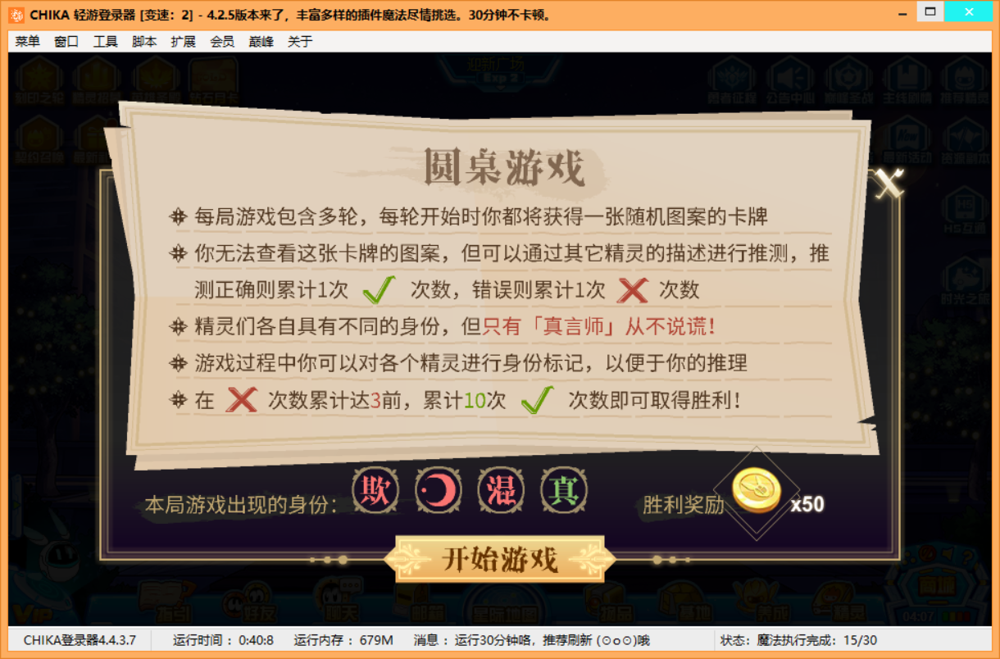

**个人攻略和感想**：一般两到三轮试错就能确定所有人的身份。

下面两张图是取自一轮带月之谎者的真实游戏。

+   对于第一轮，我们首先推理出一定不是星星牌（否则场上至少两张星星）。如果是月亮牌，则 1 号位是真言师；如果是太阳牌，则 1 号位和 4 号位是欺骗者/混沌者，2 号位和 3 号位是 真言者/月之谎者。
+   第二轮也是类似的推理。如果是月亮牌，则 1 号位和 2 号位是真言者/混沌者，3 号位和 4 号位是欺骗者/月之谎者；如果是星星牌，则 1 号位和 2 号位是欺骗者/混沌者，3 号位和 4 号位是真言者/月之谎者。

经过两轮的推理后其实并不能完全确定每个人的身份，右下图给出了一种可能的人物分布。

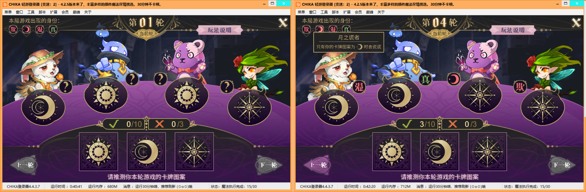

## 喝汤时间

**更新时间**：2023-1-19 喝汤时间

**游戏规则介绍**：总共持续 $9$ 天，每天有一个猜谜主题：给出一段简短的汤面，可以通过支付一定代价来提出某个问题并获得三种答案中的一种（是/否/没有关系），要求猜出汤底。下面以《破碎的玻璃》主题为例：

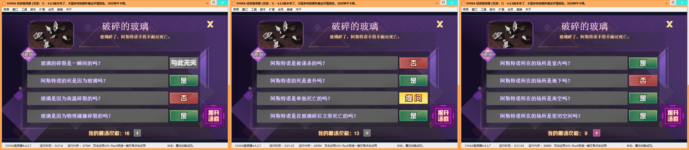

**个人攻略和感想**：这个游戏其实就是情境猜谜（Situation puzzle），俗称海龟汤。一般的玩法是猜题者和出题者互动，当然赛尔号中受限于 PVE 模式，策划只能给出一些预设的场景问题供询问。B 站摸鱼的橙汁列出了赛尔号提供的九个汤面和汤底，来源：https://t.bilibili.com/752889208629100660。

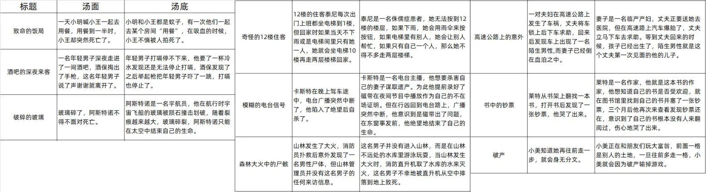

## 气团对决

**更新时间**：2025-1-24 千年赫尔卡之谜-探索闭锁空间-气团对决

**游戏背景介绍**：整个游戏叫做探索闭锁空间，分为 $40$ 层，每层分为精灵挑战、野生精灵（可捕捉）、气团对决和剧情四种。本层挑战结束后提供 $2 \sim 3$ 个前往下一层的岔路。号替代。这里摘录的是气团对决层的游戏细节。

**游戏规则介绍**：每局游戏开始时，挑战者有 $3$ 个固定技能，场地拥有者有 $1 \sim 4$ 个技能。每一回合：挑战者要从五个竖列中选择一个垂直扔下一个**蓝色气团**（若某列已满则无法选择），扔下前可选择最多一个 PP 不为 0 的技能触发，使用后 PP 减 1；场地拥有者同样从五个竖列中选择一个垂直扔下一个**橙色气团**，并随机触发自身的技能。每当某个局面下五个同色气团新形成了完整的一行、一列或一个对角线，则颜色所属方获得一点气链分数。注意通过技能在同位置重新形成五个同色气团可重复计分。当 $5 \times 5$ 的格子全部填满后游戏立即结束，气链分数高者获胜。玩家的三个固定技能各自拥有三种形态，初始时皆为初级形态且初始 PP 为 2。每当玩家获胜后，可能会触发某个初始 PP 为 2 的技能的升级（升级后初始 PP 从 2 降为 1），或将某个初始 PP 为 1 的技能增加到 2。

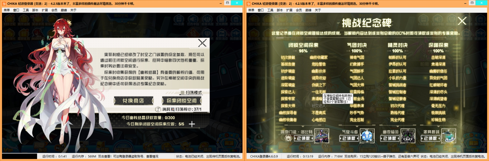

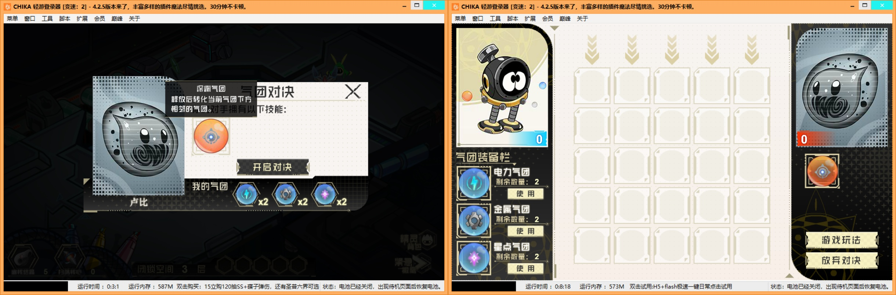

|   气团名    | 所属对象 | 效果                                                    |
| :---------: | :------: | ------------------------------------------------------- |
|  电力气团   |   玩家   | 释放前摧毁该列最上方的气团                              |
|  雷光气团   |   玩家   | 释放前摧毁所有列最上方的敌方气团                        |
|  雷神气团   |   玩家   | 释放前摧毁该列所有的气团和所有列最上方的地方气团        |
|  金属气团   |   玩家   | 无法被转化                                              |
|  铁壁气团   |   玩家   | 无法被转化，释放后将相邻的右方气团转化为友方金属气团    |
|  钛钢气团   |   玩家   | 无法被转化，释放后将相邻的气团全部转化为友方金属气团    |
|  星点气团   |   玩家   | 释放后随机转化对手的 1 个气团                           |
|  彗星气团   |   玩家   | 释放后随机转化对手的 2 个气团                           |
| 流星雨气团  |   玩家   | 释放后随机转化对手的 3 个气团并获得 1 个气链得分        |
|  深渊气团   |   对手   | 释放后转化当前气团下方相邻的气团                        |
|  恐惧气团   |   对手   | 释放后转化当前气团所有相邻的气团                        |
|  双子气团   |   对手   | 释放后在随机列再释放一个友方气团                        |
|  先发制人   |   对手   | 第一个形成的气链可以获得 2 点气链得分                   |
|  气团凝聚   |   对手   | 形成气链后会恢复挑战者随机 1 个特殊气团的使用次数 1 次  |
| 不公平对决1 |   对手   | 场地拥有者初始拥有 2 个普通气团和 1 点气链得分          |
| 不公平对决2 |   对手   | 场地拥有者形成的气链每个获得 2 分                       |
| 不公平对决3 |   对手   | 场地拥有者形成的气链扣除挑战者所有特殊气团使用次数 1 次 |
| 不公平对决4 |   对手   | 场地拥有者每回合都会使用特殊气团                        |
| 俄罗斯方块  |   对手   | 每个横向形成的气链会获得 2 点气链得分                   |
|  压缩空间   |   对手   | 对决开始时，对决最下方一行将充满无色气团                |

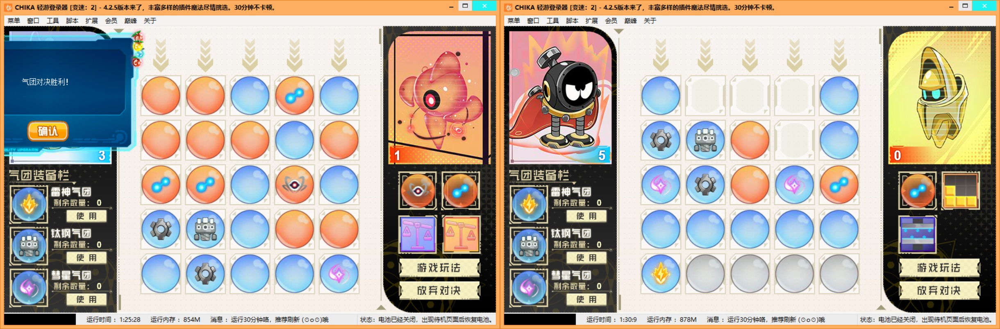

**个人攻略和感想**：《气团对决》的基本机制清晰流畅，每局游戏敌方的技能又带来随机性，要利用己方的固定技能去随机应变。《探索密闭空间》类似于一个可重复挑战的副本，《气团对决》的难度完全取决于当前副本的层数而不是挑战者进度，所以前中期攒技能发育时高层的《气团对决》非常难，后期技能升满后就完全平推了。

+ $30^+$ 层的吉古是最难的，因为会刷出最难的场地 buff 不公平对决 4，每回合稳定触发恐惧气团或双子气团的其中一个，橙色气团叠加得非常快。前期玩家技能弱难打，得找机会偷一两波分后死守。
+ 金属气团和铁壁气团很鸡肋，特别铁壁气团刚升级后只有 1PP，敌方如果没有深渊/恐惧气团则完全白板。钛钢气团的强度略有提高，因为他可以将周围的敌方/中立气团转化为我方气团。

+ 电力气团二阶段的雷光气团强度不错，有个定式是：前几手可以和对手互补地放第一行，当某列被敌方压住后在该列释放雷光气团，此时几乎能清除所有敌方气团，大概率在最后一行抢到一分。三阶段的雷神气团更是十分独特的存在，其会把所选列的友方/中立气团也全部清空，很容易触发某几行的重复计分。
+ 星点/彗星/流星雨气团是我最喜欢的技能，化敌为友效率很高，开局可以稳定偷到最后一行的分数。
+ 气团凝聚是唯一一个完全对挑战者有利的场地 buff，效果是每当获得气链得分后会优先补充 PP 未满的技能。一般等星点气团升级到二阶或三阶的高转化效率时，结合气团凝聚 buff 可以在每回合稳定白嫖一次，甚至把全场都刷成自己的颜色（左下角）。雷神气团结合气团凝聚可以做到无限刷分（右下角重复在第一列放）。

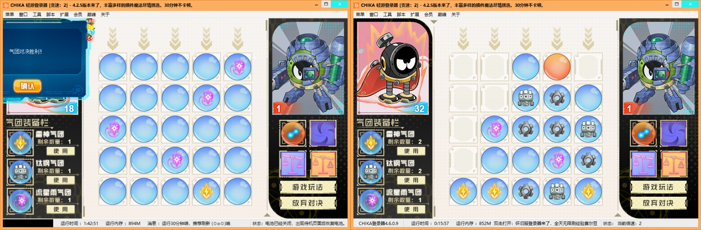

## 烟花试验田/河岸边的种植园/烟花播种小能手

**更新时间**：2022-1-28 烟花试验田 / 2023-7-7 河岸边的种植园 / 2024-5-10 烟花播种小能手

**游戏规则介绍**：游戏分成四个关卡。每一个关卡初始时给出一块空地，有 $4$ 种正常蔬菜和参与捣乱的绿棘球，玩家需要模拟 $20$ 轮（一个季节 $5$ 轮）的种植过程。每轮会随机给出两种种植模式，玩家必须选择其中一种种植上去（若无空地可种会扣 $5$ 分），这被称为 **事件**。游戏结束时根据四种结算规则计算总得分：

+   每个季节/每个关卡结束时根据当前种植情况检查某种要求是否达成来奖励，被称为 **季节结算** 和 **土地结算**。
+   游戏结束时统计洒水器周围的植物数量作为奖励，被称为 **科技结算** 。
+   游戏结束时统计绿棘球周围的空地数量作为惩罚，被称为 **绿棘结算**。绿棘球在某些轮会随机撒在空地上。

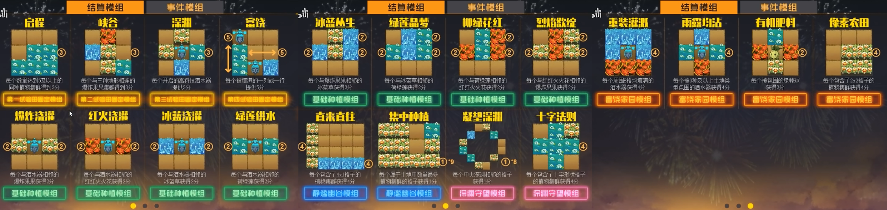

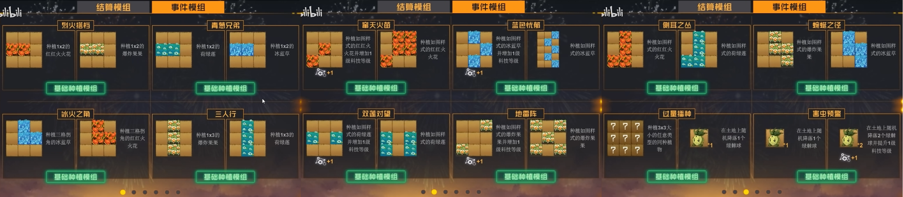

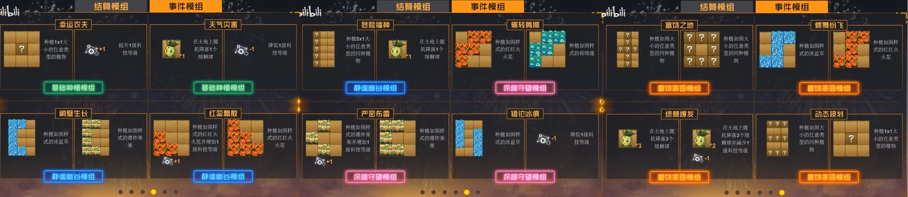

**个人攻略和感想**：技术为主运气为辅。我根本没有心思去研究所有的事件模组和结算模组，直接硬着头皮去种。主要的宗旨是花式填满空地来完成尽量多的种植要求（最多跳过一两轮），否则分数会很难看。我会有意识地留一些较大的方块，为冬季过分的要求做准备。然后就是要尽量贴进季节结算和土地结算的要求。

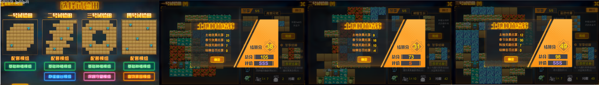

2023 年 7 月 7 日的《河岸边的种植园》是复刻活动，规则一模一样，不过配色好看了很多。

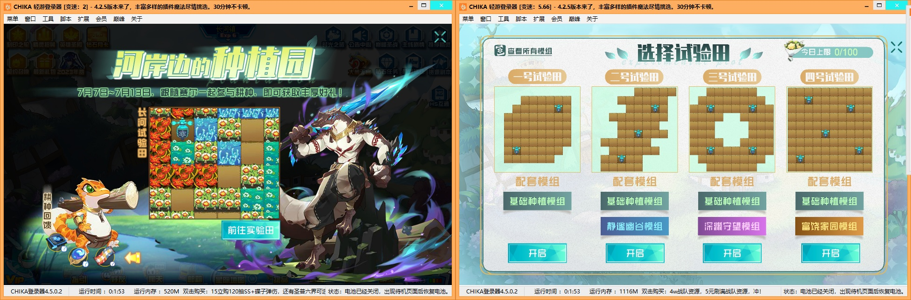

2024 年 5 月 10 日完全复刻了上一个版本，只是修改了标题和相关精灵。

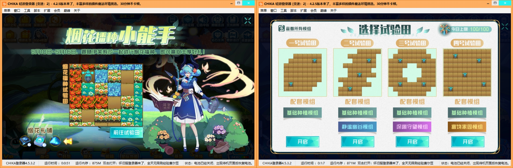

## 荒丘阻击战/冰原遭遇战

**更新时间**：2021-1-15 荒丘阻击战 / 2023-2-24 冰原遭遇战

**游戏规则介绍**：每局游戏分成四个阶段，每个阶段点位排布固定，资源（金钱、科技点、木材、矿产、战略卡和战力点数）分布随机。每个阶段 NPC 和玩家轮流行动，双方各有六个机甲，每轮可用一个机甲占据一个空的据点。每当玩家新占据一个格点后，能获得与格点有交的所有资源各一份。战略卡是一种特殊的资源，每获得一份则会随机获得一张卡，战略卡往往会消耗其他资源，且有不同的效果。每个阶段结束后枚举每一个区域，根据双方对于它周围据点占据情况的多少来发放战力点。四个阶段结束后根据敌我的战力点多少决定身份。

21 年的游戏界面和活动规则可见 [橙汁的分享](https://t.bilibili.com/480156903950680849)，战略卡总结如下（23 年做了微小的命名改动）：

| 战略卡            | 效果                                                 | 消耗资源               |
| ----------------- | ---------------------------------------------------- | ---------------------- |
| 强制驱逐          | 强制驱逐一个据点上的敌方机甲（归还敌方次数）         | 3 矿产 2 木材          |
| 机甲回收-紧急召集 | 回收我方一个据点上的机甲                             | 2 矿产 2 木材 1 金钱   |
| 战术开采          | 选择一个资源区域进行开采，获得两份资源               | 无                     |
| 全境封锁          | 选择一个区域，对手的下一轮无法占据这个区域周围的据点 | 2 矿产 2 木材          |
| 孤注一掷          | 驱逐所有在据点上的地方天使（归还敌方次数）           | 10 战力                |
| 天使扼杀-大雨滂沱 | 若敌方有未部署的机甲，摧毁一个                       | 2 木材 1 金钱 2 科技点 |
| 紧急支援          | 在本阶段未我方增加一个临时机甲                       | 1 矿产 2 金钱 2 科技点 |
| 临时研究          | 获得等同于我方占领的据点数量的战力点                 | 3 金钱 1 科技点        |

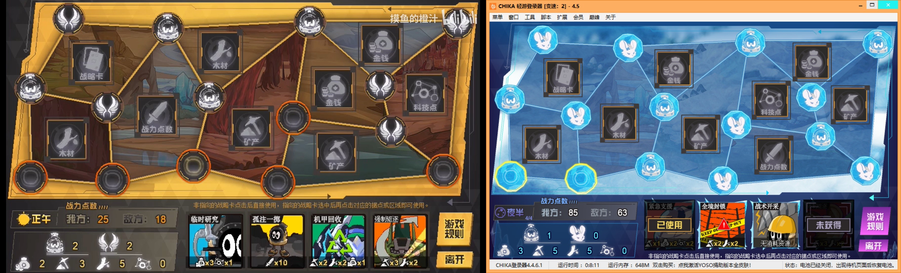

**个人攻略和感想**：橙汁在 21 年有一个 [操作演示](https://www.bilibili.com/video/av971237992/)，刀锋下的阴影在 [21 年](https://www.bilibili.com/video/av886153763) 和 [23 年](https://www.bilibili.com/video/BV1VY411e7MV) 各有一个讲解。这个游戏比较考验动态场景下的决策。开局我喜欢占第一行第三个点，然后和 NPC 斗智斗勇。已经无胜算的区域应该果断放弃，否则我适时选择能拿到胜点的据点或是能阻止对面拿到胜点的据点。战略卡方面，我觉得机甲回收和强制驱逐几乎没啥用，战术开采和临时研究不耗资源无脑用，紧急支援和天使扼杀能带来机甲差很好用。

## 主厨的秘方

**更新时间**：2024-2-8 主厨的秘方

**游戏规则介绍**：整局游戏分为选材阶段、烹饪阶段和自动的结算阶段。选材阶段提供四个并行的食材箱，总共有 $12$ 步选材操作；每个食材箱正好有 $12$ 个食材，某步挑选某个食材箱里的某个食材后，其他三个食材箱均随机减少 $1$ 个食材。烹饪阶段需要把已选的 $12$ 个食材分成热菜和冷碟两部分，每个锅最多只能放 $9$ 个食材。每个食材在热菜和冷碟中会有不同的得分效果，烹饪阶段结束后会根据规则生成最终的得分，以此结算道具。

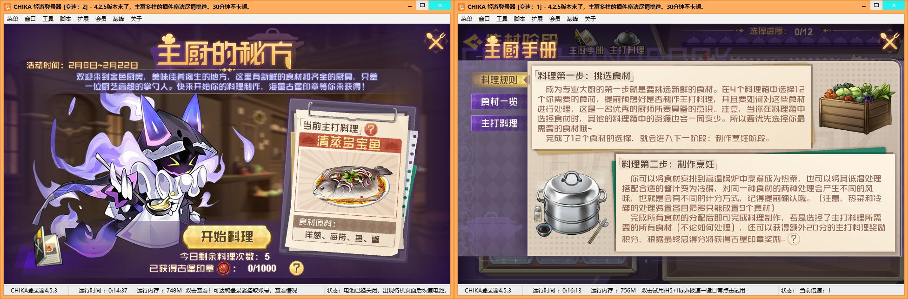

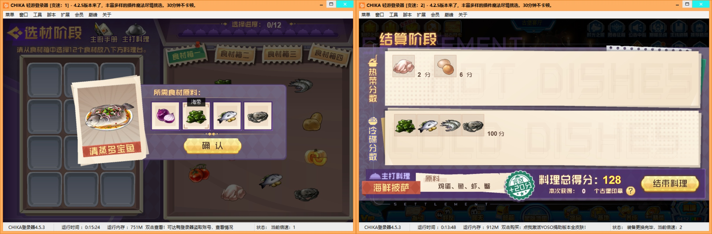

每局游戏会随机一个主打料理：若该料理所需的四种食材都至少选了一份（无论如何分配），额外加 $20$ 分。有一个细节：若某局游戏未完成主打料理，则下一局游戏主打料理不变。

总共有 $12$ 种食材，每种食材在热菜和冷碟中的加分效果不同，出现频率也不同。主要的得分规则分为两种，我简称为 **固定收益**（每个食材收益相同）和 **增速收益**（放入的同种食材越多，每个食材的平均得分越高）。

+ 鸡肉和鸡蛋数量最多，在热菜和冷碟中的效果正好相反：一侧是 $3$ 分固定收益，一侧是增速收益。
+ 番茄和土豆数量一般：热菜中增速收益，平均 $5,2.5,5,8.75$ 和 $1,1,8.3,8.75$；冷碟中 $4$ 分的固定收益。
+ 牛肉数量较少：热菜中增速收益（平均达到了很夸张的 $0,1,10$），冷碟中 $5$ 分的固定收益。
+ 海带、鱼、虾和螃蟹在冷碟中的效果完全一致：若冷碟的 $9$ 个食材均用它们凑满，则可获得 $100$ 分的高分。热菜中它们的效果彼此不同：螃蟹数量少每只稳定 $5$ 分；虾增速收益但数量偏少，平均 $3,3.5,7$；海带是变种的增速收益，平均 $5,7.5,8.3$，严格优于螃蟹和虾；鱼数量最多，增速收益，平均 $1,3,5.3,6.5,8$。
+ 蘑菇和南瓜数量很少，热菜和冷碟中效果相同且每个锅最多触发一次：蘑菇要求锅里至少包含三种其他食材，满足则计 $10$ 分否则计 $0$ 分；南瓜会让锅内的得分 $\times 1.3$（如果锅内分数是正数）。
+ 洋葱数量较少，唯一可能带来负收益的食材：热菜平均 $-5,7.5,-1.7,6.25$，冷碟中 $-5$ 分的固定收益。

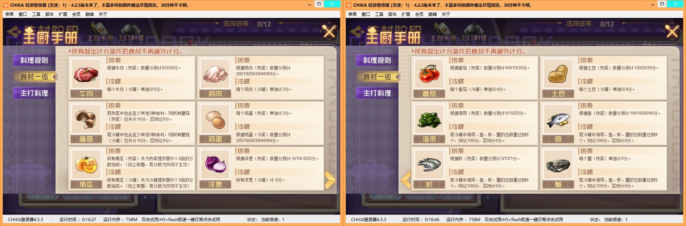

**个人攻略和感想**：我最爱的游戏之一，玩到分数溢出还意犹未尽。蘑菇和南瓜数量很少但收益很高，我前期有机会就各自拿一个。注意两者都不用拿超过一个：蘑菇上下都凑满三种其他食材不容易，而且增速食材会降低多样性；南瓜用于分高的锅，另一侧分少收益不高。

+ 洋葱数量少且风险高。如果主打料理包含且刷出的数量较多我就拿两个当热菜，否则不喜欢拿。
+ 主打料理的 $20$ 分任务对于冲高分来说挺重要的，我一般围绕主打料理的食材作为发力点。当然主打料理之间亦有差距，比如番茄意面的南瓜洋葱或者蘑菇烩饭的蘑菇洋葱，可能开局就凑不满了。
+ 鸡蛋和鸡肉数量很多，即使出现在主打料理中，后期往往也能拿到。他们的固定收益不高，所以我要不就是中期因为某种数量多开始叠增速收益，要不就是后期凑满发力点后没啥可选开始捡保底收益。
+ 我比较喜欢拿牛肉和土豆。它们冷碟里保底不差；热锅里前者 $3$ 个就拉满冲分容易，后者数量多凑齐四五个不难。其他食材各有缺点：番茄需要叠三四个均分才高，本身数量又不多，我一般中期拿一个混 $5$ 分；海带热菜收益高但数量比土豆少，而且冷碟无保底；鱼和虾在热锅里比较鸡肋（前者数量多但增速也慢，凑满很累；后者数量不多但凑要三个分才过得去），冷碟也无保底；螃蟹数量少无增速，有时中后期混一个热菜。

下面展示一些主打料理下的冷热搭配和结算分数面板：

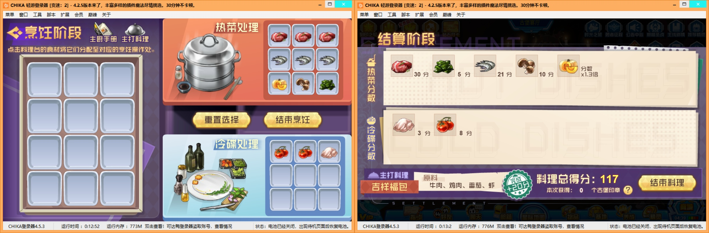

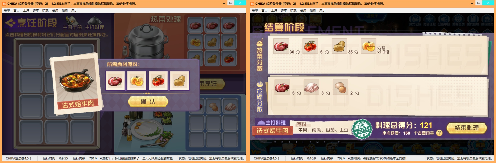

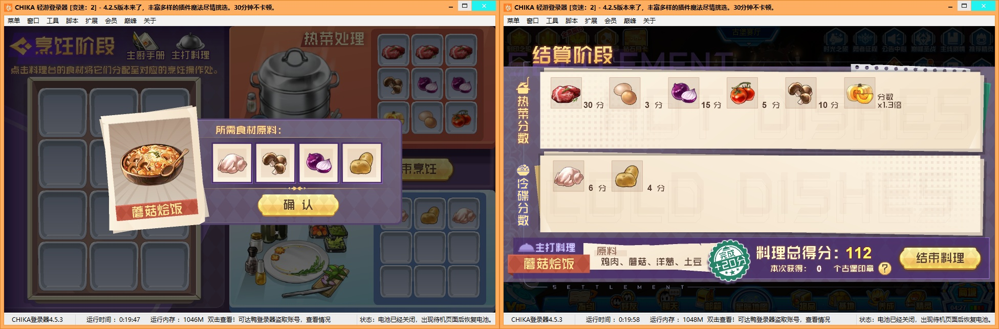

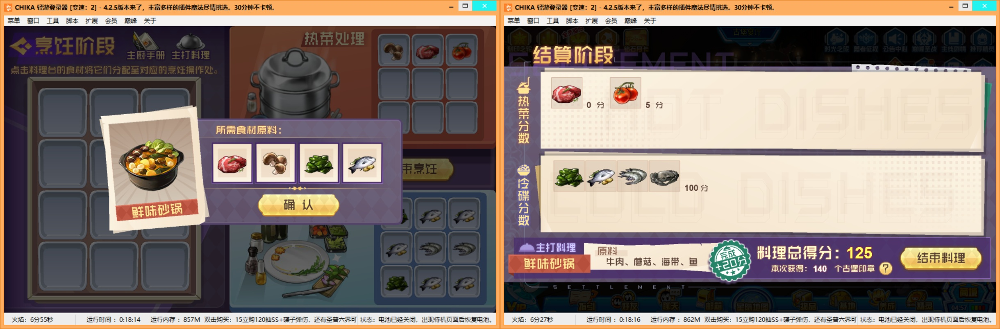

## 露琪的礼物对决

**更新时间**：2022-2-8 露琪的礼物对决

**游戏规则介绍**：有马尔修斯、东辉、莫伊莱、天后弗丽嘉和辛五个人物，分别对应 $3$ 张圣女果、$3$ 张猎魔、$2$ 张蓝蝴蝶标本、$3$ 张迷梦口红、$4$ 张荒之灰烬五种礼物。每局游戏都是我方和露琪（电脑 AI）双人对决。游戏总共分为四个阶段。双方初始时随机获得三张牌，每个阶段开始时从剩下的牌堆中随机获得一张牌。总共有四种操作，每个阶段必须选择一种没有使用过的操作打出（四个阶段结束后牌正好打完）：

+ 密函：选择一张礼物卡秘密送给对应的人物（本局游戏进行结算时才展示）。
+ 宴请：选择一张礼物卡公开送给对应的人物（立即展示）。
+ 整备：选择两张礼物卡丢弃。
+ 取舍：选择三张礼物卡向对方展示。对方先挑选一张送给对应人物，己方把剩下两张送给对应人物。

四个阶段结束后结算分数，每个人物会青睐礼物送他/她更多的玩家。我方的总体目标是获得尽可能多的青睐数。

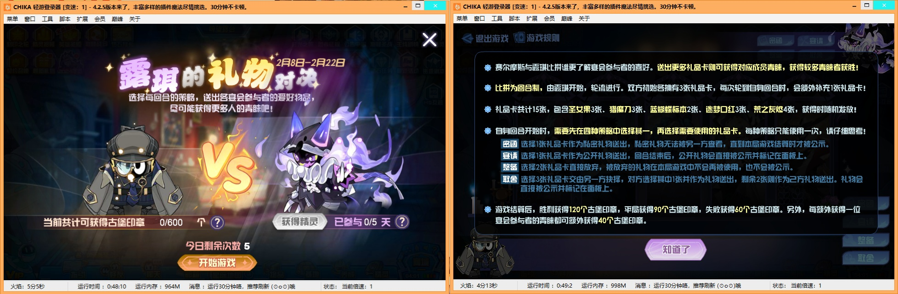

**个人攻略和感想**：这个游戏操作流程简单但颇有思维含量。分析基本性质如下：

+ 每个阶段有 $0 \sim 4$ 张牌，且任何阶段都有足够的牌使用任一剩余操作，直到结束时打光。
+ 双方总共消耗 $(3+4) \times 2=14$ 张牌，牌堆总共有 $15$ 张牌，所以有一张会永远丢弃。
+ 我方和露琪送出的总礼物相同（各 $7$ 张），所以人物青睐数的差值不太可能 $\ge 2$。

我总体采用田忌赛马的思路，让青睐数达成 $3-2$ 的状态，最大化我方分数：$120+40 \times 3=240$。

+ 蓝蝴蝶总共只有 $2$ 张，很容易达成青睐，我一般发动密函或宴请拿一张蓝蝴蝶。
+ 整备就是要扔掉我方和露琪差距过大的礼物牌，中后期看情况合适就发动。
+ 我方的取舍最好控制在露琪无论选择哪张，我放剩下的两张都能发挥较大作用。

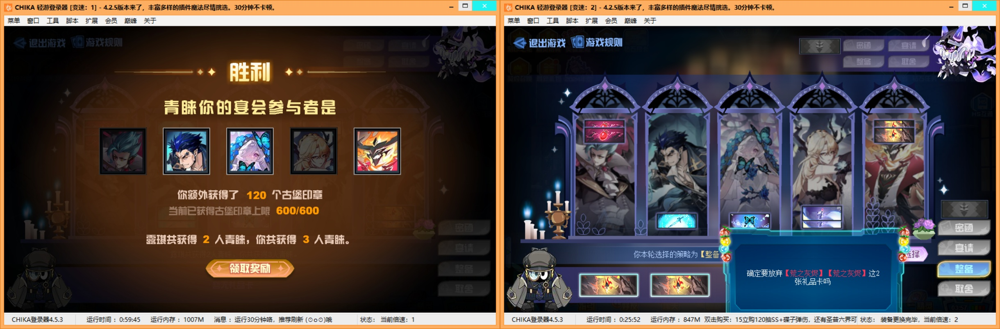

## 生态模拟系统挑战/天气预报

**更新时间**：2022-1-21 生态模拟系统挑战 / 2023-3-24 天气预报 / 2024-3-22 罗萨村的嬉戏-天气预报

**游戏规则介绍**：维护 $6$ 块土地，温度和湿度两个维度的作用下会催生出不同的地形。游戏总共模拟 $24$ 轮，每轮代表一个节气，该节气会使某些土地的温度和湿度发生对应的变化，具体的生效方案可供选择。整个游戏会随机一个目标，如“温泉地形存在不少于 2个”。模拟过程中若目标达成则游戏成功，$24$ 轮模拟完还未达标则游戏失败。22 年和 23/24 年的规则和界面完全一致，只是把“生态模拟系统”字样替换成了“天气预报”字样。

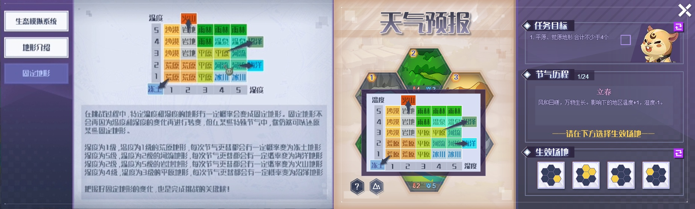

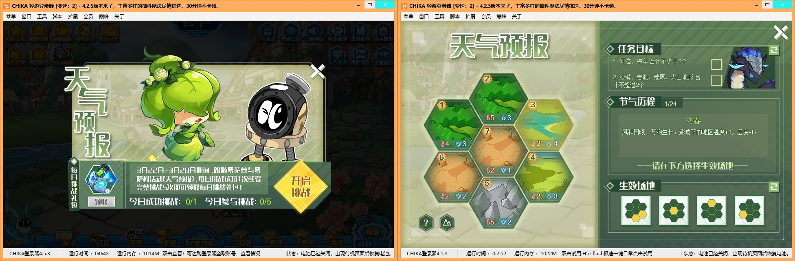

**个人攻略和感想**：这个游戏我没怎么玩明白，生效场地每次都是凭感觉选的= =。

## 风来踏雾/忙碌的码头

**更新时间**：2022-3-18 风来踏雾 / 2023-9-8 忙碌的码头

**游戏规则介绍**：从一条路的左侧出发不回头地向右走，到终点后能再不回头地向左走一趟。每一个格子上都有 $3$ 个商店，分别花 $3,2,1$ 金币能购买指定的物资组合，购买后会立即刷新物资。某个商店多次刷新后会变成“迷雾”，无法继续购买。背包总共有 $9$ 格子（最多放 $9$ 个物资组合）。同一时刻有 $3$ 份备选订单，完成某份订单后会获得对应的分数并刷新这份订单，订单要求的物资数量越多分数就越多。游戏一共有 $20$ 个回合，每回合最多能操作 $4$ 次，每次可以做 $4$ 种事：获得一单位金币；购买一份物资组合；前进一步；提交一份订单。要求回合结束后的金币尽量多。一共有三个初始人物可供选择，每种人物都有额外的 buff：风之子岚（每次移动到新区域都能获得 2 金币），琉彩（每次购买精品区都能获得 $1$ 的分数），塔威尔（每完成一个任务后都能获得一份物资）。

**个人攻略和感想**：风之子岚最中规中矩，能获得保底的 $2 \times 6=12$ 个金币。塔威尔的可操作性很强，但是很容易超物资上限，多出来的商品很容易打乱原本的订单计划。琉彩相当于是锦上添花。我发现次数容易吃紧（最多只能操作 $20 \times 4=80$ 次），所以常常会沿路直接把商店掏空，从而节省下回程的步数——当然这需要有强大的体力控制的能力。订单的话优先刷容易达成的；初期的大订单可能会卡你好久，建议咬咬牙先做掉。

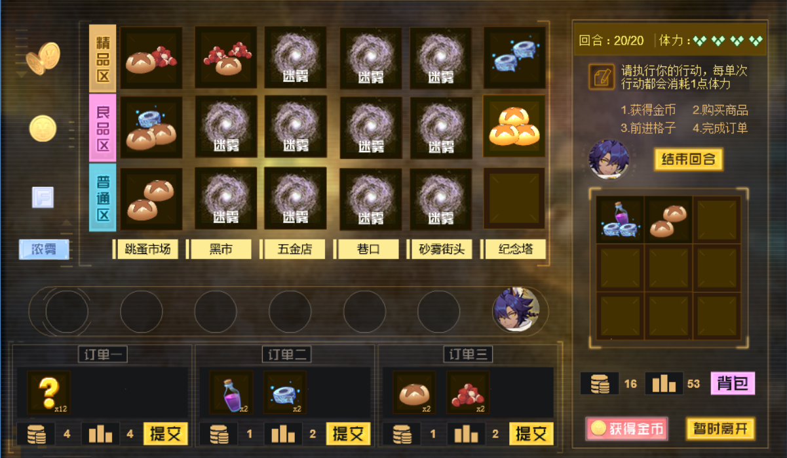

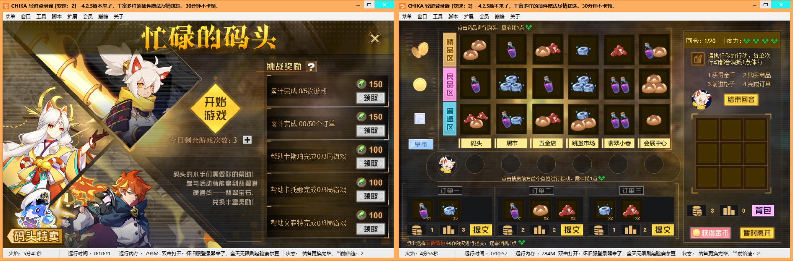

## 遗迹修复/制作巧克力/温暖巧克力

**更新时间**：2022-3-25 遗迹修复 / 2023-2-10 制作巧克力 / 2024-2-2 温暖巧克力 / 2025-2-14 温暖巧克力

**游戏规则介绍**：有 $3$ 种物资（石头，木头，砖块），每种分为 $1,2,3,4$ 四个等级，正好对应 $3 \times 4$ 种卡牌。每种等级的物资都对应一个库存（界面右侧），初始为都 $0$。有一个大小为 $9$ 的卡槽（界面下方），初始时会给出等级为 $1$ 的每种物资各一张。每一轮，玩家可以选择一批等级相同的卡片“使用”，规则如下：

+   使用后卡牌消失，转化成库存里真正的物资数量（一张卡牌正好能增加对应物资的一点数量）；
+   若使用卡牌的等级为 $x$，还会补充 $x$ 张随机卡牌（若超过卡槽上限则无法使用）。
+   当卡槽中某种物资存在多等级的卡牌时，只能使用最高等级的卡牌。

游戏有一些固定的任务（界面上方），每当库存物资数量达到任务的物资量时可以提交该任务，获得对应的分数并扣除相应库存。保证先从高等级的物资扣起。当无法使用卡牌时游戏结束，使结束后的分数最大。

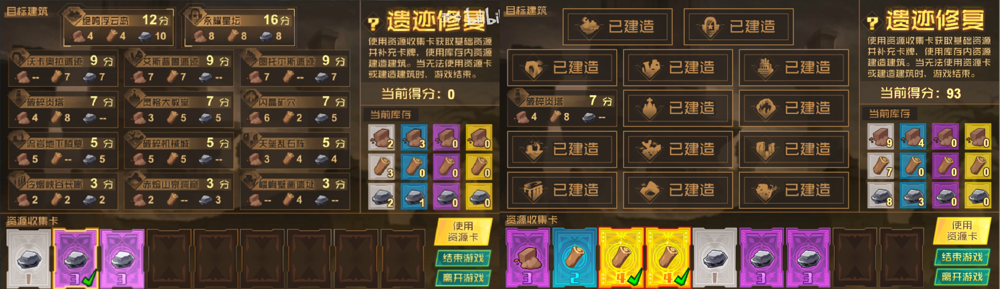

2023 年情人节周，该游戏换皮成“制作巧克力”版，对比后发现游戏规则一致，连任务配置也完全相同。

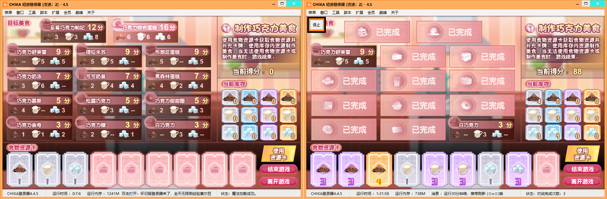

2024 年和 2025 年继续复刻该游戏，仅更换外层标题，素材未更新。

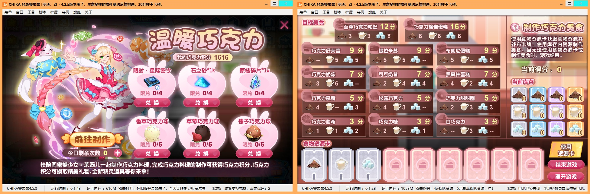

**个人攻略和感想**：最喜欢的一个游戏。看上去随机性很大，实际上策略占了绝对主导地位。最理想情况是卡槽里全是等级为 $1$，每次使用一张就能加一个对应库存并新增一张，相当于永动机。高等级的卡片会让局面特别被动——它会阻止你使用同种物资的低等级卡片，且容易卡满卡槽。我的主要策略如下：

+   优先使用等级低的卡牌。比如我会一直用等级为 $1$ 的卡牌直到卡槽里所有等级都 $\ge 2$。
+   高等级的卡牌尽量全合在一起使用以减少新卡牌的生成，除非此时卡槽特别空。
+   卡槽中的卡牌数量保持在较低的水平，最多别超过 $6$，确保能正常用掉一次等级为 $4$ 的卡牌。
+   优先完成所需物资数量多、种类丰富的任务。

## 百变皮皮

**更新时间**：2025-2-28 百变皮皮

**游戏规则介绍**：要填充一个 $4 \times 4$ 的网格，每轮从随机的两个组合里选择一个填上去。每个组合由一种皮皮（共计 $4$ 种）和一个数字（范围 $1 \sim 4$）构成。当某一行或某一列填完且满足了该位置的条件则获得 $10$ 点分数，条件包括数字之和 $=10$、数字各不相同、数字全部相同、种类各不相同等。

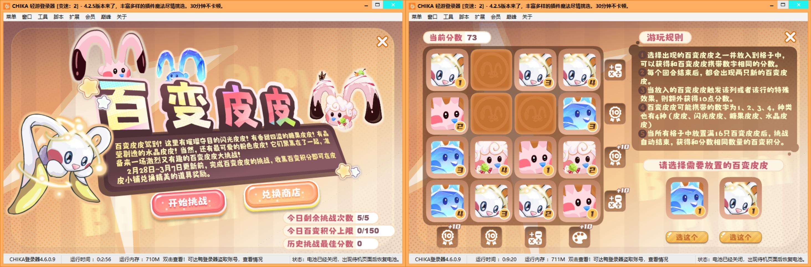

**个人攻略和感想**：搞了个下限比较高的无脑策略。注意到每行每列都按 $1 \sim 4$ 排列都满足大部分的任务，于是我在网上搜了一个 $4 \times 4$ 的幻方，对着它上面的数字放。两个组合里优先选择出现次数最少的数字。

## 绽放智慧之花

**更新时间**：2025-3-7 绽放智慧之花

**游戏规则介绍**：错过了这个游戏，下次一定要补起。

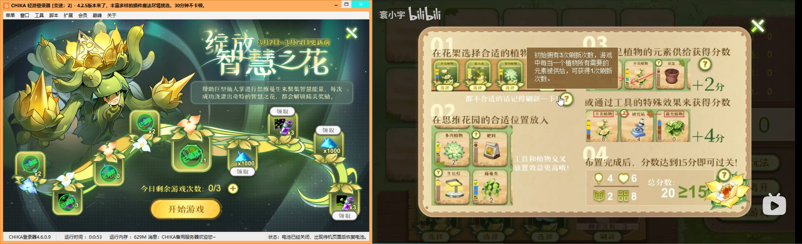

## 开采山谷通道/砂雾城的地下世界/开采纳格晶体

**更新时间**：2023-3-17 开采山谷通道 / 2024-3-15 重返盖伦-砂雾城的地下世界 / 2025-3-14 开采纳格晶体

**游戏规则介绍**：给出一个网格图，每个格子上有 $1,2,3,4$ 四个数字。从固定的起点开始沿着四连通的区域行走，走到某个特定的终点时结束，每个格子只能走一次。如果沿途经过的格子和某一条任务的数字序列一致则获得一定的开采值，并刷新这两条任务。通过打 boss 可以积累开采点数，增加或减少一个格子的一点数值需要花费 $2$ 点，交换两个相邻格子的数值需要花费 $3$ 点，重组地图需要花费 $3$ 点。

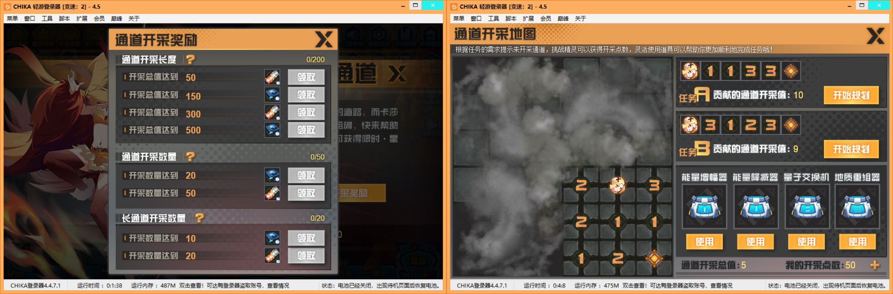

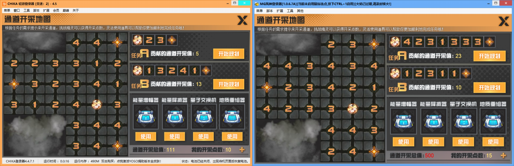

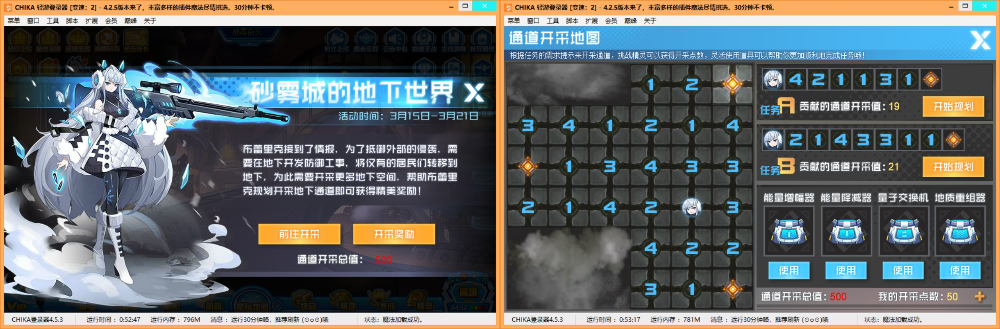

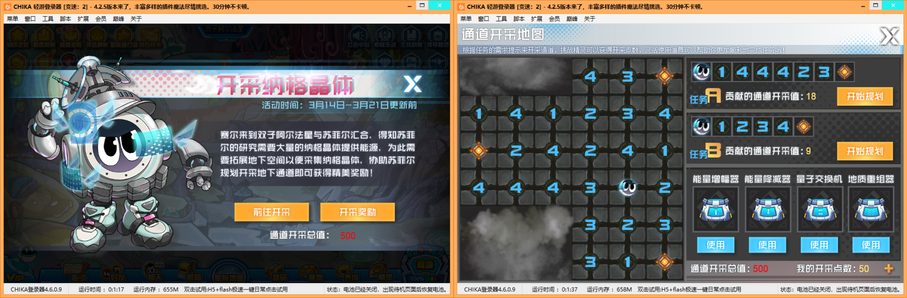

**个人攻略和感想**：首先根据奇偶性，任务和终点能化成两类，每类只能内部匹配。之后就是一个人脑启发式+搜索的问题了，用最少的开采点数把路径修复成和任务序列一样的形式。以左图为例，任务 B 可通过交换两次达成；以右图为例，任务 A 的 4-2-3-1-3-3-3 的最优行走为下-右-上-上-左-上-上-右，通过一次交换和一次增幅达成。

## 时钟领域的试炼/烛火下的危险/晶灵之渊的试炼

**更新时间**：2021-7-9 时钟领域的试炼 / 2023-3-17 烛火下的危险 / 2024-3-15 重返盖伦-晶灵之渊的试炼

**游戏规则介绍**：有三个不同主题的小游戏，每个主题会声明两个关键属性。队列里按顺序给出若干只带等级的精灵，如果该精灵带有关键属性（比如下图是次元、光或光次元）则会有特殊的标记。有三层空间，初始为空，每次需要把当前精灵移动到某一层的末尾。如果某一层已有精灵，则新插入的精灵的等级不能低于它。如果某一层的精灵凑齐和光和次元两种属性，则可以免费清空整一层，否则需要战斗胜利才能清空。队列清空时游戏结束。

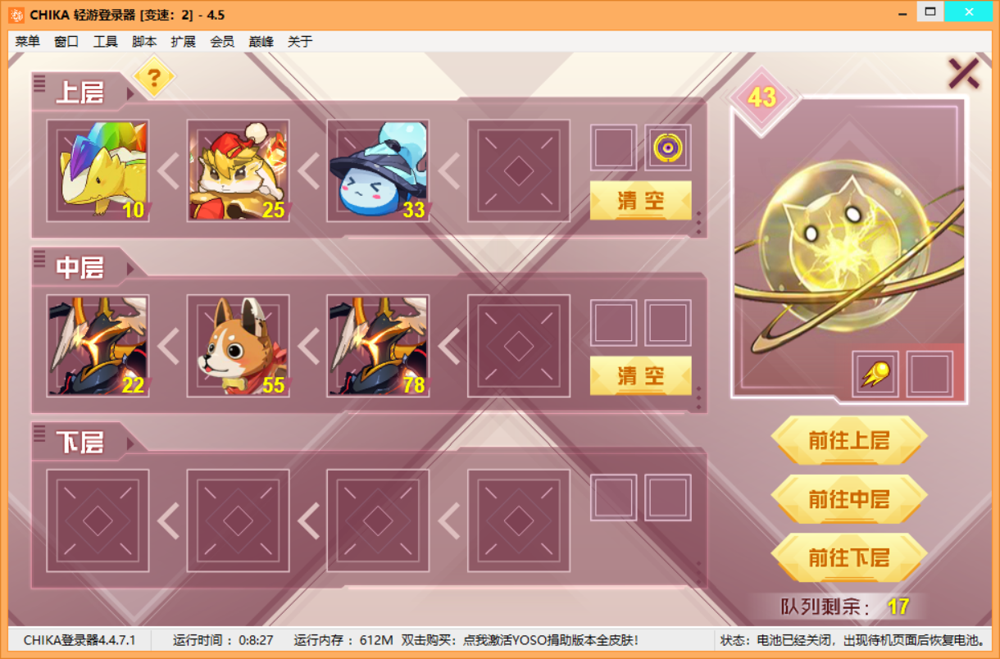

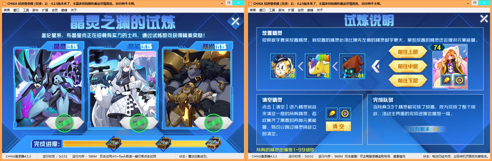

**个人攻略和感想**：无脑使用 Best-Fit 来贪心。“下一只未知”让游戏的盲目性提高不少，否则还可以操作下。

## 梦幻的温泉之路

**更新时间**：2025-3-21梦幻的温泉之路

**游戏规则介绍**：游戏分为若干轮，敌方队伍的数量单调递增。我方一共有三个精灵，每轮可以按一定顺序使用（每个精灵的技能最多使用一次），使用完毕后若我方数量高于敌方数量则挑战成功并进行下一轮，否则挑战失败。挑战成功后可以在 精灵升级 或 我方队伍数量提升固定值 两个奖励里二选一。

| 精灵   | 技能效果                                                     |
| ------ | ------------------------------------------------------------ |
| 柯蓝   | 若敌方数量可以被 3 整除，令其除以 $3$。                      |
| 柯蓝+  | 若敌方数量可以被 3 整除，令其除以 $3$。连续判定两次。        |
| 柯蓝++ | 若敌方数量可以被 3 整除，令其除以 $3$，否则令其减 $1$。连续判定三次。 |
| 福迪   | 干扰驱散敌方，驱散数量为敌方所有位数上的数字之和。           |
| 福迪+  | 干扰驱散敌方，驱散数量为我方和敌方所有位数上的数字之和。     |
| 福迪++ | 干扰驱散敌方，驱散数量为我方和敌方所有位数上的数字之和。驱散的数量会加到我方。 |
| 希拉   | 互换敌方数量的十位数和个位数。                               |
| 希拉+  | 将敌方数量的十位数和个位数均置为其中较小的数。               |
| 希拉++ | 将敌方数量的百位数、十位数和个位数重新按照升序排序。         |

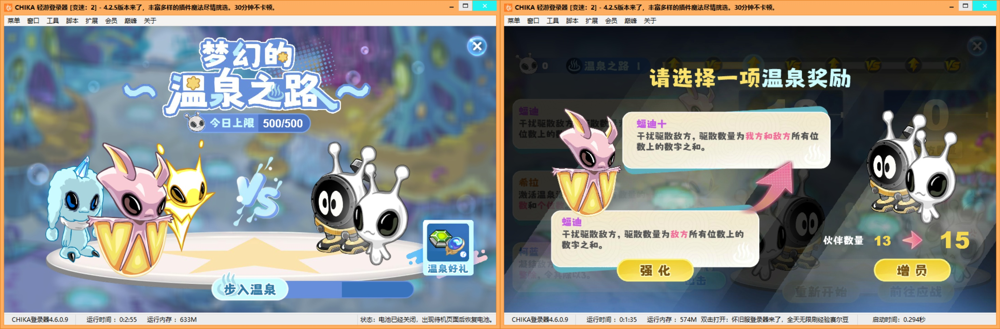

**个人攻略和感想**：技能使用一定不劣于不使用，所以每轮游戏一定是按顺序用完所有技能，即可以枚举这 $3!=6$ 种可能。不过游戏的关卡设置多，随机到的敌方队伍的具体数值很看运气，随机成分的占比比较大。我比较喜欢柯蓝的指数下降，经常用其他两个精灵辅助其调整到 $3$ 的倍数；希拉升级到最高级后对部分数字也有奇效。

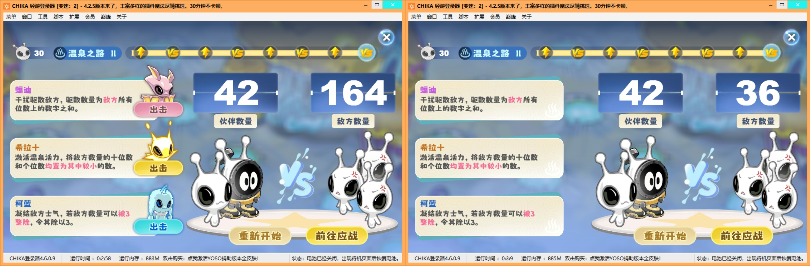

## 执冥的修炼

**更新时间**：2025-3-28 执冥的修炼

**游戏规则介绍**：游戏分为 $10$ 轮。玩家一共有三个属性值（敏捷/力量/指挥），每轮总共选择三个修炼计划：

+ 将某个基础属性提升 $10$ 点；
+ $1 \sim 5$ 轮和 $6 \sim 10$ 轮各有一次机会选择一个特殊的修炼机会，能将某个属性值未来的提升效益增加 $10\%$。

统计游戏过程和游戏结束后的三维属性值，可能会触发不同的成就。

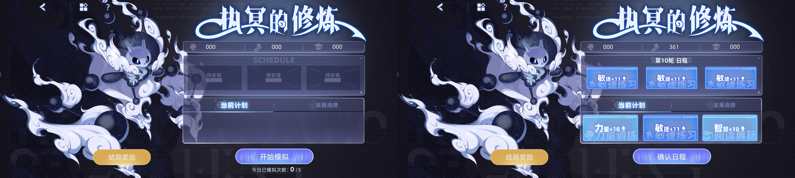

**个人攻略和感想**：这个游戏设计得很失败，毫无策略性且重复操作很多（有很多对称的成就）。

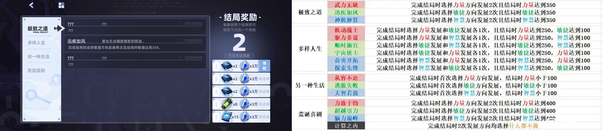

## 踏青时节

**更新时间**：2022-4-1 踏青时节 / 2023-3-31 踏青时节 / 2024-4-3 我们的踏青时节

**游戏规则介绍**：一共有 $15$ 轮活动，每个活动会有持续天数和人数两个要求。你可以选择接受任务并把对应的长条放入计划表（会增加角色的心情值和精神值），或者放弃任务。结束后根据角色的心情值和精神值获得收益。

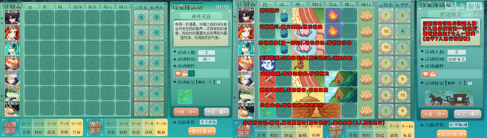

**个人攻略和感想**：每个角色会有不同的喜好，所以事先得查攻略确认一下。总体的放置原则类似于装箱问题里的 Best Fit，即优先填入空隙较小的位置，为后期可能到来的大长方形提供足够的空间。

## 风筝追光大赛

**更新时间**：2021-4-2 风筝追光大赛 / 2022-4-1 风筝追光大赛 / 2023-3-31 风筝追光大赛 / 2024-4-3 风筝追光大赛

**游戏规则介绍**：玩家和三名电脑 PK。整个游戏分为若干轮，每轮会从地面开始向上放风筝并持续若干回合。每回合可选择放线（继续本轮游戏）或收线（获得稳定收益并停止本轮游戏）。决策前会提示空中剩余光球数量，所有放线的玩家能平分这些光球。风筝高度越高，则“断线”的风险越大，如果选择放线并断线则最终收益为 $0$。

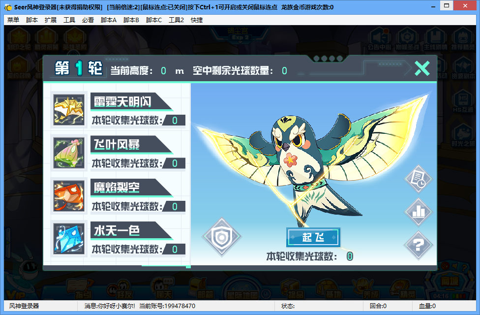

**个人攻略和感想**：这个游戏相对比较简单，无非就是一个风险和收益的权衡问题。一般空中剩余光球比较多时我更倾向于博一博。注意我们的最大化目标是“若干轮后的总积分”，因此最优策略会随着当前得分情况发生变化。

## 纳多雷的复苏之旅

**更新时间**：2025-4-3 纳多雷的复苏之旅

**游戏规则介绍**：没有研究清楚。大致是每轮随机出一些资源转化规则，选择适当转化路线以达到目标。

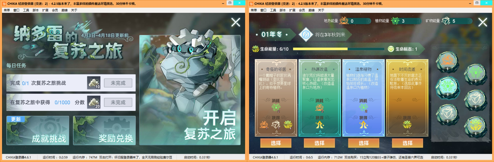

**个人攻略和感想**：没有研究清楚，瞎点点。后续出了祝福和灾厄模式，网上有一些高难度的 [实录1](https://www.bilibili.com/video/BV1J9oNYhEK4)、[实录2](https://www.bilibili.com/video/BV1QhddYsEZY)。

## 重建枫曳镇/建设枫曳镇

**更新时间**：2021-4-9 重建枫曳镇 / 2022-4-8 重建枫曳镇 / 2023-4-7 重建枫曳镇 / 2023-4-5 建设枫曳镇

**游戏规则介绍**：$4 \times 4$ 的空地，底下会随机出两个材料，使用其中一个后另一个会重新随机。材料共分为四种：玻璃、砖块、枫曳和石头。特定材料组成特定形状（方向必须一致，不能旋转）后可升级成一个特定的房型，升级位置可选在材料覆盖的格子中的任意一格。每一种房型会触发一定的计分规则，当空地被填满时游戏结束。

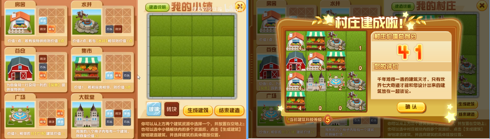

**个人攻略和感想**：优先拼房舍和谷仓，一般的 pattern 是谷仓在 $(2,1)$ 然后周围盖房子，房舍边上再慢慢堆集市。卡材料的话可以考虑在右下角的空地堆广场、教堂或水井。很难一路顺风顺水，经常面对卡材料的窘境。

## 耕种庆典

**更新时间**：2021-4-9 耕种庆典 / 2022-4-8 耕种庆典 / 2023-4-7 耕种庆典 / 2024-4-5 耕种庆典

**游戏规则介绍**：初始金币 $2000$。一共有 $9$ 种蔬菜，分为批发市场和农贸大卖场两个场地。前者每次会刷新 $5$ 种蔬菜可以购买，其中 $3$ 种单买，还有 $2$ 种需要捆绑卖（价格会打一个小折扣）；后者每次会刷新 $4$ 种蔬菜，可卖出有库存的蔬菜。蔬菜的卖出价格一般略高于买入价格。每过若干回合会刷新一个场地 buff，会导致买入或卖出的价格有一些浮动（如菜虫过境导致价格下跌，保健风潮使价格上涨）。游戏持续总共持续 $15$ 回合，每一次场地转换或刷新买入/卖出的蔬菜列表都需要消耗一个回合，要求回合结束时的金币尽量多（烂在手上的蔬菜无效）。

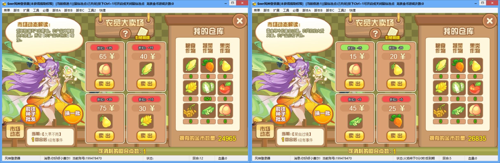

**个人攻略和感想**：第一年的策略比较稳重：转场需要消耗回合，在批发市场优先选捆绑和折扣低的买，每次买入的总价占总资产的 $1/2$ 或 $1/3$；基本花光钱时再去卖场卖菜，卖也尽量追求卖光——收盘金币稳定但不高。第二年在逛贴吧时学到了一个神级操作：每次 all in 一种蔬菜买入/卖出，迅速切换场地，每种场地最多刷新一次。再细腻地预判一下场地 buff，每几回合就能打到一次 $20000+$。第三年场地都懒得判，无脑 all in all out。

## 杰特洛的营救计划/智取暗影盗贼

**更新时间**：2022-4-15 杰特洛的营救计划 / 2023-9-15 智取暗影盗贼

**游戏规则介绍**：在一个含有障碍物的网格里去捕捉一只精灵（重合算捉住），每回合能上下左右移动一步，精灵在每回合也可能随机移动一步。精灵默认不可见，战斗胜利后可兑换呼叶叶之风来查看当前精灵的位置。此外还有两种道具：1. 冻结装置：固定在某一个格子上，精灵进入后会直接被捉住，最多放 $2$ 个；2. 电网屏障：固定在某一个格子上，使用后精灵无法进入或跨过这个格子，最多放 $5$ 个。

**个人攻略和感想**：难度不高，但如何利用道具最快速度抓住它是个学问。

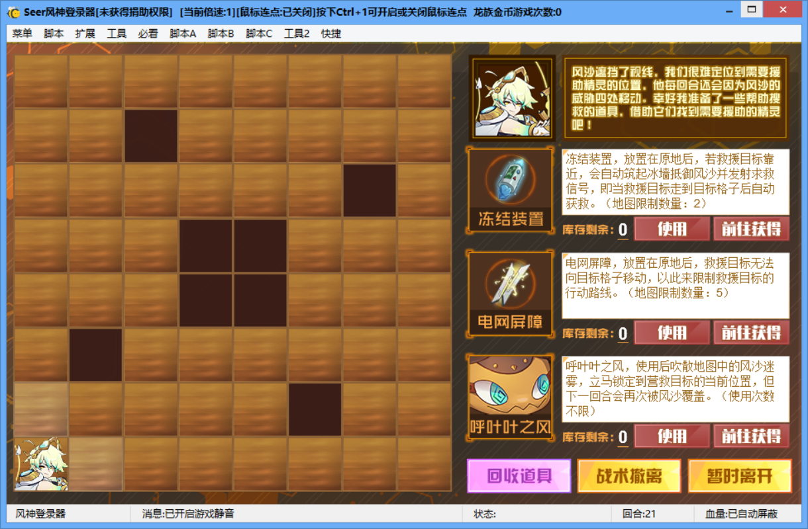

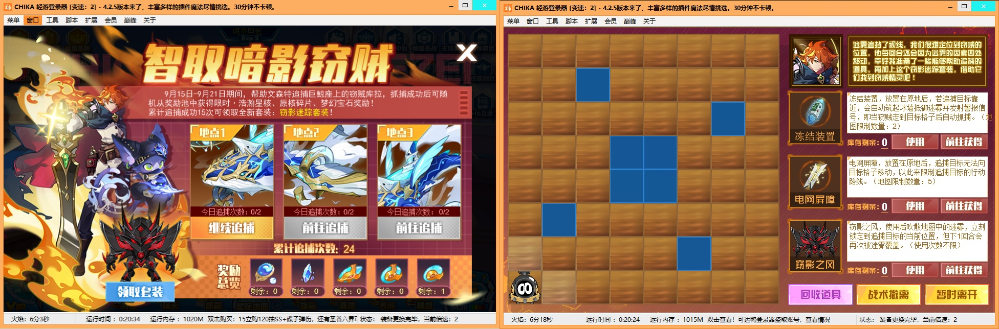

## 花园战争/救援！暴走的特罗斯！/生机勃勃的花园/生机盎然的皮洛斯星

**更新时间**：2021-4-30 花园战争 / 2022-8-5 救援！暴走的特罗斯！/ 2023-4-14 生机勃勃的花园 / 2024-5-17 生机勃勃的花园 / 2025-3-7 生机盎然的皮洛斯星

**游戏规则介绍**：可以在空格子上建造据点并选择点数。每回合会投掷一个 1-4 的骰子，所有点数和骰子相同的据点能获得与其相邻的所有资源。建造据点、升级据点都会消耗资源。最终要求合成出足够多的卫兵/肥料。

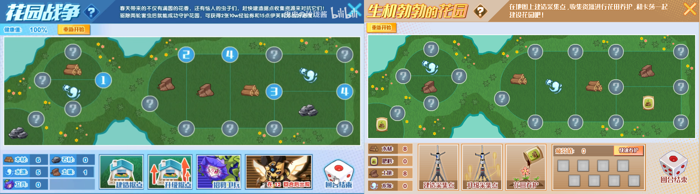

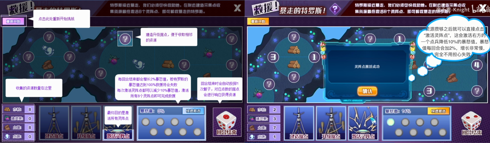

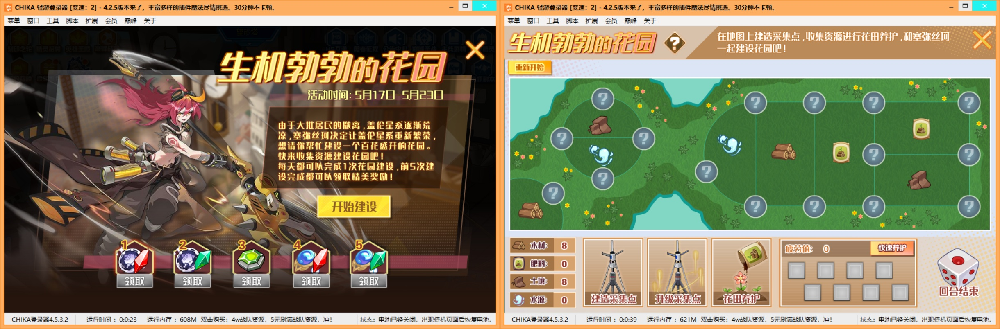

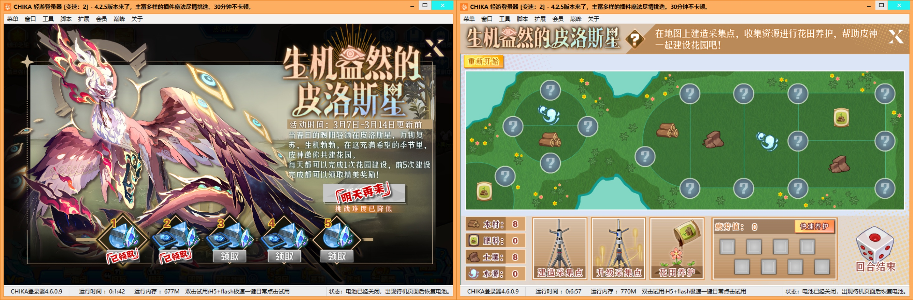

**个人攻略和感想**：看似复杂，其实官方把难度调得很低。前期尽量把点数设置均匀，能升级就升级，后期随便达到要求。对于 2022-8-5 的版本，推荐 B 站上 夜千重-Knight 的 [视频讲解](https://www.bilibili.com/video/BV1gS4y147WY)。

## 逆转防线

**更新时间**：2025-4-25 逆转防线

**游戏规则介绍**：闯关游戏，每一层都有固定的几个精灵驻守。每次击败一层后可获得资金，以此招募新精灵（总数有限）或给已有精灵进行强化。可招募的精灵属性是火系、水系、草系、飞行系、电系、地面系、机械系和冰系，战斗中要关注属性克制的关系。每层开始前可以排列自己的出战精灵，若最后一个位置留空则由肯扎特上。

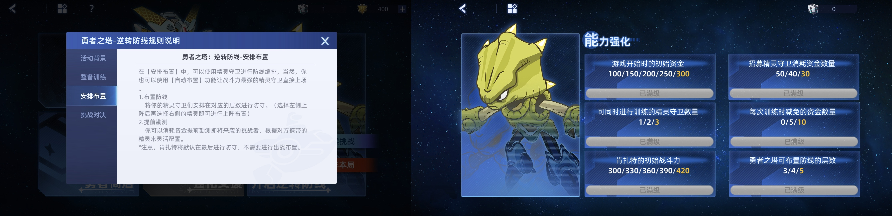

所有可招募的精灵罗列如下（数字表示其初始强度）：

|  属性  |                   招募精灵和初始战力                   |
| :----: | :----------------------------------------------------: |
|  火系  |  236 贝尔鲁斯，244 迪尔克，246 魔焰猩猩，248 洛吉拉斯  |
|  水系  |    248 巴拉龟，249 巴鲁斯，250 水晶鸭，260 布鲁克克    |
|  草系  | 224 魔花仙子，243 依卡莱恩，245 巨型仙人掌，250 布布花 |
| 飞行系 |           215 哈尔浮，223 波克尔，232 巴洛卡           |
|  电系  |   229 西萨琉拉，232 电击兔，240 天雷鼠，255 卡尔加斯   |
| 地面系 |   231 塔奇拉顿，235 格鲁奇高，237 丁鲁特，238 鲁加斯   |
| 机械系 |  253 雷吉欧斯，253 雷吉姆斯，253 派鲁基达，250 卡尔特  |
|  冰系  |                231 急冻兽，239 布林克斯                |

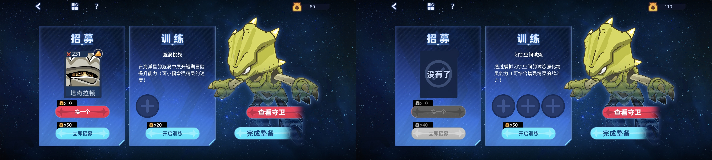

有韧性、速度、攻击三个属性，分别影响精灵生命值、出手先后和造成的伤害值。每一层击败敌方可获得赏金，花钱可招募精灵或对 $1 \sim 3$ 个已有精灵进行训练（数量由天赋树决定），训练内容和训练效果如下：

| 训练内容              | 训练效果                 |
| --------------------- | ------------------------ |
| 闭锁空间试炼          | 综合增强精灵的战斗力     |
| 数据重构              | 固定增强精灵的韧性       |
| 数据跃迁              | 固定增强精灵的速度       |
| 数据过载              | 固定增强精灵的攻击       |
| 双子阿尔法星-密林挑战 | 小幅增强精灵的韧性       |
| 双子阿尔法星-密林生存 | 大幅增强精灵的韧性       |
| 海洋星-旋涡挑战       | 小幅增强精灵的速度       |
| 海洋星-旋涡逆流       | 大幅增强精灵的速度       |
| 火山星-熔岩挑战       | 小幅增强精灵的攻击       |
| 火山星-熔岩淬炼       | 大幅增强精灵的攻击       |
| 赫尔卡星-机械迷城     | 小幅增强精灵的韧性和速度 |
| 克洛斯星-地心探索     | 小幅增强精灵的速度和攻击 |
| 塞西利亚星-冰雪历险   | 小幅增强精灵的韧性和攻击 |

高层的对手各自穿着赛尔号的代表性能力套装，按顺序列举：重生之翼，典狱官，元神，御风，皇帝，典狱长，耀世，银翼，零度，浴火，时空，笑傲，腐蚀，毒液，黄鱼，胜天，天光，影翼，晨曦，漆黑。

体验非常差。训练，选取和排序。重复性。

**个人攻略和感想**：这是个看起来策略性不大，玩起来却很上头的游戏。我注意到游戏规则里提到，”对同一个精灵进行重复训练的效果会变差“，就探索出一种平衡发展+属性克制+每回合探测的思路，即每种属性各培养 $2 \sim 3$ 只精灵，其中一只是主精灵（非主精灵只用于属性能克制敌方的场景），每回合根据敌方阵容来布置我方阵容。这样非常有操作感但打得非常慢，到二十五六层的时候往往会翻车。后续我找到一份 [贴吧攻略](https://tieba.baidu.com/p/9670082465)，上面提到 $27$ 层之前根本不需要去排兵布阵动脑子，而且最初就要向着第 $27$ 层去规划。我按照类似的思路，尝试只培养火草水三个精灵或者火草水水四个精灵（不招募其他精灵只训练他们），果然 $<27$ 层闭着眼睛都能过。有个不合理的点是，中后期不管选择用什么方式训练，都只增加被训练精灵 $3$ 点综合强度，如此说来最好都是 roll 到便宜的小幅训练。可惜的是我始终没能完成对第 $27$ 层突破，见到传说中的 $28$ 层漆黑套防通过关——压轴的魔焰猩猩太猛了。

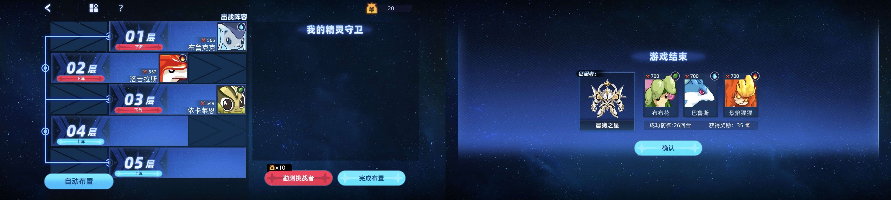

如果想尽快获得道具来升级天赋树，每局游戏可无脑冲至第 $2$ 层击败波克尔后退出，系统就会给一个道具。

可能由于淘米官方对 Unity 的经验不足，这个游戏被广为诟病操作体验很差，包括训练时选择和退选精灵都有确认框非常麻烦，布阵的时候更换或排序精灵很不丝滑。此外这个游戏重开性很低，当做日常玩多了很无聊。

## 围攻

**更新时间**：2024-4-26 天下棋局·围攻

**游戏规则介绍**：每局游戏要往大小为 $32$ 的六边形棋盘中填棋子，棋子点数为 $1 \sim 5$。每一轮从两颗棋子中选一颗填上去，同时能预知下一轮的某一颗棋子的点数。当填入一颗棋子后，如果包含其的某个三角形成了 $a+b=c$ 的局面，则获得对应点数的兵种各一支。如果同时形成多个三角形，奖励分别计算。某个特殊的奖励格可以使获得的兵种数量翻倍。当五个兵种凑齐若干个后，会立即消掉构成相同数量的“军队”。设 $n_1,n_2,n_3,n_4,n_5$ 游戏过程中获得的总兵种数量，则结束后的军队数量为 $m=\min(n_1,n_2,n_3,n_4,n_5)$。总分计算式为：
$$
s=25m+(n_1-m)+2(n_2-m)+3(n_3-m)+4(n_4-m)+5(n_5-m)+50b_1+50b_2+50b_3+50b_4
$$
其中 $b_1,b_2,b_3,b_4 \in \{0,1\}$ 表示游戏结束时四个奖励模块是否达成。奖励模块细节如下：

| 模块名   | 达成条件                            |
| -------- | ----------------------------------- |
| 五连之势 | 连续 $5$ 次部署都激活三角算式效果   |
| 核心三角 | 单次部署同时触发三个算式效果        |
| 军队支柱 | 游戏过程中军队数量达到 $5$ 个       |
| 独门部队 | 游戏过程中某种数字的兵种达到 $7$ 个 |

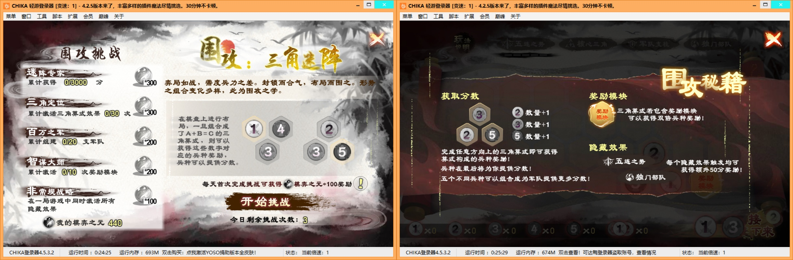

**个人攻略和感想**：预测的设计很棒，能一定程度降低随机性。奖励模块的用处不大，几乎不影响我的游戏决策——建议奖励多翻几倍或多设置几个奖励格。我大部分游戏里四个奖励模块都能自动达成，不过强迫症的我总是想在前期就把它们都弄亮。五连之势和核心三角可以强行人工构造，能够稳定达成；军队支柱只要认真玩肯定也能达成；独门部队比较搞，理论上高分局很可能达不成这个效果，但我每局总会被动达成——多次体验下来，感觉数字的随机并不均匀，中后期常常会出现某几个数字过量，而预留给某些数字的空位迟迟无法填上。

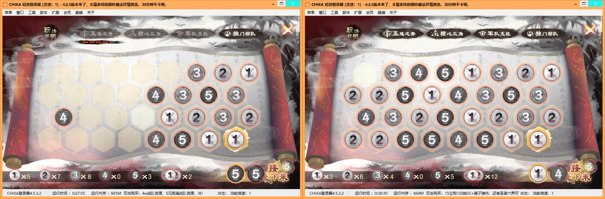

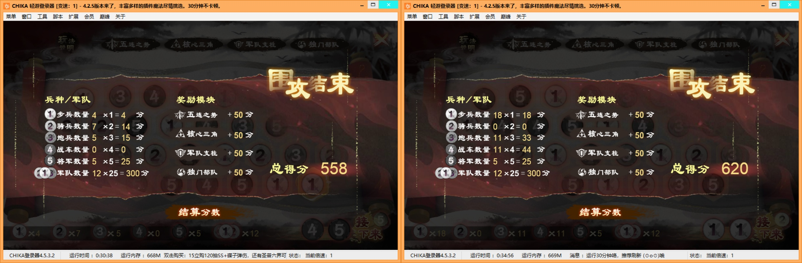

## 军团之争

**更新时间**：2023-4-28 军团之争

**游戏规则介绍**：PVP 游戏。一场比赛最多进行 $9$ 局，当某一方赢至 $5$ 轮或打满后比分领先者则胜出，若小分相同则平局。每场比赛开始时，双方各有 $100$ 个士兵。每轮对决时，每方都要派出若干数量的兵，数量更大的一方获得一分。对决有先后手的概念，每轮对决的胜者将成为下一轮对决的先手方（首轮对决随机先手）。后手方无法得知先手方派出士兵的具体数量，只会有是“小兵团”（$[0,9]$ 个士兵）还是“大兵团”（$\ge 10$ 个士兵）的提示。此外，系统为每一方维护了一个进度条，每当士兵不足 $[100,80,60,40,20]$ 时都会公式，方便对方估计其剩余兵力。

**个人攻略和感想**：这个游戏有点像德州扑克，高玩之间考验的是人性。由于每场比赛都会重新匹配对手，所以无法准确建模对手的心理，所以比德扑的技术性低了不少，总体来说“三分靠技术，七分靠运气”。游戏是好游戏，但 **输满三场比赛则当天失去对战资格** 的规则被玩家广为诟病——全勤 $14$ 天拿输的保底还不够拿中档的水晶奖励。

以游戏刚开始时的局面为例，先手有两种策略：

+   压小军团，数量控制在 $[1,9]$。小数字用来放弃本局，大数字用来坑一手对面贪小便宜不压 $10$。$8$ 不推荐，消耗偏大，且无论对手出 $9$ 还是 $10$ 都会白给。注意 $0$ 是劣手，因为军营不会崩塌会让对手察觉。
+   压大军团，数量控制在 $[10,20]$。不推荐超过 $20$，因为多崩塌一个军营会让对手察觉，直接交 $0$ 逃跑。

我认为比分优势比存量士兵数量优势更关键。当对方差我方两分以上或我方已取得四分式，且我方尚有余量，那么对方很难翻盘。因为一旦对方夺得了一次胜利，下一回合他就必定要先出手。先出手派出的士兵数量必须高于我方的存量士兵总量，否则我方 all in 即可；而当我方观察到对方兵营迅速崩塌后，可先交 $0$ 跳过一回合再 all in。

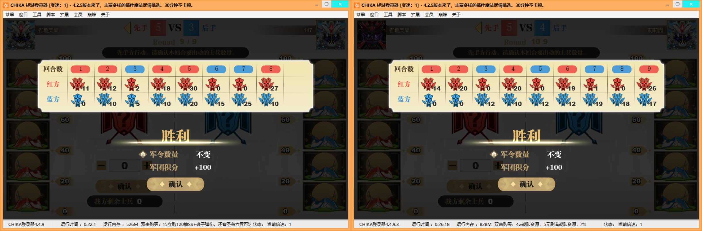

当然对局过程中也会出现平势或是劣势的情况，这时候更要仔细观察对方的兵营并揣摩对方的意图。

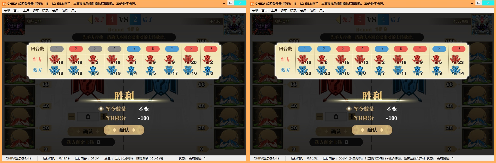

## 卡莎的山谷长廊/腾挪

更新时间：2023-4-28 卡莎的山谷长廊 / 2024-4-26 天下棋局·腾挪

**游戏规则介绍**：六片初始为空的区域，每片区域最多被“开荒”一次（容量上限 $+2$）。从奇镰村开始行动，每次可以顺时针移动 $1/2/3$ 步并消耗 $1$ 点体力，当体力耗尽时游戏结束。每个位置会提前刷出两种作物。每次移动完成后可以三选一：什么都不做，花费 $1$ 金币从作物里二选一种在相邻某块空地上，花费 $3$ 金币开垦相邻某块空地。每场游戏开始前会刷新两条奖励规则并发放 $5$ 个金币，游戏中每次经过一次起点则发放 $1+x$ 个金币，$x$ 是两条规则的达成情况。体力耗尽时，根据每个区域的布置分数和剩余金币数量计算总分和奖励。

2023.4.28 版本遇到过的规则如下：

1.  每有一个樱花/牡丹/风车的区域则多拿 $1$ 金币。
2.  每有一个烛鬼/雕像/农田/庄园则多拿 $1$ 金币。
4.  每有一块区域达到容量上限则多拿 $1$ 金币。

2024.4.26 版本将“烛鬼”替换成了“沙蝎”，删除了第 3 条规则，雕像强化成“只要种植过则多拿 $3$ 金币”。

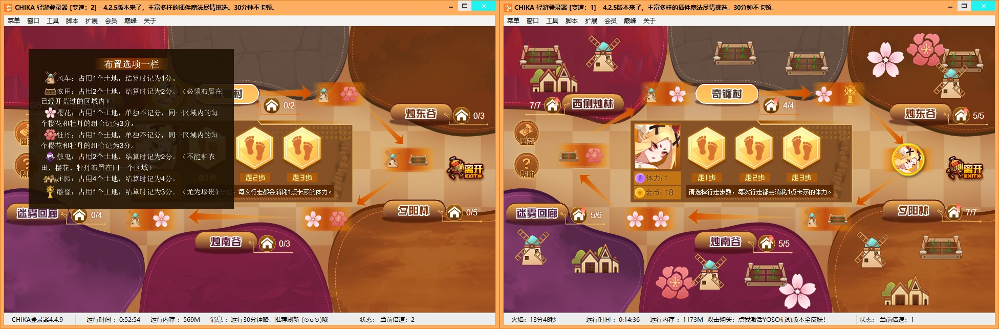

**个人攻略和感想**：很喜欢的一个游戏，很奇怪网上关于 2023.4.28 版本的攻略那么少。看上去挺考验运气，但当我玩熟后，得分能稳定在 $32-39$ 之间。我摸索出的整体策略如下：开局尽可能多地去适配规则，把金币收益最大化；中期疯狂开垦土地，每次经过奇镰村时金币快用光是最好的；最后几点体力时要精确计算一下最优策略。

烛鬼和农田的规则比较难，前者无法和作物共存，前期洒满后很难填满区域；后者需要先开垦土地才能种，比较拖节奏。雕像很稀有，我每局最多刷出一次。还有一些有用的小技巧：

+   同一块区域左右刷出的作物如果分别有牡丹和樱花，则两次操作就可以使这块区域拿到两分。
+   一块区域后侧有一个农田，如果我金币够的话，就先在前侧开垦这片地，后侧直接种上。
+   农田和烛鬼的大小是 $2$，庄园的大小是 $4$，所以我会尽量把每片区域的剩余空间控制在偶数。
+   每次离开一个位置后才会刷新该位置新的作物（即使你没有种），不想要作物的位置可以踩上去来开垦。

2024.4.26 版本我的平均得分变得更高，稳定在 $35-45$ 之间。攻略和前一个版本没什么区别。

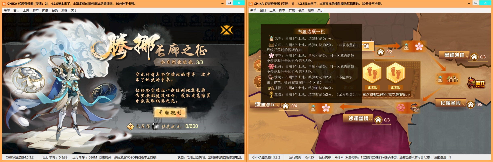

最高分 $45$ 分来自沙蝎+雕像的规则组合。雕像在第一轮就刷新了，后续沙蝎要多少有多少，刷得很爽。

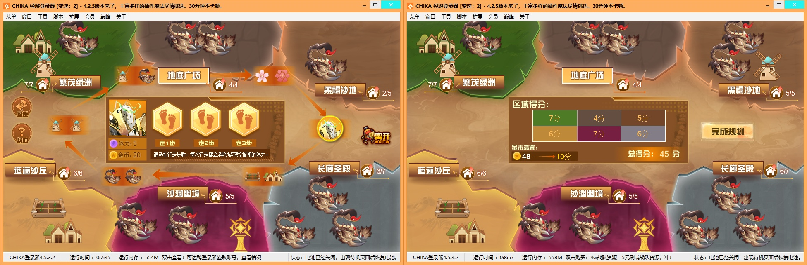

对于樱花/牡丹/风车/雕像这些规则，前期疯狂去适配即可。个人感觉带有雕像规则的局更容易前期刷出雕像。

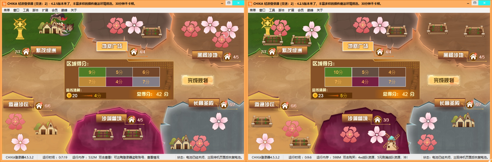

农田规则是最难的。前期旨在快速刷金币，而农田需要花钱开垦很拖节奏。下图分享了农田/樱花和农田/沙蝎。

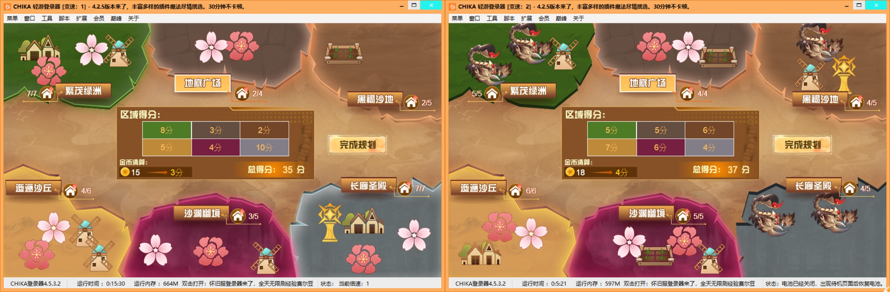

## 异乡食路

**更新时间**：2022-5-2 异乡食路 / 2023-4-28 异乡食路 / 2024-2-2 异乡食路 普兰多记

**游戏规则介绍**：$5 \times 5$ 的格子，每个格子里是通道或建筑，不同的建筑有不同的效果（如恢复体力）。初始时只有中间的十字路口是翻开的。每次可以调查当前所在位置的相邻格子，或者沿着通道走过去，这都需要消耗体力。此外，每次还可以整行或整列位移来重构道路体系。需要在体力耗尽前到达目标的建筑。

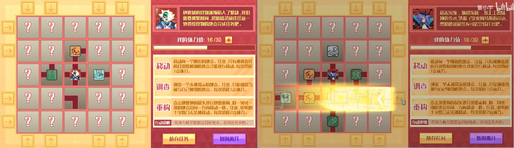

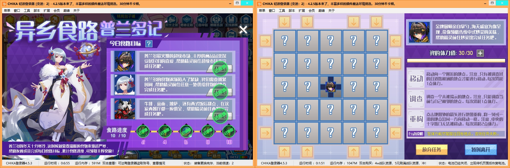

**个人攻略和感想**：随机性较大，不同局面的行列位移需要结合当时的具体情况判断。2023 时，异乡食路的全图透视插件已被大规模使用，所以一定能在较少的步骤内把目标位置移动至出发点四周。

## 赛尔雾中行-修复电路

**更新时间**：2022-5-2 赛尔雾中行-修复电路

**游戏规则介绍**：给出三列电路元件，每一列是 $6$ 种颜色的排列，每行相邻两列有电路。一开始所有颜色都是未知的，要求点亮所有颜色。每次可以交换同一列的两个元件，若交换后某行相邻元件颜色相同，该元件就会被点亮。

**个人攻略和感想**：只要不去点击那些已经被点亮的元件，整个图就只会从暗变亮。可能是因为排列数量不够大，不断地无脑点击任意两个同列的暗色元件就能很快地点亮全图。

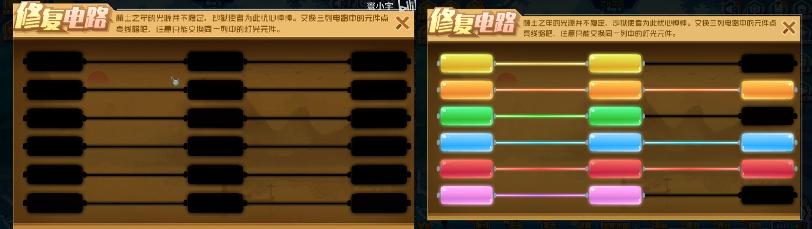

## 赛尔雾中行-龙骨回响

**更新时间**：2022-5-2 赛尔雾中行-龙骨回响

**游戏规则介绍**：给出一个包含上下左右箭头的网格图。每次可以交换两个格子的箭头，要求能从左上角走到右下角。当前的行走路径会被高亮出来。

**个人攻略和感想**：把周围的向右和向下箭头慢慢凑成一条路。感觉这个游戏也能出题？

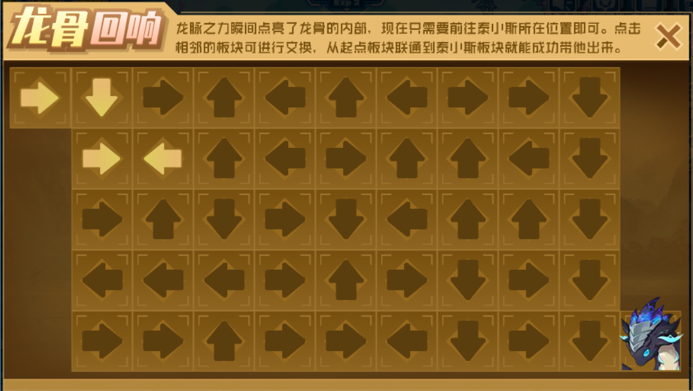

## 库乐芭的装修艺术/飞船造型师

**更新时间**：2022-5-13 库乐芭的装修艺术 / 2024-1-12 飞船造型师

**游戏规则介绍**：总共分为 $15$ 轮，每轮选择一种二选一的图案填充到空白的位置，可以选择跳过。

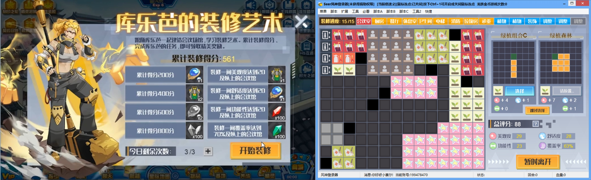

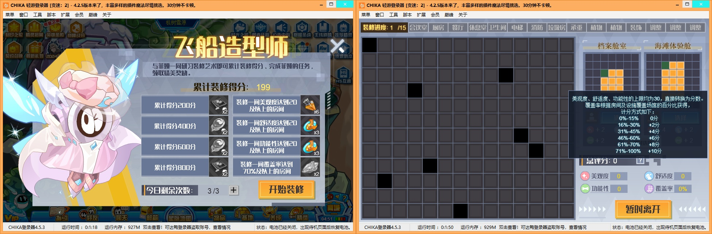

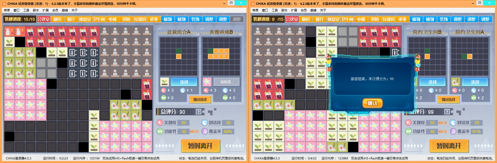

**个人攻略和感想**：和 [烟花试验田](#烟花试验田/河岸边的种植园) 有点像。参考 Best Fit，前期优先空隙小的位置，给后期可能的大格子留位置。第一个版本我后期平均有一轮放不下；第二个版本我挑战自己专放更大的，大部分情况下都能全部放完。

## 切断！攻城拔寨

**更新时间**：2024-5-3 天下棋局-切断！攻城拔寨

**游戏规则介绍**：玩家和三个 NPC 一共进行 $15$ 轮。一共有四个 $3 \times 2$ 的长方形区域，初始时每个区域的每个位置都是空的。每轮会提供长方形内的四个位置，玩家挑选其中之一并应用在某个区域上，在该区域对应格子放下一颗棋子，等级是原有棋子的等级 $+1$（如果覆盖空格等级就是 $1$）。当原棋子和新棋子属于同一个阵营，则这枚棋子会变成金色，以后不能再被任意阵营覆盖。注意每轮没选的三个位置会继续保留到下一轮。当 $15$ 轮结束后，统计每个区域里等级最高的棋子所在阵营、拥有最多棋子所在阵营等信息计分，枚举还会有特殊奖励分。

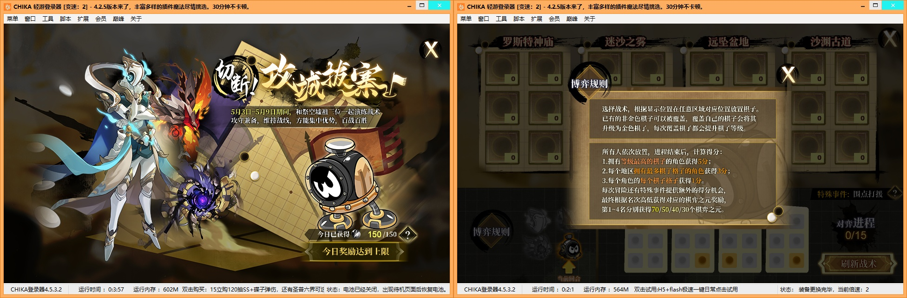

**个人攻略和感想**：印象里这个游戏是复刻的，但没找到早前的出处。我会优先覆盖敌我的高等级棋子，但也要注意早点刷掉没用的废位置。整体来说随机成分比较大，不过实践来看我的期望排名应该不会低于第二名。

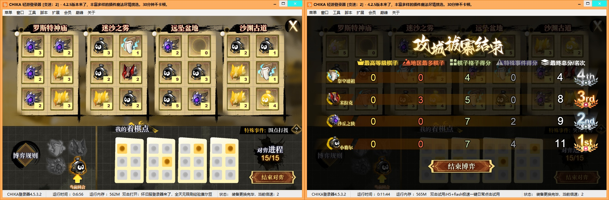

## 电力供给支援工作

**更新时间**：2025-5-16 电力供给支援工作

**游戏规则**：横条上会显示当前位置相邻的颜色块，光标抵达某颜色瞬间按下可行走，要从最左边走到最右边。

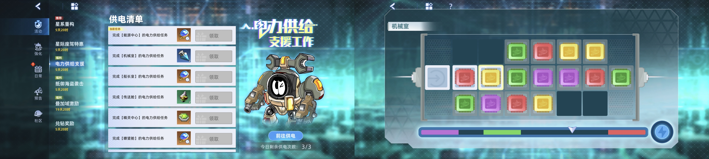

**个人攻略和感想**：严格来讲是非策略游戏，只要找到一条从左到右的路然后手指点点即可。不过注意到同种颜色生成位置相同，假设光标能够随心所欲点击，可以推广到找一条“使光标移动总次数最少”的路径。

## 物资采购

**更新时间**：2022-5-20 物资采购

**游戏规则介绍**：每天上线后能领取一笔可累积的本金。每天有六次挑战机会，每次挑战会限时给出一些商品，需要决策是否购买。商品价格和收益详见左图。商品价格会有所波动，总体和期望收益成正比。

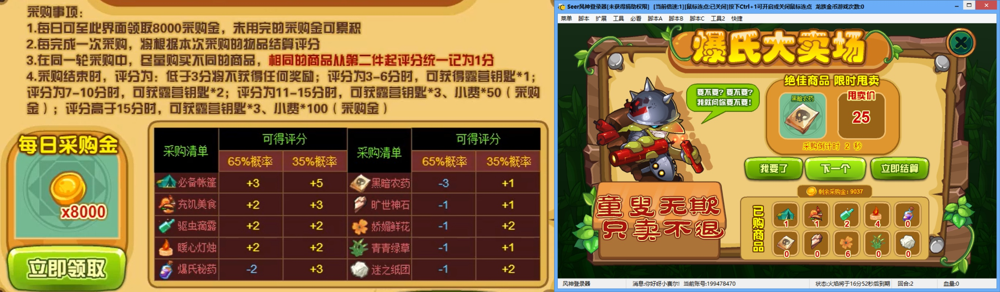

**个人攻略和感想**：左列的的商品价格都比较贵，但收益较高，显然各买一个比较划算。每个物品可能会刷到多次，所以第一次刷到时不用急着入手，可参考最优停止问题（optimal stopping problem）。右列的商品虽然期望收益是负的，根据“重复物品第二件起均记为 $1$ 分”的规则，我们可以动态筛选 $1 \sim 2$ 个右列商品反复购买。

## 宿命王者的历练

**更新时间**：2025-5-30 宿命王者的历练

**游戏规则介绍**：有五个初始空闲的宝箱槽位（有个独占宝箱不考虑在内）。宝箱总共分为稀有、史诗、传说三种，挑战不同难度的 boss 必定获得一个宝箱，获得的种类概率如下图。稀有、史诗、传说三种宝箱开启后需要等待的时间不同，能获得的道具数量的区间也不同。一个宝箱开启结束后才能开启下一个。

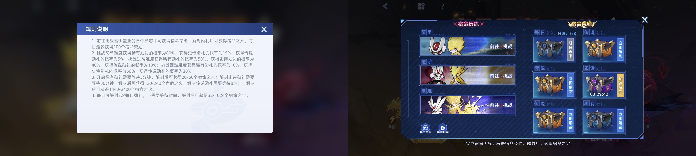

**个人攻略和感想**：这个游戏通过浪费玩家时间/计算资源来变相增加在线数量。其非策略型，但我们可以按策略型去思考，即如何在固定的一段时间内获得尽量多的道具。注意到稀有、史诗、传说三种礼盒的单位时间收益期望逐步递减（统一单位后是 $[4,12],[4,8],[3,5]$），理想情况下肯定是用脚本不断刷稀有礼盒。我们可以把问题推广成类似于手动的带约束版本（比如睡眠期间肯定会用一次传说礼盒来过渡），根据自身的时间安排来最大化收益。

## 晶骰传说

**更新时间**：2025-5-30 晶骰传说

**游戏规则介绍**：类似杀戮尖塔的 **roguelike** 游戏，每局游戏都是从零开始探索地图、打怪、获得或升级骰子。从 5 月 30 日上线以来，经历了 6 月 6 日和 6 月 13 日的两次版本更新，用【新版】和【再版】表示。

每局游戏要依次探索“废墟边缘”和“水银沙城”两张地图，每张地图里有以下内容：

+ 战斗事件：和野怪战斗，战败则游戏结束，战胜后获得一定数量的晶石和一个骰子（三选一，可放弃）。
+ 强化恢复：回血（基础 $10$ 点，每消耗 $10$ 晶石多 $5$ 点）和骰子升级（普通/精英骰子需 $15/30$ 点晶石）。
+ 骰子商店：随机出三个骰子，可用道具购买。不同骰子价格不同。
+ 集会处：同时具有强化恢复和骰子商店的功能。每张地图的 boss 挑战前一定是集会处。
+ Boss挑战：每张地图的最后一定是一个 Boss 挑战。战败后游戏结束，战胜后获得大量晶石。
+ 【再版】矿晶活跃地：提升生命上限、天赋印记等能力，可以付出额外晶石来强化效果。

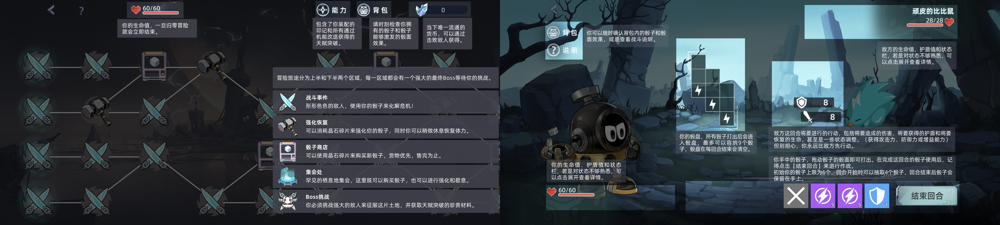

战斗时每轮新摸取 $4$ 个骰子（可通过天赋树强化成 $5$），持有上限是 $6$（可通过天赋树强化成 $7$）。野怪或 boss 初始时没有护盾，每回合一定后出手，会从几种固定的模式（攻击/给下回合套护盾/回血）中选择一种。

每次击败野怪或 boss 后，可从三个随机骰子中最多获得一个。每个骰子有初始效果和对应的三种强化：

+ 能量强化：少许增加初始效果里部分面的数值，或将一些无效果的面也变得有效果。升级后永久保持。
+ 结构强化：大大增加初始效果里部分面的数值，但会让有些面变得无效果。升级后永久保持。
+ 幻象强化：大大增加初始效果里部分面的数值。一次战斗结束后变回初始效果（可通过天赋树概率保留）。

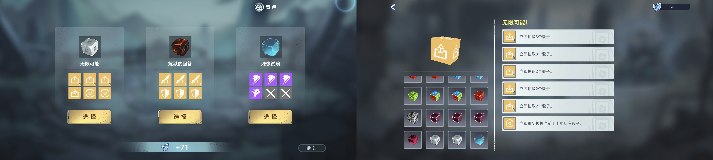

|       骰子名       | 初始效果 --> 第二版修正                                      |
| :----------------: | ------------------------------------------------------------ |
|      基础攻击      | 投 $X$ 点就造成 $X \rightarrow X+2$ 点伤害。                 |
|      基础防御      | 投 $X$ 点就获得 $X \rightarrow 3/5$ 点护盾。                 |
|      基础回复      | $3$ 面恢复 $2$ 点生命值，$3$ 面无效果                        |
|      三色战术      | $3$ 面造成 $4 \rightarrow 6$ 点伤害，$2$ 面获得 $3 \rightarrow 5$ 点护盾，$1$ 面获得恢复 $2$ 点生命值 |
|       再一次       | $3$ 面重投所有骰子，$3$ 面无效果                             |
|       回旋镖       | $2$ 面抽取 $1$ 个骰子，$4$ 面造成 $1 \rightarrow 4/5$ 点伤害 |
|       后撤步       | $2$ 面抽取 $1$ 个骰子，$4$ 面获得 $1 \rightarrow 3/4$ 点护盾 |
|    拾荒者的馈赠    | $2$ 面抽取 $2$ 个骰子，$2$ 面抽取 $1$ 个骰子，$2$ 面无效果   |
|      无畏重击      | $2$ 面造成 $10 \rightarrow 12$ 点伤害，$4$ 面自己受到 $3$ 点伤害 |
|      孤掷一注      | $2$ 面抽取 $2$ 个骰子，$2$ 面重投所有骰子，$2$ 面自己受到 $3$ 点伤害 |
|    角斗士的佯攻    | $1$ 面消耗当前攻击伤害值转化为获得护盾值， $2$ 面获得 $2 \rightarrow 4$ 点护盾，$2$ 面获得 $1 \rightarrow 4$ 点护盾 |
|     锈蚀的迷雾     | $1$ 面降低敌方 $25\%$ 攻击值，$1$ 面降低敌方 $50\%$ 护盾值， $1$ 面重投所有骰子，$1$ 面抽取 $1$ 个骰子，$2$ 面无效果 |
|     霆威的回响     | $3$ 面获得 $3$ 层电气，$3$ 面获得 $5$ 层电气                 |
|     雷神天明闪     | 消耗当前的电气层数，转变为 $2$ 倍的攻击伤害值                |
|     雷神的戏谑     | $3$ 面获得 $7$ 层电气，$3$ 面自己受到 $3$ 点伤害             |
|      返璞归真      | $1$ 面获得 $1$ 层成长，$2$ 面获得 $1$ 层力量，$2$ 面获得 $1$ 层架势，$1$ 面抽取 $1$ 个骰子 |
|      石破天惊      | $2$ 面消耗已拥有和即将获得的护盾值转化为攻击伤害值，$4$ 面获得 $2 \rightarrow 4$ 点护盾 |
|     孤傲的战歌     | $1$ 面获得 $1$ 层残像，$1$ 面获得 $1$ 层成长，$1$ 面获得 $2$ 层力量， $1$ 面获得 $2$ 层架势，$2$ 面造成 $6 \rightarrow 8$ 点伤害 |
|      无限可能      | $4$ 面抽取 $2$ 个骰子，$2$ 面立即重投所有骰子                |
|     炼狱的回答     | $3$ 面立即降低敌方 $25\%$ 攻击值，$3$ 面立即降低敌方 $50\%$ 护盾值 |
|      残像试演      | $4$ 面获得 $1$ 层残像，$2$ 面无效果                          |
|     极意的修炼     | $3$ 面造成 $6 \rightarrow 8$ 点伤害，$3$ 面获得 $3  \rightarrow 5$ 点护盾 |
|   【新版】腐蚀术   | 立即向敌方施加 $5$ 层感染。                                  |
| 【新版】黑夜的低语 | $1/2$ 面立即获得 $4/2$ 层伏击，$1$ 面向敌方施加 $5$ 层感染，$2$ 面重投所有骰子 |
|  【新版】扭曲信仰  | $2$ 面将敌方下一次的护盾或回血变为等层的感染， $2$ 面降低敌方 $25\%$ 攻击值，$3$ 面降低敌方 $50\%$ 护盾值 |
| 【新版】狂乱的回响 | $2$ 面立即向敌方施加 $12$ 层感染，$2$ 面自己受到 $3$ 点伤害  |
|  【新版】苔纹绣斑  | $3$ 面立即向敌方施加 $3$ 层感染，$1$ 面恢复 $3$ 点生命，$2$ 面自己受到 $3$ 点伤害 |
|  【新版】万象滋生  | 无任何效果（能量强化和结构强化分别能升级成攻击型和防守型）   |
|  【再版】结晶之枪  | $2$ 面造成 $6$ 点伤害，$2$ 面造成 $4$ 点伤害，$2$ 面立即获得 $1$ 层矿脉 |
|  【再版】结晶之盾  | $2$ 面获得 $4$ 点护盾，$2$ 面获得 $3$ 点护盾，$2$ 面立即获得 $1$ 层矿脉 |
|  【再版】末世之光  | $1$ 面立即获得 $1$ 层闪耀，$5$ 面己方立即失去 $4$ 点生命。   |
|  【再版】碎石风暴  | $2$ 面立即获得 $2$ 层矿脉，$2$ 面获得 $1$ 层矿脉，$2$ 面抽取 $1$ 个骰子 |
| 【再版】永恒流星雨 | $1$ 面立即获得 $2$ 层成长，$1$ 面抽取 $2$ 个骰子，$2$ 面抽取 $1$ 个骰子，$2$ 面重投所有骰子 |

开局可以在若干天赋能力中选择一种，并携带对应的 $9$ 个初始骰子。每回合最多打出 $9$ 个骰子。

+ 雷霆之唤：每回合打出的第 $3/6/9$ 个骰子时立即为自己叠加 $3$ 层电气。
+ 武斗之心：每回合打出的第 $5$ 个骰子时己方立即获得 $1$ 层成长。
+ 【新版】混沌悸动：每回合打出的第 $2/4/6/8$ 个骰子时立即为敌方叠加 $2$ 层感染。
+ 【再版】传说晶矿：每回合打出的第 $3/7$ 个骰子时立即为自己叠加 $1$ 层矿脉。

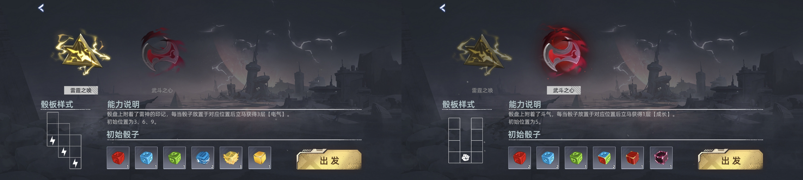

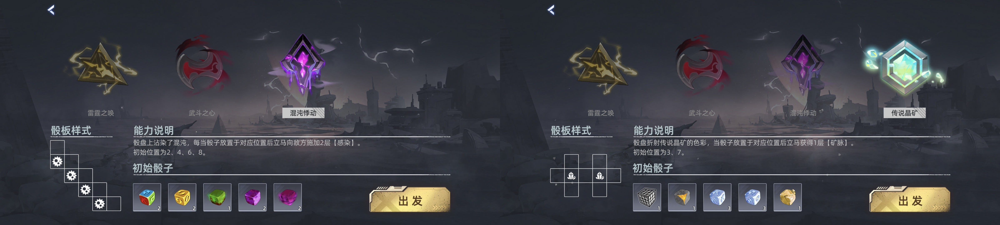

| 可叠加 buff | 效果                                                         |
| :---------: | ------------------------------------------------------------ |
|    电气     | 己方结束时会立即对敌方造成等同于己方电气的攻击伤害（正常受护盾抵挡） |
|    成长     | 每回合结束时，若己方有 $X$ 层成长，则为己方增加 $X$ 层力量和 $X$ 层架势 |
|    力量     | 若己方有 X 层力量，本回合每一个打出的骰子都可以增加  $X$ 点攻击伤害 |
|    架势     | 若己方有 X 层架势，本回合每一个打出的骰子都可以增加  $X$ 点护盾 |
|    残影     | 每回合结束后层数 $-1$。若己方有 $X$ 层残影，攻击力额外乘 $X+1$ |
| 【新】感染  | 每回合结束后层数 $-1$。若己方有 $X$ 层感染，回合结束后受到 $X$ 点伤害（无视护盾） |
| 【新】伏击  | 若己方有 $X$ 层伏击，每次进行重投行为时向敌方施加 $X$ 层感染。 |
| 【再】矿脉  | 若己方有 $X$ 层矿脉，操作结束后回复 $X$ 点血量。每达到 $6$ 层立即转化为 $1$ 层闪耀 |
| 【再】荣耀  | 任意时刻，当玩家累积 $3$ 层闪耀时立即秒杀敌方。              |

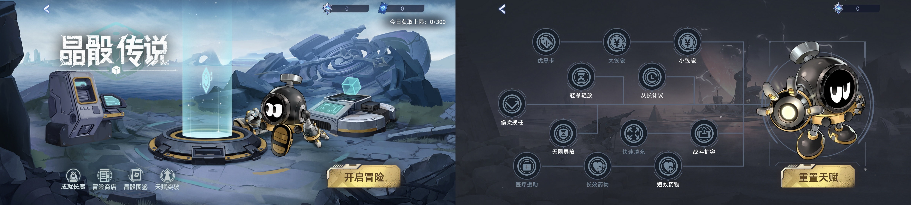

每局游戏结束后，根据进度奖励 $0 \sim 2$ 个强化点。可用点数来获得永久 buff：

|   技能名    | 所需点数 | 效果                                             |
| :---------: | :------: | :----------------------------------------------- |
|  小/大钱袋  |   1/2    | 初始时额外拥有 $25/35$ 晶石                      |
|   优惠卡    |    3     | 购买骰子时价格减少 $5$ 晶石                      |
|  战斗扩容   |    2     | 手上的骰子最大持有上限从 $6$ 个变为 $7$ 个       |
|  快速填充   |    4     | 每回合开始抽取的骰子从 $4$ 个变为 $5$ 个         |
|  从长计议   |    3     | 回合开始时会重新投掷留在手上的骰子               |
|  轻拿轻放   |    3     | 幻象强化的骰子在战斗结束后有 $50\%$ 的概率不还原 |
|  偷梁换柱   |    3     | 打出无效果面的骰子时会再进行一次重掷             |
|  无限屏障   |    3     | 每回合开始时我方的护盾不会消失                   |
| 短/长效药物 |   1/2    | 初始生命值额外提升 $15/25$ 晶石                  |
|  医疗援助   |    3     | 每次战斗结束时，都会恢复 $3$ 点生命值            |

第一层/第二层/新第二层会遇到的野怪/Boss 资料收集如下：
|     野怪/BOSS     | 血量  |                  模式                  |
| :---------------: | :---: | :------------------------------------: |
| 顽皮/固执的果冻鸭 | 24/28 | ⚔️4🛡️4，🛡️7，🛡️7💖7  ❖❖  ⚔️3，⚔️3🛡️3，🛡️5，🛡️5💖5 |
| 胆小/顽皮的比比鼠 | 24/28 |      ⚔️6，🛡️6  ❖❖  ⚔️8，⚔️8🛡️8，🛡️8，💖8      |
|  认真/天真的罗奇  | 24/32 |   ⚔️10，⚔️7🛡️4，🛡️3 ❖❖  ⚔️7/10，⚔️4🛡️4，🛡️3    |
| 温顺/顽皮的利利 | 34/40 | ⚔️8/10 ❖❖ ⚔️10/13/16 |
| 急躁/顽皮的天雷鼠 | 44/56 | ⚔️16，⚔️16🛡️13，🛡️13，💖13 ❖❖ ⚔️13，⚔️13🛡️13，🛡️13，💖13 |
| 悠闲/固执的水晶鸭 | 53/57 | ⚔️7🛡️9，🛡️16/20，🛡️16💖10 ❖❖ ⚔️6🛡️6，🛡️10/13，🛡️10💖10 |
| 顽皮/冷静的电击兔 | 68/76 | ⚔️15/16/20，🛡️16 ❖❖ ⚔️13/16，🛡️13 |
| 认真/慎重的西萨琉拉 | 48/52 | ⚔️11，⚔️6🛡️6，🛡️5 ❖❖ ⚔️6/8，⚔️3/4/7🛡️9，🛡️7 |
| 西塔·能源型 | 200 | ⚔️17/18/23，⚔️18🛡️18，🛡️23，💖18 |
| 奇塔·解算型 | 160 | ⚔️6/8/17，🛡️20 |
| 卡塔·武装型 | 120 | ⚔️29/36，⚔️19🛡️19 |
| 大胆/顽皮的尼布 | 52/56 | ⚔️20，🛡️12，💖8 ❖❖ ⚔️16，🛡️16，💖16 |
| 胆小/慎重的奇洛 | 56/64 | ⚔️7/10🛡️9，🛡️8，🛡️16💖16 ❖❖ ⚔️7🛡️14，🛡️12，🛡️24💖16 |
| 实干/无虑的吉斯 | 56/72 | ⚔️12/16，⚔️7/9🛡️9，🛡️16 ❖❖ ⚔️12，⚔️6/7🛡️7，🛡️12 |
| 实干/沉着的古斯 | 56/72 | ⚔️12/16/20，🛡️20 ❖❖ ⚔️12/15，🛡️15 |
| 马虎/开朗的波波鱼 | 64/80 | ⚔️28，⚔️28🛡️20 ❖❖ ⚔️24/32/41，⚔️32🛡️12，🛡️12💖8 |
| 勇敢/狂妄的尼斯克 | 80/88 | ⚔️20/26，🛡️15，💖25 ❖❖ ⚔️24/31，🛡️10，💖12 |
| 坦率/固执的吉尼亚斯 | 88/104 | ⚔️12/23，⚔️9/12/15🛡️12，🛡️10，💖20 ❖❖ ⚔️19，⚔️9/12🛡️14，🛡️12，💖24 |
| 固执/急躁的塔奇拉顿 | 92/112 | ⚔️24，⚔️24🛡️24，🛡️38 ❖❖ ⚔️16，⚔️16🛡️32，🛡️51 |
| 梦魇塔奇拉顿 | 400 | ⚔️24/31/33，⚔️17🛡️27，🛡️40/46/52，💖16 |
| 梦魇尼斯克 | 360 | ⚔️21/27/36/41/62/92/102，⚔️26🛡️19 |
| 顽皮/天真的水草蛙 | 52/60 | ⚔️20，🛡️10，⚔️12🛡️6 ❖❖ ⚔️16，💖16 |
| 固执的希罗里 | 42 | ⚔️13，🛡️4 |
| 开朗/无虑的阿兹 | 42/42 | ⚔️20🛡️12，💖8 ❖❖ ⚔️15，🛡️16💖16 |
| 坦率/沉着的晶岩兽 | 60/66 | ⚔️18，🛡️18，💖28 ❖❖ ⚔️12，🛡️26，⚔️7🛡️15 |
| 固执/实干的火晶兽 | 50/56 | ⚔️24，🛡️12，💖20 ❖❖ ⚔️16，🛡️16 |
| 恶毒/马虎的多鲁姆 | 80/88 | ⚔️19，⚔️12🛡️14，🛡️24 ❖❖ ⚔️28，⚔️22🛡️20 |
| 急躁/恶毒的塔姆拉 | 77/86 | ⚔️44，🛡️18/28 ❖❖ ⚔️19，⚔️9🛡️12，🛡️24，🛡️20💖18 |
| 狂妄/恶毒的卡其沙 | 90/110 | ⚔️32，🛡️32💖12 ❖❖ ⚔️10🛡️10，🛡️13 |
| 胆小/危险的星吉拉 | 80/98 | ⚔️22🛡️24，🛡️12，🛡️38 ❖❖ ⚔️48，⚔️24🛡️16，🛡️16💖16 |
| 绝魇魔女 | 500 | ⚔️12🛡️24，⚔️20🛡️40，🛡️20/64，🛡️40💖30，💖48 |
| 魇魔 | 300 | ⚔️28/36，🛡️15 |
| 咤克斯的幻影 | 600 | ⚔️21🛡️15 |

初版最高分：

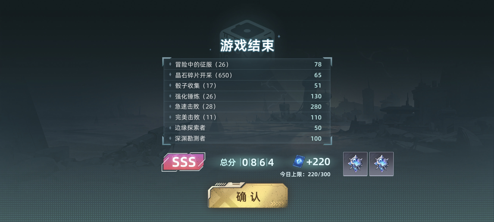

**个人流水账**：我首先尝试了雷霆之唤能力，核心玩法很简单：每轮攒电气，突然来波雷神天明闪转化为巨额伤害。前两把我主拿霆威的回响和雷神天明闪这两种骰子，主升能量强化（不喜欢结构强化和幻象强化，喜欢持久的保底收益）。但这个方式的风险比较大，不要说 boss 了，面对波波鱼这种攻击很高的野怪容错也很低，前两轮没攒好秒掉基本就寄了。第二把我在一层 boss 前升了几个幻象强化勉强莽过去了，到了第二层野怪变强继续坐牢。

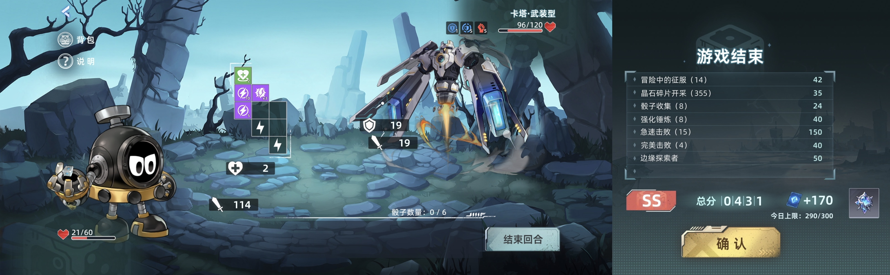

接下来我尝试了武斗之心能力，发现这个流派很强很无脑。核心的成长属性需要 $5$ 个骰子激活，而初始天赋下每轮只会补 $4$ 个骰子，一个很自然的想法就是去获得并打出能够抽取新骰子的骰子（开局只需随到一次这种骰子就一定能激活成长），包括基础骰子里的拾荒者的馈赠，以及高级骰子里的无限可能。只要不是开局运气差没随到抽取骰子，或是 boss 第一动有超过我方血量的攻击力，武斗之心均能稳定叠层，让己方在接下来的回合攻守兼备。注意高级骰子里的返璞归真和孤傲的战歌也非常适配武斗之心能力，和无限可能一样升级需要 $30$ 个晶石。

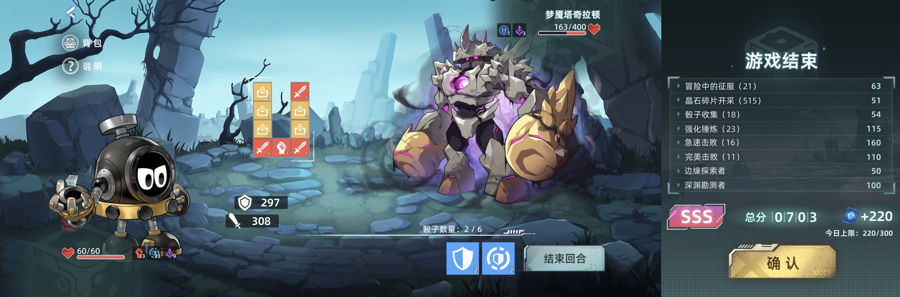

受到武斗之心的启发，我发现骰子流也可以运用在雷霆之唤能力中。不过骰子组合没有那么无脑，需要正常抽些霆威的回响和雷神天明闪来叠电气和转换伤害。实践中我还发现残影这个 buff 非常关键，使得 boss 战里不完全依赖幻象强化后的霆威的回响（能让电气翻倍）和雷神天明闪（伤害最高 $5$ 倍）。但残影 buff 获得困难，只有残像试演这个骰子能较为稳定地提供。如果能在两层地图的探图中能获得 $1 \sim 2$ 个残像试演并幻象强化，最终 boss 战就很舒服。如下图，我抽出了梦魇尼斯克的超高攻击力，但靠着骰子流、$5$ 倍天明闪和残影 buff 强杀了。 

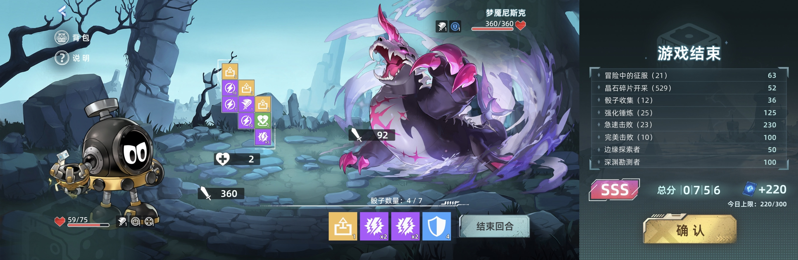

新版的混沌悸动和武斗之心差不多拖，但其不像后者那样能通过架势让己方获得高额护盾，而且感染的扣血时机是敌方攻击我方之后，对出骰策略、血量把控等都提出了更高的要求。可能唯一的优势是能穿 boss 护盾吧。我很喜欢新骰子扭曲信仰，能把 boss 下一回合的护盾和血量等额转化成感染，在 boss 战里能迅速叠层；相反我很讨厌伏击这个间接用来叠感染的状态（如代表性骰子黑夜的低语），触发条件麻烦而且转化效率很低。

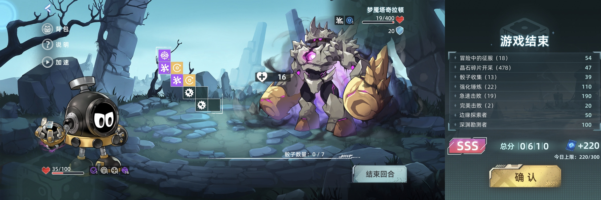

**个人攻略和感想**：下面总结一些我在实践中获得的经验和感悟。

+ 如果想要达成 SSS 级结果，武斗之心比雷霆之唤稳定很多，无脑拿骰子流即可。
+ 雷霆之唤  $3$ 的倍数格的能力和雷神天明闪之间有结算顺序，踩上去先获得电气再全部转化。
+ 触发战斗事件后如果退出重进，会从第一回合开始并重投骰子，可利用这个特性反复刷骰子。
+ 普通的攻击/防御/回血骰子数值很低（特别面对 boss），这也是为什么新版普遍做了加强。

## 地底探险

**更新时间**：2024-6-7 漫游洛林卡-地底探险

**游戏规则介绍**：从 0m 开始向地底挖掘至 10000m，途中可能会遇到精灵或化石，击败精灵能获得电池能量等奖励。小赛尔会亲自迎战精灵，使用电池能量可以给小赛尔升级等级、技能或 buff，注意可撤销并退还能量。

+ 节能模组：挖掘消耗电池永久降低 $20\%$。累计消耗若干能量自动激活。
+ 中枢模组：初始 $50$ 级，每次消耗 $200$ 能量，可提升至 $75$ 级和 $100$ 级。
+ 武器模组：毁灭型、坚壁型、极速型三套技能，激活一套消耗 100 能量。
+ 增益模组：包括反击（受到伤害 $>300$ 下次攻击威力翻倍）、防护（登场时获得 $200$ 点护盾和护罩）、奇袭（所有技能先制 +1）三套增益，激活一套消耗 $100$ 能量。

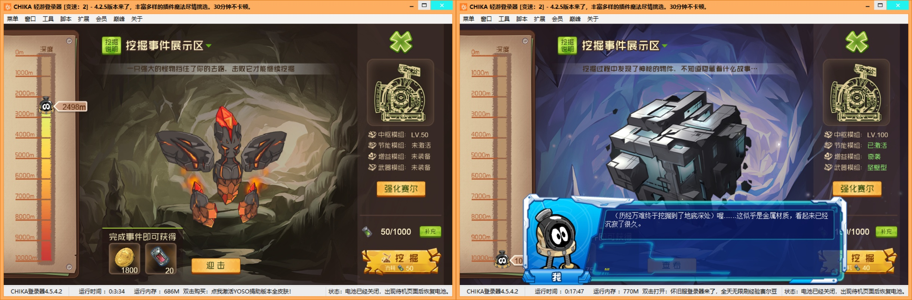

**个人攻略和感想**：这个小游戏不是策略类而是战斗类，但可以看出里面的精灵和数值是精心设计的，故摘录于此。举个例子，我在前期碰到一只古尔扎迪，速度比我方快，一刀我方就掉超过一半的血，每回合吸取我方强化且有概率使我方害怕。当时能量不足 $200$，三个增益模组感觉都聊胜于无，试了半天才发现选奇袭能打过，依靠先手开出三回合减伤的属性技能慢慢磨对面。再比如中后期有一只伤害很高的 boss，需要按死极速型的弹伤技能。

## 栽培绒绒菊

**更新时间**：2024-6-7 漫游洛林卡-栽培绒绒菊

**游戏规则介绍**：总共有 $10$ 张绒绒菊田地需要栽培，每个绒绒菊的等级范围是 $1 \sim 5$，所有绒绒菊都升至 $5$ 级后进入下一张地图。每张地图大小是 $8 \times 8$，少量格子带有蓝色箭头标记，表示该绒绒菊升满级后会获得 $10$ 积分。每次灌溉默认提升范围内每个绒绒菊 $1$ 个等级，积分可以用来升级单次灌溉的范围和效果。后一半的地图的格子会有干旱（灌溉时该格子 $50\%$ 的概率不升级）或虫害（灌溉时有 $30\%$ 概率重置为 $1$ 级）的效果。

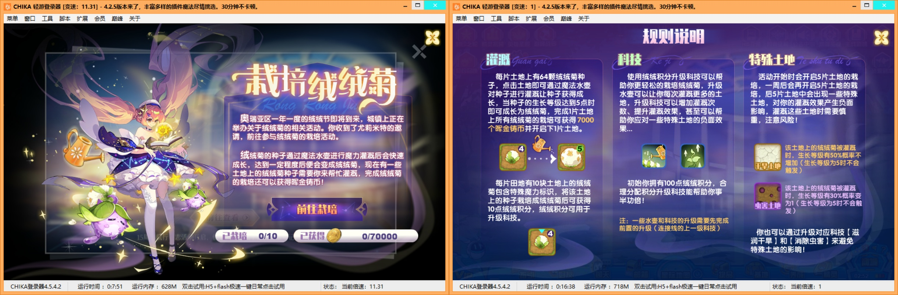

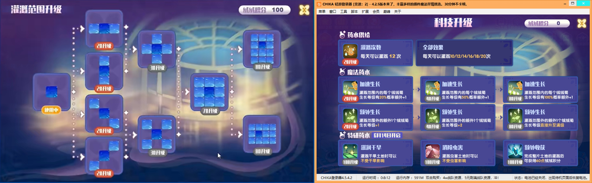

**个人攻略和感想**：2024 周年庆撑门面的策略性游戏，我很喜欢。从单张地图灌溉策略来看：优先升级蓝色箭头的格子以快速获得积分，然后用一定的顺序和规则铺满整张地图。从全局科技解锁方向来看：灌溉范围和灌溉次数肯定要大量升级的，但灌溉范围最后一列是否要解锁有待商榷；魔法药水里的加速生长适合地图前期，额外生长适合后期，我个人的想法是先升级一部分*额外生长*（因为每张地图末期都会有零星的绒绒菊，很浪费灌溉次数），把*加速生长*全部解锁后再解锁剩下的*额外生长*；干旱和虫害里我优先升级后者，因为前者的负面效果比较稳定。

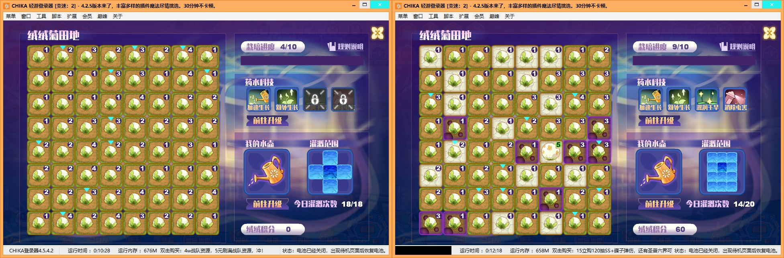

## 擂台斗技

**更新时间**：2023-6-9 擂台斗技

**游戏规则介绍**：六个勇士各自有个特性，每局比赛时随机三个勇士上场。比赛一共会进行 $15$ 轮，每轮里三个玩家轮流操作：要不打出一张卡牌，要不选择某位勇士进行“羁绊”（每个玩家最多只能羁绊五次）。卡牌分为公共卡牌和只能施加于某个勇士的个人卡牌。最先达到了 $15$ 点战力的勇士或 $15$ 轮结束时战力最高的勇士获得胜利，根据每个玩家与其羁绊次数高低来排名。如果羁绊等级相同，则最先羁绊的玩家胜出。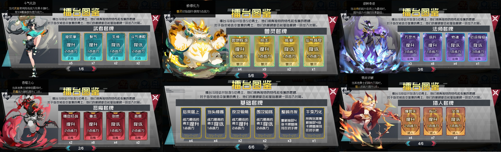

**个人攻略和感想**：罕见的三人 PVP 游戏，刚出的两天经常卡死（只要有一方变速，三方全卡死）。卡牌的不确定性和其他玩家操作的不确定性让这个游戏的随机性大增。我一般会优先缔结恶魔，因为玩家总是倾向于把羁绊次数用完，使恶魔的战力增长速度会很快；其次偏向于武者或猎人，他们的特性让他们有更多的机会增长战力。当然这个游戏还讲究“见风使舵”，当某个勇士遥遥领先的时候，大伙儿会一股脑地往他身上压。

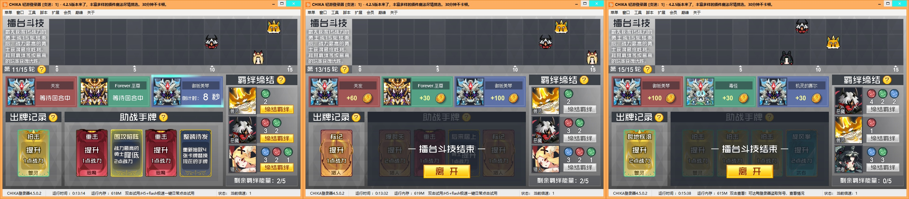

## 龙域的涂鸦

**更新时间**：2023-6-16 龙域的涂鸦

**游戏规则介绍**：游戏总共进行 $15$ 回合，玩家和三个电脑玩家轮流行动。玩家拥有第一步和最后一步的涂鸦权，即能比别人多涂一次。自己一共有四张涂鸦卡，每回合能消耗其中一张涂在某个景点卡上。涂鸦能互相覆盖，多次覆盖是等级会逐渐提升。当自己覆盖自己的涂鸦时，涂鸦会变成金色，此时其无法被覆盖。游戏结束时，根据最高等级涂鸦的归属权、己方涂鸦的格子数量、每个景点涂的最多的角色等信息赋分，根据玩家的排名给予对应奖励。

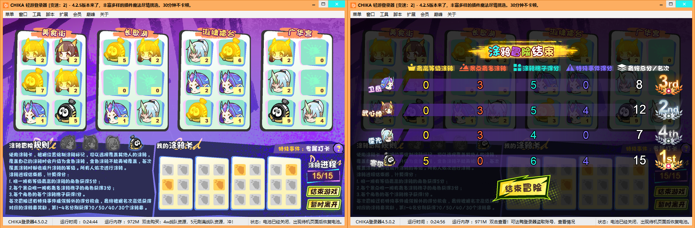

**个人攻略和感想**：手操起来还是比较休闲的，当然玩了两天就丢给歆冉忆梦了哈哈哈。我的玩法是：

1.  优先囤两张相同格子的涂鸦，方便自己快速达成金色涂鸦。
2.  不怎么主动覆盖空格，优先覆盖等级较高的格子，特别是当前优势较大的电脑。
3.  最后几回合时，根据赋分算法最优化自己的操作。

## 派特的研究

**更新时间**：2023-6-21 漫游洛林卡-派特的研究

**游戏规则介绍**：每天解锁一个任务。不重复地选择下方若干条资源转化规则填至空白处，使得按顺序转化后的结果达到目标。每一条规则会被严格执行，即其所需的元素必须全部存在。

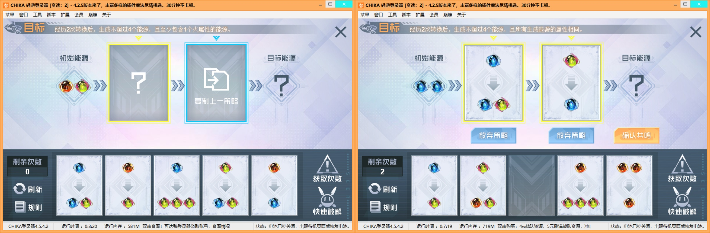

**个人攻略和感想**：因为是周年庆的活动，游戏本身是降低了难度的，可以通过不断刷新来寻找合适的规则甚至直接通过游戏。假设规则只能从五条里选，就是个 $A_5^n$ 枚举，考验人脑模拟的过程；假设规则可以靠刷新且刷新次数有严格限制，对于多空的任务就涉及到一个全局估价问题，即我该怎么填一部分使得能达成目标的概率最大。

## 破解夏夜奇咒/破解幽影魔咒/时空之门的研究

**更新时间**：2022-6-24 破解夏夜奇咒 / 2023-11-4 破解幽影魔咒 / 2024-12-13 重返赫尔卡-时空之门的研究-破译时空之门

**游戏规则介绍**：有四种符号，随机生成了一个长度为 $5$ 的咒语。每一轮猜测一遍咒语，结果用按顺序的方形灯表示：绿色表示该位置猜测的符号正确；红色表示该位置猜测的符号错误，但该符号存在于其他位置；灰色表示该位置的符号猜测错误，且该符号不存在于其他位置。用尽量少的轮数猜出整个咒语。

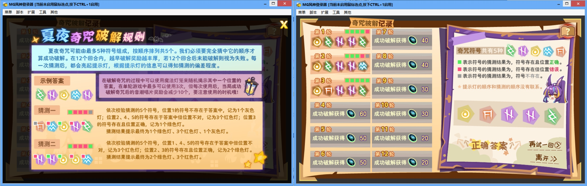

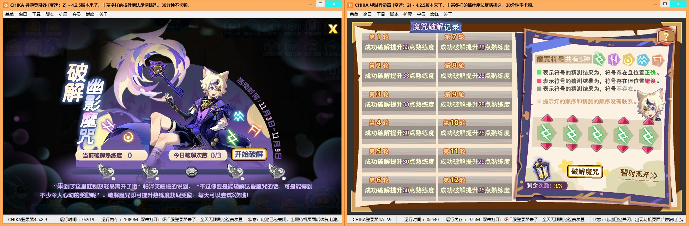

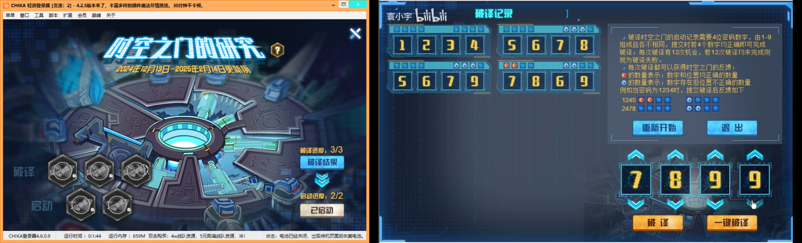

在 2024 年底的版本中，形式上发生了变化：长度从 $5$ 改到了 $4$，但是值域变成了数字的 $1-9$。

**个人攻略和感想**：有点像 [Wordle](https://wordlegame.org/)。先把灰色和红色试探出来，然后每个位置去尝试符号，一般六轮左右肯定能猜出来。我没计算过最坏情况下最少几轮能破解出来，也没搜到相关的攻略，留个坑以后有空再研究。

## 苏克的零件回收机/穹明号的养护工作/瓦普特号的养护工作

**更新时间**：2021-6-25 苏克的零件回收机 / 2023-6-23 穹明号的养护工作 / 2024-7-12 瓦普特号的养护工作

**游戏规则介绍**：两个版本的规则完全相同。每局游戏结束后会产出积分和配件，前者用来购买设备，后者用来兑换奖励。初始有 $200$ 积分，设备包括螺丝钉（稳定 1 长度），级联器（长度取决于等级和前面的螺丝钉数量），复制器（复制上一个物品的长度甚至是两倍长度），显示器（1 长度，作为最后一个设备时额外增加积分），感应器（1 长度，如果正好落在红格子里可以增加一个结算的配件）。每轮游戏开始时会在已有设备的基础上额外增加三个一级电池，两个二级电池和一个三级电池（电池的长度和其等级一致，但是电池会提供与其等级相同的压力，当压力超过 $7$ 时本局游戏只产出积分不产出配件）。游戏进行时可以选择继续放入设备或停止，若放入则会从当前剩余的设备里随机一个放上去。每当设备跨越了一个红格子则结算的配件数量加一（如果最后没过载）。

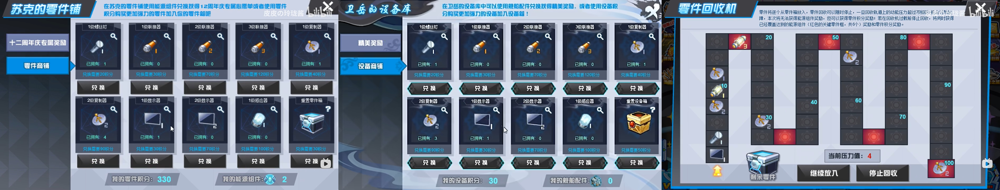

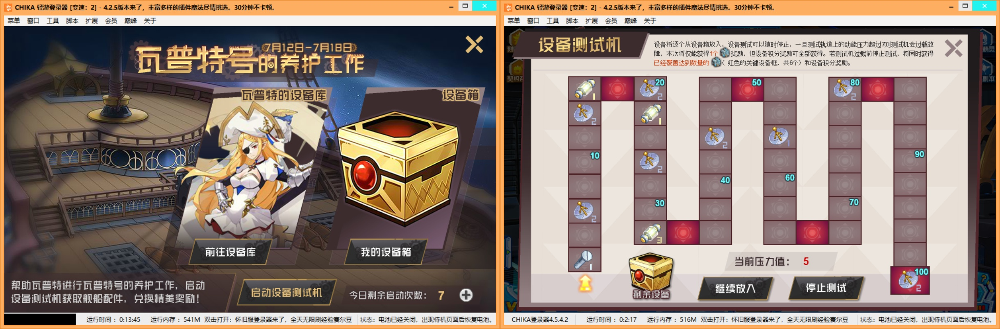

**个人攻略和感想**：前期肯定是稳健发育攒积分，过载几次也没关系。显示器和感应器的用处不大，只需考虑螺丝钉、级联器和复制器即可。积分够多时就要考虑组件期望长度大的阵容，一般有两种玩法：

1.  保守派，主买螺丝钉+联接器，拿稳定收益。
2.  激进派。全换复制器梭哈，靠着动力机自带的长度不断翻倍，大后期很好用。

玲珑酱 2021 年的 [攻略](https://www.bilibili.com/video/BV1Hg41137Up) 详细讲解了各个零件（P1），以及展示了激进派的打法（P2）。

我这么懒的人，当然是两次都复刻激进派玩法。大后期最多能拥有 $16$ 个二级复制器（最多 $25$ 个设备，$6$ 个动力机预留，一级螺丝钉、一级显示器、一级复制器强制各留 $1$ 个），有大概率能直接通到终点。

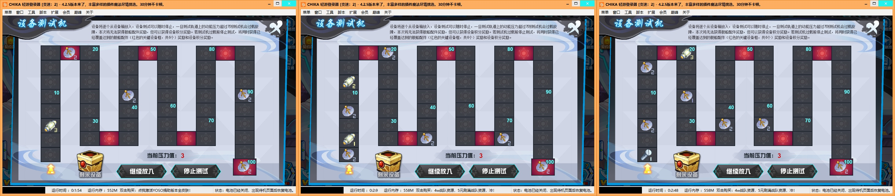

## 基站的文件梳理/霍光的武器库/芯片仓库的帮手/残局整理计划

**更新时间**：2022-7-8 基站的文件梳理 / 2023-6-16 霍光的武器库 / 2024-7-12 芯片仓库的帮手 / 2025-10-3 残局整理计划

**游戏规则介绍**：卡牌分为四种花色（草水火电），每种花色的点数分别是 $1 \sim 7$。初始时只有场上的四张牌是亮着的。总共有 $50$ 次操作机会，每次可以交换场下和场上的一张牌（如果场下的牌是暗着的就会被永久翻开），或者提交一个任务（如果场上的四张牌满足某种特定的规则）。操作次数耗尽时，提交的总分即为最后的得分。

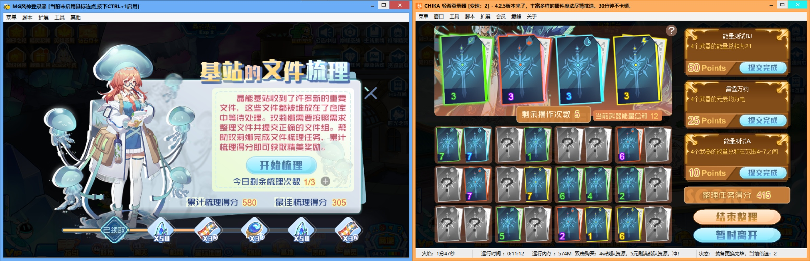

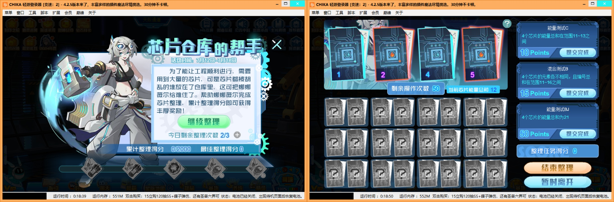

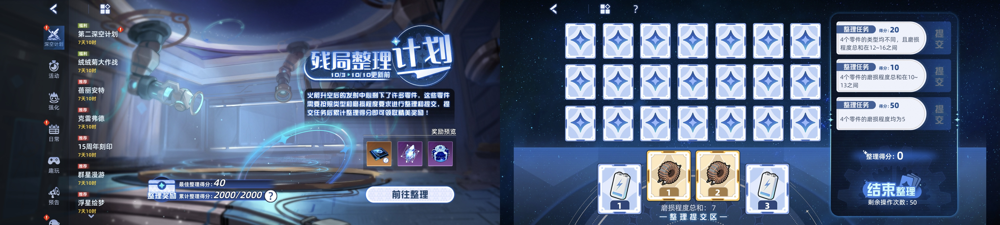

**个人攻略和感想**：我一般都是贪心地去完成收益最大的任务，适当的时候同时准备两三个目标。2022 年的时候还没有透视或者直通的脚本，打得特别痛苦，$305$ 已经算是高分。2023 年歆冉忆梦早早发布了透视脚本（后来还发了直通 ORZ），在总体决策保持不变的情况下，使贪心算法的得分率更高。比如上述第二张图，还剩五次操作机会，正好花三步把场上前三张替换成三张电属性的 $5,6,7$，剩下两步把前两个任务提交了，可获得 $480$ 分。

## 陨石鉴定室

**更新时间**：2024-7-5 陨石鉴定室

**游戏规则介绍**：与上海天文馆联动。通过模拟对未知陨石的磁力大小和表面特征，判断陨石的种类。

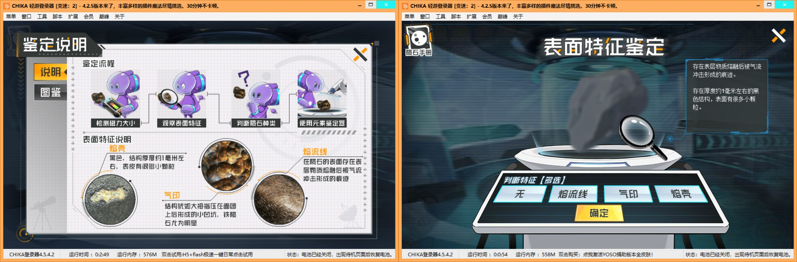

**个人攻略和感想**：难得一见的非策略类（知识类）小游戏，很有意义。

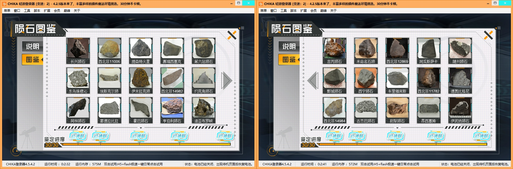

## 建材运输小分队

**更新时间**：2022-7-8 建材运输小分队 / 2023-11-7 兔兔送货快车

**游戏规则介绍**：左下角有大小为 $7$ 的材料槽，分为石块、木头、钢材和晶矿四种材料。还有四种不同的运输车，承载量分别是 $1,3,5,7$。每局游戏一共分为 $28$ 轮，每轮需要从中材料槽中选中某一种材料，并把全量的同种材料装填到同一辆运输车的剩余格子里，被移除的空位会立即刷新出新的材料。同一辆运输车必须装填相同的材料，可以分多个批次装，装满后会车会刷新。最后会根据 四种货车的运送趟数 以及 材料和运输车组合情况 来计分。

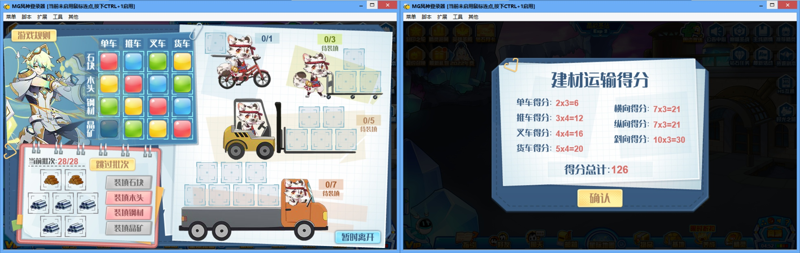

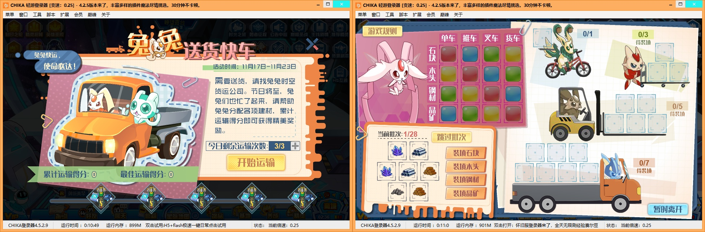

**个人攻略和感想**：我很喜欢的游戏。看起来运气比重很大，但较优决策能让得分下限很高。根据我的尝试，同一种材料刷至 $4$ 甚至 $6$ 个时会比较难受，因为新一个材料可能会迟迟不来，小车用完后就再也无法凑齐了。右图展示了我玩出的 $126$ 分，少了一种 单车+晶矿 让得分少了 $24$ 分。云端少女莫妮卡展示了一段 [$152$ 高分视频](https://www.bilibili.com/video/BV1T3411c7VD)。

## 点燃火焰阵

**更新时间**：2018-7-27/2019-7-19/2020-7-17/2021-7-23/2022-7-15/2023-7-21/2024-8-2 点燃火焰阵

**游戏规则介绍**：在规定时间内通过 22 关的一笔画。

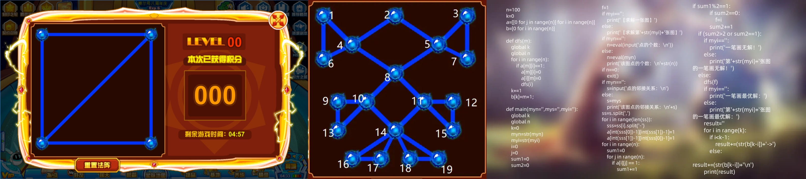

**个人攻略和感想**：属于是仲夏节的经典小游戏复刻了，无非就是一笔画问题（欧拉回路问题），全偶任意、双奇从奇出发。由于复刻次数多+解法亲民，B 站上到处都是讲解视频。2019 年橙汁的专栏 [用 Python 进行爆搜构造](https://www.bilibili.com/read/cv3129189)。

## 祭空之光

**更新时间**：2022-7-22 祭空之光

**游戏规则介绍**：通过旋转每个格子，使得管子的接口全都闭合且整张图形成一个大的连通块。

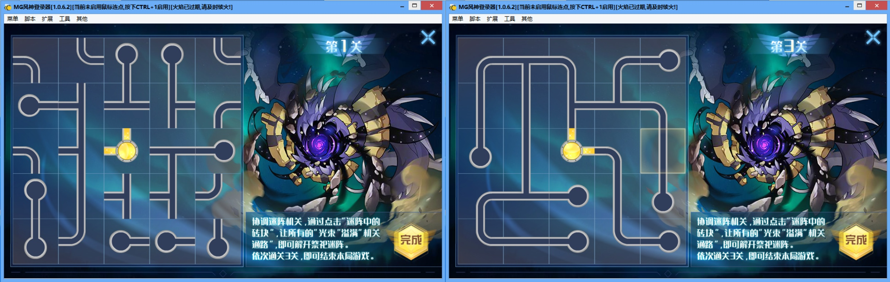

**个人攻略和感想**：和修复损坏设施的玩法类似。可以由外向内搞，优先从四个角开始确定。	

## 灼烈矿洞的尽头/激活安全通道

**更新时间**：2021-7-16 灼烈矿洞的尽头 / 2022-8-12 激活安全通道

**游戏规则介绍**：有一个 $2 \times 6$ 的矿洞，初始有一个大小为 $4$ 的卡槽（最多扩充至 $5$），每次选一张卡牌填充顶部或底部的一个还未填充的位置，使用完后立即刷新出一张新卡牌。每张卡牌都有危险值、财富值、开采值三种属性，卡牌组合时还可能会有特殊效果。要求在控制危险值不高的情况下，使财富值和开采值的最小值尽量大。

|     角色     | 位置 | 危险 | 财富 | 开采 |                      效果                      |
| :----------: | :--: | :--: | :--: | :--: | :--------------------------------------------: |
|   采矿团队   |  底  |  0   |  0   |  4   |                                                |
|   爆破小组   |  底  |  5   |  0   |  12  |                                                |
|    蜘蛛洞    |  底  |  2   |  0   |  0   |                                                |
|   生物猎人   |  底  |  0   |  0   |  2   | 每和一个蜘蛛洞/蝙蝠洞相连，加3点财富值和开采值 |
|     深坑     |  低  |  0   |  6   |  6   |               使用后减少一个卡槽               |
|     矿车     |  底  |  1   |  0   |  3   |               使用后增加一个卡槽               |
| 开采复合矿顶 |  顶  |  0   |  0   |  3   |                                                |
|   岩铁矿顶   |  顶  |  2   |  5   |  0   |                                                |
|   宝石矿顶   |  顶  |  3   |  8   |  0   |                                                |
|   加固矿顶   |  顶  |  0   |  2   |  0   |  如果左右两侧是岩铁/宝石矿顶，减少它们1危险值  |
|    蝙蝠洞    |  顶  |  2   |  0   |  0   |            右侧相邻矿顶的财富值翻倍            |
|     矿灯     |  顶  |  -3  |  0   |  0   |  若下方是采矿团队或爆破小组，额外减少2危险值   |
|   天窗通道   |  顶  |  0   |  0   |  0   |           使用后刷新卡槽里的所有卡牌           |

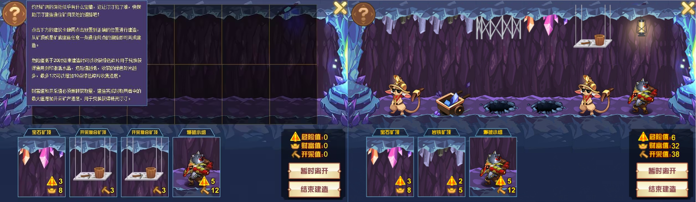

**个人攻略和感想**：我很喜欢的一个小游戏。由于写总结是在活动周的很久以后，我翻遍了 B 站的视频来摘录所有卡牌和对应的效果。像矿灯、矿车是属于看到了基本会用上的卡牌，一些常规矿顶和采矿人则要根据当前财富值和开采值的大小关系按需放置，而蝙蝠洞、蜘蛛洞、生物猎人这种卡牌就得靠技术动态决策了。

## 斯达伏尔的神秘礼物/瓦普特号的欢迎礼/森林中的秘宝/皮神的考验

**更新时间**：2021-7-16 斯达伏尔的神秘礼物 / 2022-8-12 瓦普特号的欢迎礼 / 2023-12-15 森林中的秘宝 / 2025-2-28 皮神的考验

**游戏规则介绍**：猜出宝藏的四位密码。四位数字严格递增，范围是 $1 \sim 9$，颜色分为黑白两种，颜色相同时认为白色大于黑色。右侧已经给出了一些不存在的数字，左侧还会给出三组提示，其中两组形如“不存在某三个数字”，另外一组形如“奇数数量和偶数数量的大小关系是 xxx”、“四位密码的和是 xxx” 或 “两端的最值相差 xxx”。

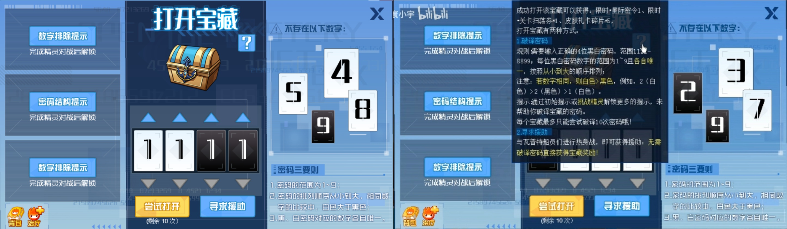

**个人攻略和感想**：绝大部分情况下解都不会超过 $10$，人脑爆搜的话按字典序从小到大猜比较不容易乱。

## 修复损坏设施

**更新时间**：2021-8-20/2022-7-20/2023-7-30 修复损坏设施

**游戏规则介绍**：每一个格子里的管道可以旋转，要连通电线头到电线尾。

**个人攻略和感想**：难度不大但是很繁琐。根据这个游戏的 idea 出了道 [牛客多校题](https://ac.nowcoder.com/acm/contest/11166/E)，本来想出更难的策略类的题失败了，变成了 BFS 模拟题。我还找到了一个拓展后的游戏：https://hexapipes.vercel.app/hexagonal。

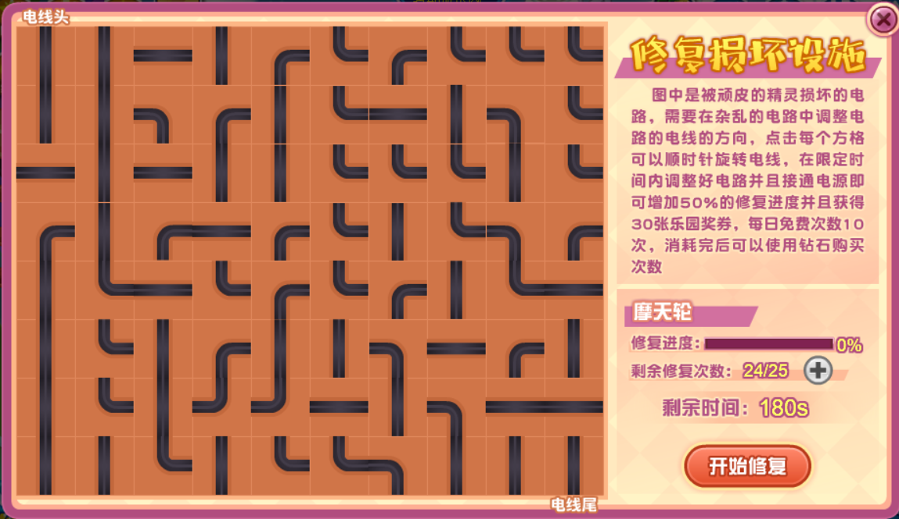

## 激战深海古龙

**更新时间**：2025-8-2 激战深海古龙

**游戏规则介绍**：整局游戏本方和敌方都有一个血量。每一轮敌方会生成三个猜拳意图和对应攻击，本方会随机 $6$ 张手牌（没用完的累积，最多到 $8$ 张），每张手牌会有个猜拳结果和攻击力值，将手牌分配到不同的意图上去，可消减敌方的攻击值，消减过 $0$ 后变为本方对敌方造成伤害。你需要在整局游戏里不死亡的情况下击败敌方。

每张手牌提供的折算伤害=卡牌的数值*克制关系。克制关系集合为 $\{1/2,1,2\}$。

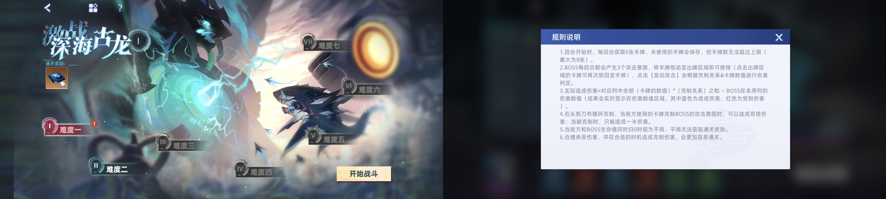

**个人攻略和感想**：看起来只是个猜拳的游戏，意外还蛮好玩的。如果追求单局得出尽量高的总分，你可能是将大量相同结果全部攻击在具有优势的意图上。这个游戏需要保证自己的血量健康，即每一轮“宁可少获得一些正攻击值也不要让本方消耗太多血量”，这意味着猜拳的手牌需要尽量均分到每个攻击意图上。

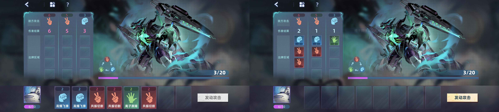

## 魅星结巧

**更新时间**：2024-8-9 魅星乞巧-魅星结巧 / 2025-8-29 魅星结巧

**游戏规则介绍**：有蓝色和黄色两种数字，1-6 各自有两张，7 各自有一张（随着游戏的进行会补充 7 的数量）。当结巧次数 = 0 时整局游戏结束。每次结巧前，可以进行一次打开暗巧或无限次换巧的操作；结巧后，根据所选的四个数字组合计算其分数，牌型包括单张、双张、三张、四张、顺子、同花，越稀有的组合得分越高（类似于德州扑克的牌型）。单局游戏中结巧的分数会不断累积，并阶段性地补充结巧、换巧、打开暗巧的次数。

| 概念     | 效果    |
| -------- | ---------------------------------|
| 打开暗巧 | 默认情况下第一排只有三个数字，打开暗巧后可加入第四个数字    |
| 结巧     | 从第一排的三个或四个数字中选择两个，与第二排一起构成四个数字的组合，并累积分数 |
| 换巧     | 指定第二排里两个数字中的一个，刷新其数字                     |

2024 的版本里，总积分每达到一定阈值，可依次开启三个永久 buff。

| 概念     | 效果    |
| -------- | ---------------------------------|
| 巧手之赐 | 分数 $\ge 200$ 触发，每次结巧前的第一次换巧不消耗次数 |
| 星月之祇 | 分数 $\ge 400$ 触发，牌库中额外增加一张黄 7 和一张蓝 7 |
| 乞巧之东 | 分数 $\ge 600$ 触发，每打出一张 7 就额外提供 7 点分数 |

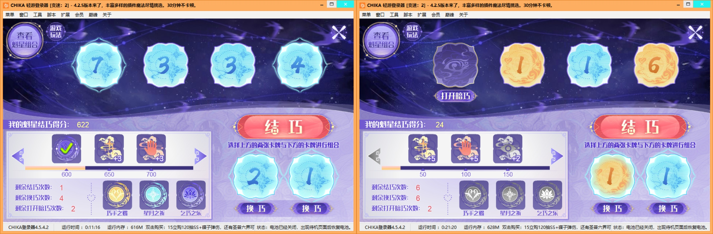

2025 的版本里赐福变得更加多样，总共可以获得三个英雄 buff，若某两个英雄结成对还能获得组合效果。

| 英雄                       | 效果                                                |
| -------------------------- | --------------------------------------------------- |
| 天蛇太祖                   | 牌库中额外加入两个类型的 $3$                        |
| 艾夏拉                     | 结巧时每打出一张数字 $3$ 额外获得 $3$ 分            |
| 浪漫誓约=天蛇太祖+艾夏拉   | 每个回合首次换巧不消耗次数                          |
| 瑞尔斯                     | 每打开 $3$ 个暗巧获得 $1$次结巧次数                 |
| 波西利亚                   | 每消耗 $4$ 次换巧次数获得 $1$ 次结巧次数            |
| 乞巧心语=瑞尔斯+波西利亚   | 每结巧 $5$ 次获得一次结巧次数                       |
| 文森特                     | 结巧时打出卡牌全是奇数则额外获得 $10$ 分            |
| 贾斯                       | 结巧时打出卡牌全是偶数则额外获得 $10$ 分            |
| 宝石童话=文森特+贾斯       | 结巧时打出卡牌奇偶数相同则额外获得 $30$ 分          |
| 墨影星魂                   | 牌库中额外加入两个类型的 $5$                        |
| 月照星魂                   | 每次结巧时额外获得 $5$ 分                           |
| 仙境奇缘=墨影星魂+月照星魂 | 每次结巧时如果包含 $5$，获得换巧和打开暗巧各 $1$ 次 |
| 阿洛希尔                   | 结巧时每打出一张数字 $1$ 额外获得 $10$ 分           |
| 蔻缇雅                     | 结巧时若打出数字 $7$ 额外获得 $1$ 次结巧次数        |
| 失约之宴                   | 结巧时若同时打出 $1$ 和 $7$ 则分数翻倍              |

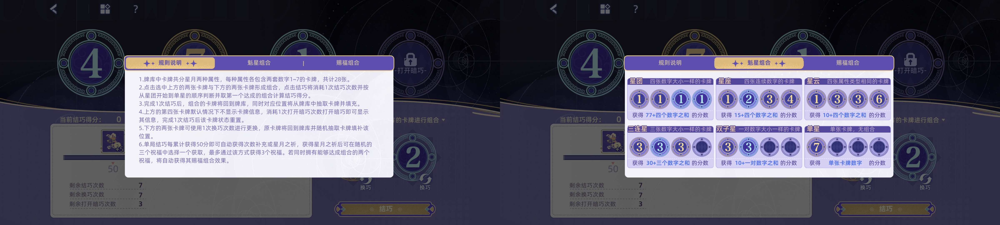

**个人攻略和感想**：有换巧和暗巧的存在，星云和星座很容易达成，所有每次结巧前尽量避开双子星和单星。这游戏主要原则是不要上头，在一次结巧里花太多资源。三连星的概率比较低，星团的概率更不必说，所以小数字的三连星完全没必要冲星团。德扑玩家需注意：牌型能获得的分数不是严格单调的，数字大的牌面更有优势。

2024 年的版本里，刀锋下的阴影7 有 $1038$ 分的 [视频实录](https://www.bilibili.com/video/BV142YLeYEdp)，我玩到过 $1022$ 分。

2025 年的版本里，我觉得阿洛希尔+蔻缇雅的组合是最强的，只要随到数字 $7$ 就能白送一次次数，而且组合 buff 能让 $1/7$ 组合的分数翻倍，我在单次结巧时通过 $1+1+1+7$ 刷到 $152$ 分，那局总分高达 $1451$ 分。

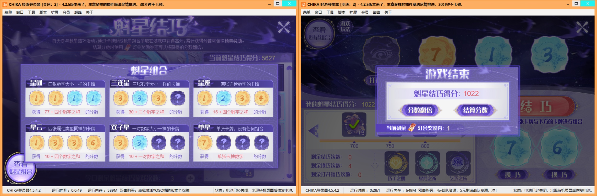

## 咫的强制净化

**更新时间**：2022-8-11 咫的强制净化

**游戏规则介绍**：一共有六种卡牌。每次卡槽里会刷新五张卡牌，可选择若干张进行重随，重随次数不能超过两次。同时拥有四种技能，每种技能在不同的等级时有不同的效果。当五张卡牌契合了某个技能后，点击使用后可以获得 联结 或 大地能量（若同时满足多个技能只能选一个）。大地能量用于技能升级，联结用于计分。

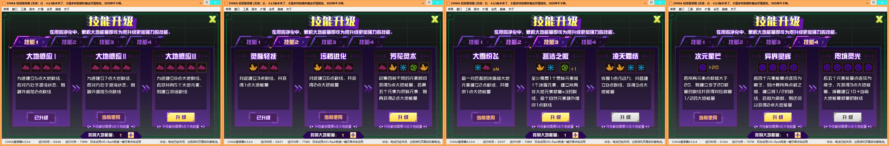

**个人攻略和感想**：三级大雪纷飞可以恢复行动力，我早早地就升级了，但实际上很难凑到，而且如果专门去凑它会让别的技能的符合率降低。实战里还是前两个技能最好用：重随的目标很接近，尽可能的搞出更多的大地感应；缺大地能量就用第二个技能，不缺就用第一个技能。当初始时点数和较大时，可以考虑重随小的冲第四个技能。

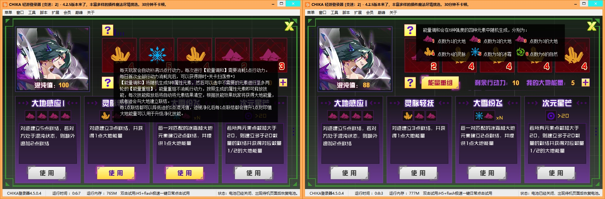

## 浪浪山切磋大会

**更新时间**：2025-8-22 浪浪山切磋大会

**游戏规则介绍**：每天的 $12:00$ 和 $20:00$ 各会解锁两项战斗，每项战斗的两个参与者会给出具体的技能和被动信息，到点后会模拟战斗并算出获胜者。根据人气给予赔率大小，你可以对某人押注来赚取道具。

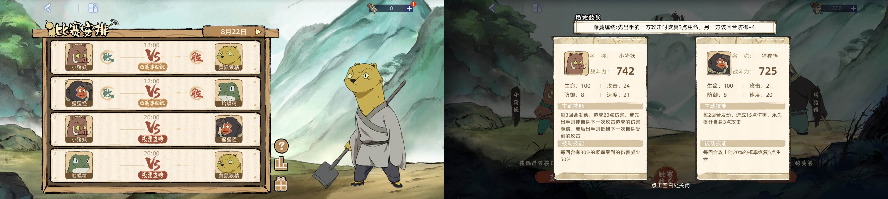

**个人攻略和感想**：这个游戏挖掘起来其实挺有意思的，听群友说写了脚本去模拟，不过我没有深究。

## 重塑之子的挑战

**更新时间**：2024-8-23 光夜天地的封印-重塑之子的挑战

**游戏规则介绍**：每局游戏消耗一点解析力，会从 6 种花色和点数的组合中选出可重复的五个。有最多两次调整机会，每次可以选择任意多个进行重随。一共有四种技能，每种技能都有三个等级，需要用神谕之力升级。如果某局游戏的花色和点数达成了某个技能的要求，则会对造成一定的伤害 和/或 获得一些神谕之力。总共有五个成就：打破敌方护罩，打破后累计伤害 $200$，单次造成的伤害 $>15$，累计获得 $30$ 点神谕之力，解锁所有技能全等级。

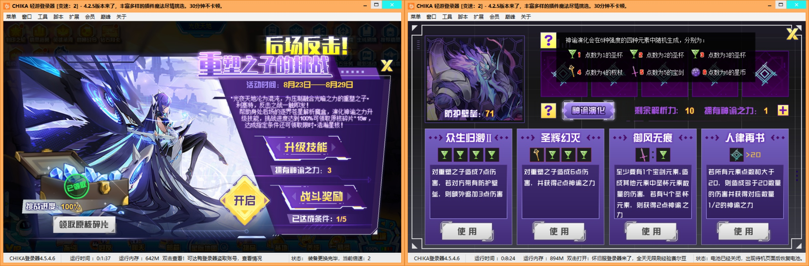

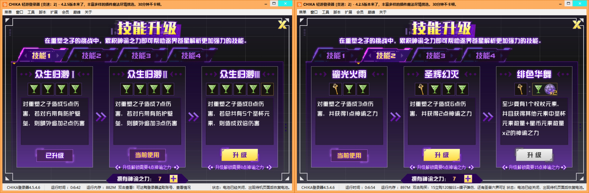

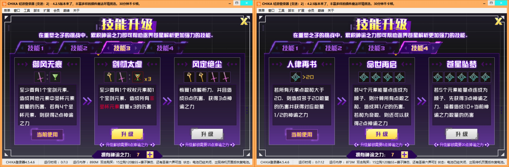

**个人攻略和感想**：这个游戏的策略性不高，各种分支进化都能玩，反正有个成就是要解锁所有技能所有等级。

+   技能 1 系列：主打伤害型。由于圣杯单次刷出的概率高达 $1/2$，结合两次重随很容易达到四或五个圣杯。在 boss 有护罩时用等级二打，等效为 $10$ 伤害；后期刷“单次伤害超过 $15$”的成就时可以用等级三刷。
+   技能 2 系列：主刷神谕之力。等级二刷出的概率挺高，中期可以用等级三刷，平均一把能刷 $\sim 4$ 个。
+   技能 3 系列：主打混合，等级三的风定绝尘很赖皮，可以恢复游戏次数，当然比较难刷出来。
+   技能 4 系列：比较微操，对点数之和和顺子都有很大的要求。大后期可以用等级三刷伤害成就。

## 跨越星河的凤灵

**更新时间**：2022-8-26 跨越星河的凤灵

**游戏规则介绍**：一共有 10 关，每一关操纵凤灵上下左右在格子里移动，每个格子只能经过一次。箱子可以朝移动方向推动，各种颜色的路障在对应按钮被经过后解除。要求收集完三颗星星并从入口走到出口。

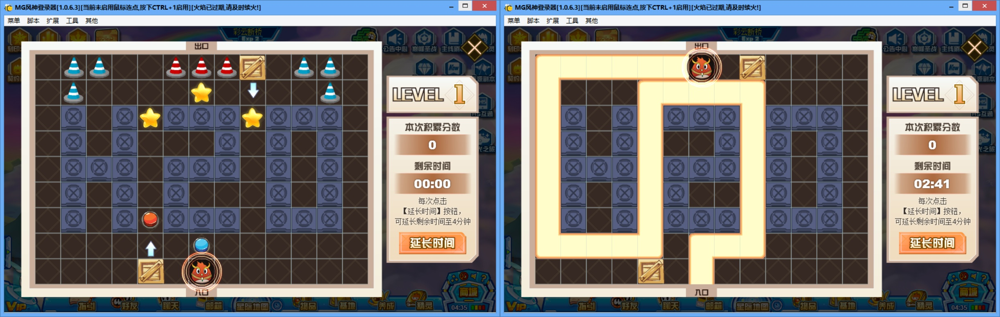

**个人攻略和感想**：相当于是强化版的推箱子游戏，手完还是很有意思的。B 站上萌小新心发过全关的 [攻略视频](https://www.bilibili.com/video/BV1Gd4y1N7Tz)。

## 排列货物

**更新时间**：2022-8-26 排列货物

**游戏规则介绍**：一共有九个关卡，每个关卡会给出货物的初始阵型和目标阵型，利用上下左右去移动货物。按下方向键后，所有货物都会朝着那个方向移动，直到撞到边界或其他货物。任何时刻可重置至初始阵型。

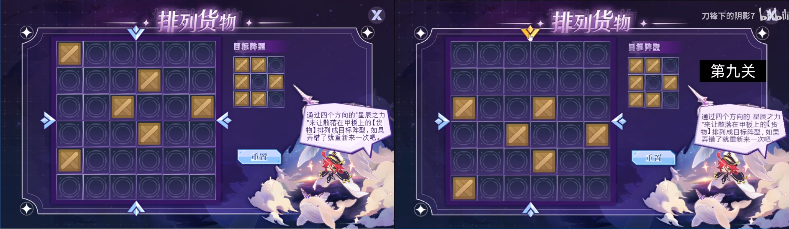

**个人攻略和感想**：估计是某个经典游戏的复刻，手完还是比较有意思的。刀锋下的阴影 7 出过一个 [完整攻略](https://www.bilibili.com/video/BV17g411D7R5)。

## 命轨交织

**更新时间**：2025-8-29 命轨交织

**游戏规则介绍**：有若干个关卡，每个关卡要尽量少地旋转格子，使得两个英雄能连通且通道最中心。

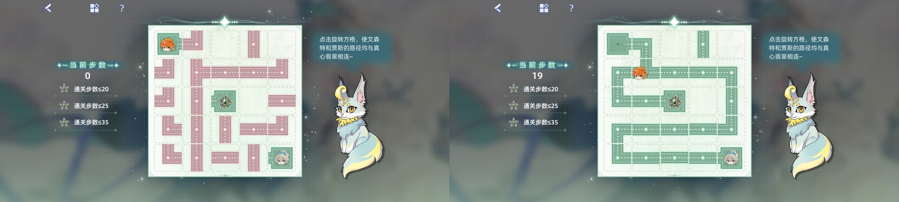

**个人攻略和感想**：类似于修复损坏设施或祭空之光，无聊的转水管小游戏。

## 物资补给

**更新时间**：2025-9-12 深空计划-物资补给

**游戏规则介绍**：给出若干个谜题，每个谜题要将给定的多边形不重不漏地覆盖所有需要填充的格子。

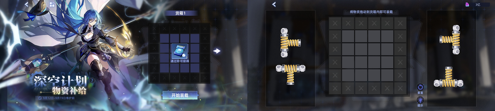

**个人攻略和感想**：设计得挺有意思。这个问题深挖下去难度很大，而给出的几个谜题简单尝试即可破解。

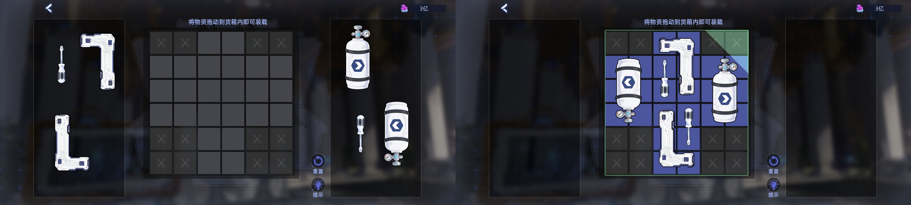

## 封绝之阵/瓦普特号修复计划

**更新时间**：2021-9-10 封绝之阵 / 2022-10-21 瓦普特号修复计划

**游戏规则介绍**：$5 \times 5$ 的棋盘，玩家和电脑交替行动。电脑只有一种棋子，摆出特定的阵型时随机移除一颗玩家的棋子；玩家有风火水地四种棋子，摆出特定的阵型时会产生特殊的效果（见左下）。每回合系统会随机两个不同的棋子，玩家选一个摆放。玩家还能预知下一回合的两个棋子。当棋盘上已经没有棋子时，按场上的棋子个数结算胜者。该游戏还有一个成就系统，达成过某种局面才能解锁（见右下）。

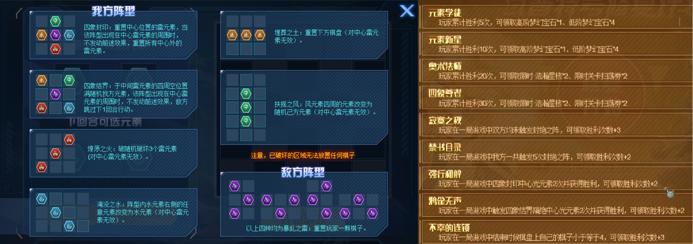

**个人攻略和感想**：敌方阵型预判起来比较麻烦，我在思考时直接把游戏简化成“敌方每落下一颗棋子就有概率移除己方一颗棋子，且敌方在战场上的棋子越多，这个概率就越大”。四象封印和四象结界难记，也不方便多次触发，除了为了解锁相关成就外不推荐使用。土和风比较容易触发（横竖放比斜着放的方案更多），但会影响到自家的棋子的状态（前者会移除，后者会重随），容易打破自己的计划。实战中效果最好的是火，**无条件移除敌方三个棋子并把对应位置置为不可用**，不仅能直接优化目标函数，还能加快游戏进度，一举两得。还有一个小技巧：开场时优先把火放在靠中间的对角线上，因为满三个触发一次后，再在边上补一个又能触发一次。

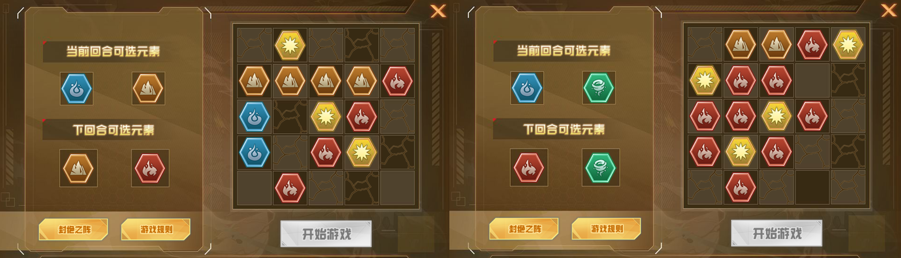

## 玖莉娜的原石小铺/沙滩上的秘宝

**更新时间**：2022-9-30 玖莉娜的原石小铺 / 2023-8-25 沙滩上的秘宝 / 2024-6-21 漫游洛林卡-遗迹石大鉴定

**游戏规则介绍**：一颗原石被分成八块，每块都有概率是六种材质之一。不同材质的出现概率和价值不同。每次可以翻开一块原石，或者将其出售（结束游戏）。出售时的售价是当前已翻出原石售价的平均值。

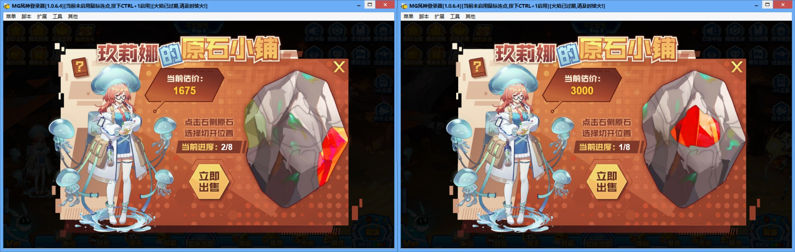

**个人攻略和感想**：收益最大的策略比较显然，就是先根据不同材质的出现概率和价值计算翻开一块的期望价格，只要期望价格比当前估价高就继续翻。实际玩的时候可以简单预设一个阈值，低于阈值就一直翻。

## 时空珠玑的启示/启动时钟轮盘/机巧之屋

**更新时间**：2021-12-3 时空珠玑的启示 / 2023-9-9 启动时钟轮盘 / 2024-9-6 机巧之屋

**游戏规则介绍**：一共有 $4/5$ 个钟，初始时每个钟的指针指向 $12/4$ 个方向之一。每次可以拨动某个指针，会带动相邻的指针一起转动。要求把所有钟的指针都指向零的位置。2021 年的版本其实是一个支线任务，只要把所有时钟修复完毕即可。2023/2024 年变成了小游戏，新增了时间限制：简单模式限时 60 秒，困难模式限时 20 秒。

**个人攻略和感想**：直接按从左到右的顺序依次修复每个钟即可。

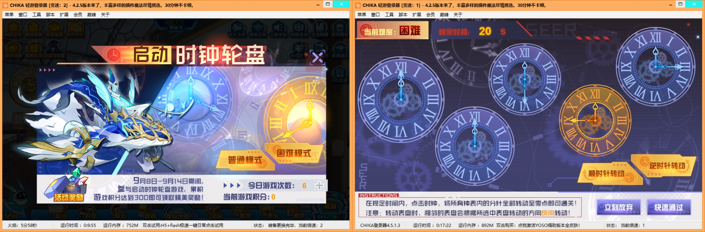

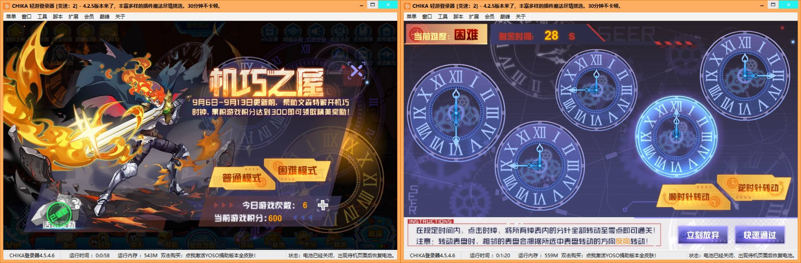

## 劳动节模范表彰大赛/东辉的委托/商业街之星

**更新时间**：2021-5-1 劳动节模范表彰大赛 / 2023-9-28 费尤迅游航线-东辉的委托 / 2024-9-27 商业街之星

**游戏规则介绍**：总共有花园、医院、工地、教室四个场地。每局游戏玩家操控一个角色和 4 个 NPC 对战。初始时默认有 12 枚棋子，每一轮会对四个场地各随机一组分配，从中选择一种进行投放。当所有人的棋子投放完毕后，依次结算每个场地的得分——投放棋子数量前三的角色能获得递减的奖励分。特殊地，如果场地上存在至少两个角色投放了相同数量的棋子，那么他们都不能计入该场地的得分结算。根据比赛结束后我方的得分发放奖励。

一共有五个角色，需要依次解锁。每个角色有一个一直存在的被动技能和一般只能使用一次的主动技能。

2024 版本把角色换成霍光、墨纪拉、未明、倪克斯、阿尔斯兰，场地换成咖啡厅、占星铺、事务所、唱片店。

| 角色     | 被动技能              | 主动技能                                            |
| -------- | --------------------- | --------------------------------------------------- |
| 伊芙莉莎 | 每轮若选花园则增加1枚 | 跳过当前回合，并使花园里的我方棋子数量翻倍          |
| 喵佐     | 每轮若选医院则增加1枚 | 跳过当前回合，移除花园、教室、工地内非己方棋子各1枚 |
| 科穆宁   | 每轮若选工地则增加1枚 | 跳过当前回合，每个场地若我方棋子数量为奇数则增加1枚 |
| 潘多拉   | 每轮若选医院则增加1枚 | 跳过当前回合，要求其他角色在当回合必须选择教室投放  |
| 菲克曼   | 初始时棋子额外增加2枚 | 跳过当前回合。最多可使用三次。                      |

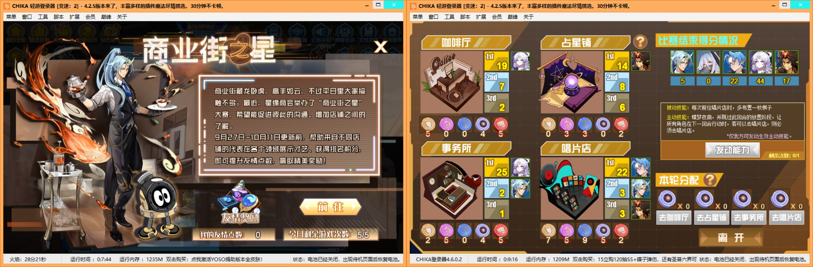

**个人攻略和感想**：五人混战+每轮随机分配棋子数，整体比较混沌。我会根据每个场地的赋分情况和当前角色的特性来分配棋子（第一得分特别高就猛压，如果二三得分也差不多就佛系分配，有些地方战略性放弃）。

## 萨特的鼓点特调/豹豹大师的料理研究所

**更新时间**：2023-9-28 亿万星辰的遥望-萨特的鼓点特调 / 2024-8-16 豹豹大师的料理研究所

**游戏规则介绍**：在调制风格、饮料基底、额外配料中各选择一项，使得甜味、浓度、香气三个属性都达到完美。每个选择可能会提高或降低属性。每种属性只有在恰好一个数值达到完美，高了会过量低了会不足。

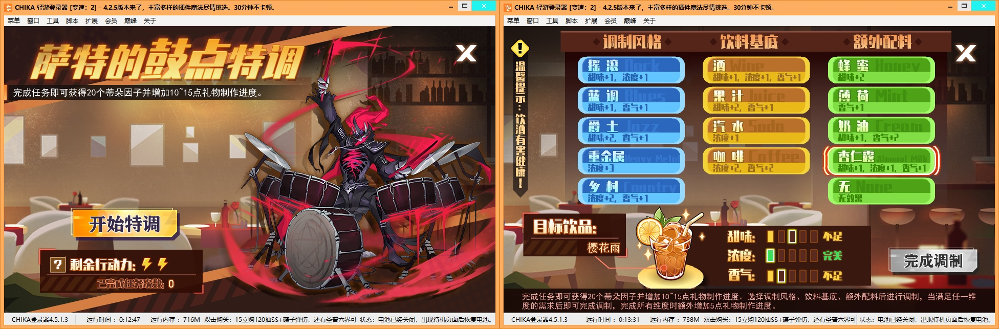

**个人攻略和感想**：其实就是跑一个规模很小的动态规划，人肉调整还是挺麻烦的。

## 满月再现

**更新时间**：2024-9-13 夜影伴月圆-满月再现

**游戏规则介绍**：每局游戏有若干个关卡，每个关卡分为若干个回合。每个回合先是玩家控制阿尔莫莫和阿尔达克往一个方向滑动（遇到障碍物或墙壁后停下），滑过的格子会被覆盖成黄色；然后两个黑色块各自随机往一个方向滑动，滑过的格子会被覆盖成灰色。阿尔莫莫/阿尔达克遇到黑色块后会湮灭，要求全部湮灭后黄格子多于黑格子。

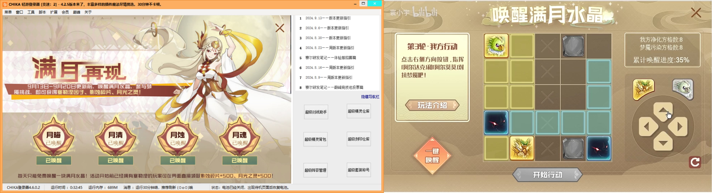

**个人攻略和感想**：应该是复刻了很早之前的小游戏。满了就主动装，不满就多划划，全凭感觉。

## 朔星庆典

**更新时间**：2024-9-19 朔星庆典

**游戏规则介绍**：每个关卡要求把造型从初始态变换成目标态。每次可以选择一个方向，将所有盆栽都沿着这个方向滑到不能再滑的位置（碰到墙或其他盆栽）。每个关卡最多使用一次帮助行动，可以将一盆盆栽移动到指定位置。

**个人攻略和感想**：很经典的一个小游戏了，大脑深搜起来还是挺难的。

## 守护者的考验/北鸟的考验/桑多姆的委托

**更新时间**：2021-9-30 净化飓风星云-守护者的考验 / 2023-9-28 费尤迅游航线-北鸟的考验 / 2024-9-6 桑多姆的委托

**游戏规则介绍**：道路上有八个格子，指挥两个英雄在格子上行走，一个只能从左到右，一个只能从右到左，不能重叠在某一个格子。当双方各自抵达对方所在的位置后，交换双方的位置并重置八个格子的效果。一共有四种元素，每个格子踩上去后都会触发特定的效果。八个格子中，有六个格子是获取某种元素的一个资源，还有两个格子会有特殊的效果，详见下表。每次行走会累积腐化度，当腐化度超过 100 后无法行动。如果积累的元素个数满足某个屏障的要求，可解锁屏障并清除腐化度（屏障必须按顺序解锁）。任何时刻都可以重新开始。

| 效果名   | 效果                                         |
| -------- | -------------------------------------------- |
| 圣光领域 | 占领时，移动所需能量值减少 1 点              |
| 珍宝之泉 | 到达时，增加拥有数量最少的资源 5 个          |
| 异度空间 | 到达时，交换两只精灵的位置（不触发场地效果） |
| 魔力增幅 | 占领时，在元素区域收集到的资源数量翻倍       |
| 元素之坛 | 到达时，获得所有元素资源各 1 个              |

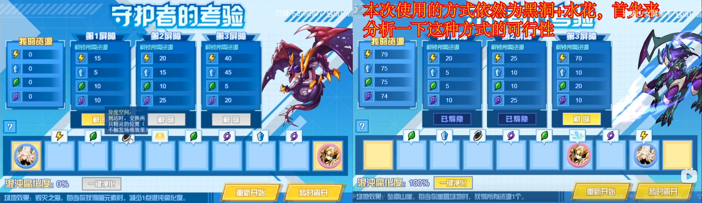

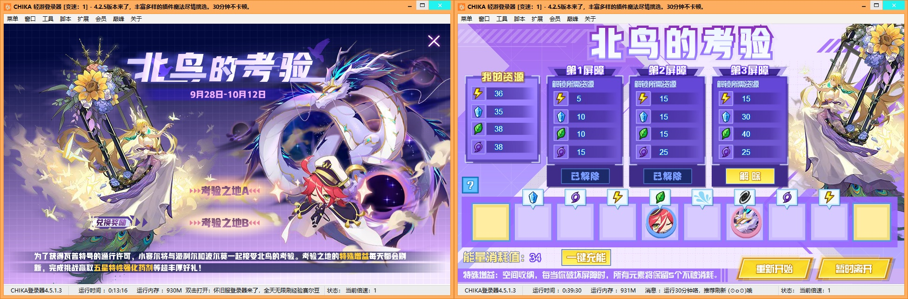

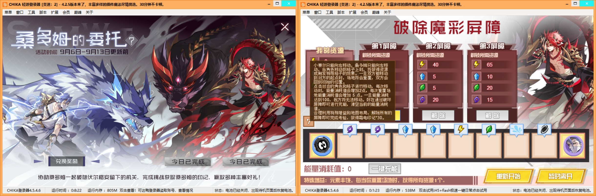

**个人攻略和感想**：很有意思的一个游戏。如果纯靠瞎走，很难解锁所有的屏障。注意异度空间可以让双方无限在道路上行走，再结合获取资源较快的珍宝之泉能够达成每三回合两次收集资源（有一次是珍宝之泉）的循环。我们可以通过不断按重新开始来刷新初始地图，直到珍宝之泉和异度空间同时刷新在地图上，然后按上述的方法循环，当腐化度/能量值慢了后解锁一个屏障并继续循环。某几天的屏障会比较阴间（比如第三道屏障对某个资源的要求特别多），可以参考各大 up 主的进一步详细分析，比如云端少女莫妮卡在 2021 年的 [攻略](https://www.bilibili.com/video/BV19h411n7tK)。

## 圣殿的试炼/南霜的试炼

**更新时间**：2021-9-30 圣殿的试炼 / 2023-9-28 费尤迅游航线-南霜的试炼

**游戏规则介绍**：卡牌游戏，玩家操控某个角色和 NPC 对战。双方都有 6 种数值，初始为：攻击 3，防御 2，勇气/生命 10，决心/PP 0，崇高/冷静 0，堕落/狂热 0。卡牌会对双方的属性造成影响。进攻时，对方的生命会减少自身攻击值与对方防御值的差。当某方生命值降为 0 时游戏结束。使用卡牌需要消耗决心/PP，每回合结束后恢复 3点决心/PP。2021 版本是圣化战联对战圣殿英雄，当时没有详细测试；2023 版本做了详细测试。

卡牌数值一览（靠后的似乎是 2023 版独有的）

| 卡牌名        | 消耗决心 | 效果                                                         |
| ------------- | -------- | ------------------------------------------------------------ |
| 坚定/蓄势     | 0        | 令自己决心/PP+3                                              |
| 鼓舞/再生     | 1        | 令自己勇气/生命+10                                           |
| 宣战          | 1        | 令自己攻击+2                                                 |
| 冲锋          | 1        | 以攻击值发起攻击                                             |
| 盾击          | 1        | 以防御值发起进攻                                             |
| 守御          | 1        | 令自己防御+2                                                 |
| 决斗          | 3        | 扣除消耗后，以决心值发起攻击                                 |
| 决战/全面进攻 | 1        | 以自己的攻击值、防御值、决心值分别发起进攻                   |
| 指引          | 5        | 令自己攻击提升自己的崇高/冷静值（自己崇高/冷静值小于 3 无法使用） |
| 捍卫          | 5        | 令自己防御提升自己的崇高/冷静值（自己崇高/冷静值小于 3 无法使用） |
| 拥抱/安抚     | 3        | 造成对手堕落/狂热值三倍的伤害并清零（自己崇高/冷静值小于 5 无法使用） |
| 希望/沉着     | 1        | 令自己崇高/冷静+2                                            |
| 绝望/激动     | 1        | 令自己堕落/狂热+2                                            |
| 审判/决绝     | 3        | 以自己崇高/冷静的3倍发起进攻                                 |
| 降临/镇定     | 3        | 清楚自身堕落/狂热，令崇高/冷静翻倍                           |
| 激进          | 5        | 令自己狂热提升50%（自身狂热小于 3 无法使用）                 |
| 猛攻          | 3        | 以自己狂热的3被发起进攻                                      |
| 热血          | 3        | 将自己的冷静转化为狂热                                       |
| 安定          | 3        | 令自身除狂热、冷静外所有数值上升冷静值（自身冷静小于 5 无法使用） |
| 狂烈          | 5        | 令自身除狂热、冷静外所有数值上升狂热（自身狂热小于 5 无法使用） |
| 净世/霜冻     | 5        | 令对手烧伤/冻伤（每使用一张牌，生命-2）                      |

2023 版玩家会随机抽取到的对手的英雄和技能：

| 对手技能    | 消耗决心 | 效果                                                         |
| --------- | -------- | ------------------------------------------------------------ |
| **彼尔德** |          | 回合结束时冷静+1                               |
| 踏霆礼赞  | 7        | 以自身冷静的平方发起进攻，然后将冷静值变为 0                 |
| 稳如磐石  | 3        | 令自己冷静+1，自身每有1点PP，冷静额外+1                      |
| **灼云**  |          | 回合结束时对方冷静-1，狂热-1                                 |
| 嫣然灼魂  | 5        | 以攻击值发动进攻，自身每有1点冷静，恢复1点生命，并令对手生命-1 |
| 媚云遮眼  | 3        | 以攻击发动进进攻，令对手疲惫（技能补充后，随机一个技能无法使用） |
| **涡锋**  |          | 回合结束时冷静+1，狂热+1                                     |
| 狂鲨噬猎  | 5        | 造成对手狂热值3倍的发起2次进攻并清零（自己冷静与狂热差小于 5 无法使用） |
| 鲛鲨行狩  | 5        | 自身冷静值提升对手狂热的数值，然后以自身冷静发动进攻         |
| **吉拉提斯** |          | 回合结束攻击+1，狂热+1                                       |
| 以风易寒  | 5        | 令对手狂热提升自身狂热值，令对手冷静下降自身冷静值           |
| 沧流止啼  | 7        | 以狂热发动进攻，令对手疲惫、冰封                             |

2023 版玩家能选取的英雄技能：

| 自身技能    | 消耗决心 | 效果                                                         |
| --------- | -------- | ------------------------------------------------------------ |
| **派利尔** |  | 回合结束冷静+1 |
| 耀霆之力/谜度空间 | 5 | 令对手攻击、防御、生命-1，令对手疲惫 |
| 穿云入梦 | 5 | 以攻击、冷静分别发动进攻，令对手疲惫 |
| **波尔莫** | | 回合结束攻击+1 |
| 圣耀明瞳/羽息瞬破 | 5 | 以攻击、冷静分别发动进攻，令对手睡眠（技能无法获得填充） |
| 垂宇龙吟 | 5 | 以冷静发动进攻，令对手攻击、防御-1，令对手睡眠 |
| **马里诺** |  | 回合结束PP+1 |
| 深水突进 | 5 | 以攻击发动进攻，然后对手生命-2，自身生命+2 |
| 圣地擎山/远程锚击 | 7 | 令自己防御+1，攻击+1，然后以攻击、防御分别发动进攻 |
| **巴尔奇** |          | 回合结束防御+1                                               |
| 铁拳粉碎 | 5 | 将对手的防御视为0，以攻击发动进攻 |
| 恐惧战意  | 7        | 令对手攻击、防御变为原本值                                   |
| **萨洛科** |          | 回合结束冷静+1，狂热+1                                       |
| 湍流阵法 | 5 | 令对手攻击、狂热、冷静-2，自身攻击、狂热、冷静+2 |
| 山呼海啸  | 7        | 令自己攻击、冷静变为二者之和，然后以冷静发动进攻             |

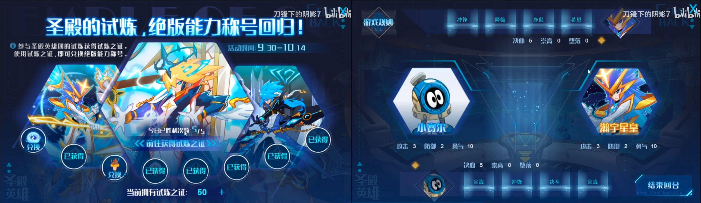

**个人攻略和感想**：卡牌和技能搞得很复杂，但实际游戏策略很简单——由于没有负作用的卡牌，在 PP 够的情况下肯定是能用就用。由于卡牌中有很多按比例提升数值的技能，可能会让双方的属性提高到很夸张的地步。

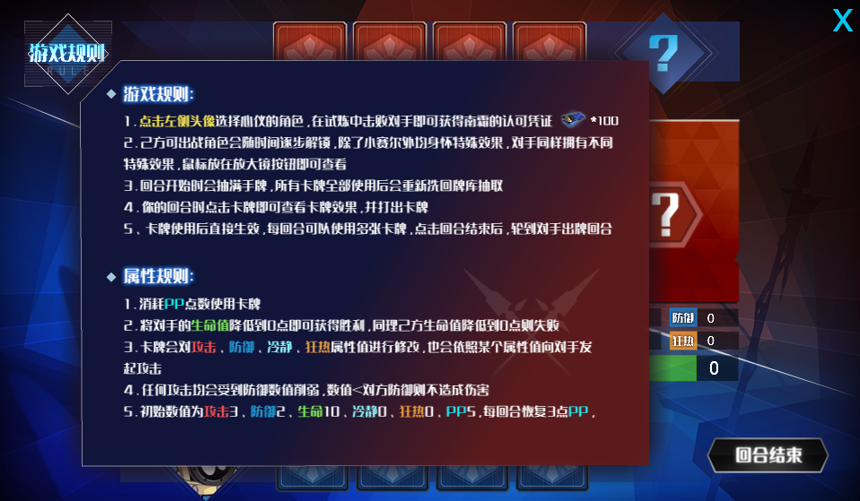

## 勇往直前！宝藏探险！

**更新时间**：2022-9-30 勇往直前！宝藏探险

**游戏规则介绍**：若干个的探险小队，每个小队在调查能力、战斗能力、采集能力上各有千秋。每天每个小队只能派去一张地图，每张地图对不同能力的要求各不相同。探索完毕后会增加地图探索度并概率掉落装备。装备会有一些特殊的能力加成，派遣一个小队时最多使用一个道具。前一张地图探索度达到 $50\%$ 才会解锁下一张地图。

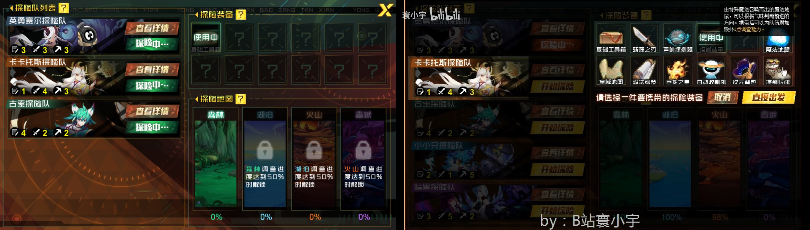

**个人攻略和感想**：整个游戏比较休闲，全勤的话每天无脑派队伍也能拿满奖励。如果要最小化刷满探索度的天数，则应该根据小队各自的特点，在探险队和地图之间做一个匹配。每张地图要优先达到 $50\%$，加快并行化程度。

## 挑战元素沙盘

**更新时间**：2022-8-26 挑战元素沙盘 / 2023-10-20 挑战元素沙盘

**游戏规则介绍**：每局游戏玩家和 AI 轮流操作，抢占地图里那些还未被抢占的格子。每轮开始时，先投掷一个四面的骰子（玩家最多可重置一次），然后可以在地图上点亮至多一个该图案对应的未被占据的格子。首轮可以点亮标有该图案任意格子，接下来每轮点亮的格子必须和自己已占据的某个格子相邻（四连通）。游戏中还有季节系统，如果骰子正面朝上的图案和当前季节对应，这个图案也无需和自己已占据的格子相邻。有三种不同的模式：

1. 全面战争：玩家和 AI 谁占据的格子多谁获胜。
2. 四角争夺：玩家和 AI 谁占据的四个角上的格子多谁获胜。
3. 元素大师：统计玩家和 AI 各自占据的格子里不同元素的个数，最大值较多的获胜。

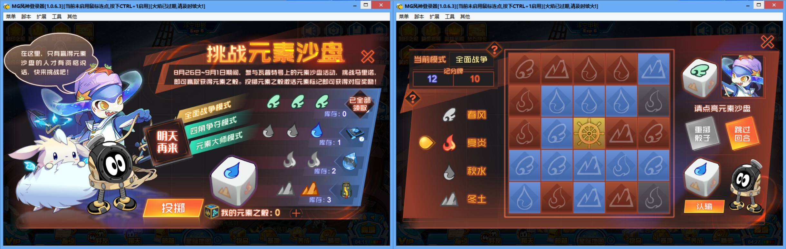

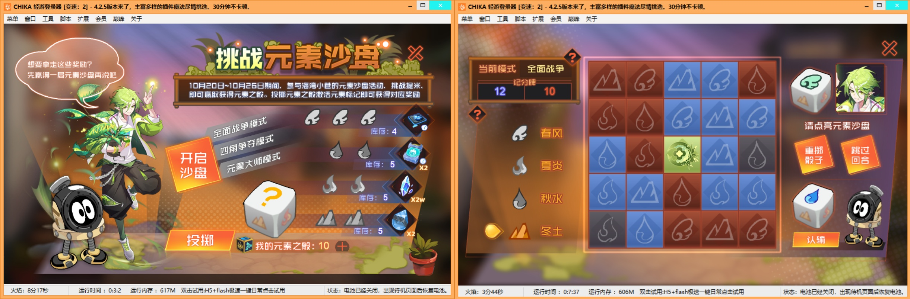

**个人攻略和感想**：这个游戏很有意思，虽然拼运气，认真玩的话肯定是赢多输少。首先每轮如果能占领格子肯定是尽量去占领。对于全面战争/四角争夺，优先扩张远处的地盘，比如用季节对应的图案去占据远方的 格子/偏向四角的格子。对于元素大师，前期先同样地扩张地盘，中后期盯着某种元素疯狂叠，或者去拦对面数量最多的元素。

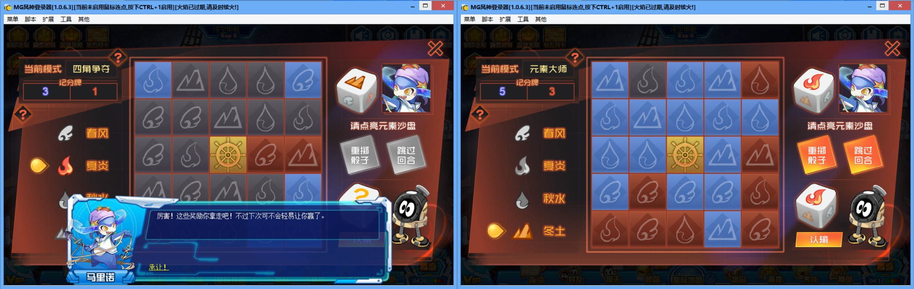

## 心有灵犀挑战

**更新时间**：2022-2-25 心有灵犀挑战 / 2023-10-20 心有灵犀挑战

**游戏规则介绍**：玩家来扮演卡斯珀，已经知道某一种动物的准确大小（用数字 1-9 表示）。其他三个角色各自画出一种动物的线描画，玩家需要对四种动物的体型大小进行排序，根据才对位置的数量计分。每个角色都会有各自的特色，如阿龙倾向于把大的东西画成小的东西，而小涛则相反。每局游戏重复轮数直到玩家获得 $15$ 分。

**个人攻略和感想**：我没有去细究特性（有些线描画会对应两种动物），直接根据小涛和阿龙的倾向性去修正结果。

## 洛林卡第二深空计划

**更新时间**：2025-9-26 洛林卡第二深空计划

【等待一波大更新】

## 闪光精灵 V.S. 暗黑精灵 / 兔兔棋盘攻防战

**更新时间**：2022-10-18/2022-12-30/2023-5-12 闪光精灵 V.S. 暗黑精灵 2023-11-17 兔兔棋盘攻防战

**游戏规则介绍**：井字棋，双方一共有 $6$ 种精灵，轮流下棋，每次可以从当前队列的三个精灵中选择一个放入空格子。右下角的数字表示生命值，敌我精灵发生碰撞时生命值会和对手作差，$\le 0$ 则从场地中移除。每回合本方只能执行最多一次“将一个精灵从队列移入井字棋的一个空格子中”，以及最多一次“移动我方场上的精灵至上下左右某个空格子中”。左上角的闪电标记表示该精灵在放入当回合即可移动，时钟标记表示下回合开始才能移动，叉标记表示永远无法移动。当某时刻某一方的三个精灵位于同一行、列或对角线时游戏结束，这一方获胜。为了照顾后手，初始棋盘的正中间位置会放置一个生命值为 $1$ 的后手方精灵，可以被后手移动或被先手销毁。

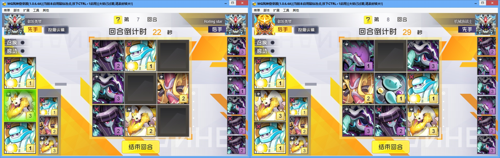

2022 年 12 月 30 日的更新版本中增加了一些精灵和标记（六角星标记表示该精灵除了上下左右移动外，还可以斜着移动一格），且玩家可以自由选择先后手以及对应的阵容。

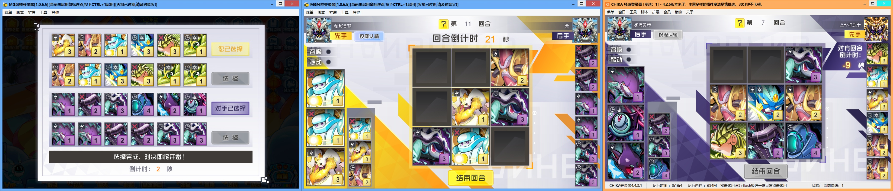

2023 年 5 月 12 日再次更新了游戏版本，添加了四个新的精灵，其中三个有全新的效果。

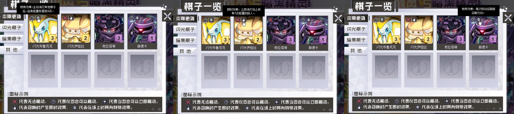

2023 年 11 月 17 日再次更新了游戏版本，除了把精灵替换成兔兔外，修改规则为先手凑三格后手拖 $14$ 回合。

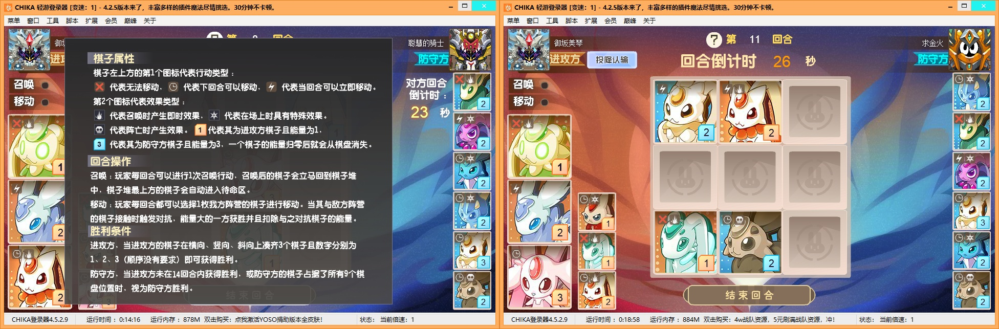

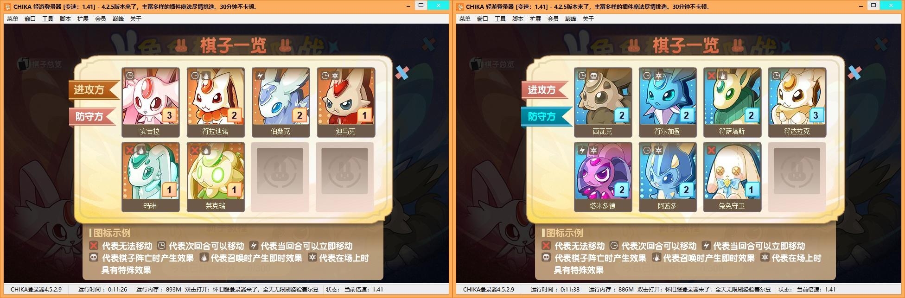

**个人攻略和感想**：该游戏的第一个版本中，先手优势过大——两个可随时移动的三命波克尔太灵活了。所以第二版中削弱了先手方的阵容，波克尔的数量降到 $1$ 或 $0$。第二版玩法更多样，我没总结出什么容易获胜的技巧。第三版加的精灵有点猛，特别是赫德卡这种能刷新出一回合内的第二轮出牌，属于是“机制级的打击”。第四版私以为是完成度和效果上最好的一版，其中先手比较有进攻压力，后手就纯摆烂。

## 和平星竞技场

**更新时间**：2025-10-24 和平星竞技场

**游戏规则介绍**：卡牌驱动游戏，每局游戏需要先选择一个拥有特殊技能的决赛，中途失败或完成两个斗技场的挑战后结算最终评级（高评级可获得天赋点进行传承式的强化）。每个斗技场有三条并行的路线，不同支线之间可以任意调整触发顺序，全部触发后解锁最终 boss。每场战斗开始时，手牌会构筑摸牌堆、弃牌堆和删牌堆，战斗结束后复原。当每场战斗取得胜利后，会随机刷新三张手牌和三张装备牌，各选择一张加入手牌和装备牌库。

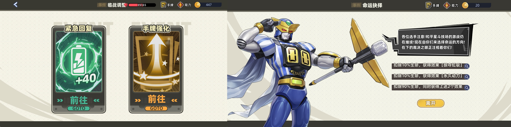

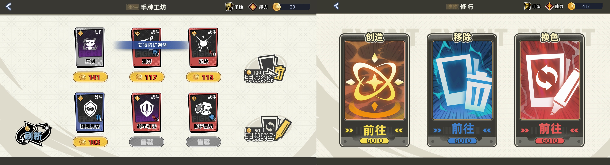

每场战斗的每一轮都会有 $3$ 点能量。每回合开始时要决定是否使用一张固定的移动卡（消耗 $1$ 点能量），决策结束后此卡消失。接下来我方可以不断打出牌，触发战斗、增加护甲、摸牌、增伤等效果，每张牌的能量消耗各异。射击类装备在使用过后需要用指定颜色的卡牌充能，充能时只看颜色，无视卡牌能量消耗和打出效果。某时刻若己方血量 $\le 0$ 则游戏失败；当把战斗场上所有 boss 都消灭时本次战斗获得胜利，注意血量不会恢复。

**关于装备**：有左手和右手两个格子存放战斗时可使用的装备（部分强力装备需要同时占用左右手），还有两个格子用来暂时存放没用到的装备。每场战斗每个回合都可以切换装备，但当回合后使用过装备后就无法切换。

| 事件              | 说明                                                         |
| ----------------- | ------------------------------------------------------------ |
| 速装工坊          | 在工坊内可以购买装备和手牌。                                 |
| 机甲挑战/精英对决 | 利用当前手牌挑战关卡，结束后手牌恢复。胜利后可获得斗技币并获得一张手牌和装备 |
| 临战调整          | 免费选择紧急恢复（+15 血）或手牌强化（随机强化一张未强化的手牌）中的一个。 |
| 修行              | 免费选择获得手牌、移除手牌或手牌换色中的一个。               |
| 命运抉择          | 支付一定代价（斗技币或血量）来获得强力的 buff。              |
| 战术工坊          | 选择手牌工坊或装备工坊的其中一个进入。                       |
| 战术工坊-手牌工坊 | 可以购买手牌、移除手牌或变更手牌颜色。同种操作多次执行会增长开销。 |
| 战术工坊-装备工坊 | 可以购买装备、强化装备或强化装备技能使用次数。同种操作多次执行会增长开销。 |

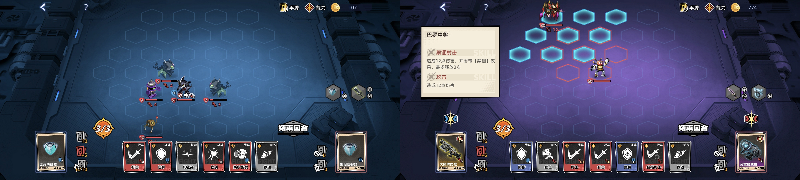

**关于战斗状态**：每一场战斗内，卡牌或装备的效果、初始英雄特性、我方或敌方攻击会施加一些 buff 和 debuff。绝大部分状态都有层数，$>0$ 层时生效，每过一回合层数 $-1$。

| buff 状态 |                  效果                  | debuff 状态 |             效果              |
| :-------: | :------------------------------------: | :---------: | :---------------------------: |
|   动力    |  本场战斗造成伤害 $+1$，**不会衰减**   |    受伤     |     $x$ 层则受到伤害 $+x$     |
|   守势    | 回合结束后保留一半装甲值，**不会衰减** |    破损     |              ？               |
|   尖刺    |   收到攻击后对攻击者造成 $2$ 点伤害    |  动力丧失   |      本回合造成伤害 $-1$      |
|  机械音   |          造成伤害提升 $50\%$           |    裂痕     |      受到伤害提升 $50\%$      |
| 能量护盾  |          受到伤害减少 $75\%$           |    短路     |   攻击时造成伤害减少 $25\%$   |
|   盾反    |    受到攻击后对攻击者造成剩余装甲值    |    禁锢     |           无法移动            |
|   节能    |     本回合未用完的能量保留至下回合     |  中断行动   |     本回合不进行任何行动      |
| 机体重构  |    牌库中所有状态牌能量消耗降为 $0$    |  弱点标记   | 被击杀后击杀者获得 $1$ 点能量 |
|   聚能    |       下一次（可跨回合）伤害翻倍       |             |                               |
|   穿透    |          攻击时无视对手装甲值          |             |                               |

**关于初始角色**：每个角色都拥有专属特性、手牌和装备，三者的基本思路已构建，可按照这个方向去玩。

|   角色   |             特性             |                        初始手牌                        |       初始装备        |
| :------: | :--------------------------: | :----------------------------------------------------: | :-------------------: |
|  卡布达  |   战斗开始获得 $2$ 层动力    |       打击 $\times 4$，防护$\times 4$，动力强化        |   破旧防御器+突击剑   |
| 蜘蛛侦探 |    装备充能后摸 $1$ 张牌     |     打击 $\times 4$，防护 $\times 4$，规避 ，推击      | 破旧射线枪 $\times 2$ |
| 鲨鱼辣椒 |   手牌的装甲值提升 $25\%$    | 打击 $\times 4$，防护 $\times 4$，防守架势 ，驭甲冲锋  | 破旧防御器 $\times 2$ |
| 蝎子莱莱 | 击杀目标每 $2$ 破损回 $1$ 血 | 穿透版打击 $\times 3$，防护 $\times 2$，冲击，纳米沙尘 | 破旧迅击刃 $\times 2$ |
| 蟑螂恶霸 |    打出过载牌消耗降为 $0$    |   打击 $\times 4$，防护 $\times 4$，机械音，过载打击   | 破旧斩舰刀 $\times 2$ |

**手牌常见术语**：

|   名词   |          效果          |    名词     |                  效果                   |
| :------: | :--------------------: | :---------: | :-------------------------------------: |
| 不能打出 |      无法主动打出      |    首发     | 每回合打出第 $1$ 张牌后将此牌移入弃牌堆 |
|   用尽   |   打出手牌后永久移除   |  未出用尽   |    回合结束后若未打出，手牌永久移除     |
|   禁用   | 打出后手牌移至禁用牌堆 |  未出禁用   | 回合结束后若未打出，手牌移动至禁用牌堆  |
| 命中无耗 |  命中目标后不消耗能量  |    保留     |  回合结束后若未打出，手牌保留至出牌堆   |
|   双手   |  同时占用左右的装备栏  | 过载/高能耗 |  打出卡牌后，获得 $1$ 张过载牌至出牌堆  |

**关于状态牌**：战斗开始时不存在，会因为卡牌和装备的效果或敌方攻击而生成。

|  状态牌  | 费用 |                             效果                             |
| :------: | :--: | :----------------------------------------------------------: |
| 冗余数据 |  0   | 在手牌中时，其他具有移动效果的手牌耗能 $+1$，未出用尽，不能打出 |
|   过载   |  1   |                             用尽                             |
|   紊乱   |  2   |     受到伤害后可能获得，用尽，打出后自身获得 $1$ 层短路      |
|   病毒   |  1   |                用尽，回合结束后仍在手中时受伤                |
| 零件磨损 |  1   |                 打出时对自己造成 $1$ 点伤害                  |

**关于手牌**：手牌包括进攻牌（多为红色）、防守牌（多为蓝色）和无色牌（无法充能）。

|   进攻牌    | 费用 | 伤害值 |       升级效果       |                      特殊效果                       |
| :---------: | :--: | :----: | :------------------: | :-------------------------------------------------: |
|    打击     |  1   |   4    |          7           |                                                     |
|  强力打击   |  2   |   10   |          16          |                                                     |
|  制造裂痕   |  2   |   6    |          12          |                   给予 $1$ 层裂痕                   |
|  一击脱离   |  1   |   6    |          9           |              命中目标后自身后退 $1$ 格              |
|  扫描打击   |  1   |   5    |          8           |                     摸 $1$ 张牌                     |
|  前进打击   |  2   | 6*1.2  |        8*1.5         |        移动 $1$ 格造成伤害；获得 $1$ 张过载         |
|  击退打击   |  1   |   4    |          7           |                   击退敌人 $1$ 格                   |
|    处决     |  2   |   10   |          16          |      击杀目标额外获得 $30-50$ 道具；打出后删除      |
|    突进     |  3   |   6    | 3 $\rightarrow$ 2, 9 |   移动 $1$ 格造成伤害，命中目标则不消耗能量，过载   |
|  光学干扰   |  1   |   6    |          8           |                   给予 $1$ 层短路                   |
|  转甲打击   |  1   | 6, *1  |         8,*2         |       将所有装甲值 $\times x$ 换算成额外伤害        |
|  连续打击   |  1   | 2, *2  |        2, *3         |                   重复 $x$ 次打击                   |
|  攻守之势   |  2   |   6    |          9           |                获得造成伤害值的装甲                 |
| 新·全力打击 |  2   |   12   |          18          |                      未出禁用                       |
| 新·逆刃清算 |  3   |   12   |          16          |      每受到 $1$ 次攻击手牌使用时能量消耗 $-1$       |
| 新·隐匿打击 |  0   |   4    |          7           |         首发【升级后解除】，给予 $1$ 层裂痕         |
| 新·三向打击 |  1   |   6    |          8           |               同时对三个方向造成伤害                |
| 新·蓄能打击 |  1   | 4, +2  |        6, +3         |         保留，每回合如果保留下回合伤害 $+x$         |
|   新·清算   |  0   |   4    |          4           | 如果杀死目标获得 $1$ 能量，【升级后】手牌回到出牌堆 |
| 再·过载打击 |  1   | 6, +3  |        8, +4         |        自动打出手中所有过载，每一张伤害 $+x$        |
| 再·绝地反击 |  2   | 8, +3  |        10, +4        |             牌库中每有一张过载伤害 $+x$             |
| 再·终结打击 |  1   |   *4   |          *6          |         造成本回合连击数 $\times x$ 点伤害          |

|  防守手牌   | 费用 | 护盾值 |       升级效果        |                      特殊效果                       |
| :---------: | :--: | :----: | :-------------------: | :-------------------------------------------------: |
|    防护     |  1   |   4    |           7           |                                                     |
|  强力防护   |  2   |   8    |          12           |                                                     |
|    警惕     |  1   |   10   | 1 $\rightarrow$ 0, 12 |                        首发                         |
|    洞穿     |  3   |   12   |          16           |         战斗中受到伤害则降低 $1$ 点能量消耗         |
|  系统自检   |  1   |   5    |           8           |          从弃牌堆随机获得 $1$ 张牌到出牌堆          |
|  静观其变   |  1   |  6, 1  |         8, 2          |                     抽 $x$ 张牌                     |
|  防护架势   |  1   | 3, +2  |         5, +3         |         每打出 $1$ 次，本场内装甲额外 $+3$          |
|  战场演算   |  1   | 4, +1  |         6, +2         |         保留，每回合如果保留下回合装甲 $+x$         |
|  铁甲守势   |  1   |   *6   |          *8           |         获得周围敌人数量 $\times x$ 的装甲          |
| 新·全力防护 |  1   |   12   |          18           |                        禁用                         |
| 新·相位装甲 |  1   |  4, 1  |         6, 2          |                   获得 $x$ 层盾反                   |
| 新·调整姿态 |  1   | 5, +1  |         7, +2         | 丢弃所有手牌，每丢弃 $1$ 张获得 $x$ 装甲并摸 $1$ 张 |

|  无色手牌   | 初始费用 | 升级费用 |                           特殊效果                           |
| :---------: | :------: | :------: | :----------------------------------------------------------: |
|    移动     |    1     | 不能升级 |                             首发                             |
|    冲击     |    1     |    0     |               禁用，向前冲刺并击退敌人 $1$ 格                |
|    推击     |    0     |    0     |               击退敌人 $1$ 格，【升级后】保留                |
|    钩锁     |    1     |    0     |    将距离 $2$ 格目标拉至身前，打出后此牌本场能量消耗 $+1$    |
|    规避     |    3     |    2     |   移动 $1$ 格，保留，每回合保留后下回合能量消耗 $-1$，过载   |
|  纳米沙尘   |    1     |    0     |                禁用，给予多个敌人 $1$ 层中断                 |
|  驭甲冲锋   |    3     |    2     |   向前移动 $1$ 格，造成 $2+$当前装甲值伤害，命中无耗，过载   |
|  盾压打击   |    2     |    1     | 跳跃 $2$ 格，造成 $2+$ 当前装甲值伤害，击退 $1$ 格，命中无耗，过载 |
|  弱点烙印   |    1     |    0     |            给予 $10$ 层弱点标记和 $2$ 层动力丧失             |
|    压制     |          |          |                   给予所有敌人 $1$ 层短路                    |
|  全弹发射   |    1     |    1     | 消耗当前斗技币 $5\%$（【升级后】$10\%$）对 $2$ 格内敌人造成等量伤害 |
|  量子置换   |    1     |    1     |        和 $1$ 格内的敌人交换位置，禁用【升级后解除】         |
|  节能模块   |    0     |    0     |                     节能，【升级后】保留                     |
|  充能补给   |    0     |    0     |        为所有射线枪充能，抽 $1$（【升级后】$2$） 张牌        |
|   机械音    |    0     |    0     |              获得 $1$（【升级后】$2$）层机械音               |
|    聚能     |    1     |    0     |                       获得 $1$ 层聚能                        |
|  机体重构   |    1     |    1     |             获得 $2$（【升级后】$3$）层机体重构              |
|  核心能量   |    0     |    0     |   消耗 $4$ 点血量获得 $1$（【升级后】$2$）点能量，不会致死   |
|  动力强化   |    1     |    1     |               获得 $1$（【升级后】$2$）层动力                |
|  能量护盾   |    1     |    0     |                  获得 $1$ 层能量护盾，禁用                   |
|   源代码    |    0     |    0     |               抽 $1$ 张牌，禁用【升级后解除】                |
| 新·装备唤醒 |    0     |    0     |  本场战斗中所有装备的技能使用次数 $+1$，禁用【升级后解除】   |
| 新·应急协议 |    0     |    0     |              抽 $3$（【升级后】$4$）张牌，禁用               |
| 新·能量翻涌 |    0     |    0     |            获得 $2$（【升级后】$3$）点能量，禁用             |
|   新·回溯   |    1     |    0     |             从禁用牌堆中随机 $1$ 张牌回到出牌堆              |
| 再·过载转化 |    2     |    1     |       自动打出手中所有过载，每打出一张获得 $1$ 层动力        |

**关于装备牌**：装备牌主要分为刃/剑（为战斗牌提供稳定增伤）、枪（为战斗牌提升攻击距离，需要充能）、防御器（提供护盾传承效果，为战斗牌提供护盾）、矛/刀（双手，高能耗，提供穿甲、叠甲、范围攻击等特效）。

|     装备牌      | 增伤/护盾 | 战斗牌增射程 |    buff/debuff     |                  技能                   |
| :-------------: | :-------: | :----------: | :----------------: | :-------------------------------------: |
|   破旧迅击刃    |     1     |              |        切割        |           额外增加 $1$ 点伤害           |
|   士兵迅击刃    |     1     |              |        切割        |                                         |
|   弱点迅击刃    |     1     |              |   切割，弱点标记   |                                         |
|  新·锋利迅击刃  |     1     |              |        切割        |             给予 $2$ 层破损             |
|  新·增强迅击刃  |     1     |              |        切割        |           攻击次数 $\times 2$           |
| 再·增强迅击刃II |     2     |              |        切割        | 攻击次数 $\times 3$ 但手牌消耗能量 $+1$ |
|   破旧突击剑    |     1     |              |                    |                                         |
|   士兵突击剑    |     2     |              |                    |                                         |
|   弱点突击剑    |     2     |              |      弱点标记      |                                         |
|   无畏突击剑    |     2     |              |                    |             给予 $1$ 层短路             |
|  新·大师突击剑  |     3     |              |                    |            攻击范围变成一圈             |
|   破旧射线枪    |     1     |      2       |        充能        |                                         |
|   士兵射线枪    |     2     |      2       |        充能        |                                         |
|   弱点射线枪    |     2     |      2       |   充能，弱点标记   |                                         |
|   沉重射线枪    |     2     |      2       |        充能        |        额外增加 $1$ 点伤害，击退        |
|   大师射线枪    |     2     |      3       |        充能        |       攻击后无需充能并抽 $1$ 张牌       |
|  新·增强射线枪  |     2     |      2       |        充能        |          攻击次数 $ \times 2$           |
|   破旧防御器    |     1     |              |        守势        |                                         |
|   士兵防御器    |     2     |              |        守势        |                                         |
|   坚硬防御器    |     3     |              |        守势        |                                         |
|   尖刺防御器    |     2     |              |     守势，尖刺     |                                         |
|   反击防御器    |     2     |              |        守势        |             获得 $1$ 层盾反             |
|  新·山岳防御器  |     2     |              |        守势        | 获得装甲 $\times 2$ 但手牌消耗能量 $+1$ |
|   士兵战术矛    |     1     |      2       |    双手，高能耗    |                                         |
|   穿透战术矛    |     1     |      2       | 双手，高能耗，穿透 |                                         |
|  新·量子战术矛  |     1     |      2       |    双手，高能耗    |           额外增加 $4$ 点伤害           |
|  再·大师战术矛  |     2     |      2       |    双手，高能耗    |         攻击范围增加 $2$ 个方向         |
|   破旧斩舰刀    |     1     |   范围攻击   |    双手，高能耗    |                                         |
|   士兵斩舰刀    |     2     |   范围攻击   |    双手，高能耗    |                                         |
|   量子斩舰刀    |     2     |   范围攻击   |    双手，高能耗    |           额外增加 $4$ 点伤害           |
|  新·沉重斩舰刀  |     2     |   范围攻击   |    双手，高能耗    |             击退敌人 $1$ 格             |
|  再·铁甲斩舰刀  |     3     |   范围攻击   |    双手，高能耗    |          获得造成伤害量的装甲           |

**个人攻略和感想**：这个游戏制作的非常用心，持续三周每周都会有新的角色/手牌更新。分析如下：

+ 本游戏继承了赛尔号同类游戏的重要特征：回合进行阶段强制退出后不会保存进度，恢复到本场战斗开始时的样子（可能由于记录中间状态太麻烦了），合理利用这个技巧可以规避一些战斗失误，提高稳定性。
+ 不管选什么角色和流派，增伤和过牌一定是有用的，主要包括源代码、机械音、聚能等，这升级后更爽。
+ 鲨鱼辣椒的叠甲流很无脑，靠防护架势和防御器来叠甲，非常依赖抽出核心装备 **转甲打击** 来造成高额伤害。经典增伤牌有效，依赖护盾值的驭甲冲锋和盾压打击也不错（但容易被禁锢坑），新出的盾反牌也很爽。
+ 蜘蛛侦探是极致的远距离攻击流，靠大师射线枪的远距离和沉重射击枪的击退来拉扯敌人。屯一张规避可以在敌方近身的时候提供临时躲避能力，或者搭配攻守之势等提高容错性。比较怕血厚且有固定反伤的 boss。

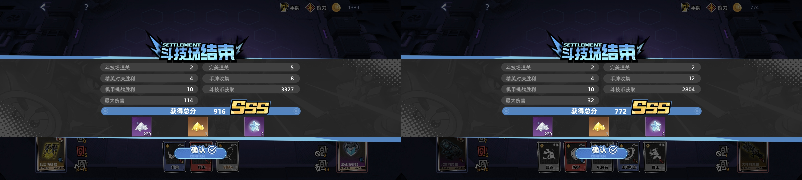

主要缺点：卡布达进化道具的获得要求玩家反复玩出高质量对局，但该游戏**流程繁琐，重开性不高**。

## 铁甲小宝运动会

**更新时间**：2025-10-31 铁甲小宝运动会

**游戏规则介绍**：有若干个带有不同天赋的初始种族可选，每个种族有三种难度。人物有体力和热情（攻击力）两个属性。每局游戏会持续进行五天，每一天开始时体力回满，结束后会获得一个永久 buff。当天会遭遇一系列的事件，其类型包括运动（战斗）、回体力和加攻击力。对于运动事件，对手也有体力和热情两个属性，双方轮流用攻击力进行攻击（己方先行动）。一旦己方体力先降到零则游戏立即结束，否则战胜成功后可能会获得事件对应的奖励（回体力或加攻击力等）。每次触发一个事件之前，有一次机会在未来的事件里面里选择两个相邻事件做交换。

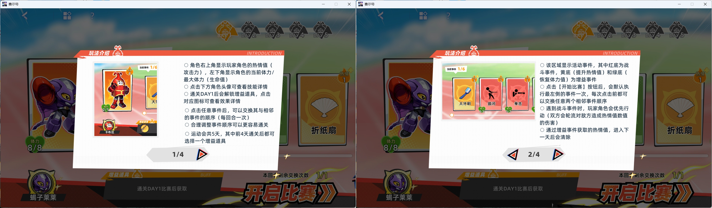

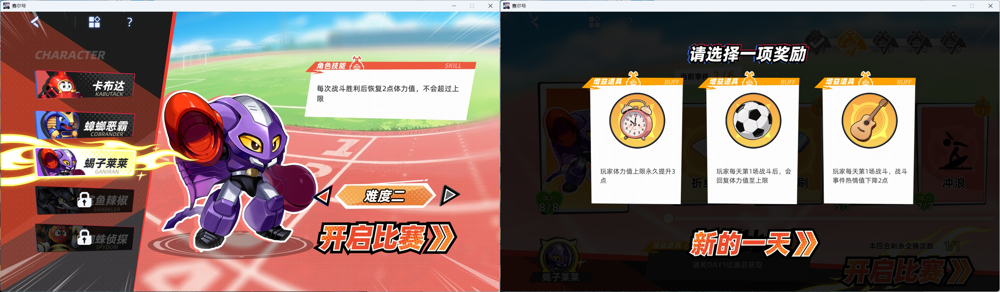

**个人攻略和感想**：游戏的数值设计有点挫，本来以为要多尝试几次+精心设计每回合的交换事件才能过，事实上宽松的数值+随机的事件布局让其成为点点点就能过的游戏，无脑堆血量或者攻击力都能通过。

## 风之迷阵

**更新时间**：2021-11-5 风之迷阵 / 2022-11-4 风之迷阵

**游戏规则介绍**：整局游戏需要依次抵挡十轮怪物的攻击。每一轮有若干个回合，每个回合按下“出击”按钮后会从东南西北四个方位中随机四个组合，如果组合符合特定的规律则可触发特殊的技能（如果符合多个规律可重复触发技能），可以轮数推进可以加点技能等级。每个回合也会承受怪物们的攻击，当 HP 降低至 0 时游戏立即结束。每次出击前可以锁定上一次触发的组合里若干个方位，锁定效果的上限是一点，每回合结束后恢复一点。

+   四风守护：东南西北各一个，眩晕若干个怪物。
+   如沐春风：存在东和南，回复一定的血量。
+   凛冽寒潮：存在西和北，对若干个怪物造成若干点伤害。
+   四方归一：四张相同的风牌，对全屏所有怪物造成若干点伤害。

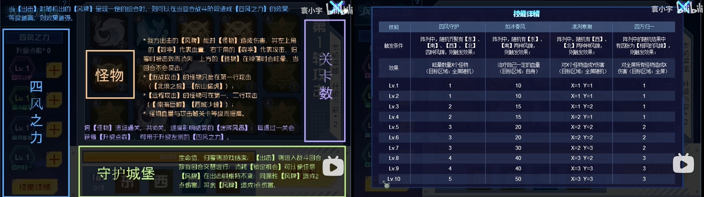

**个人攻略和感想**：无脑点击出击就足够拿完奖励，但想通关十轮攻击还是得动点脑子。四方归一的伤害虽然高，触发的期望很小，所以比较稳健的决策是每回合都向 **四风守护** 靠拢（注意四风守护的同时会额外触发如沐春风和凛冽寒潮，期望收益很高）。我主点如沐春风（奶），副点四风守护和凛冽寒潮，每回合实时决策锁定策略，默认会向如沐春风靠拢。我甚至没有查看不同怪物的攻击效果，上述操作不失误已经能稳定通关十轮了。

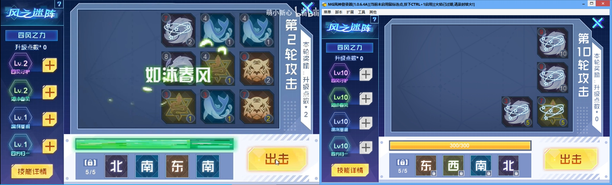

## 蟑螂恶霸的美食大挑战

**更新时间**：2025-11-7 蟑螂恶霸的美食大挑战

**游戏规则介绍**：每局游戏初始有 $15$ 金币，每次掷骰子消耗 $1$ 枚金币，并进行以下判定：

1. 对于每个食材，若骰子掷到的点数有红框包裹，则会获得对应食材 $1$ 份（分数会随着食材升级而提高）。
2. 选择最多一个食材，使得骰子掷到的点数尚未被黄色覆盖，并执行覆盖动作。当一种食材的所有点数都被覆盖后，级别会上升一级，即每次被骰子激活时可以多获得一份食材（但激活条件不变）。

注意海苔、鲑鱼、米饭是一组，每凑齐一堆会有额外分数奖励；每凑齐三个巧克力也有额外奖励。

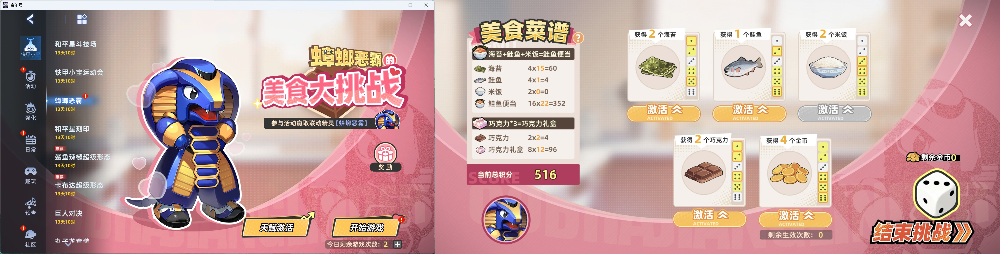

**个人攻略和感想**：玩了几把仍没摸清楚贪心最优解，基本上是有金币选金币（希望能苟出更多的回合）。

## 暗黑再临 闪光新生

**更新时间**：2022-11-8 暗黑再临 闪光新生

**游戏规则介绍**：规则比较琐碎，这里大致介绍一下。要战斗的 boss 分为闪光精灵和暗黑精灵两种，部分参数正好相反。战斗前需要配置五个骰子剩余三面的内容（一共 $3 \times 5=15$ 面），且总负载不能超过 $20$。游戏总共分成 $20$ 轮，每轮会投掷五个骰子，同时有一次机会重置指定的某几个骰子。朝上的面完全确定后，会根据骰子的效果对 boss 产生伤害。剩余 12 回合时，boss 的特性会失效；剩余 6 回合时，会增加一个“战神骰子”。

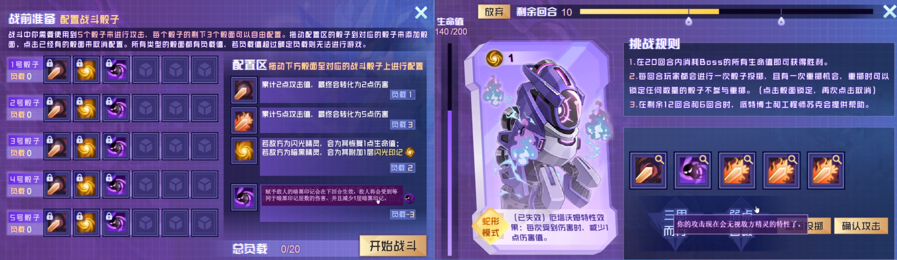

**个人攻略和感想**：这个游戏我没深入钻研，直接根据 boss 是闪光还是暗黑，无脑把对其有利的面重置。

## 枫纸配对大赛

**更新时间**：2021-11-12/2022-11-11/2023-11-10 枫纸配对大赛

**游戏规则介绍**：90 秒的时间内完成尽量多的任务，每次要选出底色、图案、颜色均相同或均不同的图形。

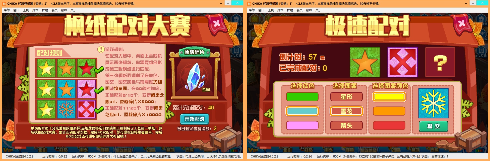

**个人攻略和感想**：一年一度枫叶游戏。纯反应，早年玩一玩，后面都交给脚本了。

## 地心涌现的能量

**更新时间**：2024-11-15 地心涌现的能量

**游戏规则介绍**：有一个能源方阵，拾取能源时必须选择连续（横/竖/斜）的三个能量，补给能源会将空缺的位置随机补满能量。一天有 $30$ 个行动点，拾取能源花费 $1$ 个行动点，补充能量花费 $2$ 个行动点。提交对应数量的能量点后即可完成某个任务，奖励给出经验值和道具，并刷新这个任务。总共有三个道具，功能分别是藤蔓抓钩（单独提取某个能量）、补给装置（随机刷新所有任务）和强力消化液（随机刷新所有已存在的能量）。

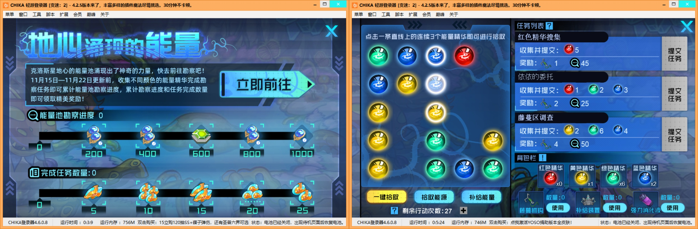

**个人攻略和感想**：整个画风让我想到《璀璨宝石·对决》，拾取能源对应拾取筹码，提交任务对应购买卡牌，而藤蔓抓钩对应卷轴。难度当然偏低，因为不需要考虑对手的存在，也没有单次拾取的颜色限制。

## 兔兔星光船

**更新时间**：2023-11-17 兔兔星光船

**游戏规则介绍**：矿工可以左右移动版的黄金矿工。

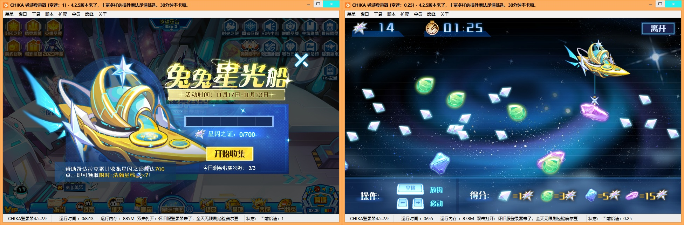

**个人攻略和感想**：我居然把这个游戏选进来了……

## 能源匹配

**更新时间**：2024-11-22 云霄星异动-飞船系统检修-能源匹配

**游戏规则介绍**：给出 $3 \times 4$ 的背面朝上的卡牌，共有四种类型。每次点击一张卡牌时会在短时间内展示其种类并返回，前后点击到两张同种类卡牌会湮灭消失。在限定的翻牌次数里将所有卡牌都消失。

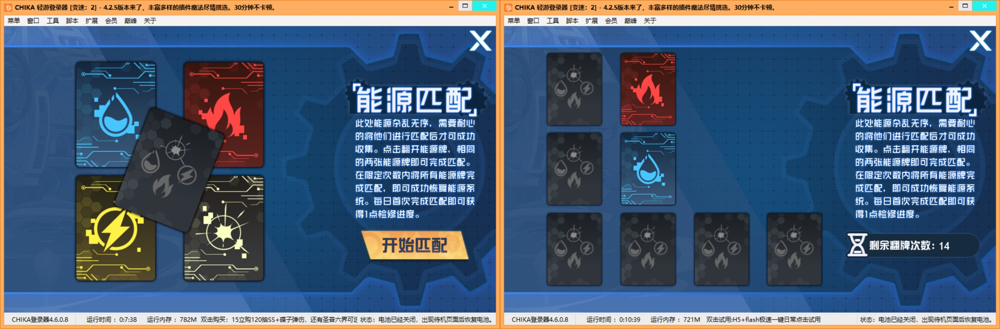

**个人攻略和感想**：玩过类似逻辑的小游戏，不用笔记录的话就是记忆力挑战，本质只需种类数大小的记忆空间。

## 勘察调试

**更新时间**：2024-11-22 云霄星异动-飞船系统检修-勘察调试

**游戏规则介绍**：给出一张按 $4 \times 5$ 小方格打乱的初始图片，在 $60s$ 内通过方格互换的方式将其复原。

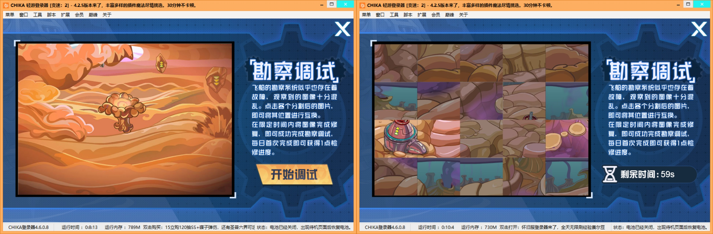

**个人攻略和感想**：看似简单的游戏其实很折磨，特别是云霄星二层（上图一）这种非常相似的方格。

## 唤醒伊塔的记忆

**更新时间**：2024-11-29 赫尔卡拾遗-唤醒伊塔的记忆

**游戏规则介绍**：给出一个不规则形状，用一些零件去可重叠地密铺，要求重合率 $\ge 90\%$ 且超出部分 $\le 5\%$

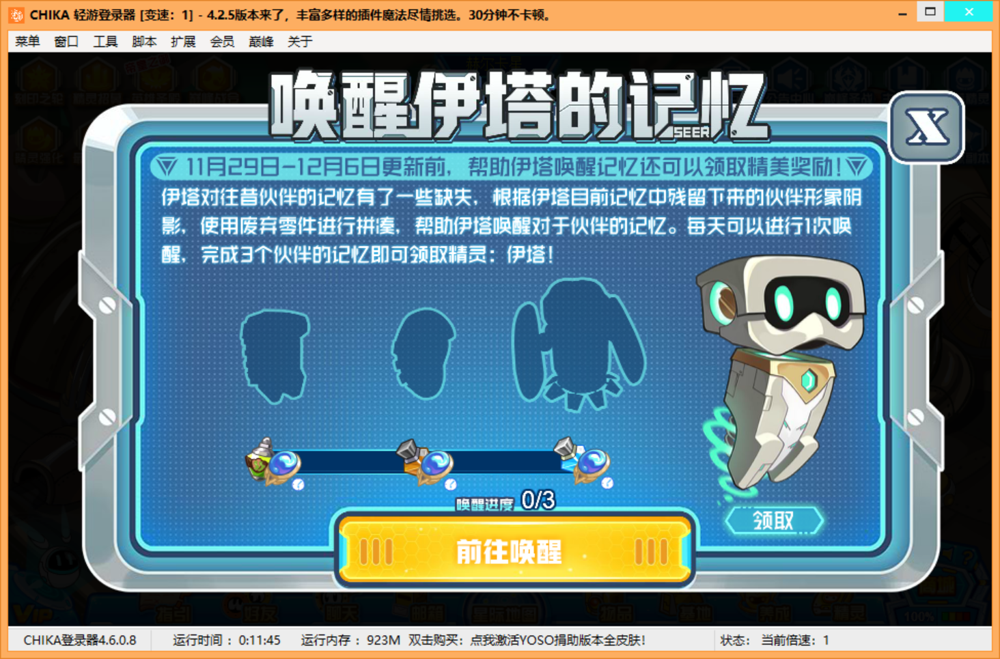

**个人攻略和感想**：很幼稚但是很喜欢的一个游戏，无脑乱拼。盲猜 checker 是用暴力点阵模拟的。

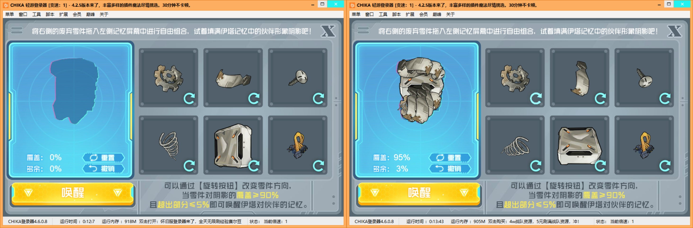

## 解析神秘日志

**更新时间**：2024-12-6 千年赫尔卡-解析神秘日志

**游戏规则介绍**：$6 \times 6$ 的地图里有一格放着要找的碎片，每次可以花费一个能源点数探索一个格子。如果这个格子和目标位置形成一定关系就会收到一个信号，具体地，对角线上呈黄色信号，同一行或列呈蓝色信号。当成功收到四个信号后不再能获得新的信号。根据探索时的信号来尽快探索到碎片所在的位置。

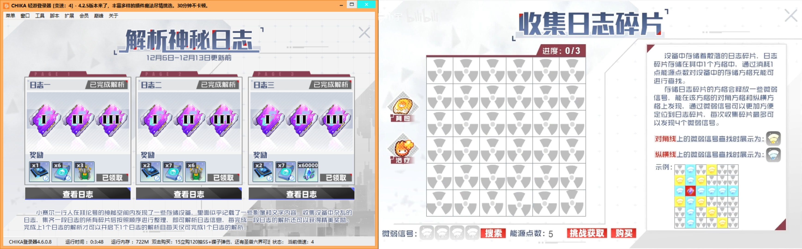

**个人攻略和感想**：游戏开放了无限制的能源点数获取，所以胡乱点着很快就能找齐碎片。这不妨碍游戏本身的思维性含量很高。一个很有趣的问题是，最优方案在最坏情况下要探索多少步。

## 战斗试炼/迷雾观灵挑战

**更新时间**：2022-12-16 修缘试炼-战斗试炼 / 2024-1-26 迷雾观灵挑战

**游戏规则介绍**：$5$ 行 $5$ 列共计 $25$ 个格子，被划分成 $5$ 个区域。总共有 $5$ 个格子有标记，每个区域内只有一处标记，且 $5$ 个标记在不同的行与列，并且不会在对角线上相邻。 标记分布已确定，请完全识别出这 $5$ 个标记。一天总共有 $5$ 局不同的游戏，每次对战成功可以获得某个标记的具体位置，一天的提示上限是 $7$。

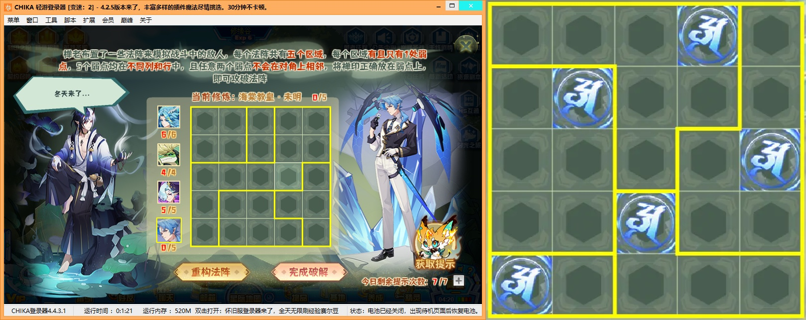

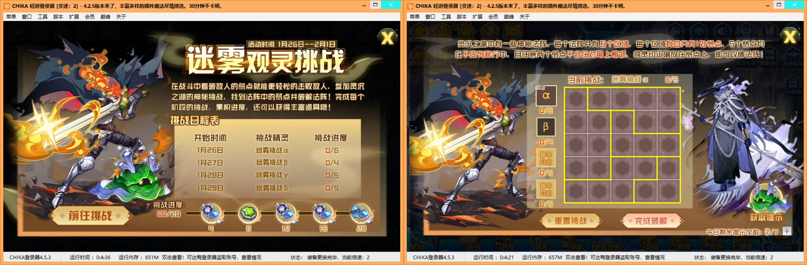

**个人攻略和感想**：“畸形版”的数独或八皇后游戏。由于游戏要求的是确定解，最速通关的方式是先挑战一轮确定其中某个标记的位置，然后顺着约束去尝试填别的标记。橙汁给出了一份 [Python 的搜索代码](https://www.bilibili.com/read/cv20538929/)。