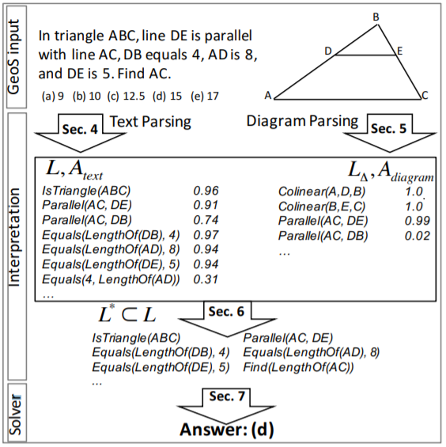
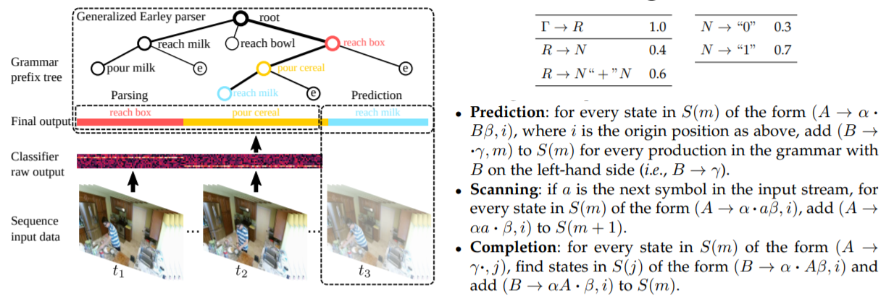
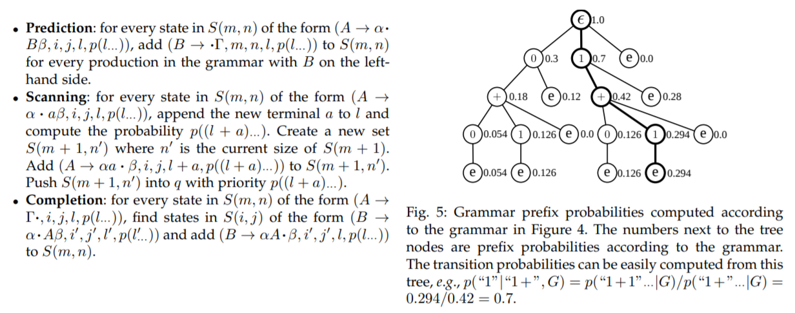
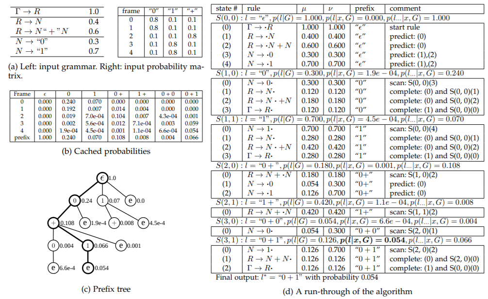
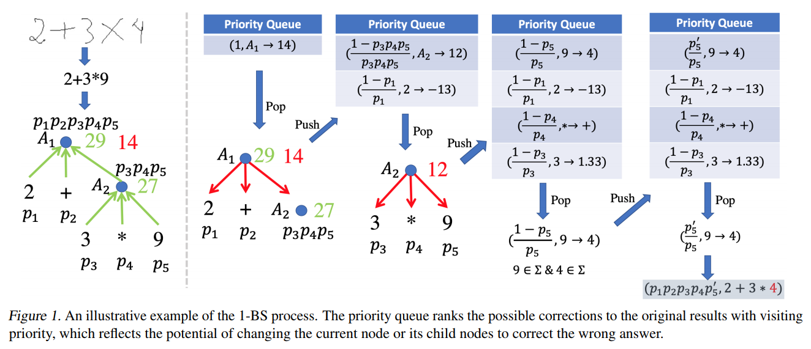
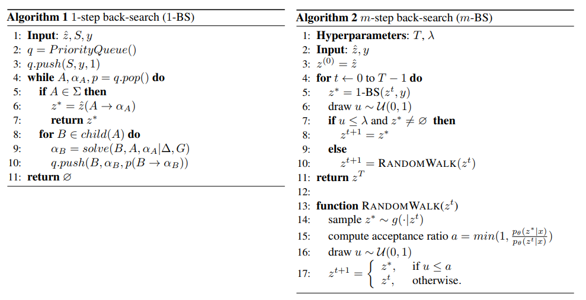

#### Diagram Understanding in Geometry Questions

+   AAAI 2014 [论文地址](https://ai2-website.s3.amazonaws.com/publications/diagram.pdf)
+   本文提出了一个叫做 G-ALIGNER 的 Image Parse 的工具，并证明了它使用的估价函数是次模函数。
+   估价函数介绍
    +   设 $T=\{T_1,T_2,\dots,T_m\}$ 表示题目文本中提到的元素集合，$L$ 是图片中初步提取后的所有 primitives 集合。本论文默认 $L$ 已经得到，现在要找一个最优的子集 $\hat{L}$ 以准确地表达图片信息。
    +   引入一个 $W \in \{0,1\}^{|L| \times |T|}$ 表示该图上的 primitive 是否与指定文本元素对应。 $\hat{L}=L \times (W \times 1_{|T| \times 1})$，可以将求一个最优子集 $\hat{L}$ 转化为求一个最优的矩阵 $\hat{W}$。
    +   对于一个可能的集合 $\hat L$，估价函数 $\mathcal{F}$ 设计成三个部分：
        +   所选 primitives 与实际的图像之间的重合程度 $\mathcal{P}=\frac{|D_{\hat L}|}{|D|}$
        +   所选 primitives 能构成更高相关性 visual element 的程度 $\mathcal{C}=\frac{|C_{\hat L}|}{|C|}$
        +   所选 primitives 与文本的对应关系 $\mathcal{S}=\frac{|T_{\hat L}|}{|T|}-r_{\hat W}$，其中 $r_{\hat W}$ 表示冗余成分。
    +   可以证明，$\mathcal{F=P+C+S}$ 是次模函数。
+   求解步骤
    +   用 Hough transform 提取 primitives，用 Harris Corner detectors 检测 Corners。 
    +   优化时采用很暴力的方式：初始时设 $\hat {L}=\varnothing$，.每次枚举 $l \in L$，把 $\arg \max \limits_{l}F (\hat L \cup l)-F(\hat L)$ 的 $l$ 加入 $\hat L$，直到增量 $< 0$ 为止。

#### Solving Geometry Problems: Combining Text and Diagram Interpretation

+   EMNLP 2015 [论文地址](https://www.aclweb.org/anthology/D15-1171.pdf)
+   提出了一个 GEOS 系统，把文本和图片变成 **形式语言**（logical expression）再推理。
    
+   **logical expression** $\Omega$ 的定义
    +   它是一阶逻辑语言（first-order logic），包含以下四种内容：
        +   constants ：已知的量或实体。例如 `5`。
        +   variables：未知的量或实体。例如 `x`，`CE`。
        +   predicates：几何或算术的关系。例如 `Equals`，`IsDiameter`，`IsTangent`。
        +   functions：几何物体的性质或者算术运算。例如 `LengthOf`，`SumOf`。
    +   定义 **Literal** 是 predicates 的应用实例，如 `isTriangle(ABC)`
    +   定义 **Logical formulas** 是以上内容和 existential quantifiers，conjunctions 的组合，如：
        ~~~
        ∃x, IsTriangle(x)∧IsIsosceles(x)
        ~~~

####  Transformers as Soft Reasoners over Language

+   [论文地址](https://arxiv.org/pdf/2002.05867)
+   挖坑

#### A Generalized Earley Parser for Human Activity Parsing and Prediction

+   This paper is an extension of previous ICCV and ICML papers. 1TPAMI 2020 [Address](http://www.stat.ucla.edu/~sczhu/papers/PAMI2020_Prediction_Generalized_Earley_Parser.pdf) 
+   **Earley Parser** is a classical method to parse CFG, while it can not tackle the non-Markovian and compositional properties of high-level semantics. This paper generalize the Earley parser to solve sequence data by only given an arbitrary **probabilistic classifier**.
+   This **Generalized Earley Parser** combined detection, parsing and future predictions together, which is really generic and applicable. It finds the optimal (*maximizing the joint probability*) segmentation and label sentence according to both a symbolic grammar and a classifier output of probabilities of labels for each frame.
+   Brief introduction for EARLEY PARSER
    +   Early parser takes a sentence with length $T$ as input, and find out this CFG.
    +   It is similar with LR parser. There are three main process:
        +   **Prediction**: For each $(A \to \alpha \cdot B\beta)$, add $(B \to \cdot \gamma)$ if $B \to \gamma$ exists.
        +   **Scanning**: If $(A \to \alpha \cdot a \beta)$ and the next character is $\alpha$, add $(A \to \alpha a \cdot \beta)$.
        +   **Completion**: If $(A \to \gamma \cdot)$ appears, change $(B \to \alpha \cdot A\beta)$ to $(B \to \alpha A \cdot \beta)$.
        +   l=k1k2   k3
    +   An sample
        
+   GENERALIZED EARLEY PARSER
    +   Consider a sequence with length $T$, Generalized Early parser takes an $T \times K$ probability matrix as input, and output sentence $l$ of labels $(l \le |T|)$ that best explains the data according to a grammar G, where each label $k \in \{0, 1, \dots, K-1\}$ corresponds to a segment of  sequence.
    +   **Parsing Probability**
        +   The parsing probability $p(l|x_{0:T})$ is computed in a dynamic programming fashion.
        +   Consider whether this frame is a new frame with label $k$. The previous frames can be labeled as either $l$ or $l^-$: $p(l|x_{0:t}) = y^k_t (p(l|x_{0:t−1}) + p(l^−|x_{0:t−1}))$
        +   x [0:t] = xxxxxxxx...
        +   l = k1k2k3...
        +   l=1+...
        +   l=1+  1
        +   l=1+1.. / l=1+..
    +   **Prefix Probability**
        +   Then we compute the prefix probability $p(l \dots|x_{0:T})$. Once the label $k$ is observed (the transition happens), l becomes the prefix and the rest frames can be labeled arbitrarily.$p\left(l \ldots | x_{0: T}\right)=p\left(l | x_{0}\right)+\sum_{t=1}^{T} y_{t}^{k} p\left(l^{-} | x_{0: t-1}\right)$
        +   In practice, the probability $p(l|x_{0:t})$ decreases exponentially as $t$ increases and will soon lead to numeric underflow. So we should solve it with $\log$.
    +   **Posterior Probability**
        +   Transition probability $p(k|l^−, G)$ can be calculated by: $$p\left(k | l^{-}, G\right)=\frac{p(l \ldots | G)}{p\left(l^{-}, | G\right)}$$.
        +   So we can modify the posterior of *Parsing Probability* by: $p\left(l \mid x_{0:}, G\right) \propto y_{t}^{k}\left(p\left(l \mid x_{0: t-1}, G\right)+p\left(k \mid l^{-}, G\right) p\left(l^{-} \mid x_{0: t-1}, G\right)\right)$
        +   And the posterior of *Prefix Probability* is: $p\left(l \ldots \mid x_{0: T}, G\right)=p\left(l \mid x_{0}, G\right)+\sum_{t=1}^{T} p\left(k \mid l^{-}, G\right) y_{t}^{k} p\left(l^{-} \mid x_{0: t-1}, G\right)$
    +   An sample
        

+   Generalized_Earley_Parser_Sample

    

#### Closed Loop Neural-Symbolic Learning via Integrating Neural Perception, Grammar Parsing, and Symbolic Reasoning

+   [ICML2020](https://liqing-ustc.github.io/NGS/). Propose a Neural-Grammar-Symbolic Model (**NGS**).
+   Learning neural-symbolic models with RL approach usually converges slowly with sparse rewards. The author proposes a novel top-down **back-search**, which can also serve as Metropolis-Hastings sampler (a sampling method in MCMC).
+   **Model Inference**
    +   Let $x$ be the input (e.g.an image or question), $z$ be the hidden symbolic representation, and $y$ be the desired output inferred by $z$.	
    1.  **Neural Perception**: Map $x$ to a normalized probability distribution of the hidden symbolic representation $z$: $p_θ(z|x) = softmax(\phi_θ(z, x))$
    2.  **Grammar Parsing**:  Find the most probable $z$ that can be accepted by the grammar: $\hat z = \arg \max \limits_{z \in L(G)} p_θ(z|x)$. We use Generalized Early Parser doing the grammar parsing.
    3.  **Symbolic Reasoning**: Given the parsed symbolic representation $\hat z$, performs deterministic inference with $\hat z$ and the domain-specific knowledge $\Delta$ to predict $y$: $\hat y = f(\hat z; ∆)$
+   **Learning Details**
    +   1-STEP BACK-SEARCH
        
        +   Previous methods using policy gradient to learn the model discard all the samples with zero reward, but 1-STEP BACK-SEARCH can *correct* wrong samples and use the corrections as *pseudo labels* for training.
        +   In the 1-BS, assume that **only one symbol** can be replaced at a time. Given $(\hat z,S,y)$, the 1-BS gradually searches down the reasoning tree starting from the root node $S$ to the leaf nodes and wants to find the most probable correction $z ^{\ast}$ at one-step distance.
        +   During this process, maintain a priority queue storing 3-tuple $(A, \alpha_A, p)$: *current node*, *current expected value* (If the value of $A$ changes to $\alpha_A$, $\hat z$ will execute to the ground-truth answer $y$) and *the visiting priority* (probability).
        +   When transformation, enumerate each child $B$ of $A$ and calculate expected value $\alpha_B$ such that $f(\hat z(B \to \alpha_B); \Delta)) = f(\hat z(A \to \alpha_A); \Delta)) = y$. New tuple: $(B,\alpha_B,p(B \to \alpha_B))$.
        +   $p\left(A \rightarrow \alpha_{A}\right)=\left\{\begin{array}{ll}
            \frac{1-p(A)}{p(A)}, & \text { if } A \notin \Sigma \\
            \frac{p\left(\alpha_{A}\right)}{p(A)}, & \text { if } A \in \Sigma \and \alpha_{A} \in \Sigma
            \end{array}\right.$
        
        
        
    +   MAXIMUM LIKELIHOOD ESTIMATION
        
        +   For a pair of $(x,y)$, we know $p(y | x)=\sum_{z} p(y, z | x)=\sum_{z} p(y | z) p_{\theta}(z | x)$
        +   The learning goal is to maximize $L(x, y) = \log p(y|x)$. By taking derivative:
            $$\begin{aligned}
            \nabla_{\theta} L(x, y) &=\nabla_{\theta} \log p(y \mid x) \\
            &=\frac{1}{p(y \mid x)} \nabla_{\theta} p(y \mid x) \\
            &=\sum_{z} \frac{p(y \mid z) p_{\theta}(z \mid x)}{\sum_{z^{\prime}} p\left(y \mid z^{\prime}\right) p_{\theta}\left(z^{\prime} \mid x\right)} \nabla_{\theta} \log p_{\theta}(z \mid x) \\
            &=\mathbb{E}_{z \sim p(z \mid x, y)}\left[\nabla_{\theta} \log p_{\theta}(z \mid x)\right]
            \end{aligned}$$
        +   Computing the posterior distribution is not efficient.
        +   We only need to consider $Q=\{z:p(y|z)=1\}$, which is usually a small part. 
        +   So we want to sample from $Q$ efficiently using Markov chain Monte Carlo.
        
    +   m-BS AS METROPOLIS-HASTINGS SAMPLER

        +   Use Metropolis–Hastings algorithm to sampe from the probability distribution.
        +   **Detailed balance** $\pi(s)Q(s′|s)=\pi(s′)Q(s|s′)$ is a sufficient condition to get a stationary distribution. To contruct a valid $P(s|s')$, we use **acceptance-rejection** model and the ratio is $A(s,s')=\pi(s')Q(s',s)$ so that $\pi(s)Q(s′|s)A(s,s')=\pi(s′)Q(s|s′)A(s',s)$.
        +   $$A\left(s, s^{\prime}\right)=\min \left\{1, \frac{\pi\left(s^{\prime}\right) Q\left(s \mid s^{\prime}\right)}{\pi(s) Q\left(s^{\prime} \mid s\right)}\right\}$$
        +   Assume that the transition probability during Random Walk is **Poisson distribution**. $g(z1|z2) = Poisson(d(z1, z2); \beta)$, where $\beta$ is usually set to $1$.
        +    So we know $A(z,z')=\min \{1, \frac{p_{\theta}\left(z' \mid x\right)}{p_{\theta}\left(z \mid x\right)}\}$

    +   Algorithm for 1-BS and m-BS

        

    +   COMPARISON WITH POLICY GRADIENT

        +   Treat $p_θ(z|x)$ as the policy function and the reward given $z, y$ can be written as

            $$r(z, y)=\left\{\begin{array}{l}
            0, \text { if } f(z ; \Delta) \neq y \\
            1, \text { if } f(z ; \Delta)=y
            \end{array}\right.$$

        +   Similarly, $
            \nabla_{\theta} R(x, y) =\mathbb{E}_{z \sim p_{\theta}(z \mid x)}[r(z, y) \nabla_{\theta} \log p_{\theta}(z \mid x)]$

        +   $$\nabla_\theta=\left\{\begin{array}{ll}
            0, & \text { if } f(z ; \Delta) \neq y \\
            \nabla_{\theta} \log p_{\theta}(z \mid x), & \text { if } f(z ; \Delta)=y
            \end{array}\right.$$

        +   Among the whole space of $z$, only a very small portion can generate the desired $y$, which implies that the REINFORCE will get zero gradients from most of the samples.