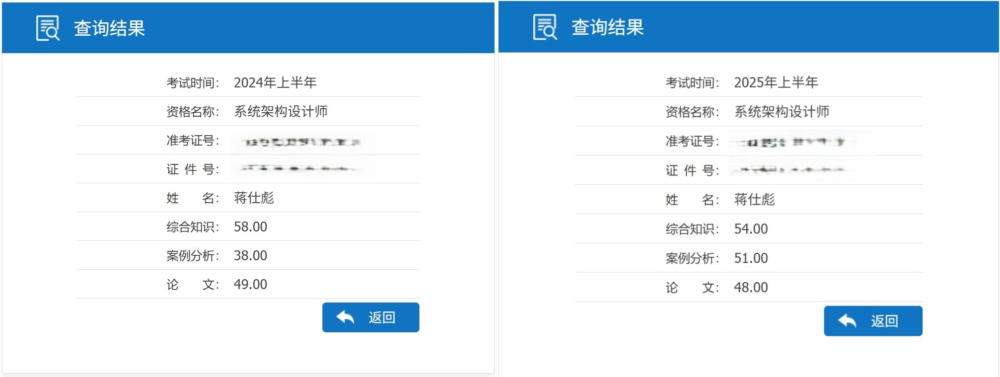

侥幸通过了全国计算机技术与软件专业技术资格考试（软考）的系统，这是我考前对综合知识和案例分析进行的知识整理（已经熟练的内容不做记录）。

## 案例核心背诵点

面向对象设计的主要原则和主要设计模式：

+ **单一责任原则**。
+ **开放-封闭原则**：实体应该是可扩展即开放的，而且是不可修改的即封闭的。
+ **里氏替换原则**：子类一定能替换其基类型。
+ **依赖倒置原则**：高层模块不应依赖底层模块，两者都应该依赖抽象。
+ **接口分离原则**：接口依赖于抽象，不依赖具体。
+ 创建型：抽象工厂（生产系列对象）、构造器、工厂方法（动态生产对象）、原型、单例。
+ 结构型：适配器、桥接、组合、装饰、外观、享元（大量细粒度对象共享）、代理。
+ 行为型：职责链、解释器、迭代器、中介者、备忘录、观察者、状态、访问者、模板方法。

统一建模语言（UML）是一种可视化建模语言，结构包括构造块、关系和图三个部分。

+ **类图**：静态图，展现一组对象、接口、协作和它们之间的关系。
+ **对象图**：静态图，展现某一时刻一组对象及它们之间的关系，是类图的某一快照。
+ **用例图**：静态图，展现一组用例、参与者以及它们之间的关系。
+ **构件图（组件图）**：静态图，展现了一组构件之间的组织和依赖。
+ **部署图**：静态图，部署物理模块的节点分布，与构件图相关（一个节点包含一个或多个构件）。
+ **序列图（顺序图）**：动态图，以时间顺序组织对象之间的交互活动。包括角色、对象、生命线、控制焦点、消息、自关联消息、组合片段（如 loop, break, opt, seq 等）。三种类型的消息：同步消息（从左到右实心线实心箭头），异步消息（从左到右实心线和空心箭头），返回消息（从右到左空心箭头）。
+ **通信图（协作图）**：动态图，强调参加交互的对象的组织。
+ **状态图**：动态图，展现了一个状态机，描述单个对象在多个用例中的行为。
+ **活动图**：动态图，展现了系统内从一个活动到另一个活动的流程。核心元素包括并发分岔、并发汇合、动作、分支、监护表达式、流。每个分岔的分支数代表了可同时运行的线程数。

UML 4+1 视图：逻辑视图，实现视图，进程视图，部署视图；用例视图。

体系结构 4+1 视图（体现关注点分离）：逻辑视图，开发视图，进程视图，物理视图；统一场景。

| 关系             | 图示               | 出现位置     |
| ---------------- | ------------------ | ------------ |
| 泛化（继承）关系 | 实线+空心三角      | 类图         |
| 实现关系         | 虚线+空心三角      | 类图         |
| 依赖关系         | 虚线+箭头          | 类图         |
| 关联关系         | 实线 或 实线+箭头  | 类图，对象图 |
| 组合/聚合关系    | 实线+实心/空心菱形 | 类图，对象图 |

用例图图示：

+ 包含关系：`<<include>>`，基础用例必须包含子用例。
+ 扩展关系：`<<extend>>`，扩展用例在特定条件下增强基础用例。
+ 泛化（继承）关系：空心三角形箭头，参与者之间的继承关系。

**数据流图**（**D**ata **F**low **D**iagram）：外部实体（矩形边框）、数据存储（平行线）、数据流（箭头）、加工（圆弧矩形边框或圆形）四类元素，描述系统中数据的流动、处理和存储过程。

**数据字典**（**D**ata **D**ictionary）：对系统中所有数据元素的结构化定义，是 DFD 的补充说明。

**系统建模语言 SysML**：基于 UML2.0 子集进行重用和扩展，是系统工程的标准建模语言。

**特定领域软件架构（DSSA）**：领域分析（建立领域模型），领域设计（获得 DSSA），领域实现（开发和复用）。四种角色：领域专家，领域分析人员，领域设计人员，领域实现人员。

**基于架构的软件开发（ABSD）**：**架构驱动**，强调由业务、质量和功能需求的组合驱动架构设计。

+ 三个基础：功能的分解、通过选择架构风格来实现质量和业务需求、软件模板的使用。
+ 特点：ABSD 方法是递归的，且迭代的每一个步骤都是清晰地定义的，降低架构设计的随意性。
+ 开发过程：架构需求、架构设计、架构文档化、架构复审、架构实现、架构演化。

**结构化方法**：**用户需求驱动**，自顶向下，严格区分工作阶段，开发过程工程化，文档资料标准化。

+ 优点：理论基础严密，它的指导思想是用户需求在系统建立之前就能被充分了解和理解。
+ 缺点：开发周期长；文档、设计说明繁琐，工作效率低；阶段固化，适合需求明确的开发场景。

软件架构评估所用的主要质量属性：

+ 性能。资源需求（减少占用和数量），资源管理（并发/增加资源），资源仲裁（优先级/调度）
+ 可靠性：在意外或错误使用的情况下维持软件系统功能的基本能力。
+ 可用性：系统能够正常运行的时间比例。
+ 可修改性：快速以较高性能价格比变更的能力（可维护性、可扩展性、结构重组、可移植性）
+ 安全性：抵抗攻击（用户验证、用户授权、维护数据机密性和完整性），检测攻击，攻击恢复
+ 互操作性：本软件系统和其他系统交换数据和相互调用服务的难易程度。
+ 可变性：体系结构经扩充或变更成为新体系结构的能力。

架构评估考虑点：

+ 风险点：系统架构风险是指架构设计中潜在的、存在问题的架构决策所带来的隐患。
+ 非风险点：一般以某种做法，“是可以实现的”、“是可以接受的”方式进行描  述。
+ 敏感点：指为了实现某种特定的质量属性，一个或多个构件所具有的特性。
+ 权衡点：影响多个质量属性的特性，是多个质量属性的敏感点。

三种主要的架构评估方式：基于调查问卷或调查表，基于度量，基于场景（主流）。

质量属性场景六部分：刺激源、刺激、制品（用户界面、平台、环境或与目标系统交互的系统）、环境（系统设计时/编译时/构建时/运行时）、响应、响应度量。

三种基于场景的评估方法举例：

+ 软件架构分析法（SAAM）：非功能性质量属性的架构分析方法。
+ 架构权衡分析法（ATAM）：SAAM 拓展，开发前针对性能/实用性/安全性/可修改性评价和折中。
  + 传统 ATAM：需求收集、架构视图描述、属性模型的构造和分析、架构决策与折中。
  + 现代 ATAM：演示、调查与分析、测试、报告。
+ 成本效益分析法（CBAM）：ATAM 的补充，确定质量合理的基础上对效益进行分析。

软件架构风格：

+ **数据流**：批处理/管道-过滤器：松耦合，重用性，可扩展，交互性差，性能差，*传统编译器*。
+ **调用/返回**。主/子程序：单线程，主程序直接调用子程序；面向对象：对象是构件，通过对象调用封装的方法和属性；层次结构：分层，每层最多影响上下两层，有调用关系。
+ **独立构件**。进程通信：进程间独立消息传递，分为同步、异步、点对点、远程四种；事件驱动：构件通过事件触发异步响应，*语法高亮，语法错误提示*。
+ **虚拟机**。解释器：灵活应对自定义场景；复杂度高，执行效率低；规则系统：解释器基础上增加了经验规则，*专家系统，人工智能系统*。
+ **仓库**。统一的数据访问接口，简化数据处理逻辑；高负载情况下，中心仓库可能成为性能瓶颈。数据库：中央共享数据源，独立处理单元；超文本：网状链接，多用于互联网，*现代集成编译环境*；黑板：包括黑板、知识源、控制三部分，用于复杂问题或不确定性推理，*语音识别、知识推理*。
+ **闭环控制**：接收输入后确定输出使环境达到新的状态，*空调温控，定速巡航*。
+ **C2 风格**：构件和连接件都有顶部和底部，构件之间不允许直连

层次架构的 MVC 模式：分层管理复杂的应用程序，分组开发，具有良好的可扩展性和可维护性。

+ 模型（Model）：持有应用程序的数据、状态和逻辑。*JavaBean+DAO*
+ 视图（View）：负责界面的显示与用户的交互功能，例如表单和网页。*JSP/HTML/CSS*
+ 控制器（Controller）：接收用户输入，调用模型和视图完成需求。*Servlet*

流程：*JSP* 发送数据到 *Servlet*，解析后调用相应的 *Service/DAO*，使用 *JavaBean* 封装并返回出去。

层次架构的 MVP 模式：避免了 View 和 Model 的耦合，降低了 Presenter 对 View 的依赖。

面向服务的架构（**S**ervice-**O**riented **A**rchitecture）：粗粒度，松耦合，标注化。

+ SOA 是一种设计理念，其中包含多个服务，服务之间相互依赖最终提供一系列完整的功能。
+ 各个服务通常以独立形式部署运行，服务之间通过网络调用。

企业服务总线（**ESB**）：客户端（服务请求者）基础架构服务（中间件）核心集成服务（提供服务）

+ 集成不同协议的不同服务，做了消息的转化、解释以及路由的工作。
+ 在 SOA 架构中起到了总线的作用，描述服务的元数据和服务注册管理。

微服务是一种特殊的面向服务架构：

+ 特点：复杂应用解耦；独立部署，弹性，技术异构性；轻量级的通信机制；松耦合、易扩展。
+ 相比 SOA：拆分得更加精细，更多地以独立的进程存在，互相之间没有影响；提供的接口方式更加通用化，无关语言和平台限制；更倾向于分布式去中心化的部署方式。

中间件是一种独立的系统软件或服务程序，可以帮助分布式应用软件在不同的技术之间共享资源。

+ 优点：面向需求，业务分隔和包容性，设计与实现隔离，标准交互模型，复用。

反规范技术：增加冗余列（不同表里相同列）、增加派生列、组新表、水平分割表、垂直分割表。

+ 解决反规范场景数据不一致的三种方式：批处理维护、应用逻辑、触发器。

事务的特性（ACID）：（操作）原子性，（数据）一致性，（执行）隔离性，（改变）持久性。

CAP 三选二：一致性（Consistency）、可用性（Availability）、分区容忍性（Partition Tolerance）。

NoSQL：易扩展，大数据量，高性能，灵活的数据模型，高可用；弱一致性，柔性事务。

+ 键值对型：扩展性强、灵活性强、操作性能高；无结构化。缓存、日志。*Redis*，*MemCached*。
+ 列式存储：扩展性强、查找速度快、复杂度低；功能局限。分布式数据存储。*HBase*, *Cassandra*。
+ 文档型：结构灵活、可根据 Value 建索引；性能不高。Web 应用。*MongoDB*，*CouchDB*。
+ 图数据库：支持复杂的图形算法；复杂度高、实现困难。图存储三个字段：节点、关系和属性。社交网络、推荐系统。*Neo4j*，*OrientDB*。

Redis 常见类型和常见命令：

+ String。`(M)SET, (M)ET, INCR, DECR, INCRBY, DECRBY, APPEND, STRLEN`
+ Hash。`H(M)SET, H(M)GET, HGETALL, HDEL, HEXISTS, HKEYS, HVALUES, HLEN`
+ List。`LPUSH, RPUSH, LPOP, RPOP, LRANGE, LLEN, LIDEC, LREM, LTRIM`
+ Set。`SADD, SMEMBERS, SISMEMBERS, SCARD, SREM, SPOP, SINTER, SUNION, SDIFF`
+ SortedSet。`ZADD, Z(REV)RANGE, Z(REV)RANK, ZSCORE, ZCARD, ZCOUNT, ZREM`

Redis 常见难题：

+ 缓存雪崩：大部分缓存失效 --> 数据库崩溃。使用锁或队列、key 设置不同失效时间、多级缓存。
+ 缓存穿透：查询无数据返回 --> 直接查数据库。查询为空也放缓存、布隆过滤器。

## 计算机系统

| 芯片 | 描述                                                         |
| ---- | ------------------------------------------------------------ |
| CPU  | 冯诺依曼架构。更强调控制和决策，在并行计算效率上有较大提升空间。 |
| GPU  | 减少了大量数据预取和决策模块，增加了计算单元 ALU 的占比，并行化效率有优势。 |
| ASIC | 专门针对某一领域设计的芯片，如神经网络计算芯片 NPU、Tensor 计算芯片 TPU。 |
| FPGA | 计算逻辑十分灵活，几乎没有控制模块（大多数是 ALU），设计难度和复杂度较高。 |

| 类型 |              指令              | 寻址方式 |          实现方式          |
| :--: | :----------------------------: | :------: | :------------------------: |
| CISC | 数量多，频率差别大，可变长格式 | 支持多种 |       微程序控制技术       |
| RICS | 数量少，使用频率接近，定长格式 | 支持少量 | 增加通用寄存器，适合流水线 |

总线按传输方式划为并行和串行（半双工、全双工），按功能划为：

+ 数据总线（DB）：在 CPU 与 RAM 之间来回传送需要处理或存储的数据。
+ 地址总线（AB）：指定在 RAM 中存储的数据的地址。
+ 控制总线（CB）：将微处理器控制单元的信号传输到周边设备。

校验码：奇偶校验（不可纠错）、CRC 循环冗余校验（不可纠错）、海明校验（树状数组，可纠错）。

寻址方式：立即寻址（给出操作数）、直接寻址（给出主存地址）、间接寻址（操作数对应的地址）。

嵌入式特性：规模小，专用性强，开发难度大，性能价格比高，软硬结合，开发环境和运行环境不同，程序代码固化在非易失存储器重，可裁剪性，可配置性，强实时性。

可靠性设计：检错技术、容错技术、避错技术、降低复杂度技术。

+ **M**ean **T**ime **T**o **F**ailure：平均无故障时间。
+ **M**ean **T**ime **T**o **R**epair：平均失效修复时间。
+ **M**ean **T**ime **B**etween **F**ailure：平均故障间隔时间。MTBF=MTTF+MTTR。

容错技术：

+ N 版本程序设计：多机，动态冗余，前向恢复，实时性好。需要考虑同步、通信、表决、一致性。
+ 恢复块方法：单机，静态冗余，后向恢复，实时性差。
+ 防卫式程序设计：程序中包含错误检查和错误恢复。
+ 双机容错。双机热备（一主一备），双机互备（同时+不同服务）、双机双工（同时+相同服务）。
+ 集群技术：可伸缩性、高可用性、可管理性、高性价比、高透明性。

操作系统分类：批处理、分时（多路性、独立性、交互性和及时性）、实时、网络。

+ 三态模型：运行、就绪、阻塞。
+ 五态模型：运行、静止就绪、活跃就绪、静止阻塞、活跃阻塞。

嵌入式系统分为五层：硬件层，抽象层（如板级支持包 BSP），操作系统层，中间件层，应用层。

+ 冯诺依曼结构（普林斯顿结构）：程序指令存储器和数据存储器合并在一起的存储结构。
+ 哈佛结构：并行体系结构，程序和数据存储在不同的存储空间。有两套地址总线和数据总线。

嵌入式微处理器通常由控制单元（控制器）、算术逻辑单元（运算器）、寄存器三大部分组成。

+ 微控制器（MCU）：典型代表是单片机，片上外设资源比较丰富，适合控制。
+ 微处理器（MPU）：通用 CPU 保留和嵌入式应用紧密的功能硬件。
+ 信号处理器（DSP）：哈佛体系结构，多总线。编译效率高，执行速度快。
+ 片上系统（SOC）：追求产品系统最大包容的集成器件，软硬件无缝结合，减小系统体积和功耗。

嵌入式操作系统（EOS）：用于嵌入式系统的操作系统。

+ 特点：系统内核小，专用性强，系统精简，高实时性，多任务的操作系统。
+ 举例：嵌入式 Linux，Windows Embedded，VxWorks，μC/OS-II（嵌入式实时操作系统）。

嵌入式实时操作系统（RTOS）：要求系统在投入运行前即具有可预测性和确定性。

## 数据库系统

三级模式：**外模式** 对应 **视图**；**模式**（概念模式）对应数据库里的 **表**；**内模式** 管理如何存储物理 **数据**。

+   视图的优点：简化用户操作、不同方式查询统一数据、逻辑独立性、对机密数据提供安全保护。

两层映像：外模式-模式映像（保证逻辑独立性），模式-内模式映像（保证物理独立性）。

数据库设计的主要流程：

1.  需求分析。产出数据流图、数据字典和需求说明书。获得用户的信息要求、处理要求、系统要求。
2.  概念结构设计。设计局部 ER 模型，合并模型消除冲突，重构优化消除冗余。
3.  逻辑结构设计。确定数据模型、ER 图转化为数据模型、确定完整性约束和用户视图。
4.  物理设计。确定数据结构，存储结构和访问方式。首要提高性能，其次节省存储空间。

候选码/码：能够唯一标识关系的极大的无冗余的属性/属性组。候选码里的属性都是主属性。

主键/主码：任选一组候选码。

|     范式     |                      描述                      |
| :----------: | :--------------------------------------------: |
| 第一范式 1NF |             属性值都是不可分的原子             |
| 第二范式 2NF |          每个非主属性完全依赖于候选键          |
| 第三范式 3NF |       每个非主属性都不存在对码的传递依赖       |
| BC 范式 BCNF | 每个主属性都不存在对码的部分函数依赖或传递依赖 |

封锁技术：排他型封锁（X 锁，写锁），共享型封锁（S 锁，读锁）。

+   一级封锁协议：修改数据前施加 X 锁，事务结束释放。防止丢失修改。
+   二级封锁协议：一级基础上，读取数据前施加 S 锁，读完后释放。额外防止读脏数据。
+   三级封锁协议：一级基础上，读取数据前施加 S 锁，事务结束后释放。额外防止数据重复读。

分区的优点：存储更多数据、数据管理和定位方便、跨多个分区查询提高吞吐量、数据合并方便。

分布式数据库系统：分布性、逻辑相关性、场地透明性、场地自治性。

| 数据备份方式 |                 优点                 |              缺点              |
| :----------: | :----------------------------------: | :----------------------------: |
| 冷（静）备份 |   快速、容易归档、低维护度、高安全   | 提供到某一时间点，不能按表恢复 |
| 热（动）备份 | 基于表和文件恢复，备份时数据库可使用 |  不能出错，后果严重；难于维护  |

日志：DBMS 将事务的开始结束和数据库的所有修改写入文件里，一旦故障可回退到事务的初始状态。

Redis 持久化：RDB 内存快照（文件小、恢复效率高）；AOF 命令日志（文件大、恢复效率低）

| Redis 分布式存储方案  | 特点                                                        |
| :-------------------: | ----------------------------------------------------------- |
| 主从模式 Master/Slave | 一主多从，故障时手动切换                                    |
|   哨兵模式 Sentinel   | 有哨兵的一主多从，主节点故障自动选择新的主节点。            |
|   集群模式 Cluster    | 分节点对等集群，分 slots，不同 slots 的信息存储到不同节点。 |

嵌入式数据库由三部分组成：客户端、通信协议、远程服务器。

+   基于内存方式（MMDB）。*eXtrameDB*：最小化资源消耗、极小堆空间和代码体积。
+   基于文件方式（FDB）。*SQLite*：开源内嵌式关系型数据库，集成在程序中。
+   基于网络方式（NDB）。C/S 结构、B/S 结构、云数据库。

数据仓库的结构包含四个层次：数据源、数据的存储与管理、OLAP 服务器和前端工具。

+ 联机事务处理 OLTP：操作人员、底层管理，用于日常操作，处理数十条当前数据。

+ 联机分析处理 OLAP：决策人员、高层管理，用于分析决策，处理上百万条历史数据。

数据湖是一个存储企业的各种各样原始数据的大型仓库，其中的数据可供存取、处理、分析和传输。

## 计算机网络和信息安全

应用层协议和端口号：

+   IMAP **43** 服务器上管理邮件；POP3 **110** 下载邮件至本地；SMTP **25** 发送邮件。
+   Telnet **23** 远程登录并执行命令（明文）；SSH **22** 远程登录并执行命令（加密）。
+   FTP 文件传输 **20** 控制连接 **21** 数据连接；TFTP **69** 轻量级文件传输。
+   DHCP 动态主机配置协议 **67** 服务端 **68** 客户端；SNMP **161** 管理和监控网络设备；DNS **53**。
+   HTTP **80** 超文本传输协议；HTTPS **443** 安全的超文本传输协议。

OSI 七层模型：物理层、数据链路层（Ethernet，交换机）、网络层（IP，ICMP，ARP，路由器）、传输层（TCP，UDP）、会话层（RPC）、表示层（SSL/TLS，JPEG）、应用层（FTP，SMTP，DNS）。

传输层协议：TCP 和 UDP。相同点是都基于 IP 协议，可以端口寻址。

| 对比维度 |                TCP                 |          UDP           |
| :------: | :--------------------------------: | :--------------------: |
|   连接   |       面向连接管理，三次握手       |      广播，无连接      |
|   差错   | 差错校验和重传，按序接收，可靠性高 | 错误检测功能弱，不可靠 |
|   流控   |          流量控制，效率低          |   无拥塞控制，速度快   |
| 代表协议 |   HTTP、FTP、Telnet、SMTP、POP3    | DNS、DHCP、TFTP、SNMP  |

网络层协议：

+   IP：网络层核心协议，源地址和目的地址之间传送数据报，无连接、不可靠。
+   ICMP：因特网控制报文协议，用于在 IP 主机、路由器之间传递控制消息。
+   ARP/RARP：地址解析协议，前者将 IP 地址转换为物理地址，后者将物理地址转化为 IP 地址。
+   IGMP：网络组管理协议，是计算机用来向相邻多目路由器报告多目组成员的协议。

局域网 LAN 10m-1km；城域网 MAN：10km；广域网 WAN：100km

+ 网络互联通信模式：点对点型（网络互联）、Hub 型（终端接入）、完全分布型（理论探讨）。
+ 网络拓扑结构：总线型、环型、星型、树型、层次型。

以太网 Ethernet 规范 IEEE 802.3，数据帧长 $[64,1518]$ 字节，最小帧长根据网络检测冲突时间而定。

DHCP：客户机/服务器模型，租约默认 $8$ 天（过半要续租，租约超过 $87.5\%$ 开始联系其他服务器）。

1.  查询本机 HOST 文件，没有映射时查询域名服务器。
2.  查询本地域名服务器。主机向本地域名服务器一般使用递归查询（回答 IP 与域名的映射关系）。
3.  根域名服务器。本地域名服务器向根域名服务器一般使用迭代查询。

IPv6 优点：地址长度扩充至 $128$ 位，灵活的首部格式，提高安全性，支持即插即用，允许协议演变。

IPv4 过渡 IPv6 三种技术：双协议栈，隧道技术（IPv6 当数据以 IPv4 上传），翻译技术（互相转换）。

计算机系统安全保护能力的五个等级：用户自主，系统审计，安全标记，结构化，访问验证。

网络安全协议：

+   SSL：加密网络通信的协议，用于保护数据在客户端和服务器之间的传输安全。
+   TLS：SSL 的改进版。TLS1.0/TLS1.1 存在安全问题，TLS1.2 广泛使用，TLS1.3 安全性更高。
+   SSH：用于远程登录和执行命令的协议，提供加密的通信通道。
+   SET：安全电子交易协议，依赖数字证书保证支付双方身份可信。
+   PGP：针对邮件的混合加密系统。杂合了 IDEA/RSA/MD5/ZIP 加密，承认 PGP/X509 两种证书。

网络攻击：

+   被动攻击：收集信息为主，破坏保密性。包括网络监听/业务流分析/非法登录。
+   主动攻击：假冒/旁路/重放/Dos/XSS 跨站脚本攻击/CSRF 跨站请求伪造/缓冲区溢出/SQL 注入。

BLP 模型，划分数据的机密性：低级别主体**读**高级别客体受限，高级别主体**写**低级别客体受限 。

Biba 模型，保护数据的完整性：低级别主体**写**高级别数据受限，高级别主体**读**低级别客体受限 。

信息安全整体架构设计：WPDRRC 模型。

+ 3 要素：人员、策略和技术。
+ 6 环节：预警、保护、检测、响应、恢复和反击。

区块链：去中心化、开放性、自治性、安全性（信息不可篡改）、匿名性（去信任）。

## 信息系统开发

MBSE：建模方法的形式化应用。三大支柱：建模语言、建模思路、建模工具。

信息系统的开发方法：结构化方法、原型法、面向对象方法、面向服务方法、构件化方法、敏捷方法。

|   常见信息系统   | 关键点                                                       |
| :--------------: | ------------------------------------------------------------ |
| 业务处理系统 TPS | 早期最初级的系统：数据输入、数据处理、数据库维护、报表生成。 |
| 管理信息系统 MIS | 高度集成化的人机信息系统。                                   |
| 决策支持系统 DSS | 由语言系统、知识系统和问题处理系统组成，解决半/非结构化问题。 |
|   专家系统 ES    | 知识+推理=专家系统，是人工智能的一个重要分支。               |
| 办公自动系统 OAS | 由计算机设备、办公设备、数据通信及网络设备、软件系统组成。   |
| 企业资源计划 ERP | 打通供应链，集成，整合                                       |

**信息系统战略规划（ISSP）**：从企业战略出发，构建基本信息架构，内外信息统一规划、管理与应用。

+ 阶段一：数据处理为核心。企业系统规划法、关键成功因素法、战略集合转化法。
+ 阶段二：企业内部管理信息系统为核心。战略数据规划法、信息工程法。战略栅格法。
+ 阶段三：以集成为核心。价值链分析法、战略一致性模型。

ERP：整合企业 **物流、资金链、信息流**。发展过程：物料需求计划、制造资源计划、企业资源计划。

+ 企业集成按 集成点 划分：界面集成、数据集成、控制集成、业务流程（过程）集成、门户集成。
+ 企业集成按 传输方式 划分：消息集成、共享数据库、文件传输。

需求关系：包含、跟踪、继承需求、改善、满足、验证和复制。

软件架构复用的基本过程：首先构造/获取可复用软件资产，其次管理这些资产，最后选择可复用部分。

+ 机会复用：开发过程中发现可复用资产进行复用。
+ 系统复用：开发之前进行规划决定哪些需要复用。

范围管理：确定项目的边界，即哪些工作是项目应该做的，哪些工作不应该包括在项目中。

范围计划编制 -> 范围定义 -> 创建 WBS -> 范围确认 -> 范围控制。

时间/进度管理：活动定义 -> 活动排序 -> 活动资源估算 -> 活动历时估算 -> 制定进度计划 -> 进度控制

PERT 图：描述不同任务之间的依赖关系；

+ 关键路径法：沿着 PERT 图项目进度网络路线进行正向与反向分析，不考虑任何资源限制。

Gantt 图：描述不同任务之间的重叠关系。

+ 优点：容易制作，清晰标识每个任务的起止，适用于小型项目；
+ 缺点：无法表达复杂度关系，难以定量分析。

## 软件工程

软件过程模型：

+   瀑布模型 SDLC：各个活动规定为依线性顺序连接的若干阶段的模型，管理成本低。适用于需求明确的项目，很长时间才能看到结果，一旦发生错误推倒重来。
+   原型模型：适用于需求不明确的场景，可以帮助用户明确需求。水平原型用于界面设计，垂直原型用于复杂算法实现。抛弃型原型：需求确认手段，用于界面设计；演化型原型：用于易于升级和优化的项目如 Web。
+   增量模型：融合 **瀑布模型** 的基本成分和 **原型** 的迭代特征，核心功能可得到充分测试。和原型的区别是每一个增量版本均发布一个独立可操作的产品。
+   螺旋模型：快速原型基础上结合瀑布模型扩展，是多种模型的混合，强调风险分析。每一阶段分为目标设定、风险分析、开发和有效性验证、评审。
+   V 模型：强调测试贯穿项目始终，而不是集中在测试阶段。是一种测试的开发模型。
+   喷泉模型：面向对象模型而非结构化模型，特点是迭代、无间隙。划分成多个阶段，无明显界限。
+   快速应用开发 RAD：瀑布模型的高速变种，强调极短的开发周期，适用于基于构件的开发方法。过程：业务建模 $\rightarrow$ 数据建模 $\rightarrow$ 过程建模 $\rightarrow$ 应用生成 $\rightarrow$ 测试与交付。
+   基于构件的开发模型 CBSD：增加了可复用性，开发过程中会构建一个构件库供其他系统复用，可以提高可靠性、节省时间和成本。要求经验丰富的架构师，设计不好的构件难重用。组装方式：顺序组装，层次组装（调用另一个服务构件），叠加组装（两个或以上构件组成新构件）。不兼容问题：参数不兼容，操作不兼容（提供接口和请求接口操作名不同），操作不完备（功能是子集）。

敏捷模型：以人为核心，迭代、循序渐进，适用于小团队和小项目，小步快跑。

+   极限编程 XP：近螺旋式开发，将复杂过程分解成简单周期，高效、低风险、**测试先行**。
+   水晶系列方法：提倡 **机动性** 的方法，拥有对不同类型项目非常有效的敏捷过程。
+   并列争球法 SCRUM：明确定义了的可重复的方法过程，迭代的增量化过程，侧重项目管理。
+   特性驱动开发方法 FDD：需要人、过程和技术。开发人员分成两类：首席程序员和“类”程序员。
+   统一过程 RUP：特点是用例驱动、以架构为中心、迭代和增量。分为四个阶段：构思阶段、细化阶段、构建阶段、移交阶段。定义了角色、活动、制品、工作流等概念。
+   自适应软件开发 ASD：其核心是三个非线性的、重叠的开发阶段：猜测、合作与学习。

软件能力成熟度模型 CMM：初始级，可重复级，已定义级，已管理级，优化级。

逆向工程

+   重构：同一抽象级别上转换系统描述形式。
+   设计恢复：借助工具从已有程序中抽象出有关数据设计、总体结构设计和过程设计。
+   再工程：在逆向工程所获信息的基础上，修改或重构已有的系统，产生系统的新版本。
+   正向工程：不仅从现有的系统中恢复设计信息，而且使用该信息去改变或重构现有系统。

需求工程分为以下步骤：

1.  需求获取。包括用户访谈、问卷调查、采样、情节串联板、联合需求计划 JRP 等。
2.  需求分析。结构化需求分析的特点：自顶向下，逐步分解，面向数据。数据字典+三大模型：功能模型（数据流图 DFD），行为模型（状态转换图 STD），数据模型（E-R 图）。
3.  需求定义。产物是软件需求规格说明书 **S**oftware **R**equirements **S**pecification。
4.  需求验证（需求确认）：与用户一起确认需求无误，包括需求评审和需求测试。
5.  需求管理。定义基线，需求跟踪（正向跟踪和逆向跟踪），变更控制（变更控制委员会 CCB）。

面向对象：对象（属性+方法+对象 ID），类（实体类/控制类/边界类），消息异步通信。

软件测试按是否在计算机上运行程序分为动态测试和静态测试两类：

+   动态测试-黑盒测试：方法包括等价类划分，边界值划分，错误推测，因果图。
+   动态测试-白盒测试：覆盖级别从低到高包括：
    +   语句覆盖：每条语句至少执行一次.
    +   判定覆盖（分支覆盖）：每一判定的每个分支至少执行一次。
    +   条件覆盖：每一判定中的每个条件，分别按真、假至少各执行一次。
    +   判定/条件覆盖：同时满足判定覆盖和条件覆盖的要求。
    +   条件组合覆盖：求出判定中所有条件的各种可能组合值，每一可能的条件组合至少执行一次。
    +   路径覆盖：逻辑代码总的所有可行路径都覆盖了。
+   静态测试（纯人工）：桌前检查，代码审查，代码走查。

测试阶段：

+   单元测试：依赖软件 **详细设计** 说明书，测试对象是程序模块、软件构建或者 OO 软件的类。
+   集成测试：依赖软件 **概要设计** 说明书，将所有模块进行组装测试（一次性组装/增量式组装）。
+   确认测试：依赖 **需求文档**，检验符合用户需求。内部确认测试、Alpha/Beta 测试、验收测试等。
+   系统测试：依赖 **需求文档**，包括功能测试、性能测试、验收测试、压力测试等。
+   回归测试：测试软件变更之后，变更部分的正确性对变更需求的符合性。

| **遗留系统改造** | **业务价值低** | **业务价值高** |
| ---------------- | -------------- | -------------- |
| **技术水平高**   | 集成           | 改造           |
| **技术水平低**   | 淘汰           | 继承           |

## 软件架构设计

软件架构为软件系统提供了一个结构、行为和属性的高级抽象。

软件架构风格是特定应用领域惯用模式，定义一个**词汇表**（构件和连接件）和一组**约束**（组合方式）。

层次结构：

+ 两层 C/S 架构：客户端和服务器都有处理功能。缺点：开发成本高，客户端程序复杂，移植困难。
+ 三层 C/S 架构：将处理功能独立出来，表示层和数据层都变简单。优点：各层独立，可并行开发。
+ 三层 B/S 架构：客户端变为浏览器。缺点：缺乏动态页面的支持，安全性难以控制，响应速度慢。

软件构件是一种组装单元，它具有规范的接口规约和显式的语境依赖，特点是自包容与可重用。

+ 构件是个独立发布的功能部分，可以通过其接口访问它的服务。
+ 检索与提取构件：关键字分类（树型、DAG）、刻面分类（特征）、超文本分类（联想跳转）。

三大构建标准：COBRA，J2EE（EJB）、DNA2000，其中 J2EE 包括：

+ 会话 Bean：实现业务逻辑，负责完成服务端与客户端的交互。
+ 实体 Bean：实现 O/R 映射，简化数据库开发工作。
+ 消息驱动 Bean：处理并发与异常访问。

数据访问层设计：在线访问，DAO，DTO，离线数据模式，对象/关系映射。

+ DAO：J2EE 设计模式，将底层数据访问操作与高层业务逻辑分离开。典型 DAO 由一个 DAO 工厂类、一个 DAO 接口、一个实现了的具体类、数据传输对象组成。
+ DTO：EJB 设计模式，一组对象或容器，需要跨越不同进程或网络边界来传输。

MDA 的 3 种核心模型：平台独立模型（PIM），平台相关模型（PSM），代码 Code。

ADL 的 3 个基本元素：构件，连接件，架构配置。

J2EE 四层架构：客户层/Web 层/业务层/企业信息系统层。

| 功能       | 协议                                                         |
| ---------- | ------------------------------------------------------------ |
| 发现服务   | UDDI（Web 服务描述与发现的标准规范），DISCO                  |
| 描述服务   | WSDL（服务描述语言，做什么/如何访问/位于何处），XML Schema   |
| 消息格式层 | SOAP（基于 XML，分为封装、编码规则、RPC、绑定） REST（只使用 HTTP 和 XML 进行基于 Web 通信的技术） |
| 编码格式层 | XML（DOM，SAX）                                              |
| 传输协议层 | HTTP，TCP/IP，SMTP 等                                        |

Restful：万事抽象为资源，资源唯一标识，通过接口操作资源，操作不改变资源标识，操作无状态。

响应式 Web 设计：一种网络页面设计布局。

+ 理念：集中创建页面的图片排版，可以智能地根据用户行为以及使用的设备环境进行对应布局。
+ 方法：采用流式布局和弹性化设计、响应式图片。

Web 举例：*Apache* 主流、*IIS* 早期、*Tomcat* 开源 Java、*JBOSS* J2EE、*Jetty* 开源 servlet

云计算：集合了大量计算设备和资源，对用户屏蔽底层差异的分布式处理架构

+ Saas（多租户，提供应用程序）、Paas（虚拟中间件服务器）、Iaas（服务器、存储、网络）。
+ 优点：超大规模、虚拟化、高可靠性、高可伸缩性、按需服务、成本低。

云原生：基于分布部署和统一运管的分布式云，以容器、微服务、DevOps 等技术建立的一套云技术产品体系。架构：服务化、Mesh 化、Serverless、存储计算分离模式、分布式事务模式、事件驱动架构。

使用服务集群改善网站并发处理能力

+ 应用层负载均衡：http 重定向（实现简单性能较差），反向代理服务器（部署简单性能瓶颈）。
+ 传输层负载均衡。DNS 域名解析负载均衡、基于 NAT 负载均衡。
+ 硬件负载均衡：F5；软件负载均衡：LVS、Nginx、HAproxy。
