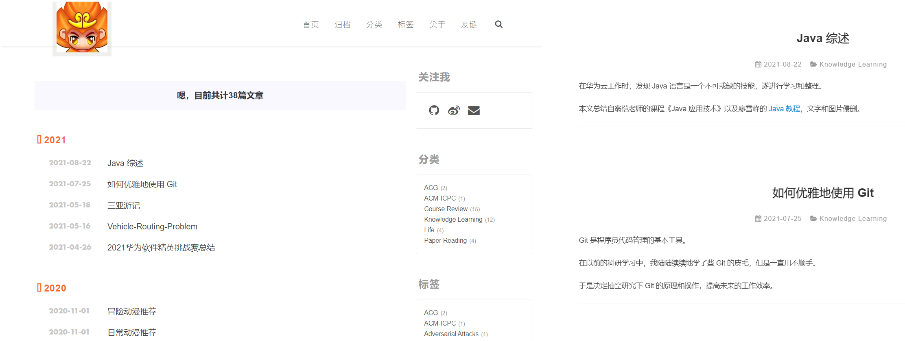

## 背景介绍

2020 年 6 月，我入坑 Hexo + Github 托管的懒人模式。Hexo 主张用 markdown 写博文，借助强大的 theme 生态来一件配置主题；而 Github 能提供服务器的挂载（虽然国内访问会不稳定）。我当时选择的主题是 Hiker。




随着时间的推移，我不再满足于 Hiker 的风格和简单功能，于是决定从头开始配置 Hexo，并做一些记录。

## 搭建 Hexo

首先安装 Node.js（它会附带安装 npm 包管理器）。

根据 [hexo 官网首页]() 的命令在本地创建 `blog` 文件夹。

~~~shell
npm install hexo-cli -g
hexo init blog
cd blog
npm install
~~~

在 shell 里输入 `hexo server` 命令后，就能在 `localhost:4040` 展示网页效果（它还会动态检测你的本地变更并动态更新）。如果打开网页后出现以下报错：

~~~
extends includes/layout.pug block content #recent-posts.recent-posts include includes/recent-posts.pug include includes/pagination.pug 
~~~

需要再在 shell 里安装一下：

~~~shell
npm install --save hexo-renderer-jade hexo-generator-feed hexo-generator-sitemap hexo-browsersync hexo-generator-archive
~~~

此时打开 `localhost:4040` 会出现以 landscape 为主题的网页，有一篇默认的 Hello World 文章。

## 使用 Butterfly 3.x 主题

Hexo 提供了一个 [官方主题网址](https://hexo.io/themes/) 供大家选择主题。我以前用的 Hiker 在几年前就不再维护了，功能上也存在很多的不足。最后，我综合好看程度、可拓展性、功能复杂性和社区活跃性，选择换成了 [Butterfly 主题](https://github.com/jerryc127/hexo-theme-butterfly)。

~~~shell
git clone -b master https://github.com/jerryc127/hexo-theme-butterfly.git themes/butterfly
npm install hexo-renderer-pug hexo-renderer-stylus --save
~~~

`blog` 文件夹下的 `_config.yml` 是全局配置文件，我们需要把 `theme` 从 `landscape` 换成 `butterfly`。

`themes/butterfly/_config.yml` 则是 butterfly 主题支持的各种功能的配置文件，它比全局配置要复杂很多。

[butterfly 文档](https://butterfly.js.org/categories/Docs%E6%96%87%E6%AA%94/) 里介绍了对应的各种功能，我们可以根据自己的喜好来配置。

## 修复图片显示问题

之前用 Hexo 写博客的时候，我习惯用 `` 的形式来引用图片，其中 `<title>.md` 是当前博文的文件名，`<title>` 是它对应的专属资源文件夹。

配置 Butterfly 时为了规避 Hexo 等工具升级的麻烦，我选择一切工具/配置重装，只把 `source` 下的 markdown 文件拷贝过去。然后我就发现一个问题：无论是 `hexo server` 还是 `hexo deploy` 命令，图片都无法显示。

经过反复的搜索和试验，我终于成功把图片显示出来了！采取的步骤参见 [这里](https://blog.csdn.net/xjm850552586/article/details/84101345)。首先我们在 `_config.yml` 全局配置里把资源文件夹开关 `post_asset_folder` 设置成 `true`。然后我们安装一个图片间接引用的插件：

~~~shell
npm install https://github.com/CodeFalling/hexo-asset-image --save
~~~

最后我们打开 `node_modules/hexo-asset-image/index.js`，把内容替换（我们相当于修复了一个 bug）。

 ## 数学渲染的配置

作为一个 Latex 控，我首先关注的是 markdown 的公式能否被正确地渲染，特别是多行公式和复杂公式。

butterfly 提供了 mathjax 和 katex 两种渲染功能，我们可以在 在 `themes/butterfly/_config.yml`  里全局开启，或者在需要的博文里单独开启。实测发现 mathjax 不支持多行公式和花括号。

最终我选择了 katex，它速度快、渲染效果也好。我们首先要更换渲染器。

~~~shell
npm un hexo-renderer-marked --save 
npm un hexo-renderer-kramed --save
npm i hexo-renderer-markdown-it --save 
npm install @neilsustc/markdown-it-katex --save
~~~

在 `themes/butterfly/_config.yml` 里把 `katex` 开启成`true`，然后在 `_config.yml` 里加上这段话：

~~~yaml
markdown:
  plugins:
    - plugin:
      name: '@neilsustc/markdown-it-katex'
      options:
        strict: false
~~~

## 推送至 github

安装 github 的自动发布工具。

~~~shell
npm install hexo-deployer-git  --save
~~~

在 `_config.yml` 里修改 deploy 规则。

~~~yaml
deploy:
  type: git
  repo: git@github.com:jiangshibiao/jiangshibiao.github.io.git
  branch: master
~~~

命令行里输入 `hexo deploy` 即可把网站部署到 github 上。

## Butterfly 升级至 5.3.2

在 github 下载最新的 butterfly 5.3.2 版本替换本地 `theme/butterfly`，同步更新 hexo 至最新的 7.3.0 版本。

记得将 butterfly 的配置文件从 `theme/butterfly/config.yml` 迁移到根目录下的 `_config.butterfly.yml`，这样未来每次主题升级时都可以直接整个替换 `theme/butterfly` 文件夹。

大版本更新后配置项文件有很多 breaking change，推荐对着旧配置一项一项定位到新配置模板里修改。由于我大部分配置都用了默认模式，替换过程比较顺利。有几个值得注意的变化点：

+  `subtitle.sub` 字段类型从字符串迁移到了数组，复用原来的单串会报错，详见 [这个 issue](https://github.com/jerryc127/hexo-theme-butterfly/issues/741)。 
+ 侧边栏新增了公告模块，在 `aside.card_announcement` 里配置公告的文字。
+ 全局默认字体有变化，如果要回退成旧版本字体得显式声明，即 `font.font_family: Helvetica Neue`。

## 新增搜索功能

butterfly 新版本支持 algolia_search、local_search 和 docsearch。我选择了比较方便的 local_search。

需要安装 `hexo-generator-search`，即：

```
npm install hexo-generator-search --save
```

在全局配置文件 `_config.yml` 里加入以下内容：

```yaml
search:
  path: search.xml
  field: post
  format: html
  limit: 10000
```

在主题配置项里用 use 指定 local_search 类型，相关参数可以沿用默认值：

```yaml
search:
  # Choose: algolia_search / local_search / docsearch
  # leave it empty if you don't need search
  use: local_search
  # Local Search
  local_search:
    # Preload the search data when the page loads.
    preload: false
    # Show top n results per article, show all results by setting to -1
    top_n_per_article: 1
    # Unescape html strings to the readable one.
    unescape: false
    CDN:
```

## 顶部图片显示问题

升级过程整体顺利，唯一的小问题是 **所有博文顶部的图片无法正常显示**。配置项在每一篇博文 markdown 顶部的 FronterMatter 里，相关字段是 `cover` 和 `top_img` ，分别表示外层封面图片和文章顶部图片。我以前都是填写前者而省略后者，这样都能正常显示同一张图，即 `top_img` 不存在时会自动填充 `cover` 的路径。

以前通过相对路径索引图片，即 `cover: /post_images/<image_name>`，将图片放在 `source/post_images` 文件夹内（不同博文混在一起）。F12 观察升级后的网站，外层无报错，打开任意一篇博文后有一条 404 的报错：

```
GET https://jiangshibiao.github.io/<post_name>/post_images/<image_name> 404
```

说明 butterfly 版本升级之后顶部图片的索引路径构建逻辑发生了变化，不再支持根路径开始导航，会强制在前面加一段博文的名字，导致图片索引 404。关于这个问题我查询了各种资料（包括 [Issue](https://github.com/jerryc127/hexo-theme-butterfly/issues?q=is%3Aissue%20state%3Aclosed) 和 [官网主题配置教程](https://butterfly.js.org/posts/4aa8abbe/)），均没有找到有用的线索。而 butterfly 源码比较复杂（不同结构之间嵌套调用），定位和修改比较费时间。

捣鼓了一阵子，发现把图片路径改为 `cover: ../post_images/<image_name>` 即可修复此问题。

## 修改时间倒序

`hexo n` 创建博文时，会在 FronterMatter 结构里的 date 字段自动生成 `YYMMDD hh:mm:ss` 的时间格式。手动维护里面的 update 字段比较麻烦，可以在 `_config.yml` 里设置 `updated_option: 'mtime'` 读取修改时间。

我记得旧版本下 `_config.yml` 里配置 `index_generator.order_by: -updated` 无效，以前配置的是 `-date`，即博客首页的博文按创建时间倒序。升级至新版本后可以达到预期效果，即博文可以按照 mtime 倒序排序。

在修复 [顶部图片显示问题](#顶部图片显示问题) 时，我需要遍历存量博文来修改 `cover` 字段，这就导致所有 markdown 文件的最后修改时间都会被改成当天，破坏了上述逻辑。于是我写了段脚本，读取博文的 mtime 并将其转化为 FronterMatter 里的 updated 字段。这个的方式的缺点是未来需要手动维护 updated 字段，简单起见仅保留 `YYMMDD`。

## 处理 Github 仓库过大问题

2025 年 3 月 4 日深夜更新完博客后，我匆匆忙忙地执行了 `hexo cl & hexo d` 的一键部署操作，提示出错：

```
const dec = options?.decode || decode;
                        ^
SyntaxError: Unexpected token '.'
```

这个报错本身容易解决，只需将本地 node.js 升级至 14.x 以上版本即可。但报错后 `hexo d` 似乎正常运行，把空内容作为新 commit 向上 push 到了 github 仓库。我修复问题后再次执行部署操作，谁知由于“提交差异过大”，push 了十几分钟后报错空间超限。经过我反复研究和实验，这个 2GB 并不是整个仓库的大小限制，而是每一个提交（相比上一次提交的）的大小。脑海中第一个想法便是 `git revert` 还原到出事前的提交，谁知这个操作并不是我想象中的那样修改下 git 指针就结束了，推向远端时仍然会出现缓慢上传并最终提示大小限制的报错。

```
remote: fatal: pack exceeds maximum allowed size (2.00 GiB)
fatal: sha1 file '<stdout>' write error: Broken pipeB/s
error: remote unpack failed: index-pack failed
```

为了有效缓解仓库过大的问题，我着手做了两个操作：1. 删除所有旧 commit 信息——最彻底的方式是删除整个仓库并新建。初始化 `hexo g` 后生成的大小是三个多 G，仍然无法一次推完。2. 压缩博文内容。注意到绝大部分空间都被高清图片占据，我找到了 [Tinypng](https://tinypng.com/) 这个在线图片压缩的网站：网页端每月可以免费转换大小不超过 5MB 的照片 500 张，而 API 只有数量限制没有大小限制。我发现 $8$ 篇 Travel Note 系列占据了总博文 85% 空间，参考 **Python 猫** 的脚本将这些博文里的照片均用 API 压缩了，单张照片压缩时间约一分钟，平均压缩比 $4:1$。

```python
import tinify
import os

tinify.key = ''
for path in ["<path-to-image-folders>"]:
    for dirpath, dirs, files in os.walk(path):
        for file in files:
            imgpath = os.path.join(dirpath, file)
            print("compressing ..."+ imgpath)
            tinify.from_file(imgpath).to_file(imgpath)
```

