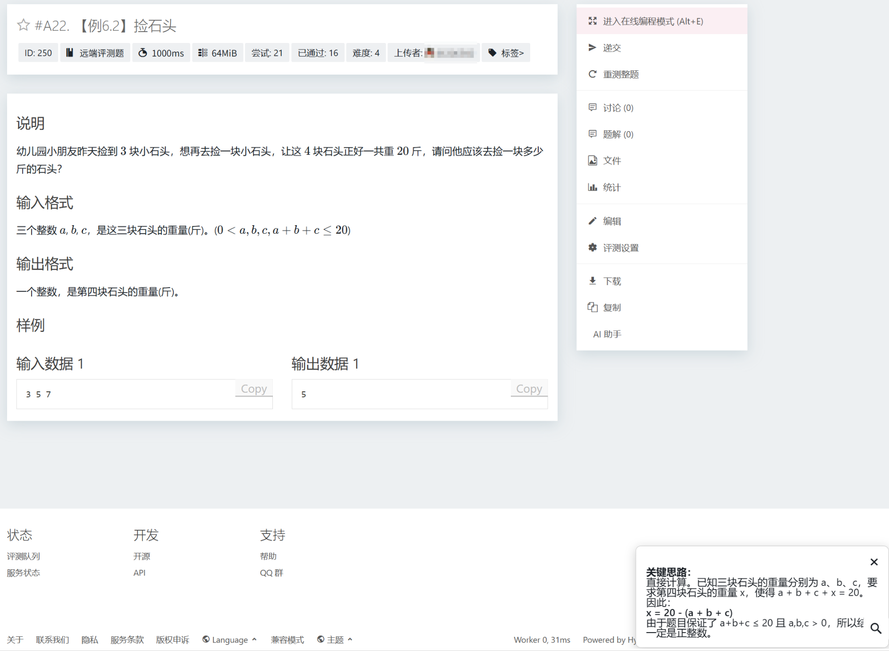
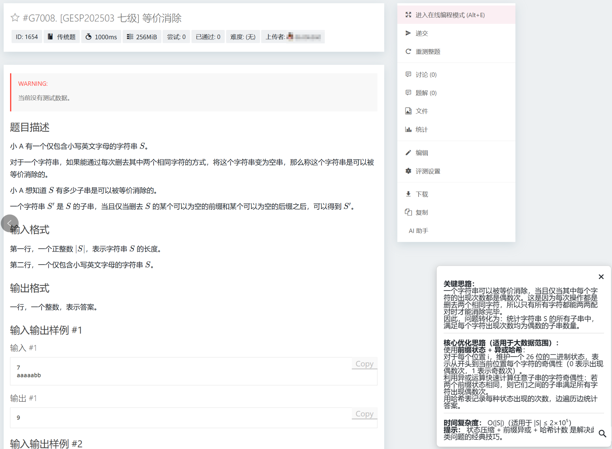
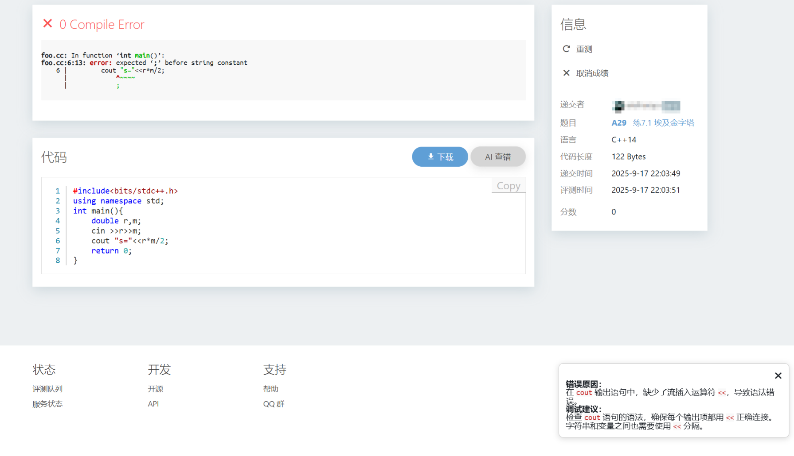
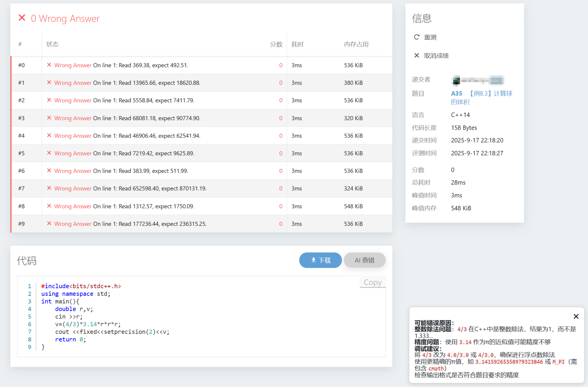

## 前言

我妈正在搞少儿编程教学，基于开源的 Hydrooj 搭了一套 OJ。她很希望能借助大模型的能力辅助孩子们日常的刷题训练，希望我能帮忙集成大模型用于 **难题解答** 和 **代码查错**。我们不妨把这两个场景叫做 **AI 助手** 和 **AI 查错**。

## 注册插件

起初我对整个项目信心满满，把所有要做的事情全丢给 ChatGPT5 筹备——集成大模型的事情就得交给大模型！

```
你好，我接手了一个 OnlineJudge 的二次开发。
OJ 本身基于开源的 hydroOJ 部署，现在我想在里面融入大模型辅助。具体有两个功能：
1. 如果有用户对某道题没有思路，能够在点开一个思路讲解的按钮；
2. 如果有用户提交后发现编译错误、答案错误、超时等，能够在点开一个帮我找错的按钮，注意不要完全告诉他如何修改，重点是给出提示。
我现在已经 ssh 到后端了，请一步一步为我指导。包括功能详细设计、前端设计、后端对接大模型等。
```

果然 ChatGPT5 条理清晰地为我制定了整个开发计划，甚至提到了很多细节之处：

```
把“克制”和“成本”落到代码上：
1. 禁用范围：检测“比赛/作业进行中”的路由前置拦截，直接返回“当前不可用”。（你可以在插件里读取题目/比赛状态；最简做法：前端比赛页直接不渲染按钮。）
2. 难度阈值 & 尝试次数。例如：用户至少有 1 次提交或在题面停留 ≥ 90 秒才可点“思路讲解”；用户对该题 3 次以上非 AC 才可点“找错”。（阈值存在配置中。）
3. 严格限流（IP + 用户 + 题目）例如：/api/llm/explain 每用户每题每天 2 次；/api/llm/diagnose 每提交 1 次。
4. 响应清洗（去“显式修复”）：正则剔除“超过 N 行的代码块”、出现 int main/#include/class Solution 等特征时，提示被收敛；JSON 输出严格校验（Zod），字段超长截断。
5. 缓存。思路讲解按 problemId + titleHash + tagsHash 做缓存（例如 24h），避免同题重复消耗；找错仅缓存“相同提交号”的结果。
6. 多厂商兜底：主路由 429/超时/风控即切备用（Qwen → GLM → Doubao），提升可用性。
```

我对它生成的步骤信心满满。首先是创建并初始化 hydrooj 的插件：

```bash
sudo mkdir -p /opt/hydro-plugins/llm-assist && cd /opt/hydro-plugins/llm-assist
npm init -y
npm i openai zod
hydrooj addon add /opt/hydro-plugins/llm-assist
```

hydrooj 部署使用 pm2 来管理进程。修改插件代码 `index.js` 后执行 `restart` 即可应用；`logs` 可查看日志。

```bash
pm2 restart hydrooj
pm2 logs hydrooj --lines 200
```

## Route 注册问题

我很快卡在了**注册路由** 阶段。在`index.js` 里尝试了大模型推荐的各种注册方法都没法生效：

```javascript
export async function apply(ctx) {
  ctx.Route('GET', '/api/llm/health', () => ({ ok: true }));
}

export async function apply(ctx) {
  const router = Router();
  router.get('/llm/health', (req, res) => {
    res.json({ ok: true });
  });
}

export async function apply(ctx) {
  const router = require('express').Router();
  router.get('/health', (req, res) => {
    res.json({ ok: true });
  });
  ctx.useRouter('/llm-api', router);
}

export async function apply(ctx) {
  ctx.use('/api', router);
}

module.exports = async function (ctx) {
  ctx.route('get', '/api/llm/query', async (req, res) => {
    const question = req.query.q;
    const answer = await callLLM(question);
    res.body = {
      success: true,
      data: answer
    };
  });

module.exports = async function apply(ctx) {
  const router = ctx.inject('router');
  router.get('/api/llm/test', async (req, res) => {
    res.body = { hello: 'world' };
  });
};
    
module.exports = async function apply(ctx) {
  const { http } = ctx.scope;   // 关键点：从 scope 里拿 http
  const { router } = http;

  router.get('/api/llm/query', async (req, res) => {
    res.body = {
      success: true,
      data: 'Hello from LLM!'
    };
  });
};
```

从日志里看，`index.js` 里成功走到了插件注册函数，但要不注册时报错要不不生效。我偶尔想起时就用类似下面的 prompt 向大模型提问，但一连卡了好几天都没有进展。我按照 ChatGPT5 给出的排查建议，在日志里打印了 `ctx` 里包含的字段内容，发现键有点少，一度怀疑是 hydrooj 未支持后端路由注册功能。

```
我在二次开发 hydrooj，在后端后创建了如下文件夹： 
/opt/hydro-plugins/llm-assist# ls
cookie.txt env.sh index.js node_modules package.json package-lock.json 
我想在 index.js 里开发个对接 llm 的功能，总体思路是开出一些后端新接口，当前端特定按钮按下后触发这些接口的调用。
我试过很多接口注册方式，例如 ctx.Route('get')、ctx.api.get、ctx.Router().get() 等，但都注册失败了（即用 pm2 restart hydrooj 重启后日志里有报错，且触发 curl 验证时失败），怀疑是 hydrooj 没有暴露这些能力。 
请为我找一些 hydrooj 插件的源码（特别是涉及接口注册的），参考他们的方式为我还原一个能注册接口的最小js代码，供我本地验证。
```

直到我在官网翻到一篇 [使用 TypeScript 编写插件](https://hydro.js.org/docs/Hydro/dev/typescript)，里面显式注册了 Route 。我不关心这篇文档里讲的制作剪贴板的细节，立马通知大模型类比这篇文档生成一份最小可运行的 Route 注册代码，果然大获成功：

```javascript
const { Handler, PRIV } = require('hydrooj'); // hydrooj 提供的运行时 API

// 最小 Handler：实现 get/post；通过 this.request / this.response 访问请求/响应
class LlmPromptHandler extends Handler {
  // GET /llm-assist/prompt
  async get() {
    // 返回 JSON（框架会根据 Accept 自动决定是否渲染模板）
    this.response.body = {
      ok: true,
      path: 'llm-assist/prompt',
      method: 'GET',
      ts: Date.now()
    };
  }
}

exports.apply = async function(ctx) {
  // 注册路由名为 llm_assist_prompt，URL 为 /llm-assist/prompt
  // 第四个参数可选，表示需的权限（此处不限制）
  ctx.Route('llm_assist_prompt', '/llm-assist/prompt', LlmPromptHandler);
};
```

注意 hydrooj 的所有后端接口都有登录检查，在用 curl 验证接口之前要先模拟前端拿到 cookie。

```bash
curl -c cookie.txt -X POST http://127.0.0.1:8888/login   -H "Content-Type: application/x-www-form-urlencoded"   -d "uname=xxx&password=xxx"
curl -b cookie.txt -X GET http://127.0.0.1:8888/llm-assist/prompt
```

## 对接大模型

我选择 qwen3-coder 作为后端对接大模型，在 [阿里云百炼平台](https://bailian.console.aliyun.com/#/efm/api_key) 生成 API KEY 后就可以交给 ChatGPT5 了：

```
你好，我正在针对开源的 hydro OJ 进行二次开发，现在我想在里面融入大模型辅助。具体来说
1. 如果有用户对某道题没有思路，能够在点开一个思路讲解的按钮；
2. 如果有用户提交后发现编译错误、答案错误、超时等，能够在点开一个帮我找错的按钮，注意不要完全告诉他如何修改，重点是给出提示。
现在我已经在 /opt/hydro-plugins 下创建出 llm-assist 插件并应用此插件。现在请你为我设计详细的功能，并给出前后端的代码实现。
大模型对接 qwen3-coder-plus，我已有 API KEY。
请基于我已测试成功的 route 接口注册代码进行开发：
# 此处贴入上一次测试成功的 Route 注册代码
```

AI 很丝滑地生成了一份辅助代码 `llm_client.js`，用于 hydrooj 插件和大模型的交互。

```javascript
const fetch = require('node-fetch');

const MODEL_API_URL = 'https://dashscope.aliyuncs.com/compatible-mode';
const MODEL_API_KEY = 'sk-xxx';
const DEFAULT_MODEL = 'qwen3-coder-plus';

async function callLLM({ systemPrompt, userPrompt, max_tokens = 1024, temperature = 0.2, stream = false }) {
    // 构造 OpenAI-compatible chat/completions 请求
    const url = `${MODEL_API_URL.replace(/\/$/, '')}/v1/chat/completions`;
    const body = {
        model: DEFAULT_MODEL,
        messages: [
            { role: 'system', content: systemPrompt },
            { role: 'user', content: userPrompt }
        ],
        max_tokens,
        temperature,
        // you can add other fields: top_p, stop, presence_penalty, etc.
    };

    const res = await fetch(url, {
        method: 'POST',
        headers: {
            'Content-Type': 'application/json',
            'Authorization': `Bearer ${MODEL_API_KEY}`,
        },
        body: JSON.stringify(body),
        // if using a provider that requires extra headers, add them via env
    });

    if (!res.ok) {
        const txt = await res.text();
        throw new Error(`LLM API error ${res.status}: ${txt}`);
    }

    const data = await res.json();
    // OpenAI-compatible response解析（兼容OpenRouter/Alibaba OpenAI-compat）
    // 返回主文本 content 合并（取第一个 choice）
    let content = '';
    try {
        if (data.choices && data.choices.length > 0) {
            const msg = data.choices[0].message || data.choices[0].delta || {};
            content = msg.content || data.choices[0].text || '';
        } else if (data.output && Array.isArray(data.output) && data.output[0]) {
            content = data.output[0].content || '';
        } else {
            content = JSON.stringify(data);
        }
    } catch (e) {
        content = JSON.stringify(data);
    }
    return { raw: data, text: content };
}

module.exports = { callLLM };
```

在插件主逻辑 `index.js` 里注册两个场景的后端 API 并调用 `llm_client.js`：

```javascript
const { Handler } = require('hydrooj');
const path = require('path');
const fs = require('fs').promises;
const { callLLM } = require('./llm_client');

function safeTruncate(s, n) {
    if (!s) return '';
    if (s.length <= n) return s;
    return s.slice(0, n) + '\n\n--- [truncated] ---';
}

const SYSTEM_PROMPT_IDEA = `
你是一个资深的竞赛编程助手。当用户请求题目的解题思路/提示时，请：
- 给出最简明的核心思路，不需要提供代码、具体实现步骤、复杂度分析、测试用例等内容；
- 如果有多种方法，简要列出并说明优缺点。
`;

const SYSTEM_PROMPT_DEBUG = `
你是一个竞赛编程调试助手。当用户请求“调试提示”时，请：
- 阅读题目、用户代码、编译信息、判题结果；
- 给出可能的错误原因和检查建议；
- 语言简洁，不要提供完整修正后的代码或逐行修改方案；
`;

// Handler: POST /llm-assist/prompt
class LlmPromptHandler extends Handler {
    async post() {
        try {
            
            const ip = this.request.ip || (this.request.headers && this.request.headers['x-forwarded-for']) || 'anon';
            if (!rateLimit(ip)) {
                this.response.status = 429;
                this.response.body = { ok: false, error: 'rate_limited' };
                return;
            }

            const body = (this.request && this.request.body) || {};
            const type = body.type || 'idea'; // 'idea' 或 'debug'
            const language = body.language || body.lang || 'C++';
            const problemId = body.problemId || body.pid || null;
            const problemTitle = body.title || '';
            const statement = safeTruncate(body.statement || '', 3000);
            const code = safeTruncate(body.code || '', 20000);
            const compileOutput = safeTruncate(body.compileOutput || '', 2000);
            const judgeResult = safeTruncate(body.judgeResult || '', 1000);

            let userPrompt = '';
            let systemPrompt = SYSTEM_PROMPT_IDEA;

            if (type === 'idea') {
                systemPrompt = SYSTEM_PROMPT_IDEA;
                userPrompt = `题目 ID: ${problemId || 'N/A'}
题目标题: ${problemTitle}

题目描述:
${statement}

请用中文给出此题最关键的思路/提示
`;
            } else {
                systemPrompt = SYSTEM_PROMPT_DEBUG;
                userPrompt = `题目: ${problemTitle}
语言: ${language}

判题结果: ${judgeResult}
编译输出（如有）:
${compileOutput}

用户提交代码（已截断）:
${code}

请用中文给出简洁的可能错误原因及调试步骤，不要直接给出完整修正后的代码。`;
            }
            const { text, raw } = await callLLM({
                systemPrompt,
                userPrompt,
                max_tokens: 1024,
                temperature: 0.15
            });

            this.response.body = { ok: true, type, text, meta: { truncated_code: code.length >= 20000 }, raw };
        } catch (err) {
            this.response.status = 500;
            this.response.body = { ok: false, error: err.message || String(err) };
        }
    }
}

exports.apply = async function(ctx) {
    ctx.Route('llm_assist_prompt', '/llm-assist/prompt', LlmPromptHandler);
};
```

重启 hydrooj 后，可用 curl 验证这两个场景的接口注册是否生效、大模型返回是否合理。

```bash
curl -b cookie.txt \
  -H "Content-Type: application/json" \
  -X POST http://127.0.0.1:8888/llm-assist/prompt \
  -d "{
    \"type\": \"idea\",
    \"problemId\": \"123\",
    \"title\": \"两数之和\",
    \"statement\": \"给定一个整数数组 nums 和一个目标值 target，请在数组中找出两个数使它们的和为 target。返回这两个数的索引。\"
  }"
  
curl -b cookie.txt \
  -H "Content-Type: application/json" \
  -X POST http://127.0.0.1:8888/llm-assist/prompt \
  -d "{
      \"type\": \"debug\",
      \"problemId\": \"123\",
      \"title\": \"两数之和\",
      \"language\": \"C++\",
      \"code\": \"#include <bits/stdc++.h>\nint main(){int n,t;cin>>n>>t;return 0;}\",
      \"compileOutput\": \"warning: unused variable 'n'\",
      \"judgeResult\": \"WA on test 5\"
    }"
```

ChatGPT5 考虑到了流控，在 `index.js` 里补了如下代码。我简单设置了 5/min，以后可加个无过期的缓存。

```javascript
const RATE_LIMIT_WINDOW_MS = 1000 * 60; // 1 min
const RATE_LIMIT_MAX = parseInt(process.env.LLM_RATE_LIMIT || '5'); // 每 window 最大请求数（按 IP）
const buckets = new Map();

function rateLimit(ip) {
    const now = Date.now();
    if (!buckets.has(ip)) buckets.set(ip, []);
    const arr = buckets.get(ip);
    while (arr.length && arr[0] < now - RATE_LIMIT_WINDOW_MS) arr.shift();
    if (arr.length >= RATE_LIMIT_MAX) return false;
    arr.push(now);
    return true;
}
```

## 前端模板修改

我想在前端引入按钮，相关写法一窍不通，只能求出 ChatGPT5。它建议我创建 `static/llm-assist.js` 的代码来承载前端组件（会涉及调用后端的逻辑），并将其注册到 `index.js` 里——这一点看上去很科学。

```javascript
class StaticJsHandler extends Handler {
    async get() {
        const full = path.join(__dirname, 'static', 'llm-assist.js');
        try {
            const data = await fs.readFile(full, 'utf8');
            this.response.type = 'application/javascript';
            this.response.body = data;
        } catch (e) {
            this.response.status = 404;
            this.response.body = 'Not found';
        }
    }
}
exports.apply = async function(ctx) {
    ctx.Route('llm_assist_static', '/llm-assist/static/llm-assist.js', StaticJsHandler);
    ...
}
```

那么如何去修改前端的 html 呢？ChatGPT5 建议我在 `index.js` 里使用 renderHTML。以“AI 助手”场景举例：智能地检测当前的页面是否是题目详情页，如果是的话就动态在 html 里插入 `static/llm-assist.js` 组件。逻辑是通的，但我反复调试后发现无论在什么页面都没法触发 renderHTML 这个函数，自然没法加载成功。

```javascript

exports.apply = async function(ctx) {
    ...
	ctx.on && ctx.on('renderHTML', (html, req) => {
        try {
            const isProblemDetail = /<html[^>]*data-page=["']problem_detail["']/i.test(html);
            if (!isProblemDetail) return html;
            // 确保我们只插入一次，避免重复注入
            const injectTag = '<script src="/llm-assist/static/llm-assist.js"></script>';
            if (html.indexOf(injectTag) !== -1) return html;

            // 在 </body> 前插入脚本。如果没有 </body> 就追加在末尾。
            if (html.includes('</body>')) {
                return html.replace('</body>', `${injectTag}</body>`);
            } else {
                return html + injectTag;
            }
        } catch (e) {
            console.error('llm-assist: renderHTML inject error', e);
            return html;
        }
    });
}
```

ChatGPT5 给出的另一条路子是：hydrooj 已在 templates 目录下定义了各类前端显示的模板文件，将目标页面复制到插件对应的目录下修改，启动时即可智能完成覆盖。我在 hydrooj 的安装目录里找了一圈，愣是没找到对应的 templates 目录，后来发现在官方插件 **@hydrooj/ui-default** 里有定义，可在 node_modules 里找到。

按照 ChatGPT5 的指示，我找到了题目详情页 `ui-default/templates/problem_detail.html`，将其复制到插件目录下 `llm-assist/templates/problem_detail.html`，里面插入一段加载 `llm-assist.js` 的 script。经过反复尝试，这种修改并不会生效。我一度怀疑是加载顺序的问题（ui-default 后于本插件加载导致反向覆盖），但给 `index.js` 的 `package.json` 加上依赖插件或修改优先级后，加载失败的问题依然没有解决。

走投无路下我只能尝试最土的方法：直接在 `ui-default` 的路径下修改模板文件。这种方式被证明是有效的。

## AI 助手功能

我需要在题目详情页 `problem_detail.html` 里集成 **AI 助手** 按钮。这个 html 里有很多间接引用：

```html
<div class="medium-3 columns"><div data-sticky="large">
  
</div></div>
```

看起来应该在侧边栏 `partial/problem_sidebar.html` 里插入这个按钮，它里面又引用了其他模板：

```html

  


  
    
    
  
    
    
  

  


```

叶子模块是 `partial/problem_sidebar_normal.html`，在这里会根据权限的不同展示各种按钮。

+ 正好有一块代码在判断当前是否是 problem_detail 页面，结尾处插入名为 `llm-assist-btn` 的按钮。
+ 在文件末尾根据是否是 problem_detail 页面动态加载插件里的 `static/llm-assist.js` 组件。

```javascript

  <li class="menu__seperator nojs--hide"></li>
  
    <li class="menu__item nojs--hide"><a class="menu__link" href="javascript:;" name="problem-sidebar__download">
      <span class="icon icon-download"></span> {{ _('Download') }}
    </a></li>
  
  
    <li class="menu__item nojs--hide"><a class="menu__link" href="javascript:;" name="problem-sidebar__copy">
      <span class="icon icon-copy"></span> {{ _('Copy') }}
    </a></li>
  
  <li class="menu__item nojs--hide">
    <a class="menu__link" href="javascript:;" id="llm-assist-btn">
      <span class="icon icon-robot"></span> AI 助手
    </a>
  </li>

...

  <script src="/llm-assist/static/llm-assist.js"></script>

```

最后就是在插件的 `static/llm-assist.js` 里定义按钮点击事件，调用后端接口并显示结果。为了不影响 html 整体布局，我要求 ChatGPT5 手动绘制一个能承载结果的悬浮窗（参数细节完全没管，车轱辘能跑起来就行）。

```javascript
function createResultContainer() {
    let container = document.getElementById('llm-assist-result-container');
    if (!container) {
        container = document.createElement('div');
        container.id = 'llm-assist-result-container';
        container.style.position = 'fixed';
        container.style.right = '20px';
        container.style.bottom = '80px';
        container.style.width = '400px';
        container.style.maxHeight = '60vh';
        container.style.overflowY = 'auto';
        container.style.background = 'white';
        container.style.border = '1px solid #ccc';
        container.style.borderRadius = '8px';
        container.style.padding = '12px';
        container.style.boxShadow = '0 2px 10px rgba(0,0,0,0.15)';
        container.style.zIndex = '9999';
        container.style.fontSize = '14px';

        // 添加关闭按钮
        const closeBtn = document.createElement('button');
        closeBtn.innerText = '✖';
        closeBtn.style.float = 'right';
        closeBtn.style.border = 'none';
        closeBtn.style.background = 'transparent';
        closeBtn.style.cursor = 'pointer';
        closeBtn.style.fontSize = '16px';
        closeBtn.addEventListener('click', () => {
            container.style.display = 'none';
        });
        container.appendChild(closeBtn);

        // 内容区域
        const content = document.createElement('div');
        content.id = 'llm-assist-result';
        content.style.clear = 'both';
        container.appendChild(content);

        document.body.appendChild(container);
    }
    return container;
}
```

`static/llm-assist.js` 里还有两个细节要处理：

1. 如何拿到题目的文本内容：我在前端 F12 抓取了一段具体的元素丢给 ChatGPT5，得到一个很高级的函数。
2. 如何把大模型的返回 markdown 格式渲染出来：ChatGPT5 建议我引入 marked，无脑贴上就有效果了。

```javascript
// 1️⃣ 引入 marked（CDN 方式也可以在 HTML 里引入）
if (!window.marked) {
    const script = document.createElement('script');
    script.src = 'https://cdn.jsdelivr.net/npm/marked/marked.min.js';
    script.onload = () => console.log('marked.js loaded');
    document.head.appendChild(script);
}

// 获取完整题目文本
function getFullProblemText() {
    const container = document.querySelector(
        '.problem-content .section__body.typo.richmedia[data-fragment-id="problem-description"]'
    );
    if (!container) return '';
    return container.innerText.trim();
}
```

最终的按钮点击的事件注册代码如下：

```javascript
document.getElementById('llm-assist-btn')?.addEventListener('click', async () => {
    const container = createResultContainer();
    const contentDiv = document.getElementById('llm-assist-result');
    contentDiv.innerHTML = '正在获取题目内容...';
    container.style.display = 'block';

    const problemText = getFullProblemText();
    if (!problemText) {
        contentDiv.innerText = '无法抓取题目内容';
        return;
    }

    contentDiv.innerText = '发送给 AI，等待回答...';

    try {
        const res = await fetch('/llm-assist/prompt', {
            method: 'POST',
            headers: { 'Content-Type': 'application/json' },
            body: JSON.stringify({
                type: 'idea',
                problemId: UiContextNew.problemId,
                title: document.querySelector('.section__title')?.innerText || '',
                statement: problemText
            })
        });

        const data = await res.json();
        if (data.ok && data.text) {
            // ✅ 使用 marked 渲染 Markdown
            contentDiv.innerHTML = window.marked ? marked.parse(data.text) : data.text;
        } else {
            contentDiv.innerText = data.error || '暂无结果';
        }
    } catch (err) {
        console.error(err);
        contentDiv.innerText = '请求失败，请检查网络或后端接口';
    }
});
```

效果图如下：





## AI 查错功能

有个上一个功能做铺垫，我顺藤摸瓜找到了 ui-default 插件下的 `templates/record_detail.html`。hydrooj 在提交记录的代码展示右上角有一个下载按钮，我正好并排加入一个 **AI 查错** 按钮。这次需要收集题目详情、代码、编程语言、测评结果、编译错误等数据，ChatGPT5 建议我用 `window.LLM_ASSIST_CONTEXT` 收集，而非像上一个功能一样在 `llm-assist.js` 里用 `document.querySelector(...)` 去抓取。它解释说，提交语言、判题状态这类信息在 JS 里并没有全局变量暴露出来，但可以趁渲染模板时在 `rdoc` 和 `model.problems[...]` 拿到。有个细节是，如果测评结果是 Accepted 可以不展示按钮，我用 `if rdoc.status != 1` 去判断。

```javascript

    <div class="section">
      <div class="section__header">
        <h1 class="section__title">{{ _('Code') }}</h1>
        <div class="section__tools">
          <a class="primary rounded button" href="?download=true">
            <span class="icon icon-download"></span>
            {{ _('Download Hack Input') }}{{ _('Download') }}
          </a>
          
            <button class="secondary rounded button" id="llm-debug-btn">
              <span class="icon icon-bug"></span> {{ _('AI 查错') }}
            </button>
          
        </div>
        <script src="/llm-assist/static/llm-assist.js"></script>
        <script>
          window.LLM_ASSIST_CONTEXT = {
            type: 'debug',
            problemId: '{{ rdoc.pid }}',
            title: '{{ model.problems[rdoc.pid].title|escape }}',
            language: '{{ model.setting.langs[rdoc.lang].display }}',
            code: {{ rdoc.code | dump | safe }},
            judgeResult: {{ model.builtin.STATUS_TEXTS[rdoc.status] | default('Unknown') | dump | safe }},
            compileOutput: {{ rdoc.compilerTexts | join('\n') | default('', true) | dump | safe }}
          };
        </script>
      </div>
      <div class="section__body">
        <pre class="line-numbers"><code class="language-{{ model.setting.langs[rdoc.lang].highlight }}">{{ rdoc['code'] }}</code></pre>
      </div>
    </div>
    
```

我想用 `window.LLM_ASSIST_CONTEXT` 一并收取题目详情，调试了一下没找到这个文本内容。质问 ChatGPT5 后它怂了，给我换了一种更稳妥的方式：在后端额外调用一次查询题目详情接口。

```javascript
async function fetchProblemStatement(pid) {
    const res = await fetch(`/p/${pid}`);
    const html = await res.text();
    const tmp = document.createElement('div');
    tmp.innerHTML = html;
    return tmp.querySelector('.problem-content .section__body')?.innerText || '';
}
```

结果的悬浮框我们可以服用上一个功能的 `llm-assist-result` 组件，那就只剩下按钮的事件定义了：

```javascript
// 监听提交详情页的「AI 查错」按钮
document.getElementById('llm-debug-btn')?.addEventListener('click', async () => {
    const ctx = window.LLM_ASSIST_CONTEXT || {};
    const container = createResultContainer();
    const contentDiv = document.getElementById('llm-assist-result');
    container.style.display = 'block';
    contentDiv.innerText = '正在分析错误原因...';
    const statement = await fetchProblemStatement(ctx.problemId);

    try {
        const res = await fetch('/llm-assist/prompt', {
            method: 'POST',
            headers: { 'Content-Type': 'application/json' },
            body: JSON.stringify({
                type: 'debug',
                problemId: ctx.problemId,
                title: ctx.title,
                statement,
                language: ctx.language,
                code: ctx.code,
                judgeResult: ctx.judgeResult,
                compileOutput: ctx.compileOutput
            })
        });

        const data = await res.json();
        if (data.ok && data.text) {
            contentDiv.innerHTML = window.marked ? marked.parse(data.text) : data.text;
        } else {
            contentDiv.innerText = data.error || '暂无结果';
        }
    } catch (err) {
        console.error(err);
        contentDiv.innerText = '请求失败，请检查网络或后端接口';
    }
});
```

效果图如下：




