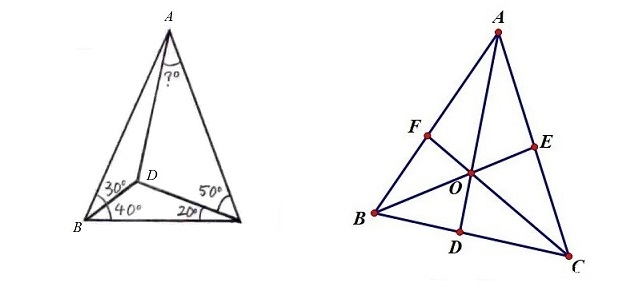
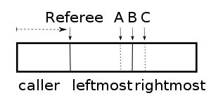

这一系列文章记录了我遇到过的一些 **趣题**。

| 文章内容                                                     | 简介                                                     |
| ------------------------------------------------------------ | -------------------------------------------------------- |
| [奇思妙想](https://jiangshibiao.github.io/Interesting-Problems-Fancy-Idea/) | 数学和计算机领域，通过小小思考后能豁然开朗的趣题。       |
| [概率和期望](https://jiangshibiao.github.io/Interesting-Problems-Probability/) | 数学和计算机领域，与概率和期望相关的趣题。               |
| [算法题精选-1](https://jiangshibiao.github.io/Selected-Problems-from-ACM-ICPC-1/) | OI/ICPC 向的算法题，去其琐碎、留其精髓，望博君一笑。     |
| [算法题精选-2](https://jiangshibiao.github.io/Selected-Problems-from-ACM-ICPC-1/) | OI/ICPC 向的算法题，相比上一期题意更简洁，出处往往不可考 |

<!-- more -->

## 正方形里塞k个尽量大的相同形状

**题意**：给出正整数 $k$，要在一个正方形里塞 $k$ 个相同的正方形/圆，问最多能塞多大的尺寸。

**题解**：这类问题被称为 [Packing problems](https://en.wikipedia.org/wiki/Packing_problems)。很多 $k$ 都还是开放问题，特别当 $k$ 大的时候。Erich Friedman 整理了一个 [Packing 合集](https://erich-friedman.github.io/packing/index.html)，包括 [正方形里塞圆](https://erich-friedman.github.io/packing/cirinsqu/) 和 [正方形里塞正方形](https://kingbird.myphotos.cc/packing/squares_in_squares.html)。

## 非ww串的文法表达

**题意**：假设字符集是 $\{0,1\}$，用上下文无关语法表达出所有这样的字符串 $S$：$S=xy,|x|=|y|,x \ne y$。

**性质**：假设字符串长度为 $2n$，则至少存在一个 $i$，满足 $S_i \ne S_{n+i}$。分别以 $i$ 和 $n+i$ 为中心，$i-1$ 和 $n-i$ 为半径，可以把 $S$ 分成两个中心不同、其余随意的串。ww 串必然不存在这样的划分，而非 ww 串必然存在。

**题解**：$c=a|b, A=cAc|a, B=cBc|b, S=AB|BA$

## 翻纸牌

**题意**：桌面上有两堆扑克牌，$A$ 堆正面朝上的牌比 $B$ 堆多 $50$ 张。你被蒙住了眼睛，只能靠手去触摸和移动牌，无法摸出一张牌是否是正面朝上。如何操作能使 $A$ 堆正面朝上的牌数和 $B$ 堆相同。来源于腾讯面试题。

**题解**：给人的第一感觉是：既然不能摸出正反面，为什么可以使正面朝上的牌数一致？

考虑如下操作：从 $A$ 堆里摸一张牌，将其翻面后放入 $B$ 堆。

+ 如果它原来是正面朝上的，则 $A$ 堆损失一张正面朝上的牌。
+ 如果它原来是正面朝下的，则 $B$ 堆增加一张正面朝上的牌。

所以每操作这个步骤一次，正面朝上的牌差就减一。重复 $50$ 次后即达到要求。

## GCC有关数组的一些函数

~~~c++
1. rotate(first, mid, last): 将 mid 及之后的内容放到 first 前面。
// 实现1：翻转前一段，翻转后一段，再翻转整各数组。
// 实现2：
template <class ForwardIterator>
  void rotate (ForwardIterator first, ForwardIterator middle,
               ForwardIterator last){
  ForwardIterator next = middle;
  while (first!=next){
    swap (*first++,*next++);
    if (next==last) next=middle;
    else if (first==middle) middle=next;
  }
}

2. inplace_merge(first, mid, last)：将 [first, mid) 和 [mid, last) 归并。
// 一种可能的实现
while (fir < mid && mid < last){
  while (fir < mid && a[fir] < a[mid]) ++fir;
  int Move = 0;
  while (mid < last && a[mid] < a[fir]){
    ++mid;
    ++Move;
  }
  rotate(a + fir, a + mid - move, a + mid);
  fir += Move;
}
                                                     
3. inplace_sort(first, mid, last)
~~~

## 只许修改一位的加密解密问题

**来源**：据传是 Google 面试题，由何柱提供。

**题意**：Alice 面前有一个长度为 $n$ 的棋盘，初始时每个位置有一个随机的 0/1 值；Alice 还看到一把钥匙随机藏于 $0 \sim n-1$ 的某一个格子。Alice 必须修改一位格子里的 01 值，然后 Bob 只能看到修改后的棋盘状态。Alice 和 Bob 可以事先约定好某种策略，Bob 需要猜出钥匙的所在位置。

**解法**：可以证明，若 $n$ 不是 $2$ 的幂次就无解。

+   Alice 观察所有初始值为 $1$ 的格子，将它们的编号异或起来，再异或上 key 的编号。
+   Bob 观察所有修改后值为 $1$ 的格子，把它们的编号异或起来就是 key 的位置编号。

## 猜名字

**来源**：据传是 Google 面试题，由何柱提供。

**题意**：$n$ 个人的名字互不相同，且知道他们名字的并集 $R$。每次可以给出一个人的子集 $S$，返回这些人对应的名字集合 $R_S$。问最优决策下，询问几次能知道所有人各自对应的名字。

**简洁解**：不妨设 $n=k^2$，把人排成 $k \times k$ 的方阵，分别问每行和每列的答案，$2k$ 次。

**最优解**：把人名按 $1,\dots,n$ 编号，对于 $k=0 \sim \log_2(n)$，询问二进制第 $k$ 位为 $1$ 的那些人的集合。还原答案时只要把该编号对应所有为 $1$ 的答案集合求个交即可。下标为 $0$ 用不了，总次数为 $\lfloor \log_2(n) \rfloor + 1$。

## 严格线性求第k小

**题意**：给出一个无序数组，试求第 $k$ 小的数是多少，要求严格线性。

**近似线性做法**：基于快排的分治策略，每次随机一个 $\mathrm{pivot}$，按 $\mathbb{pivot}$ 将数组划成两半并递归进其中一半。
$$
T(N)=\frac{1}{N} \sum \limits_{i=1}^{N}T(i)+O(N)=O(N)
$$
**严格线性做法**：定义 $F(A,k)$ 能在 $O(|A|)$ 时间里求出 $A$ 中第 $k$ 小。重复下列三个流程：

1.  将所有数 $5$ 个一组，每组求一个中位数，并将这 $\lceil \frac{N}{5} \rceil$ 个数排成数列 $B$。
2.  调用 $F(B,\frac{|B|+1}{2})$，求得 $B$ 的中位数 $b$。
3.  以 $b$ 为 $\mathrm{pivot}$ 将数组分成两半，并递归进入其中一个 $F(A',k')$。

**复杂度分析**：在复杂度不变的情况下适当定一个 $\mathbb{pivot}$，使得每次划分区间时不出现极端情况。我们知道，必然有 $\frac{3N}{10}$ 的数小于 $b$，也有 $\frac{3N}{10}$ 的数大于 $b$，所以区间最多变成原来的 $O(\frac{7}{10}N)$。
$$
T(N)=T(\frac{N}{5})+T(\frac{7}{10}N)+O(N)=O(N)
$$

## 闭区间连续函数的极值

**题意**：证明对于定义在闭区间 $[a,b]$ 上的连续函数 $f(x)$ ，必然在定义域内存在最小值（和最大值）。

**分析**：需要证明两件事：

+   $f(x)$ 在  $[a,b]$ 上有下界。
+   $f(x)$ 在 $[a,b]$ 上有最小值（这个和 2 不同，因为可能存在取不到下确界的情况）。

**证明第一点的方法一**： 对于任何 $x \in [a,b]$，存在 $\epsilon_x$ 使得 $f$ 在 $(x-\epsilon_x,x+\epsilon_x)$ 有界。根据 **有限覆盖定理**，我们可以取有限个区间覆盖整个 $[a,b]$。那么此时每个区域的下界的最大值就是总体的下界。

**证明第一点的方法二**：反证，假设无界。如果每次将当前区间分成两段，则至少有一段无界，所以我们能得到一个无界的闭区间套 $\{[a_n,b_n]\}$。根据 **区间套定理**，存在唯一实数 $\xi$ 使得 $\xi=\lim \limits_{n \to \infty}a_n=\lim \limits_{n \to \infty} b_n$ 且 $\xi \in [a,b]$。但是我们又知道 $f(\xi \pm \epsilon)$ 是有界的，所以对于充分大的 $n$，$[a_n,b_n]$ 是有界的。这和题设矛盾。

**证明第二点**：要用到 **最大值最小值定理**。假设 $f(x)$ 的下确界是 $M$，我们想要证明 $M \in \{f(x) | x \in[a,b]\}$ 是否成立。反证，若取不到下确界则 $f(x)>M$。设函数 $g(x,x\in[a,b])=\frac{1}{f(x)-M}$，因为 $f(x)$ 连续所以 $g(x)$ 也连续。第一点已证 $g(x)$ 有界，即存在 $G$ 使得 $g(x) \le G$，则 $f(x) \ge M+\frac{1}{G}$，这和 $M$ 是下确界矛盾。

## 构造 (0,1) 到 [0,1] 的双射函数

**题意**：构造从 $(0,1)$ 到 $[0,1]$ 的双射函数？

**题解**：存在（来源于 [知乎](https://www.zhihu.com/question/500525142/answer/2235249790)）。构造集合 $\{\frac{1}{n}|n \ge 2,n \in \mathbb{N}^+\}$，定义 $f:(0,1) \rightarrow [0,1]$ 满足：
$$
f(x)=\left\{
\begin{aligned}
x, & x \notin S \\
0, & x \in S, x=\frac{1}{2} \\
\frac{1}{n-1}, & x \in S, x=\frac{1}{n}(n \ge 3) \\
\end{aligned}
\right.
$$

## 边权最小使指定顶点连通

**题意**：给定连通无向图 $(V,E)$ 的部分顶点集合 $S$，选出边权和最小的边集使得 $S$ 连通。

**确定性做法**：经典的斯坦纳树问题，复杂度是 $O(n3^n)$。设 $f_{S,i}$ 表示使“以$i$ 为根，点集为 $S$”的树连通的最小边权和。对于一种状态 $(S,i)$，有两种转移方式：

1. 将 $S$ 拆成两个子集 $S_1$ 和 $S_2$ 转移（相当于这棵树有至少两个子树）。
2. 枚举点 $j$ ，用 $f_{S',j}+E_{j,i}$ 转移（相当于这棵树只有一个子树，枚举子树顶点）。

**近似做法**：构造一个新图 $(S,F)$，对于原图中 $S$ 中的每一对顶点 $(i,j)$，连一条边权为 $F_{i,j}$ 的边，其中 $F_{i,j}$ 是原图中 $i$ 到 $j$ 的最短路。在新图上跑一遍 $MST$ 得到一个边集 $E_{result}$。显然这组边一定是原图的一个解。

**近似度证明**：可以证明，上述近似做法的近似度正好是 $2$。

+   考虑一个包含 $S$ 的路径 $P= \{ p_1,p_2,...,p_k \}$。任意找出路径上的 $S$ 子序列 $Q= \{ q_1,q_2,...,q_{|S|} \}$。$P$ 中 $q_i \rightarrow q_{i+1}$ 的路径边权和，必然不小于新图中的 $F_{q_i,q_{i+1}}$。假设原图最优解的边集是 $E_{answer}$。将 $E_{answer}$ 中的每条边都复制一遍，可以得到一张欧拉图，且能导出一个 $P$ 路径。综上，$\sum E_{q_i,q_{i+1}} \geq \sum E_{result}$，即 $2\sum E_{answer} \geq \sum E_{result}$。
+   考虑一个边权都相等的菊花图。当 $n \rightarrow +\infty$ 时，$E_{result} \rightarrow 2\sum E_{answer}$.

## 最小生成树局部最优等于全局最优

**题意**：在 MST 问题中，定义一个解的邻域为：删掉一条边并加上一条边后能到达的所有解。求证：MST 问题的一个局部最优解必然是全局最优解。

**简化题目**：假设所有边权值都不相同。

1.  设局部最优解是 $T$，全局最优解是 $T^*$。将局部最优解连成一棵树。
2.  反证，假设 $T$ 不是全局最优解。则至少存在一条在 $T^*$ 中的非树边 $E=(u,v)$。
3.  在 $T$ 里找到 $u \rightarrow v$ 的路径，依次经过了 $e_1,e_2,...e_k$ 这些边。由条件可知，$\max \limits_{i=1..k} c(e_i) < c(E)$ （否则就不是局部最优解了）。
4.  显然，$u \rightarrow v$ 的路径中，必然存在一条边 $e_i=(p,q)$，使得 $p$ 和 $q$ 属于不同的集合。我们在全局最优解里删掉边 $E=(u,v)$，加入边 $e_i$。全局最优解答案更变得更优，产生矛盾。

所以（任意一个）局部最优解必然是全局最优解。

**回到原题**：在第 $3$ 步里，条件变成了 $\max \limits_{i=1..k} c(e_i) \leq c(E)$；在之前的第 $4$ 步里，有可能会出现 $c(E)=c(e_i)$，此时替换边后权值不变，无法导出矛盾。注意到，$T$ 中存在 $e_i$ 不存在 $E$，$T^*$ 中存在 $E$ 不存在 $e_i$。我们还是做一下边的替换，得到变换后的“等价局部最优解” $T'$。经过了这样一次变换后，$T'$ 和 $T^{\ast}$ 之间重复的边增加了一条。重复上述的流程，直到导出反证法的矛盾或是推出 $T'=T^*$。

**修正**：上述的证明过程是**有漏洞的**。在变换了 $T$ 后，我们并没有证明 $T'$ 在它的邻域也是最优的，就不能应用局部最优解的性质。可以反过来进行修正：

1.  同上述步骤，找到一条非树边 $E$。如果 $c(E)=c(e_i)$，固定 $T$ 不动，把 $T^\ast$ 里的边 $E$ 替换成 $e_i$。
2.  $T$ 和 $T'$ 之间重复的边增加了一条。重复上述的流程，直到导出反证法的矛盾或是推出 $T=T'$。

**一步到位证明**：在取 $T^\ast$ 的时候，我们不妨在所有全局最优解里，取一个 **和 $T$ 重复的边最多的解**。如果 $T^\ast \ne T$，存在一个 $T'$ 使得 $T'$ 里 $T$ 重复的边更近，但是这和 $T^{\ast}$ 矛盾。所以 $T^{\ast}=T$。

## 图的最大割问题

**来源**：[lzw 的博客](http://zhenweiliu.gitee.io/blog/2019/10/19/Approximation-Algorithm-9-The-Maxcut-Problem/) 

**题意**：给定边权非负的无向图 $G=(V,E)$，要将其分成两个点集 $(S, V \backslash S)$，最大化 $\sum_{e \in cut(S, V \backslash S)}{w_e}$

**基于随机的解**：给出一个近似度为 $2$ 的做法。设最优解为 $W$。对于每个点, 有 $p$ 的概率选入集合 $S$： 
$$
W' = \sum \limits_{e}{w_e \cdot P[e \in (S, V \backslash S)]} = \sum \limits_{e} 2p(1-p)w_e \geq 2p(1-p) W
$$
取 $p=\frac{1}{2}$ 时有 $W' \geq \frac{1}{2}W$.

**贪心解**：初始化集合 $A=B=\emptyset$。依次考虑每个点，如果把它加入 $A$ 集合收益更大就加入，否则加入 $B$ 集合。收益指 $\sum \limits_{e \in (A,B)}{w_e}$ 的增量。容易证明在这个过程中始终满足下面的性质:
$$
 \sum \limits_{e \in (A,B)}{w_e} \geq \sum \limits_{e \in (A,A)}{w_e} + \sum \limits_{e \in (B,B)}{w_e}
$$
从而得出 $W'=\sum \limits_{e \in (A,B)}{w_e} \geq \frac{1}{2}\sum \limits_{e}{w_e} \geq \frac{1}{2}W$。

## 一道初中几何题

**题意**：求左图图问号的度数。

**背景：塞瓦定理**：若 $AD,CF,BE$ 交于 $O$，则 $\frac{BD}{DC} \times \frac{CE}{EA} \times \frac{AF}{FB}=1$（面积法证明）

**塞瓦定理的角元形式**：$AD,CF,BE$ 交于 $O$ 的充要条件是 $\frac{\sin BAD}{\sin DAC} \times \frac{\sin CBE}{\sin EBA} \times \frac{\sin ACF}{\sin FCB}=1$

**题解**：把塞瓦定理的角元形式带入得：$\frac{\sin (40-\theta)}{\sin\theta} \times \frac{\sin 40}{\sin 30} \times \frac{\sin 50}{\sin 20}=1$，解得 $\theta=30$

## 公平分蛋糕问题

**题意**：若干个人要分蛋糕吃。**每个人对蛋糕各部分价值的评估是不一样的**。有以下两种要求：

+ 公平：每个人都认为，自己得到的部分不低于（自己视角下）总蛋糕价值的 $\frac{1}{n}$。
+ 无怨：每个人不觉得别人拿的比自己多。（**无怨比公平更难，因为无怨一定公平**）

题目和题解均来源于 [知乎](https://www.zhihu.com/question/20615717/answer/15646804)，目前公平分配已解决，多人的无怨分配依旧是开放问题。

**三人无怨的连续解**：需要一个裁判，从左向右走刀，三人拿着刀站在裁判右边，保持在（按各自标准）平分右边蛋糕的位置。任何时刻一旦三人中有一个喊「切」，此人获得裁判左边的蛋糕。然后三人中位于中间位置的那位（`B`）把刀切下。没蛋糕的两位中，离裁判近的那位获得中间那块，远的那位获得右边那块。

**三人无怨的离散解法**：

1. `A` 按照自己的标准把蛋糕切三块。
2. 如果 `B` 认为最大的两块一样大，那么按 `C，B，A` 的顺序选蛋糕，**结束**。
3. 如果 `B` 认为其中一块 `M` 最大，他就从 `M` 削去一小块 `R`，使之与第二大的那块一样，把 `R` 放在一边。
4. 称 `M` 剩下的部分为 `M'`。
5. 按 `C，B，A` 的顺序选这三块蛋糕，但有个要求是，如果 `C` 没有选走 `M'`，`B` 须被迫选走它。
6. `B` 和 `C` 中没拿 `M'` 的那位，把 `R` 分成三份，让拿了 `M'` 的那位先挑一份，然后 A 选一份，最后一份留给自己。
    

**上述做法的分析**：

1. 先来证明 `C` 的无怨。第一轮选择的时候他有最优先权：如果他认为 `B1`（即算法里的 `M'`） 最优，那么它在第一轮能先选走自己认为最大的，而且可以在第二轮均分蛋糕，使得第二轮自己也能拿 `R` 中至少 `1/3`，肯定是无怨的；如果他认为 `B2` 或者 `B3` 最优，它将在两轮选蛋糕里都最先选走自己认为的最大的，显然无怨。
2. 再来证明 `B` 的无怨。经过削蛋糕操作后， 他眼中 `B1=B2>B3`——所以如果 `C` 选走了 `B1` 或 `B2` 中的任意一个，`B` 将选走它们中的另一个（`C` 选走 `B3` 的话，`B` 被迫选走 `B1` 也不亏）。而且在第二轮里，`B` 拥有切或者先选的权力，分析同上，也是无怨的。
3. 再来证明 `A` 的无怨。`A` 一开始在切的时候，是把蛋糕按照自己的标准均分的，所以在他眼中，`B2=B3>B1`。由规则保证，第一轮分蛋糕时 `B1` 一定会被选走，所以在第一轮中， `A` 尽管获得剩下的蛋糕，也是无怨的。此时在 `A` 眼中，拿了 `B1` 的人最后的总价值超不过他，他只需在第二轮中考虑剩下的那个人。没拿 `B1` 的人将在第三轮最后选，所以 `A` 挑剩下两块中自认为价值大的，他获得的总价值也不会低于没拿 `B1` 的人。

**多人公平的离散解**：

1. 第一个人切出他认为的 $\frac{1}{n}$。
2. 剩下的人依次判断这一份在他眼里是否太大。如果较大就削至 $\frac{1}{n}$ 并进原来的蛋糕，不是的话跳过。
3. 所有人都判断过后，这一块给最后削过蛋糕的那位（如果没有人削过蛋糕，这块给第一个人）。
4. 每次 $N$ 的规模减一。重复操作 $2 \sim 4$ 直至分完。