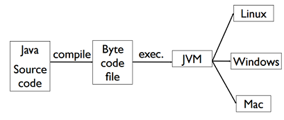
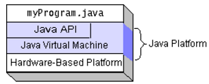
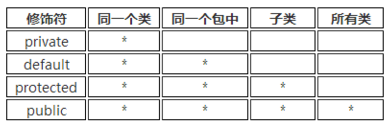
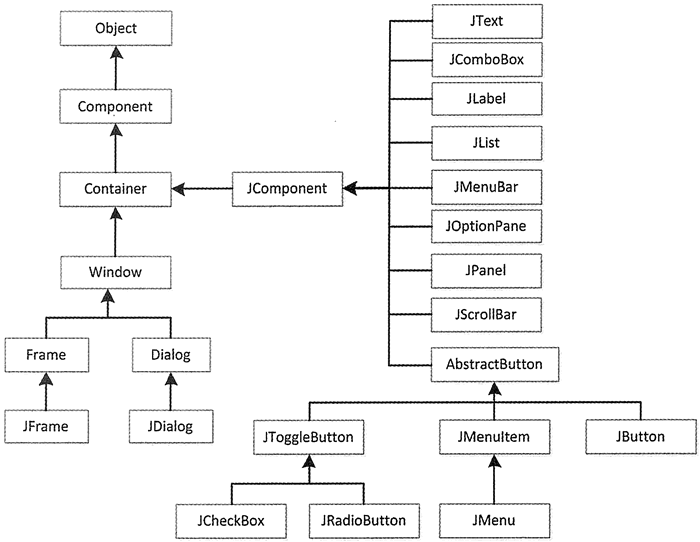

《Java应用技术》这门课由永平奖获得者翁恺老师执教。他在课程设计上用心良苦，不仅讲了 Java 的基础语法，还介绍了很多现代 Java 的理念和科技（比如各种设计模式）。本文侧重于期末考试范围内的基础语法。

## Java 概述

+ Features
	- A compiled language
	- A productive OOP language
	- a type-safe and stable language
	- No point
    - Index check
    - Auto memory management
    
    
+ Unique data type
	- `char` 是 `Unicode` 存储的，每个占2字节。
	- `int` 是 4字节。
+ all objects should be constructed in runtime and be stored in **heap**.
+ To “run a program” is to start a thread from one method of one class in the space.
+ 用户不需要主动释放对象。java有一个内存回收机制会释放。释放前会调用该对象的 `finalize()` 函数。
+ 所有 `primitive data` 都会被初始化成 `0`。
+ 天然地支持面向对象，但是比C++少了这些功能
  + Multi-inheritance 
  + Virtual inheritance
  + Template
  + Operator overloading
+ CLASSPATH: 
  + Place all the .class files for a particular package into a single directory.
  + Contains one or more directories that are used as roots for a search for .class files. 

## 基本知识点

+ 字符串
	- 字符串结束处没有 `\0` 修饰符。有一个长度方法 length()。
	- 字符串不能被修改，但字符串指针可以更换指向的对象。
	- **直接 `==` 判的是是否指向同一个内存地址，`.equals()` 才是判内容相同**。
	- **字符**比较大小可以用 `<>`，字符串比较必须用 `compareTo`（返回 `-1,0,1`）。
	- `charAt()` 定位某个位置。
	- `substring(st_index, end_index)`
	- `String.valueOf()`： returns a string that contains the human-readable equivalent of the value with which it is called.
	  - 别的基本类型可以用 `valueOf()` 或者 `parse...()` 从 `String` 变化过来。
	- 每个类都有`toString()` 方法（因为 `Object `对象有）
	- `String.format()` 格式化字符串
	- `StringBuilder` 提供字符串的修改、拼接，线程不安全；`stringBuffer` 线程安全。
+ 变量初始化
  - 基本类型要求初始化，如果没有初始化就使用它会报错。**没用到不会报错。**
  - 类里的变量可以不初始化，默认是 $0$。
+ 一维数组定义
  + 新建一个数组（默认值为 0）：`int[] a=new int[5];`
  + 初始化为给定值：`int[] a={1,2,3,4,5};` 
  + 另一种初始化方法 `int[] a=new int[]{1,2,3,4,5}` 
  + **如果提供了数组初始化操作，则不能定义维表达式**：`int[] a=new int[5]{1,2,3,4,5}` 是错的。
  + `int[] a; a=new int[5]` **合法** 但是 `int[] a; a={1,2,3,4,5};` **不合法**（该形式仅用于初始化）。
+ 二维数组定义
  + 每一维可以不等长。
  + 动态初始化：第二维可以省略。
    + 举例：`int [ ][ ] arr = new int [5][]; arr[0] = new int[3];  ` 
  + 静态初始化（每一维可以不等长）。
  +  `int[][] a = new int[2][]; a[0][1]=1;` **错误**。第二维没初始化， 报 NullPointerException 异常。

## 更高效地编程

+ 实体和引用
	- 对于基本类型的变量, `for each` 循环时不会对原数组做改动。
	- 对于对象类型的变量，`for each` 循环时会做改动。
+ Final关键词
	- 修饰基本类型时，基本类型的值不能发生改变。
	- 修饰引用类型时，引用类型的地址值不能改变，但是该对象堆内存的值可以改变。
	- private 隐式地加了 final 关键词。
+ 三目运算符
	- `System.out.println(true?1:2.0);`会输出 `1.0`
+ Switch
	+ case表达式既可以用字面值常量，也可以用final修饰且初始化过的变量。
	+ 支持 `char, byte, int, short `, JAVA7 起支持 `String`
	+ String常量判相等时，先计算 hashCode 再比较（所以不支持 null）..
+ 循环语句的标号
	- 可以在循环的头部加标号，形如 `label:statement`. 标号只为 `break` 和 `continue` 服务。
	- 循环里的 `break` 或 `continue` 后可以紧跟着标号，表示它们对被标号的循环起作用。

## 异常

+ **Throwable**（所有异常都是继承自它）
	+ `String getMessage()` ：返回此 throwable 的详细消息字符串
	+ `String toString()` ： 返回此 throwable 的简短描述
	+ `void printStackTrace()` ：打印异常的堆栈的跟踪信息
+ 异常的类型
	+ Error （编译时期的错误以及系统错误）
	+ Exception（程序本身可以处理的异常）
		+ IOException
		+ RuntimeException（**Unchecked Exception**：异常是运行时发生，无法预先捕捉处理的）
  + 非 RuntimeException 在编译时就会检查。
+ `throw-try-catch` 机制
	- 抛出异常的时候，异常处理系统会安装代码书写顺序找出"最近"的处理程序。找到匹配的程序后，它就认为异常将得到清理，然后就不再继续查找。
	- 派生类的对象也可以配备其基类的处理程序。
	- 万能匹配： `catch (Exception e)`
+ `finally`：无论是否发生异常都会执行。非必须。
	+ 若 `catch` 和 `finally` 中都有 `return `，`catch` 时不会立即退出函数，依然会做 `finally`。
+ `throws` ：
	+ 一个方法被覆盖时，覆盖它的方法必须拋出相同的异常或异常的子类。
	+ 子类声明的抛出异常不允许比父类抛出的异常多。

## Lambda 表达式
+ A “lambda expression” is a block of code that you can pass around so it can be executed later, once or multiple times. A lambda expression is a method without a name that is used to pass around behavior as if it were data. 
+ 只能用来简化仅包含一个public方法的接口（**函数式接口**）的创建。
+ 要求外部变量是 **final**（可以是隐式的）。
+ 若只有一个参数，左边的小括号可以省略；若只有一条语句，右边的花括号可以省略。
+ Lambda 表达式的参数列表的数据类型可以省略不写，因为JVM编译器通过上下文推断。

```JAVA
    btn.addActionListener(new ActionListener() {
        @Override
        public void actionPerformed(ActionEvent e) {
        System.out.println("OK");
    }
});
btn.addActionListener(event -> System.out.println("OK"));
```

```Java
	Runnable run = ()->System.out.println("running");
        new Thread(run).start();
        Runnable run2 = ()->{
        System.out.println("running");
        System.out.println("end");
    };
    new Thread(run2).start();
    BinaryOperator<Long> add = (x,y) -> x+y;
	  System.out.println(add.apply(100L, 200L));
```

## 流计算

+ `long count = allArtists.stream().filter(artist -> artist.isFrom("London")).count(); `
+ 常用方法
	- `collect(toList())` 将流里的内容转换成 `list`
	- `map()`：`List<String> collected = Stream.of("a", "b", "hello").map(string -> string.toUpperCase()).collect(toList())`
	- `filter()`：`List<String> beginningWithNumbers = Stream.of("a", "1abc", "abc1").filter(value -> isDigit(value.charAt(0))).collect(toList())`.

## 读入输出和流
+ 流在 Java 中是指计算中流动的缓冲区。
	- 字节流
		+ **抽象基类：InputStream**
			`abstract int read()`：读入一个字节并返回。
			`int read(byte[] b [,int off, int len])`：读入一个字节数组。
		+ FileInputStream：此类用于从本地文件系统中读取文件内容。
		+ FilterInputStream：为基础流提供一些额外的功能。下列两个类都是它的子类。
			+ BufferedInputStream：在读取数据时先放到缓冲区中，可以提高运行的效率。
			+ DataInputStream：该类提供一些基于多字节读取方法，从而可以读取基本数据类型的数据。
		+ PrintStream：打印输出流，它继承于FilterOutputStream，为其他输出流添加了功能，永远不会抛出异常（异常在内部 catch 了）。
	- 字符流：针对 Unicode 文本，多字节。
		+ **抽象基类：Reader**
		+ FileReader：用来读取字符文件的便捷类。
		+ BufferedReader：Reader类的子类，为Reader对象添加字符缓冲器，为数据输入分配内存存储空间，存取数据更为有效
	- stream 是面向 `byte` 的, reader/writer是面向 `char` 的。
	
+ 读入
	- `next()`：（过滤制表符和空格）下一个单词。
	- `nextLine()`：下一行，读完回车后返回，回车会被过滤掉。
+ 序列化
  - 实现 `Serializable` 接口
  - `writeObject()` will be used to serialize that object（用来重载输出函数，不是必须的）
  - 用 `ObjectIutputStream, ObjectOutputStream` 读入输出。

## 线程

+ 创建线程（复写 `run()` 方法）
	- 继承 Thread 类。
	- 实现 Runnable 接口。
+ 方法
	- **静态方法** sleep (long **ms**)：让线程进入阻塞态。会抛出异常。
	- 静态方法 yield()：让正在执行的线程暂停（进入就绪态）。
	- join()：$B$ 线程里执行 `A.join()` 后，$B$ 会等到 $A$ 线程做完再做。
	- stop(): 停止 $A$ 线程。会引起同步问题，不推荐使用。
	- synchronize：修饰同步函数或方法。

## 类

+ 每个类只能继承自一个类。
	
+ 初始化顺序
	- 父类静态块-->子类静态块-->父类非静态块-->父类构造方法-->子类非静态块-->子类构造方法
	- 前两个部分可以理解为类的装载时完成的，后面是在创建具体对象。**如果类已经装载过**，自然没有前两步。
+ 虚类
  
  - All abstract methods must be implemented before the first concrete subclasses in the inheritance tree.
+ `interface` 接口
	- 函数前面会被自动修饰成 `public abstract`（不能有静态方法）。
	- 变量会被隐式加上 `public static final`。
	- 一个类可以实现多个接口。
	- 接口继承接口要用 `extends`。
	- 类继承接口不一定要实现所有它方法（若未实现，这个类依然是虚类）。
	- 在接口的方法前加上 `default`，可以定义该方法的默认行为（JAVA 8引进）。
		+ 如果同时继承和实现了类和方法，类的默认优于方法的默认。
		+ 继承链上后面的优于前面的。

+ Class 类
    - getClass() 的返回值是一个类，这个类就叫做 `Class`。
    - 我们可以用 `类名.class` 或者 `对象名.getClass()` 来取得一个对象或者类的类名。
    - `Class.forName(str)` ：把类名叫做 `str` 的类装载进来（必须用 `catch` 包起来）。
    - `a instanceof A` 或 `c.isInstance(a)` 。其中 `A` 是一个类，`a` 是对应的对象，`c` 是指向 `A` 类的 `Class` 类。
    - `isInterface()` 是否是接类。
    - `getName()` 获得类的名字。
    - `getSuperclass()` 获取父类的 `Class`。
+ Method
    ```JAVA
    	Method meth = c.getMethod(str, null)
    	meth.invoke(c, null)
    ```

+ Object类
	- 拥有 toString(), clone(), getClass(), equals() 等函数。
	- 拥有 hashCode() 方法，默认情况下每个类都不一样（key 可以理解为是它存放在 JAVA 堆里的地址），即使它们本身内容相同。若要实现 set，必须重写。
+ 重写和重载
	- 重写（Override）是子类对父类的允许访问的方法的实现过程进行重新编写, 返回值和形参都不能改变。即参数不变，核心重写。**父类方法的返回值如果是类，子类方法可返回它的子类。**
	- 重载 (overloading) 是在一个类里面，方法名字相同，而参数不同。返回类型可以相同也可以不同。
	
+ `import static 类名.方法名`：导入静态变量或方法。如 `import static java.lang.Math.abs;`

+ `Inner class` 内部类
	+ 外界定义内部类：`new Main().new Inner()`
	+ 内部类可以调用 `Outer class` 的所有内容（包括 `private`）；外部类也可以通过新建内部类来调用内部类里的所有信息。
	+ 当成员内部类拥有和外部类同名的成员变量或这方法时， 默认情况下访问的是内部类的成员；如要访问外部类的同名成员， 需要使用以下形式：`外部类.this.成员变量`  或 `外部类.this.成员方法`。
	+ 局部的内部类：
	  + 局部内部类：定义在一个方法或作用域中的类，它的访问权限仅限于方法内或作用域内。
	  + 匿名内部类：
	  + **Argument must be final to use inside them**. (1.8以后不再要求) 

## Java API 调用

#### Array

+ 导入：`import java.util.List;`
+ 重载
    1. 在排序的类里重载：定义类后面加上 `public class App implements Comparable<App>`。
	~~~Java
        public int compareTo(App app) {
            return ;
        }
    ~~~
    2. 新开一个类重载
    ~~~Java
        class MyComparator implements Comparator<Integer>{
            @Override
            public int compare(Integer o1, Integer o2) {
                return o2-o1;
            }
        }
    ~~~

#### 容器的普遍接口 Collection


+ 只能放对象，不能放 `primitive data`
+ 子类的 Collection 不能看做是继承了父类的 Collection（不能赋值）
	- `Collection <?>`
	- `Collection <? extends father>`
	- `static <T> void fromArraytoCollection(T[]a, Collection<T>c)`
+ 用 `for each` 进行遍历
+ 用 `Iterator` 访问
	- iterator()
	- next()
	- hasNext()
+ 函数和方法
    - add()
    - addAll(Collecton)
    - containsKey()
    - remove()
    - isEmpty()
    - size()
    - clear()
    - toArray()
+ Collections 的静态方法 
    - max(Collection) , min(Collection) 
    - reverse( ) 
    - copy(List dest, List src)
    - fill(List list, Object o)

#### Generic 泛型

+ A generic type declaration is compiled once and for all, and turned into a single class file.
+ In general, if `Foo` is a subtype (subclass or subinterface) of `Bar`, and `G` is some generic type declaration, it is not the case that `G` is a subtype of `G`.
+ 泛型可以在编译期进行类型检查，并且仅在编译期有效。**所有泛型参数类型在编译后都会被清除**。
    + A Generic Class is Shared by all its Invocations.
      ```java
        List <String> l1 = new ArrayList<String>();
        List<Integer> l2 = new ArrayList<Integer>();
        System.out.println(l1.getClass() == l2.getClass()); //true
      ```
    + **不能对确切的泛型类型使用 instanceof 操作**。
         ```java
          if (cs instanceof Collection<String>) { ...} // illegal
          //Error: Cannot perform instanceof check against parameterized type Collection<String>. Use the form Collection<?> instead since further generic type information will be erased at runtime
         ```
    + 泛型数组初始化时不能声明泛型类型。 如下代码编译时通不过：
        ```java
        List<String>[] list = new List<String>[];
        ```
        - 在这里可以声明一个带有泛型参数的数组，但是不能初始化该数组，因为执行了类型擦除操作后，List<Object>[] 与 List<String>[] 就是同一回事了，编译器拒绝如此声明。
    
+ Wildcards vs. Generic
    + Wildcards are designed to support flexible subtyping. 
    + Generic methods allow type parameters to be used to express dependencies among the types of one or more arguments to a method and/or its return type.
    + ```JAVA
      public static <T> void copy (List<T> dest, List<? extends T> src){...} 
      ```
#### Iterator
+ An iterator is an object whose job is to move through a sequence of objects and select each object in that sequence without the client programmer knowing or caring about the underlying structure of that sequence.
  + iterator(): Return the first element
  + next(), hasNext()
  + remove(): Removes from the underlying collection the last element returned by this iterator.

#### List
+ 分类
	- ArrayList
	  - It keeps its own private count of how many items it is currently storing. 
	  - Its size method returns the number of objects currently stored in it. 
	- LinkedList
	- List $\rightarrow$ Vector $\rightarrow$ Stack
	- Queue

#### Set

+ 分类
	- HashSet
	- TreeSet
+ 重载：复写类中的 hashCode() 函数和 equals() 函数。


#### Map

+ 导入：`import java.util.List;`
+ 定义： `HashMap<String, String> map = new HashMap<>();`
+ 迭代
	~~~Java
        for (Entry<String, String> entry : map.entrySet()) {
            String key = entry.getKey();
            String value = entry.getValue();
        }
  ~~~

## Swing 和容器



```Java
import java.awt.*;
import javax.swing.*;
```

+ Swing 提供了许多比 AWT 更好的屏幕显示元素，使用纯 Java 实现，能够更好的兼容跨平台运行。
+ 创建图形用户界面程序的第一步是创建一个容器类以容纳其他组件，常见的窗口就是一种容器。容器本身也是一种组件，它的作用就是用来组织、管理和显示其他组件。
+ 三种顶层容器
	- JFrame：用于框架窗口的类，此窗口带有边框、标题、关闭和最小化窗口的图标。带 GUI 的应用程序至少使用一个框架窗口。
	- JDialog：用于对话框的类。
	- JApplet：用于使用 Swing 组件的 Java Applet 类。
+ 中间容器
	- JPanel：表示一个普通面板，是最灵活、最常用的中间容器。
	- JScrollPane：与 JPanel 类似，但它可在大的组件或可扩展组件周围提供滚动条。
	- JTabbedPane：表示选项卡面板，可以包含多个组件，但一次只显示一个组件，用户可在组件之间方便地切换。
	- JToolBar：表示工具栏，按行或列排列一组组件（通常是按钮）。

## JFrame

+ 新建 JFrame 对象
	- JFrame()：构造一个初始时不可见的新窗体。
	- JFrame(String title)：创建一个具有 title 指定标题的不可见新窗体。
+ 要通过内容窗格来添加组件：frame.getContentPane().add(b);
+ 常见方法
	| 方法名称                                                     | 功能                                                         |
  | ------------------------------------------------------------ | ------------------------------------------------------------ |
	| getContentPane()                                             | 返回此窗体的 contentPane 对象                                |
	| getDefaultCloseOperation()                                   | 返回用户在此窗体上单击“关闭”按钮时执行的操作                 |
	| setContentPane(Container contentPane)                        | 设置 contentPane 属性                                        |
	| setDefaultCloseOperation(int operation)                      | 设置用户在此窗体上单击“关闭”按钮时默认执行的操作             |
	| setDefaultLookAndFeelDecorated (boolean defaultLookAndFeelDecorated) | 设置 JFrame 窗口使用的 Windows 外观（如边框、关闭窗口的 小部件、标题等） |
	| setIconImage(Image image)                                    | 设置要作为此窗口图标显不的图像                               |
	| setJMenuBar( JMenuBar menubar)                               | 设置此窗体的菜单栏                                           |
	| setLayout(LayoutManager manager)                             | 设置 LayoutManager 属性                                      |

## Graphics

+ The Graphics class contains the methods for drawing strings and shapes.
+ drawString(s, x, y). (0, 0) is the left-up corner.
+ drawLine(x1, y1, x2, y2)
+ Draw shapes
  + drawRect(x, y, w, h) 
  + fillRect(x, y, w, h)
  + drawRoundRect(x, y, w, h, aw, ah)
  + drawOval(x, y, w, h)
  + drawArc(int x, int y, int w, int h, int startAngle, int arcAngle)
  + drawPolygon(Polygon polygon)
    + polygon.addPoint(40, 20);
    + Polygon polygon = new Polygon();

## JPanel

+ JPanel 是一种中间层容器，它能容纳组件并将组件组合在一起，但它本身必须添加到其他容器中使用
	- JPanel()：使用默认的布局管理器**FlowLayout**创建新面板。
	- JPanel(LayoutManagerLayout layout)：创建指定布局管理器的 JPanel 对象。
	
+ 常用方法
	| 方法名及返回值类型                | 说明                           |
  | --------------------------------- | ------------------------------ |
	| Component add(Component comp)     | 将指定的组件追加到此容器的尾部 |
	| void remove(Component comp)       | 从容器中移除指定的组件         |
	| void setFont(Font f)              | 设置容器的字体                 |
	| void setLayout(LayoutManager mgr) | 设置容器的布局管理器           |
	| void setBackground(Color c)       | 设置组件的背景色               |

## Layout Manager

+ Each container must have a layout manager. 

+ 边框布局管理器 BorderLayout
	
	- Window、JFrame 和 JDialog 的默认布局管理器。
	- 将窗口分为 5 个区域：North、South、East、West 和 Center。
	- 如果未指定位置，则缺省的位置是CENTER
	- **不一定需要所有组件，自动填充**
	
+ 流式布局管理器 FlowLayout
	- JPanel 和 JApplet 的默认布局管理器。
	- 将组件按照从上到下、从左到右的放置规律逐行进行定位。
	- 不限制它所管理组件的大小，而是**允许它们有自己的最佳大小**。
	- 初始化：`FlowLayout([int align[, int hgap,int vgap]])`： align 表示组件的对齐方式（FlowLayoutLEFT、FlowLayout.RIGHT 和 FlowLayout.CENTER）；hgap 表示组件之间的横向间隔；vgap 表示组件之间的纵向间隔，单位是像素。
	
+ 卡片布局管理器 CardLayout
	- 多个成员共享同一个显示空间，并且一次只显示一个容器组件的内容。
	- 将容器分成许多层，每层的显示空间占据整个容器的大小，但是每层只允许放置一个组件。
	- ```Java
		JPanel cards = new JPanel(new CardLayout());
        JPanel t = new JPanel();
        cards.add(t, "name")
    ```
  
+ 网格布局管理器 GridLayout
	- 将区域分割成行数（rows）和列数（columns）的网格状布局，组件按照由左至右、由上而下的次序排列填充到各个单元格中。
	- `GridLayout(int rows,int cols[,int hgap,int vgap])`：创建一个指定行（rows）和列（cols）的网格布局，并且可以指定组件之间横向（hgap）和纵向（vgap）的间隔，单位是像素。
	- GridLayout 布局管理器总是忽略组件的最佳大小，而是根据提供的行和列进行平分。该布局管理的所有单元格的宽度和高度都是一样的。
	
+ 网格包布局管理器 GridBagLayout
	- 是在网格基础上提供复杂的布局，是最灵活、 最复杂的布局管理器。
    - 不需要组件的尺寸一致，**允许组件扩展到多行多列**。
  
+ 盒布局管理器 BoxLayout
	- `BoxLayout(Container c,int axis)`：参数 Container 是一个容器对象，即该布局管理器在哪个容器中使用；第二个参数为 int 型，用来决定容器上的组件水平（X_AXIS）或垂直（Y_AXIS）放置，可以使用 BoxLayout 类访问这两个属性。
	- createHorizontalBox()：返回一个 Box 对象，它采用水平 BoxLayout
	- createVerticalBox()
	- 使用盒式布局可以像使用流式布局一样简单地将组件安排在一个容器内。包含盒式布局的容器可以嵌套使用，最终达到类似于无序网格布局那样的效果。

## 监听

+ 事件处理
	- Event（事件）：用户对组件的一次操作称为一个事件，以类的形式出现。
	- Event Source（事件源）：事件发生的场所，通常就是各个组件，例如按钮 Button。
	- Event Handler（事件处理者）：接收事件对象并对其进行处理的对象事件处理器，通常就是某个 Java 类中负责处理事件的成员方法。
+ 动作事件处理器
	- 事件名称：ActionEvent。
	- 事件监听接口: ActionListener。
	- 相关方法：addActionListener() 添加监听，removeActionListener() 删除监听。
	- 涉及事件源：JButton、JList、JTextField 等。
+ 焦点事件监听器
	- 事件名称：FocusEvent。
	- 事件监听接口： FocusListener。
	- 相关方法：addFocusListener() 添加监听，removeFocusListener() 删除监听。
	- 涉及事件源：Component 以及派生类。
	- FocusEvent 接口定义了两个方法，分别为 focusGained() 方法和 focusLost() 方法，其中 focusGained() 方法是在组件获得焦点时执行，focusLost() 方法是在组件失去焦点时执行。