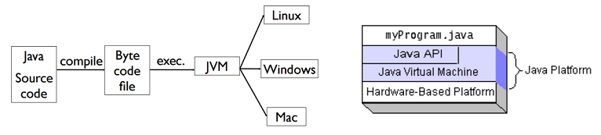
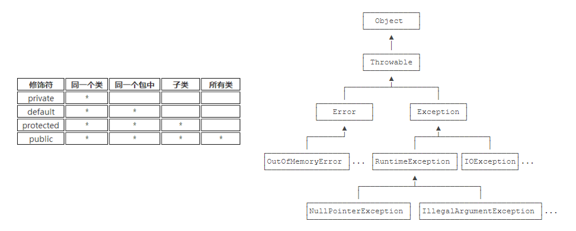
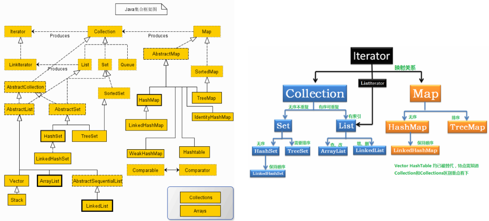

在华为云工作时，发现 Java 语言是一个不可或缺的技能，遂进行学习和整理。

本文总结自翁恺老师的课程《Java 应用技术》以及廖雪峰的 [Java 教程](https://www.liaoxuefeng.com/wiki/1252599548343744)，文字和图片侵删。

<!-- more -->

## Introduction

Java 由 SUN 公司 James Gosling 首创，原名 Oak，最初是针对嵌入式引用。随着互联网的崛起，SUN 公司改造了 Oak，并在 1995 年以 Java 的名称发布。SUN 公司后被 Oracle 收购。

Java是将代码编译成一种“字节码”（类似于抽象的CPU指令），并针对不同平台编写虚拟机，负责加载字节码并执行。对于 java 开发者来说，就实现了“一次编写，到处运行”的效果。源文件 `*.java` 经过编译得到了字节码文件 `*.class` 后，就可以在虚拟机上运行。`javac` 就是编译命令，而 `java` 是执行命令。



## Basic Grammar

Java 总体分为基本类型和引用类型。引用类型有一种取值叫做 `null`。

Java 中 使用 `==` 会判段是否指向同一个内存地址，`A.equals(B)` 才是判断内容是否逻辑上相等。

字符（Character）和字符串（String）类型

+ `char` 按 Unicode 编码储存，占 2 字节。可以用 `\u`+十六进制来表示一个字符，如  `\u4e2d` 表示“中”。
+ 和 `char` 不同，字符串类型 `String` 是引用类型，**字符串内容不可变，但变量可以更换指向对象**。
+ **字符** 比较大小可以用 `<>`，但字符串比较必须用 `compareTo`（返回 `-1,0,1`）。
+ 字符串结束处没有 `\0` 修饰符。有一个求长度的方法 `length()`。
+ 如果用 `+ ` 连接字符串和其他数据类型，会将其他数据类型先自动转型为字符串再连接。
+ `StringBuilder` 提供字符串的修改、拼接，线程不安全；而 `stringBuffer` 是线程安全的。

~~~java
String1.concat(string2) / string1 + string 2   // 连接字符串
String.charAt()                                // 定位字符串某个位置
String.format("description: %f %d", f, d)      // 格式化字符串
String.valueOf(<type_name> <var_name>)         // 把某个类型转化成字符串
String.substring(st_index, end_index)          // 求子串
~~~

数组的定义和使用

- 数组是引用类型，一旦创建后大小不可变。
- 新建一个 int 数组（默认值为 0）：`int[] a=new int[5];`
- 新建数组并初始化：`int[] a={1,2,3,4,5};` 或  `int[] a=new int[]{1,2,3,4,5};`。
- 如果提供了数组初始化操作，则不能定义维表达式，即 `int[] a=new int[5]{1,2,3,4,5}` 是错的。
- `int[] a; a=new int[5]` **合法** 但是 `int[] a; a={1,2,3,4,5};` **不合法**（该形式仅用于初始化）。
- 多维数组的每一维里可以不等长，非首维的维度可以动态初始化。可以 `int [][] arr = new int [5][]`，后续要使用时再 `arr[0] = new int[3]`，如果直接 `arr[0][1]=1` 会报错。

~~~java
int[][] ns = {
    { 1, 2, 3, 4 },
    { 5, 6, 7, 8 },
    { 9, 10, 11, 12 }
};
for (int[] arr : ns) 
    for (int n : arr) 
        ... 
Array.sort(ns[0])
~~~

可以用里 for each 的方式遍历可迭代对象。若遍历元素是基本类型则不能修改，是引用类型则可以修改。

Final 关键词可以修饰类、方法和变量。

- 修饰基本类型时，基本类型的值不能发生改变。编译器会默认它是常量并进行优化（如下）。
- 修饰引用类型时，引用类型的地址值不能改变（但该对象堆内存的值可以改变）。
- 修饰一个类时，表示它不能被继承。final 类的所有方法都被隐式加上 final，但是变量是正常的。

~~~java
String a = "hello2"; 
final String b = "hello";
String d = "hello";
String c = b + 2; 
String e = d + 2;
System.out.println((a == c));   // true
System.out.println((a == e));   // false
~~~

Java 里的 switch 和 C++ 一样具有穿透性。

+ case 表达式既可以用字面值常量，也可以用 final 修饰且初始化过的变量。
+ case 支持 char，byte，int，short 和枚举类，JAVA7 起支持 String。
+ String 常量判相等时，先计算 hashCode 再比较（所以不支持 null）。
+ Java 12 开始有一个新语法，支持用 switch 给某个变量赋值，且不具有穿透性。

~~~java
String fruit = "orange";
int opt = switch (fruit) {
    case "apple" -> 1;
    case "pear", "mango" -> 2;
    default -> {
        int code = fruit.hashCode();
        yield code; // switch 语句返回值
    }
};
~~~


## Class

类里可用 `this.<member>` 调用成员，也可以用 `this(<parameters>)` 调用该类的其它初始化方法。

每个类只能继承自一个类，不写的话默认继承 Object 类。Object 类拥有一些成员函数：

+ `hashCode()` ：默认情况下，每一个实例的哈希值都不一样（可视为它们的地址），也可以重载。
+ 还包括 `toString(), clone(), getClass(), equals(), hashCode()` 等函数。

类的任何构造方法里，第一行必须用 `super(...)` 调用父类的构造方法（如果没写默认加上 `super()`）。也可以用 `super.<member>` 指定调用父类的成员。`super` 可以嵌套。

可以用 `<instance_name> instanceof <class_name>` 判断一个实例是否属于一个类（或它的子类）。向上转型（upcasting）是允许且安全的，可以用它来实现动态绑定；向下转型（downcasting）可能会失败报错（只有当一个类先向上转型再转回来才能成功）。向下转型前可以先用 `instanceof ` 来判断合法性，以规避报错。

Java 支持重载（overload）和重写（override）。前者方法名相同而参数不同，返回类型也可以相同或不同。后者必须参数相同且返回类型相同（如果返回类型不同会报错）；可以用 `@Override` 标记重写函数，编译器会在不合法时给出警告；**如果父类方法的返回值如果是一个类，子类方法可返回该类的子类。**

如果不指定初值，引用类型、数值类型、布尔类型会被默认初始化成 `null`，$0$ 和 `false`。如果既指定初值又在构造方法里出现，会先调用前者。具体的初始化顺序为：**父类静态块—>子类静态块—>父类非静态块—>父类构造方法—>子类非静态块—>子类构造方法**。前两步静态块在类的装载时完成，后续调用时不再执行。

用 `abstract` 定义抽象类，它不能有实例。没有字段、全是抽象方法的类可以改写为接口 `interface`。

+ 接口会在方法前默认加上 `public abstract`，且不支持静态方法。
+ 接口会给所有变量隐式加上 `public static final`。
+ 类只能继承自一个类，但可以实现多个接口。实现接口用关键字 `implements`。
+ 接口也是数据类型，可以向上或者向下转型。接口继承接口仍需使用 `extends`。
+ 可以在接口的方法前加上 `default`，这样实现它的类可以不具有这个方法。

如果一个类定义在另一个类或方法的内部，它被成为嵌套类（Nested Class）。嵌套类分为内部类（Inner Class）、匿名类（Anonymous Class）和静态嵌套类（Static Nested Class）。

+ 内部类的实例不能单独存在，必须依附于一个外部类。外界定义实例：`new Outer().new Inner()`。
+ 内部类可以调用外部类里包括 private 的所有方法，外部类也可以调用某个内部类实例的所有方法。
+ 如果内部类想调用重名的外部类成员，使用 `<outer_class>.this.<member>`。
+ 匿名类的用法和内部类一致，但它可以直接创建，不用关心类名。
+ 静态嵌套类用 static 修饰，无法调用 `Outer.this`，但可以调用外部类的静态成员。

Java 有四种类内成员的修饰符，相比 C++ 多了一个 default。



## Exception and Logging

Java 的异常用 Throwable 类表示，它分为 Error 和 Exception。

+ Error 表示编译时期的错误或系统错误等严重错误，如 OutOfMemoryError，NoClassDefFoundError。
+ Exception 是程序本身可以处理的异常，应当被捕获并处理。它主要分为两类：
  + RuntimeException 及其子类：运行时错误，无法预先捕捉。
  + 非 RuntimeException 类，包括 IOException，TimeOutException 等：在编译时就会检查。

对于非 RuntimeException 及其子类的 Exception，Java 规定需要强制捕获或做 throws 声明。

`try...catch`  按顺序捕获异常，所以子类要写在父类后面。不管有无异常最后都要执行 `finally`，可省略。

~~~java
public static void main(String[] args) {
    try {
        process1();
        process2();
    } catch (IOException | NumberFormatException e) {
        System.out.println("Bad input");
    } catch (Exception e) {
        System.out.println("Unknown error");
    } finally{
        ...
    }
}
~~~

可以继承 Exception 类来自己定义异常，通常建议从 RuntimeException 派生。

在函数体里用 throw 抛出异常。可以在方法定义处用 throws 声明该方法可能会抛出哪些异常。覆写父类方法的子类方法只能抛出与原方法相同的异常或它的子类，也可以选择不抛出异常。

捕获子函数异常并想抛出新异常时，建议把原异常放在新异常的构造方法里，在顶层使用 `e.printStackTrace()` 就可以打印出异常的堆栈。用 `e.getMessage()` 和 `e.toString()` 可以获得当前异常的详细/简短描述。

可以使用 Java 内置的日志来打印一些异常信息。日志可以存档、按级别分类、屏蔽低级别的信息。

~~~java
import java.util.logging.Level;
import java.util.logging.Logger;
public class Hello {
    public static void main(String[] args) {
        Logger logger = Logger.getGlobal();
        logger.info("start process...");
        logger.warning("memory is running out...");
        logger.fine("ignored.");
        logger.severe("process will be terminated...");
    }
}
~~~

Log4j 是一个非常流行的日志框架，可以用 xml 配置它的各种功能。

~~~xml
<?xml version="1.0" encoding="UTF-8"?>
<Configuration>
	<Properties>
        <!-- 定义日志格式 -->
		<Property name="log.pattern">%d{MM-dd HH:mm:ss.SSS} [%t] %-5level %logger{36}%n%msg%n%n</Property>
        <!-- 定义文件名变量 -->
		<Property name="file.err.filename">log/err.log</Property>
		<Property name="file.err.pattern">log/err.%i.log.gz</Property>
	</Properties>
    <!-- 定义Appender，即目的地 -->
	<Appenders>
        <!-- 定义输出到屏幕 -->
		<Console name="console" target="SYSTEM_OUT">
            <!-- 日志格式引用上面定义的log.pattern -->
			<PatternLayout pattern="${log.pattern}" />
		</Console>
        <!-- 定义输出到文件,文件名引用上面定义的file.err.filename -->
		<RollingFile name="err" bufferedIO="true" fileName="${file.err.filename}" filePattern="${file.err.pattern}">
			<PatternLayout pattern="${log.pattern}" />
			<Policies>
                <!-- 根据文件大小自动切割日志 -->
				<SizeBasedTriggeringPolicy size="1 MB" />
			</Policies>
            <!-- 保留最近10份 -->
			<DefaultRolloverStrategy max="10" />
		</RollingFile>
	</Appenders>
	<Loggers>
		<Root level="info">
            <!-- 对info级别的日志，输出到console -->
			<AppenderRef ref="console" level="info" />
            <!-- 对error级别的日志，输出到err，即上面定义的RollingFile -->
			<AppenderRef ref="err" level="error" />
		</Root>
	</Loggers>
</Configuration>
~~~

实际开发时，往往使用 Commons Logging 来完成日志的输出。它会自动搜索 Log4j，如果不存在就使用 JDK 默认的 Logging。它由 6 个日志级别（FATAL，ERROR，WARNING，INFO，DEBUG，TRACE），默认 INFO。

~~~java
import org.apache.commons.logging.Log;
import org.apache.commons.logging.LogFactory;
public class Main {
    public static void main(String[] args) {
        Log log = LogFactory.getLog(Main.class);
        log.info("start...");
        log.warn("end.");
        try {
            ...
        } catch (Exception e) {
            log.error("got exception!", e);
        }
    }
}
~~~

## Generic

Java 编译器会把泛型的 T 视为 Object，并在需要的时候转型给用户。虚拟机在运行时感知不到泛型。

这种泛型实现方法被称为擦拭法（Type Erasure），它会带来以下一些局限。

+ 对基本类型（如 int）不能使用泛型，因为它必须继承自 Object（只能换成 Integer）。
+ 对确切的泛型类型使用 `instanceof()` 或 `getClass()` 是无效的，因为本质上是 `container<object>`。
+ 不能实例化某个泛型 T，因为实际执行的是 `new Object()`。可以传入确切类的 Class 来做到实例化。
+ 要防止重复定义 Object 的方法，如泛型类里定义 `public boolean equals(T obj)` 会报错。


```java
List <String> l1 = new ArrayList<String>();
List <Integer>l2 = new ArrayList<Integer>();
System.out.println(l1.getClass() == l2.getClass()); //true

if (cs instanceof Collection<String>) { ...} // 不合法
//Error: Cannot perform instanceof check against parameterized type Collection<String>. Use the form Collection<?> instead since further generic type information will be erased at runtime

public class Pair<T> {
    public boolean equals(T t) {return this == t;}
    // 不合法，编译器会把 T 替换成 Object，并阻止最终会变成覆写的泛型定义；换个方法名即可。
}
```

把一对继承类应用在泛型里后，他们不再有继承关系，例如 `Pair<Integer>` 不是 `Pair<Number>` 的子类。

如果想要在方法的参数里同时接收  `Pair<Integer>` 和  `Pair<Integer>` 两者，有以下几种方法。

1. 使用 `pair<T extends Number>`，表示接受 Number 类及其所有子类（不包括后续继承者）。
2. 使用 `Pair<? extends Number>`，表示接受 Number 类及其所有继承链上的类。这种 `?` 的技术被称为 Wildcards（通配），这个例子描述的是上界通配符（Upper Bounds Wildcards）。使用类似 `<? extends Number>` 通配符作为方法的参数时，本质上表示 **可以读，不能写**。
   + 方法内部可以调用获取 `Number` 引用的方法，如 `Number n = obj.getFirst()`。
   + 方法内部无法调用传入 `Number` 引用的方法（`null` 除外），如 `obj.setFirst(Number n)`。
3. 使用 `pair<? super Integer>`，表示接受 Integer 类及其所有祖先链上的类。作为参数 **可以写，不能读**。
   + 方法内部可以调用传入 `Integer` 引用的方法，如 `obj.setFirst(Integer n)`。
   + 方法内部无法调用获取 `Integer` 引用的方法（`Object` 除外），如 `Integer n = obj.getFirst()`。
4. 使用 `pair<?>`，它被称为无限通配符（Unbounded Wildcard Type）。它作为参数不能读也不能写，一般可以用 `<T>` 替换 。注意 ``pair<?>` 是所有 `Pair<T>` 的超类，所以可以承接 `pair<T>` 起到安全向上转型。

`<? extends Base>` 能读不能写，`<? super Integer>` 能写不能读，所以 Collection 的 `copy` 这么写：

```java
public static <T> void copy(List<? super T> dest, List<? extends T> src) {
    for (int i=0; i<src.size(); i++) {
        T t = src.get(i);
        dest.add(t);
    }
}
```

一个类可以继承自一个确切的泛型类。在这种情况下，子类可以获取父类的泛型类型。

~~~java
public class IntPair extends Pair<Integer>{}    // 希望得到具体的泛型类型 Integer

Class<IntPair> clazz = IntPair.class;
Type t = clazz.getGenericSuperclass();
if (t instanceof ParameterizedType) {
    ParameterizedType pt = (ParameterizedType) t;
    Type[] types = pt.getActualTypeArguments();
    Type firstType = types[0];                  
    Class<?> typeClass = (Class<?>) firstType;
    System.out.println(typeClass);              // 得到 Integer
}
~~~

## Reflection

JVM 会为每种加载的类 A 创建一个关于 Class 的实例，并在该实例中保存 A 的所有类信息，包括类名、包名、父类、实现的接口、所有字段和方法。JVM 能通过这种方式动态获得所有实例的类信息，即反射（Reflection）。

+ 用 `<class_name>.class` 或 `<instance_name>.getClasss()` 获取某个类/实例对应的 Class 实例。如果知道某个类的完整名字，还可以用 `Class.forName(<package_name>.<class_name>)` 获取。
+ Class 的实例可以用 `==` 作比较，只有所属类完全相同才返回 `true`（比 `isinstanceof` 更严格）。
+ 一些常用的 Class 的成员函数：`getName(), getSimpleName(), isInterface(), getSuperclass()`。
+ 我们可以根据某个类对应的 Class 实例，进一步提取它的字段或调用它的函数。  

~~~java
Class stdClass = Student.class;
System.out.println(stdClass.getField("score"));          // 获取某个字段（包括父类）
Field f = stdClass.getDeclaredField("grade");            // 获取某个字段（不包括父类）
int m = f.getModifiers();
Modifier.isFinal/isPublic/isStatic(m);                   // 判断字段的类型
Method f = stdClass.getMethod("getScore", String.class); // 获取指定参数类型的方法
Method.getName()/getReturnType()/getParameterTypes()/getModifiers()
f.setAccessible(true);                                   // 加了这句话才能访问私有方法
System.out.println(f.invoke(<instance>, <parameters>));  // 调用某个类的方法
System.out.println(f.invoke(null, <parameters>));        // 调用某个类的静态方法
Constructor c = Integer.class.getConstructor(int.class); // 获取某个类的构造方法
Integer n1 = (Integer) c.newInstance(123);               // 调用某个类的构造方法
~~~

反射还支持动态代理（Dynamic Proxy）机制，能够动态地为一个接口创造实例：

~~~java
public class Main {
    public static void main(String[] args) {
        InvocationHandler handler = new InvocationHandler() {
            @Override
            public Object invoke(Object proxy, Method method, Object[] args) throws Throwable {
                if (method.getName().equals("morning")) {
                    System.out.println("Good morning, " + args[0]);
                }
                return null;
            }
        };
        Hello hello = (Hello) Proxy.newProxyInstance(
            Hello.class.getClassLoader(),   // 传入 ClassLoader
            new Class[] { Hello.class },    // 传入要实现的接口
            handler);                       // 传入处理调用方法的 InvocationHandler
        hello.morning("Bob");
    }
}
interface Hello {
    void morning(String name);
}
~~~

## Collection

翁恺老师在讲课时抨击了 Collection 的标准翻译，认为“集合”这个词和 Set 高度相关，建议翻译成“容器”。

Java 在 `java.util` 包提供了容器类，主要有 List，Set 和 Map 等。



容器的对象不能设为基本类型（所以容器里也支持放入 null）。容器可以用统一的迭代器来高效遍历。

~~~java
for (Iterator<String> it = <collection>.iterator(); it.hasNext(); ) {
    String s = it.next();
    System.out.println(s);
}
for (String s : list) System.out.println(s);             // 会自动翻译成上一种方式
~~~

List 是一种有序列表，它本身是个接口，有 ArrayList 和 LinkedList 两种具体泛型，分别用数组和链表实现。

~~~java
import java.util.ArrayList;
import java.util.List;
boolean add(E e)
boolean add(int index, E e)
E remove(int index)
boolean remove(Object e)
int size()
    
boolean contains(Object e)
E get(int index)
int indexOf(Object o)                                    // 返回元素索引，不存在输 -1。
Object[] toArray()
Integer[] array = list.toArray(new Integer[list.size()]);
Integer[] array = list.toArray(Integer[]::new);
List<Integer> list = List.of(array);
List<Integer> list = new ArrayList<>(); list.add(null);  // 因为用包裹类，支持 null。
List<Integer> list = List.of(1, 2, 5);                   // 用这种初始化不能接受 null。
~~~

`contains` 和 `indexOf` 依赖 `equals()`，可以重载。Java 标准库已正确实现了 Integer，String 的相等比较。

`Map<K, V> ` 是一种键-值映射表，K 和 V 是两个泛型结构。Map 也是接口，具体有以下实现：

+ HashMap 里存放的 key 不一定是原来的 key，用 `.equals()` 比较 key。此外，HashMap 通过 `hashCode()` 实现快速哈希定位。以上两个函数都可以重载（当然要保证后者返回真要是前者的必要条件）。
+ 如果 key 的对象是 enum 类型，可以改用 EnumMap。它的使用和 HashMap 一样，用紧凑数组保存结果。
+ Properties 相当于 Map<String, String>，专门用来处理配置文件。在配置文件里写上若干 `A=B` 的参数设置，然后可以定义 Properties  把它们 `load()` 进来或者 `store()` 回去。

+ TreeMap 实现了 SortedMap 的接口，内部保证了 key 的有序性。对 key 的比较有两种方式：
  + 新建 TreeMap 时构造函数传入 `Comparator` 接口，其内部实现好 `compare` 方法（返回 -1/0/1）。
  + TreeMap 的 key 的类 implement 了 `Comparable` 接口，并在类里实现 `compareTo` 方法。

Map 的键集合是 `keySet()`，值集合 `values()`，键值对集合 `entrySet()`。map 的变化会动态附加在这些集合上。如果 map 有了修改但指向这些集合的 Iterator 继续移动是未定义行为。可以依靠这些集合来 for each。

~~~java
import java.util.HashMap;
import java.util.Map;

V put(K key, V value)                                     // 存在返回旧值，否则返回 null
V get(K key)                                              // 不存在返回 null
boolean containsKey(K key)
boolean containsValue(V value)
void putAll(Map<? extends K,? extends V> map)
    
Properties props = new Properties();
props.load(new FileReader(<path>, StandardCharsets.UTF_8));
String filepath = props.getProperty("last_open_file");
String interval = props.getProperty("auto_save_interval", "120");
props.setProperty("language", "Java");
props.store(new FileOutputStream(<path>), "这是写入的properties注释");

Map<String, Integer> map = new HashMap<>();
Map<Person, Integer> map = new TreeMap<>(new Comparator<Person>() {
    public int compare(Person p1, Person p2) {
        return p1.name.compareTo(p2.name);
    }
});
for (String key : map.keySet()) {
    Integer value = map.get(key);
    System.out.println(key + " = " + value);
}
for (Map.Entry<String, Integer> entry : map.entrySet()) {
    String key = entry.getKey();
    Integer value = entry.getValue();
    System.out.println(key + " = " + value);
}
~~~

Set 是一个存储不重复的元素集合的接口。

+ HashSet 是 HashMap 的简单封装，所以需要正确实现 `equals()` 和 `hashCode()` 方法。
+ TreeSet 继承了 SortedSet 接口，和 TreeMap 一样必须实现 Comparable 接口或传入 Comparator 对象。

~~~java
boolean add(E e)
boolean remove(Object e)
boolean contains(Object e)
~~~

Queue 是实现队列功能的接口。PriorityQueue 实现了 Queue 接口，提供优先队列功能。

~~~java
boolean add(E)/boolean offer(E)                            // 添加到队尾，失败返回 false
E remove()/E poll()                                        // 获取队首并将其删除
E element()/E peek()                                       // 获取队首
~~~

接口 Deque 继承并拓展了 Queue 接口，主要应用是 ArrayDeque 和  LinkedList。

Java 的 Stack 类继承自 Vector 接口。这个继承模式比较奇怪，因为 Vector 可以访问随机位置；且 Stack 并非接口，只能作为唯一父类继承，没有 Deque 方便。所以官方建议用 `Deque<String> stack = new LinkedList() / new ArrayList<>();` 来替代 Stack。建议只调用 `push()/pop()/peek()/empty()` 来模拟栈操作。

## Thread and Lock

Java 会启动主线程来执行 main 函数。新定义的线程用 `t.start()` 启动。有两种定义方式：

+ 继承 Thread 类并覆写 `run()` 方法，然后新开一个实例 t。
+ 新建一个 Thread 类实例并传入实现了 `Runnable()` 接口的类，接口里是 `run()` 方法。

线程一共有六种状态：

- New：新创建的线程，尚未被 `start()` 激活执行；
- Runnable：运行中的线程，正在执行 `run()` 方法的 Java 代码；
- Blocked：运行中的线程，因为某些操作被阻塞而挂起；
- Waiting：运行中的线程，因为某些操作（如 `join`）在等待中；
- Timed Waiting：运行中的线程，因为执行 `sleep()` 方法正在计时等待；
- Terminated：线程已终止，因为 `run()` 方法执行完毕。

对于线程 t，用 `t.join()` 方法可以使当前线程一直处于 Waiting 直到 t 运行结束。

对于线程 t，用 `t.interrupt()` 方法来强制中断它。但如果 t 正处于 Waiting/Timed Waiting 状态，它会立即获得 InterruptedException 的异常。为了避免这个异常，我们可以用 `try...catch` 捕捉 t 中会导致等待的代码。

还有一种终端线程的方法是使用标志位。新线程内部开一个 `volatile boolean` 布尔量，初始化为真，并写个 `while` 语句在真时不断执行任务。主线程想切断它时直接修改标志位即可。

JVM 会等到所有线程结束后再退出。可能有个线程需要定时触发，但是没有线程可以来帮忙结束这个线程。这时候就可以用到守护线程（Daemon Thread），在新线程创建后用 `t.setDaemon(true);` 声明。JVM 其实是在所有非守护线程执行完毕后退出，所以守护线程可以专门用来负责没人管的线程。

并行情境下，有个 context 可能需要同一个线程共享，在方法链上传递下去会比较麻烦。可以用 ThreadLocal 来新建和保存这个 context，这样整个线程里都能共享。它本质上维护了一张全局的 Map<Thread, Object>。

~~~java
static ThreadLocal<User> threadLocalUser = new ThreadLocal<>();
void processUser(User user) {
    // 假设要在整个线程里传递 user 实例
    try {
        threadLocalUser.set(user);
        ...
    } finally {
        threadLocalUser.remove();
    }
}
~~~

Java 支持用 `synchronized(lock){...}` 将一段话设置为原子操作。线程必须获得锁才能进入，结束后释放锁。也可以用 `synchronized` 修饰方法把整个方法变为同步代码块，加锁对象是当前类的 this。这种线程锁是可重入锁：同一个线程反复获取锁会 +1，每次退出会 -1，只有减到 0 时才真正释放锁。

只有在锁里才能使用 `wait()` 和 `notify()/notifyAll()`。前者会暂时释放锁并等待，直到另一个线程调用后者再取回锁。`nofity()` 每次只会“随机”地唤醒一个符合要求的线程，所以建议用 `notifyAll()`。

Java 5 引入了一个高级的并发处理包 **concurrent**，提供了更多更灵活的多线程方式。

`java.util.concurrent.locks` 提供了重入锁 ReentrantLock，可以用来替代 synchronized。它是由 Java 代码实现而非 Java 底层语法，所以需要用 `try` 语句包起来，并在 `finally` 里释放锁。更高级的是，它可以用 `lock.tryLock(1, TimeUnit.SECONDS)` 表示尝试取锁并最多等待一秒（否则返回 false）来避免死锁。

~~~java
public class Counter {
    private int count;
    public void add(int n) {
        synchronized(this) {
            count += n;
        }
    }
}
public class Counter {
    private final Lock lock = new ReentrantLock();
    private final Condition condition = lock.newCondition();
    private int count;
    public void add(int n) {
        lock.lock();
        try {
            count += n;
        } finally {
            lock.unlock();
        }
    }
}
~~~

ReentrantLock 提供了 Condition 对象来实现 wait 和 notify 的功能。它必须从 Lock 实例里新建，这样才能绑定。它提供 `await/signal/signalAll` ，等价于 `wait/notify/notifyAll`。此外，还可以使用 `await(1, TimeUnit.SECOND)` 表示如果规定时间内没有线程唤醒自身，自身可以主动醒来，更为灵活。

ReentrantReadWriteLock 用来提供只需一个线程写入、允许多个线程读的机制。本质上它用到两个锁。

~~~java
private final ReadWriteLock rwlock = new ReentrantReadWriteLock();
private final Lock rlock = rwlock.readLock();
private final Lock wlock = rwlock.writeLock();
~~~

Java 8 还引入了新的读写锁 StampedLock 来进一步提高并发性。它允许读时同时有写发生，并能修正结果。

~~~java
public class Point {
    private final StampedLock stampedLock = new StampedLock();
    private double x, y;
    public void move(double deltaX, double deltaY) {
        long stamp = stampedLock.writeLock(); // 获取写锁
        try {
            x += deltaX; y += deltaY;
        } finally {
            stampedLock.unlockWrite(stamp); // 释放写锁
        }
    }
    public double distanceFromOrigin() {
        long stamp = stampedLock.tryOptimisticRead(); // 获得一个乐观读锁
        double currentX = x;
        double currentY = y;
        if (!stampedLock.validate(stamp)) { // 检查乐观读锁后是否有其他写锁发生
            stamp = stampedLock.readLock(); // 获取一个悲观读锁
            try {
                currentX = x;
                currentY = y;
            } finally {
                stampedLock.unlockRead(stamp); // 释放悲观读锁
            }
        }
        return Math.sqrt(currentX * currentX + currentY * currentY);
    }
}
~~~

concurrent 包把 Java 的 Collection 类挨个重写成线程安全的形式，用法一样，但是性能要低很多。

| interface | non-thread-safe         | thread-safe                              |
| :-------- | :---------------------- | :--------------------------------------- |
| List      | ArrayList               | CopyOnWriteArrayList                     |
| Map       | HashMap                 | ConcurrentHashMap                        |
| Set       | HashSet / TreeSet       | CopyOnWriteArraySet                      |
| Queue     | ArrayDeque / LinkedList | ArrayBlockingQueue / LinkedBlockingQueue |
| Deque     | ArrayDeque / LinkedList | LinkedBlockingDeque                      |

concurrent 包还提供了一组原子操作的封装类，位于 `java.util.concurrent.atomic`。Atomic 类通过乌索的方式实现线程安全，主要利用了 CAS 原理。以 AtomicInteger 为例，它有以下几个原子函数。

~~~java
int addAndGet(int delta)                           // 增加值并返回新值
int incrementAndGet()                              // 加1后返回新值
int get()                                          // 获取当前值
int compareAndSet(int expect, int update)          // 尝试把 e 设成 u，失败返回 false
~~~

concurrent 包提供线程池服务来减少线程开关的开销。ExecutorService 接口表示线程池，它的常见方法如下：

+  `submit(t)`：提交一个需要开新线程的任务实例。
+ `shutdown()`：等当前线程池任务运行结束后关闭线程池。
+ `shutdownNow()`：强制停止正在执行的任务并关闭线程池。
+ `awaitTermination()`：等待指定的时间让线程池关闭。

常见的线程池对象在 Executors 类里提供，包括以下种类。

+ FixedThreadPool：线程数固定的线程池。新建时传入线程池大小。
+ CachedThreadPool：线程数根据任务动态调整的线程池。可以指定大小的上下界。
+ SingleThreadExecutor：仅单线程执行的线程池。

有些任务需要反复执行，可以用 ScheduledExecutorService 接受，用 Executors 类的 ScheduledThreadPool 创建对象。它可以用 `scheduleAtFixedRate` 和 `scheduleWithFixedDelay` 指定触发每个线程任务的频率。

concurrent 包还提供了类似 Runnable 接口的 Callable 接口，后者是个泛型，线程运行结束后可以返回一个值。ExecutorService 的 `submit()` 方法返回的类型是 Future 类，可以用 `get()` 来获取 Callable 的返回值。

~~~java
ExecutorService executor = Executors.newFixedThreadPool(4); 
Callable<String> task = new Task();
Future<String> future = executor.submit(task);
String result = future.get();     // 从Future获取异步执行返回的结果，可能阻塞
boolean future.isDone();          // 判断是否执行完成
~~~

Future 类读取结果时会阻塞，所以 Java 8 引入了 CompletableFuture 类。它能在异步任务结束或出错时分别回调某个对象的方法，所以主线程不再需要关心异步任务的执行情况。

## Annotation

注解（Annotation）是 Java 里放在源码的类、方法、字段、参数前的一种特殊的注释。

+ 有些注解供编译器使用，编译后不再起作用，如 `@Override` 和 `@SupperessWarnings`。
+ 元注解（Meta Annotation）由 Java 提供，能为用户自定义的注解提供注解。比如 `@Target` 可以定义当前注解能够被用于源码的哪些位置；`@Retention` 定义了注解存在的生命周期（编译期间/Class文件期间/运行期间），默认是 Class 文件，而我们定义的注解一般用于运行期间；`@Repeatable` 定义了注解能否写多条；如果加了 `@Inherited` ，表示应用于该类的当前注解也会应用到它的子类上。
+ 可以用反射机制来操作附加在某个对象上的注解，即对于 `Class/Field/Method/Constructor`，使用 `getAnnotation(Report.class)` 读取注解的具体内容，使用 `isAnnotationPresent` 判断是否存在。
+ 用户也能自定义注解，如下面这个 `@Report`。建议把最常用的参数名取成 `value()`，使用时可省略。

~~~java
@Target(ElementType.TYPE)
@Retention(RetentionPolicy.RUNTIME)
public @interface Report {
    int type() default 0;
    String level() default "info";
    String value() default "";
}
@report("my_val", type = 2, level = 1)                      // 使用时
~~~

## JDBC

JDBC（ Java DataBase Connectivity）是 Java 程序访问数据库的标准接口。

JDBC 接口保证了 Java 程序用同一套数据库访问代码访问各种不同数据库的能力。JDBC 接口是通过 JDBC 驱动来实现真正对数据库的访问，而不同的数据库会有各自的 JDBC 驱动（往往由对应的数据库厂商提供）。

所谓 JDBC 驱动本质上是一个 jar 包。以 mysql 为例，我们添加一个 Maven 依赖即可使用。

~~~xml
<dependency>
    <groupId>mysql</groupId>
    <artifactId>mysql-connector-java</artifactId>
    <version>5.1.47</version>
    <scope>runtime</scope>
</dependency>
~~~

`DriverManager` 提供的静态方法 `getConnection()`，它会自动扫描 classpath，找到所有的 JDBC 驱动，然后根据我们传入的 URL 自动挑选一个合适的驱动。JDBC 连接是一种昂贵的资源，使用后要及时 `close()`，所以我们一般使用 `try(resource)` 来自动释放 JDBC 连接。Connection 会提供 `createStatement()` 方法来创建一个Statement 对象，用于执行一个查询。然后执行 Statement 对象提供的 `executeQuery(<sql_phrases>)` 传入 SQL 语句。所有查询结果用结构 ResulSet 来接收，它可以不断 `next()` 获取下一条结果。

~~~java
String JDBC_URL = "jdbc:mysql://localhost:3306/test";
String JDBC_USER = "root";
String JDBC_PASSWORD = "password";
try (Connection conn = DriverManager.getConnection(JDBC_URL, JDBC_USER, JDBC_PASSWORD)) {
    try (Statement stmt = conn.createStatement()) {
        try (ResultSet rs = stmt.executeQuery("SELECT id, grade, name, gender FROM students WHERE gender=1")) {
            while (rs.next()) {
                long id = rs.getLong(1); // 注意：索引从1开始
                long grade = rs.getLong(2);
                String name = rs.getString(3);
                int gender = rs.getInt(4);
            }
        }
    }
}
~~~

由于直接用 Statement 很容易遭到注入攻击， JDBC 提供 PreparedStatement 来规避这个风险。

~~~java
User login(String name, String pass) {
    String sql = "SELECT * FROM user WHERE login=? AND pass=?";
    PreparedStatement ps = conn.prepareStatement(sql);
    ps.setObject(1, name);
    ps.setObject(2, pass);
}
~~~

查询用 `ps.executeQuery()`，插入更新删除统一用 `ps.executeUpdate()`（只是SQL 语句不同）。

如果数据库的表设置了自增主键，在执行插入时可以获取它的值 `conn.prepareStatement(<insert_phrase>, Statement.RETURN_GENERATED_KEYS)`。这样返回值就是插入内容的对应自增主键的值。

JDBC 默认关闭事务（每次操作后默认都 commit），可以用 `conn.setAutoCommit(false)` 打开。

~~~java
Connection conn = openConnection();
try {
    conn.setAutoCommit(false);
    insert(); update(); delete();
    conn.commit();
} catch (SQLException e) {
    conn.rollback();
} finally {
    conn.setAutoCommit(true);
    conn.close();
}
~~~

用 `conn.setTransactionIsolation(Connection.TRANSACTION_READ_COMMITTED)` 设置隔离级别。

| Isolation Level  | Situation Occurs | Description |
| :--------------- | :----------------- | :-----------------|
| Read Uncommitted | Dirty Read | A transaction is allowed to read data from a row that has been modified by another running transaction and not yet committed. |
| Read Committed   | Non Repeatable Read | A row is retrieved twice and the values within the row may differ between reads, because of the commits of other transactions. |
| Repeatable Read  | Phantom Read | New rows are added or removed by another transaction to the records being read，which occurs when using WHERE. |
| Serializable     | - | -                |

## Functional and Stream

Java 8 开始支持 Lambda 表达式。单方法接口被称为函数式接口（FunctionalInterface）。接收函数式接口作为参数的时候，可以把实例化的匿名类改写为Lambda表达式，能大大简化代码。

Lambda 表达式可以自动推断返回值。如果只有 return 一句，还可以进一步省略大括号。

```java
(s1, s2) -> {
    return s1.compareTo(s2);
}
Arrays.sort(array, (s1, s2) -> s1.compareTo(s2));
```

Java 8 还引入了一个全新的流式 API：Stream API。它位于 `java.util.stream` 包中。为了给基本类型加速（使用它们的包裹类会变慢），Java 还专门提供了 `IntStream, LongStream, DoubleStream`。

Stream 可以“存储“有限或无限个元素，元素在需要时实时计算。一个 Stream 可以轻易地转换为另一个 Stream。

~~~java
Stream<BigInteger> naturals = createNaturalStream(); // 不计算
Stream<BigInteger> s2 = naturals.map(BigInteger::multiply); // 不计算
Stream<BigInteger> s3 = s2.limit(100); // 不计算
s3.forEach(System.out::println); // 计算
naturals.map(n -> n.multiply(n)) // 1, 4, 9, 16, 25...
        .limit(100)
        .forEach(System.out::println);
~~~

Stream 可以手工创建，基于数组或 Collection 创建，或者基于 Supplier 创建（要实现 `get()` 函数）。

~~~java
Stream<String> stream = Stream.of("A", "B", "C", "D");
Stream<String> stream1 = Arrays.stream(new String[] { "A", "B", "C" });
Stream<String> stream2 = List.of("X", "Y", "Z").stream();
class NatualSupplier implements Supplier<Integer> {
    int n = 0;
    public Integer get() {
        n++;
        return n;
    }
}
Stream<Integer> natual = Stream.generate(new NatualSupplier());
natual.limit(20).forEach(System.out::println);
~~~

有很多函数支持从一个 Stream 转换到另一个 Stream，或者对一个 Stream 做聚合。

+ `map()` 接收 Function 接口对象，里面定义了一个 `apply()` 方法，负责类型的转化。
+ `filter()` 接收 Predicate 接口对象，里面定义了 `test()` 方法，负责判断元素是否符合条件。
+ `reduce()` 是聚合函数，接收 BinaryOperator 接口对象，里面定义了 `apply()` 方法，负责把上一次累积的结果和本次元素进行运算并返回运算结果。
+ `flatMap()` 会把 Stream 里的每个元素映射成 Stream，并把它们合并成一个新的。
+ 静态方法 `concat()` 能把两个 Stream 合并成一个新的，`Stream.concat(s1, s2)`
+ `distinct()` 去重，`sorted()` 排序，`limit()` 截取，`skip()` 跳过，`parallel()` 并行。

~~~java
IntStream.of(1, 2, 3, 4, 5).map(n -> n * n);
List.of("  Apple ", "pear", " ORANGE", " BaNaNa ").stream().map(String::trim); // 去空格
IntStream.of(1, 2, 3, 4, 5, 6, 7, 8, 9).filter(n -> n % 2 != 0);
opt = stream.reduce((acc, n) -> acc + n);
~~~

Stream 也可以输出或者转化为别的类型。

+ `.collect(Collectors.toList())` 可以转化 List 上，`collect(Collectors.toSet())` 转化到 Set。
+ `.toArray(<type>[]::new)` 可以把 Stream 转化到数组。
+ 还可以转化到 map 甚至分组输出。

~~~java
Map<String, String> map = stream.collect(Collectors.toMap(
                        s -> s.substring(0, s.indexOf(':')),
                        s -> s.substring(s.indexOf(':') + 1)));
Map<String, List<String>> groups = list.stream().collect(Collectors.groupingBy(
                 s -> s.substring(0, 1), Collectors.toList()));
~~~

## Design Patterns

设计模式分为创建型模式、结构型模式和行为型模式。

**创建型模式** 关注如何创建对象，其核心思想是把对象的创建和使用相分离，使得两者能相对独立地变换。

工厂方法（Factory Method）能使创建对象和使用对象分离，且客户端总是引用抽象工厂和抽象产品。这样允许创建产品的代码独立地变换，而不会影响到调用方。也可以直接把核心函数静态化调用，称为静态工厂方法。

~~~Java
public interface NumberFactory {
    Number parse(String s);              // 产品目标：从 String 转化成 Number
    static NumberFactory getFactory() {return impl;}
    static NumberFactory impl = new NumberFactoryImpl();
}
NumberFactory factory = NumberFactory.getFactory();
Number result = factory.parse("123.456");
~~~

抽象工厂模式（Abstract Factory）提供一个创建一系列相关或相互依赖对象的接口，而无需指定它们具体的类。比如我们希望为用户提供 markdown 转化为 Html 和 Word 的业务，可以定义如下的抽象接口标准。最终某家供应商 SomeFactory 承担了功能实现，只需在创建时声明它，调用功能时和供应商是解耦的。

~~~Java
public interface AbstractFactory {
    HtmlDocument createHtml(String md);  // 需求1：创建 Html 文档
    WordDocument createWord(String md);  // 需求2：创建 Word 文档
}
public interface HtmlDocument {
    String toHtml();
    void save(Path path) throws IOException;
}
public interface WordDocument {
    void save(Path path) throws IOException;
}
public class SomeFactory implements AbstractFactory {
    public HtmlDocument createHtml(String md) {
        return new FastHtmlDocument(md);     // 该具体实现由供应商提供
    }
    public WordDocument createWord(String md) {
        return new FastWordDocument(md);     // 该具体实现由供应商提供
    }
}
AbstractFactory factory = new SomeFactory();   // 创建时指定供应商
HtmlDocument html = factory.createHtml("#Hello\nHello, world!");
html.save(Paths.get(".", "fast.html"));
~~~

生成器模式（Builder）是使用多个“小型”工厂来最终创建出一个完整对象。

原型模式（Prototype）是指创建新对象的时候，根据现有的一个原型来创建。

单例模式（Singleton）为了保证在一个进程中，某个类有且仅有一个实例。

**结构型模式** 主要涉及如何组合各种对象以便获得更好、更灵活的结构。结构型模式不仅仅简单地使用继承，而更多地通过组合与运行期的动态组合来实现更灵活的功能。

适配器模式（Adapter）用来作为两个不兼容的接口之间的桥梁。

桥接模式（Bridge）能将抽象部分与它的实现部分分离，使它们都可以独立地变化。例如，有三种品牌的汽车，每种汽车都可以配三种能源的发动机，直接继承会有 $3 \times 3$ 个类，且不利于进一步拓展汽车和发动机的种类。可以在汽车的公共抽象类 AbstractCar 里增加一个成员，它的类型是发动机的公共抽象类 Engine。这样，新建一个某发动机类型的某品牌汽车可以写成 `Abstract car = new SomeCar(new SomeEngine())`。

组合模式（Composite）常用于树形结构，使叶子对象和容器对象具有一致性来统一处理。

装饰器模式（Decorator）是一种在运行期动态给某个对象的实例增加功能的方法，在 Python 中有直接应用。

门面模式（Facade）能提供一个统一的接口去访问多个子系统的多个不同的接口，如 JVM 能在不同平台运行。

享元模式（Flyweight）的核心思想是：如果一个对象实例一经创建就不可变，那么反复创建相同的实例就没有必要，直接向调用方返回一个共享的实例就行，这样即节省内存，又可以减少创建对象的过程，提高运行速度。

代理模式（Proxy）会通过代理对象访问目标对象，这样可以在目标对象实现的基础上扩展一定的功能。

**行为型模式** 主要涉及算法和对象间的职责分配，描述一组对象应该如何协作来完成一个整体任务。

责任链模式（Chain of Responsibility）是一种把多个处理器组合在一起，依次处理请求的模式。我们可以把不同的 Handler（它们往往都实现了带有处理方法的接口）按顺序组装，对每个请求依次扫描责任链上的 Handler 并处理（有些变种是通过某个 Handler 手动调用下一个 Handler 来传递请求）。还有些责任链是由不同功能的 Handler 构成的，它们完成各自的工作，这种责任链也被称为拦截器（Interceptor）或者过滤器（Filter）。

命令模式（Command）会把每种请求封装成实现了统一接口的对应派生类。如文本编辑器需要支持复制、粘贴、删除等方法，而每个方法又涉及执行、撤销、回退等操作。可以设计一个带有 `execute, undo, redo` 的接口类，每新增一个字符串功能都继承该接口。命令模式能减少的是系统各组件的耦合度。

解释器模式（Interpreter）会针对特定问题设计一套专属解决方案，通过抽象语法树对用户输入的解释执行。例如数据库、正则表达式都是解释器模式，用户只要编写 SQL 语句、正则表达式语法即能正确使用引擎。

迭代器模式（Iterator）已经在 Java 的容器类中广泛使用了。它会提供一个统一的 Iterator 接口来遍历元素，保证调用者对集合内部的数据结构一无所知，从而使得调用者能以相同的接口遍历各种不同类型的集合。

中介模式（Mediator）又称调停者模式，它会引入中介者，把多方会谈变成双方会谈，从而实现多方的松耦合。

备忘录模式（Memento）用于捕获一个对象的内部状态，以便在将来的某个时候恢复此状态。

观察者模式（Observer）又称发布-订阅模式（Publish-Subscribe：Pub/Sub），能让发送通知的一方（被观察方）和接收通知的一方（观察者）能彼此分离，互不影响。观察者可能有不同的类型，被观察者可以在设计时直接提供一个通用的观察接口，只要实现了该接口的观察者都能兼容地进行观察。

策略模式（Strategy）指在一个流程确定的方法中，某些步骤依赖调用方传入的参数，不同参数能带来不同功能。

模板方法（Template Method）指在设计某个类或算法时，把某些暂时确定不下来的步骤先写成抽象方法并正常调用给其他步骤，等子类继承后再补充这些抽象方法。

访问者模式（Visitor）能将作用于某种数据结构中的各元素的操作分离出来封装成独立的类，使其在不改变数据结构的前提下可以添加作用于这些元素的新操作。我们把访问者能访问的元素或者能执行的方法全都抽象进一个接口 Visitor（假设里面有两个方法 `readA()` 和 `readB()`）。为了实现访问者模式，不同数据结构会继承同一个带有 `accept(Visitor)` 方法的抽象类。类 A 在重写 `accept(Visitor)` 方法时可以执行 `Visitor.readA()` 而类 B 在重写时可以指定 `Visitor.readB()`。如果数据结构只有一个，Visitor 相当于是它的部分成员的友元类。

## Maven

Apache Maven 最早属于 Jakarta Project 的一部分，后隶属于 Apache 基金会。

Maven 是一个主要提供给 Java 的自动化项目管理工具，拥有标准化的项目结构、构件流程和依赖管理。

Maven 默认的目录结构如下。源文件放在 `src/main/java`，测试文件在 `src/test/java`，资源文件放在 `resources`。项目描述文件是 `pom.xml`，编译、打包生成的文件放在 `target` 里。

```xml
a-maven-project
├── pom.xml
├── src
│   ├── main
│   │   ├── java
│   │   └── resources
│   └── test
│       ├── java
│       └── resources
└── target

pom.xml
<project ...>
	<modelVersion>4.0.0</modelVersion>
	<groupId>com.itranswarp.learnjava</groupId>
	<artifactId>hello</artifactId>
	<version>1.0</version>
	<packaging>jar</packaging>
	<properties>
        ...
	</properties>
	<dependencies>
        <dependency>
            <groupId>commons-logging</groupId>
            <artifactId>commons-logging</artifactId>
            <version>1.2</version>
        </dependency>
	</dependencies>
</project>
```

`groupId` 类似 java 的包名，`artifactId` 类似 java 的类名。groupId+artifactID+version 是项目唯一标识。

Maven 定义了几种关于包的依赖关系，用 `<scope>` 表示。

| scope    | 说明                                            | 示例            |
| :------- | :---------------------------------------------- | :-------------- |
| compile  | 编译时需要用到该 jar 包（默认）                 | commons-logging |
| test     | 编译 Test 时需要用到该 jar 包                   | junit           |
| runtime  | 编译时不需要，但运行时需要用到                  | mysql           |
| provided | 编译时需要用到，但运行时由 JDK 或某个服务器提供 | servlet-api     |

Maven 的生命周期（lifecycle）由一系列阶段（phrase）构成，内置的默认流程很长，包括 `clean->validate->...->compile->...->test->package->...->verify->install->deploy`。其中每个阶段可能有若干条目标（goal），目标都是按照 `<phase_name>:<goal_name>` 命名的，它是真正的执行阶段。

如果运行 `mvn package/compile`，会从头运行至对应阶段并停止。`mvn clean` 会清理所有生成的 class 和 jar，`mvn clean package/compile/test`  会先清理，然后从头运行至对应阶段。

Maven 通过调用各种插件（plugin）来执行相应的阶段。例如 `compiler` 服务于 `compile`， `surefire` 服务于 `test`，`jar` 服务于 `package`。一些常见的自定义插件有：

+ maven-shade-plugin：打包所有依赖包并生成可执行 jar；
+ cobertura-maven-plugin：生成单元测试覆盖率报告；
+ findbugs-maven-plugin：对 Java 源码进行静态分析以找出潜在问题。

Maven 还支持模块的拆分，每个模块用单独的 `pom.xml` 维护，公共部分提取出来维护成 parent 的 `pom.xml`。最后在根目录创建一个统一编译的 `pom.xml`。每个阶段会把所有模块都跑一遍。

还有一个命令叫 `mvnw`，它是 Maven Wrapper 的缩写，能够为某个项目提供指定版本的 Maven。