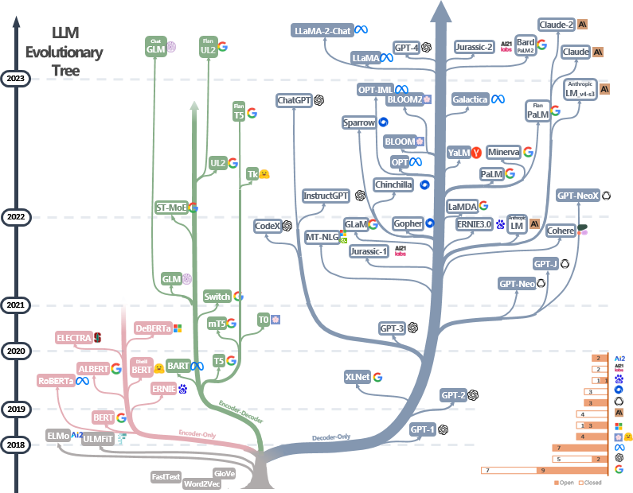
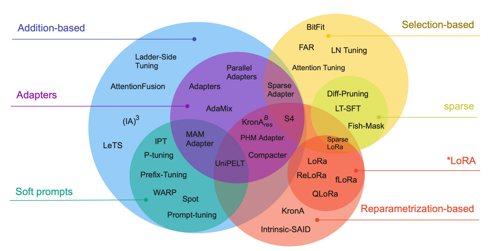

大语言模型（**L**arge **L**anguage **M**odel）在近年来呈井喷式发展。

自 2017 年特征提取器 [Tranformer](https://arxiv.org/abs/1706.03762) 发表以来（Transfomer 解读可参考 [这篇](https://jalammar.github.io/illustrated-transformer/)），LLM 主要有三条发展方向：

| 发展方向      | 特征            | 简述                                   |
| ------------- | --------------- | -------------------------------------- |
| [BERT](#BERT) | Encoder Only    | 自编码，适合做理解任务                 |
| [GPT](#GPT)   | Decode Only     | 自回归，适合做生成任务                 |
| T5            | Encoder-Decoder | 综合了上述两点的优势，参数暴涨但潜力大 |

图源：https://github.com/Mooler0410/LLMsPracticalGuide

## Attention 注意力机制

【待填坑-稀疏注意力】

https://spaces.ac.cn/archives/6853/comment-page-2?replyTo=21452

## Benchmark 评测集

[Open LLM Benchmark](https://huggingface.co/spaces/open-llm-leaderboard/open_llm_leaderboard)：Huggingface 上针对开源大模型的榜单。

经典的大模型数据基准列举如下，部分提供训练集用于微调，部分则仅提供测试集。

| 数据基准名称                                                 | 年份 | 测试集 | 简介                               |
| ------------------------------------------------------------ | ---- | :----: | ---------------------------------- |
| [**G**oogle-**P**roof **Q**&**A**](https://arxiv.org/abs/2311.12022) | 2023 |  448   | PhD 级别的物理、化学、生物多选题   |
| [**C**hinese **Eval**uation Suite](https://cevalbenchmark.com/index_zh.html) | 2023 | 13948  | 涵盖 52 个学科四个难度的中文多选题 |
| [**B**eyond the **I**mitation **G**ame **Benchmark**](https://arxiv.org/abs/2206.04615) | 2022 |  204   | 通过指标或程序化检验的多领域题目   |
| [**M**assive **M**ultitask **L**anguage **U**nderstanding](https://arxiv.org/abs/2009.03300) | 2020 | 14079  | 包含 STEM 和人文社科知识的选择题   |
| [**G**eneral **L**anguage **U**nderstanding **E**valuation](https://gluebenchmark.com/) | 2018 |  1063  | 包含九类自然语言生成的任务         |

## Concept 概念

**奶奶漏洞**（*grandma exploit*）：网友发现在和大模型对话时，如果要求其扮演自己已经过世的祖母，就可以绕开模型的安全护栏机制，套取包括 Win11 序列号在内的敏感内容。这个漏洞最早可追溯到 2023 年 4 月。

**思维链**（***c**hain **o**f **t**hought*）：要求模型在输出最终答案之前，显式输出中间逐步的推理步骤。CoT 是一种简单有效的 Prompt 技术，在复杂场景（如算术推理、常识推理、符号推理等）里效果很好。

**涌现能力**（*emergent ability*）：当模型规模在一定范围内（如 FLOPs 在 $10^{22}$ 以内），能力并没有随着规模的提升而显著提高；而当规模超过一个临界值时（尽管没有改变结构），效果会马上提升。

**幻觉**（*hallucination*）：LLM 生成看似合理但却虚假或有误导性的响应。目前普遍的看法认为，经过校准的语言模型必然会出现幻觉，而与 Transformer 架构或数据质量无关。

**缩放法则**（*scaling law*）：模型的性能强烈依赖于模型的规模（包括参数数量、数据集大小和计算量），最后的模型的效果会随着三者的指数增加而线性提高。由 Kaplan J 等人 2020 年提出。

**投机解码**（*speculative decoding*）：针对自回归解码（*autoregressive decoding*）推理时串行输出 token 的场景进行加速。投机解码是 *drafting* 和 *verification* 两个阶段的循环：先用一个独立小模型串行生成一定长度的 token 序列，再把序列的每个前缀都并行过一遍大模型，从第一个不能被大模型接受的位置重复上述操作。投机解码的本质是用并行算力换低时延，大模型的总推理量不变，但额外增加了小模型的推理量。

## Framework & Tools 框架和工具

大模型推理与服务框架

|      框架名      | 介绍                                                         |
| :--------------: | ------------------------------------------------------------ |
|    **AIBrix**    | 字节跳动基于 Kubernetes 的开源云原生推理系统，旨在解决大模型推理中的系统层挑战，如 GPU 弹性伸缩、长尾模型流量管理和多机推理编排。 |
| **ktransformer** | 清华大学与趋境科技联合开发的开源项目，旨在通过创新的 GPU/CPU 异构计算和稀疏矩阵优化技术，实现在消费级显卡（如 RTX 4090）上高效运行千亿级大模型。 |
|    **Ollama**    | 轻量级大模型推理框架，支持本地部署和快速启动，适合开发者快速测试和部署模型。 |
|    **SGLang**    | 高性能语言模型服务引擎，支持结构化生成、多轮程序化调用、RadixAttention 和压缩有限状态机解码，适合复杂代理任务和多模态推理。 |
| **TensorRT-LLM** | 英伟达官方推理引擎，底层 CUDA 内核优化，性能接近闭源极限，但代码可控性低，适合 NVIDIA 硬件专有场景。 |
|     **vLLM**     | 开源的高吞吐量推理引擎，最初基于 PagedAttention 技术优化显存利用率，支持动态批处理和长序列推理，性能优异且易于部署。 |
|  **llama.cpp**   | 专为 CPU 设计的高效机器学习推理库，影响深远，贡献了 GGUF 二进制模型文件格式。 |

深度学习框架

|      名称      | 介绍                                                         |
| :------------: | :----------------------------------------------------------- |
| **MindSpore**  | 华为开发的端边云全场景 AI 框架，支持动态图与静态图混合计算，内置分布式训练优化。 |
|  **PyTorch**   | Facebook 开发的动态计算图框架，研究者首选，生态丰富，支持即时编译。 |
| **TensorFlow** | Google 开发的静态图框架，支持大规模分布式训练与 TensorBoard 可视化。 |

应用开发与编排工具

| 工具名        | 介绍                                                     |
| :------------: | :----------------------------------------------------------- |
| **LangChain**  | 模块化 AI 应用开发框架，支持模型集成、记忆管理、代理控制，适合构建复杂工作流。 |
| **LlamaIndex**    | RAG 专用框架，支持私有数据索引与自然语言查询，优化知识密集型任务。 |
| **MetaGPT** | 多智能体协作框架，支持任务分解与分布式推理，适用于复杂逻辑推理场景。 |

分布式与通信库

|     库名      |                 支持语言                 | 介绍                                                         |
| :-----------: | :--------------------------------------: | ------------------------------------------------------------ |
| **DeepSpeed** |                  Python                  | 微软开源的分布式训练优化库，支持 ZeRO 优化、混合精度训练和大模型训练 |
|   **NCCL**    | C++ 和 Python（通过 PyTorch/TensorFlow） | NVIDIA的 集合通信库，用于多 GPU 和多节点的高性能通信，适合分布式深度学习训练 |
|  **Triton**   |              C++ 和 Python               | NVIDIA 的推理服务器框架，支持模型部署优化与动态批处理，提供高性能推理服务。主要用于 Python 和 C++。 |
|   **Gloo**    |      C++ 和 Python（通过 PyTorch）       | Facebook 开源的分布式训练通信库，支持 CPU 和 GPU，适合跨平台分布式训练。 |
|    **Ray**    |                  Python                  | Python 分布式计算框架，支持任务调度、分布式训练和强化学习，适合大规模 AI 应用。 |

## Hardware 硬件

#### 显卡信息

|   显卡    |  显存   | 带宽TB/s |  架构  | FP32/T | FP16/T  | FP8/T  | INT8/T |
| :-------: | :-----: | :------: | :----: | :----: | :-----: | :----: | :----: |
|   V100    | 16G/32G |   0.9    | Volta  |   14   | 不支持  | 不支持 |   62   |
| A100/A800 | 40G/80G |   1.99   | Ampere |  19.5  |   624   | 不支持 |  1248  |
| H100/H800 | 40G/80G |   3.35   | Hopper |   60   |  1979   |  3958  |  3958  |
|   H200    |  141G   |   4.8    | Hopper |   67   |  1979   |  3958  |  3958  |

#### 互联信息

PCIe（Peripheral Component Interconnect Express）：实现 AI 芯片（GPU/NPU）与 CPU 的高速互联协议。

+ PCI：并行共享传输，PIN 脚数量过多，总线共享，带宽不足，不支持热插拔，对时钟同步要求高。
+ PCIe：高速串行总线，采用 P2P 连接，支持热插拔，不需要外接时钟，速率比 PCI 有大幅提升。

|      PCIe 版本       |   1.0   |  2.0   |   3.0    |   4.0   |   5.0   |
| :------------------: | :-----: | :----: | :------: | :-----: | :-----: |
| $\times 1$ 单向带宽  | 0.25G/s | 0.5G/s | 0.985G/s | 1.97G/s | 3.94G/s |
| $\times 16$ 单向带宽 |  4 G/s  |  8G/s  | 15.8G/s  | 31.5G/s |  63G/s  |

NVLink：NVIDIA 开发的一种高速、低延迟的专有连接技术。
+ 优点：高带宽和低延迟；支持 GPU 之间直接进行数据通信。
+ 缺点：专有性，仅用于连接 NVIDIA；相比 PCIe，连接数量和扩展能力有限。

NVIDIA 集群网络 DGX 通信协议：节点内 NVLink，节点间 InfiniBand。
+ 节点内有 2 个 CPU 和 8 个 GPU。CPU 到 GPU 采用 PCIe 组网，GPU 之间采用 4 块 NVLink Switch 互连。
+ 节点间采用 Spine/Leaf/Machine 三层架构，两个节点通信通常会经过 3 次交换。

#### 卡间通信

假设有 $n$ 个设备，每个设备都持有一个长度为 $n$ 的向量。

| 名称          | 目标                                 | 实现                    |
| ------------- | ------------------------------------ | ----------------------- |
| AllReduce     | 将每个设备上的向量改为全设备均值     | ReduceScatter+AllGather |
| ReduceScatter | 维度 $i$ 在第 $i$ 个设备上求和       | 环状通信                |
| AllGather     | 将维度 $i$ 从第 $i$ 个设备广播到全局 | 环状通信                |

## Post-Training 后训练

**检索增强生成**（***R**etrieval-**A**ugmented **G**eneration*）：在生成过程中引入外部知识库（如文档、数据库），通过检索相关片段辅助生成，提升事实准确性。最初由 *Patrick Lewis* 于 2020 年发表在 [NIPS](https://proceedings.neurips.cc/paper/2020/file/6b493230205f780e1bc26945df7481e5-Paper.pdf) 上。

**微调**（*fine-ture*）：在预训练的大型语言模型基础上，针对特定任务或数据集进行进一步训练，通过较小规模的目标任务数据集使模型更好地适应特定任务。

**参数高效微调**（***P**arameter-**E**fficient **F**ine-**T**uning*）：即仅微调部分参数，适合于资源受限的环境或多任务学习。

+ 选择性方法（selective）：只微调原始 LLM 参数的子集。
+ 添加性方法（additive）：添加一些可训练的层或参数来调整基础模型。
  + 适配器（adapaters）：在基础模型中加入一些可调整参数的组件、模块来使模型适应下游任务。
  + 软提示词（soft prompts）：通过某种方式达到给输入加入提示词的效果，从而适应下游任务。
+ 重新参数化方法（reparameterization-based）：创建原始网络权重的新低秩转换来减少要训练参数。

图源：[Scaling Down to Scale Up: A Guide to Parameter-Efficient Fine-Tuning](https://arxiv.org/abs/2303.15647)

| 常见 PEFT 方法                                               | 概述                                                         |
| ------------------------------------------------------------ | ------------------------------------------------------------ |
| [**Lo**w**R**ank **A**daptation](https://link.zhihu.com/?target=https%3A//arxiv.org/abs/2106.09685) | 保持原有模型不变，对差值低秩分解： $W'_{d,d}=W_{d,d}+\Delta W=W_{d,d}+A_{d,r}B_{r,d}$ |
| [**Q**uantized **LoRA**](https://arxiv.org/abs/2305.14314)   | 将原模型权重量化为 4-bit 精度再应用 LoRA                     |
| [Adapters](https://arxiv.org/abs/1902.00751)                 | 在 Transformer 层插入小型神经网络模块，冻结原参数            |
| [Prompt Tuning](https://arxiv.org/abs/2104.08691)            | 在输入序列加入可训练的软提示（*Soft Prompt*）向量，训练参数非常少 |
| [Prefix-Tuning](https://arxiv.org/abs/2101.00190)            | 在 Transformer 层的 KV 矩阵前添加可训练前缀向量              |

## Products

全球基础大模型举例如下（专用于数学、编程等细分领域的模型不列入表格）：

| 时间 |   单位    |                             产品                             |       参数量 B       | 开源 | 上下文 KB |      特色      |
| :------: | :-------: | :----------------------------------------------------------: | :----------------: | :------: | :------------: | :------: |
| 2017.06  |  OpenAI   | [GPT-1](https://cdn.openai.com/research-covers/language-unsupervised/language_understanding_paper.pdf) |        0.117        | 否 |   0.5    |      |
| 2019.11  |  OpenAI   | [GPT-2](https://cdn.openai.com/better-language-models/language_models_are_unsupervised_multitask_learners.pdf) |        1.5        | 否 |    1     |      |
| 2020.06  |  OpenAI   |          [GPT-3](https://arxiv.org/abs/2005.14165)           |     0.125~175     | 否 |    2     |    |
| 2022.02  |  Google   |                            LamDA                             |    2, 8, 137    | 否 |          |      |
| 2022.03  |  OpenAI   |                           GPT-3.5                            |               | 否 |    4     |    |
| 2023.02  |   Meta    |      [LLaMA](https://arxiv.org/abs/2302.13971)      | 7, 13, 30, 65  |    是    |    2     |    |
| 2023.03  |  OpenAI   |          [GPT-4](https://openai.com/research/gpt-4)          |       1760        | 否 |  8, 32   |    |
| 2023.03  | Anthropic |                 [Claude](https://claude.ai/)                 |        93         | 否 |   100    |  |
| 2023.07  |   Meta    | [LLaMA2](https://arxiv.org/abs/2307.09288) |    7, 13, 70    |    [是](https://huggingface.co/collections/meta-llama/metas-llama2-models-675bfd70e574a62dd0e40541)    |    4     |          |
| 2023.08 | Alibaba | [Qwen](https://arxiv.org/abs/2309.16609) | 1.8~72 | [是](https://github.com/QwenLM/Qwen) | 8, 32 |  |
| 2023.11  | Anthropic |     [Claude2](https://www.anthropic.com/index/claude-2)      |        137        | 否 |   200    |  |
| 2023.12 | Google | Gemini |  | 否 |  |  |
|  2024.01  | Deepseek | [Deepseek MoE](https://arxiv.org/abs/2401.06066) |  16.4  | [是](https://github.com/deepseek-ai/DeepSeek-MoE) | 4 |   MoE    |
| 2024.01 | Deepseek | [DeepSeek LLM](https://arxiv.org/abs/2401.02954) | 7, 67 | [是](https://github.com/deepseek-ai/DeepSeek-LLM) | 4 | LLaMA |
| 2024.02 | Google | Gemini 1.5 Pro |  | 否 | 1000 | MoE |
| 2024.02 | Alibaba | [Qwen1.5](https://qwenlm.github.io/blog/qwen1.5/) | 0.5~72 | [是](https://huggingface.co/collections/Qwen/qwen15-65c0a2f577b1ecb76d786524) | 32 |  |
| 2024.03  | Anthropic |  [Claude3](https://www.anthropic.com/news/claude-3-family)   |  | 否 |   200    |  |
| 2024.04 | Meta | [LLama3](https://arxiv.org/abs/2407.21783) | 8, 70 | [是](https://huggingface.co/collections/meta-llama/meta-llama-3-66214712577ca38149ebb2b6) | 8 | LLaMA |
| 2024.05 | OpenAI | GPT-4o |  | 否 | 128 | 多模态 |
|  2024.05  | Deepseek |    [DeepSeek V2](https://arxiv.org/abs/2405.04434)    | 16, 236 | [是](https://github.com/deepseek-ai/DeepSeek-V2) | 32, 128 |   MoE    |
| 2024.06 | Alibaba | [Qwen2](https://arxiv.org/abs/2407.10671) | 0.5~72 | [是](https://huggingface.co/collections/Qwen/qwen2-6659360b33528ced941e557f) | 32, 128 |  |
| 2024.06 | Anthropic | Claude 3.5 |  | 否 | 200 |  |
| 2024.07 | Meta | [LLama3.1]((https://arxiv.org/abs/2407.21783)) | 8, 70, 405 | [是](https://huggingface.co/collections/meta-llama/llama-31-669fc079a0c406a149a5738f) | 128 |  |
| 2024.09 | OpenAI | GPT-o1 |  | 否 | 128 |  |
| 2024.09 | Alibaba | [Qwen2.5](https://arxiv.org/abs/2412.15115) | 0.5~72 | [是](https://github.com/QwenLM/Qwen2.5) | 128 |  |
| 2024.12 | Google | Gemini2.0 |  | 否 | 32->1000 |  |
| 2024.12 | Meta | [LLama3.3]((https://arxiv.org/abs/2407.21783)) | 70 | [是](https://huggingface.co/collections/meta-llama/llama-33-67531d5c405ec5d08a852000) | 128 |  |
| 2024.12 | Deepseek | [Deepseek V3](https://arxiv.org/abs/2412.19437v1) | 671 | [是](https://github.com/deepseek-ai/DeepSeek-V3) | 128 | MoE |
| 2025.01 | MiniMax | [MiniMax-01](https://filecdn.minimax.chat/_Arxiv_MiniMax_01_Report.pdf) | 456 | [是](https://github.com/MiniMax-AI/MiniMax-01) | 4000 | LinearAtt, MoE |
| 2025.01 | Deepseek | [DeepSeek R1](https://arxiv.org/abs/2501.12948) | 671 | [是](https://github.com/deepseek-ai/DeepSeek-R1) | 128 | MoE, RL |
| 2025.01 | OpenAI | GPT-o3-mini |  | 否 |  |  |
| 2025.02 | Anthropic | Claude 3.7 |  | 否 | 200 |  |
| 2025.03 | Alibaba | [QwQ](https://qwenlm.github.io/blog/qwq-32b/) | 32 | [是](https://huggingface.co/Qwen/QwQ-32B) | 128 | RL |
| 2025.04 | Alibaba | [Qwen3](https://arxiv.org/abs/2505.09388) | 0.6~32; 30, 235 | [是](https://huggingface.co/collections/Qwen/qwen3-67dd247413f0e2e4f653967f) | 32, 128 | 稠密/MoE |
| 2025.05 | Google | Gemini2.5 |  |  |  |  |
| 2025.05 | Anthropic | Claude 4 |  |  | 200, 1000 | 多模态输入 |
| 2025.08 | OpenAI | GPT-5 |  | 否 | 16, 32, 128 | 混合推理架构 |
| 2025.08 | Deepseek | DeepSeek V3.1 | 671 | [是](https://huggingface.co/deepseek-ai/DeepSeek-V3.1-Base) | 128 | 混合推理架构 |

## Optimizers 优化器

设 $J(\theta)$ 是待学习的函数和参数，$\eta,\rho$ 是优化器相关的超参数，角标 $t$ 是轮数（如 $\theta_t$ 为第 $t$ 轮更新后的参数）。

+ 记历史均值函数 $E_{\rho}(x_t)=(1-\rho)x_t+\rho \cdot E_{\rho}(x_{t-1})=(1-\rho)(x_t^2+\rho x_{t-1}+\rho^2x_{t-2}+\dots+\rho^tx_0)$。
+ 记 $g_t=\nabla_{\theta}J(\theta_{t-1})$  为第 $t$ 轮计算出的梯度。

| 名称                                      | 公式                                                         | 简要描述                   |
| ----------------------------------------- | ------------------------------------------------------------ | -------------------------- |
| **S**tochastic **G**radient **D**escent   | $\theta_t=\theta_{t-1}-\eta \cdot g_t$                       | 随机梯度下降               |
| **M**omentum                              | $\theta_t=\theta_{t-1}-E_{\rho}(\eta \cdot g_t)$             | 维持惯性 $\rho$ 以抑制震荡 |
| **N**esterov **A**ccelerated **G**radient | $v_t=\rho v_{t-1}+\eta \nabla_{\theta}J(\theta_{t-1}-\rho v_{t-1}) \\ \theta_t=\theta_{t-1}-v_t$ | 先惯性走再梯度修正         |
| **Ada**ptive **Grad**ient Algorithm       | $G_t=G_{t-1}+g_t^2 \\ \theta_t=\theta_{t-1}-\frac{\eta}{\sqrt {G_t+\epsilon}}\cdot g_t$ | 学习率有加权修正           |
| **RMSprop**                               | $\theta_t=\theta_{t-1}-\frac{\eta}{\sqrt{E_{\rho}(g_t^2)+\epsilon}}g_t$ | 缓解后期学习率过小         |
| **Adadelta**                              | $\Delta_{\theta,t}=\sqrt{\frac{E_{\rho}(\Delta_{\theta,t-1}^2)}{E_{\rho}(g_t^2)+\epsilon}}g_t \\ \theta_t=\theta_{t-1}-\Delta_{\theta,t}$ | 学习率调整为自适应         |
| **Ada**ptive **M**oment Estimation        | $\theta_t=\theta_{t-1}-\frac{\eta}{\sqrt{E_{\rho_2}(g_t^2)+\epsilon}}E_{\rho_1}(g_t)$ | RMSprop+Momentum           |

## Quantization 量化

大模型量化指的是把参数以更低的参数存储，起到节省显存和加速运算的作用。

[罗西的思考](https://home.cnblogs.com/u/rossiXYZ/) 有两篇比较全面的总结：[大模型量化基础](https://www.cnblogs.com/rossiXYZ/p/18889724) 和 [大模型量化方案](https://www.cnblogs.com/rossiXYZ/p/18916637)

#### 量化理论

【待更新】

#### 量化算法

**R**ound-**T**o-**N**earest：把原始数据均匀量化。

+ 非对称量化 Affine Quantization：均匀映射到 $[-2^{k-1},2^{k-1})$ 或 $[0,2^k)$ 上。
+ 对称量化 Scale Quantization：均匀映射到 $[-2^{k-1},2^k)$ 上，原始数据的零点被固定为量化数据的零点。

$$
\Delta_{asymmetric}=\frac{w_{max}-w_{min}}{2^k-1}, \quad \Delta+{symmetric}=\frac{\max(|x_{min}|,|x_{max}|)}{2^{k-1}-1} \\
quantize(w_i)=\frac{w_i-w_{min}}{\Delta}, \quad dequantize(q_i)=q_i \cdot \Delta+w_{min}
$$

**G**radient-based **P**ost-**T**raining **Q**uantization：通过梯度优化找到量化误差最小的权重映射。
$$
\min_Q ||W-\hat W||^2_F \quad \text{or} \quad \min_Q ||XW-\hat XW||^2_F
$$
AWQ【待更新】

#### GGUF 量化工程

**Q**X**_**Y：**传统的线性量化**。按每 $32$ 个数据聚合成块量化，`X` 是量化后的位数，`Y` 是 $0/1$ 用来区分是否是对称量化（ `type-0` 只维护 `block_scale` 来放缩值域，而 `type-1` 额外维护 `block_min`）。

+ `Q4_0` 对每 $32$ 个 4-bit 数据要额外存储一个 16-bit 的 `scale`，均摊后是 4.5-bit。
+ `Q4_1` 对每 $32$ 个 4-bit 数据要额外存储两个 16-bit 的 `scale` 和 `min`，均摊后是 5-bit。

**Q**X**_K：双层线性量化**。`X` 是量化后的位数。按每 $16/32$ 个数据聚合成小块进行非对称量化，再把每个块辅助变量（`scale` 和可选的 `min`）聚合成超块再次量化。每个超块固定包含 $256$ 个数据，这样维护非 2 幂次的量化比特比较方便。`K` 后面可以加上后缀：`S` 表示所有张量均使用 `QX_K`，`M` 表示模型里混合使用不同的 `QX_K`。

+ `Q3_K_S`：所有张量均使用 `Q3_K`。
+ `Q3_K_M`：`attention.wv` 、`attention.wo`、`feed_forward.w2` 里张量使用 `Q4_K`，其余张量使用 `Q3_K`。
+ `Q3_K_L`：`attention.wv` 、`attention.wo`、`feed_forward.w2` 里张量使用 `Q5_K`，其余张量使用 `Q3_K`。
+ `Q4_K_M`：`attention.wv` 和 `feed_forward.w2` 里一半的张量使用 `Q6_K`，其余张量使用 `Q4_K`。
+ `Q4_K_M`：`attention.wv` 和 `feed_forward.w2` 里一半的张量使用 `Q6_K`，其余张量使用 `Q4_K`。
+ `Q8_K`：按每 $256$ 个模型聚合成块量化。注意其仅用于中间计算过程的量化，不用于模型的存储。

| K系列具体类型 | 小块数据量 | 超块含小块数量 |   小块辅助量    |             超块辅助量              |                          均摊比特数                          |
| :-----------: | :--------: | :------------: | :-------------: | :---------------------------------: | :----------------------------------------------------------: |
|     Q2_K      |    $16$    |      $16$      | $2 \times$4-bit | $2 \times$16-bit / $1 \times$32-bit | [2.625-bit](https://github.com/ggml-org/llama.cpp/pull/1684#issuecomment-3263707425) |
|     Q3_K      |    $16$    |      $16$      | $1 \times$6-bit |          $1 \times$16-bit           |                          3.4375-bit                          |
|     Q4_K      |    $32$    |      $8$       | $2 \times$6-bit | $2 \times$16-bit / $1 \times$32-bit |                           4.5-bit                            |
|     Q5_K      |    $32$    |      $8$       | $2 \times$6-bit | $2 \times$16-bit / $1 \times$32-bit |                           5.5-bit                            |
|     Q6_K      |    $16$    |      $16$      | $1 \times$8-bit |          $1 \times$16-bit           |                          6.5625-bit                          |

**IQ**X：**基于 QuIP 的更极致量化**。保留了 QX_K 中的分层分块思想，小块聚合 $32$ 个数据，超块聚合 $8$ 个小块。借鉴了 QuIP 里的 sign-flip 和 `E8` lattice 技术，使得均摊比特数更接近 `X` 原值。

+ 以 [IQ2](https://github.com/ggml-org/llama.cpp/pull/4773) 为例，均摊比特数只有 2.0625-bit。多出来的部分就是超块的 16bit `scale`，即小块里的量化数值和小块之间的 `scale` 完美地均摊到了 2bit。对于小块里每 $8$ 个量化值：要求正负符号数量为偶数（如果不符合要求就选择 $wi^2$ 小的数据翻转符号，其中 $i$ 来自静态统计得到的重要性矩阵），这样用 7-bit 就可以来表示这 $8$ 个量化值的符号；这 $8$ 个量化值有 $6531$ 个 `E8` lattice，不考虑符号是 $3281$ 个，按频率选择 $256$ 个覆盖度最大的点，这样需要 8 bits 来表示 codebook 索引。每个小块里多出来的 4-bit 正好表示 `scale`。

## Training 训练

**GPipe** by Google：流水线并行，将整个模型按顺序划成若干段，各自装入不同的设备。

+ 适用于包含 CNN 在内的所有神经网络模型，但是切割时可能会不规则。
+ 每个设备仅保留当前流水线上全量中间态，反向时要重新跑一遍前向计算。加入这个额外前向计算的用时，相比原来正常的正反向的总用时，只多 $33\%$（直觉上是多 $50\%$）。
+ 需要进一步引入 micro-batch 来提高设备的利用率，设备内的批数量非常大。

**megatron-LM** by AWS：按矩阵的行或列拆分至多个设备，每层结束后做一遍 All-Reduce。本质是一种张量并行

+ AllReduce 做完前无法计算下一层，通信要求更高一些。
+ 理论上为 transformer 结构定制（包括 Attention、MLP、输入输出）， 切分能够比较规则。

**ZeRO** by Microsoft：一系列能够节省显存的工程优化。

+ ZeRO-DP-1：将整个模型里优化器（如 Adam）所用到的浮点数拆分，每个设备仅保留自己的一部分。
+ ZeRO-DP-2：再对整个模型里的梯度 $g$ 拆分，每个设备仅保留自己的一部分。
+ ZeRO-DP-3：再对整个模型的的参数 $\theta$ 拆分，每个设备仅保留自己的一部分。
+ ZeRO-R：对模型输入、内存碎片等做进一步的工程优化。

**Flash Attention** 包括 V1、V2、V3 三代，针对 Attention 做工程优化，其中 V3 只支持 Nvidia Hopper 架构。

[Flash Attention V1](https://arxiv.org/abs/2205.14135) 的主要思想如下：

+ *Kernel Fusion*：合理利用 SRAM 和 HBM 的带宽和空间差异，减少和 SRAM 的数据传输。 
+ *Backward Recomputation*：正向计算时不存储中间过程矩阵 $S=QK^T$ 和 $P=\mathrm{softmax}(S)$，反向时重算。
+ *Softmax Tiling*：分块计算 $\mathbb{softmax}$ 里的数值，解决整行数据无法同时放入 SRAM 的问题。

每个块 $x$ 里维护三个结果 $m(x),\mathbf{f}(x),l(x)$，则 $\mathrm{softmax}(x)=\mathbf{f}(x)/l(x)$。合并时：
$$
m(x)=\max(m(x_1),m(x_2)) \\
\mathbf{f}(x)=[e^{m(x_1)-m(x)}\mathbf{f}(x_1),e^{m(x_2)-m(x)}\mathbf{f}(x_2)] \\
l(x)=e^{m(x_1)-m(x)}l(x_1)+e^{m(x_2)-m(x)}l(x_2)
$$