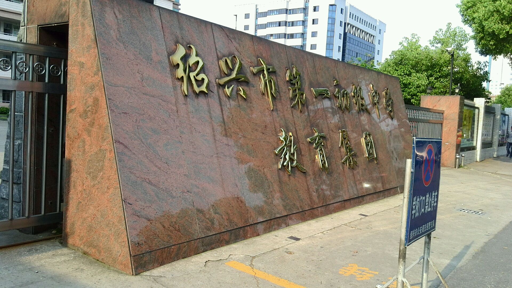
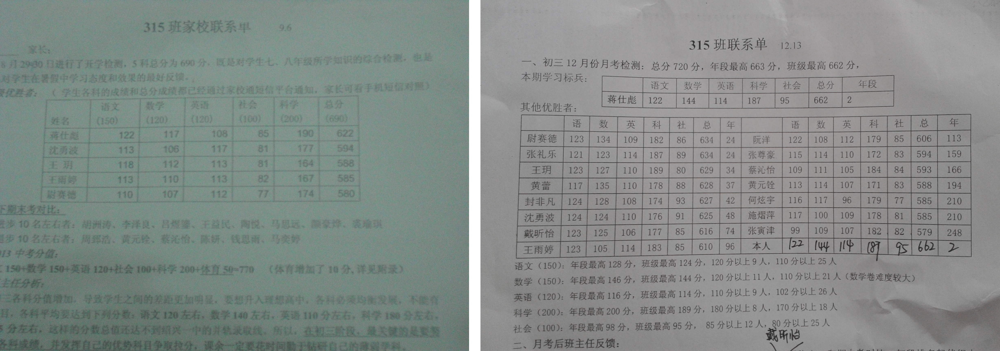
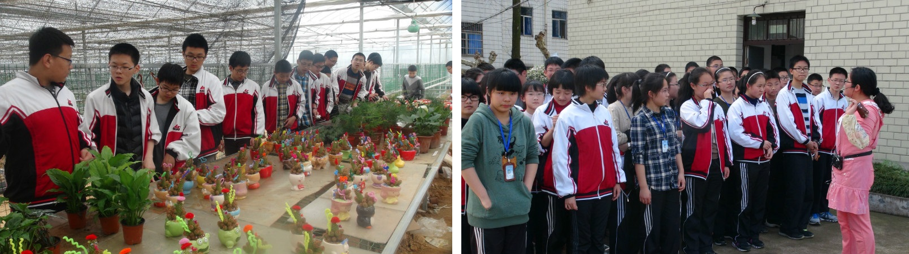
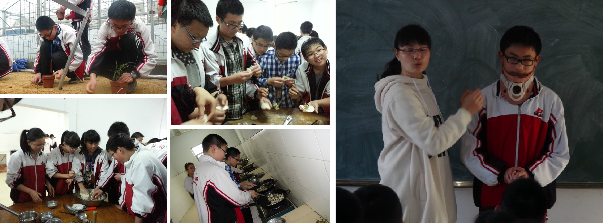
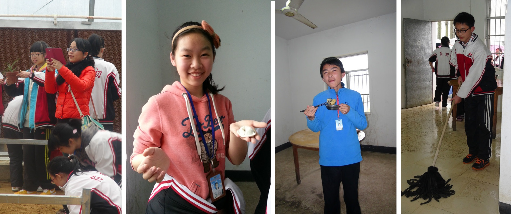
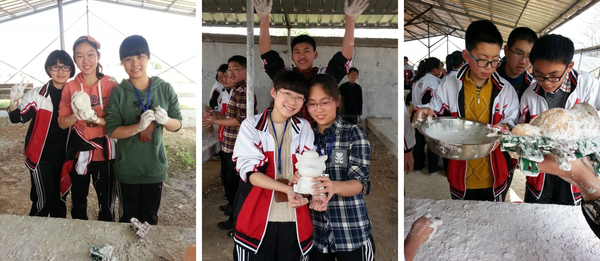

## 缘定绍初

我的初中原名是绍兴一中初中部，最初由绍兴市北海中学、府山中学合并而成。后来为了落实九年制义务教育，强调初高中的分离，就改名为 **绍兴市第一初级中学教育集团龙山校区**。教育集团还有一个镜湖校区。

绍初位于越城区市中心，城市广场的对面，紧挨着原市府大楼，周围建筑密集，门口的车道常年堵车。附近有一条护城河，观赏性还是很强的——可惜那会儿满脑子都是赶路和学习。

如果按照小升初考试的常规途径，我当时只能去上虞市内（当时上虞市还没有改成区）的初中。上虞市里最厉害的中学是春晖中学，有俗语 *北有南开，南有春晖*，是一个十分不错的选择（升入大学的时候我特意问了一个来自南开中学的同学，他坦言并没有听说过这个俗语哈哈哈）。

不过我最终是通过了绍初龙山的借读生考试，以 **借读生** 的身份进入绍初龙山。小学到初中为什么跨区读书呢？这中间还有段机缘巧合。小学五六年级信息学比较强势（其实那会儿就是学学选择、循环、分支结构，算法设计主要依靠数学功底），我不希望这个特长从此失去了。春晖虽是上虞人的不二选择，但是春晖有关信息学竞赛的培训寥寥无几。信奥教练李升东老师告诉我，绍兴一中是全国有名的信息学强校，他还经常被叫去培训。于是我问到了绍兴一中陈合力教练（也即我高中的竞赛教练）的电话，打过去毛遂自荐。交流了半天，我才发现陈老师在高中部任职，我们之间还隔着一个初中。她建议我先进入绍兴一中初中部学习，不管是竞赛特招还是考入高中都很方便。

当时跨市读书需要参加借读生考试，绍初只招 $50$ 个学生。我妈拉了我、赵炳州和高佳妮一起去考，考语文和数学。我凭借着数学竞赛的功底一举考了第一名（后来教导主任告诉我，我数学考了 $99$），另外两个同学也都考上了。高佳妮妈妈嫌路太远不方便，遂放弃了资格，还是选择春晖。最后只有我和赵炳州决定留在绍初，这就开始了跨市上学。高佳妮在高考时和我同分（$672$），本科就读于上财金融，保研至复旦法学，有种凛然生威的感觉。

除了赵炳州，没有任何的小学同学基础，刚上初中的时候蛮不适应。在家长的强烈要求之下，学校把我（$15$ 班）和赵炳州（$11$ 班）划到了同一个寝室。这个模式我还是很喜欢的：白天我们分头行动，在各自的班级里融入新的生活（赵炳州是 $11$ 班的班长，我则是无所事事的 $15$ 班副班长），晚上我们则一起自习一起休息。从家到绍初路途较远，周末往返十分艰辛。刚上初中那会，周一凌晨我们就要在上虞的公交车站碰头，先坐一班城际客车（$30$ 公里，票价 $10$ 元，一小时左右）抵达绍兴汽车东站，再转绍兴的市内公交 $37$ 路（半小时左右）。为了能让我更方便地往返，我妈在东湖风景区边上的 **龙骧园** 给我租了房子，这样我上学就只需坐 $37$ 路即可抵达学校。

赵炳州为人和蔼大方，所以深得 $11$ 班同学们的拥戴，对我也是有求必应。例如，刚升初中时绍兴市举办了第一届“智能少年”评比活动，我返回小学求助李老师拍摄视频，其中还把赵炳州拉来当我的陪演哈哈。不过随着初中高中年级的提高，我俩的交集也越来越小，我很是遗憾和自责。小赵本科考入重庆大学，如今留校读研，顺风顺水。

## 绍初简介

绍初是一个很“传统”的初中，奉行”课内学习至上“的思路。体育活动课稍有阴雨便改自修，重复性作业很多。学校还严格落实了 **平行班制度**。初中开学前有一个分班考试，按排名顺次把学生安排在不同的班级。这种制度虽然增加了教育公平性，却严重损害了优秀学生的竞争和交流的机会。回首过往，小学教育给我打下了丰厚的艺术底蕴和强大的竞赛基础，但初中的平均主义、刻板学习，却大大浪费了我的才能，陷入了“课内学习”的陷阱。

绍初教师的核心目标就是把学生都送入高中部。根据往年经验，绍初前 $250$ 的学生能考入绍兴一中，而三四百名、五六百名的学生会顺次进入稽山中学（俗称二中）和高级中学（俗称三中）。$250$ 这道线可谓是学校的 **生命线**，月考期末考过线的学生也被“尊称”为 $A$ 类生。每次大考后，学校大楼梯前就会摆放着大红的 $A$ 类生海报。初一初二只有期中和期末有全校排名的大考，初三则每月都会组织月考。

绍初还有一个 **量化考核** 制度。作业拿了 $A$ 就加分、上课被点名表扬加分，不交作业或者不及格就扣分、升国旗讲空话被抓住了就扣分，诸如此类。每个班还会有具体的量化考核细则，最后累加的分数即为期末三好学生、思想政治考核等的重要指标。

受绍初氛围的影响，学校里的学科竞赛开展得并不旺盛，因为竞赛之于初升高“没有帮助”。背负着小学带过来的信念，我还是硬着头皮和班主任请示去搞 $\mathrm{OI}$，实则三天打鱼两天晒网。因为住校不能携带电脑，我只能偶尔在晚自修教室里用笔写写代码（离谱）。到初二初三比赛前夕，也只能午自修时去机房练练手，再不济自修课请个假。

周围无论是老师还是同学，似乎都一门心思地在学习。我也不甘示弱，在按时完成所有课内作业的同时，又额外买了好多“课外练习”（配套课程章节但提升难度的习题册），开启了疯狂刷题的模式。刷来刷去，极大地提高了我对课内知识的熟练度，助我成为应试教育里成功的机器人（现在看来十分不值得）。

上面两张图是我毕业后的学校新风貌。左图摄于 $2017$ 年，右图是 $2021.10$ 从严老师的朋友圈偷的。

## 升学背景

除了中考外，我们那年还有三种绍初保送绍兴一中的方式，按时间顺序如下：

+   信息学竞赛保送制度。托陈合力老师的福，获得 $\mathrm{NOIP}$ 普及组一等奖的整个绍兴大市的学生直接保送，寒假过后就去新学校报道，潜心多学半年竞赛。也因为这个制度，机房党里不仅有越城区的兄弟，还有来自上虞的任飞宇，来自诸暨的叶珈宁，来自新昌的赵凯兴、叶烨明。
+   在我们那年一中额外开设了一个 **创新班**，对标信息学竞赛，目标是为一中培养除信息学外各学科的竞赛学生。一中在三月份组织选拔，各校推荐并集中考试，记得绍初通过率 $13/15$，我班王雨婷成功入选成功考入。
+   推荐生制度，市里所有初中都会配到一些推荐生名额（有些初中总共只有两三个名额，我们学校每班两个），绍兴一中会在每年的五六月（早于中考）组织通过率很高的推荐生考试，过线的学生直接保送。我们班的两大高手尉赛德王玥也顺利入选顺利考入。

不客气地说，这三个升学方式我都能手到擒来。不过我在初三上的 $\mathrm{NOIP}$ 如愿以偿考了 $360$ 分，提前通过方法一进了一中。无缘在中考中崭露头角，现在想来仍有遗憾。

## 我在 15 班的那些日子

分班考我考了全校第二，被分到了 $15$ 班。开学第一天，班主任戴雅芳问我想不想当班长（分班考第一的大多都当了班长），喜欢摸鱼的我表示：班长抛头露面事情多，我的能力也不强，不如做个副班长吧！说是副班长，其实更像是学习委员，负责我班的量化考核统计。每位课代表从老师那儿拿来批改好的作业本后，首先把一摞 $A$ 和一摞 $C$ 的本子交到我这登记，待我一一计分结束再分发下去。以周围单位再把每个同学的分数小结一下。经过反复的练习，我能快速对应每位同学的名字和学号，名单表也是倒背如流。经过一周一月一年的积累，我和几个同学的分数往往遥遥领先，而那些作业“老赖们”则可用绝对值和我一战。现在想来，这个量化考核登记制度纯粹是浪费时间；如果真要说有什么好处的话，它客观上提高了我对数字的敏感程度。

初中养成了 **写日记** 的习惯。小学曾多次心血来潮，但是坚持不了几天就放弃了；没想到初中一直坚持了下来，写满了几本厚厚的日记本。在漫长的刷题生涯中，每天晚上写日记的十几二十分钟，让我的灵魂得以休憩。

我有一个癖好是 **收集好题**。老师们会官方性地要求同学记录错题，但是在我看来那都是没用的形式主义。我的这个行为之所以称为“癖好”，是因为我发自内心的喜欢，而且到了近乎疯狂的地步。在学期初我会买好几本好看的大本子，按不同学科分门别类地标号。如果我在做题过程中遇到了有趣的、掉入陷阱后做错的、值得珍藏的题目，就会一五一十把它记下来（粗心看错、计算出错等自然不记录）。有些数学题包含复杂的图画，我也会一板一眼地把他画在本子上，画完后一阵激动。后来收藏癖好越来越严重，我甚至会从试卷里剪下错题贴在本子里。

初一上和初一下的期末考均拿了 **年段第一**。这真是太虚幻了，因为我在考前没有任何压力和目标，考完后对自己的评价也是平平，没想到分数算起来居然这么高。可能是赢在各科的均衡稳定吧。最秀的还是初三的某次月考，这次估分不错排名却掉到了二十，查了查科学的卷子发现老师给我漏加了二十分，加了后一跃而上变成了年段第一。当时从教务处出来时我满脑子想的都是：可惜原先的排名早就公布了，各个班的老师表扬年段前十时没有我的份啦好亏。总结整个初中的大考生涯，年段第一拿过几次，前十基本没掉出过，最差的排名是 $48$ ——这个名次我记得深刻，那时候我刚冲完 $\mathrm{NOIP}$ 回来就月考了，好多古诗词都还没背，做题做得一塌糊涂。

我获得过一次周一早上国旗下讲话的资格。努力想写出一篇不落俗套的文字，奈何文笔太差，被团委老师修修补补好几次。全文大意是，大家在学习之余要培养自己的兴趣爱好，多感受一下生活，钓鱼养花运动之类的。

班主任在每周五会发“家校联系单”，列出各科的周末作业。更重要的，最近考试名列前茅的同学都会按顺序印在上面，连同每科的详细分数，供学生和家长研究。名单长度也是很有讲究的：如果是学校的大考，那就把我班 $A$ 类生的同学都印上去；如果是班级的小考，那就划到前 $15$ 左右。无论发挥好差与否，我总是稳居第一，所以每周五发联系单时总是美滋滋的。前三名的成绩都很稳定，一般是我、尉赛德和王玥。那时我傻呵呵的不以为意，有一次和阿德闲谈时候却发现他看得很重——他认为这是靠他的能力和毅力才能稳居第二，所谓第一、第二、第三，都是要严格区分的。到了初三，王雨婷的成绩越来越稳定，在创新班资格推荐的时候居然反杀前两位，提前进入了绍兴一中。随后阿德和王玥也通过推荐生顺利和我会师。下面两张图是翻出自照片库。

初三上学期确定保送后，我立即催我妈买来最豪华的毕业纪念册（然而她只是随便买了本 555）分发给同学。时任班主任的严丽卿发现后凶巴巴地说：这样的行为会影响中考，希望这是我看到的最后一次，中考后随你们去传！我心中窃喜：还好饶过了我这一次——我现在下手能获得大家高质量的回复，等六月毕业了漫天都是留言册。作为一个性情中人，我还花了很久的时间，用另一本纪念册“逆向”对每个同学写了我想说的话，一一分发给每个同学。我已经提前把它们拍成照片存在自己的相册里了，希望日后能回忆起这段情谊。

我第一次参加初中同学小规模聚会是 $2021.07.04$ 中午，由张尊豪组织和发起，来了十多个同学。男孩子们大多没啥变化，女孩子们化妆水平变厉害了（只能认出一半了）。第二次参加聚会是 $2023.1.26$ 中午，地点定在人民医院旁边的“古城北大院”。算是我出的主意，张尊豪和沈勇波组织发起，坐满了整整一桌。席间大家都有点拘束。可惜下午我要赶高铁，好不容易等人凑齐后我就急匆匆地打车走了，走的时候答应大伙儿下次我请客。

## 林副校长和住宿部

在分管住宿的林萍华副校长的带领下，学校里形成了一个独特的团体——**住宿部**。三个年段所有住校生统一接受住宿部早晚的管理。这个神奇的地方，培养了我的能力，孕育了我友情，也承载了我初中生活的很多回忆。

起床时间约摸是 $6:20$，洗漱吃饭， $6:40$ 左右开始早自习，到个七点开外再放我们回各自的班级里。严格来说，在住宿部的早上是真正的“早自习”，因为你可以自由支配你的时间；回到班里会进行新一轮的“早自习”，但该早自习隶属于某文科课程（比如周一升国旗提早上课，周二周四属于英语，周三周五属于语文）。勤快点的文科老师会在早自习直接进行听写等任务，以节约宝贵的上课时间。正常情况下，班主任会在 $17:00$ 解放整个班（隔壁班主任凶起来时拖到 $18:00$ 也很正常）。住宿部晚自修时间大致是 $18:30-21:30$，熄灯时间是 $22:15$。

林校长很注重早晚自修的质量，专门为我们申请了几个空闲的大教室。这些教室本来是作为月考、期中期末考的考场，座位众多，而且一桌一凳严格分开，是自修的绝佳之处。早晚都会有生活老师维持大教室的秩序，其中晚上要求“只能听到笔刷刷刷的声音和翻书的声音”，早上要求“大声朗读语文和英语的课程内容”。大教室里是禁止吃零食的，因为林校长认为“带了零食，分不分给同学都很纠结，会影响学习的专注”。遗憾的是，义务教育要求学生就近上学，我们这一届之后再无住校生。林校长后来在寝室楼的 $-1$ 楼装修了几个小房间，作为新的自习场所。

林萍华老师很关心我们的成长，是一个刚柔并济、刀子嘴豆腐心的老师。每当她出现在晚自修教室或者熄灯后的寝室外面的时候，就会有一股“杀气”传来——同学们大气也不敢出。她还会每隔半学期（在期中/期末考出年段排名后）召集所有住校同学开一个会议。会议上她会依次念每位达到 $A$ 类生的同学的名字，表扬和批评所进步和退步的同学，也会请一些同学来分享学习经验。我的成绩是年段翘楚，所以经常期盼着盛会到来哈哈。犹记得初三某次月考，前几科我稳稳拿下，准备接受林校长“例行”表扬，结果科学这门 $200$ 分的课被同为住校生的万丹华反杀（他取得了惊世骇俗的满分），最后他年段第一，我落在了年段第四。自然，本次是万同学上台发表感想，我在下面咬牙切齿“原来住宿部还有这个人”。

我还记得一次特殊的住校生会议。郭雨学长高我两级，也是搞信息学的。他在初三的时候拿下了普及组一等奖保送一中，在临行前林校长把他叫来给住校的大伙儿分享经验。讲完后，陪着林校长的旁白“郭雨学长要去绍兴一中参加新的培训，时间紧迫，大家掌声相送……”，他奔跑着出了门——那场景帅呆了。

宿部的教室里汇集着来自各个班级的同学，成为了一个情报交换的场所。谁班老师说明天考试取消，谁班同学英语作文只扣了两分，教导主任说成绩要过两天才会公布……绍初的学科老师一般都是教两个班的，我们还发现了一个很有趣的现象：老师都是 **跨班夸人** 的。比如，严丽卿是我班班主任的同时，也兼任 $4$ 班的英语老师。她在我班大肆宣传 $4$ 班的车宇超同学天资绰约又肯用功，英语作文写得滴水不漏；而我在住宿部的“驿站”里从 $4$ 班万丹华那儿听到的是：$15$ 班的蒋同学不光英语好，其他各科也都稳稳当当，值得你们学习。

住宿部团体小而紧密，容易出现很多“潮流”。比如扳手腕吧，起因可能是我和一杰一次下课的简单试水，到后来是整个教室热闹哄哄的扳手腕比武比赛，最后我们还在寝室里进行各种“加赛”。

## 住宿部的好兄弟们

我和小赵被打包塞到 $8$ 班同学那儿，室友是黄鹤、朱思程和彭陈果。黄鹤这名字太好记了，那时正要背一句古诗“昔人已乘黄鹤去”，我们经常拿来调侃他；彭陈果介绍自己时说的“盆子、橙子、果子“也让我印象深刻。

寝室的夜间谈话自然是必须的。躲生活老师有个窍门，刚熄灯那会要屏息凝神，待脚步声巡视两圈忽的远去后再开始聊天。少的时候随意说点闲话，激动时半小时一小时也是家常便饭，最后不知谁先停了口大家才沉沉睡去。

$8$ 班同学给我最大的印象就是“调皮会玩”。左边寝室也全是 $8$ 班的，他们经常凑一块捣鼓一些有趣的事情。 比如，厕所分配一直是寝室的大问题，有人洗澡洗半天也不出来，他们就掏出用来听英语录音的录音机，录了一段“xxx 你快出来”挂在寝室的门把手上。或者林意力同学从家里带来一个功能多样的苹果手表，深夜给大家放鬼故事听。

我 **最铁的哥们** 当属黄一杰了。他是一个诙谐、乐观、正义、敢爱敢恨的好男孩，有自知之明，懂得长远规划，也会适当偷懒。初一的时候一杰的个头还比我和小赵小一些，发育后倏地超过了我们，嗓音也雄浑了不少。一杰喜欢收集各种信息，我们总是聚在一起煞有介事地交换情报。学习上大家也相互扶持相互勉励，今天我借你笔记，明天你考我一道数学难题。一杰很擅长说话讲故事，空闲时我们更是胡吹海喝。犹记得保送后和他分别的那晚，我和一杰依依惜别。虽能相聚一中，但未来肯定是聚少离多，两人的眼泪都夺眶而出。

前段时间刚和一杰见面，也是高中毕业后的第一次见面。他本科在浙财读会计，考研发挥很好，好像上了华师（记得他说超常发挥实际能上复旦）。一杰还是和以前那样，健谈，豁达，幽默，规划有致。

我妈一个高中同学的孩子也就读绍初，叫做陈佳禄。他在 $16$ 班，也是住校生，和我们的关系也很紧密。更神奇的是，陈佳禄妈妈竟然成功应聘为绍初的生活老师，在晚间管理我们（~~照看我们的生活~~）。

## 我的师长们

初一初二的班主任是戴雅芳老师，教语文。初一第一次升旗的时候，戴老师坏笑着和我说：“呐，国旗下讲话的这个就是击败你的全校第一的钟思骋，你可要报这个仇哦。钟思骋是 $7$ 班班主任的儿子，果然是将门无犬子。在和他为数不多的几次交流中，我能感觉到他深深的书卷气息和文化涵养，以及对周边现实的批判和厌恶。

初一初二的科学老师是朱亚飞老师。记得有一次课后作业的最后一题，要猜测氯化钠这种物质——结果大部分同学都直接写上了“盐”。所以朱老师在课堂上大发脾气，强调盐和氯化钠的差异性。我那时很不解：既然朱老师能理解我们在表达什么，为啥还怎么较真？后来我才知道，“盐”是初中科学（化学）里的重要专有概念。朱老师有个儿子也在绍初读书，比我第一节，听说成绩也很不错。哈哈每次去办公室她都催儿子向我学习。

数学一直由孔荣海老师授课。孔老师年级比较大， 是一个稳重、教学经验丰富的老师。记得入学第一课上他提问：“大家知道要怎样学好数学吗？”我那时心里暗想，小学我学得可随意了奥数还那么好，所以哪有什么章法可循？不过为了配合老师说点场面话，我呼啦一下举手发言：“我觉得首先要上课认真听讲，特别是记好笔记。”（其实小学数学课我从不记笔记）。没想到孔老师没有顺接我的话，而是说：“认真听讲是要的，记不记笔记因人而异”。哈哈原来我弄巧成拙了，尴尬。在以后的数学课上，孔老师经常会在比较难的问题上找我回答“救场“。

初一初二的历史与社会老师姓金，是一名很有趣很和蔼的老师。他不喜欢教书本内容的条条框框，上课完全像是在讲故事，对历史的讲解尤其动听。但是上课的强势必然会带来应试的劣势，隔壁班已经纷纷在背答题八股文了，他还在逼真地给我们还原八国联军，导致我班的历史与社会成绩一直处于年段倒数。班里同学对他的评价褒贬不一。临别时，他很遗憾地对我们说：自知继续带我们会影响大家的中考成绩，替换成别的专业丰富的老师。

初三有个老师的大换血。班主任由 **毕业班名师** 严丽卿任。严老师教英语，和温柔的戴老师相比，她更凶狠一点。这里的凶狠并不指的是隔壁 $16$ 班傅佳琴老师那般凶神恶煞，而是刚柔并济恩威并施，把 $15$ 班的同学们管教得服服帖帖。我记得我们班在年段里一直处于中游偏下的水平，但是在中考中发挥异常出色——这和严老师的辛苦和管教有方是分不开的。严老师曾对好几届带过的学生（包括我们）说：“当班主任太累了，你们肯定是我带的最后一届了。”我升入高中的时候听说她又带了新的班级，哑然失笑但是意料之中。

语文老师由茹慧娟老师担任。她总是要求我们在做语文阅读理解的时候，在原文对应位置划线。

科学老师由科学教研组长陈建英老师带领。记得初二升初三的回头考试，我科学考了全班唯一的 $190$，陈老师很是喜欢，并向严丽卿强烈推荐我，于是我突然做上了科学课代表。其实只是一个待了半年的课代表，遗憾。陈老师给我的印象就是专业和稳重。我班的黄可特别喜欢陈老师，每次我抱着作业去办公室总能看到她俩谈天。

历史与社会老师同样由教研组长虞莉雅老师带领。虞老师和之前的金老师完全是两个风格，精通应试教育，而且能以一种较为灵活的方式教大家八股文，迅速提高了班级的做题能力和水平。名不虚传！我感觉虞老师和严老师的风格比较接近，都是学生比较喜欢的专业、刚柔并济型。这两位老师我还一直加着微信，时不时偷看学校新动态。

## 15 班的同学们

待续待续！我要好好写一写！

## 外传·学农生活

绍初有一个传统，每一届学生在初二时候会去一个技校封闭一周，称为 **学农**。那里会有专人教我们彩绘、盆栽、灭火、急救、包饺子等技能，也有很多大型的集体活动（还有真人 CS 呢！）。说白了就是一个字：玩！·

上图是两张集体照，每个出镜同学我都能叫出名字（可能是量化考核统计的后遗症）。

一幕幕温馨而美好的镜头（赛德好专注，倪梦杰的笑好可爱，我好僵硬）。

欢声笑靥仿佛都发生在昨日（戴老师经典拍照姿势，林宸依笑得好开心，张寅津吃得好爽，我是不是在摆拍）。

做娃娃也太好玩了！我们组的娃娃我带回去放书房了，然而岁月变迁已不知去向。