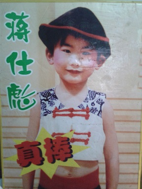
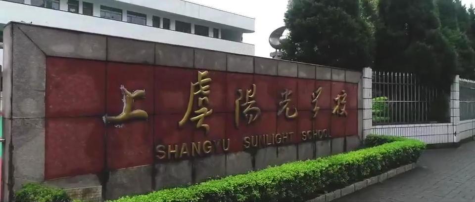

## 第一段幼儿园：新建庄幼儿园

我在生活上单纯傻笨。有一次去亲戚家吃饭，四爷爷突然疑惑地对我说：“咦，你的碗怎么漏了？”于是我翻过碗查看，饭全都洒在桌上了。雨天我也不会躲水坑，我妈就干脆给我买了双靴子，让我尽情地在水中踏步（直到现在我都一直很喜欢靴子）。

刚上幼儿园的时候年纪小。大家都欺负我、排挤我，总是抓我脸，可我不敢和老师说。我没有朋友，只喜欢一个人静静地在幼儿园的“毛毛虫”（里面可以钻人）里玩。不过我那会儿真是慷慨大方。

+   外婆常常笑着和我提起，以前接送我上学时会路过一个叫做 “城市花园” 的别墅群。我会指着别墅对她说“长大后也给你买一幢”。现在看来有心无力啊（哭哭）。
+   我妈经常给我买玩具，巅峰时候整整装了一麻袋。如果有小朋友来我家玩并且看上了我的玩具，我就会送给他们。最终送的送、丢的丢，整个麻袋都没了。
+   去别人家玩的时候我却不会拿任何东西。有一次去同村的一个男孩子家里玩，我对一辆拇指大的小车爱不释手，那户人家就送给我了——这件事让我高兴了好几天。
+   隔壁的一个亲戚（比我大三岁）送了我很多神奇宝贝卡片，我一直很感激他。后来妈妈才告诉我，他来我家玩的时候把我家好多东西都偷走了。比如我妈买了那种硬币纪念册，他顺走后我妈就去他家吵，最后退回来一些零碎的硬币——他竟然拆开来当零钱去用了。

新建庄幼儿园的老师对我的定论是 “太笨了，以后肯定没有出息“。于是我妈果断地给我换了个幼儿园。

## 第二段幼儿园：银河艺术幼儿园

中班的戚老师经常变着法子表扬我，给予我希望和鼓励，是助我人生转变的重要推力。

大班的第一年表现平平。
+   还记得老师讲校名的来历。”为什么我们的幼儿园名字这么长呢？因为我们在银河小区，还是以艺术为特长，就叫做银河艺术幼儿园啦！” 当时我真的觉得这名字好长好长，都要念不过来了。
+   我成绩中等又很乖。老师说上课就上课，老师说搭积木就搭积木，老师说午觉就睡午觉。有时午觉醒来能获得一些点心，感觉特别幸福。老师摇一下手鼓就是上课，再摇一下手鼓就是下课。所以拖堂变得很容易。有一次老师生气了一直不摇铃，待了好久好久才下课。

因为年纪太小（早读了一年），我妈在犹豫要不要给我复读一年大班。刚开始我是执意不肯的，于是她拉住我去东关中学的一个老师那里询问，在老师的建议下又读了一年大班。只对第二年的大班生活有记忆了。
+   大班的第二年成绩突飞猛进（应该的？），一举跳到班上前列。
+   有一个女生叫做杨若冰，成绩好还当班长，我一直很嫉妒并“怀恨在心”（我是副班长）。
+   有一个10岁的男孩子插班来读书，听说他有点笨？他坐在最后一排，我的旁边，庞大的身材与我们格格不入。毕竟是10岁的小朋友，各方面都很强，我总是和他暗暗较劲。有一次画画只有我和他是五颗星。有一次算术比赛，做完后看到大家都在奋笔疾书，谨慎的我就选择了检查。就在我检查的时候他也做完了且选择了直接交（我一直盯着他的一举一动），我当时那个懊悔啊（第一名要被他抢走了）；最后他错了一题，而我没有检查出错误，最后也全对，得意了好久。
+   有一个同学叫做魏元浩，对我特别特别好！他是我幼儿园最要好的朋友，分别前送了我两张珍贵的卡片，让我感动了好久。遗憾的是之后再也没有联系>_<。

幼儿园的生活很悠闲，作息十分规律。
+   早上六点准时起床，吃早饭玩玩具，七点坐校车去学校。傍晚爷爷在村口接我。
+   我是离学校最远的小朋友，每次坐校车到最后都只剩下我一个人。
+   晚上八点看完《蓝猫淘气三千问》就睡觉。要是我爸妈心情好，还可以偷看《朱轶说计》。

内心有着丰富的情感，很想表现自己。**但是胆小，怕被别人看不起**。
+   幼儿园玩老鹰抓小鸡的时候，我都是静静地站在一旁，看着老师和别的同学玩。
+   很害怕被冤枉。大班的时候，每当老师收不齐算术作业，就会让全班站起来，报到一个就坐下一个。所以我每天放学第一件事就是做作业。可是有一次我不仅忘带了作业，还误以为我已经交了。老师再三询问少的那本是谁的，教室里鸦雀无声。随后进行了熟悉的过程，没想到最终站着的人竟然是我！这个场景我牢牢记到现在，对我的刺激实在太大。
+   荣获叠被子大赛第三名。我妈说我在家苦练了好久；跳绳老是绊到。也在家里练了好久。 
+   在一个大型活动前排练节目，选几个人去花拳绣腿表演一波。至今耳边还能回想起那首背景音乐“豪气面对万重浪，热血像那红日光……”，以及我无数次从地板上跳起来的动作。
+   参与拍了一个与鲁迅有关的电影。我演的是他童年时候的同学，头发被理成近代的样子，跟着老师念三字经。那时候完全不知道含义，他念一句，我就照着声音重复一遍。
+   去排练了一个舞蹈节目，在绍兴市春节联欢晚会上表演。要拿着一个酒桶搬来搬去，还要拿着一根竹子不断地捅地面。有一句朗诵是“闯山的哥们来喝酒……”。那时候的照片我还留着：

## 上虞阳光学校

阴差阳错地进了上虞阳光学校，从此开始了我纯真烂漫的六年。

+   先去参加实验小学入学考试，分数很高却被一些开后门的学生给挤掉了。回家路上我妈顺手接了一张阳光学校的传单，阴差阳错真去上了。下定决心 **一定要让实验小学的招生办后悔**。
+   我麻麻拉着我去财务处缴费。阳光学校是民办学校，当我妈把 $8000$ 现钞递给会计后，我居然用方言（读小学前习惯用方言说话）**恨恨地** 对会计说：“你看！这下我家的钱全给你了。”哈哈我根本没见过这么多钱，当时肯定大为触动。后来发现财务处的会计是我同学赵卓凡的妈妈，好尴尬。
+   学校十字路口旁的干菜烧饼太好吃了，外公来接我的时候我总是缠着他买。
+   学校不大，但教室前面有一个花园。一年级的时候，我在花园里看到一只翅膀飞不起来的、在地上挣扎爬行的蜜蜂。我想把它捧起来放进花骨朵里，孰料它用尽最后一丝力气把屁股上的针刺在我的手指上。求助班主任后，我委屈兮兮地去食堂讨了点酱油，这才止痛止痒。忘恩负义的蜜蜂！
+   小学二年级扩招，从一个班分裂成了两个班，我被划在了一班。两个班的规模一直保持到了六年级。运动会的时候我班私下的口号是“六一六一，永远第一；六二六二，永远第二”。

赵炳州是我唯一的童年挚友，且是唯一陪我读中学的小学同学。
+   开学第一天，班主任潘卫燕老师让我们随便找位置座，我一眼就 **~~看上了~~** 一个戴着眼镜的斯斯文文的同学——赵炳州，于是就愉快地坐在了一起。
+   从此我们成为了无话不谈的好朋友，一起学习一起玩耍一起较劲（经常比谁作业做得快）。
+   赵炳州写作文可好了，三年级写过一篇爬山，把山势陡峭和内心的惊慌体现的淋漓尽致。
+   我经常到他家去玩，晚上还睡在他家，这样就可以去滨江公园踢球啦！
+   在中学里因为一些误会（我始终坚信是误会）而与他关系稍有疏远，但是我一直感谢和珍惜这份感情。

自小 **体育差**。妈妈早早地预见了这一点（她说我婴孩时期就不爱动），让我学了五年武术。
+   每天傍晚四点到五点雷打不动要练一小时武术，周六还要去武馆练。
+   一二年级的武术老师是郑教练，三年级开始是张钿教练。
+   我是武术课里肢体协调能力最差的学生，经常被同学和教练笑话。因为我妈的坚持，我一直留在武术队，甚至还去参加了一些武术比赛捡了几个奖。有一次去鲁迅小学。
+   劈叉，它是一个“没有难度”、只要付出疼痛和努力就能收获的项目。我僵硬的大腿被教练一点点往下踩，我甚至哭着求他不要再踩了；坚持压了几年竖叉竟然能劈成一条线了。
+   然而，我练了五年的侧手翻腿依然伸不直（同期的同学纷纷开始练侧空翻了）。
+   学习了规定拳和南拳两套厉害的拳法。学过小洪拳被教练喷不够灵活。当然五步拳这种基础肯定会啦。
+   可能是练武的原因，我的跑步成绩逐年提高。本来都没资格参加运动会，高年级的时候能长跑第三了。有两个跑步老妖怪是严佳炜和赵炳州：前者称霸短跑，后者称霸长跑，无人撼动。

小学的成绩一直很稳定，擅长数学（奥数）。
+   我语文考试分数一般位于 $95+$ 。拿第一的次数挺少，因为作文写不到顶尖水平。范家胄啊、赵炳州啊、高佳妮啊、金雨莹啊都特别厉害，他们的作文经常展示在后面的黑板上。
+   我有一次吃完饭，在食堂旁边的大树下散步。那时正公布了数学考试结果，严佳炜一脸无奈地走过来问我：“蒋彪你到底是吃什么长大的，怎么这么聪明？”我严肃地替他想了想，说道：”我早饭都是吃两个核桃豆沙包加一杯豆奶，我怀疑是核桃让我变聪明的。“
+   我还有过一次 **作文偏题**。因为从没下过 $90$，收到了 $84.5$ 的卷子印象真是太深刻了，作文足足扣了 $15$ 分！当时还被老师叫到了办公室问情况。题目是“以前环境特别恶劣，但是人们保护环境后生态逐渐恢复”。我从"环境恶劣"开始写起，写着写着不知数了全篇都在写环境有多糟糕。
+   有一个可恶的女孩子叫做高佳妮（应该是二年级转进来的），整天和我抢第一。平心而论，小学里第一的次数还是她多一点。啊啊啊实在是不服。
+   哈哈小考的时候我把她打爆了，扬眉吐气啊。小考的时候我语文 $94.5+20$，数学 $99+20$，总分 $233.5$（全校唯一的 $230+$），还获得了上虞市的舜杰奖学金。数学错了一道选择题，当时在考场里就纠结了很久。**最能直观反映数据量的多少的统计图是**？在条形和扇形里纠结了好久，最后选了扇形。

小学时候流行过很多好玩的。
+   小店里总是提供最新潮的小玩意：弹弹的神奇宝贝、小赛车、卡片。那时我妈不给我零花钱，我只能留着口水看别的同学玩。有时候一个同学高兴了会送我几颗，我就如获至宝地藏起来。我从来不参与赌（两个同学在桌面互相弹，谁先把对面弹下去就赢得对面的东西），因为害怕失去。
+   体育课流行踢足球和打篮球。周五下午两点半就会放学，不坐校车的男孩子们总爱聚在一起 **踢足球**。沈佳辉虽然身板小，变换球路的姿势可是十分灵活，七扭八扭就带球过了好多人。
+   范家胄是一个思维敏捷、新潮的男孩子。他结合了当时最流行的游戏（天书奇谈、赛尔号、梦幻西游等），在笔记本上自创了一个游戏，涂涂画画煞有介事。所以男生们下课总是聚在他的座位边“开一个账号”，靠猜拳和口胡在那儿不亦乐乎。
+   还有一种两到多人玩的课间游戏。总体规则是：每回合可以“积攒能量”、“格挡”、“发射”。发射可以发射不同档位，每次要消耗掉对应数量的能量。当回合如果有人发射，那么所有小于最高档位的“发射”以及所有“积攒能量”的选手退出该局。最后只会有一个人获胜。
    +   第一回合肯定是积攒，有些同学很喜欢第二回合就发射来阴一下别人。
    +   这只是一个大框架，可以结合不同的背景改造成不同的风格。我记得有一个变种是：用“大气、智慧、优雅、谦逊、成功”（这是我校校训）表示发射的档位。
    +   为了遏制一直出“格挡”的操作，有一些对应的规则来制约。比如在上面那个变种里规定两种格挡姿势：一种只能格挡前四种档位的发射，一种只能格挡“成功”档位的发射。这样当一方积攒了五个能量的时候，另一方就再也不能高枕无忧了。
+   我最喜欢的一款课间游戏是取材于梦幻西游的，也是两到多人玩得。每个人在开场的时候可以选择一个职业（我记得有唐僧、盘丝洞洞主、龙王等），每种职业都有一些有趣的技能。每个人初始有 $10$ 点血，每一轮猜拳获胜的人才能出一个技能。一般而言，普通的单体攻击技能扣 $4$ 点血。
    +   唐僧有一个经典技能叫做“点灯”：五回合内每回合回复 $1$ 点血。
    +   有一些时候会疲惫的技能，比如唐僧的“横扫千军”，可以对对方造成 $6$ 点伤害但是疲惫一回合（下一次获得出手权时必须跳过）。所以直接选择进攻一般打两下对面就死了。
    +   阎王有一些经典的持续扣血技能：①判官令：五回合内每回合给对方造成 $1$ 点伤害；②阎罗令：必须在判官令的基础上释放，五回合内每回合给对方造成 $2$ 点伤害。对方获得出手权时，可以选择解开这些封印，就能瞬间停止封印效果。
    +   盘丝洞洞主有一个很经典的技能叫做“天罗地网”，该技能对场上所有人有效。当某个人处于“天罗地网”之中时，洞主在下一次出手时可以对它施加 “网住？”技能——此时双方来一次 PK，如果对方失败会扣 $6$ 点血。处于“天罗地网”之中的玩家可以选择逃脱。
    +   我最喜欢的职业是“龙王”。可是我却忘了它有什么有趣的技能。

有一个很可爱的女孩子叫做励颖。笑起来还露出可爱的牙齿，心都被萌化了。
+   记得是三年级转进来的，啊啊啊扎着两支可爱的小辫子的样子实在太好看了。励颖给我的印象是古灵精怪，贪玩，聪明但是不好学哈哈哈。~~哎呀可惜我太胆小了，不敢主动出击~~。
+   我猜孙怡楚是她的好朋友。
+   那会儿励颖还很凶，整天逮着一个理由欺负我拧我。胳膊上绕一圈可疼了！
+   和男孩子玩猜拳游戏的时候会用余光瞄她，有时她正和女生们闲谈，有时她正往这边看着。
+   每两周会换一次座位（组之间的移动）。有一段时间我和励颖只隔着一条过道，但是经过一次换位置后可能会调到“天涯海角”。我就日日期盼能靠近她哈哈哈。管换位置的事是劳动委员严佳炜，有一次两周到了却还没换位置（下一次我就能换到她旁边了！），我还催促严佳炜赶紧下命令。
+   可是她后来居然转学了！！！那是一个暗淡的开学日，我焦急地坐在座位上等待她来报道；我几乎数完了所有进教室的同学，唯独没有发现她。后来她舅舅匆匆赶来办转学手续。我心都碎了，回家一直哭。
+   转学前忘记要联系方式了，后来我四处打探，甚至还向班主任要来了每个人登记过的地址。
+   **这情意永远种在了我的心中，大学我又重新找回她啦，她现在可是我的女朋友啦哈哈哈~**

我妈和小学里的老师和同学关系都特别好。
+   我妈妈曾在学校里当过生活老师，可能也为了能更好地照顾我。在学校有个专门的办公室，我常常跑去玩。我还记得她没收过一个俄罗斯学长的俄文版游戏王卡片。
+   她和食堂闹过别扭（大概是我是走读生，食堂不允许我吃晚饭很不方便，她很生气），最后就不做了。
+   听说励颖成为了我的女朋友后我妈懊悔不已。她说她对我们班住校的女生（包括他们的父母）都很了解，唯独不了解励颖。因为励颖家比较远，父母也不怎么见到过。哈哈亏死了。

小学一年级的班主任是教语文的潘卫燕老师。
+   潘老师主张练字，每周还专门有一节练字课（硬笔书法）。我就一直练啊练啊练，当我的字被选为全班最好看的字时，我真是太开心了。
+   她还挑了一批字好的同学跟她学书法，我也去啦。遗憾的是我很懒，并不是书法最厉害的。
+   三年级的时候潘老师去生宝宝了（潘老师嫁给了一个帅气的警察），语文课由二班的王铁青老师来上。现在潘老师的两个女儿都已经很大啦！

教音乐的汤红霞老师十分威严，我一直很怕她。
+   一年级的时候有钢琴课和国际象棋课。学的第一首钢琴曲叫做 《小羊羔》，旋律是 3212333222355。
+   音乐课上我胆子特别大。汤老师问：那个同学可以来来唱一遍今天要学的曲子。我看四下没人举手，而这首曲子我正好听过，我就站起来大声唱了。还没唱完就被老师打断：你究竟懂不懂音准？
+   学校曾举行了一个文艺汇演，还要评选十佳节目。有个既定的演唱节目是《祖国祖国我们爱你》（开头是“小小蜡笔，穿花衣”），然而主演好像生病了，汤老师就让我代唱（我才是因为没别人报名）。那时候我完全不知道这首歌，和我妈逛遍了一百超市也没找到光碟，最后在小爸爸家的电视机里找到了这首歌曲。之后我就天天去小爸爸家练习这首歌，还精心摆演手势动作。
+   学过乐器后对音准有了很大的把握（但是完全不会唱高音）。不知咋的混进了学校的合唱团，还跟着参加了好多次合唱比赛。有一次去出去比赛前，在音乐教室化妆、试装、彩排。我坐在座位上和穿着红裙子的励颖聊天，妈呀太幸福了。可惜很快就被大巴拉去比赛场地了，哼。

教美术的顾华平老师还是少先队辅导员，有一个专门的教室，我真羡慕。
+   在她那里学过水粉。记得临摹唐三彩时，我很辛苦地画完了马，然后调了一个淡紫红色开始大肆涂背景。顾老师看到后慌忙阻止了我：我们要突出的是唐三彩，所以背景越淡越好。
+   四年级的时候竞选全校副大队长失败了，最后捞了一个文体委员。负责运动会动员、每周五去降国旗。
+   竞选副大队长那会，在家里的稻地上一遍遍地练着台词。我家隔壁的一个女孩子怪声怪气地嘲讽我：“哦呦烦不烦啊，你以为你是谁啊，还竞选副大队长……”（具体的话记不清了）气死我了。
+   五年级的时候选上了副大队长，大队长是朱琳学姐。那时候仗着自己才艺多，竞选的时候对台下的小朋友说：“我准备了乐器、武术、书法、魔术的表演，大家想看哪个呀？”魔术是临时学的，本想增添一下这句话的分量，没想到小朋友们清一色的选了魔术。哎表演了一个很尬的纸牌魔术……顾老师在竞选的人前面各放一个框，再给全校每个同学发十颗黄豆，喜欢谁就投谁。我就很坏，在投豆子的环节吹葫芦丝拉票。一二年级的小朋友不太懂呀，一看我这么牛逼纷纷投我了，后来顾老师连忙阻止我吹哈哈哈。
+   顾华平老师是一个真性情的好老师。记得有一次大队委开会时，她给我们讲了一段悲伤的故事。有一个高年级校友和他爸爸在大润发前被车撞了，爸爸受了重伤孩子生命垂危。紧急转院到杭州后，她妈妈一进去就给医生跪下，但是医生摇着头说脑死亡没办法了。说到这里，顾老师的眼泪刷地掉下来了。

李升东老师是一名温和的好老师，从三年级开始一直教我们班的数学。
+   我记得二班的数学老师是校长宣国成老师，现在想想压力挺大的，教得好教得差都尴尬。
    +   宣校长喜欢在晚自修第二节课讲数学题，我也听过几次。
    +   我还记得他抵制修正带的演讲。“修正带涂在本子上，就好像涂在脸上一样，左一道右一道坑坑洼洼的，你们不难受吗？”我小学一直用透明胶改错，当时听完的感想是：我才不用这种破东西呢！结果中学时自从尝到了修正带的方便后，反而弃用透明胶了哈哈。
+   李老师还是我校的传奇老师，他曾同时教数学、科学、计算机、体育四门课。
+   作为李老师的得意门生，我喜欢去问他一些关于数学的奇思妙想，他总是不厌其烦地解答。
    +   有一次我从一本书看到了勾股定理，纸上画了画是对的，兴奋地告诉他这个发现。
    +   我还画过一个几何图案，能证明 $1+\frac{1}{2}+\frac{1}{4}+\dots=2$ 。画完后兴冲冲拿给他看。
+   他抓了很多好苗子去学奥数。四年级的时候参加了浙江省的“我爱数学杯”数学竞赛，最终和郭钦并列第一 $115$（满分 $120$，错了半题）。最神奇的是，我们错的答案还是一样的。
+   他在还抓了一堆奥数好的同学去学信息学（据说他是自学的）。
    +   第一阶段有好多人。李老师在阶梯教室的黑板上讲 Pascal 的基础语法。那时候还没学过字母表示数，李老师把`a:integer;` 解释成把字母看做一个个抽屉，数字就放在对应的抽屉里。
    +   渐渐的大家都跑光了，只有我和郭钦坚持了下来。
    +   四年级的时候我在初赛里侥幸压线（大概线是 $47.5$ 我是 $48$ 这种样子）混进了绍兴市决赛，跟着一个叫孙桢波的学长（该学长成绩也很牛逼啊，最后从春晖中学裸考进清华）在机房混。那时候什么也不懂，李老师经常给我一对一辅导，有一次留校迟了还开车把我送回家，十分感动。
    +   五年级的时候拿了满分。记得最后一道题是高精度斐波那契。
    +   六年级的时候举行过两次，第一次我和郭钦都是满分（比赛回来的路上，我听了郭钦的描述后发现他做法的一个小漏洞，然而数据太弱还是放他过了），第二次和期末考撞了就没有去。
+   高年级的时候，李老师还委托我每周一的早自修在黑板上出题。那时候我也是刚啊，根本不需要参考辅导书，周日纯靠自己的知识掌握“造题”。有一次忘记了，在周一早上校门口吃早饭的时候临时想题。

四年级的时候由崔张龙老师担任我们的班主任和语文老师，深得大家的喜爱。
+   崔老师的很多理念都很先进，比如实行“轮值班长”制度，这也是我唯一当过的正班长。
+   他把我们班冠了个名叫**“芸香葵园”**（此后我班的黑板报都是和向日葵有关，运动会等节目也会在四一班的名称前面加上这个title）。哈哈我记得二班的王铁青老师随后跟进，将他们班取名为“青青竹园”。
+   老崔的儿子叫做崔凡平，是吹萨克斯的，还挂在了学校的荣誉榜上，感觉特别牛逼。
+   老崔自称“我带过的班如果表现好，会被我带出去吃烧烤”。他最后居然没有食言，真的带我们去滨江公园找了个地方烧烤，我吃的满嘴流油哈哈哈。
+   老崔还很喜欢给同学们取绰号。那是四年级的一个午后，我外出参加比赛，回到教室的时候正在分析语文试卷。有道题是对联，上联是“姜女xxxxx"（姜女应该指的是孟姜女）。我在门外面犹豫了好久才推门进去，没想到进门的一刹那，崔老师正好念到姜女这两个字——老崔就钦定了“蒋女”这个绰号……
+   老崔是从盖北小学的副校长被挖来阳光学校的。尽管他信誓旦旦地保证教我们到毕业，四年级结束后还是因为个人发展去了杭州某小学。听说前段时间他因为做了不好的事情而受到了惩罚，深感惋惜。

五年级开始由罗才军老师担任我们的班主任和语文老师，更获得大家的爱戴。
+   罗老师的教学理念也很先进，倡导我们多读书，读好书。他经常说，这本书适合你们高中看，这本书适合你们大学看……（可惜我都没记下来，捂脸）现在只记得一本米兰昆德拉的《生命不能承受之轻》。
+   六年级时候，罗老师参加了全国的中小学语文基本功大赛，获得了浙江省唯一的一等奖。那段时间他特别忙啊，等结果出来之后，新闻可是铺天盖地的，太牛了！
+   有一天天下了大雪，路面都结冰了，我妈很迟才送我去上学（家离学校特别远）。等我到学校的时候发现教室里空空如也——罗才军老师竟然把全班带去滨江公园打雪仗了？我想赶出去，但是被门卫拦下了，只能孤零零地坐在教室里。这件事一直很后悔——大伙儿在雪地里玩得很开心，还拍了很多照片。
+   五年级的一个周五下午，很多同学已经回去了，教室里空荡荡的。严佳炜开始在教室里义务打扫卫生。当时老罗对剩下的那群女生感叹道：“以后要嫁就要嫁严佳炜这样的老公。”

小时候性情温和，从来没有打过架（甚至有些遗憾哈哈哈）。
+   黄千齐是四年级前的“霸主”。他独享最后一排，人高马大，打架高手，大家都不敢惹他。
+   曾经转来一个叫做钱通的同学。他比黄千齐还高，也被安排到了最后一排，有效地制约了黄千齐（我还有印象他们坐在座位上双手按着对方的样子）。钱通读了一年又要转学了，当时崔老师还专门准备了一个“挽留会”，让同学们直抒胸臆。大家普遍的想法是：钱通转学了谁还能来和黄千齐打架呀，所以一定要留下来！记得当时陈嘉莹上台激动地说不出话，只是大声地（甚至含情脉脉地）说了三声“钱通”。
+   五年级的时候朱熠阳发育起来，突然变得特别生猛，隐隐有挑事之险。罗才军的管理方法真好，他干脆找了一个空闲的时段，把我们全班叫到操场上坐着围成一个圈，然后把黄千齐放在圈中央。接着他大声说：“现在所有男生们可以自由地上来挑战黄千齐。今天的擂台是决定性的，谁最后胜出了，谁就是班上的老大。”起先没有人敢应战，最后朱熠阳上了，大战了三百回合胜出了。从此朱熠阳就是班上钦定的“王”，好不威风；不过他也逐渐变得自以为是、脾气暴躁，唉。

吴潇锜是我小学的一个痛。
+   他大概是三年级转进来的吧，他爸是做生意的。当时他主动来接近我，过节的时候送我贺卡，让我很是感动。他的真心也换来的我的真心，我还和几个同学去他家玩过（在多元世纪城的小商铺里），在漆黑的房间里半通宵（小学时期唯一一次半通宵）打牌，大伙儿玩得都很开心。
+   不知怎么的关系就恶化了。有一天他在食堂门口对我说：“蒋仕彪，我觉得你变了”。这句话实在伤透了我的心，但是我根本不知道发生了什么。
+   后来他看我更加不顺眼，甚至有过几次直接冲突。
    +   因为成绩比较差，老师安排他坐我旁边。我那时候十分遵守规矩，他在数学课上提前做作业，被我发现后我就督促他好好听课。然后他就骂我“你管得着吗”甚至“你真贱”……
    +   有段时间很流行养水宝宝（一种放在水里会变大的东西）。他养在教室里，我提醒他说“这个东西可能有毒”（其实毒到并不至于哈哈，都怪我太为他好了），他突然就翻脸了，搞得我不知所措。后来闹到罗老师那里，吴潇锜很生气地说：“他说我有毒！”emmmm我就无话可说了。
    +   罗老师组织春游的时候让我们自由组队，每个队伍不能超过十个人。我人缘比较好，一下就组完了。吴潇锜很想来我组被我以人数满了拒绝了（我是组长）。他又闹到班主任那里说我歧视他，最后罗才军让我组破例 $11$ 个人。
+   六年级关系极度恶化，天天没事找事追着我骂。我竟然还一直忍下去了。**当时发誓一生都不会原谅他**。

没上过课内的补习班，但是上过了各色的兴趣班。在各个演讲稿上厚着脸皮称自己“多才多艺”。
+   每天傍晚要练武术一个小时，周六一天还要去桃源武术馆接着练。
+   学校里，学李老师那儿学奥数，去汤老师那里练合唱，去顾老师那儿学水粉。
+   把两段剑桥英语都上完了。第一段是每周日上午，第二段是学校晚自修的到时候上。第二段的人数很少，和范家胄、朱熠阳、高佳妮、王诗文和董海涛一起上，老师是 Miss Ding。
+   和赵炳州一起找了个老师练书法，在金鱼湾的老巷子里。哎，我没有赵炳州耐得住性子练。
+   在鸣音琴行跟着何老师学了很久的葫芦丝和笛子。水过了葫芦丝八级，一直懒得去考笛子。
+   还学过线描（考了一个线描二级），接触过版画、国画和拉丁舞（学了两三节课就没去了）。
+   二年级的时候去参加绍兴市的“不老神杯“主持人大赛，通过了重重考验。
    +   除了口才外，主办方要求大家表演的才艺越多越好。
    +   江郎才尽后我开始变起了我妈教给我的魔术。将洗过的一叠牌的牌面展示给观众，只把牌底的那张翻面展示给我。我每次在背后操作，把自己看过的那张牌底放在牌顶，再把下一张牌底翻面，然后自信地告诉观众我能猜出他们面前的那张是什么。如此弱智的魔术我竟然还 **穿帮** 了！有一步操作的时候忘记把下一张牌底翻面给我了，猜不出后居然还“撤销”了，告诉观众让我再重新来一次……
    +   决赛的时候没选上，我在评奖的地方哭了。大概是我的情意感动了评委，复活赛的时候击败了别人挤来了“小兰花节目主持人”的头衔。奖了一个书包和一整只不老神鸡，聘书现在还保存着。

想在领成绩单的时候给每个同学都拍张照，但是我妈忘记带相机了。遗憾。