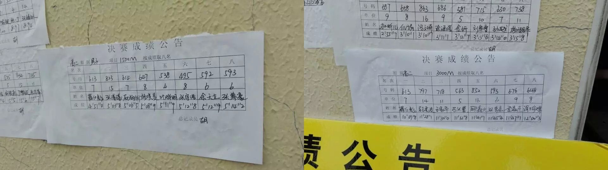
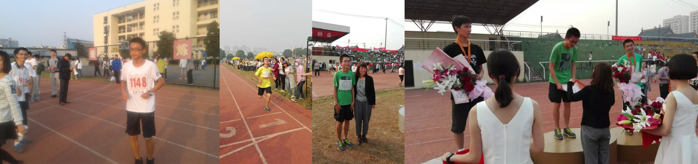

## 一中简介

## 新高考和分班

## 竞赛之路

## 课间生活

高考前，在语文年段长王老师的推动下，流行起晚自修前看《朗读者》的风潮。老师们的本意是好的，但大部分同学并没有认真去聆听和汲取里面的语文素养，而是将其当做了一段很好的休息时间甚至聊天时间。每当吃完晚饭回到教室，窗帘正在被拉起来的时候，我都会出神地望着缓缓下拉的大屏幕，听着教室里喧闹的声音，心想：再过几个月等高考一过，大家就四散飞翔了——我只能把握如今，与大家共度一个个青春的夜晚。

## 课余生活

有了初中的铺垫，我继续在长跑方面发光发热。运动会最远的田径项目是 $1500m$ 和 $3000m$，高一高二的时候两个项目都拿了冠军（下图是高二的决赛成绩单）。当然这成绩也不是随上随有的，往往在比赛开始前一个月就得开始练习了。短则一两圈，中则四五圈，多则超过 $3000m$（为了防止比赛前期用力过猛导致后劲不足）。起跑前后是最紧张的，总是担心起跑被挤，或者中途鞋带散了、肚子疼了；中后期紧张感已经全被疲惫感替换了，不断消费自己的毅力向前冲。我校有个奇怪的传统：如果周四周五是运动会，周三傍晚就会跑三千米。周三下午大家会把桌椅搬至草坪，等当天唯一的项目开跑时，操场的里里外外就全是人了。由于距离过长，只要能坚持跑完就有奖励分。我喜欢在枪响后就抢到最开头的位置，然后根据自己的节奏逐渐把后面的人甩掉（沉重的呼吸声会让我的心里有很多压力），快结束时往往能套第二名小哥半圈。每当跑到一些拐角处，听到熟悉的同学给我加油时，脚下能短暂迸发出力量，很拉风！我的手臂力量比较弱，中后期手臂就摆不动了，会习惯性的叉腰。训练时都用鼻子呼吸，正式比赛的后期冲刺时会改用嘴巴呼吸，冲过重点后腿直接软掉。

高中的照片存货不多，大多数都是长跑时拍的。高二跑完后还有朱校长的亲自颁奖~

高二暑假陆续经历 NOI 的失利和沉重的学业压力，我在生理和心理上都无法应对高三开学的运动会。正好那时候我正因心率过低在医院检查（还带了一天的心电图仪），用这个借口退出了高三的长跑项目。体育委员高从文她早已默认我会参赛，对我的弃赛表示惊讶甚至嗤之以鼻。我的退出着实给她造成了困扰，除了小赵外找不到人能抗大旗了。至今还记得拉了最好说话的扬播来跑，而且扬播很争气地跑完了全场，着实让人惊艳！