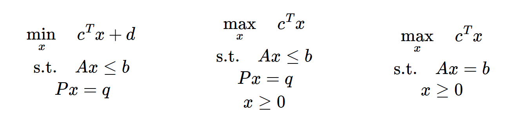
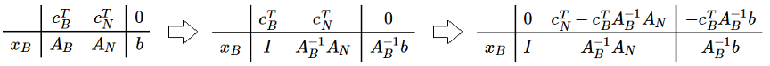
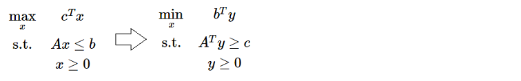
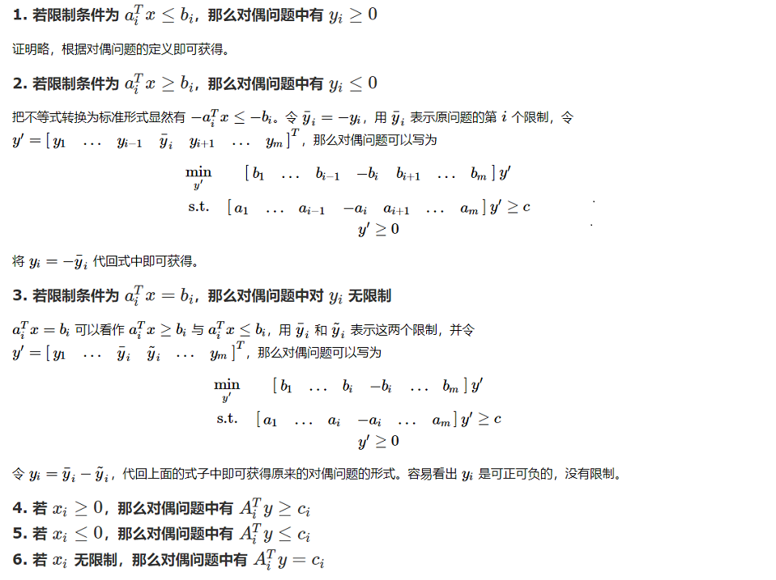

原计划基于 [TSR 学长的博客](https://www.cnblogs.com/tsreaper) 补充知识点的，由于《应用运筹学基础》将“上课笔记整理”也作为了考核方式之一，于是我把 TSR 学长的部分内容也结合进来了。这篇文章是系列之二，还有两个系列分别是：

+   [线性规划理论](https://jiangshibiao.github.io/Linear-Programming-Theory)
+   [近似算法选讲](https://jiangshibiao.github.io/Selection-of-Approximation-Algorithm)

## 凸集、凸函数、凸优化

**凸集**：任取 $x, y \in S$ 和 $\forall \theta \in [0,1]$ 满足 $\theta x + (1-\theta)y \in S$，称集合 $S$ **凸集（Convex Set）**。

+ 凸集的交仍然是凸集。
+ 如果没有 $\forall \theta \in [0,1]$ 的条件，称集合 $S$ **仿射集（Affine set**）。 

**凸函数**：对于定义在凸集 $S$ 上的函数 $f(x)$，若对于 $\forall \theta \in [0,1]$ 有 $f(\theta x + (1-\theta) y) \le \theta f(x) + (1-\theta) f(y)$，那么称 $f(x)$ 是**凸函数（Convex Function）**。

- **延森不等式（Jensen's inequality）**：若 $f(x)$ 是凸函数， $f(\sum_{i=1}^n \theta_ix_i) \le \sum_{i=1}^n \theta_i f(x_i)$
- 定理：**凸函数的局部最优就是全局最优**。
    1. 假设 $\hat{x}$ 是局部最优点，$x^\ast$ 为全局最优点，则 $f(\hat{x}) > f(x^\ast)$。
    2. 由于 $f(x)$ 为凸函数，那么对于点 $x = \theta \hat{x} + (1-\theta)x^\ast$ 有 $f(x) \le \theta f(\hat{x}) + (1-\theta) f(x^\ast) < f(\hat{x})$。
    3. 取 $\theta = 1 - \frac{\epsilon}{2|\hat{x}-x^\ast|}$，就有 $|x - \hat{x}| = \frac{\epsilon}{2} < \epsilon$，说明 $x$ 在 $\hat{x}$ 的邻域内且比它优，矛盾。
- 凸函数的判定条件：
    + 一阶判定条件：设 $f(x)$ 在凸集 $C$ 上一阶可微，则该函数为凸的充要条件是：对于 $\forall x, y \in C$，都满足 $f(y) \ge f(x) + \nabla f(x)^T(y-x)$.
    + 二阶判定条件：设 $f(x)$ 在凸集 $C$ 上二阶可微，则该函数为凸的充要条件是：对 $\forall x \in C$，都满足 $\nabla^2(x) \succeq 0$。

**凸优化**：优化 $\min  f(x) \quad \text{s.t.  } g_{i}(x) \leq 0,i \in [1..m] \quad h_{i}(x)=0, i \in [1..p]$。其中 $f(x),g_i(x)$ 是凸函数，$h_i(x)$ 是仿射函数。

- 定义拉格朗日函数  $L$：$ \mathbf{R}^{n} \times \mathbf{R}^{m} \times \mathbf{R}^{p} \mapsto \mathbf{R}$, $ L(x, \lambda, v)=f{0}(x)+\sum_{i=1}^{m} \lambda_{i} g_{i}(x)+\sum_{i=1}^{p} v_{i} h_{i}(x)$
- 最优解 $\pmb{(x,\lambda,v)}$ 满足 **KKT** 条件
    - 原始条件：$g_i(x) \le 0, h_i(x) =0$
    - 拉格朗日函数梯度为 $0$：$\nabla_x L = \pmb{0}$
    - 对偶约束：$\lambda_i \ge 0$
    - 互补松弛条件：$\lambda_ig_i(x)=0$

## 线性规划的定义

线性规划定义：

+ 左边形式的问题被称为**线性规划（Linear Programming）**
+ 由于仿射函数既是凸函数又是凹函数，所以优化问题是 min 还是 max 问题不大；常数 $d$ 对优化问题的解没有影响，一般也可以去掉。这就变成了中间的这个优化函数。
+ 对于 $Ax \le b$ 这个约束，可以通过添加非负变量将其松弛成等式。所以我们总能将线性规划转成右侧的形式。右式也称为线性规划的**典则形式**。

**极点**：若 $x \in S$ 无法表示为凸集 $S$ 内某两个元素的凸组合，称 $x$ 是**极点（extreme point）**。

- LP 问题的可行域实际上是很多超平面的交，最后组成的应该是一个超多面体。
- 极点就是超多面体的“顶点”。可以证明，若最优解有解，必然取在极点上：
    1. 假设最优点 $O$ 严格在凸集里面。任取一条与凸集交在 $P$ 和 $Q$ 的直线。因为是线性规划问题，$O$ 点处的函数值一定是 $P$ 点和 $Q$ 点的线性组合。所以 $P$ 和 $Q$ 中，至少有一处的函数值是大于等于 $O$ 的。
    2. 我们可以重复上述步骤，把最优点一步一步约束到顶点上。比如在三维中，我们先将其“规约”到凸壳的表面上，最后“规约”到凸壳的边和点上。

**基可行解**：我们讨论 $Ax = b$ 有解且行满秩的情况（如果不满秩就去掉线性相关的限制条件）。设 $A$ 是一个 $m \times n$ 的矩阵，根据线性代数的知识，我们可以从 $A$ 中选出最多 $m$ 列线性无关的列向量，其它列向量都和它们线性相关。我们把这 $m$ 个列向量调整到前面去，把 $A$ 分成两部分：$A = \begin{bmatrix} A_B & A_N \end{bmatrix}$.容易构造出 $Ax = b$ 的一个解：$x = \begin{bmatrix} A_B^{-1}b \quad 0 \end{bmatrix}^T$，称这种解为**基可行解（Basic Feasible Solution）**。显然，基可行解至多有 $C_n^m$ 种。

- 定理1：**每个极点都对应着一个基可行解，且每个基可行解都对应着一个极点**。
- 定理2：**最优解一定可以在基可行解处取到**。

[tsr 的概念讲解](https://www.cnblogs.com/tsreaper/p/aop1.html)

## 单纯形法

**单纯形法（Simplex Method）**（以 $\max$ 模型为例）

1. 将 $A$ 中的**基变量**消成单位矩阵，并把目标函数**基变量**的系数都消成 $0$。
2. 以某种策略找一个 $c_j>0$ 的非基变量 $j$ **入基**。
3. 依次考察 $b_i > 0$ 的行，确定一行 $i$ 使得 $\frac{b_i}{A_{i,j}}$ 最小（对于 $j$ 最紧的限制）。
4. 拿第 $i$ 行去消，把每一行的 $A_{?,j}$ 以及目标函数的 $c_j$ 都消成 $0$。即第 $i$ 行的基变量**出基**。
5. 重复步骤 $2 \sim 4$ 直到检验数全大于 $0$.

**单纯形表（Simplex Tabuleau）**

- 变量分成基变量和非基变量：设 $c^T = \begin{bmatrix} c_B^T & c_N^T \end{bmatrix}$， $A = \begin{bmatrix} A_B & A_N \end{bmatrix}$，$x = \begin{bmatrix} x_B^T & x_N^T \end{bmatrix}^T$
- 显然我们有 $A_Bx_B + A_Nx_N = b$ 且 $z = c_B^Tx_B + c_N^Tx_N$
- 通过简单的线性变换有：
    
- 这其实就是单纯形法的形式化迭代过程

评价
- 变换的本质是：在满足约束的限制下，用不同的**非基变量组合**来表示目标函数。
- 当非基变量的检验值均 $\le 0$ 时取到最大值。我们可以想象成，目标函数就是由这些非基变量决定的，它们目前都取了 $0$，而且任意变量的微小增长都会导致结果变劣。
- **单纯形正确性证明**
    1. 设最终的检验数是 $\hat{c}$（均小于 $0$），对应的解是 $x$，最优解是 $y$。
    2. 令 $d=x-y$，我们有 $Ax - Ay = b - b = 0 = Ad = A_Bd_B + A_Nd_N$ 
    3. 那么 $d_B = -A_B^{-1}A_Nd_N$，则 $c^Td = c_B^Td_B + c_N^Td_N = (c_N^T-c_B^TA_B^{-1}A_N)d_N = \hat{c}d_N$
    4. 我们知道 $x_N = 0$，又 $y \ge 0$，所以 $d_N \ge 0$；又 $\hat{c} \le 0$，所以 $c^Td = \hat{c}d_N \le 0$，那么 $c^Ty = c^Tx + c^Td \le c^Tx$，说明 $y$ 并没有比 $x$ 更优。
- **在非退化情况下，单纯形法一定可以停止**。因为每次迭代都会让答案更优一点，访问的基可行解空间是不会重复的。而基可行解数量又是有限的，所以算法一定可以停止。
- 可以证明，如果按字典序的顺序选取 $j$，单纯形算法一定可以停止。

[tsr 讲解单纯形法](https://www.cnblogs.com/tsreaper/p/aop3.html)

## 单纯形法的初始可行解

初始可行解
- 若单纯形的约束是 $Ax \leq b$，初始可行解可以取 $x = \pmb{0}$.
- 若约束是 $Ax = b$ 时，我们可以通过加入松弛变量 $\bar{x}$ 使得 $Ax + \bar{x} = b$，这样 $x = \pmb{0}, \bar{x} = b$ 是初始可行解。这里存在一个问题：$\bar{x}$ 是我们添加进去的变量——我们希望 $\bar{x}$ 能全部出基。

**大 M 法（Big M Method）**

- 对不为 $0$ 的 $\bar{x}$ 进行“惩罚”。将目标函数改为 $z = c^Tx - M\sum_{i=1}^m\bar{x}_i$。如果 $M$ 是一个足够大的正数，$\bar{x}$ 就会在 $-M$ 这个“严厉的惩罚”之下变成 $0$。
- $M$ 取多大很难说，且取得过大会影响精度。

**两阶段法（Two-Phase Method）**

- 添加了 $\bar{x}$ 后，我们考虑一个新的线性规划：约束不变，改成优化 $\min {\sum \bar{x}_i}$ 这个函数。一组显然的初始可行解是 $x = \pmb{0}, \bar{x} = b$.
- 如果这个优化问题的最优解的目标函数值不为 $0$，则原问题无可行解；否则我们就找到了原问题的一组可行解。我们再以这个可行解为起点，利用单纯形法求出原问题的最优解即可。
- 由此可以发现，**线性规划的可行解和最优解求解难度相同**。

思考：对于 $\max c^Tx,Ax \le b$ 这个模型，如果突然多了一个 $x_1 \ge 4$ 的条件怎么办？
- 添加一个松弛变量 $\overline{x}$： $-x_1+\overline{x} = -4$
- 此时会发生一个问题：$\overline{x}$ 和 $b$ 至少有一个会取负号，不符合约束。
- 怎么办呢？再引进一个变量 $\hat{x}$：$x_1-\overline{x}+\hat{x}=4$
- 至此，$\hat{x}=4$ 是新问题的一个可行解，直接套大M法或二阶段法求解。

[tsr 讲解初始可行解](https://www.cnblogs.com/tsreaper/p/aop3.html)

## 对偶定理与对偶单纯形法

线性规划的对偶  

对偶定理
- **弱对偶定理 (Weak Duality)：设 $x$ 和 $y$ 分别是原问题和对偶问题的可行解，则 $c^{\rm T}x \le b^{\rm T}y$**。证明：由 $y$ 的可行性我们有 $A^{\rm T}y \ge c$，即 $y^{\rm T}A \ge c^{\rm T}$，两边同乘以 $x$ 有 $y^{\rm T}Ax \ge c^{\rm T}x$；由 $x$ 的可行性还有 $Ax \le b$，那么 $y^{\rm T}Ax \le y^{\rm T}b$，合起来就是 $c^{\rm T}x \le b^{\rm T}y$。
  - 最优性：若 $x$ 和 $y$ 分别是原问题和对偶问题的可行解，而且 $c^\mathrm{T}x=b^\mathrm{T}y$，那么 $x$ 和 $y$ 分别是原问题和对偶问题的最优解。
  - 可行性：若原问题无最优解（可以取无穷大），则对偶问题无可行解；若对偶问题无最优解（可以去无穷小），则原问题无可行解。
- **强对偶定理 (Strong Duality)：若原问题（或对偶问题）有有限最优解，那么对偶问题（或原问题）也有有限最优解，且二者最优解相等**。通过单纯形法的计算过程来辅助证明。
- **互补松弛定理 (Complementary Slackness)：若 $x^\ast$ 与 $y^\ast$ 分别是原问题和对偶问题的可行解，以下两点等价**：
  1. $x^\ast$ 和 $y^\ast$ 分别是原问题和对偶问题的最优解；
  2. $(y^{\ast {\rm T}}A - c^{\rm T})x^\ast = 0$ 且 $y^{\ast {\rm T}}(Ax^\ast-b) = 0$。

对偶单纯形法步骤（以 $\min$ 模型为例）
1. 取一组检验数全都 $\ge 0$ 的基。
2. 找一个 $b_i < 0$ （一般找绝对值最大的）行 $i$，将非基变量 $i$ 出基。
3. 我们想让某个非基变量从 $0$ 变成大于 $0$ 来增加 $b_i$。在这一行中，找一个 $A_{i,j}< 0$ 的 $j$ 使得 $|\frac{c_j}{A_{i,j}}|$ 最小（这样 $j$ 消完目标函数后检验数依然全都 $\ge 0$），让 $j$ 入基。
4. 重复步骤 $2 \sim 3$ 直到约束右侧的值均 $\ge 0$ 。

[tsr 讲解对偶单纯形](https://www.cnblogs.com/tsreaper/p/aop4.html)