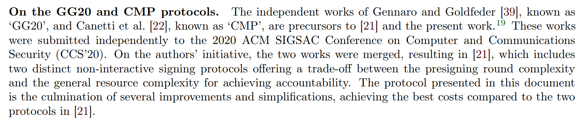

本文会重点基于 ECDSA 的场景介绍安全多方计算框架下的门限签名：

+ **安全多方计算**（Secure **M**ulti-**P**arty **C**omputation）是一种隐私计算技术，用于多方在不泄露私有输入的情况下计算任意函数。常见概念包括：秘密分享、不经意传输、混淆电路、同态加密等。
+ **门限签名**（**T**hreshold **S**ignature **S**cheme）是一种加密数字签名协议，是安全多方计算的实际应用场景。通常用  $(t,n)$ 表达：密钥散布在 $n$ 个人手里，$< t$ 个人一定无法签名成功，但任意 $\ge t$ 个人一定能签名成功。

## 前置知识

#### Shamir's Secret Sharing

1979 年 Shamir 在 [How to share a secret](http://web.mit.edu/6.857/OldStuff/Fall03/ref/Shamir-HowToShareASecret.pdf) 中提出。

目标：在门限 $(t,n)$ 中分享秘密，即 $n$ 个人各自持有部分秘密，任意 $t$ 个人能还原出完整秘密。

原理：秘密是多项式 $f(x)=a_0+a_1x+\dots+a_{t-1}x^{t-1}$ 中的 $a_0$，每次还原时利用拉格朗日插值。

注意：初始时依赖可信赖第三方（Dealer）生成多项式并分发 $(x,f(x))$。

#### Fiat-Shamir Heuristic

1986 年 Fiat 和 Shamir 在 [How to Prove Yourself: Practical Solutions to Identification and Signature Problems](https://dl.acm.org/doi/10.5555/36664.36676) 中提出。

目标：零知识证明（**Z**ero-**K**nowledge **P**roof）转为非交互式版本（**N**on-**I**nteractive **Z**ero-**K**nowledge Proof）。

原理：把交互式协议中 Verifier 的挑战通过哈希函数来自行生成。

#### Schnorr Identification Protocol

1989 年 Schnorr 在 [Efficient Identification and Signatures for Smart Cards](https://dl.acm.org/doi/10.5555/646754.705037) 中提出。

目标：设有限域 $\mathbb{Z}_q$ 下的生成元是 $g$，Prover 想在不泄露 $\alpha$ 的情况下证明他知道 $\alpha$ 满足 $y=g^{\alpha} \mod p$。

原理：

1. 承诺（Commit）：Prover 随机选择 $k \in \mathbb{Z}_q$，计算 $r=g^k \mod p$ 发送给 Verifier。
2. 挑战（Challenge）：Verifier 随机选择 $e \in \mathbb{Z}_q$ 并发送给 Prover。
3. 响应（Response）：Prover 计算 $z=k+e \cdot \alpha \mod p$ 并发送给 Verifier。
4. 验证（Verify）：Verifier 检查 $g^z \stackrel{?}{=} r \cdot y^e$ 是否成立。

#### Feldman Verifiable Secret Sharing

1987 年 Feldman 在 [A Practical Scheme for Non-interactive Verifiable Secret Sharing](https://www.cs.umd.edu/~gasarch/TOPICS/secretsharing/feldmanVSS.pdf) 中提出。

目标：在门限 $(t,n)$ 分享秘密的基础上，保证了 Dealer 在分发 $(x,f(x))$ 时无法恶意替换。

原理：

+ Dealer 在分发的同时声明 $c_0=g^{a0},c_1=g^{a_1},\dots,c_{t-1}=g^{a_{t-1}}$。
+ 每个成员收到 $(x,f(x))$ 后验证 $g^{f(x)}=\prod_i c_i^{x^i}$ 是否成立。

#### Pedersen Commitment & Pedersen Verifiable Secret Sharing

1991 年 Pedersen 在 [Non-Interactive and Information-Theoretic Secure Verifiable Secret Sharing](https://link.springer.com/content/pdf/10.1007%2F3-540-46766-1_9.pdf) 中提出。

Pedersen Commitment 目标：Prover 想针对事先不公开的值 $\alpha$ 提交承诺，使得公开后可验证不可篡改。

Pedersen Commitment 原理：

+ 承诺（Commit）：Prover 随机选择盲化因子 $r \in \mathbb{Z}_q$，计算承诺 $C=g^{\alpha}h^r \mod p$ 并发送给 Verifier。
+ 打开（Open）：Prover 公开 $(\alpha,r)$，Verifier 验证 $C \stackrel{?}{=} g^{\alpha}h^r$。

Pedersen Commitment 评价：

+ 完美隐藏性：满足信息论安全（Information-Theoretic Secure），即不依赖于计算复杂性假设。
+ 计算绑定性：在离散对数困难性下，敌手无法找到 $(\alpha',r')$ 使得 $(\alpha,r),(\alpha',r')$ 能生成同样的 $C$。
+ （加）同态性：注意到 $C_1 \cdot C_2=g^{m_1+m_2}h_{r_1+r_2}$

Pedersen Verifiable Secret Sharing 原理：

+ 新增 $g(x)=b_0+b_1x+\dots+b_{t-1}x^{t-1}$ 这个陪跑多项式，分发时发送 $(x,f(x),g(x))$。
+ Dealer 分发后公布 $c_i=s^{a_i}t^{b_i}$  作为承诺，成员验证 $s^{f(x)}t^{g(x)}=\prod_i c_i^{x^i}$。

#### Distributed Key Generation

VSS 协议中不依赖 Dealer 的密钥分享算法被称为分布式密钥生成技术（**D**istributed **K**ey **G**eneration）。

1991 年 Pedersen 在 [A Threshold Cryptosystem without a Trusted Party](https://allquantor.at/blockchainbib/pdf/pedersen1991threshold.pdf) 中提出 **Pedersen's DKG**。

+ $n$ 个人各自随机选择一个秘密 $u_i$，密钥 $x=\sum_i u_i$。
+ 每位参与者把 $u_i$ 通过 Feldman VSS $t-1$ 阶多项式分发给其他参与者。记 $f_j(x)$ 为表示第 $j$ 位参与者秘密的多项式，那么第 $i$ 位参与者最终会收到 $f_0(i),f_1(i),\dots,f_{n-1}(i)$，并计算 $x_i=\sum_j f_{j}(i)$。
+ 当 $t$ 个参与者想要还原私钥时，用他们的 $(id_i,x_{id_i})$ 拼成的多项式在 $0$ 处的值即为密钥 $x$。 

1999 年 Gennaro 在 [Secure distributed key generation for discrete-log based cryptosystems](https://dl.acm.org/doi/10.5555/1756123.1756153) 中提出恶意参与者可能通过特殊构造的贡献值使得 Pedersen's DKG 协议泄露共享私钥的信息，并初步给了个新方案。

2006 年，Gennaro 在 [Secure Distributed Key Generation for Discrete-Log Based Cryptosystems](https://link.springer.com/article/10.1007/s00145-006-0347-3) 中正式提出可证明安全的非交互式的 **Gennaro's DKG**，引入了零知识证明、双重验证机制和适应性安全。

#### Multiplicative-to-Additive

目标：乘法到加法的转换协议。假设 Alice 和 Bob 各自有个秘密值 $a \in \mathbb{Z}_q,b \in \mathbb{Z}_q$，MtA 能在不泄露各自秘密的情况下，让他们各自得到 $\alpha \in \mathbb{Z}_q,\beta \in \mathbb{Z}_q$ 使得 $ab=\alpha+\beta \mod q$。

MtA 通常使用 Paillier 工具，其具有同态加的特性，详见 [《密码学导论》](https://jiangshibiao.github.io/Introduction-to-Cryptography/)。

## ECDSA 多方签名原理

#### 目标

设 $\mathbb{G}$ 是有限域下阶为 $q$ 的椭圆曲线，$g$ 是其生成元。私钥是 $x$，公钥是 $y=g^x \in \mathbb{G}$。

+ 签名：将待签字符串表示成字符串 $m \in \mathbb{Z}_q$，取随机数 $k \in \mathbb{Z}_q$，计算 $R=g^{k^{-1}} \in \mathbb{G}$，设 $r$ 是 $R$ 点在椭圆上的横坐标，计算 $s=k(m+xr) \mod q$，称 $(R,s)$ 是一组对 $m$ 的签名。
+ 验签：计算 $R'=g^{ms^{-1} \mod q}g^{rs^{-1} \mod q} \in \mathbb{G}$，判断是否满足 $r$ 是 $R'$ 的横坐标。 

上述签名方式与标准流程略有区别（$R$ 处从 $g^{k}$ 改为为 $g^{k^{-1}}$，$s$ 处从 $k-1$ 改为 $k$），猜测为了求 $s$ 时更好维护。 

现在假设私钥是被 $n$ 个参与者各自维护（即 $x=\sum x_i$），他们想基于门限 $t$ 对 $m$ 进行签名但不泄露私钥。 

#### 原理

密钥生成时每位参与者各自准备 $x_i$，认为全局私钥为 $x=\sum x_i$。

每次签名时每位参与者各自取随机数 $k_i$，认为全局随机数 $k=\sum k_i$。

求 $r=g^{k^{-1}}$ 时引入辅助随机数 $\gamma=\sum \gamma_i$，同样由每个参与者各自生成： 

$$
\begin{aligned} g^{k^{-1}}&=g^{\gamma k^{-1} \gamma^{-1}} \\ &=\left(g^{\sum \gamma_i} \right)^{(k\gamma)^{-1}} \\ &=\left(\prod g^{\gamma_i} \right)^{(k\gamma)^{-1}} \end{aligned} 
$$

注意到各自公开 $g^{\gamma_i}$ 不影响 $\gamma_i$ 的安全性，只需优雅计算出 $k \gamma$ 即可。为了求出 $k\gamma$，每一组参与者 $(i,j)$ 需要用 MtA 协议将 $k_i\gamma_j$ 拆解为 $k_i\gamma_j=\alpha_{i,j}+\beta_{i,j}$，即双方各自持有 $\alpha_{i,j}$ 和 $\beta_{i,j}$。最后每个参与者求出 $\delta_i$：

$$
\begin{aligned} k\gamma&=\left(\sum k_i\right)\left(\sum \gamma_i \right) \\ &=\sum\limits_{i \ne j}k_i \gamma_j+\sum \limits_i k_i \gamma_i \\ &=\sum\limits_{i \ne j}(\alpha_{i,j}+\beta_{i,j})+\sum \limits_i k_i\gamma_i \\ &=\sum \limits_i \left(\delta_i=k_i\gamma_i+\sum_{j \ne i} \alpha_{i,j} +\sum_{j \ne i} \beta_{j, i}\right) \end{aligned}
$$

计算 $s$ 时，每一组参与者 $(i,j)$ 同样用 MtA 将 $k_ix_j$ 拆解为 $k_ix_j=\mu_{i,j}+\nu_{i,j}$，最后每个参与者求出 $\sigma_i$ 和 $s_i$：

$$
s=k(m+xr)=\left(\sum \limits_i mk_i\right)+\left(\sum \limits_i k_i\right)\left(\sum \limits_i x_i\right)r=\sum \limits_i (s_i=mk_i+r\sigma_i) \\
\sigma_i=k_ix_i+\sum \limits_{j \ne i}\mu_{i,j}+\sum \limits_{j \ne i}\nu_{i,j}
$$

## GG18 & GG20

原论文：[Fast Multiparty Threshold ECDSA with Fast Trustless Setup](https://eprint.iacr.org/2019/114)，鸣谢 sig01 的 [讲解](https://aandds.com/blog/multiparty-threshold-ecdsa.html)。

#### 协议流程

**密钥生成阶段**

1. 每个参与者 $i$ 生成 $u_i \in \mathbb{Z}_q$，生成承诺 $(KGC_i,KGD_i)=\text{Com}(g^{u_i})$ 并广播 $KGC_i$ 和 Paillier 公钥 $E_i$。
2. 参与者进行 DKG，即每个参与者基于自身的秘密 $u_i$ 进行 $(t,n)$ 的 Feldman-VSS，点对点广播结束后计算出属于自己的 $x_i$。同时每个参与者广播 $KGD_i$，未来签名的私钥是 $x=\sum_i u_i$，公钥是 $y=g^x=\prod_i g^{u_i}$。
3. 每位参与者 $i$ 用 ZKP 证明他们知道 $x_i$（因为 $g^{x_i}$ 是公开的）且同态加密的 $N_i=p_iq_i$ 中无平方因子。

**参与者集合 $S$ 对消息 $m$ 的签名阶段**

1. 签名参与者 $i \in S$ 生成 $k_i,\gamma_i \in \mathbb{Z}_q$，计算 $[C_i,D_i]=\text{Com}(g^{\gamma_i})$ 并广播 $C_i$。
2. 每一组签名参与者 $(i,j) \in S$ 进行两个 MtA 子协议：
   + MtA：计算 $k_i\gamma_j=\alpha_{i,j}+\beta_{i,j}$。每个签名参与者 $i \in S$ 生成 $\delta_i=k_i\gamma_i+\sum_{j \ne i}\alpha_{i,j}+\sum_{j \ne i}\beta_{j,i}$。
   + MtAwc：计算 $k_iw_j=\mu_{i,j}+\nu_{i,j}$。每个签名参与者 $i \in S$ 生成 $\sigma_i=k_ix_i+\sum_{j \ne i}\mu_{i,j}+\sum_{j \ne i}\nu_{j,i}$。
3. 签名参与者 $i \in S$ 广播 $\delta_i$，大家可以共同还原出 $\delta=\sum_{i \in S}\delta_i=k\gamma$，并计算 $\delta^{-1}$。
4. 签名参与者 $i \in S$ 广播 $D_i$，大家可以共同还原出 $R=g^{(\sum_{i \in S}\gamma_i)\delta^{-1}}=g^{k^{-1}}$ 并计算 $r=H'(R)$。
5. 签名参与者 $i \in S$ 计算 $s_i=mk_i+r\sigma_i$，则签名值满足 $s=\sum_{i \in S}$。为了安全性增加步骤：
   1. 签名参与者 $i \in S$ 生成 $\ell_i,\gamma_i \in \mathbb{Z}_q$ 计算 $V_i=R^{s_i}g^{\ell_i},A_i=g^{\rho_i},[\hat{C}_i,\hat{D}_i]=\text{Com}(V_i,A_i)$ 并广播 $\hat{D}_i$。
   2. 签名参与者 $i \in S$ 用 ZKP 证明他知道 $(s_i,\ell_i,\rho_i)$ 使得 $V_i=R^{s_i}g^{\ell_i},A_i=g^{\rho_i}$（如果证明失败则流程结束）。设 $\rho=\sum_{i \in S}\rho_i,\ell=\sum_{i\in S}\ell_i,A=\prod_{i \in S}A_i$，那么 $V=g^{-m}y^{-r}\prod_{i \in S}V_i$ 满足 $V=g^l$。
   3. 签名参与者 $i \in S$ 计算 $U_i=V^{\rho_i},T_i=A^{\ell_i},[\tilde{C}_i,\tilde{D}_i]=\text{Com}(U_i,T_i)$ 并广播 $\tilde{C}_i$。
   4. 签名参与者 $i \in S$ 广播 $\tilde{D}_i$。大家验证 $\prod_{i\in S}U_i \stackrel{?}{=} \prod_{i\in S}T_i$，若失败则协议终止。
   5. 经过上述步骤验证后，签名参与者 $i \in S$ 就可以广播 $s_i$ 了，签名值满足 $s=\sum_{i \in S}s_i$。

#### Range Proof

GG18 在签名过程中需要对 MtA 子协议进行 Range Proof：利用 Paillier 加密算法来实现 MtA 协议，Bob 计算得到的 $\alpha=ab-\beta \mod N$ 是基于 Paillier 的公钥取模的，而我们希望这个结果能在模 $q$ 域下保持正确。

GG18 核心逻辑是 **控制数值范围防止对 $N$ 取模**。Alice 把计算公式改为加：$Enc(a) \otimes b+Enc(\beta')$，注意本地使用 $\beta=-\beta' \mod q$，这样能在模 $q$ 域下保持 MtA 结果的准确性。如果 $(a,b,\beta')$ 在数值上能保证 $ab+\beta'<N$，那么 Paillier 流程相当于没有执行 $\mod N$ 行为，Bob 解开后的 $\alpha$ 一定是模 $q$ 域下正确的。

GG18 为了确保 $ab+\beta'<N$ 成立，要求 $N>q^8$（密钥生成阶段检查），$a<q^3$（Alice 生成时保证且声明），$b<q^3,\beta'<q^7$（Bob 生成时保证且声明）。这样就有 $ab+\beta'<q^3 \cdot q^3+q^7<q^8<N$。

在区块链实践中， $q$ 是 Secp256k1 的 order，256 比特位长度；$N$ 是 2048 比特位长度。

#### GG20

#### 安全性问题

## CMP20

原论文：[UC Non-Interactive, Proactive, Threshold ECDSA](https://eprint.iacr.org/2020/492)

#### Range Proof 细节

enc：$(N_0,K)$，证明 $\exist k \in \pm 2^l$ 使得 $K=Paillier(k;\rho,N_0)$ 。

aff-p：$(N_0,N_1,D,C,Y,X)$，证明 $\exists x \in \pm 2^l,y \in \pm 2^{l'}$  使得
$$
X=Paillier(x;\rho_x,N_1),Y=Paillier(y;\rho_y,N_1),D=C^x \cdot Paillier(y;\rho,N_0) \mod N_0^2
$$
aff-g：$(\mathbb{G}_q, g, N_0, N_1, C, D, Y, X)$，证明 $\exists x \in \pm 2^l,y \in \pm 2^{l'}$  使得：
$$
g^x=X \in \mathbb{G},Y=Paillier(y;\rho_1,N_1),D=C^x \cdot Paillier(y;\rho_0,N_0) \mod N_0^2
$$
log：$(\mathbb{G}_q, g, N_0, C, X)$，证明 $\exist x \in \pm 2^l$ 使得 $C=Paillier(x;\rho,N_0),X=g^x$ 。

#### 协议流程

#### CGCMP

这篇论文的形成有一段佳话：Rosario Gennaro 和 Steven Goldfeder 在 CCS 2020 提出了 GG20，而 Ran Canetti、Nikolaos Makriyannis、Udi Peled 同样在 CCS2020 提出了 CMP20；双方在 2021 年合作提出了 CGCMP，里面提供了具有 trade-off 的两个签名方法；双方在 2024 年更新了 CGCMP，统一了签名方法。

| 标题                                                         | 备注                 |
| ------------------------------------------------------------ | -------------------- |
| [Fast Multiparty Threshold ECDSA with Fast Trustless Setup](https://eprint.iacr.org/2019/114.pdf) | GG18，两个作者       |
| [One Round Threshold ECDSA with Identifiable Abort](https://eprint.iacr.org/2020/540) | GG20，两个作者       |
| [UC Non-Interactive, Proactive, Threshold ECDSA](https://eprint.iacr.org/2020/492) | CMP20，三个作者      |
| [UC Non-Interactive, Proactive, Threshold ECDSA with Identifiable Aborts](https://doi.org/10.1145/3372297.3423367) | CGCMP，五个作者      |
| [UC Non-Interactive, Proactive, Distributed ECDSA with Identifiable Aborts](https://eprint.iacr.org/2021/060.pdf) | CGCMP 更新，五个作者 |
