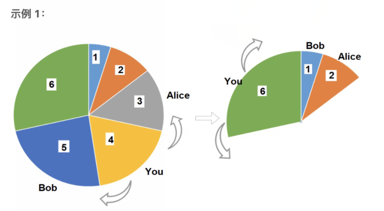

这一系列文章记录了我遇到过的一些 **趣题**。

| 文章内容                                                     | 简介                                                       |
| ------------------------------------------------------------ | ---------------------------------------------------------- |
| [奇思妙想](https://jiangshibiao.github.io/Interesting-Problems-Fancy-Idea/) | 数学和计算机领域，通过小小思考后能豁然开朗的趣题。         |
| [概率和期望](https://jiangshibiao.github.io/Interesting-Problems-Probability/) | 数学和计算机领域，与概率和期望相关的趣题。                 |
| [算法题精选-1](https://jiangshibiao.github.io/Selected-Problems-from-ACM-ICPC-1/) | OI/ICPC 向的算法题，去其琐碎、留其精髓，望博君一笑。       |
| [算法题精选-2](https://jiangshibiao.github.io/Selected-Problems-from-ACM-ICPC-1/) | OI/ICPC 向的算法题，相比上一期题意更简洁，出处往往不可考。 |

## CEOI 2006 ANTENNA

**题意**：给出平面上的 $n$ 个点，求一个最小圆使其能覆盖至少 $k$ 个点。$n \le 500$。

**题解**：二分答案。依次枚举每一个点作为圆周上的点，此时合法的圆心位置是一个圆，别的点如果落在圆里则对应一段圆弧，排序后求交即可。复杂度是 $O(N^2\log N\log ans)$，[Claris 博客](https://www.cnblogs.com/clrs97/p/5758892.html) 里也用了这种做法。

交换顺序，先枚举点再二分。每次先 check 当前的 $ans$ 是否合法，如合法再继续二分。当我们打乱所有点后，期望只有 $O(\log N)$ 个点使答案下降，所以优化后复杂度是 $O(N^2\log N+N\log N \log ans)$。

## ICPC World Final 2006 J Routing

**题意**：给出 $n$ 个点的有向图，求从 $1$ 走到 $2$ 再走回 $1$ 最少经过多少个点（可重复经过点）。$n \le 100$。

**题解**：这题一眼看上去非常像 NP Hard 问题，实际是可解的。设 $f_{i,j}$ 表示从 $1$ 出发抵达 $i$，从 $j$ 出发回到 $1$ 最小经过的点数，有初值 $f_{0,0}=0$，我们要求的就是 $f_{2,2}$。一个非常自然的转移方程是：
$$
f_{i,j}=\min \left(\min_{k \rightarrow i} \left(f_{k,j}+[k \ne j] \right),\min_{j \rightarrow k} (f_{i,k}+[i \ne k]) \right)
$$
这种 DP 在一个环上的转移是没问题的：可以想象从 $f_{1,1}$ 出发，沿着含有 $1$ 的一个环上转移，最后从环的一个出点 $u$ 开始以 $f_{u,u}$ 向外圈的环拓展。但如果向外扩展的不是点而是边，转移就会发生问题。下图就是个例子，考虑在 $(1 \rightarrow 3 \rightarrow 4 \rightarrow 5 \rightarrow 1)$ 的环的 $(3 \rightarrow 4)$ 边上插入了 $(4 \rightarrow 2 \rightarrow 3)$ 构成了一个子环。计算 $f_{3,4}=3$ 没问题，但计算 $f_{4,3}$ 时我们会从 $f_{4,4}+1$ 和 $f_{3,4}+1$ 里取最小值，得到答案 $5$（比预期多了 $1$ 个点）。

```Mermaid
graph LR
	1-->3
	3-->4
	4-->1
	4-->2
	2-->3
```

这种场景我们会重复利用 $(3,4)$ 这条边时答案变大。形式化地来说，计算 $f_{i,j}$ 时，可能出现 $1 \rightarrow i,j \rightarrow 1$ 的路径在 $(i,j)$ 处做了交换。预处理 $shortest_{i,j}$ 表示 $i \rightarrow j$ 的最短路，我们为 $f_{i,j}$ 新增一种转移来解决：
$$
f_{i,j}=\min(f_{i,j},f_{j,i}+shortest_{j,i}-1)
$$
上述这个动态规划就是整道题的标解，转移用类似 BFS/Dijkstra 的方式按 $f$ 的值从小到大确定即可，时间复杂度 $O(n^3)$。相信大家都有一个疑问：求出来的 $f_{i,j}$ 和答案 $f'_{i,j}$ 一定满足关系 $f_{i,j} \ge f'_{i,j}$，但怎么证明这种转移是完备的呢？下面给出一种意识流的解释：注意到 无向图/有向图 的 点双连通分量/强连通分量 存在充要的 **耳分解**，每一个耳是挂在一个点 $u$ 上的环或挂在一段路径 $(u,v)$ 两端上的路径（开耳），本题就是沿着耳分解进行转移的。

这题能够把点权拓展到自然数，此时我们必须要用堆的方式保证转移顺序，复杂度降为 $O(n^3\log n)$。注意转移时有 $O(n^2)$ 个修改和 $O(n^3)$ 个查询，把堆操作改为修改时 $O(n)$ 扫一遍维护即可把复杂度降为 $O(n^3)$。

## CERC 2012 Non-boring Sequence

**题意**：给出一个长度为 $n$ 的数字串，问是否所有区间都满足：至少有一个数在区间出现正好一次。$n \le 10^6$

**题解**：对于最大的区间 $[1,n]$，至少得存在一个数 $x$ 使得 $x$ 在 $[1,n]$ 里出现一次，否则回答就是 No。假设我们找到了 $x$，那么所有跨过 $x$ 的区间也符合要求，只需分别判定 $[1,pos_x-1]$ 和 $[pos_x+1,r]$ 是否合法。

很自然想到分治。设 $f_{l,r}$ 表示判定 $[l,r]$ 范围内所有区间是否都满足要求。预处理 $pre_i,succ_i$ 表示上/下一个与 $a_i$ 权值相同的数的位置。每次枚举 $i \in [l,r]$，若 $pre_i<l \land succ_i>r$，则停止枚举并分治 $f_{l,i-1}$ 和 $f_{i+1,r}$。

上述分治的复杂度显然是 $T(N)=O(x)+T(x)+T(n-x)=O(N^2)$。考虑一个 **看似很蠢** 的优化：$i$ 不从一端开始枚举，而是从两端交替枚举。这样复杂度变成了 $T(N)=O(\min(x, n-x)+T(x)+T(n-x))$。

如何证明上述复杂度？把分治的过程想象成一棵二叉树，正好有 $N$ 个叶子结点和 $N-1$ 个非叶结点，每个非叶结点的耗时是 $2\min(x,n-x)$，我们的目标是计算非叶结点上的耗时之和。把 $2\min(x,n-x)$ 均匀分配到较小子树的每个叶子上（每个叶子分配到 $2$），转为对叶子求和。对每个叶子从下到上考虑，每当代价加一次，整棵子树的大小至少翻一倍（类似于启发式合并），所以代价只会加 $O(\log N)$ 次。总复杂度 $O(N\log N)$。

## NOIP 2012 D2T2 借教室

**题意**：有一个长度为 $N$ 的序列，每一个位置初始时都是 $0$，且有一个 $d_i$。有 $M$ 个操作，每次对 $[l_i,r_i]$ 执行区间加 $c_i$ 的操作。问最早第几次操作让至少有一个位置超过了上限。$N,M \le 10^6$。

**题解**：有两个显然的 $O(N \log N)$ 做法。一个是直接用线段树维护区间修改、全局最小值，等到 $\min < 0$ 时就停止；一个是二分操作次数后使用差分数组，做到线性求出每一个位置的当前值。

还有一种 $O(N+M)$ 的神奇做法。原理是：在差分数组的基础上尝试去掉二分。

首先利用差分数组把所有操作都做一遍。顺次检查每个位置 $i$，并维护一个当前最大可行操作的 $j$（$j$ 初始值是 $m$，可能会不断递减）。每到一个新的 $i$ 就累加出目前的 $sum$（$1 \sim j$ 操作下 $a_i$ 的真实点权）。如果 $sum$ 一直超过上限 $i$ 的上限就不断地 **回退** $j$（取消 $[l_j,r_{j+1}]$ 两点的差分值，若该区间覆盖 $i$ 则更新 $sum$）。

## Codeforces 526 E ZeptoLab Code Rush 2015

**题意**：给出环上 $N$ 个正整数。分成尽量少的段，使每段长度和 $\le L$。多次询问。$N \le 10^6,Q_L \le 50$。

**题解**：可以利用倍增做到 $O(N \log N)$，下面给出一个不需要算法的优美线性做法。

倍长环，对每个 $i$ 预处理出以其为开头的同块最远端 $R_i$。随便选一个点作为环的起点，求出该起点下的最优划分方案。假设被分成了 $M$ 块，找到里面最小的一块，显然元素个数 $\le \frac{N}{M}$。枚举该块里所有点当做起点并类似地 check。每次 check 时利用 $R$ 数组跳跃，步数不会超过 $M+1$，因为正整数情况下分配有单调性，再不济也能贴着原方案分。复杂度 $\frac{N}{M}(M+1)=O(M)$。

## Codeforces 题号等一手有缘人提供

**题意**：给出 $n$ 个正整数，求重排后 $a_1 \mod a_2 \mod a_3 \mod \dots \mod a_n$ 的最大值。$n,a_i < 2^{16}$。

**题解**：先把 $a_i$ 从小到大排序，答案一定 $\le a_1$。若 $a_1 <a_2$，答案正好就是 $a_1$，因为只要以排序后的顺序构造就行。难的是 $a_1=a_2$ 的情况，直接取模会变成 $0$，我们想利用后面的数构造出非 $0$ 值。

设 $cnt_x$ 表示读入数据里是否存在 $x$，$f_x$ 表示 $x$ 是否能被我们构造出来。从大到小枚举每一个数 $x$，我们想探究 $f_x$ 是否能为 $1$。显然如果 $cnt_x=1$ 则 $f_x=1$，否则我们只能用更大的数把 $x$ 给凑出来，即我们想找到任意一个 $z>x$ 满足 $f_{z}=1,\exist y~~cnt_y\wedge z \mod y=x$。无需担心我们在构造 $z$ 或者以前的数字时已使用过 $y$，因为合法的 $y$ 满足 $z \ge y>x$，之前必然没用过。计算完所有 $f_x$ 后，找到满足 $x<a_1$ 且 $f_x=1$ 的最大的 $x$ 即为答案，因为一旦构造出了这个数字，我们立刻把剩下没用过的数字放在它后面即可。暴力的复杂度是 $O(N^3)$。

从大到小枚举 $x$ 时，同时用调和级数维护 $g_y$ ：$g_y=1$ 当且仅当 $y$ 是某个输入里 $\ge x$ 的数的倍数。$g_y$ 和 $f$ 都用 bitset 表示。当我们想确定 $f_x$ 的值时，只需观察 $(f>>x)~\&~g_y$ 是否非空即可。复杂度 $O(N^2/64)$。 

## ZJOI 2016 旅行者

**题意**：$n$ 条东西向道路和 $m$ 条南北向道路交叉形成了 $n \times m$ 个格点。每个点到周围点有一个代价 $c(i,j)$ 或 $r(i,j)$，道路是双向的。$q$ 组询问，问从 $(x_1,y_1)$ 到 $(x_2,y_2)$ 的最短路。$n\times m \le 2 \times 10^4,q \le 10^5$

**题解**：用分治去解决。考虑在矩形 $[1,1,n,m]$ 中画一道横着的直线 $(x,1),(x,2),\dots,(x,m)$。

+   不跨过直线的点对可分治下去解决。
+   跨过直线的询问一定会经过 $(x,y_i)$。我们不妨枚举直线上的每一个点当做起点做一遍最短路，则跨过直线的询问可通过枚举必经点 $i$ 来求得最小值。假

设 $S=nm$，则 $min(n,m) \le \sqrt S$。我们分长边。每一层分治耗时 $T(S)=2T(S/2)+O(S\sqrt S \log S)$，由主定理可得 $T(S)=O(S\sqrt S \log S)$。询问总耗时 $O(Q\sqrt S)$，总时间复杂度为 $O((Q+S\sqrt S)\log S)$。


## GP of Poland 2017 D

**题意**：给出 $n$ 个元组 $(a_i,b_i)(a_i,b_i >0)$，第 $i$ 个在第 $j$ 天的代价是 $a_ij+b_i$。在 $1 \sim m$ 天各选择一个元组（不能重复），使得总代价最小。$m \le n \le 10^6$。

**暴力做法**：把所有元组按 $a_i$ 降序排序，最终选的 $m$ 个元组的天数顺序一定符合序列的顺序。维护前 $i$ 个集合里选 $k$ 个元组的最小代价值 $f_{i,k}$。加入 $(a_i,b_i)$ 后 $f_{i,k}=\min(f_{i-1,k},f_{i-1,k-1}+(a_ik+b_i))$。复杂度 $O(N^2)$。

**性质一**：设集合 $S(i,k)$ 为前 $i$ 个元组选择 $k$ 个的最优集合，则 $S(i,k) \subset S(i,k+1)$。反证即可。

**性质二**：$f_{i,k}$ 在更新时，一定存在分界线 $t$，使得 $f_{i,1..t}$ 均未被更新，但$f_{i,t..i}$ 均被更新。

**性质二证明**：反证。假设存在 $p<q$ 使得 $f_{i,p}$ 被 $(a_i,b_i)$ 更新但 $f_{i,q}$ 没有被更新。根据性质一，$S_{i,p} \subset S_{i,q}$。设 $f_{i,p}$ 里某个数 $x$ 被替换成了 $i$ 变优了，我们在 $f_{i,q}$ 里同样把 $x$ 变成 $i$，$f_{i,q}$ 也能被更新。矛盾。

**最终做法**：用 splay 实时维护 $f$ 函数，要支持树内二分、插入和区间加。复杂度 $O(N \log N)$。

## 2018 ICPC Qingdao Regional J

**题意**：有 $N$ 本书，第 $i$ 本书的价格是 $a_i(0 \le a_i \le 10^9)$。买书的策略是：一开始携带 $X$ 元，顺次枚举书能买就买。已知一共成功买到 $M$ 本书（$0 \le M \le N$），问 $X$ 最大能是多少。

**题解**：从前到后考虑每一本书，先假设 $a_i > 0$。如果 $a_i \ge a_{i+1}$，因为求 $X_{max}$，我们显然优先选 $a_i$；如果 $a_i \le a_{i+1}$ 且我们想买 $a_{i+1}$，不得不先买掉 $a_i$。综上，买到的 $M$ 本书一定是前 $M$ 本。

$$X=\sum \limits_{i=1}^{M} a_i + \min \limits_{i=M+1}^N \{a_i\}-1$$

还需要特判所有 $a_i=0$ 的书，它们会被强制买上。

## Leetcode 1388. 3n 块披萨

**题意**：环形的蛋糕被切成了 $3n(n \leq 500)$ 份，每份有一个大小 $a_i$。你和 Alice、Bob 一起取蛋糕。每轮你先选一块，然后 Alice 和 Bob 分别取逆时针和顺时针的下一块。问你取的 $n$ 份蛋糕大小之和最大能是多少。



**题解**：设 $f_{i,j}$ 表示蛋糕 $i \sim j$ 这段的最优值，但是无法进一步转移。

破环成链，设 $f_{i,j}$ 表示前 $i$ 块里已经选了 $j$ 块的状态信息。验证能否按这种意义合并状态。

+ 首先，我们不可能选到紧挨着的两块。
+ 假设我们选了第 $1$ 块。除了第 $2$ 块以外，我们将额外消耗掉之前的那块（也就是末尾那块）。
+ 额外消掉的块会累计。如果我们选了第 $1,3,5$ 块，我们将额外消掉之前的三块。
+ 额外消掉的块可以减少。如果我们选了第 $1,3,5,9$ 块，可以通过先取 $9$ 再取 $5,3,1$ 的操作，将消掉开头的需求转移到中间的空白部分来。我们有理由预测：$(i,j)$ 状态的设计是有意义的，而且对于每一种 $(i,j)$ 状态，我们都可以优先消耗内部，使得额外消掉之前的块数尽量少（也能算出具体值）。

经过上面的分析其实可以直接完善 DP 的设计和转移了，但是我们不妨再深入思考一下：

+ 首先，我们还是不能选任何紧挨着的两块。
+ 如果有一块全都是间隔 $1$ 选的，那必然有一段有很多空白，我们可以优先选那里。

**结论**：只要不选紧挨着的两块，任何方案我们都能取到！用过构造来证明：每轮优先取空白数量最多的那一段的左侧/右侧的点，然后重复此操作。所以就能设计出一个简洁的 $O(N^2)$ 的动态规划了。

**后记**：我记得最初是在 Google Kickstart 上做到的，[力扣](https://leetcode.cn/problems/pizza-with-3n-slices/) 上有复杂度更低的贪心和 DP 做法。

## 2019 ICPC HK Regional D

**题意**：考虑这么一个问题：有一棵 $N$ 个点的带点权的有根树，$c_i$ 表示在点 $i$ 放置守卫的代价。敌人会从所有叶子登陆向根进攻，你必须在每个叶子到根的路径上至少放置一个守卫。问最小总代价以及方案数。现在，给出总方案数 $K(K \le 10^9)$，让你构造这棵树以及 $c_i$。

**题解**：考虑一棵二叉树 $(x,y_1,y_2)$，如果 $c_x=f_{y_1}+f_{y_2}$（$f_y$ 表示把 $y$ 子树堵住的总代价，$g_y$ 表示对应方案数），那么在 $x$ 放和在 $y_1,y_2$ 子树里放都是可行的，且方案数 $g(x)=g(y_1) \times g(y_2)+1$。

我们希望用这种结构去适配所有 $K$。我们把 $y_1$ 构成一棵两个点的、$g(y1)=2$ 的数。如果 $K$ 是奇数，就设 $c_x=f_{y1}+f_{y_2}$，否则设 $c_x=+\infty$。然后在往 $y_2$ 里递归即可。点数和复杂度为 $O(\log K)$。

## 2019 ICPC HK Regional H

**题意**：有 $n$ 个观测台和 $m$ 个操作。初始时每个观测台看到的星星数是 $0$。操作分为两种：新增一个订单，给出 $k(k \le 3)$ 个观测台的编号，要求它们能看到的星星数量之和 $\ge v$；观测台 $i$ 上能看到的星星数量增加 $v$，并打印所有刚好在此刻满足要求的订单编号。强制在线。$n,m \le 2 \times 10^5,v \le 10^6$。[原题详见此](https://codeforces.com/gym/102452/problem/I)。

**标准题解**：这类题目的做法被称为 **折半警报器**。注意到某个订单完成后，其至少有一个观测台上的星星数量不低于 $\lceil \frac{v}{k} \rceil$。新增订单时，我们在其观测台上挂上一个阈值为 $\lceil \frac{v}{k} \rceil$ 的报警器，即当未来其星星数量达到这个阈值时，我们就会检查对应的订单。即使检查失败，剩余数量至少减少到原来的 $\frac{k-1}{k}$，即最多 $O(\log_{3/2} V)$ 次后结束。我们可以在每个观测台上维护一个小根堆，每次符合要求的那些阈值，总复杂度 $O(mk \log n \log V)$。

**强化题解**：周康阳在其 [博文](https://www.cnblogs.com/zkyJuruo/p/18668862) 中提出了一种 **二进制警报器**，能让本题的复杂度降至 $O(n+mk \log V)$。订单进来时同样去每个观测台设置阈值，设置的方式略有不同，是找到最小的 $h$ 满足：当每个观测台的值向上提高到（最小的） $2^{h+1}$ 的倍数时，星星数量加起来能够满足订单要求。我们能够证明，对于已设置的一个阈值 $h_0$，其至多触发 $O(k)$ 次报警后一定会下降，所以总变化次数是 $k \log V$。此时我们无需再维护小根堆，而是基于 $(i,h)$ 的二元组用 vector 维护报警阈值，每次触发时能够线性查找和增加，所以总复杂度就降至 $O(n+mk \log V)$。

## Codeforces 选数问题 From 300iq

**题意**：有 $N(3 \times 10^5)$ 个互不相同的整数，要在其中选择至少 $\frac{N}{3}$ 个，使得任意被选的两数之和都没有被选。

**题解**：先假设这些数在值域 $[0,V]$ 之间均匀分布。选出所有出位于 $[\frac{V}{3}, \frac{2V}{3})$ 的数即可满足要求，而且它们的个数接近 $\frac{N}{3}$。如何防止被卡？每次随机一个概率 $p \in (0,1]$，然后对 $a_i$ 做一步 $b_i = [p \cdot a_i]$，对 $b_i$ 去选择。每一次期望选到的数的个数是 $\frac{N}{3}$，多随机几次即可。

## 2020 牛客多校 #4 A

**题意**：给一个有根树，在树上选择 $k$ 个关键点（根必须选）。最小化点到最近关键祖先距离的最大值。要对 $k$ 为 $1,2,\dots,N$ 时分别求出答案。$N \le 2 \times 10^5$

**初步题解**：如果只有单组询问，就是一个经典的二分+树上贪心的题目：验证 $x$ 时，我们每次选一个当前最深的还未覆盖得到点，并将其 $x$ 级祖先的整个子树全都覆盖。重复此操作直到全被覆盖。

**性质**：假设当前要求距离为 $x$ 时需要的关键点个数 $f(x)$ 时，我们有 $f(x)\le \lceil \frac{N}{x+1} \rceil$。因为按照上面的做法，每次至少移除 $x+1$ 个节点。也就是说 $f(x)=O(\frac{N}{x})$，$\sum \limits_{x=1}^nf(x)=O(N\log N)$。

**题解**：当我们枚举每一个 $x$ 求答案时，如果我们用合适的数据结构来模拟我们的贪心过程，使得每次的复杂度不是 $O(N)$ 而是 $O(f(x) \log N)$，那么总复杂度就是 $O(N \log^2 N)$ 了。该数据结构需要支持：

1.  求最深的未被覆盖的点。
2.  向上跳 $x$ 级祖先，并覆盖整个子树。
3.  快速清零进行下一个询问。

在树的 DFS 序上建立线段树能完成上述所有操作。

## 2020 牛客多校 #4 D

**题意**：把一个数字串划成若干段（至少两段），使得（每一段形成的十进制数字中）最大值和最小值的差尽量的小。注意不能有前导 0。 $N \le 10^5$ 

**性质**：答案不会超过 $9$，因为我们可以全部拆成一位数。

**题解**：基于结论，还有两种方法能优化答案，一是拆成所有位数一样的数字，二是位数最多相差一位。

+   对于第一种情况，我们可以枚举 $N$ 的所有约数暴力 check 一遍。
+   对于第二种情况，答案只可能由 $99\dots9x$ 或 $100\dots0y$ 构成，其中 $x=[2..9],y=[0..7]$。满足这样构型的解只有 $O(1)$ 种，我们在原串里做一遍扫描即可。建议用 $100\dots0y$ 去锁定格式，因为 $999\dots99$ 可能会被划成多段，存在不确定性。此外 $1y$ 和 $x$ 的构型也要特判一下，此时没有 $0$ 和 $9$ 的提示。

## 2020 牛客多校 #4 E

**题意**：有 $N$（$N$ 是奇数） 个互不相同的数。每轮选连续三个数，只将它们的中位数保留；重复上述操作直到剩下一个数字。对于每一个数字 $x$ 都询问：是否存在一种流程，使得最终剩下的数是 $x$。$N \le 10^6$

**转化**：枚举每一个 $x$，把大于它的数写成 $1$，小于它的数写成 $0$。我们着眼于消除这个 $01$ 序列。

**性质1**：如果一个 $01$ 串 $0$ 和 $1$ 的个数相等，它最后总能消成 $01/10$。因为我每次可以去掉紧挨着的 $01$。

**性质2**：$x$ 会把整个序列分隔成左右两个部分（形如 $01\dots11~x~01\dots10$）。我们可以先把两侧视为独立问题，消除到最多剩两个数字，最后再考虑横跨 $x$ 的消除。

**分类讨论**：用上性质 2 后，最终能剩下 $x$ 需要满足下列至少一个要求：

1.  左测消除至 $0/00$ ，右测消除至 $1/11$。
2.  左测消除至 $1/11$ ，右测消除至 $0/00$
3.  左测消除至 $01/10$ 或消光，右测消除至 $01/10$ 或消光。

**如何判断前两种情况**：我们以剩下 $0$ 为例。核心想法是尽量凑三个 $1$ 进行消除，使得 $0$ 剩下的更多。从左到右贪心扫描，维护前缀 $0$ 的个数 $x$ 以及紧接着一段连续 $1$ 的个数 $y$（$y$ 的取值是 $[0..2]$，因为一旦 $\ge 3$ 会立刻消除）。如果新来的数是 $0$ 且 $y$ 有值，带来的效果就是 $y-1$（相当于这组 $01$ 被迫被消掉，以利于 $y$ 和和后面的 $1$ 合并）。做到最后如果 $x>y$，那么能留下全 $0$。

**如何判断第三种情况**：不妨设目前 $0$ 的个数小于 $1$ 的个数。我们先套用上述贪心使得 $1$ 的个数不断减少。由性质 1，如果某一时刻 $0$ 的个数等于 $1$ 的个数了，说明最终能剩下 $01$ 或消光。

**进一步优化**：上述做法是 $O(N^2)$ 的，因为我们要依次枚举每一个 $x$ 并判断。现在考虑从小到大枚举 $x$，这样每次有一个 $1$ 会转变成 $0$。暴力维护从 $1$ 到 $i$ 的贪心前缀 $(x_i,y_i)$，并套用上述的分类讨论求得答案。

每当第 $k$ 个数从 $1$ 变 $0$ 时，观察 $(x_i,y_i)$ 整个序列的变化情况：要不需要修改的位置是 $O(1)$ 的，要不对于所有 $i \ge k+2$，$x_i$ 都至少增加了 $1$。又因为 $y_i \le 2$，所以一旦 $x_i \ge 3$ 后 $k+2,k+3\dots N$ 的所有位置都可以不作考虑（均合法）。 所以 $(x_i,y_i)$ 序列的均摊总变化是 $O(N)$ 的。

## Zimpha 2020 Noi.ac Contest A

**题意**：有一个字符串 $S$ 和一个空字符串 $P$。可以执行如下两种操作：在 $P$ 后面加入一个字符；删除 $P$ 的最后一个字符。 每次操作完毕，$P$ 在 $S$ 中所有的匹配位置都会被高亮。求能够使得 $S$ 里每个位置都被至少高亮过一次的最小操作次数。$|S| \le 2 \times 10^5, |\Sigma| \le 26$

**简单结论**：答案步数不会超过 $2|\Sigma|-1$，因为总能用单个字符的增删去覆盖整个串。

**进一步结论**：一定存在一个最优的操作序列类似：加一个字符，删一个字符；加一个字符，删 一个字符；……；加字符，加字符，……，加字符。也就是说除了最后连续的加字符，其他任意时刻，$T$ 要么是空串，要么是一个字符。证明可以使用调整法。

假设某个最优操作过程删字符前的字符串依次为 $x_1, x_2, \dots, x_k$ 。考虑 $x_1$ 和 $x_2$ 的最长公共前缀长度 $l$：

+   如果 $l = 0$，显然我们需要执行 $|x_1|$ 次加和 $|x_1|$ 次删，才能便会成空串。这个不如直接搞成把 x1 的每个不同的字符加一次，删一次，答案肯定不会变劣。
+   如果 $l \ge 1$，考虑 $x_1$ 中除去最长公共前缀的部分。显然可以把里面每个不同字符拿出来加删一次。

依次类推，我们可以把 $x_1, x_2, \dots, x_{k-1}$ 都拆成单个字符。

**题解**：根据以上结论，我们可以在后缀自动机枚举所有长度不超过 $2|\Sigma|-1$ 的子串，复杂度 $O(|S||\Sigma|)$。

## 2020上海高校程序设计竞赛 D

**题意**：有一张 $N$ 个点 $M$ 条边的有向图和 $Q$ 个询问，每次询问能否从 $u$ 走到 $v$。有向边边和询问都是由一个 $\mathrm{rand()}\%n$ 的 pair 随机得到。 $N \le 10^5, M \le N+5000, Q \le 3 \times 10^5$。

**题解**：最开始想到的是首尾同时 BFS 的 trick。但此图的最短路很大，这样做依然会超时。

网络赛的通过率很低。过的代码都是先进行 tarjan 缩环，然后采用以下两种方法之一：

+   挑出对出度前 $\sqrt N$ 大的点，预先对它们做 BFS 并记忆化，后续遇到这些点时可以直接跳过。
+   把相同起点（位于相同强连通分量）的询问并在一起 BFS。

zimpha 给出了一种 **不需要随机条件** 的做法。求完 SCC 后，先假设所有有效边都是无向的。树的情况能很快排除，然后我们再把一般图里度数等于 $2$ 的点都缩掉。剩下的图里最多有 $2M$ 个点，我们可用经典的 bitset 在 $O(\frac{(2M)^2}{64})$ 复杂度里处理两两点对的可达性。注意缩点后还有一个复原答案的操作，细节有点多。

还有一个有关随机图的 [补充知识](https://en.wikipedia.org/wiki/Giant_component)。假设一张图的所有边都是独立地以 $p$ 的概率生成的：

+   如果 $p \le \frac{1-\epsilon}{n}$，生成的图会包括很多小连通块，每一个的大小是 $O(\log N)$ 的。
+   如果 $p \ge \frac{1+\epsilon}{n}$，生成的图会包括一个大连通块和若干个大小是 $O(\log N)$ 的小连通块。
+   如果 $p=\frac{1}{n}$，生成的图里的最大连通块个数和 $n^\frac{2}{3}$ 成正比。

## ZJU 2020 Summer Camp Phase 2 Contest 7 D

**题意**：有 $n + 1$ 种物品，体积分别为 $0, 1, \dots, n$，价值分别为 $w_0,w_1, \dots, w_n$，每种物品的数量都是无限的。 $m$ 个询问，每次给定 $k$ 和 $v$，你需要选择恰好 $k$ 个物品， 使得总体积模 $n + 1$ 恰好为 $v$，且总价值最大。$n,k,v \le 1500, m \le 10000$

**题解**：设 $f_{i,j}$ 表示选择 $i$ 个物品，体积模 $n + 1$ 为 $j$ 的最大价值。直接转移是 $O(N^3)$ 的，不太行。

注意 $f$ 的转移满足结合律，所以我们不必对于所有 $i$ 都计算出 $f_i$。

具体地，取 $K = \lceil \sqrt N \rceil$，则对于询问 $q$，我们把计算 $f_q$ 拆成如下两部分 $f_q = f_{\lfloor \frac{q}{K} \rfloor K} \oplus f_{q \mod K}$。 同时预处理出 $f_0, f_1, \dots, f_K$ 以及 $f_K, f_{2K}, \dots, f_{K^2}$，复杂度 $O(N^{2.5}+NM)$

## ZJU 2020 Summer Camp Phase 2 Contest 7 G

**题意**：给定一个 $n$ 个点 $m$ 条边的 DAG，由 $q$ 次询问。 每次给定一个点集 $S$，问仅保留 $S$ 中的点时图中有多少条不同的路径。$n,q \le 10^5,m,\sum |S| \le 2 \times 10^5$。

**题解**：这种操作只能逐边逐点的进行计数，所以重点在怎么优化枚举上。

对于一个大小为 $K$ 的询问，除了 $O(M)$ 的全图 DP，我们还可以做到 $O(K^2)$（两两枚举合法的边进行 DP），所以单次复杂度是 $\min\{M,K^2\}$。如果我们采取了这种简单的 trick，考虑构造出最糟糕的数据。如果 $M < K^2$ 会浪费我们的 $\sum |S|$，而 $M \le K^2$ 时最坏复杂度就是 $O(QK)$，当 $K$ 取到 $\sqrt M$ 时是根号级别的。

标程给出了一种常数更小的做法（因为 $O(K^2)$ 过程中我们需要检查每条边是否存在，有类似于哈希的步骤）。先考察我们 dp 的细节，设 $f_x$ 表示所有点到 $x$ 的总方案。注意对于一条边 $x \to y$，我们既可以枚举 $x$ 的出边从 $f_x$ 正向地推过去，也可以反着枚举 $y$ 的入边推过来。我们的策略是：对于边 $x \to y$，我们在 $d_x$ 小的那一侧枚举边（注意这里是枚举全图的边，观察边是否落在集合 $S$ 里再 DP）。 

## ZJU 2020 Summer Camp Phase 2 Contest 9 A

**题意**：设 $f(x,y)$ 为十进制加法 $x+y$ 时产生的进位次数。求 $\sum \limits_{i=1}^n \sum \limits_{j=i+1}^n f(a_i,a_j)$。$n \le 10^5$。

**题解**：考虑如何拆分每一位。第 $k$ 位的贡献是 $[a_i \mod 10^k + a_j \mod 10^k \ge 10^k]$。这样我们可以把为一位视作独立问题，分别枚举后使用排序+双指针统计答案。复杂度 $O(N \log N \log W)$。

## ZJU 2020 Summer Camp Phase 2 Contest 9 F & 2020 HDU 多校 #10-1010

**题意**：考虑一个 $3 \times 3$ 的格子，每个格子上有正数个石子。Alice 和 Bob 轮流取石子，每次只能在某一堆石子里取正数个石子。当某一行或者某一列的石子全为空时，最后一个取石子的人获胜。还有一个额外要求是：Alice 和 Bob 在各自的第一轮取石子时必须取光完整的一堆。

**题解**：注意 $3 \times 3$ 的绝对顺序不影响答案，通过枚举后我们可以设 Alice 首先取光了 $(1,1)$。如果此时 Bob 取（光）了 $(1,x)$ 或者 $(x,1)$ 他就输了（Alice 取光那一行/列剩下的那堆石子），所以他的决策只有四种。我们接着枚举，不妨假设 Bob 取光了 $(2,2)$。

此时对于 $(1,2),(1,3),(2,1),(2,3),(3,1),(3,2)$ 这六堆石子，如果有一个人第一次取到了某堆石子的最后一颗，他就必输（另一个人可以立刻取光对应行列的剩下那堆）。而 $(3,3)$ 是可以随便取的。问题转化成在 $a_{1,2}-1,a_{1,3}-1,a_{2,1}-1,a_{2,3}-1,a_{3,1}-1,a_{3,2}-1,a_{3,3}$ 里进行 nim 游戏。

## **字节跳动 2020 笔试**

**题意**：有一个长度为 $L$ 的棒子，每次沿长度等概率选取一个切分点砍成两半并保留左侧，直到长度 $\leq d$ 时停止。问期望切的数目。

**题解**：注意这是在实数域上的 dp，所以我们列出微分方程来求解：$f(L)=\frac{1}{L}\int_d^Lf(x)dx+1$。两边求导得 $xf'(x)+f(x)-1=f(x)$，解得 $f(x)=\ln x+C$。再带入 $f(d)=0$ 即可。

## 字节跳动 2020 笔试

**题意**：有一个长度为 $N$ 的数字序列，每个数最终需要被操作 $a_i$ 次。每轮可以选取一个区间 $[l,r]$ 并把 $l \sim r$ 的所有数字都操作一遍，把所有轮的操作区间写成一个操作序列。交换位置后能够一样的操作序列是互相等价的，比如 $\{[1,2],[3,4]\}$ 和 $\{[3,4],[1,2]\}$。还有一个额外条件：**一个操作序列里的所有 $l$ 和所有 $r$ 都要两两不等。**

**题解**：注意这是在实数域上的 dp，所以我们列出微分方程来求解：$f(L)=\frac{1}{L}\int_d^Lf(x)dx+1$。两边求导得 $xf'(x)+f(x)-1=f(x)$，解得 $f(x)=\ln x+C$。再带入 $f(d)=0$ 即可。

## 阿里云 2020 超级码力复赛 D

**题意**：$N$ 个人参加选美比赛想决出冠军，假设每个人的实力两两不同且是一个定值。每次可以取任意 $k$ 个人进行小组赛，耗时 $pk+v$。假设裁判足够多，即小组赛可以并行。小组赛的胜者们重复此过程直到只有一个人剩下。问最少花多少时间决出冠军。$p,v \le 1000,n \le 10^{15}$。

**题解**：每次平均分肯定是最优的。

正常的思路是：设 $f_i$ 表示 $i$ 个人参赛的最少用时，则 $f_i=\min\{f_j+p \cdot \lceil \frac{i}{j} \rceil +v\}$。对于固定的 $i$，有用的 $j$ 只有 $O(\sqrt N)$ 的。如果式子里是下取整，有性质保证 $N$ 的所有因子（包括多次下取整后的）也只有 $O(\sqrt N)$ 个，但是现在并没有这个性质。而且转移复杂度也很难优化。

观察到 $f_i$ 一定是严格递增的，所以我们可以考虑反着 dp。设 $f_t$ 表示用时不超过 $t$ 的情况下最多能完成多少人比赛。那么我们有 $f_t=\max\{f_{t-jp-v}\times j\}$。即使每次乘 $2$ 的话 $t$ 的上界也只是 $O(\log N)$ 级别的。

## NOIP 2021 T3

**题意**：给出一个长度为 $n$ 的单调不降的数组 $a_1 \le a_2 \le \dots \le a_n$。每次可以选择一个位置 $1<i<n$，把 $a_i$ 改成 $a_{i-1}+a_{i+1}-a_i$。可以做无数次这样的操作，使得最后整个数组的方差最小。输出最小方差乘 $n^2$ 之后的值。$n \le 400,a_i \le 600$ 或 $n \le 10000, a_i \le 50$。

**题解**：套用 $D(x)=E(x^2)−E^2(x)$ 的结论，要求的方差乘 $n^2$ 等价于 $D=n\sum a_i^2-(\sum a_i)^2$。

我们对这个操作进行等价变换：设差分数组 $d_1=a_1,d_i=a_{i+1}-a_i(i>1)$，修改操作等价于交换两个相邻的 $d_i$。由冒泡排序性质，这个操作能重排整个数组。所以本题等价于对 $d_i$ 进行重新排序，使得新数列 $\{a_i'\}=\{\sum_{i=1}^1 d_i,\sum_{i=1}^2 d_i,\dots,\sum_{i=1}^n d_i\}$ 的方差最小。

还要关注到一个结论。假设最终的最优解是数列 $a'_i$，且正好有 $a'_x=\frac{1}{n}\sum a'_i$（即 $x$ 位置处是平均数），则此时必然满足 $d_{x-1} \le d_{x-2} \le d_{x-3} \dots \le d_1$，且 $d_x \le d_{x+1} \le \dots \le d_{n-1}$。感性地来想，当我们不断向两侧拓展的时候，因为每个 $d_i$ 会影响到后续每一个 $a_i'$，我们肯定是优先分配小的，使得总方差最小。想要严格证明的话，可以使用反证法+调整法，把逆序的 $d_i$ 调整一下，答案一定会更优。

根据以上的等价变换和结论，我们可以最优数列的平均数位置开始考虑。从小到大枚举每一个 $d_i$，然后决策它要放到左边还是右边。我们再根据 $D$ 的式子设计 DP 方程。$D$ 的计算要同时用到 $\sum a_i^2$ 和 $\sum a_i$，所以很自然地把 $ \sum a_i$ 放到下标处，而 $\sum a_i^2$ 的最优值放到 DP 数组的内容里。设 $f_{i,dsum,asum}$ 表示：考虑了前 $i$ 小的差分数组 $d$，左侧的 $\sum d_i$ 是 $dsum$，且当前整个数列的总和是 $asum=\sum a_i$ 的状态下，最优的 $\sum a_i^2$ 是多少。转移的时候决策新的 $d_i$ 放到左边还是右边。

上述做法的空间和复杂度均为 $O(n \cdot m \cdot m^2)$（$m$ 是 $\max(a_i)$）。这个复杂度我们不太能接受，主要因为 $\sum a_i$ 的可能值太大了。注意到，$a_i$ 的相对大小是没有用的，所以我们可以设 DP 开始时的位置 $a_i=0$。这么做的好处是：往前放 $d_i$ 就$a_i<0$，往后放 $d_i$ 就 $a_i>0$，它们最终的和会在 $0$ 附近，且可以预期在 DP 过程控制在 $km$ 左右。 保险起见，可以把 $k$ 开大到适合整道题的时空限制。时空复杂度均为 $O(nkm^2)$。

如果没有推出上述的结论和性质，可以用爬山/模拟退火等方法骗分。每次直接枚举一个位置 $i$ 进行变换，如果能变优就变换过去。如果 check 的时候暴力计算方差，复杂度是 $O(Tn)$，其中 $T$ 是爬山/模拟退火的尝试次数。如果推出了 $D$ 的简化计算公式，复杂度降到 $O(T)$。数据很难造，应该能骗很多分。

## 2021 ICPC Macau Regional J

**题意**：一开始只有一个节点，颜色为 $C$。$Q$ 次操作，每次新增一个连向 $x$ 的颜色为 $c$ 的节点，边权为 $d$；或者把节点 $x$ 的颜色改成 $c$。每次操作完询问不同颜色点对之间的树上距离最大值。$Q \le 5 \times 10^5$。

**题解**：动态加点是虚的，可以先离线建好整棵树，只是一开始的点都是"未激活状态"，然后逐步激活。

先不考虑颜色（不妨设所有点的颜色均不相同），思考如何在"点一步步被激活"的情境下动态计算树的直径。注意到 $dist>0$，再结合直径的性质可以推出以下两个引理。

**点集加点引理**：假设我们已经知道了一个点集 $S$ 的树上最远点对 $(x,y)$。当 $S$ 中新增一个点 $p$ 时，只需求出 $(p,x),(p,y)$ 这两条路径长度，若超过原直径就替换原来的 pair。这样我们就能正确维护点集 $S$ 的最远点对。

**点集合并引理**：假设我们知道了两个点集 $S_1$ 和 $S_2$ 以及它们各自的最远点对 $(x_1,y_1),(x_2,y_2)$。当 $S_1,S_2$ 合并时，新集合 $S$ 的最远点对一定是原点对中的一个或者 $(x_1,x_2),(x_1,y_2),(y_1,x_2),(y_1,y_2)$ 中的一个。

如果我们用 $O(N\log N)-O(1)$ 的 ST 表预处理树上 LCA，那么以上维护方法支持 $O(1)$ 加点和 $O(1)$ 合并。

我们用线段树维护最远点对，下标是树上节点。一开始所有叶子都是未激活的；每激活一个点，就从线段树叶子开始一路合并到根。回答时直接回答线段树根节点的最远距离。单次操作的复杂度为 $O(\log M)$。

现在考虑颜色。先假设要求 **相同颜色** 的最远点对。对每种颜色 $c$ 开一棵线段树 $T_c$，叶子节点维护的是所有可能涉及这种颜色的树上节点（可以离线预处理，即若点 $x$ 在不同时间的颜色是 $c_1,c_2,\dots,c_t$，则它均会出现在 $t$ 种颜色对应的线段树上）。显然，所有线段树的叶子总和是 $O(M)$ 的。激活点或者修改颜色 $c$ 时， 只需在 $T_c$ 里修改叶子并向上合并到根，单次操作的复杂度为 $O(\log M)$。维护所有 $T_c$ 的根节点的距离最大值即可回答。

回到原题，要求 **不同颜色** 的最远点对。同样对每种颜色维护一棵线段树 $T_c$，但是额外维护一棵叶子数是 $M$ 的线段树 $G$。注意 $G$ 中的每个节点不仅要维护子树最远点对 $(x,y)$ 和对应距离 $dis$，还要维护"从不同颜色中选取的最远点对距离" $apart$。激活点或修改颜色时，当我们合并完 $T_c$ 后，将其根节点的信息 $(x,y,dis)$ 放到 $G$ 的叶子 $c$ 上，该叶子 $apart=0$。然后在 $G$ 中从 $c$ 开始向上合并，对于某个节点 $M$ 和它的左右儿子 $L,R$，有转移式：
$$
M.apart=max(L.apart,R.apart,d(L.x,R.x),d(L.x,R.y),d(L.y,R.x),d(L.y,R.y))
$$
回答时直接输出 $G$ 根节点的 $apart$ 即可。时间复杂度 $O(M\log M)$，空间复杂度 $O(M \log M)$（ST表）。

## 2022 京东第二届编程大赛复赛热身赛 B

**题意**：给出一张 $n$ 个点的有向图，边 $u \rightarrow v$ 表示如果选 $u$ 则必须选 $v$。问有多少种点集选取方案。$n \le 60$。

**题解**：每次从度数最大的点开始搜索。如果最大度数 $\le 2$ 显然只剩下环和链，直接计数即可。

**复杂度证明**：搜索过程中，考虑度数最大的点的入度 $in$ 和出度 $out$。如果枚举选了这个点，至少能删掉 $out+1$ 个点；如果不选这个点，至少会删掉 $in+1$ 个点。因为 $in+out \ge 3$，所以最坏情况下至少删掉 $1$ 个和 $4$ 个点，或者 $2$ 个和 $3$ 个点。前者能让复杂度更劣，即复杂度的递推式为  $T(n)=T(n-1)+T(n-4)$。

计算该递推式的复杂度就是解方程 $a^{n+4}=a^{n+3}+a^n$，解得 $a=1.38$，最终复杂度为 $1.38^nn^2$。

## 2022 京东第二届编程大赛决赛 I

**题意**：$n$ 个机器，其中 $m$ 个是坏的。每次能询问 $1..k$，返回前缀里是否有坏掉的机器。当你能推断出坏掉的机器时，你可以修复它，接下来的回答里就不再认为它是坏掉的了。问最坏情况下最少几步修复。$1 \le n,m \le 500$。

**分析**：询问一个位置 $k$ 后：如果答案是 no，则前缀均没有坏机器，可递归成后一段子问题；如果答案是 yes，则接下来必须要先识别并修复 $1..k$ 里所有坏的机器（具体有几台不清楚），否则先询问后面没有意义。

**题解一：动态规划**。设 $f_{i,j,k}$ 表示 $i$ 台机器里有 $j$ 台是坏的，且目前已知 $1..k$ 里至少有一台坏了的最小步数。易知答案是 $f_{n,m,n}$。转移时枚举决策点 $p$，复杂度 $O(n^4)$。注意 $k$ 递增时最优决策点 $p$ 也递增，优化成 $O(n^3)$。
$$
f_{i,j,k}= \{\begin{aligned}
\min \limits_{p=1}^{k-1} (\max(f_{i,j,p}+1, [j \le i-p]?f_{i-p,j,k-p}+1)) \quad & k>1 \\
f_{i-1,j-1,i-1} \quad & k=1\\
\end{aligned}
$$
**题解二：意识流信息熵**。设 $f_{i,j}$ 表示 $i$ 台机器里有 $j$ 台坏了的最小步数。常规的 dp 无法转移，需要一步到位。根据上述分析，假设 $j>1$，我们的首要目标一定是通过类似二分的手段找到第一个坏掉的机器 $k$，然后右边继续递归。即 $f_{i,j}=\min \limits_{division}(\max \limits_{k=1}^{i-j+1}(f_{i-k,j-1}+cost_k))$。其中 $cost_k$ 是一种策略下定位到 $k$ 的代价。注意到每一次回答 yes/no 就是把情况分成两类继续递归，如果把这些 $f$ 当做二叉树的叶节点，那么 $cost_k$ 就是叶节点 $f_{i-k,j-1}$ 的深度。于是现在问题转化成了：给出 $n$ 个叶节点，每个叶节点有一个额外权值 $v_i$，把它们构造成一棵二叉树，且最小化 $ans=\max(v_i+d_i)$。先给出结论：$ans=\lceil \log_2(\sum \limits_{i=1}^n 2^{v_i}) \rceil$。这样就能在 $O(N^3)$ 求出 $f_{i,j}$。

**必要性（是下界）证明**：我们不妨把 $ans$ 成为这棵树的“广义深度”。对于 $v_i=1$ 的叶节点，它的高度就是 $1$；对于 $v_i=2$ 的叶节点，我们把它看作是高度为 $2$ 的满二叉树。对于一棵深度为 $d$ 的二叉树，我们定义它的容量为 $2^d$，因为全装值为 $v_i$ 的叶节点最多能装 $2^{d-v_i+1}$ 个。显然有 $\sum \limits_{i=1}^n 2^{v_i} \le 2^{ans}$。

**充分性（能构造出来）证明**：类似二进制的性质，我们把 $v_i$ 从小到大排序，每次相等高度 $h$ 的两个子树就合并成一个 $h+1$ 的树。合并完后一定不存在 $h$ 相同的子树，且它们一定能拼到 $\sum 2^{v_i} \le 2^{ans}$ 的高度为 $ans$ 的树里。

## 2022 ICPC Hangzhou Regional I

**题意**：交互题。有一个长度为 $n(1 \le n \le 10^9)$ 的环，环上每个点的编号是 $1 \sim n$ 的排列。初始时在某个特定且未知的点，每次可以给出 `walk x` 的指令表示从当前位置顺时针走 $x(1 \le x \le 10^9)$ 步，系统会给出目标位置的顶点编号。要求操作不超过 $10^4$ 次，来确定 $n$ 的值。每局的 $n$ 和排列是固定的，不会随着指令变化。

**题解**：如果我们已经知道 $l \le n \le r$，可以通过 BSGS 来 $O(\sqrt{r-l+1})$ 确定 $n$。直接做需要 $\sqrt n$ 步。

一个有趣的子问题是，如何行走才能重复到达某个点？如果出现重复，对重复区间里的步数求和，可知 $n | sum$，即 $sum=kn$。接下来可以枚举 $sum$ 的质因子能除就除，花 $O(\log V)$ 步即可确定 $n$。

如果每一步都随机走，根据生日悖论可知 $O(\sqrt n)$ 后才会出现重复，操作次数不够。这启发我们不能每次随机走，而是得用上返回编号的其他信息。假设我们先随机走了 $C$ 步得到了 $C$ 个编号，有两个信息可以利用：

+   将编号排序后相邻两个求间距，比如再求个最小间距 $d_{min}$。这个值可视为 $n$ 中随机 $C$ 个数的最小间距。
+   直接取这些编号的最大值。当 $C$ 越大，最大值 $m=\max\{C\}$ 就越和 $n$ 接近。

我们重点关注第二条，计算可知 $P(n-m < d)=1-P(m \le n-d)=1-(\frac{n-d}{n})^C$。如果我们要求间距不超过 $D\%$ 且允许错误概率不超过 $err$，则有 $1-D\%=err^{1/C}$，取 $err=10^{-9}$，那么当 $C=[100,1000,3333]$ 时得 $D\%=[18.7\%,2.05\%,0.62\%]$。如果我们已知 $m \le n \le m \times(1+O(0.01))$，可以只对 $10^7$ 级别的范围做 BSGS 搜索来确定 $n$，即步数约为 $2\sqrt{10^7}=6324$。前后两步消耗的步数加起来正好不超过 $10^4$。

## 2023 ICPC Hangzhou Regional B

**题意**：$n$ 个路灯，第 $i$ 个颜色为 $c_i$，位置在 $x_i$，保证位置两两不同。有 $q$ 个询问，每次给出 $d$，问是否存在编号为 $u$ 的路灯，使得 $x_u+d$ 处也有路灯且与其颜色不同。如果不存在这样的路灯输出 $0$，否则输出最小的 $u$。每个询问的选手输出和标准输出的相对误差或绝对误差不超过 $\frac{1}{2}$ 视为答案正确。 $n,q,x_u \le 2.5 \times 10^5$，$4.5s$。

**误差分析**：若答案为 $0$，绝对误差要求我们准确判断这种情况；若答案是 $u$，那么输出 $[\frac{u}{2},\frac{3u}{2}]$ 都正确。把答案编号按 $[3^k,3^{k+1})$ 分段，每段都用平均值来代替，这样就把求编号最小的问题简化成判定性问题。

**题解1**：令 $A_x$ 表示坐标为 $x$ 且编号在 $[3^k,3^{k+1})$ 的路灯颜色，$B_x$ 表示坐标为 $x$ 的路灯颜色，$d$ 有解等价于判定 $\sum_i [A_i>0][B_{i+d}>0](A_i-B_{i+1})^2>0$。翻转 $A$ 并拆掉平方项，用 FFT/NTT 求解，复杂度 $O(n \log^2 n)$。

**题解2**：改用 bitset 判定。设 $C_x$ 表示坐标 $x$ 处是否有路灯。按顺序枚举每种颜色 $y$：

1.  枚举这种颜色的每个路灯，维护 $D_x$ 表示坐标 $x$ 处是否有颜色为 $y$ 的路灯。
2.  枚举这种颜色的每个路灯 $u$，它所在的答案块更新为 $ans_{\lfloor \log_3u \rfloor}=ans_{\lfloor \log_3u \rfloor}|((D \oplus C)>>x_u)$。

上述做法的时间复杂度为 $O(n^2/64)$，空间复杂度为 $O(n \log n)$。

**题解3**：bitset 还能**求出精确解**。设 $C_x$ 表示坐标 $x$ 处是否有路灯，$D_{y,x}$ 表示坐标 $x$ 处是否有颜色为 $y$ 的路灯，再设 $Q_{i,d}$ 表示是否存在一组位置 $x_u(1 \le u \le i)$ 和 $x_u+d$ 存在异色路灯， $Q_i=Q_{i-1}|((D \oplus C)>>x_u)$。对于一个查询的 $d$，二分查看 $Q_{mid,d}$ 是否为 1 即可。这个做法的时间复杂度是 $O(n^2/64+n \log n)$，但是空间复杂度也是 $O(n^2/64)$，需要进一步优化。

**优化**：我们只预处理出现次数超过 $\sqrt n$ 的颜色的 $D_{y,x}$，其他的在需要时动态计算。对于 $Q_{i}$，可以把询问离线进行整体二分（这样就只需存 $O(\log n)$ 个 bitset 数组），也可以在预处理时每 $O(\sqrt n)$ 块保存一次答案，零碎的暴力枚举。这样时间复杂度多了分块，即 $O(n^2/64+n \sqrt n)$，空间复杂度降低成 $O(n \sqrt n/64)$。

【待更新】蚂蚁

## 后记

在我以前的博客里有过类似的整理（这些的题型更综合），这里给出部分链接：

+   [Petrozavodsk Camp 2018 题解](https://www.cnblogs.com/jiangshibiao/p/9536185.html)
+   [2018 ITMO 金牌训练营题目总结](https://www.cnblogs.com/jiangshibiao/p/8387760.html)
+   [2019 字节跳动 ACM 冬令营题解](https://www.cnblogs.com/jiangshibiao/p/10426489.html)
+   [2019 Moscow Workshop 题解](https://www.cnblogs.com/jiangshibiao/p/10527659.html)
+   [队伍训练史 Part1: 2017.11.05~2018.01.08](https://www.cnblogs.com/jiangshibiao/p/8434258.html)
+   [队伍训练史 Part2: 2018.01.30~2018.03.11](https://www.cnblogs.com/jiangshibiao/p/7788110.html)
+   [队伍训练史 Part3: 2018.03.14~2018.04.25](https://www.cnblogs.com/jiangshibiao/p/8601690.html)
+   [队伍训练史 Part4: 2018.04.26~2018.06.13](https://www.cnblogs.com/jiangshibiao/p/8955409.html)
+   [队伍训练史 Part5: 2018.06.15~2018.08.15](https://www.cnblogs.com/jiangshibiao/p/9348328.html)
+   [队伍训练史 Part6: 2018.08.16~2018.11.28](https://www.cnblogs.com/jiangshibiao/p/9670351.html)
+   [队伍训练史 Part7: 2018.11.30~2019.01.29](https://www.cnblogs.com/jiangshibiao/p/10055197.html)
+   [队伍训练史 Part8: 2019.02.14~2019.04.04](https://www.cnblogs.com/jiangshibiao/p/10462309.html)