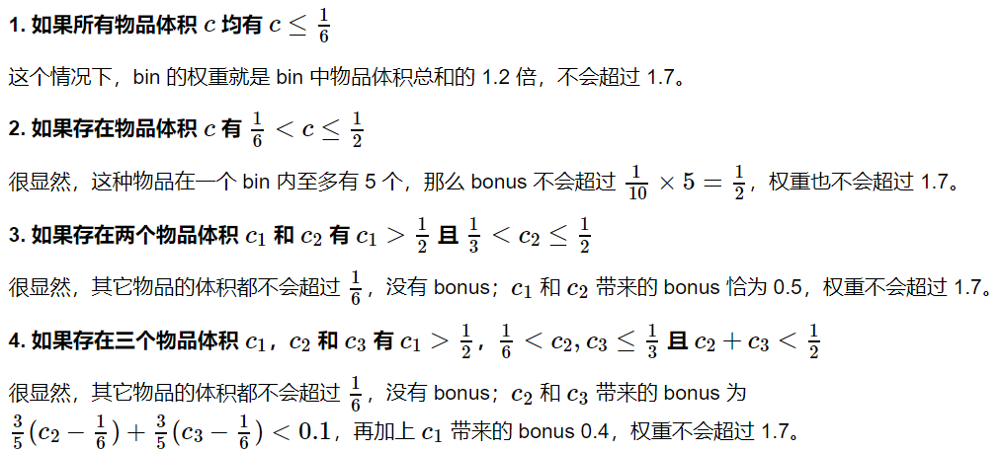
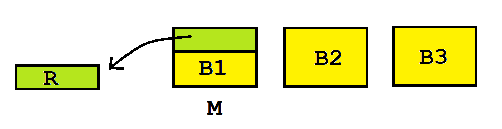

原计划基于 [TSR 学长的博客](https://www.cnblogs.com/tsreaper) 补充知识点的，由于《应用运筹学基础》将“上课笔记整理”也作为了考核方式之一，于是我把 TSR 学长的部分内容也结合进来了。这篇文章是系列之二，还有两个系列分别是：

+   [线性规划理论](https://jiangshibiao.github.io/Linear-Programming-Theory)
+   [线性规划应用](https://jiangshibiao.github.io/Application-of-Linear-Programming)

## 稳定婚姻问题（stable marriage problem）

问题描述
- 有 $N$ 位男生和 $N$ 位女生，每个男生都对 $N$ 个女生的喜欢程度做了排序，每个女生都对 $N$ 个男生的喜欢程度做了排序，现在需要确定一个**稳定**的约会状态（匹配）。
- 若存在两对匹配 $A=(u,v)$，$B=(p,q)$ ，满足男生 $u$ 比起女生 $v$ 更喜欢女生 $q$，且女生 $q$ 比起男生 $p$ 更喜欢男生 $u$，那么我们称这组方案是**不稳定**的。

Gale–Shapley 算法
- 首先选择一个单身男生，他会按照他的喜欢程度对一个还没有表白过的女生表白。
- 如果女生此时处于单身状态，则他们两人将进入约会状态。
- 如果女生已经有匹配对象，会将他与当前对象做比较。如果她更喜欢表白的男生，该男生成功上位，原对象进入单身状态；否则男生表白失败。
- 当所有的男生都脱离单身状态时，此时的约会状态是稳定的。

分析
- 该算法的时间复杂度是 $O(N^2)$，$N$ 是男女生的数量。
- 一个显然的结论：女生的对象一定是不断变优的。
- 可以用反证法证明，该算法**一定能找到一组稳定的解**。若不稳定，则存在两对相互吸引的匹配 $A=(u,v)$，$B=(p,q)$。既然 $u$ 最终没有和 $q$ 匹配在一起，说明 $u$ 曾向 $q$ 表白过但被拒绝了（或者开始同意最后被踢了）。根据引理，$q$ 必然有一个比 $u$ 更好的对象；然而它现在却与 $p$ 在一起，矛盾。
- 一个反常识的结论：这组解是所有稳定解里**对所有男生最有利且对所有女生最不利的解**。也就是说，其他稳定解里任何一个男生的伴侣排名都不会比当前解高。男生也不能通过变换自己的表白顺序来获得更喜欢的女生。

拓展：Rural hospitals theorem
- 这是匹配医生和医院的模型。在上述问题的基础上，每个医院还有一个容量上限，表示最多可以匹配这么多医生。注意，该模型并不保证最终所有医生都能匹配到医院，也并不保证所有医院都能满足容量上限。
- **不稳定**的定义类似：存在一对医生和医院，它们之间没有匹配边却更想在一起（有更不喜欢的匹配对象或是没有匹配对象）。
- GS 算法依然能找到一组稳定的解。

## 独立系统

对于一个二元组 $(E,\mathcal{F})$，若 $\forall Y \in \mathcal{F}$，$X \subseteq Y \to X \in \mathcal{F}$，那么我们称 $(E,\mathcal{F})$ 为**独立系统**。由这个定义我们马上推出，$\emptyset \in \mathcal{F}$。
- 在独立系统 $(E,\mathcal{F})$ 中，$\mathcal{F}$ 中的元素称为**独立集**，$2^E−\mathcal{F}$ 中的元素称为相关集。
- 将 $\mathcal{F}$ 中的极大独立集称为**基**，将 $E - \mathcal{F}$ 中的极小相关集称为**圈**。
- 对于 $X \subseteq E$，定义 $X$ 上的基为 **$X$ 上的极大独立集**。
- 独立系统的**秩商** $q(E, \mathcal{F}) = \min\limits_{x \subseteq E} \quad \frac{\rho(X)}{r(X)}$
- **最大化问题**：找到 $F \subseteq \mathcal{F}$ 使得 $c(F)$ 最大（$F$ 必然是基）。
- **最小化问题**：找到 $c(F)$ 最小的基。
    + 最小生成树：$E$ 中元素是边，$\mathcal{F}$ 中元素是所有不含圈的边集，费用是每条边的权值。
    + 最短路：$E$ 中元素是边，$\mathcal{F}$ 中元素是起点到终点的简单路径及其子集，费用边权。
    + 旅行商问题：$E$ 中元素是边，$\mathcal{F}$ 中元素是哈密尔顿回路及其子集，费用是边权。
- 独立系统的**交**：两个独立集系统 $(E,\mathcal F_1)$ 和 $(E, \mathcal F_2)$ 的交为 $(E, \mathcal F_1 \cup \mathcal F_2)$.
- 独立系统的**对偶**：设 $\mathcal{F}^\ast = \{F \subseteq E ~|~ \exists (E, \mathcal{F}) \text{ 的基 } B, F \cap B = \emptyset\}$。显然 $(E, \mathcal{F}^\ast)$也是独立系统，我们称 $(E, \mathcal{F})$ 与 $(E, \mathcal{F}^\ast)$ 互为对偶。

**拟阵**：基的大小都相等的独立系统。

常见的独立系统
- 0-1 背包问题：$E$ 中元素是物品，$\mathcal{F}$ 中元素是可以放进背包的物品集合，费用是物品价值。
- 最长简单路径：$E$ 中元素是边，$\mathcal{F}$ 中元素是起点到终点的简单路径及其子集，费用是边权。
- 最大权独立集：$E$ 中元素是点，$\mathcal{F}$ 中元素是独立集，费用是点权。
- 最大权森林：$E$ 中元素是边，$\mathcal{F}$ 中元素是所有不含圈的边集，费用是边权。

两类贪心算法
- **Best in 算法** （解决最大化问题）：将 $E$ 中所有元素按费用从大到小排序，使得 $c(e_1) \ge c(e_2) \ge ... \ge c(e_n)$。一开始令 $F = \emptyset$，按 $e_1, e_2 \dots, e_n$ 的顺序考虑，若 $e_i$ 加入 $F$ 后 $F$ 仍是独立集那就加入。
- **Worst out 算法**（解决最小化问题）：将 $E$ 中所有元素按费用从大到小排序，使得 $c(e_1) \ge c(e_2) \ge ... \ge c(e_n)$。一开始令 $F = E$，按 $e_1, e_2 \dots, e_n$ 的顺序考虑，若把 $e_i$ 从 $F$ 中去掉后 $F$ 还含有至少一个基那就去掉。
- **Best in 定理**：设 $G(E, \mathcal{F})$ 表示 Best in 贪心得到的解，$\text{OPT}(E, \mathcal{F})$ 表示最优解，则 $$q(E, \mathcal{F}) \le \frac{G(E, \mathcal{F})}{\text{OPT}(E, \mathcal{F})} \le 1$$ 。从这个定理可以看出，如果一个独立系统是拟阵，那么用 best in 得到的最大化问题的解一定是最优解。
    + 证明：首先定义 $E_j = \{e_1, e_2, \dots, e_n\}$，$G_n$ 是 best in 贪心选中元素的集合，$O_n$ 是最优解选中元素的集合。令 $G_j = E_j \cap G_n$ 表示 best in 贪心在考虑 $e_j$ 之后选择了哪些元素，$O_j = E_j \cap O_n$ 表示最优解在考虑 $e_j$ 之后选择了哪些元素。记 $d_j = c(e_j) - c(e_{j+1})$ 以及 $d_n = c(e_n)$，得到如下推导。
    + 可以举一个例子说明 Best in 定理的下界是紧的：根据秩商的定义，$\exists X \subset E$，$X$ 的基 $B_1$ 和 $B_2$ 满足 $\frac{|B_1|}{|B_2|} = q(E, \mathcal{F})$。我们定义 $c(e) = \begin{cases} 1 & e \in X \\ 0 & e \not\in X \end{cases}$ 然后把 $B_1$ 中的元素排在前面形成 $e_1, e_2, \dots, e_{|B_1|}$，后面随便排。如果使用 best in 贪心，就会把前面 $|B_1|$ 个元素选走，然而最优解可以选 $|B_2|$ 个元素。

$$\begin{matrix} c(G_n) & = & \sum\limits_{j=1}^n(|G_j| - |G_{j-1}|)c(e_j) \\ & = & \sum\limits_{j=1}^n|G_j|d_j \\ & \ge & \sum_{j=1}^n \rho(E_j)d_j & \text{（因为容易证明 } G_j \text{ 是 } E_j \text{ 的一个极大独立集）} \\ & \ge & q(E, \mathcal{F})\sum\limits_{j=1}^n r(E_j)d_j & \text{（根据秩商的定义）} \\ & \ge & q(E, \mathcal{F})\sum\limits_{j=1}^n |O_j|d_j \\ & = & q(E, \mathcal{F})c(O_n) \end{matrix}$$

定理：任何一个独立集系统 $(E, \mathcal F)$ 都是有限个拟阵的交。
- 不妨设其有 $k$ 个圈 $C_1, C_2, \dots, C_k$。
- 定义 ${\mathcal F_i}= \{ x \subseteq E | x \nsupseteq C_ i\}$
- $\forall F \subseteq E$，有两种可能：
    1. $F \nsupseteq C_i$
    2. $F \supseteq C_i$，则 $\forall e \in C_i, F \backslash \{e\}$ 是独立集。
- 得 $\mathcal F_i$ 是拟阵。
- 断言：${\mathcal F} = \bigcap \limits_{i=1}^k {\mathcal F_i}$。

定理：**若独立集系统 $(E,\mathcal F)$ 是 $k$ 个拟阵的交，则贪心解的近似比至少是 $\frac{1}{k}$**。
- 考虑 $(E,\mathcal F)$ 的两个不同的最大独立集 $A$ 和 $B$ 且 $|B| \geq |A|$。欲证明：$|B| \leq k|A|$。
- $\forall e \in B \backslash A$，我们有 $e \notin \bigcap \limits_{i=1}^k (A_i \backslash A)$。其中 $A_i$ 是在 $(E, \mathcal F_i)$ 上含 $A$ 的极大独立集。
    + 反证，若 $e \in \bigcap \limits_{i=1}^k A_i \backslash A$，则 $\forall i, e \in A_i \backslash A$，得 $A \cup \{e\} \in \mathcal F_i$，与 $A$ 是极大独立集矛盾。
- 进一步推出， $e$ 最多出现在 $k-1$ 个 $A_i \backslash A$ 中，且 $\sum \limits_{i=1}^k (A_i \backslash A) \leq (k-1)|B \backslash A| \leq (k-1)|B|$
- 同理，$k|B| \leq \sum \limits_{i=1}^k |B_i| = \sum \limits_{i=1}^k |A_i| \leq k|A|+(k-1)|B|$
- 即 $|B| \leq k|A|$

拟阵的对偶也是拟阵。

应用在二分图匹配上
- 二分图 $G=(A \cup B,E)$
- 构造拟阵1：${\mathcal F_1}= \{ X \subseteq E ~ | ~ |\delta_u| \leq 1, \forall u \in A \}$
- 构造拟阵2：${\mathcal F_2}= \{ X \subseteq E ~ | ~ |\delta_v| \leq 1, \forall v \in B \}$
- 则该系统 $(E,{\mathcal F1} \cap {\mathcal F_2})$ 表示了二分图的匹配问题。

[tsr 讲独立系统](https://www.cnblogs.com/tsreaper/p/aop7.html)

## Bin Packing 问题

[lzw 的 bin packing 问题总结](http://zhenweiliu.gitee.io/blog/2019/07/28/Approximation-Algorithm-3-The%20Binpacking%20Problem/)

[$\mathrm{FF(I) \le 1.7OPT(I)+0.8}$ 的证明](https://www.cnblogs.com/tsreaper/p/aop9.html)

- 设第 $i$ 件物品体积为 $a_i$，定义**权重** $w(a_i)$ 为：$w(a_i) = \frac{6}{5}a_i + v(a_i)$
  $$v(a_i) = \begin{cases} 0 & a_i \le \frac{1}{6} \\ \frac{3}{5}(a_i - \frac{1}{6}) & \frac{1}{6} < a_i \le \frac{1}{3} \\ \frac{1}{10} & \frac{1}{3} < a_i \le \frac{1}{2} \\ \frac{2}{5} & a_i > \frac{1}{2} \end{cases}$$
- 记 $B$ 为 first fit 算法得到的方案，$B^*$ 为最优方案，$c(B_j)$ 表示第 $j$ 个 bin 中物品的体积总和，$w(B_j)$ 表示第 $j$ 个 bin 中物品的权重总和。
- 基本想法：如果能证明 $w(B^*_j) \le 1.7$ 且 $w(B_j) \ge 1$，即得 $\text{FF}(I) \le 1.7\text{OPT}(I)$。
- **Step1 ：证明除两个 bin 以外，其它 bin 权重均值至少为 1**
  - 考虑那些权重不足  $1$ 的 bin。它们有以下性质：
    1. 不含体积至少为 0.5 的物品；
    2. 一个 bin 内不会包含两个体积至少为 1/3 的物品；
    3. bin 的体积之和小于 5/6。
  - 据此容易推出：
    1. 除了最后一个 bin，其它 bin 中至少有两个物品；
    2. 除了最后两个 bin，其它 bin 的体积之和都大于 2/3。
  - 引理：如果两个 bin $B_1$ 和 $B_2$ 满足 $B_1$ 在 $B_2$ 前面、$w(B_1), w(B_2) < 1$、$c(B_1) \ge \frac{2}{3}$ 以及 $B_2$ 有至少两个物品，则 $\frac{6}{5}c(B_1) + v(B_2) \ge 1$。
  - 假设 **FF** 得到的方案中，权重之和小于 $1$ 的 bin 按先后顺序为 $B_1, B_2, \dots, B_k$，那么 $\sum w(B_i) =  v(B_1) + (\frac{6}{5}c(B_1) + v(B_2)) + \dots + (\frac{6}{5}c(B_{k-1}) + \frac{6}{5}c(B_k)) + v(B_k)$ . 这个值显然是  $\ge (k-2) + \frac{6}{5}$的，命题得证。
- **Step2 ：证明对于任意解 O ，满足 $w(O_i) \le 1.7$**
  

事实上 $0.8$ 的尾巴可以拿掉（即 $\mathrm{FF(I) \le 1.7OPT(I)}$），且 $1.7$ 是最优近似比。

FFD 算法
- 流程：先将物品按体积从大到小排序再套用 FF 做法。
- FFD 的渐进比值是 $\frac{11}{9}$。一组卡满的例子：$\{ 6 \times (\frac{1}{2}+\epsilon), 6 \times (\frac{1}{4}+2\epsilon), 6 \times (\frac{1}{4}+\epsilon), 12 \times (\frac{1}{4}-2\epsilon) \}$。
- 该比值下的最优尾项是 $\mathrm{FFD(I)} \le \frac{11}{9} + \frac{6}{9}$，证明很复杂。
- FFD 的绝对近似比满足：$\mathrm{FFD(I) \le \frac{3}{2} OPT(I)}$。一组卡满的例子：$[\frac{1}{2},\frac{1}{4},\frac{1}{4}],[\frac{1}{3},\frac{1}{3},\frac{1}{3}]$
- 有趣的拓展：判定一堆物品是否可以塞在两个箱子里。已知 **FFD 是该问题最优的绝对近似比算法**（即不存在任何一个近似算法的绝对近似比 $< \frac{3}{2}$）。

绝对近似比的研究
- 装箱问题的渐进近似比是 $\frac{11}{9}$，已经不能被改进了。
- 拓展一下，设算法 $A$ 的近似比是 $A(I) \le \alpha \mathrm{OPT(I)} + \beta$ 这个形式（即允许尾项）。
    + 可以做到 $A(I) \le (1+\epsilon)\mathrm{OPT(I)} + 1$（证明见下）
    + [$A(I) \le \mathrm{OPT(I)} + O((\log \mathrm{OPT})^2)$ 的证明戳这里](https://www.cnblogs.com/tsreaper/p/aop10.html)。
    + 若取 $\alpha = 1$，目前最优的结果是 $A(I) \le \mathrm{OPT(I)} + O(\log {\mathrm{OPT}})$

近似比为 $(1+\epsilon)\mathrm{OPT(I)} + 1$ 的算法介绍
- 首先，如果物品的种类数是常数个，我们能直接多项式求解。比如，假设一共有 $k$ 种物品，我们用 $(b_1,b_2, \dots, b_k)$ 去表示每一种的个数。那么，任何一个箱子可以装的方案数是一个常数，不妨记为 $M$。
- 装箱问题可以转化成以下的整数规划问题：求解 $\min \sum \limits_{j=i}^M x_j$，使得 $\sum \limits_{j=1}^M t_{j,i}x_j \ge b_i, x_j \in \mathbb{N^+}$
- 下面，**我们将考虑所有 $> \epsilon$ 的物品**(每个箱子里最多装 $\lfloor \frac{1}{\epsilon} \rfloor$ 个)。
    + 对于一个实例 $I$，将物品体积从小到大排序，每隔 $\frac{1}{\epsilon^2}$ 个划成一组，最后会分成 $\frac{1}{\epsilon^2}$ 组。
    + 构造实例 $J_1$，将每个物品的体积放大至与下一组的分界点。于是 $\mathrm{OPT(J_1)}$ 是多项式可解的，而且 $J_1$ 是原问题的一组可行方案。
    + 构造实例 $J_2$，将每个物品的体积缩小至与上一组的分界点。我们有 $\mathrm{OPT(J_2) \le OPT(I) \le OPT(J_1)}$。
    + 容易发现，因为每组的大小相等，$J_1$ 和 $J_2$ 的前后两组的个数是一样的，可以得到 $\mathrm{OPT(J_1)}$ 最多比 $\mathrm{OPT(J_2)}$ 多 $\theta = n\epsilon^2$ 个箱子（这里忽略了一些常数上的细节）
    + 因为 $\mathrm{OPT(I) \ge n\epsilon}$，所以 $\mathrm{\theta \leq n \epsilon^2 \leq \epsilon OPT(I)}$
- 再反过来，考虑所有 $\leq \epsilon$ 的物品。如果全能塞进之前的箱子，那就证毕了。否则除最后一个箱子外，每个箱子的空隙必然 $< \epsilon$，即 $\mathrm{J_1(I) \le \frac{1}{1-\epsilon}OPT(I)+1 \le (1+\epsilon)OPT(I)+1}$

作业题：设计一个绝对近似比是 $1.5$ 的线性装箱算法
- 将所有 $> \frac{1}{2}$ 的物品单独装箱。
- 依次枚举每个箱子，不断塞入 $< \frac{1}{2}$ 的物品。**每当放不下的时候，把该物品切成两部分：一部分装满这个箱子，另一部分装到下一个箱子里。**（如果用完了所有箱子就新开箱子）。
- 设总共用了 $K$ 个箱子（显然 $K \le \mathrm{OPT}$，因为现在是密密地叠着的）。注意现在不一定是可行解。**被切开的物品最多只有 $K-1$ 个，而且都是 $< \frac{1}{2}$ 的**。我们把它们从箱子中抽出来，两两组合装箱，用到了 $\lceil \frac{K-1}{2} \rceil$ 个箱子。
- $K+\lceil \frac{K-1}{2} \rceil \le 1.5K \le \mathrm{OPT}$

## Job Scheduling with Equal Length

问题描述
- 你有若干个机器可以并行处理任务。
- 某个时刻会来一个新的任务，如果你选择做，你可以在任意时刻将它分配给任意机器。
- **每个任务所需时间都是相等的**，且有一个截止时间。
- 任务的给出分为在线和离线两种，在这里我们讨论在线。

贪心算法
- 假设**只有一台机器**，而且策略是“能做就做”。
- 我们将用 **Charge Scheme** 的技术证明：该算法近似比是 $2$。
- 对于贪心解 $S$ 里完成的每个任务 $i$，设一个势 $\phi_i$。
- 对于最优解 $S^*$ 里完成的每个任务 $i$，考察它开始执行的时刻：
    + 若此时贪心解里正在执行任务 $k$，则 $\phi_k \leftarrow \phi_k + 1$。
    + 若此时机位是空闲的，说明贪心解在之前已经做过了任务 $i$（否则为啥不放到现在来做）。则 $\phi_i \leftarrow \phi_i + 1$。
- 注意到，贪心解里的每个任务最多被索引两次（它自己，它启动时刻最优解里的任务），即 $\phi_i \le 2$。
- 由 $\sum \limits_{i \in S} \phi_i = |S^{\ast}|$ 和 $\phi_i \le 2$ 可得：$|S| \ge \frac{1}{2}|S^{\ast}|$

Best Fit 算法
- 算法描述：每当一个任务进来的时候，将它丢给**能安排它的机器中**（使其不超过deadline）空闲时刻尽量靠后的。
- 下面证明，**只有两台机器时**，该算法近似度至多是 $\frac{9}{5}$。
- 对于最优解里的每个任务 $i$，考察它开始执行的时间：
    + 若此时两台机器都空闲着，$\phi_(i) \leftarrow \phi_{i}+1$。
    + 若此时有一台机器在执行任务 $u$，则 $\phi_u \leftarrow \phi_u + \frac{2}{5}, \phi_i \leftarrow \phi_i + \frac{3}{5}$。
    + 若此时两台机器都在执行任务（早开始的执行任务 $u$，迟开始的执行任务 $v$），则 $\phi_u \leftarrow \phi_u + \frac{2}{5}, \phi_v \leftarrow \phi_v + \frac{3}{5}$
- 现在考虑贪心解里的每一个任务 $i$
    + 最多被三个最优解里的任务引用
    + 如果没有被加过 $1$，则 $\phi(i) \le \frac{3}{5} \cdot 3$
    + 否则，它在开始做的时候一定没有别的机器，即它一定是任务 $u$，$\phi(i) \le 1 + \frac{2}{5} \cdot 2$
- **有 $k$ 个机器的时候**，可以设 $x_1 \dots, x_k$ 这 $k$ 个变量来求解最优近似比。

## TSP 问题和哈密顿回路

简化条件
- 如果是普通完全图，TSP问题不存在常数比的近似算法。
- 额外加一个约束：边权必须满足三角不等式。

一个近似比为 $2$ 的做法
1. 对原图求一遍 MST。
2. 把 MST 的每条边倍增，转成一个欧拉图。
3. TSP回路的点序列即为欧拉图的遍历序列（有重复点就跳过）。
- 由 $\text{MST} < \text{OPT}, \text{TSP} \le \text{Euler}, \text{Euler} = 2\text{MST}$，得该算法近似比是 $2$。

简单的改进
1. 求完 MST 后，我们把奇数度数的点取出来（一定是偶数个）。
2. 对这些点的诱导子图做一次边的完美匹配，两两连接匹配上的两点。
3. 这样所有点的度数都是偶数了，套用之前的做法。
- 因为 $\text{MATCH} \le \frac{1}{2}\text{OPT}$，所以该算法近似比是 $1.5$。

+ [拓展：哈密顿路](https://www.cnblogs.com/tsreaper/p/aop11.html)

## 切蛋糕博弈

若干个人要分蛋糕吃。**注意，每个人对蛋糕各部分价值的评估是不一样的**。有以下两种要求：
- 公平：每个人都认为，自己得到的部分不低于（自己视角下）总蛋糕价值的 $\frac{1}{n}$。
- 无怨：每个人不觉得别人拿的比自己多。（显然**无怨一定公平**）

三人无怨切蛋糕的离散解法
1. `A` 按照自己的标准把蛋糕切三块。
2. 如果 `B` 认为最大的两块一样大，那么按 `C，B，A` 的顺序选蛋糕，**结束**。
3. 如果 `B` 认为其中一块 `M` 最大，他就从 `M` 削去一小块 `R`，使之与第二大的那块一样大，把 `R` 放在一边。
4. 称 `M` 剩下的部分为 `M'`。
5. 按 `C，B，A` 的顺序选这三块蛋糕。有个要求是：如果 `C` 没有选走 `M'`，`B` 须被迫选走它。
6. `B` 和 `C` 中没拿 `M'` 的那位，把 `R` 分成三份，让拿了 `M'` 的那位先挑一份，然后 A 选一份，最后一份留给自己。
    
- 分析：
    1. 先来证明 `C` 的无怨。第一轮选择的时候他有最优先权：如果他认为 `B1`（即算法里的 `M'`） 最优，那么它在第一轮能先选走自己认为最大的，而且可以在第二轮均分蛋糕，使得第二轮自己也能拿 `R` 中至少 `1/3`，肯定是无怨的；如果他认为 `B2` 或者 `B3` 最优，它将在两轮选蛋糕里都最先选走自己认为的最大的，显然无怨。
    2. 再来证明 `B` 的无怨。经过削蛋糕操作后， 他眼中 `B1=B2>B3`——所以如果 `C` 选走了 `B1` 或 `B2` 中的任意一个，`B` 将选走它们中的另一个（`C` 选走 `B3` 的话，`B` 被迫选走 `B1` 也不亏）。而且在第二轮里，`B` 拥有切或者先选的权力，分析同上，也是无怨的。
    3. 再来证明 `A` 的无怨。`A` 一开始在切的时候，是把蛋糕按照自己的标准均分的，所以在他眼中，`B2=B3>B1`。由规则保证，第一轮分蛋糕时 `B1` 一定会被选走，所以在第一轮中， `A` 尽管获得剩下的蛋糕，也是无怨的。此时在 `A` 眼中，拿了 `B1` 的人最后的总价值超不过他，他只需在第二轮中考虑剩下的那个人。没拿 `B1` 的人将在第三轮最后选，所以 `A` 挑剩下两块中自认为价值大的，他获得的总价值也不会低于没拿 `B1` 的人。

$N$ 个人公平切蛋糕的离散解法
1. 第一个人切出他认为的 $\frac{1}{n}$。
2. 剩下的人按顺序判断一下：这一份在他眼里是不是太大。如果较大就削至 $\frac{1}{n}$ 并进原来的蛋糕，不是的话跳过。
3. 所有人都判断过后，这一块给最后削过的那位（如果没有人削过蛋糕，这块给第一个人）。
4. 每次 $N$ 的规模减一。重复操作 $2 \sim 4$ 直至分完。