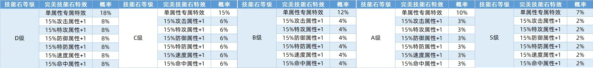
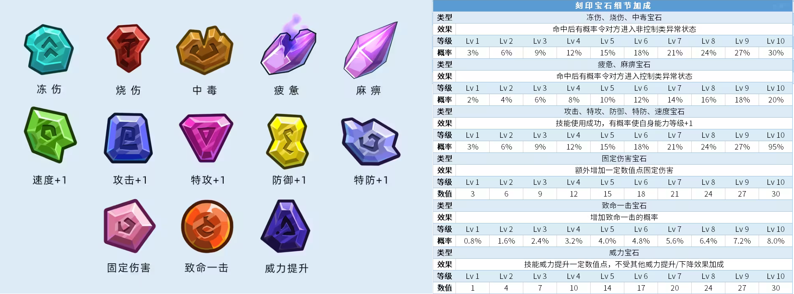
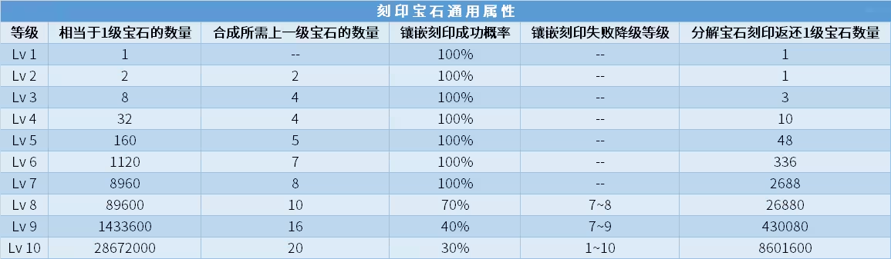

在这篇文章里，我将详细收录 [赛尔号页游 & 互通手游](https://seer.61.com/) 中一些不太寻常的游戏机制。注意，本文不是新手教程，对一些常规机制不会做太多的说明，定位是 **拥有一定门槛的《PVE 百科全书》**。

鸣谢 B 站大佬：dqs 白纸，摸鱼的橙汁，异域华尔兹，流风天啸，晶蓝实验室，摸鱼的娜娜。

鸣谢贴吧大佬：假诩，铭记，飞鱼三千里，哇内外妇儿，阿米族联盟。

## 工具相关

2015 年 7 月，北冥玄武上线后被发现可以用草马无脑瞬，但冗长的出招总是让小赛尔们奋斗几个小时后白屏。第一款爆红的 V171 登录器就是为了解决频繁白屏的问题，随后赛尔桌面版、子杰登录器等产品相继出现，打开了登录器这个全新时代的大门。由于这属于官方不承认的第三方软件，起初只有小规模玩家使用登录器；推着时间的推移，登录器越来越丰富的功能吸引了越来越多的用户，而始终绕不开的盗号风险只能靠对作者人品的信赖。橙汁曾开发过一款流畅而稳定的 Waking辅助-Seer登录器，可惜在 2020 年 2 月 14 日因精力不足和饱受质疑而 [停运](https://tieba.baidu.com/p/6490289450)。为了应对 2021年 1 月12日 Flash Player 插件被禁用，赛尔号官方在 2020 年底上线了一款类似登录器的工具“赛尔号微端”且陆续在更新（最新的 V1.0.3 可见 [橙汁的介绍](https://www.bilibili.com/read/cv17843269)），因为功能单一、使用卡顿，并没有被玩家广泛使用。

时至今日，绝大部分玩家都投靠了登录器的怀抱，来加速对战、规避繁琐的日常、辅助精灵关卡——可以说，这个发明直接推动了赛尔号的蒸蒸日上。目前最广泛使用的登录器工具无疑是 [bop](https://yoso.redstoner.cn/wp/) 制作的 Yoso 赛尔器和 chika 登录器。该工具开放了“魔法”的制作方法，大量民间开发者可在 [chika 魔法论坛](https://bbs.yoso.live/forum.php) 分享自己为每周活动、精灵关卡等制作的脚本。目前 [歆冉忆梦](https://space.bilibili.com/383994824) 是最活跃的周活动脚本制作者。此外，该工具还提供了分别针对 PVE 的 RUBY 日常器和针对 PVP 的赛尔巅峰器，后者可以很方便地开发巅峰脚本，导致了 flash 端橘子、寒雪飞舞、未明脚本泛滥。必须要指出的是，登录器的功能日益强大也导致很多玩家从“脚本”向”外挂“迈步（推荐阅读 [浅谈脚本的前世今生](https://tieba.baidu.com/p/7229731446)）。当严重影响游戏平衡或触及官方的核心利益时，官方就不会再睁一只眼闭一只眼了。

登录器 **一键压血** 的本质：把背包里的全体精灵恢复，去打白虎送掉，再嗑 20 血药剂。

+   这个流程会导致不允许中途退出的关卡无法压血，如萨特和小舞的最后一关。
+   少压了一只精灵后，把目标精灵放入出战背包、剩下压完血的精灵放入待命背包后再执行一键压血，则待命背包的精灵也会恢复至满血。这种场景推荐通过仓库中转，或把压完血的精灵一起再压血。

阿米族联盟开发了一款名为 **MV 赛尔手册** 的安卓 APP（对应 QQ 小程序 **赛尔营地**， 微信小程序 **赛尔手册**），目前已经成为玩家搜索精灵技能、搭配精灵刻印、查询仓库精灵等不可或缺的工具。每个技能都对应若干个编码，这让玩家深刻地意识到描述类似的技能之间的关联和区别，例如区分技能增伤在 PVE 中是否有效。

## 游戏内常见设定

赛尔号通常在每周五更新（遇到节假日可能会前后微调），新版本将维持一周。

+   周五开服时间从以前的 $6:00$，一直拖到现在的 $12:00\sim 13:00$。根据 h5 端显示，官方承诺常规开服时间不会低于 $15:00$。延迟开服时通常会全服补偿刻印、荣耀铸币等资源。
+   除周四外每天晚上 $23:59$ 左右关服，周四一般提早至 $23:55$。
+   除周五外每天早上 $0:00$ 开服。远古时期赛尔号每天 $0:00-6:00$ 都会强制关服维护。
+   大型节日（如春节）时，官方可能会一口气载入两周的版本，第二周的周五零点能直接进入游戏。

战斗火焰有紫色、绿色、金色、蓝色火焰四种，仅 PVE 有效。

+   VIP 玩家每天可以选一种火焰领取一次，有效时长 30 分钟，称为加强型火焰，俗称大火；非 VIP 玩家可以从带火的玩家上蹭火，有效时长 10 分钟，称为普通火焰，俗称小火。
+   紫火、金火、蓝火对于 VIP/非 VIP 效果不同。前者是 $25\%,25\%,60$，后者是 $20\%,20\%,50$。不管是哪种紫火，增伤效果均不及紫火，除非用于无法强化或 boss 会偷强的场合。
+   VIP 玩家如果借的是加强型火焰，生效的也就是 30 分钟的加强型火焰，反之亦然。 
+   每天借火的次数没有限制，但 **火焰消失后才能去再借火**。VIP 玩家可以通过选择自己每日一次的火焰 **覆盖掉借来的火焰**，但反过来不行。由于绿火最常用，推荐绿火去蹭，要用别的火了再覆盖。
+   购买寒假/暑假月卡能让火焰的持续时间延长至 2 小时。
+   上述都是 flash 端的火焰规则，h5 端和 flash 端不互通。h5 端每日可免费领取一次火焰，时长和效果同端游；当日再次领取火焰则需要用好友之间互发的星星兑换，五个星星领取一个。

出战背包里的非首发精灵的顺序和实际对战时不一定相同。其满足下列的性质：

+   除首发外精灵的实际对战顺序由放入出战背包的先后决定。举例来说，往空的出战背包依次放入帝皇之御、六界帝王、蒂朵并调整成 $20$ 倍速后，就能实现自动 84（对应技能需调至第一格）。
+   重新登陆后，上一次登陆时的出战背包放入顺序不再生效，对战时除首发外可能会乱序。
+   换首发时会打乱出战顺序，即出战背包里的顺序不再是战斗时的顺序。
+   当出战背包的精灵不是预期的顺序时，可借助仓库或待命背包来调整顺序。即先把除首发外的所有精灵都放入待命背包/仓库，然后按期望的顺序把精灵从待命背包/仓库里放回出战背包。

## 精灵能力值计算

关于精灵的能力值，赛尔号官方发布过权威 [专栏](https://www.bilibili.com/read/cv12647887)。

根据 [橙汁的攻略](https://news.4399.com/gonglue/seer/jingyanxinde/797541.html)，对于满级精灵来说，基础能力值的计算公式为：
$$
基础能力值=\lfloor (2 \cdot 种族值+学习力/4+个体值+偏移量) \times 性格修正 \rfloor
$$
其中 $性格修正 \in [0.9,1.0,1.1]$，体力能力值 $偏移量=110$，其他能力值 $偏移量=5$。

从上述公式可以得到如下推论：

+   每 $1$ 点种族值可简单对应成 $2$ 点能力值。
+   每 $4$ 点学习力对应 $1$ 点能力值，所以正常情况下学习力刷 $4$ 的倍数就不会浪费，最高拉到 $252$ 就行。受性格加成的那项能力值（如固执精灵的攻击能力值）会让学习力的加点变得 [十分复杂](https://www.bilibili.com/video/BV11y4y197q3)。假设精灵的个体值是 $31$ 且攻击种族值非 $2,7$ 结尾，则攻体精灵的刷法模板是：攻 254，体 252，速 4。

根据异域华尔兹的 [讲解](https://www.bilibili.com/read/cv11168267)，精灵在 PVE 对战时的实际能力值计算公式为：
$$
实际能力值=\lfloor (基础能力值+特性+刻印+战队+年费+称号+目镜)×绝大多数套装百分比 \rfloor +道具
$$
PVE 常用套装和目镜总结可见 [ツバサ99ova的整理](https://www.bilibili.com/read/cv15146186)。整理如下：

+   银翼、皇帝套与其他增伤效果可能加算也可能乘算，云端少女莫妮卡的 [各系强攻手](https://www.bilibili.com/read/cv21309143) 里有标注。
+   乾古套是个有潜力但目前非必备的套装，固伤效果能辅助月华更快地打完高防 boss。
+   未来战甲、苍星战甲、元神守护、永夜玄铠、杰出新兵套、耀世战铠是常见的属性站场套装。
+   关于耀世套的减伤效果：与大部分精灵（伊芙莉莎，四九，幻境，混索，特兰西完全体）的魂印减伤加算，与部分精灵（王之哈莫，圣莫，凡尔斯，战神·盖亚）魂印减伤乘算，还会与少部分精灵（霍夫曼）的魂印减伤冲突导致减伤被覆盖掉；减伤效果与技能减伤也可能是加算、乘算和冲突；减伤不响应属性技能造成的红伤；除魂印减伤和技能减伤以外，与其他来源的减伤（坚硬特性，金火，珠子）都是乘算。特别地，我方处于护盾状态时，被护盾吸收的伤害不带减伤效果。具体细节详见 [流风天啸的测试](https://www.bilibili.com/read/cv14670492)。
+   典狱长与未来套相比，前者额外增加命中率，后者数值加成更高（原因详见 [橙汁的分析](https://www.bilibili.com/read/cv6724351)）。
+   常用目镜：未来之瞳（双攻 $+20$，速度 $+15$），魔界之风（双防 $+25$ 速度 $+15$），星愿之镜（特攻 $+30$ 速度 $+15$），预言之镜（攻击 $+30$ 速度 $+15$），粒子目镜（命中率 $+3\%$）。

所有能力称号列表可见 [黎姿蹙尕的整理](https://www.bilibili.com/read/cv19880387)。常用的 PVE 能力称号如下：

+   站场：齐天小圣（体力 $+100$），神话（体力 $+100$ 双防 $+25$ ）。
+   强攻：吉光凤羽（双攻 $+50$），夏日狂想曲（攻击 $+60$ 体力 $+30$），音浪袭来（特攻 $+60$ 体力 $+30$）。

能量珠和能力提升药剂只有 PVE 有效，是有次数限制的消耗品。

+   效果最好的能量珠均可用战队资源兑换，分别是奇效攻击/特攻/防御/特防能量珠（$+80$），奇效速度能量珠（$+45$），不灭能量珠（减少我方 $1/4$ 伤害）和愤怒能量珠（增加 $1/8$ 暴击率）。
+   瞬杀能量珠的瞬杀形式是红伤，面板概率 $1\%$ 但实测只有 $0.6\%$。曾经瞬杀能量珠在 PVP 有效，由于 PVP 不会消耗药剂，可以反复使用；2020 年 5 月 1 日的版本修复成 PVP 无效。
+   减伤能量珠（减少双方 $1/4$ 伤害）看似是低配版的不灭珠，在压攻时有奇效。减伤前若红伤满足斩杀伤害则不触发减伤效果，补 PP 的回合也不触发减伤效果，详见 [凤兮凤兮的测试](https://www.bilibili.com/video/BV1114y1H7Nj)。
+   能量珠每次战斗最多使用一个，除了减伤能量珠和不灭能量珠可以一起使用。根据 [摸鱼的娜娜测试](https://www.bilibili.com/video/BV1f24y1X75D)，金火、不灭能量珠、减伤能量珠乘法叠加，同时使用后减伤 $58\%$。
+   全面提升药剂、赛尔号正能量和全面提升药剂（龙）能提升全属性 $50/50/80$ 点，不能一起使用。
+   战斗结束前刷新不会消耗能量珠和药剂，在无次数要求的关卡里可使用刷新战术。

## 伤害计算

赛尔号的伤害分成三种：红伤、粉伤、真伤。

+   **红伤** 指攻击技能直接造成的伤害，由基础伤害和增减伤效果经过 **乘法叠加** 后得到，以红字显示。
+   **粉伤** 分为固定伤害和百分比伤害两种，以粉字显示。粉伤可被抗性、魂印、护罩、少量技能减免。固定伤害和百分比伤害彼此之间很容易混淆，官方的技能和魂印描述里经常混用。
+   **真伤** 指真实伤害，大多以白字显示，无法被任何方式减免。很多秒杀技能的补偿伤害、圣甲·盖亚的魂印弹伤等虽然是由粉字显示，实质上也是真实伤害。

**基础伤害** 又称 **初始伤害、裸伤**，指根据以下 [计算公式](https://www.bilibili.com/video/BV1Ti4y1y7ez) 直接计算出来的伤害：
$$
[(0.4 \cdot level+2) \times power \times attack \div defense \div 50+2] \times \beta \times \alpha \times (217 \sim 255) \div 255
$$

+   $level$ 分别是攻击方等级、本系修正和克制系数修正。
+   $\beta=\{1.0,1.5\}$ 是本系修正，若技能属性和本方属性一致则享受加成 $1.5$ 的本系加成。特别地，双属性精灵如果使用其中一个属性对应的单属性技能，也能享受本系加成。
+   $\alpha$ 是克制系数修正。单属性攻击单属性只分为克制、普通、微弱、无效四种，系数分别是 $\{2,1,0.5,0\}$。注意 A 克制 B 并不代表 B 微弱 A，反之亦然（如地面无效飞行但是飞行普通地面）。[涉及双属性的计算规则](https://www.bilibili.com/read/cv6206519) 比较复杂，总之合成后的克制系数会被控制在 $\alpha \in [0,4]$。
+   $power$ 是技能威力（处于烧伤状态时数值减半）和威力宝石的总和。有些技能的描述中会带“威力提升”或“伤害提升”的字样。前者是对公式中的 $power$ 进行提升，后者是对公式的值进行提升。在满级的情况下，技能描述为 “伤害提升 v% ”的技能会比 “威力提升v%” 造成的伤害 **更多**（但差距很小）。
+   $attack$ 是 攻击方的攻击值/特攻值 乘上 攻击方攻击/特攻能力等级系数；
+   $defense$ 是 防守方的防御值/特防值 乘上 防守方防御/特防能力等级系数 再乘上 攻击方的穿甲系数。

流风天啸 [指出](https://www.bilibili.com/read/cv13768880)，官方在计算裸伤时可能做了精度截取，实际值与理论值会有个位数级的不一致。

战斗中一共有六项能力等级，分别是攻击、特攻、防御、特防、速度和命中。能力等级登场时为 $0$，强化等级上限是 $+6$，弱化等级下限是 $-6$。前五项能力等级会让对应的能力值乘或除 $(1+0.5n)$，$n$ 是强化或弱化的等级。例如，战斗中攻击能力值 $+2$ 后攻击数值就翻倍，裸伤也就翻倍。

**增减伤效果** 泛指暴击、套装、魂印、回合类效果等对裸伤进行的修饰，大多数是按比例增加或减少，也有一些是强制修正至某个数值。注意不同的增减伤效果的触发节点不一致，细节可见 刀锋下的阴影7 的 [讲解](https://www.bilibili.com/video/BV1Ti4y1y7ez/)。注意大部分增伤技能和银翼乘算，少量攻击技能（如 1472）的增伤和银翼加算。

PVE 有效的 **伤害提升技能** 整理如下（威力宝石有效）：

| ID   | 效果简介                                                     | 代表精灵和技能                                               |
| ---- | ------------------------------------------------------------ | ------------------------------------------------------------ |
| 600  | 若对手是雄性/雌性则伤害提升x%                                | 启灵元神-真神信仰、魔化克雷尔-邪光之怒                       |
| 769  | 若对手不处于异常状态则造成的攻击伤害额外提升n%               | 光之惩戒·英卡洛斯-天河圣芒斩，炽风烈鬼-风炽狂躁断，无上·万魔天尊-深渊忏悔 |
| 795  | 每次使用则当回合造成的攻击伤害额外提升n                      | 艾夏拉-灵剑封魂                                              |
| 1021 | 对手不处于能力提升状态时造成的伤害提高x%                     | 混沌魔君索伦森-烈火净世击，圣光莫妮卡-王·梦之乌托邦，皮特尔·万寂寒光剑 |
| 1048 | 对手处于异常状态时自身造成的伤害提高x%                       | 光之惩戒·英卡洛斯-天河圣芒斩                                 |
| 1129 | x%的几率为y倍，自身处于能力提升状态时几率翻倍                | 混沌魔君索伦森-诸雄之主，艾莫莉萨-冥夜镇魂弑，六界御神-超界审判 |
| 1198 | 对手不处于能力下降状态则造成伤害提升x%                       | 混沌蒂亚斯-幽火勾爪袭                                        |
| 1242 | n%的几率伤害为m倍，未触发则概率提升                          | 艾欧丽娅-有女初长成                                          |
| 1252 | 自身体力低于1/x时伤害为n倍，低于1/y时伤害为m倍               | 月照星魂-月下华尔兹，魔钰-梦境残缺，混沌魔眼耶里梅斯-灵魂碎灭袭 |
| 1472 | 自身处于能力提升状态时造成的伤害提升x%，先出手时效果翻倍（**与银翼加算**） | 潜隐灵蛇-灵能炫光击，特罗斯-迅猛暴龙拳                       |
| 1686 | 先出手时造成的攻击伤害提升n%，若对手当前体力高于自身则伤害额外提升m% | 至序圣华-荡尽芜杂，龙伽-龙语星辰陨                           |
| 1718 | 后出手时造成的攻击伤害提升n%，若对手当前体力高于自身则伤害额外提升m% | 环·源-零·神庭轰坠                                            |

刀锋下的阴影 7 总结了 [PVE 无效的增伤效果](https://www.bilibili.com/video/BV1i44y1z7ZJ)：986（先出手时造成的攻击伤害额外提升x%，时空界神-界·无尽永前），999（自身每处于一种能力提升状态，造成的伤害提升x%，纳西斯-星辰万丈光），1086（自身体力低于对手时造成的伤害提高x%，不灭地威·萨瑞卡-X·天罡碎岩），1103（若对手处于能力提升状态则造成的攻击伤害额外提升n%，古温婆婆-桑田不语），1439（对手处于能力下降状态造成的伤害提升x%，桃桃丸-翻花舞袖 ）。

## 变威力

若某个攻击技能的威力有多种可能的取值，则我们称这个技能拥有 **变威力效果**。异域华尔兹在 [技能威力的种类和威力宝石的影响](https://www.bilibili.com/read/cv11502078) 一文中，把攻击技能拆分了 $10$ 种不同的威力类型，其中第 $3 \sim 8$ 类技能即为带变威力效果的技能。长夜之主-艾希丝在 [变威力效果&特点总览](https://www.bilibili.com/read/cv15679900) 中也总结了很多带有变威力效果的技能。

若某个攻击技能会在初始威力的基础上连续攻击若干次，则称为 **连击技能**。橙汁在 2018 年整理了 [连续攻击技能精灵列表一览](https://www.bilibili.com/read/cv1271924)，异域华尔兹则在 2021 年的 [关于连击技能](https://www.bilibili.com/read/cv13767360) 一文中总结了新旧两种效果不同的连击技能。老连击技能的特点属于常规技能，而新连击技能属于变威力技能（但有可能 PVE 无效）。

**变威力技能** 是更为特殊的概念，只有一部分拥有变威力效果的技能才是变威力技能。异域华尔兹在 [关于变威力技能](https://www.bilibili.com/read/cv13459300) 一文中总结了这类技能，刀锋下的阴影7 也有一个 [讲解视频](https://www.bilibili.com/video/BV1qq4y1Q7Gu/)。根据流风天啸的 [变威力技能](https://www.bilibili.com/read/cv15573185)，可利用库莱姆斯的罪龙无赦（当回合受到攻击则令对手下回合使用的攻击技能所附加的效果失效）来检验是否是变威力技能。

变威力技能的一些重要特性列举如下：

+   除新型连击技能外，变威力技能在 PVE、PVP 均有效。
+   变威力技能在暴击时和常规技能的效果不同，先破防再结算暴击伤害（能打出更多伤害）。
+   对于同时具有消强/吸强/反弱的变威力技能而言：如果描述在变威力之前，则会先消强/吸强/反弱，再计算伤害；若描述在变威力之后，则会先计算伤害，再产生消强/吸强/反弱。 
+   变威力技能不吃威力宝石的加成，也不受本方烧伤状态影响。
+   变威力技能具有击穿效果（诸如加梵迪先三“毁灭重剑”中减裸伤效果）。
+   结算靠后的增伤方式对变威力技能有效，而结算靠前的增伤方式（如紫火，伤害加成特性，魂印，描述为“下n回合伤害翻倍/提升m%”的属性）对变威力技能无效。

流风天啸 [认为]((https://www.bilibili.com/read/cv15573185))，变威力技能拥有上述特性的本质原因是：操作阶段计算裸伤时使用了初始威力，而战斗阶段发生的威力变化导致伤害公式重新计算并产生二段初始伤害，二段初始伤害的出现最终将一段初始伤害覆盖。

PVE 有效的 **变威力技能** 整理如下（威力宝石无效）：

| ID   | 效果简介                                            | 代表精灵和技能                                               |
| ---- | --------------------------------------------------- | ------------------------------------------------------------ |
| 9    | 连续使用每次威力增加 x，最高威力 y                  | 鲁斯王-湍流龙击打                                            |
| 35   | 威力=面板威力+20\*对手对应攻防等级强化              | 烈焰猩猩-惩罚，圣灵谱尼-灵光之怒                             |
| 100  | 自身体力越少则威力越大（165-65\*体力百分比）        | 安卡-圣火攻心，锢灵·舞-精神封锁                              |
| 179  | 属性相同则威力提升 x                                | 喵佐/飒雷孤影·喵佐-萌喵电刃                                  |
| 539  | 若对手处于能力强化状态则先制额外+1且威力翻倍        | 金吉娜-狂热烈焰枪，恶鬼·图伽-成王败寇，阿琳-琳·锋刃之殇      |
| 604  | 威力随机，随机范围x-y，连续使用基础威力加k，最高z   | 沉睡之眼-千目离合碎，西斯里-巫祝祈愿符，混沌·哈肯撒-邪念余烬，塞娅-鬼魅惊雷箭，影蝠-千重影缠身，鱼龙帝王-荡尽天下 |
| 810  | 每次命中对手后此威力技能下降x点                     | 乌拉诺斯-怒霆狂劈，八岐大蛇-恶魔瘟疫                         |
| 845  | 若自身体力高于1/n则威力提升m%，                     | **2023.3.17 改成变威力**。烈羽赤兔-舍身莲花踏，凛锋剑心-战威利刃，伽尔-暗流星光破。 |
| 862  | 每消耗一层神耀能量此技能威力提升 x                  | 重生之翼-正义天启歌                                          |
| 882  | 自身每处于一种能力提升状态技能威力提升 x            | 王之哈莫-王·龙子圣威决                                       |
| 925  | 出手时若自身满体力则威力技能提升x%                  | 霍夫曼-震地无双锤，帕尔妮兹-阗阗驱静迹，异维·拉伯克-芥子纳须弥，月华-月落星沉/月明星稀，妖族元皇·兰蒂斯-鬼面凝望 |
| 1470 | 自身天赋值越高则技能威力越强（满天赋 180）          | 月照星魂-魂·月照星河，墨影星魂-魂·墨影春秋                   |
| 1500 | n回合做x-y次攻击，每次攻击xx；xx 时连击上限为n      | 启灵元神-涤罪（连击有效），锢灵·舞-罪恶锁链（连击无效）      |
| 1652 | 释放技能时自身每损失 xx 的体力值则此技能威力提升 xx | 虹雨·茜尔-虹·赤空辉痕，滢心-异域大雪崩                       |

PVE 有效的 **有变威力效果的非变威力技能** 整理如下（威力宝石无效）：

| ID   | 效果简介                                                 | 代表精灵和技能                                               |
| ---- | -------------------------------------------------------- | ------------------------------------------------------------ |
| 31   | n回合做x-y次攻击                                         | 弑神猎皇-扩散光雨，万兽之尊·猛虎王-狩·无限连抓               |
| 37   | 自身HP小于1/n时威力为m倍                                 | 天香·小乔-扇舞天涯，逐界苍星-神明反叛                        |
| 61   | 随机威力（面板威力通常为 0）                             | 远古鱼龙系列-远古审判，闪光波克尔-峰回路转                   |
| 645  | 体力低于1/n时威力m倍                                     | 阿徒-幻象冲击波，不羁·弗里德-次元星芒阵，利亚苏斯-七星殒命歌 |
| 1444 | 当前剩余体力越少则威力越大（240-100\*当前体力\*/总体力） | 审判之魂-秘耀空明判                                          |

PVE 有效的 **写作威力提升实为伤害提升技能** 整理如下（威力宝石有效）：

| ID   | 效果简介                              | 代表精灵和技能                                               |
| ---- | ------------------------------------- | ------------------------------------------------------------ |
| 30   | 后出手的话威力为2倍                   | 圣光灵神-烽火无尽，万兽之尊·猛虎王-狂怒吞天啸                |
| 40   | 先出手的话威力为2倍                   | 御象灵尊-福泽聚宝象，空灵之刃-飞燕无影剑                     |
| 132  | 若当前 hp 低于对手，则技能威力翻倍    | 堕落绝语系列，黄金龙鹰-光芒耀世/琉璃碎心咒                   |
| 511  | x%概率威力翻倍，体力低于y时概率增加z% | 璎珞-五彩缤纷破，天蛇太祖系列-天蛇幻泪斩                     |
| 606  | 若体力高于/低于对手，技能威力翻倍     | 雷霆虎卫-雷鸣天荒闪                                          |
| 645  | 体力低于 x 时威力为 y 倍              | 阿徒-幻象冲击波，瀚宇星皇-玄震命斩                           |
| 842  | 若自身处于能力强化状态则威力提升 x%   | 王·雷伊-雷裂残阳，莫迪西斯-秘境魔影，圣光莫妮卡-王·再见桃花源 |
| 1443 | 连续使用威力增加 k%，最高增加 n%      | 查梅洛尼达-镜·灼渊龙息，镇世·乔特鲁德-王·真龙贯云            |

## 裸伤理论和拉防差

**裸伤理论** 由 dqs 白纸提出并在 PVE 发扬光大：若 boss 使用攻击技能，则其更倾向于使用能对我方造成更多裸伤的技攻击能；当 boss 某个攻击技能的裸伤超过我方当前体力时，boss 必定使用攻击技能。”该理论在白纸 2019 年的 [作品1](https://www.bilibili.com/video/BV1F4411Z7h2) 和 [作品2](https://www.bilibili.com/video/BV1w4411d7r1) 里就可见端倪，在 2021 年的作品里 [正式完善](https://www.bilibili.com/video/BV1aX4y1g7fR)。可见多年来赛尔号一直未改裸伤判定。

从上一节裸伤的计算公式里可以看出：

+   双方的强弱化，boss 的烧伤效果，boss 攻击我方的克制系数 **影响** 裸伤的判定。
+   我方的护盾护罩效果，双方的增减伤效果 **不影响** 裸伤的判定。

裸伤理论主要用来规避 boss 吃月亮，常见的使用场景就是我方压 20 血或降到 1 级。

注意并不是我方压到 20 血后 boss 就一定不会使用属性技能，一些常见的反例：

+   boss 攻击技能造成的裸伤浮动伤害低于 20。常见的例子是飞行系 boss 对地面系开属性。
+   boss 本身只有属性技能（这真是个有趣的反例），详见 [白纸的视频](https://www.bilibili.com/video/BV143411178x/)。
+   boss 有药剂反噬技能（代码 69）且我方未处于药剂反噬状态时，boss 会优先使用这一技能。

**拉防差理论** 是裸伤理论的推论：如果 boss 同时拥有攻击技能和特攻技能，则 boss 会有更大概率使用裸伤更大的那类攻击技能；当裸伤差距足够大时，boss 会表现出只使用裸伤更大的那类攻击技能。

根据拉防差理论，我方常常会把防御值和特防值拉得足够大来“控制” boss 的技能使用，特别是当 boss 某个技能附带大比例固伤或回血。此外，冰冷或高热特性的精灵常通过拉高特防来提高特性的触发率。

除了调整精灵的学习力和性格，常见的拉防差方法还有：

+   称号拉防差：新年大吉（特攻 $+25$ 特防 $+15$ 体力 $+55$），牛尾除厄（攻击 $+25$ 特防 $+35$ 体力 $+55$）。
+   套装拉防差：四九战将套装（特防 $+10\%$），奇克战将套装（防御 $+10\%$）。
+   珠子拉防差：防御/特防能量珠。
+   刻印拉防差：锦系列，瓏系列，衡系列，寒系列，神牛系列，4 级偃月之云（邪教）。

## 命中和暴击

每个技能使用时都会判定是否 **命中**，未命中的技能会显示 Miss 的字样，通常情况下无法造成伤害和技能特效。

每个技能都有内置的基准命中率。攻击技能的命中率大多位于 $[80\%,100\%]$ 的区间（如剑挥四方命中率 $95\%$，技能石的命中率 $100\%$），也有少数特殊情况（如极度冰点 $30\%$，千华觅月歌 $0\%$）。属性技能在新时代的命中率基本是 $100\%$，早期更容易不满（如灵魂干涉命中率为 $70\%$） 。套装、珠子、精准特性都可以增加命中率：

+   粒子目镜加成 $+3\%$。典狱长目镜加成 $+4\%$（只需目镜就生效），祝福腰带加成 $5\%$。
+   杰出新兵套装加成 $+4\%$，天尊战铠和无畏勇者加成 $+5\%$，机械师套装加成 $7\%$。
+   对于战斗中的命中能力等级：强化会让数值乘上 $(1+0.5n)$ ，$n$ 是强化等级；弱化效果 [经过一次调整](https://tieba.baidu.com/p/8110063120)，下降幅度更小了，数值为 $-1:85\%,-2:70\%,-3:55\%,-4:45\%,-5:35\%,-6:25\%$。

理论上最高命中加成是精准特性+粒子目镜+祝福腰带+机械师套装。

**致命一击** 俗称暴击，正常情况下会让红伤的数值翻倍。暴击会受到抗性的减免，$\alpha \%$ 的暴击抗性会把暴击增伤降低至 $2 \times (1-\alpha\%)$。例如，若本方暴击抗性为 $5\%$，则受到的暴击增伤为 $1.9$ 倍。

暴击需要在命中的前提上产生，即“下回合必定暴击”并不保证下回合必定命中。暴击后会造成 **破防效果**（若我方物理攻击则对方防御等级清零，我方特殊攻击则对方特防等级清零）。常规的技能是先结算伤害再造成破防效果，而变威力技能和部分连击技能则是先破防再结算伤害。

每个攻击技能都有内置的基础暴击率，形如 $x/16$。大部分技能 $x=1$，特殊情况可见橙汁的 [盘点](https://www.bilibili.com/read/cv6178427)，如重生之翼银雾之翼 $x=10$，月华主要攻击技能都是 $x=0$。称号、套装、珠子、会心（见精灵特性节）、宝石（见宝石节）都可以增加暴击率，且均为**加法**叠加。根据异域华尔兹的 [盘点](https://www.bilibili.com/read/cv11114047)，前三者的加成率如下：

+   PVE 有效的暴击称号是 劳动最光荣 和 赛尔小劳模。前者在 flash 界面显示 $+10\%$，h5 界面显示 $+6\%$，实战更接近 $+10\%$；后者在 flash 面板显示 $+14\%$，h5 面板显示 $+8\%$，实战更接近 $+8\%$。 [测试1](https://tieba.baidu.com/p/7327205650)，[测试2](https://www.bilibili.com/video/BV1xA411V7oQ)。
+   PVE 有效的暴击套装是 皇帝战铠（$+12.5\%$）和永夜玄铠（$+6.25\%$）。
+   暴击珠子仅 PVE 有效， 致命能量珠（$+6.25\%$）和愤怒能量珠（$+12.5\%$）。

## 异常状态

**异常状态** 指的是在战斗中精灵所受到的弱化或控制效果，这种效果使得精灵体力流失或者技能展开受限或者无法释放技能。 橙汁有专栏介绍 [无处不在的异常状态](https://www.bilibili.com/read/cv6278378)，异域华尔兹有两篇 [异常状态和免疫异常状态](https://www.bilibili.com/read/cv12243084) 和 [异常状态的细节说明](https://www.bilibili.com/read/cv12264250) 。图标可查看 [橙汁的战斗效果图标专栏](https://www.bilibili.com/read/cv4943131)（下图贴了），注意这里缺少新更新的臣服和凝滞。

下表按 ID 顺序汇总了异常状态的名称、效果和首次出现的精灵技能。

| ID   | 状态     | 效果                                            | 首次出现                 |
| ---- | -------- | ----------------------------------------------- | ------------------------ |
| 0    | 麻痹     | 无法行动                                        | 天雷鼠-雷之牙            |
| 1    | 中毒     | 回合结束时损失 1/8 最大体力，中毒效果可叠加     | 巨型仙人掌-毒粉          |
| 2    | 烧伤     | 回合结束时损失 1/8 最大体力，攻击技能伤害减半   | 烈焰猩猩-火焰旋涡        |
| 3/4  | 寄生     | 5 回合内，一方吸取另一方1/8 体力                | 布布花-寄生种子          |
| 5    | 冻伤     | 每回合结束时损失 1/8 最大体力                   | 巴鲁斯-旋涡              |
| 6    | 害怕     | 无法行动                                        | 布布花-齿突              |
| 7    | 疲惫     | 无法行动                                        | 巴拉龟-火箭头槌/光栅炮   |
| 8    | 睡眠     | 无法行动，受到攻击后解除                        | 巨型仙人掌-催眠粉        |
| 9    | 石化     | 无法行动                                        | 墨杜萨-石化之视          |
| 10   | 混乱     | 80% 攻击 MISS，5% 对自己造成 50 点伤害          | 狄修斯-混乱魔光          |
| 11   | 衰弱     | 五个等级，双防能力值下降 25%/50%/100%/250%/500% | 德拉萨-龙魂冰摄          |
| 13   | 易燃     | 降低 30% 命中率，受到火系技能攻击会进入烧伤状态 | 克莱芬-醉酒燃烧          |
| 15   | 冰封     | 无法行动，结束后进入冻伤状态且速度 -1           | 神·鱼龙王-海妖镇魂曲     |
| 16   | 流血     | 每回合结束时使精灵损失 80 点体力                | 幻天·萨格罗斯-异元幻空斩 |
| 19   | 瘫痪     | 无法行动且无法更换精灵                          | 兰斯洛特-强能魔剑        |
| 20   | 失明     | 非必中攻击技能 50% 失效，且无法使用必中攻击技能 | 斯嘉丽-圣辉天翔          |
| 22   | 焚烬     | 无法行动，结束后进入 2 回合烧伤状态且命中 -1    | 炽羽炎凰·朱雀-九霄凤鸣   |
| 23   | 诅咒     | 无法行动，结束后进入 2 回合烈焰/致命/虚弱诅咒   | 狄修-末日诅咒            |
| 24   | 烈焰诅咒 | 每回合结束时损失 1/8 最大体力                   | 狄修-末日诅咒            |
| 25   | 致命诅咒 | 受到的攻击伤害提升 50%                          | 狄修-末日诅咒            |
| 26   | 虚弱诅咒 | 造成的攻击伤害降低 50%                          | 狄修-末日诅咒            |
| 27   | 感染     | 无法行动，结束后进入 2 回合中毒状态且双攻 -1    | 芳馨·茉蕊儿-生命长河     |
| 28   | 束缚     | 所有限制效果失效，结束后损失 1/8 最大体力       | 怒涛·沧岚-沧海永存       |
| 29   | 失神     | 属性技能 50% 失效（包括必中）                   | 女王·蔻缇娅-血色叹息     |
| 30   | 沉默     | 第五技能 100% 失效且每回合损失 1/8 最大体力     | 无上·万魔天尊-滅天闪     |
| 31   | 臣服     | 造成的伤害（包括固定伤害、百分比伤害）将被免疫  | 始皇帝•嬴政-群生俯首     |
| 32   | 凝滞     | 无法切换精灵，免疫受到的控制类异常状态          | 不破帝•南霜-大雪纷飞     |

注：12 山神守护、14 狂暴、17/18 免疫、21 异常免疫 不计入传统的异常状态中。

上表的异常状态可分为控制类、干扰类和扣血类三种。**控制类异常** 会让精灵无法释放技能（但是能嗑药），包括麻痹、害怕、疲惫、睡眠、石化、冰封、瘫痪、焚烬、诅咒和感染；**干扰类异常** 不会影响精灵的技能释放，但是会给精灵施加 debuff 或影响某类技能的释放成功与否，包括混乱、衰弱、易燃、失明、束缚、失神、沉默、臣服和凝滞。**扣血类异常** 只会让精灵持续受到等效于真伤的扣血效果，包括中毒、烧伤、冻伤、寄生和流血。

如果先出手方给对面施加了控制类异常，则后出手方当回合的技能无法成功释放。把鼠标放在战斗界面的异常图标上，可以看到该异常的剩余持续回合数。异常状态回合数的标准定义是 **持续 1-3 回合**。目前，游戏中显示的“剩余回合数”不包括当回合本身，即无论是先手控场还是后手控场，图标的语义都是 **从下回合开始还能持续几回合**。大部分异常状态的持续回合数都是 $2$ 或 $3$，所以游戏内显示的回合数是 $1$ 和 $2$。有一些特殊情况：

+ 炼狱魔神的灵能一击效果能产生持续 $4$ 回合的疲惫效果，所以游戏内显示的疲惫回合数为 $3$；
+ 腐蚀者套装的特效能产生持续 $1$ 回合的麻痹效果，**所以游戏内不会显示被腐蚀后的麻痹图标**。

异常状态主要来源于技能效果，此外还可能源于魂印效果、[精灵特性](#精灵特性)（主动毒和被动毒）、[刻印宝石](#刻印宝石)、套装效果（腐蚀者套装）、弹控效果、抵抗异常效果（抗性触发后）。

【免控、次免和弹控待补充】

关于某些异常状态的补充说明【待补充】：

+ 扣血类异常在每回合出手流程前进行扣除，虽然显示为粉字，不会被抗性和护罩减免，对免粉精灵有效。
+ 烧伤会让攻击技能的面板威力降低 $50\%$，变威力技能不受影响，威力宝石不受影响。
+ 寄生本来分为“（被对手）寄生”和“寄生对手”两种，2022 年 12 月 2 日上线古温婆婆集成到了前者。
+ 抵抗异常 或 抗性免疫 出现在抗性抵抗异常后，**其本身也算一种异常状态**。
+ 冰封图标本来是个冰块（怒涛沧岚的介绍页还能看到），但后来只留下深蓝色背景。可参考 [铭记的帖子](http://tieba.baidu.com/p/8226057783)。
+ 束缚和沉默的扣血效果作用于回合结束后（与扣血类异常不同），且扣血效果是百分比伤害而非真伤。
+ 某位吧友 [自创全新异常状态图标及效果](https://tieba.baidu.com/p/7810769136)，后续游戏中更新的凝滞就在其中（效果不同）。

## 抗性系统

2015 年 10 月 23 日上线全新的 **抗性系统**，需要一个泰坦神石才能开启。前两只拥有抗性系统的精灵是 2924 泊莱德 和 2927 芒克王。并不是每个精灵都可以开启抗性，一般是更新时间靠后的、能力较强的或有特殊活动支持的精灵才能开启。拥有抗性的最小 ID 的精灵是 2667 不动明王，通过后期活动使用道具“洛亚之息”开启的。 

ツバサ99ova 写过图文并茂的 [抗性系统简介](https://www.bilibili.com/read/cv9439771)，异域华尔兹则有更专注细节的 [抗性系统](https://www.bilibili.com/read/cv11145121) 讲解。

【抗性系统待补充】

## 精灵特性

赛尔号官方发布过权威 [专栏](https://www.bilibili.com/read/cv13095292)，民间总结详见异域华尔兹的 [专栏](https://www.bilibili.com/read/cv11125941)，这里做了点总结和补充：

+ **坚硬**。与增伤后的红伤**乘法**叠加，实际概率比面板要低，分别是 $5\%,6\%,8\%,10\%,9\%,10\%$。官方证实 **三星=五星>四星**。注意王哈不值得用坚硬，与自身 $80\%$ 减伤叠加后是 $82\%$。
+ **瞬杀**。以**红伤**（受到增伤效果加成）或 **粉伤** 形式打出，狮盔、龙威或 miss 均不触发。零至五星概率正常提升，实际概率比面板提示的要低。根据 [摸鱼的娜娜](https://space.bilibili.com/1103324179) 在 2022 年 7 月 13 日各 1.2w 场测试，零到五星的实际瞬杀概率约为 0.93%，1.36%，1.61%，2.15%，2.34%，2.94%。
+ **精准**。零至五星概率正常提升，实际概率比面板提示的要低。根据摸鱼的娜娜在 2022 年 9 月10 日的 [测试](https://space.bilibili.com/1103324179)，零至五星的实际加成是 5%~10% 均匀增加。与技能基础命中率**乘法**叠加，如 95% 天河圣芒斩+零星精准的最终命中率为 95%×（1+5%）=99.75%。95% 碎梦袭+五星精准的最终命中率为 100%。
+ **免爆**。实际效果为受到暴击伤害时有概率免疫该伤害（挡伤）。零至五星概率正常提升，数值未知。
+ **会心**。与初始暴击率和暴击装备**加法**叠加。白纸 2020 年的 [1000 次测试结论](https://www.bilibili.com/video/BV1sf4y1Q7Sq) 是：三到五星的概率接近。而根据摸鱼的娜娜在 2022 年的 [6000 次测试](https://www.bilibili.com/video/BV1bP411G7TR) 的结论是：零至五星概率正常提升，零星约增加 6%（12%），五星约增加 14%（20%）。不知道是因为前者样本数量不足，还是官方修复了 bug。
+ **回神** 和 **顽强**。在抗固伤和压血方面各有优势，按需选择。触发节点均早于 boss 的 220 固伤，所以顽强和 <=220 血的回神会被固伤穿。实际概率和面板相同。
+ **阴森** 和 **带电**，**高热** 和 **冰冷**。（被动）毒特性，实际概率和面板相同。狮盔或 miss 不触发。优先级很高，无视套装、抗性、buff 、回合免控、次免（不会消耗）、魂免、boss 特性。
+ **颤栗** 和 **静电**，**火热** 和 **极寒**。（主动）毒特性，实际概率和面板相同。狮盔或 miss 不触发。无视套装、抗性、buff、回合免控、次免（不会消耗），但是**不能**穿 boss 特性和高级魂免。
+ **回避** 和 **虚无**。双方对非必中技能触发时表现均为 miss；虚无对必中技能也会触发，表现为挡伤。虚无实际概率和面板相同；根据官方文档，回避的实际概率不超过 10%。
+ **吸血**：实际概率和面板相同。曾经吸血只计算裸伤，2023 年 2 月 24 的 [版本](https://www.bilibili.com/read/cv22019478) 加强成了最终伤害。
+ **反弹**：实际概率和面板接近。对方的进攻类技能和属性技能触发均会触发，打在我方狮盔上也会触发。经“摸鱼的娜娜” [测试](https://www.bilibili.com/video/BV1pt4y157YU)，五星反弹的概率写为 $45\%$，实测为 $54.36\%$ 左右。
+ **强袭** 和 **精神**。万金油进攻特性，**乘法**叠加，实际概率和面板相同。可以叠加变威力技能。
+ 15 种单属性的伤害加成特性。零至五星概率正常提升，但五星实际只有 $10\%$。乘法叠加，只有用对应单属性的技能才会生效（技能石也生效）。变威力技能不生效，如王哈霍夫曼第五。
+ 10 个强化/弱化特性，实际概率和面板相同。白纸曾将 [草率和反驳](https://www.bilibili.com/video/BV1C54y1k78G/) 引入 PVE，但随后遭官方暗改：目前弱化类特性使用时不可出手，只能嗑药/中切，否则无法触发弱化。

一些基于上述结论的常见推论和事实：

+   新时代大部分 boss 都有免瞬标志，所以瞬杀特性不再吃香，增伤或坚硬更吃香。
+   新手日经问题：高热 or 冰冷千裳打月照真身为何一直不触发特性——没有拉防差让 boss 出物攻。
+   魔钰强攻的最佳特性是魔幻、其次是精神，而月照只能选精神。
+   吸血和反弹特性不能通过特性重组剂洗出来，也不能通过全能特性转化药剂指定。
+   月华的挡伤技能不会触发高热 or 冰冷特性，但是[会触发反弹特性](https://www.bilibili.com/video/BV1XP4y1z76B)。
+   吸血特性只适用于一些特殊的精灵，常见搭配为：吸血屠龙，吸血艾莫，吸血圣萨，吸血太祖。
+   有些 boss 带有主动控的特性或技能，用类似圣谱等魂免精灵就能避免；还有些 boss 带有高级的被动毒特性（因子，h5 SPT 等），只有圣萨的解控机制能不受控制地站场。
+   回神/顽强常用于狮盔类精灵（坚壁机甲，圣雷，暴君史莱姆，月华）和弹伤类精灵（伊优系列，瑞尔斯，创世圣盾）。如果 boss 附带 220 固伤，只能用回神，且需用衡·飓风等刻印把体力拉高。

## 技能石

技能石能为任何精灵提供特定单属性的全新技能，名称为 技能石之力-S/A/B/C/D。关于技能石，赛尔号官方发布过 [专栏](https://www.bilibili.com/read/cv12753609)。橙汁有很详细的 [解析](https://www.bilibili.com/read/cv5143984)，异域华尔兹做过相应的 [小结](https://www.bilibili.com/read/cv11920570)。本章的图文主要源于橙汁的攻略。

技能石一共分成五种威力类型，获得时一般是未开启形态，开启后变成某个单属性，可替换精灵的某个技能格子。安装时可以选择是物攻还是特攻。同一精灵最多只能安装一个技能石，重复安装会覆盖原先的技能石。

| 技能石级别 | 威力 | 非本系折算威力 |  PP  | 等级下限 | 数量上线 |
| :--------: | :--: | :------------: | :--: | :------: | :--: |
|     D      |  40  |       26       |  30  |    20    | 9999 |
|     C      |  60  |       40       |  25  |    40    | 9999 |
|     B      |  90  |       60       |  15  |    60    | 9999 |
|     A      | 120  |       80       |  5   |    80    | 999 |
|     S      | 160  |      106       |  2   |   100    | 999 |

技能石系统于 2011 年 9 月 30 日上线，取了当时仅有的 16 个单属性：草、水、火、飞行、电、机械、地面、普通、冰、超能、战斗、光、暗影、神秘、龙、圣灵。 2018年11月9日，技能石系统更新，新添加了 5 个单属性：次元、远古、邪灵、自然、虫。目前不存在于技能石系统之内的单属性有王、混沌、神灵、轮回、虚空。

安装技能石时有概率开出额外效果，概率随着技能石等级的提升而递减。“单属性专属特效” 举例：普通系 5% 威力翻倍、电系 10% 令对手麻痹、神秘石 10% 令对手疲惫、次元石 10% 令对手瘫痪、邪灵石 10% 先制 +1。

技能石可以 **合成**。选中四个技能石后，有概率能合出新的技能石，等级是原来的最高等级加一（所以 S 级石头不能参与合成）。合成失败时将随机损失一颗放入的技能石。当放入技能石属性全部相同时，合成成功则获得相同属性的技能石，否则会获得未知属性的技能石。合成成功率详见以下公式，其中 $P_1,P_2,P_3,P_4$ 是每一颗技能石单独的贡献，$VIP=10\%$ 表示是否是 VIP。每颗技能石对目标等级的技能石的贡献 $P_i$ 详见下表。
$$
P=\min(P_1+P_2+P_3+P_4+VIP, ~100\%)
$$

| 方向 | D->C | D->B | D->A | D->S | C->B | C->A | C->S | B->A | B->S | A->S |
| ---- | ---- | ---- | ---- | ---- | ---- | ---- | ---- | ---- | ---- | ---- |
| 概率 | 24%  | 5.8% | 1.4% | 0.3% | 23%  | 5.5% | 1.3% | 22%  | 5.3% | 21%  |

在 PVE 中，技能石的主要应用如下：

+   利用高威力技能石为我方强攻精灵提供高倍克制 boss 的技能。这里的强攻精灵一般是 **有魂印增伤** 的精灵（常被称为投石机），例如格拉托尼、典韦、龙伽、伊丽莎白、蓝露等，详见长夜之主艾希丝的 [盘点](https://www.bilibili.com/read/cv21557492/)。
+   利用低威力技能石为我方战场精灵提供能力等级提升。常见场景战场精灵打封属 boss，通过给自身安装 C/D 级技能石来刷攻击/特攻的能力提升，例如圣谱在蚀骨冰姬第三关控回合。
+   利用技能石为我方精灵达成“用 XX 属性的攻击技能击杀 boss”的目标，例如 h5 SPT 的部分关卡。

## 刻印宝石

刻印宝石是一种可以镶嵌于精灵刻印、绑定于精灵技能的道具，可以使技能获得额外的概率效果。

一代刻印宝石最早可以追溯到 2013 年，随着时间推移进行了多轮更新（如 2015 年新增疲惫宝石），最终演化到当前的稳定形态。目前一代宝石总共有 $13$ 种，等级从一级到十级，获得时一定是某种具体形态。关于（一代）刻印宝石，橙汁有 [详细的专栏讲解](https://www.bilibili.com/read/cv4818241)，异域华尔兹做过相应的 [总结](https://www.bilibili.com/read/cv11967690)，本章图文主要摘自两者的文章。

从上表可以发现，一代宝石的数据比较连续，只有能力等级加一宝石在十级时会发生质变，一跃提高至 $95\%$。

宝石必须 **镶嵌** 在刻印上才能使用。七级及以下的宝石必定镶嵌成功，八级、九级、十级的成功概率降低为 $70\%$、$40\%$、$30\%$，镶嵌失败后宝石可能会降级。镶嵌成功后，当该刻印绑定到精灵身上时，系统会提示宝石需要绑定至除第五技能外的哪个技能。若取下刻印重新装上，则需重新选择绑定的技能。绑定技能后若该技能换下，默认取消了宝石效果，可重装刻印来重新选择要绑的技能。已镶嵌宝石的刻印只能用同种类更高等级的宝石覆盖。

同类型的宝石可以从低级 **合成** 至高级。刻印宝石系统问世之初，高等级宝石的获取途径相对容易，宝石合成也没有明确约束的数量关系，几个一级宝石甚至能概率合出十级宝石。刻印系统改版了，宝石系统也相应改版了，并演化至今。目前宝石只能逐级合成，若干个同级的宝石必定能合成一个高一级的宝石，合成所需数量见下表。

如果刻印被分解，镶嵌于刻印上的宝石也会被 **分解**。分解后会获得大量一级宝石，数量是合成原宝石所需的一级宝石数量 $30\%$ 上取整。宝石的合成是指数级的，当你分解了高等级的宝石后，往往能合出几乎用不完的中等级宝石（炸一个十级宝石后，则可以合成 7680 个六级宝石），这种行为被称为“**炸宝石**”。八到十级有概率镶嵌失败，所以炸宝石属于高风险高收益。容易证明，虽然八到十级的成功概率逐级递减，但期望收益逐级递增。

一代刻印宝石的注意事项如下：

+   宝石的生效需要技能命中，且在生效顺序上晚于技能自带的效果。
+   异常状态宝石在 PVE 中无效。剩余的宝石中，暴击宝石的加成数值比较低，聊胜于无。
+   固伤宝石使用场景比较少，一般是绑定一级时空的“诸界混沌击”来补刀，或绑定月华的技能来刮痧。
+   威力宝石很常用，但对于变威力技能和连击技能无效，详情可见异域华尔兹的 [威力宝石加成测试](https://www.bilibili.com/read/cv11506017)。
+   受限于获得方式，五级和六级宝石的使用频率最高，没炸过宝石的情况下七级已经很奢侈了。

**二代刻印宝石** 于 2021 年 10 月 29 日上线，包括活力维持宝石、活力消耗宝石、活力恢复宝石、追命宝石、逆命宝石、绝命宝石、失明宝石、失神宝石、冰封宝石和焚烬宝石十种，官方有 [研发笔记浅析](https://www.bilibili.com/read/cv13749008)，橙汁有 [详细的解析](https://www.bilibili.com/read/cv13790017)。2023 年 1 月 6 日新增疾风宝石、迅雷宝石和真实伤害宝石，异域华尔兹基于第二版做过 [总结](https://www.bilibili.com/read/cv22718161)。

|    宝石名     |                    效果                     | 一级 | 二级 | 三级 | 四级 | 五级 |
| :-----------: | :-----------------------------------------: | :--: | :--: | :--: | :--: | :--: |
|   活力维持    |            使用技能概率不消耗 PP            |  5%  | 10%  | 15%  | 20%  | 25%  |
| 活力消耗/恢复 |   命中后概率提升自己/降低对手所有PP值一点   |  4%  |  8%  | 12%  | 16%  | 20%  |
|     追命      | 命中后攻击伤害为 0 则吸取对手最大体力百分比 |  4%  |  8%  | 12%  | 16%  | 20%  |
|     逆命      |       本次攻击微弱对手时概率变成普通        |  5%  | 10%  | 15%  | 20%  | 25%  |
|     绝命      |      本次攻击克制对手时伤害提升百分比       |  5%  | 10%  | 15%  | 20%  | 25%  |
|   失明/失神   |          命中后概率让对手失明/失神          |  5%  | 10%  | 15%  | 20%  | 25%  |
|   冰封/焚烬   |          命中后概率让对手冰封/焚烬          |  5%  | 10%  | 15%  | 20%  | 25%  |
|   疾风/迅雷   |    自身/对方当前体力低于若干数值时先制+1    |  30  |  60  |  90  | 120  | 150  |
|   真实伤害    |          命中后附加若干点真实伤害           |  10  |  20  |  30  |  40  |  50  |

开启 **二代宝石原核** 后能随机获得一个二代刻印宝石。一颗二代宝石原核需要 $3000000$（三百万） 个 **原核碎片** 熔炼。值得注意的是：等级不小于六级的一代刻印宝石可以分解成原核碎片，分解后获得的碎片数量等同于合成它所需的一级宝石数量的 $1/10$。二代刻印宝石由 **时之砂** 强化等级。从一级开始，每提升一级所需的时之砂数量分别是一万、两万、三万和四万，相对比较平滑。把一颗二代刻印宝石强化成五级需要十万的时之砂。

|     一代刻印宝石等级     | 六级 | 七级 | 八级 |  九级  |  十级   |
| :----------------------: | :--: | :--: | :--: | :----: | :-----: |
| 分解后获得的原核碎片数量 | 112  | 896  | 8960 | 143360 | 2867200 |

二代刻印宝石的镶嵌逻辑与一代刻印宝石相同，即同一个刻印只能镶嵌一个刻印宝石（不管是一代还是二代）。同种类且更高级别的宝石能替换镶嵌。与一代刻印宝石不同的是，任意级别的二代刻印宝石都 **必定镶嵌成功**。镶嵌有二代宝石的刻印被分解时宝石也随之损毁，不会返还原核碎片，只会返还强化所用的时之砂数量的 $30\%$。

二代刻印宝石的注意事项如下：

+   二代刻印宝石和一代的效果一致，生效需要技能命中，且在生效顺序上晚于技能自带的效果。
+   异常状态宝石、活力消耗宝石、追命宝石和绝命宝石 PVE 无效，且 PVE 有效的二代宝石用处也不大。
+   绝命宝石和威力宝石的功能类似：优点是对变威力技能有效（与银翼、大多数魂印增伤加法叠加）；缺点是需要克制才触发、获得困难且 PVE 无效。更多细节详见 刀锋下的阴影7 的 [绝命宝石讲解](https://www.bilibili.com/video/BV1Cd4y1w7YM)。
+   二代的异常状态宝石要好于一代，五级的控场概率等于一代的十级，而且是高贵的冰封和焚烬控。

## boss 的图标和特性

boss 的个体值和性格在不同时期是不同的。现代 boss 多为 24 个体、平衡性格，详见 [流风天啸的测试](https://www.bilibili.com/read/cv13490327)。

2019 年 12 月 20 日赛尔号更新了 [战斗效果图标](https://www.bilibili.com/read/cv4943131)，使得部分 boss 特性从全隐藏变为部分可见。

上面一排图标展示了可见的 boss 特性，按顺序分别为神话、疾行、封魔（封属）、锋锐、进化、腐化、格挡。

2023 年 4 月 7 日赛尔号再次更新了 [战斗图标](https://www.bilibili.com/read/cv22447402)，详见 [橙汁的图解](https://www.bilibili.com/read/cv22924367)。新版图标覆盖了大多数 boss 的特性，也有了官方的命名，按下图顺序分别为：神话、迅捷、疾行、进化、腐化、物攻格挡、特攻格挡、硬化、戒备、复苏、要害探寻、驱散、致盲、锁定、属性反转、封魔、锋锐、生命汲取、愈合。这些特性的注意事项如下：

+   神话的效果是“免疫异常状态和能力下降状态，所有技能必中且 PP 无限”。神话还免疫绝命火焰等技能秒杀，海洋之心等技能百分比削血（目前有效果的百分比削血只有 **潘克多斯和斯克鲁恩的魂印**），同生共死、镇魂歌等技能特效。boss 的免疫异常状态可能会被穿，如极少数的精灵魂印（下方有列举）、被动毒特性、boss 自身的技能（如爵刻技能血契·恐）。boss 的免疫能力下降状态也可能会被穿，如反驳草率等特性、boss 自身的技能（如 h5 SPT 提亚斯技能魔能风暴） 。
+   迅捷的效果是“所有技能先制 $+1/+2/+3/+6$”，可以和 boss 的技能先制叠加。
+   疾行的效果是“所有技能必定先手”，隐藏效果是 **免疫瞬杀**。疾行曾经的效果是先制 +6，玩家通过叠先制能快过 boss。2019 年 12 月 27 日修改成必先，但流风天啸 [测试](https://b23.tv/i1kxJ4Z) 发现仍然可以被束缚影响，猜测是先制 +300。
+   进化的效果是 boss 使用技能后全属性 +1，boss 当回合打出的伤害是 **强化后的伤害**。注意只有全属性 +1 才有图标，每回合双防+1/+2、每回合随机 n 项属性 +1 等部分强化没有图标。
+   腐化的效果是我方使用技能后全属性 -1，我方当回合打出的伤害是 **弱化前的伤害**。异域华尔兹 [指出](https://www.bilibili.com/read/cv13802846)，该图标细分为“我方每回合全属性-1”和“每回合我方全属性-1”两种，前者会受到抗性、星皇、天尊 buff、魂印免弱的保护，而后者会穿所有保护。
+   物攻格挡和特攻格挡分别免疫物理攻击伤害和特殊攻击伤害。注意只免疫红伤，固伤的效果仍然有效，所以 84 后建议用附带剩余血量百分比固伤的技能补刀，或在技能上绑定固定伤害宝石。
+   硬化和戒备分别免疫非暴击的伤害和非先制的伤害。注意先制 -1 也算先制。
+   要害探寻的效果“攻击技能 $5\%/15\%/20\%$ 造成 5/10/10 倍伤害”。
+   驱散的效果是“对手使用技能后，消除对手的能力提升”，多出现在因子关，强攻手第一次使用技能时强化仍然有效。还有些关卡是我方永远无法处于强化状态（暂无专属图标），需要使用紫火输出。
+   致盲的效果是“闪避率提升 $30\%/50\%/70\%/90\%/100\%$”，如 h5 SPT 提亚斯。
+   复苏的效果有很多种，包括：首次死亡后恢复全部体力并使全能力等级等于+1/+6；死亡后恢复全部体力，一局游戏可触发 2/3/4 次；首次死亡后恢复全部体力；首次死亡后40%恢复全部体力。
+   锁定的效果是“$25\%/100\%$ 打出致命一击”。
+   属性翻转的效果是“与对手精灵互换属性”，常出现在因子关，需在强攻手前送掉一只被克制精灵。
+   锋锐的效果是每回合附加 $220/300/350/500$ 点固定伤害，固伤可以被护罩或抗性减免（$220$ 固伤满抗性是 $143$）。若当回合 boss 先出手，先结算攻击伤害和固伤，再结算我方技能回血、星皇、三兄弟、蓝火等续航；若当回合 boss 没有出手，我方能否在固伤判定前出手的取决于我方是否有 [先手权](#先手权)。注意 **长效体力药剂** 的效果是：立即回复 $100$ 血，并在下三回合每回合回复 $70$ 血、免疫锋锐效果。2023 年 4 月 14 日的版本优化了长效体力药剂的描述并提供了稳定的获得方法，站场型精灵可以通过适时嗑药来规避高额固伤。
+   生命汲取的效果是“每回合汲取对手 $200/250/300/350/400/500/1000$ 点体力”。
+   愈合的效果是“每回合恢复若干百分比血量或若干固定血量”。
+   **暴食** 的效果是 “每回合增加 $10\%$ 体力上限，每回合结束时恢复损失血量的 $30\%$”，于 2023 年 5 月 12 日上线因子关 boss，在贴吧引起了关于 [暴食特性稳定解](https://tieba.baidu.com/p/8410525034) 的讨论。

还有一些常见的 boss 特性至今没有被图标所覆盖。羽中颜攻略社做过一个 [boss特性汇总](https://www.bilibili.com/video/BV1zd4y1i7hw/)，而云端少女莫妮卡总结了 [因子关卡特性汇总](https://www.bilibili.com/read/cv19211266)。下面列举一些常见的隐藏特性：

+   额外的增伤和减伤效果。因子关的 boss 基本都有不同比例的减伤。
+   boss 附带攻击毒特性或被动毒特性。一般被动毒特性会穿我方的免控。
+   boss 概率挡伤（有时概率高到被网友称为概率不挡伤）。一般出现在因子关。
+   boss 出手后随机清空我方若干个技能的 PP，一般使用圣谱应对。
+   boss 必定秒杀或概率秒杀。代表关卡为咤克斯系列。
+   boss 只吃必中技能或低威力技能的伤害。
+   boss 只吃特性属性的攻击技能的伤害，或者免疫克制系伤害。
+   我方若当回合先/后出手则攻击伤害为零甚至技能失效。多出现在地图探索关和因子关。
+   boss 免疫暴击伤害，受到暴击时回满血，或受到暴击时强制让我方阵亡。多出现在因子关。
+   boss 使用任何技能则消除我方的回合类效果，例如王哈的回合引爆会失效。
+   每回合真伤吸血。数值多为 $200/300/500$，且无法被抗性、护罩、天尊 buff 等减免。现代的因子关甚至有 $1300$ 的数值（古温婆婆地狱第四关），几乎抹去了站场的可能性。

有极少部分精灵的魂印能穿 boss 的神话图标，下面列举一些流传甚广的例子。

+   星界祖皇（超进化版本），能把能力等级继承给下一只精灵且反弹 boss 给予的异常。
+   邪影之尊：受击 $15\%$ 控 boss，类似于阴森和带电。草率暗改后仅不出手才有效。
+   神·阿波罗：未出手的情况下能把 boss 给予的每回合弱化反弹。
+   忍者精灵：攻击类技能概率让 boss 进入烧伤、中毒、失明和疲惫等异常状态。
+   圣瞳·天蛇太祖或圣人之瞳·天蛇太祖：攻击技能 $15\%$ 让 boss 睡眠。
+   光辉·米瑞斯：处于强化状态时的攻击技能 $15\%$ 让 boss 麻痹。

## 出手顺序

2022 年 9 月 2 日，赛尔号官方优化了出手顺序的 [判定逻辑](https://www.bilibili.com/read/cv18411677)，细节有了细微的变化。修改前的判定可参考异域华尔兹的 [出手、出手顺序和出手效果](https://www.bilibili.com/read/cv11278767)，而流风天啸的 [先手权](https://www.bilibili.com/read/cv21476824) 则对修改后进行了建模。

引用流风天啸的术语，目前每回合分为 **操作阶段** 和 **战斗阶段** 两个先后的阶段。

+   在操作阶段中，点击技能算 **选择出手**，嗑药或切换算 **放弃出手**。
+   操作阶段结束后，系统会根据操作阶段双方的决策、挑战者和被挑战者、双方使用技能的必先优先级和先制等级、双方的速度等各种因素来决定谁具有 **先手权**。
+   在战斗阶段，成功使用技能被称为 **出手**，因各种原因没能使用技能（操作阶段放弃出手，受控制类技能影响，被驱逐）被称为 **未出手**。在战斗阶段成功出手且拥有先手权则被称为 **先出手**。先出手这个概念十分重要，因为触发银翼额外增伤就需要先出手。即，战斗阶段的唯一出手方不一定是先出手。

出手顺序中涉及 **被挑战者**（房主）和 **挑战者** 的概念，机制 [详见此](https://www.bilibili.com/read/cv11225879)。PVE 中 boss 默认为房主。

**先手权** 的详细判定如下：

1.  判断双方是否选择出手（点击技能算出手，算未出手）。若双方都出手，进入第 2 步判定；若一方放弃出手，则由另一方获得先手权；若双方都未出手，由挑战方获得先手权。
2.  判断双方是否使用必先技能。若双方都使用了，则根据 **必先优先级** 决定先手权（优先级相同则由挑战方获得先手权）；若只有一方使用，则该方获得先手权；若双方都未使用，进入第 3 步判定。
3.  依次比较双方的 **先制等级** 和 **速度**。一旦出现不同，则较高的那一方获得先手权；全相同则随机。

根据 [贴吧](http://tieba.baidu.com/p/8239192088)、[B站视频](https://www.bilibili.com/video/av797589414)、[B站专栏](https://www.bilibili.com/read/cv21476824) 等各类讨论，总结了必先的优先级如下：远古少量 boss 必先（魔狮迪露）> 魂印必先（圣谱=鲜血女王燃血）> 攻击条件必先（天幕神龙，火王，混布，飞王）> 少量 boss 受击必先（瑞尔斯）> 攻击自爆必先（表姐）> 属性自爆必先（幻影蝶，刘备，费德约克）> 蒂朵自爆必先 > 属性下回合无条件必先（光螳螂无始源光）> 攻击下回合无条件必先（犀牛 150）> 低于 200 必先（月照魔钰）> 低于 250 必先（灵蛇）> 现代 boss 的小翅膀必先。为何所有必先都快于现代 boss 的必先？根据流风天啸的 [测试](https://b23.tv/i1kxJ4Z)，小翅膀必先实为先制 +300，因为可以被束缚影响。

根据以上性质和流程，可推出一些 PVE 常见的结论：

+   假设拥有必先图标的 boss 被我方的毒特性精灵控了两回合。下回合我方精灵使用非必先的攻击技能时无法触发银翼的额外增伤，因为我方没抢到先手权，就不算先出手。
+   拥有必先图标的 boss 被我方表姐自爆时的毒特性控了两回合。下回合上场的强攻手能触发银翼的额外增伤，因为表姐自爆的必先快于现代 boss 的小翅膀必先，我方抢到了先手权。
+   先制+3 的 boss 被我方的毒特性精灵控到，下回合我方精灵使用必先或先制 +3 及以上的攻击技能时（假设我方速度快于 boss）能触发银翼的额外增伤。

## 常见 PVE 技能的一些说明

施工中……

封回血（特雷弗封核天使）。刀锋下的阴影 7：https://www.bilibili.com/video/BV1L94y1q73W/。

穿盔技能对 boss 无效，但是星皇之怒对 boss 有效。

先出手包含当前回合，后出手是下两回合。

先制 -1 也算先制。

## 常见 PVE 精灵的一些说明

潘克多斯 [增伤判定](https://www.bilibili.com/video/BV1Ku411z77K) 相关：

+   增伤和银翼按加法结算，质量高。
+   鬼火缠绕绑定对方 boss，多命 boss 能继承，换 boss 了则消失。
+   本来表姐自爆类技能不能叠增伤，2022 年 9 月 16 日版本更新后修复了这一问题。
+   重生复活后，仍可以触发死后魂印 5 回合增伤。
+   自爆的护盾可以与老草王护盾叠加，但优先消耗老草王的护盾。

幻影蝶的竭血残蝶是最常见的属性自爆，类似的还有白帝托孤、众神祝福和钢铁熔炉：

+   原本这些自爆技能都是回合类效果，等一定回合结束后就失效了。官方 2022 年 9 月 2 日的出手逻辑变更后，操作阶段的弃权先于先手权的判断，导致在我方嗑药、切换时不消耗必先次数，变相加强了这些技能，成为了全队共享的传承必先。细节可参考 [这个视频](https://www.bilibili.com/video/BV19e411u7TU)。总结来说：1. 蝶子自爆后我方切换精灵或嗑药，两回合必先必中必爆能传承；2. 蝶子自爆和蒂朵自爆会重合，不能做到三次必先传承。
+   幻影蝶拥有 **全赛最强免控** 的说法。谱尼、帝皇之御都有免控，但是会被类似毒特性的受击控 boss 穿（表姐被穿前打守御八方还是能成功自爆出来）。而幻影蝶是 **真免控**，即使被标记成异常状态也能正常使用技能。刀锋下的阴影7 曾经 [整了个活](https://www.bilibili.com/video/BV1Zv41167Jq/)，用最强穿控的 光辉·米瑞斯 打最强免控的 幻影蝶，结果蝶子依然能免控。
+   幻影蝶魂印的免疫死亡相比帝皇之御也更高级。
+   相比表姐的伪必中，竭血残蝶自爆后是真必中，不受命中下降的影响。

帝皇之御的守御八方则是最常见的攻击自爆，刀锋下的阴影7 有一期 [详细总结](https://www.bilibili.com/video/BV1qV411B7gw/)：

+   帝皇之御的登场前 2 回合免死在切走、切回来后会失效（但依然可以自爆）。
+   守御八方的自爆效果打在免疫攻击伤害特性上的 boss 依然能触发，但打在盔上无法触发。
+   守御八方触发后己方获得 **两个独立的不可断次数效果**：下两次攻击必定暴击，下两次攻击必定先手。场景一：中途有一次攻击 miss 了，暴击效果推迟一次；场景二：自爆后上替死，暴击和必先推迟。
+   守御八方自爆后是 **伪必中**：己方攻击技能的基础命中率提升至 100%，但如果己方受到命中等级弱化，则攻击技能仍可能未命中。所以用 84 公式打每回合弱化我方精灵的 boss 时，最好首发天尊或蒂朵加必中 buff。
+   帝皇之御的魂印免死在携带护盾且被秒杀时会被穿。经典场景：带元神盾，首发表姐被 boss 秒杀。
+   重生复活帝皇之御后，魂印的两回合免死和复活前共享。一种常见的场景是 **伪双表姐**：帝皇之御首发自爆+重生复活+两个强攻手+帝皇之御再自爆+两个强攻手，那么被拉起来的表姐就只有一回合的免死。
+   部分情况下，守御八方的自爆效果会与魂印免死起冲突，比如当对手有弹伤效果时。表姐自爆后其实已经成功，但是仍然会强制留一滴血，此时只要正常嗑药等死即可，如果点击其他攻击技能会消耗必先必爆。经典 PVE 例子是暗霆雷伊最后一关的燃魂巨兽。

六界帝王和六界帝神：

+   六界帝王老关卡已下架，商店里可以无限购买；六界帝神关卡仍在。一般两只就够用了。
+   剑挥四方是目前唯一的先出手后无条件弹伤的攻击技能，boss 死亡时会强制留一滴血。
+   对于多命 boss，除最后一命外，剑挥四方弹伤超过 boss 血量后 boss 会直接少一命。

## PVE 资源获取

赛尔号在 2022 年 9 月 16 日扩大了日常资源的 [数量上限](https://www.bilibili.com/read/cv18648454)。注意付费获得的资源不计入当日限制。

| 资源名称 | 每日上限     | 总上限          | 备注                                                    |
| -------- | ------------ | --------------- | ------------------------------------------------------- |
| 赛尔豆   | $10^7$       | $4 \times 10^9$ | 超过 $2^{31}-1(2147483647)$ 时可能会触发 bug            |
| 学习力   | 无           | $9999$          |                                                         |
| 经验券   | $500/100/50$ | $10^8-1$        |                                                         |
| 泰坦之灵 | $10^7$       | $10^9-1$        | 官方公告里总上限为 $4 \times 10^9$，实际上限为 $10^9-1$ |
| 泰坦神石 | $20$         | $10^8-1$        |                                                         |
| 其他神石 | $20$         | $999$           |                                                         |
| 红绿宝石 | $500$        | $99999$         |                                                         |

PVE 刻印获取主要靠每日第一次免费的刻印抽奖机和每日两次的 [泰坦矿洞](https://www.bilibili.com/read/cv13802965)。

+   刻印抽奖机可抽衡系列，在寒暑假会增强成衡系列 $\alpha$，2023 年暑假甚至推出了全新的锦系列。
+   泰坦矿洞可以大量刻印。关于二角衡系列，简单模式可产出衡·幻梦、衡·巡游、衡·突围、衡·破咒，普通模式可产出 衡·生机、衡·生灵、衡·疾袭、衡·迅箭，困难模式可产出 衡·巨刃、衡·聚魂、衡·飓风、衡·守望、偃月系列、泰坦 $\alpha$ 系列；关于三角/四角刻印，简单模式可产出游骑兵徽记、魔导士徽记、角斗士徽记，普通模式可产出 [熠系列](https://www.bilibili.com/read/cv10058379/)，困难模式可产出偃月系列；关于五角刻印，三种模式分别产出泰坦 $\beta$、泰坦、泰坦 $\alpha$。

现版本的（一阶）精灵王刻印已不吃香，推荐兑换冰密空光海火风。刻印顺序按照精灵王的出场顺序，当周折扣刻印序号 = $[(unix - 57600)/( 7 \times 86400)] \mod 13$，$unix$  表示当周的时间戳。

## 传送门

记录一下本文正文未曾收录的 PVE 向攻略文。

| 作者           | 来源 | 首发时间   | 内容                                                         |
| -------------- | ---- | ---------- | ------------------------------------------------------------ |
| 云端少女莫妮卡 | B 站 | 2023-1-19  | [赛尔号 各系强攻手全汇总](https://www.bilibili.com/read/cv21309143)，每次更新后另开新文 |
| 云端少女莫妮卡 | B 站 | 2022-11-19 | [PVE精灵分类汇总、判定解析、配置展示、实战用途分析](https://www.bilibili.com/opus/730248254143332358) |
| 假诩           | 贴吧 | 2022-8-14  | [PVE非实用向冷门少见的东西](https://tieba.baidu.com/p/7975678694) |
| 繁华落尽空城   | 贴吧 | 2022-7-20  | [2022 全新精灵获取指南](https://tieba.baidu.com/p/7916164308) |
| 官方           | 贴吧 | 2022-7-14  | [大型全面科普扫盲解析](https://tieba.baidu.com/p/7922975467)，相当于本文的基础版 |
| 哇内外妇儿     | 贴吧 | 2022-4-17  | [PVE 精灵简略介绍](https://tieba.baidu.com/p/7800215007)     |
| 摸鱼的橙汁     | B 站 | 2021-7-18  | [繁殖精灵的孵化概率表](https://www.bilibili.com/read/cv12210252) |
| 摸鱼的橙汁     | B 站 | 2021-2-13  | [可捕捉野生精灵汇总](https://www.bilibili.com/read/cv9963153) |

记录一下有具体主题的赛尔号盘点文。

| 作者          | 来源 | 内容                                                     |
| ------------- | ---- | -------------------------------------------------------- |
| 奈落之底 | 贴吧 | [淘米最近改技能特效的总结贴](https://tieba.baidu.com/p/7859286669) |
| 星芒毫厘 | 贴吧 | [盘点 98 钻价格回归的精灵](https://tieba.baidu.com/p/7727470408) |
| 天雷断空 | 贴吧 | [近现代家具装饰概说](https://tieba.baidu.com/p/7759314040) |
| 千川雪满 | 贴吧 | [刻印系统的发展史](https://tieba.baidu.com/p/6522145779)     |
| 千川雪满 | 贴吧 | [电竞之路 或许是注定败北的旅程](https://tieba.baidu.com/p/7209533763) |
| 龙炎圣月 | 贴吧 | [盘点那些你知道或不知道的事件](https://tieba.baidu.com/p/7800815448) |
| 铭记 | 贴吧 | [盘点赛尔号图鉴中全套装的故事](https://tieba.baidu.com/p/8307750092) |

记录一下以年份或时间为轴的赛尔号历史梳理。

| 作者          | 来源 | 内容                                                         |
| ------------- | ---- | ------------------------------------------------------------ |
| 千川雪满      | 贴吧 | [近代 PVE 轶闻](https://tieba.baidu.com/p/7636936539)        |
| 漂流欢        | 贴吧 | [2021-破晓时代](https://tieba.baidu.com/p/7825654593)        |
| 后山书生      | 贴吧 | [2020·阴间时代](https://tieba.baidu.com/p/8222033199)        |
| 瀚宇星皇之力  | 贴吧 | [2019~2020 巅峰环境浅谈](https://tieba.baidu.com/p/8204591948) |
| 瀚宇星皇之力  | 贴吧 | [2017~2018 巅峰环境浅谈](https://tieba.baidu.com/p/7974688370) |
| 千川雪满      | 贴吧 | [2017·虚假的蓝调](https://tieba.baidu.com/p/7224244520)      |
| 千川雪满      | 贴吧 | [2016·辉煌世代](https://tieba.baidu.com/p/6775295298)        |
| 千川雪满      | 贴吧 | [2015-黑暗时代·纪](https://tieba.baidu.com/p/7825654593)     |
| 永存•烽火不息 | 贴吧 | [2012-开元盛世](https://tieba.baidu.com/p/7439954374)        |
| log0 不为0    | 贴吧 | [巅峰之战起源与开端](https://tieba.baidu.com/p/8013341918)   |