## 第一天·演唱会

我俩起了个大早，坐 $8:25$ 的厦航航班从杭州飞往广州。航空餐给得非常用心，饭团、牛奶、沙琪玛、凤梨酥，后两者让我们提前体验到了广州的甜点。酒店选址在五羊邨的亚朵，A 口出来过个马路就到啦。

午间我们地铁前往正佳广场——这是一座总建筑面积达 42 万平方米的超大型商业综合体，**也是华南唯一的商贸类国家 4A 级旅游景区**。商场内部，正佳利用“垂直空间折叠”的理念，打造了极地海洋世界、雨林生态植物园、自然科学博物馆等多个主题场馆，还有广正街、大剧院、企鹅冰雪世界、溜冰场等丰富业态，让游客在一栋建筑内就能体验从深海到雨林、从远古到未来的穿梭之旅。**逛正佳广场，最妙的是体验那种“垂直割裂”的魔幻画风**，其中以地下负一层和上层的差别最为显著。 负一层宛如野蛮生长的“地下市井”，充斥着密密麻麻的小吃店、奶茶店和打折衣铺，难以让人联想到这是广州市中心；上层则是超越一众商圈的“魔幻大世界”，财大气粗的正佳把各种巨型文旅项目硬生生搬进了室内，画风从“快节奏消费”转变为“慢节奏体验”。据说早年正佳在建设期间遭遇了严重的资金链危机，为了盘活项目，开发商无奈将负一层化整为零，以铺位产权独立出售（散售）的方式套现回笼资金。这就导致负一层产权极其分散，入驻的几乎全是个体小商户、平价餐饮和潮流小店，形成了如今的市井画风。

二楼是广州宝可梦卡牌道馆，吉祥物宝可梦是裙儿小姐，入口处铺满了温馨的绿色。正值 17.5 太晶盛聚发售的第二天，我们也去凑了凑热闹。励颖赌瘾上身非要开一盒补充包，抽出了 SAR 冰伊布，算是接近回本，手气不错。

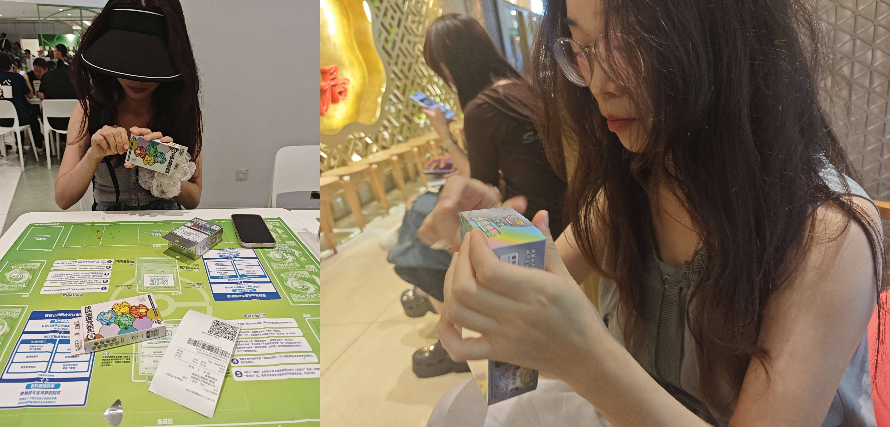

午饭选在正佳广场六楼的陶陶居，这是一家历史悠久的广州早茶连锁店。我们点了烧汁黑豆腐、生啫粉丝煲、鲜虾红米肠、豉汁蒸排骨和陶陶居大虾饺。**排骨是最令人惊艳的**，肉质嫩滑，带有一点点辣味提鲜——作为对排骨不太感冒的人，我愣是把这碗排骨吃得干干净净；虾饺的个头很大，里面的虾肉非常足；我俩对红米肠望而生畏（都不吃大肠），实际上这里的语境类似于肠粉，其表皮是红米磨浆做成的，味道很不错，吃撑了打包也很方便。

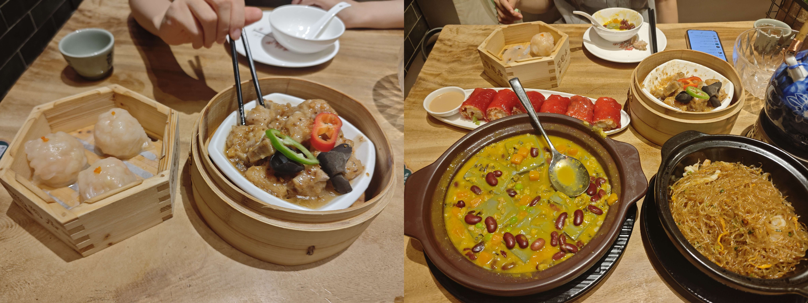

下午时间有余裕但不多，不如当一回 P 人继续在正佳广场里漫步。由于我俩对极地海洋世界、雨林生态植物园等正佳特色都不感兴趣（可能这更适合带孩子来逛吧），只能逐层漫步，逛一逛各种新奇的潮玩店。

晚上 $19:00$ 正片开始——凤凰传奇《吉祥如意》演唱会。“吉祥如意”对凤凰传奇来说有着三重意义：

+ 它是一张专辑：这是他们的第二张专辑，从 400 多首小样中打磨 16 个月才诞生。
+ 它是一首歌：作为专辑主打歌，旋律里揉着蒙藏民歌的辽阔。为了拍这支MV，两人还专程跑到西藏纳木错，在海拔 5000 米的雪山上迎着刺骨寒风完成拍摄，形成了那种天地间浑然一体的祝福感。
+ 它是一场巡演：2024 年凤凰传奇在出道 20 周年之际启动的“吉祥如意”巡回演唱会，以回顾与祝福为主题。

整个演唱会分成了万物生长、儿女情长、人生旅途、家国情怀、热辣滚烫五个部分，相邻两个部分之间有乐队或 DJ 过渡，正好给曾毅和玲花腾出换服装的时间。我们是 $1080$ 的内场票，坐在舞台前的 C2 区。由于我们事先没有做专门的复（预）习，开场时连着三首歌都是没听过的，只能拿着荧光棒面面相觑，等到第四首的《我从草原来》响起才打消了我俩的疑虑。荧光棒的颜色变换是统一控制的，配合华丽的聚光灯形成了很棒的氛围。

+ 很惊喜第二部分有曾毅的粤语 solo《倩女幽魂》和《漫步人生路》，想必是特意为广东听众准备的。
+ 玲花的两首 solo 《白马赞》和《特斯河之赞》都是用蒙古语唱的，听不懂但是很霸气。
+ 歌单里会有一些非凤凰传奇原唱的歌曲，例如《海底》、《红日》、《小刀会序曲》、《好汉歌》、《好运来》。选到《海底》让我颇感惊讶，这是一首我非常喜欢的小众歌曲，其忧愁的基调和玲花的嗓音不太搭。
+ 从第四部分开始气氛就热烈起来，内场观众会在演唱热门歌曲时起立蹦跳。这个景象在第五部分达到了高潮，曲子选的是脍炙人口的《月亮之上》、《绿旋风》、《奢香夫人》、《自由飞翔》、《最炫民族风》等，蹦跳起来很有节奏感。正好曾毅和玲花已经唱累了，高潮部分采用“我唱一句观众唱一句”的机制毫无违和感。

## 第二天·广州 City Walk

考虑到我俩对建筑和文化很感兴趣，我在携程上预约了 $9:00$ 开始持续 $1.5h$ 的陈家祠讲解。在公众号上预约门票是 $10$ 元一位，携程带门票的讲解是 $58$ 一位，非常实惠。导游是一位年轻和气的老哥，手执一把折扇，话里带有很舒服的广东口音。当日他总共只接待了三位游客（另一位是个老太太），属实是让我们捡到了便宜。

陈家祠门口的广场原本是一方池塘。岭南传统宗祠讲究“藏风聚气，得水为上”，池塘蓄水能滋荫地脉、涵养真气，是广东人说的“风水塘”。广场东西两侧矗立着旗杆，四斗旗杆和三斗旗杆并排而立：四斗为最高级别，左右相加后为八斗，象征“才高八斗”。立起四斗旗杆的是光绪十八年探花陈伯陶（暨南大学创始人之一），立起三斗旗杆的则是陈昭常、陈启辉、陈振先三人——每一根旗杆背后，都是一段光宗耀祖的科甲佳话。

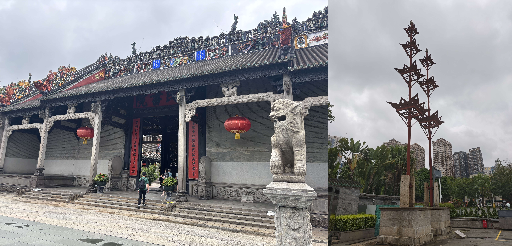

陈家祠正式名称叫“**陈氏书院**”，但它并不是真正意义上的书院。它本质上是一座“合族祠”——由广东各地陈姓族人共同出资捐建，供族人供奉祖先牌位、春秋祭祀的场所。为什么要建？当时各地陈氏子弟到广州参加科举考试、候任、交纳赋税、办理诉讼等事务时，缺少一个落脚的地方。于是光绪十四年（1888年），陈伯陶、陈兰彬等 48 位陈姓士绅发起倡议，向广东各地陈氏宗族发出信函，邀请大家共同出资建造。清代乾隆中期开始，广东官府多次因合族祠“把持讼事，挟众抗官”而下令禁毁，各姓合族祠纷纷改称“书院”“书室”来遮人耳目，陈家祠也在其中。

陈家祠的建筑装饰可概括为“**三雕二塑一铸一画**”，合称“七绝”，是岭南建筑工艺的精华。

- **木雕**：木雕是陈家祠里数量最多、分布最广的一类，梁架、屏风、神龛、雀替上随处可见，有双面镂雕、单面镂雕等不同工艺，件件精美绝伦。印象最深刻的是正厅的“竹福”屏风，远看是一个用竹子构成的完整福字（竹福组合寓意“祝福”），近看可分解为“多寿”二字；一左一右互为倒写，寓意“福到”。
- **石雕**：石雕主要用在廊柱、月梁、栏杆、柱础等需要承重或防潮的部位，材料多为广东本地麻石。聚贤堂前月台的石栏杆是代表，用麻石雕出了菠萝、杨桃这些岭南佳果。门口那对石狮子也雕得活灵活现。
- **砖雕**：砖雕多分布在门墙、墀头、廊门等处，采用岭南特有的“挂线砖雕”工艺，以东莞青砖为材，线条纤细如丝。大门两侧六幅大型砖雕格外醒目，这些砖雕并非全部镂空，而是大量采用“贴”的工艺——工匠先将图案逐块雕琢，再按部位拼接镶嵌于墙上，这样更能表现细微之处。部分图画上刻有制作商或工匠的名款，如右侧中间的《刘庆伏狼驹图》下方就刻有“瑞昌造”的字样，让人看到百年前的“品牌意识”，令人莞尔。
- **陶塑**：陶塑是岭南建筑屋顶正脊上的装饰，用石湾陶塑技法烧制而成，色彩绚丽，人物场景如粤剧戏台般热闹。聚贤堂正脊那条陶塑长达 27 米，站着 223 个粤剧人物，两头蹲着两条翘起的鳌鱼，寓意“独占鳌头”。
- **灰塑**：灰塑是直接在建筑现场用石灰、糯米浆、红糖等材料堆塑而成，多用于门额、山墙、屋檐瓦脊，题材灵活自由。陈家祠的灰塑总长 2500 多米，从三国故事到羊城八景都有。头门山墙顶那几只朱红色的独角狮，就是灰塑的代表作。灰塑色彩艳丽，但因日晒雨淋需要定期“补妆”，我们逛的时候就有施工队在驻场。
- **铁铸**：铁铸在陈家祠应用较少，主要出现在聚贤堂月台的铁铸通花栏板上。这 16 块栏板与石雕框架结合，雕着麒麟、三阳开泰等传统图案，风格上还吸收了西方庭院装饰的特点，算是中西合璧的体现。
- **彩绘**：彩绘主要指建筑上的壁画和门神彩绘。最显眼的就是大门上那两位4米高的门神——红脸秦琼、黑脸尉迟恭，运用勾线重彩技法绘制，据说是广东现存最大的门神彩绘。大门上还有一对纯铜铺首拉环，每个重达30 公斤，距离地面 2 米多高——这个看起来用来叩门，实际上是陈氏家族等级观念的符号与装饰。

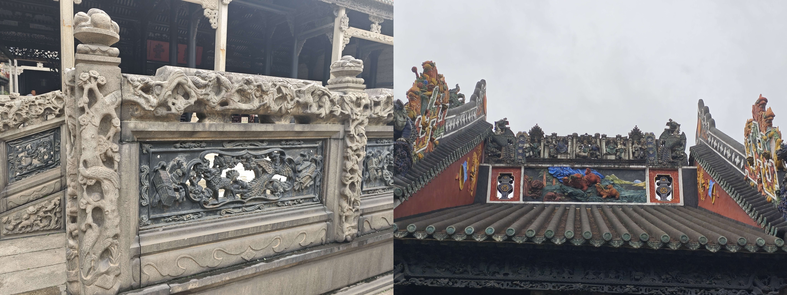

陈家祠大厅里地势较低，正是为了汇聚水气——水即财，水聚则财聚。积水可通过管道排至外面的水塘，所谓肥水不流外人田。进门后回头看屋顶，能找到“光绪”年号的字样。连接各进建筑的巷子叫“青云巷”，从前往后地势一进高于一进，人走在巷中不断登高，寓意“平步青云”。中进的正厅是“聚贤堂”，**匾额上“聚”字的竖钩方向故意取反**，因为传统写法中左勾形似匕首，刀尖指向“贤”字不吉利，改为右勾寓意“汇聚贤才而不割裂”。再看房梁，红色的梁木寓意“鸿运当头”；屋顶两端有两条鳌鱼，龙首鱼身，立于屋脊鸱吻位，古人希望子孙在科举中“独占鳌头”。聚贤堂门口的装饰上，老鼠、葡萄、荔枝等图案随处可见——老鼠多子，葡萄和荔枝也寓意多子多福。

后进就是祠堂，正厅里共设有 11 个神龛，最多时摆放过上万个神主牌位。参与捐资的县份涵盖 71 个县、2 个州。祠堂的章程里写得明白：董事每人捐银一百两，可以入主正座，三代不用再交钱；广东各房想入主正座陪享，每位交银四十两；旁座每位二十两；厢房每位十两。可惜这些牌位在“文革”时全被烧了，11 个神龛也被打碎，直到上世纪 90 年代才陆续修复，如今保存下来的神主牌只有两块，是工作人员在石台沟里捡回来的。

陈家祠在历史上也不止是祠堂，它曾做过学校、工厂、仓库，几经磨难。有一进厅堂的木雕看着非常怪：上层破损明显，说是放在仓库里泡水导致的；下层的色泽显著变绿，说是革命时损毁后补做的。屋顶有一处灰塑看着很新，说是近年台风损毁后重做的。幸得抢救修缮，才让这座“岭南建筑艺术的明珠”今天依然熠熠生辉。

1958年，陈家祠由广州市文化局接管，此后被列为全国重点文物保护单位，同时也是国家一级博物馆，又名**广东民间工艺博物馆**。所以陈家祠内部不仅保留了祠堂的格局，还珍藏了各类工艺珍品：用贝壳创作的“惠来贝缀”画，色彩温润，工艺独特；一幅很大的贴金画（潮州金漆木雕），金光璀璨，细节繁复；还有从景德镇买来白胎、再在广州加以彩绘的瓷器——广彩瓷器的特色正是在此，它采用了景德镇瓷器的白胎，又融合了岭南的彩绘风格，每一件都是岭南工艺的缩影。展厅里还会不定期轮换展出石湾陶塑、潮州刺绣、肇庆端砚等民间工艺精品，说是“一座祠堂装下半个广东工艺史”也不为过。郭沫若参观后曾赋诗赞叹：“天工人可代，人工天不如。”

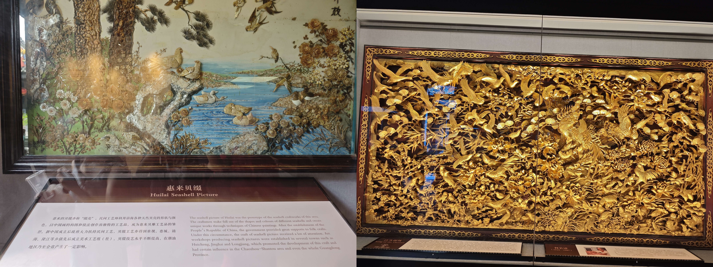

下午我们去逛了逛越秀公园。广州的蜗牛和虫子确实比浙江的大一圈。可能由于天气太过闷热，越秀湖上的游船都没有开。更糟糕的是公园里蚊虫很多，腿上一不注意就叮满了包。我们从正门（西北门）进入，原计划逛完古城墙和中山纪念碑后从西门出去逛中山纪念堂，临时决定逛完五羊雕塑后就从西南 2 门出打道回府。

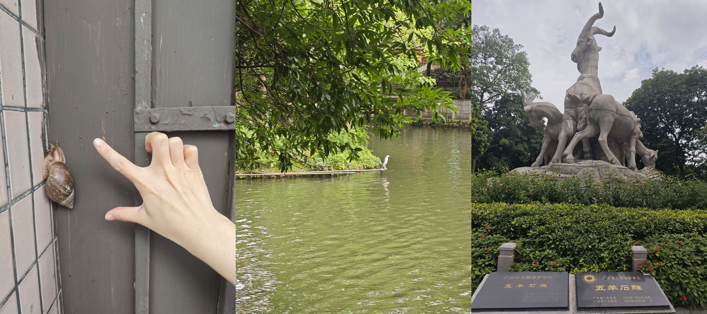

从越秀公园坐两站 2 号线抵达公园前站，有个出口连接了一个动漫广场，和杭州湖滨银泰 in88 的谷子店接近。从车辆穿梭的中山五路右转切入宽阔而繁华的北京路步行街时，眼前之景给我一种长沙黄兴路步行街的既视感。广州的天色说变就变，刚到时零星地下了几滴雨，路过大佛寺和广百百货后突然下起了暴雨——撑着伞行走都很狼狈的那种。我们在屋檐下避雨许久不见好转，只得冲进对面的天河城里逛，正好打卡天河城的宝可梦快闪店。

晚饭选在了隔壁的旺角冰室，装饰地道、价格亲民，难怪人气这么高。店外侧设有可吸烟的座位，这么讲究好评。我俩中午吃得非常饱，这里各自点一份主食即可，人均在 $40^-$。励颖自从去过香港后一直沉迷于出前一丁面，这次选的是五香肉丁（汤丁）；**我点了看似很常规的滑蛋牛肉面，牛肉量很足、肉质嫩滑，吃得非常满足**。

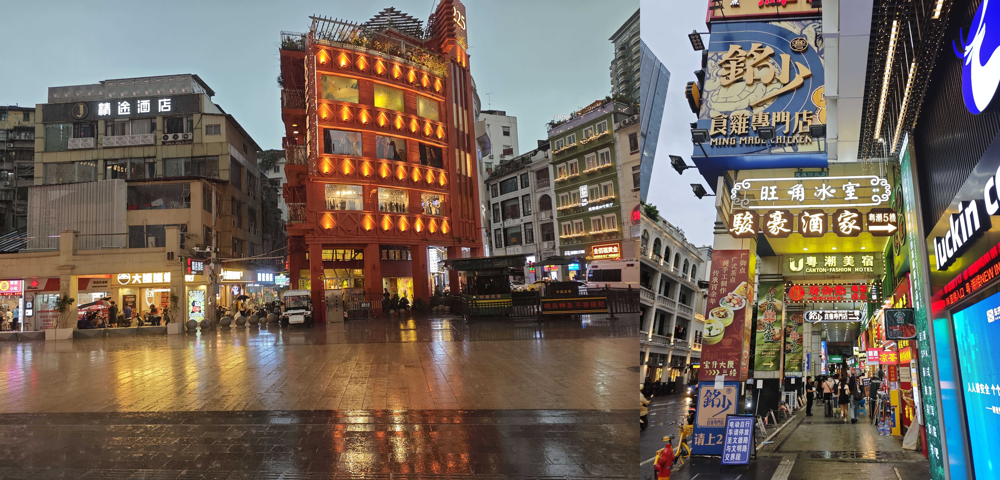

## 第三天·长隆野生动物园

我计划第三天自北向南游览长隆野生动物园。攻略里会说汉溪长隆地铁站 E 口有官方摆渡车，我俩就以 $9:30$ 入园为目标卡点抵达 E 口。出站后下起了中雨，我俩狼狈地沿着指示牌行走，最后发现只能先摆渡到南门再换乘去北门。为了节省时间，我当机立断打车去北门，很懊悔没有在 3 号线靠北的上一站“大石”地铁站下车。

北门寄存完行李后我们直奔网红小火车，工作日+雨天双重 buff 叠加下只排了 $10$ 分钟。小火车会沿着园区西部环绕一圈，和自驾游共享同样的路径，全程半小时。一路上植被覆盖茂盛，涵盖澳洲森林、美洲丛林、亚洲森林、狂野地带、猛兽地带、东非草原等多个主题，随车讲解员会用俏皮而耐心的语言为我们讲解当前的看点。我记得白虎的住处有高高的围栏围着，而狮子和熊的住处只隔了一条沟壑，希望园区能准确把握这些猛兽的跳跃能力。

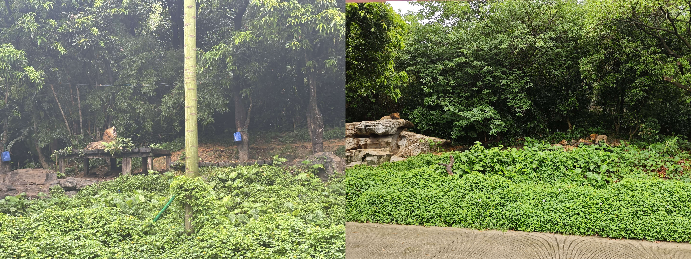

下一站是青龙山，这里设有侏罗纪森林、雨林仙踪和金蛇秘境。整座山覆盖了茂密的植被，刚进门就沉浸在充足的水气里，氛围感拉满。沿着山路行走，路旁时不时会跳出一只恐龙模型，晃动着发出叫声——可惜我已经过了这个年纪。整个动线设计得很不错，中途设有好几处“供不安游客快速离开”的通道。广州的天气难以捉摸，走着走着突遇暴雨，我们只能穿起雨衣打起雨伞。雨林仙踪里主要是猴子和鸟类，金蛇秘境因为时间问题就没去。

$11:20$ 我们准时赶到白虎山观看白虎跳水。一开始我非常好奇驯兽师要如何指挥白虎跳水，观看后不禁感叹人类智慧：工作人员把挂着鲜肉的钩锁移动到树上或水面上，白虎被肉类吸引就会跳到梅花桩上/跃上水面。

在白虎跳水旁边的科莫多龙出口处，我们目睹一位穿着奇装异服的 NPC 正在给一帮参与互动的孩子每人发放一张墨绿色的纸币，励颖就如旋风般地冲了过去。据说这种纸币被称为考拉豆，是长隆野生动物园纪念 20 周年推出的专题活动，集齐若干张可以在南门或北门换取对应礼品。工作人员和我们各自玩了一次猜拳，励颖获得了胜利；可惜他手里的考拉豆发完了，便送了我们一份书签——后来我们了解到，这就是一张考拉豆换的礼品。

长颈鹿园区可以喂食，官方提供 $36$ 一大束的新鲜树枝，指示牌上有温馨提示“可以掰着喂”。长颈鹿会用它深色的舌头来卷走树叶，很好玩；等长颈鹿吃多了嘴里会流出很多水，不知是树枝汁液还是口水。长廊里游客们争相在长颈鹿前拍喂食的照片，特别是那些抱着小孩的家长，想努力为孩子摆出一个帅气的喂食 pose。

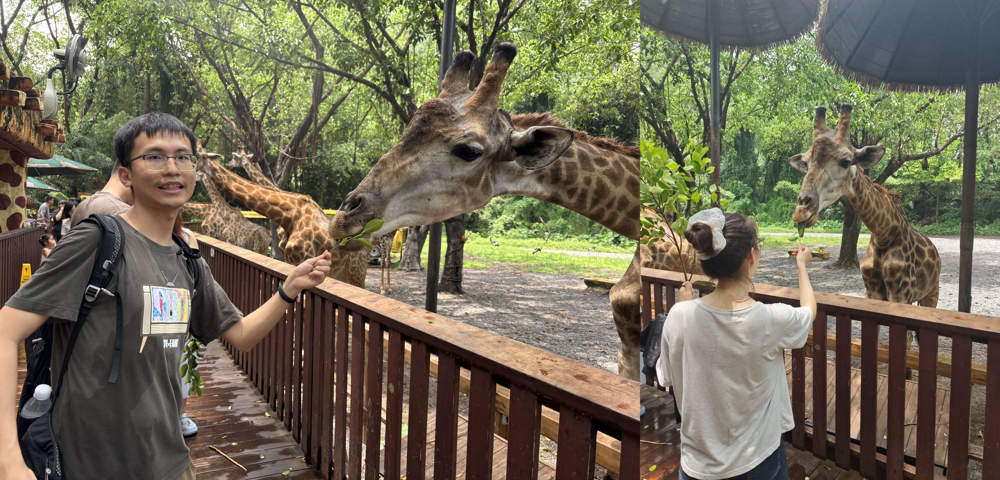

作为 P 人，我精心研究了各项表演的时间表，串联了一条非常精细的表演欣赏路线（前半程和左下小红书攻略接近）。正走向大象传奇，行至考拉园附近时励颖被一位手里攥着一大把绿色代金券的 NPC 吸引过去了。前面一群小朋友们正在与他互动，考题是“动物园里有什么”，坚持三轮念出不重复动物的孩子就能获得一张代金券。我们这批四个大朋友的考题是“词语接龙”，允许用 $2 \sim 4$ 个字接龙，首尾字必须严格相同。我对“词语”接龙的研究甚少，实测发现很多起始字都让人倾向于以“子”结尾。最后我俩顺利通过了考试，获得了各自的第一张考拉豆。

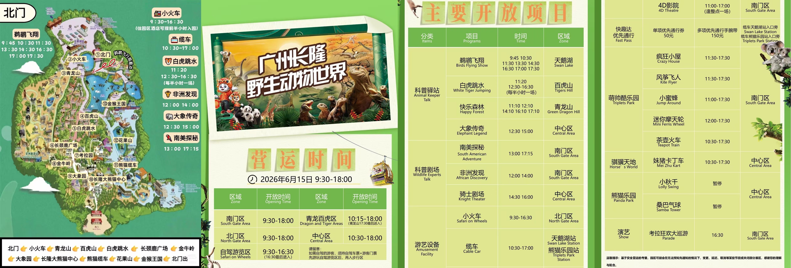

$12:30$ 《大象传奇》迟到了一点。同样，饲养员通过抛食物来控制大象的出入场。大象的鼻子很灵活，能够轻松从高处的桶子里戳出胡萝卜，甚至可以向上卷起来有节奏地摆动着，这时候往往能博得观众的喝彩声。印象深刻的是大象如何开椰子，主持人的悬念刚抛出来，就看到大象一脚踩碎了椰子壳，现场顿时响起了一阵“哇”的赞叹声。

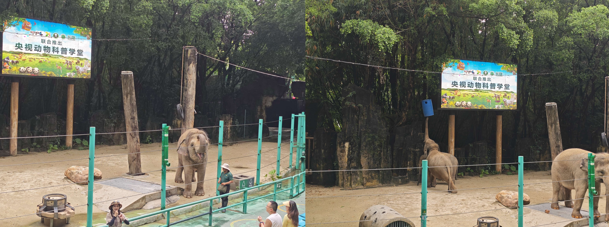

熊猫商店买了杯熊猫冰粉补充能量后，赶往 $13:00$ 的《南美探秘》。在引导员的讲解下，我们围观了黑蜘蛛猴、棉顶狨猴、红领狐猴沿着绳索爬出来，粉红琵鹭、火烈鸟等成群来到草坪中央，以及各种鸟类飞跃过顶棚。印象最深刻的是树懒，当爬行速度慢到一定程度时就给人一种滑稽的感觉。散场后有收费拍照项目，游客可以进入草坪和指定动物近距离合影。很多工作人员在场地里指挥动物回家，树懒依然是最亮眼的仔：工作人员把一段树枝递到它跟前，它抱着原来的树干迟迟不愿移动，一人一獭就这么僵持在那里；最后是工作人员的耐心击败了树懒的慵懒，后者同样以极慢的速度移动，当它把整个躯干都腾挪到树枝时，工作人员立即旋转 $90°$ 扛着树枝进屋了。

行至南门缆车附近，正好遇到一位小丑演出完毕，小朋友们排成一排欲与之合影。我们作为“成年人”漫不经心地经过，小丑突然跑过来抓励颖，把我俩都吓了一大跳。励颖下意识地往前跑，小丑大张旗鼓地向前追，她绕了一大圈还是被“逮捕”了。感谢如此盛情的工作人员，让我们体会了一会孩童般的欢快和刺激。

天公不作美，长隆上空再次下起了雨，我们在亚洲美食店里躲了会并无好转。注意到北侧有很多游乐设施，诸如小蜜蜂、迷你摩天轮、疯狂小屋、风筝飞人等，我就提议穿着雨衣过去玩耍。谁知向北行进了一段路后雨越下越大，游乐园里的露天设施完全玩不了了，很多人都拥堵在 4D 影院里躲雨。考虑到影院每逢整点都有一场，而 $14:00$ 是《非洲发现》的最后一场，我们折而向南进发。经过缆车站时，励颖的雷达捕捉到一位手持考拉豆的 NPC，她迅速跻身人群参与活动，表演什么的都无所谓了。这位 NPC 面前围了三四组家庭七八个人，题型单纯而硬核：他每次出一个考题，最先答对的人获得一张考拉豆。题目总体是非常硬核的，特别是和长隆强相关的题目我们完全答不上来（如熊猫萌萌最近诞生的幼崽叫什么名字，说出至少三个长隆里有展馆的猴子）。通用动物知识题是最有希望的，犹记得有几个问题刚念完我心里就有了答案但一时无法验证其正确性（如被誉为高山之舟的动物是什么，唯一能倒飞的鸟类是什么），犹豫间就被其他人多次尝试后抢答走了。最后我们忙里忙外只赚到两张券。

因为在奋战答题，$14:00$ 的《非洲发现》迟到了几分钟。这里的表演模式和《南美探秘》高度相似，随机抽出一只动物出来完全判断不出来自哪个舞台。观众席上有遮雨棚可以避雨，舞台中间的草坪完全是露天的，这群鹈鹕和鸵鸟纷纷淋成了“落汤鸟”。每场表演的时间一般是 $15 \min$，这一场不到 $10\min$ 就匆匆结束了，主持人解释说雨太大很多动物没法出境。我俩悻悻离去，正巧路过河马居住区，看到一只躺着发呆的和一只正在潜水的。

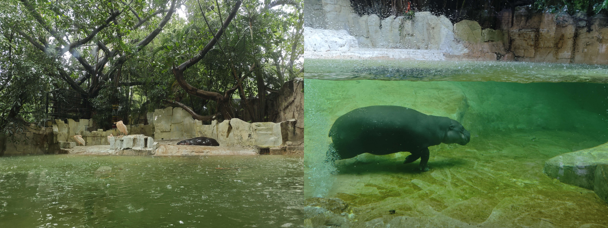

$14:30$ 是《骑士剧场》，看介绍应该是马术表演。由于 APP 上没有收到任何取消通知，我俩怀着一丝丝希望硬着头皮导航过去。一路上可以看到动物们稀奇古怪的避雨方式，有的躲在岩石里，有的躲在工作人员的伞下，有的仗着自己厚实的毛发硬扛大雨。走到骐骥之镜时场地山海空荡荡的，希望终于破灭了。同样，缆车也取消了。

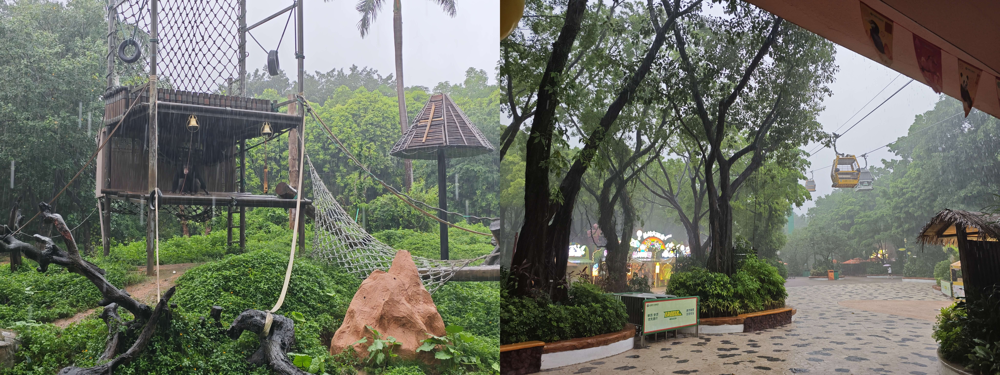

因为大雨的关系，《妹猪卡丁车》没人排队。幼时我在儿童乐园里总是要排长长的队才能玩上两分钟碰碰卡丁车，大学里去俄罗斯集训时体验过一把真正的高速卡丁车，没想到这里能重温这种感觉。我隔着围栏问工作人员现在还能开不，她愣了愣说可以，我就这么水灵灵地跳上车了。一踩油门傻眼了，这辆车实在太龟速了，比记忆里儿童乐园的碰碰卡丁车都要慢上不少，励颖在旁边估算说车速只有 $1m/s$。我就这么驾驶着这辆老爷车绕了一圈，中途一不小心把前轮抵到内圈就卡得无法动弹（只有油门、刹车和方向盘，没法倒车）。

接下来我们逛了逛南门的景区，包括火烈鸟岛、熊森林、湿地精灵、丛林发现（动物们的手术台）等。

+ 火烈鸟岛最为震撼，淡粉色的火烈鸟单脚或双脚踩在水里，无惧雨水。火烈鸟的红色并非与生俱来，而是靠吃富含类胡萝卜素的藻类和虾类，经体内代谢后把色素“染”上羽毛的。
+ 熊的毛发非常浑厚，应该无惧雨水的潮湿；大猩猩则乖乖躲在木制屋檐下。
+ 湿地精灵本质是一片被河流包裹的树林，林间的猴子躲在树里避雨，河流上的鸭子和天鹅则毫无影响。

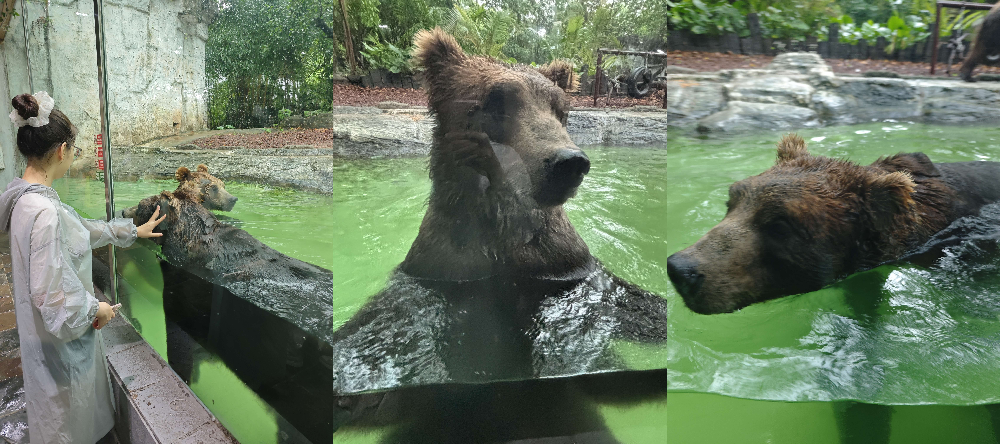

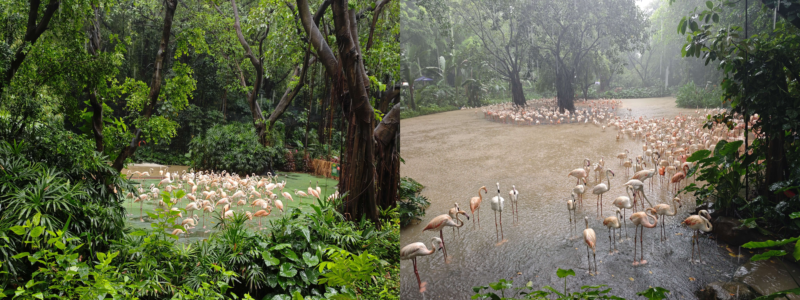

南门和北门的活动指南里列举了详细考拉豆的规则。通过分享至社交媒体（$5w$）、在 $10$ 个核心展区答对科普知识问答（$1w$/次）、与 NPC 互动（$1w$/次）、园区消费（$2w/5w$ 不等）可以获取考拉豆——除了 $1$ 考拉豆兑换的保底小书签之外，其他纪念品都至少需要 $20w$ 考拉豆兑换，不消费获取的难度非常大。反正大雨取消了很多活动，**我们索性把下午的目标改为如何顺利地凑齐 $20w$ 考拉豆**：每人分享一波能合计 $10w$，剩下的就只能靠核心动物展区了。于是我俩由南向北进发，一旦遇到大型设施或白虎、科莫多龙等大型展区就进去找 NPC 互动和答题，就这么苦心孤诣地凑到了 $10w$ 考拉豆。“猴子和猩猩外形最大区别”这个问题被考到了两次，答案是“猩猩没尾巴”。

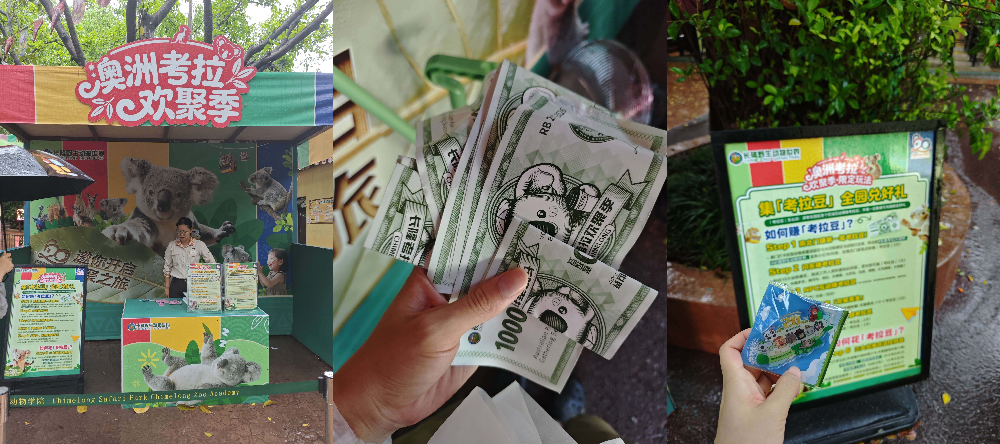

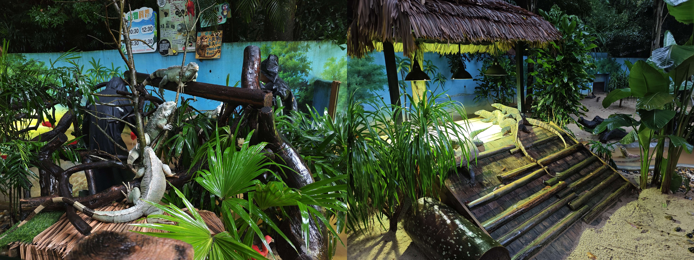

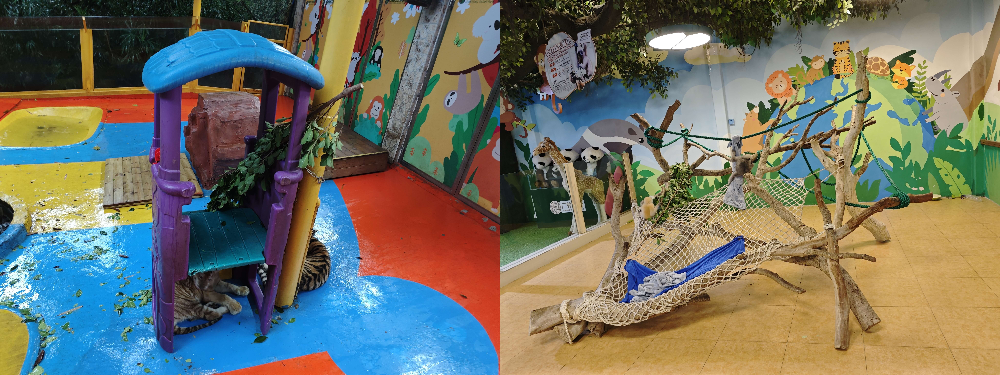

听说白云机场的 JPG 汉堡还不错，到店时说要等待 $40 \min$，后悔没有提前下单，只能买点菠萝包等小吃了。

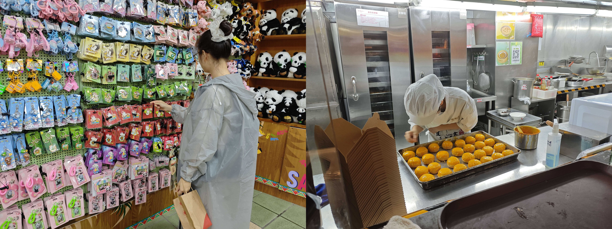
