$2021.09.19-09.20$ 的中秋佳节，和励颖去横店玩了一趟。

我们在景点的选择和票务的购买研究了很久，最后买了 **梦幻谷+三个主题景点** 的两日套票，并规划了具体的游览时间。景点联票 $410 \times 2$，交通费 $350$，住宿一晚 $200$，总消费 $1.5k$。

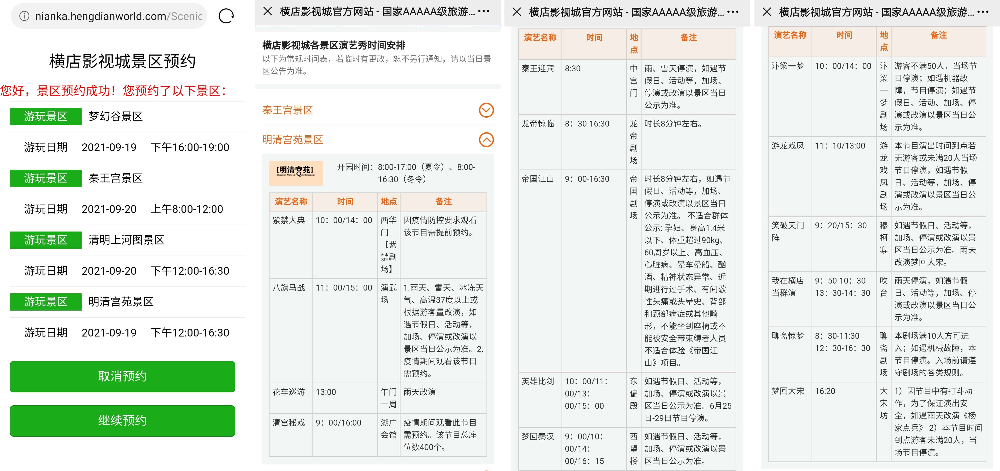

## 明清宫苑

杭州到义乌的高铁只要半小时，最麻烦的是从义乌去横店，直接打车要 $140$ 左右。我之前规划了一个高性价比的公交+打车方案，但出了火车站烈日炎炎，完全走不动路。还好励颖机智，花了 $60-$ 拼到顺风车，省钱省力。

我们下榻的梦意酒店位于梦幻谷和秦王宫之间，距离明清宫苑较远。中午稍事休息后打车前往。

明清宫苑仿故宫而建，是中国大部分宫廷剧的拍摄地。由于是 $1:1$ 还原，在宫殿之间行走会比较吃力，入口处很贴心地设有“多人脚踏三轮车租赁处”。首端的大姐很嚣张地说“统一价 $150$ 一辆，微信开锁，少一分都不行”，当我们强硬地步行到尾端时，成功砍价至 $50$（在园区随机采访了一位大哥，很惨地全额支付了……）。

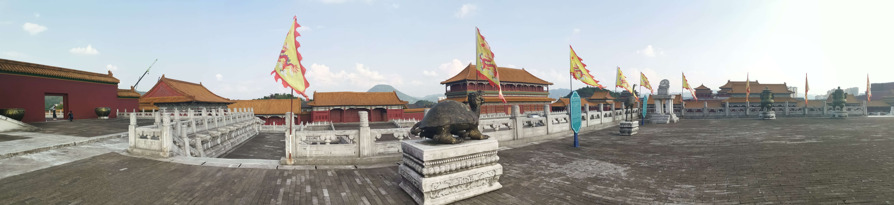

先观看了 $14:00$ 的 **紫禁大典**，围绕着紫禁城的主题，讲述了明朝、清朝、民国和新中国的往事。

$15:00$ 是 **八旗马战**，八旗统帅在马场接受康熙帝的检阅，依次展示自己的一项马术绝技。有意思的是，剧情里适逢吴三桂、耿精忠、尚可喜请求撤藩，康熙帝请他们一同观看马术。这三人看完后跃跃欲试请求下场比划，而吴三桂把八旗统帅都打爆了。康熙帝似乎早已料到，展示了他压轴的大炮，让吴三桂心惊胆战地离去。

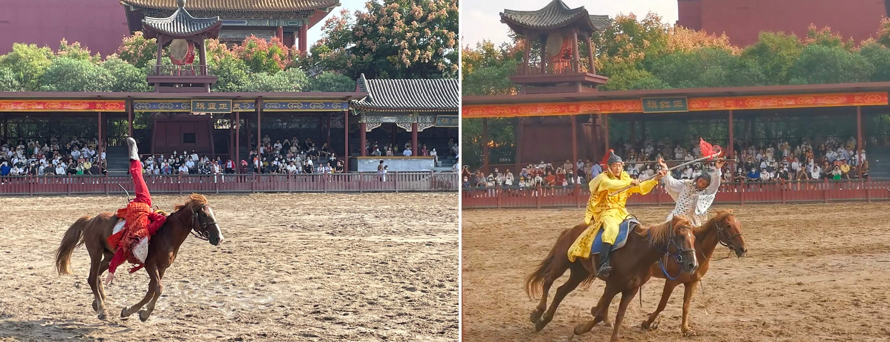

我们靠着三轮陆续打卡了各种宫殿和宫门，包括乾清宫、养心殿、慈宁宫、乾清门、隆福门、景运门等。

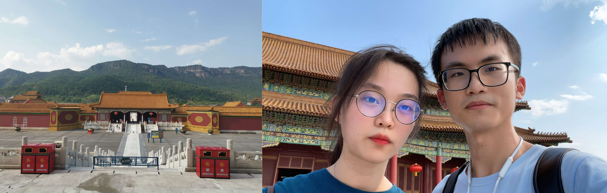

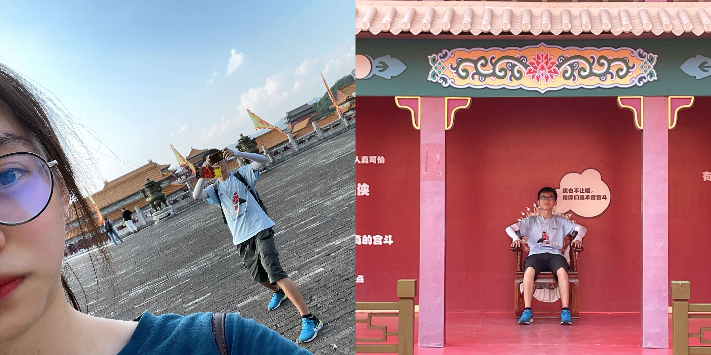

因为我的历史文化积淀少得可怜，对各宫殿的建筑细节一无所知，所以在我眼里他们都大同小异。励颖则沉迷于寻找入场时发的明信片对应的拍摄地，最后在一条不起眼的巷子里成功找到。

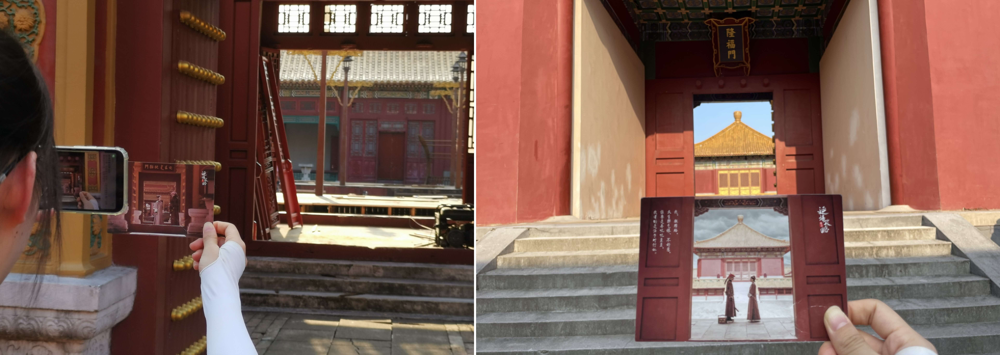

傍晚排的日程是梦幻谷水世界，只能缺席 $16:00$ 的清宫秘戏啦，感觉很可惜。

## 梦幻谷

兴冲冲地回宾馆拿泳衣穿童鞋赶去梦幻谷，被门口的保安狂泼冷水：梦幻谷水世界在八月底后就关了！如今的梦幻谷相当于一个大型游乐场，不过一般的游乐场是白天营业，它靠着精美的灯光和盛大的表演把游客留到了晚上。

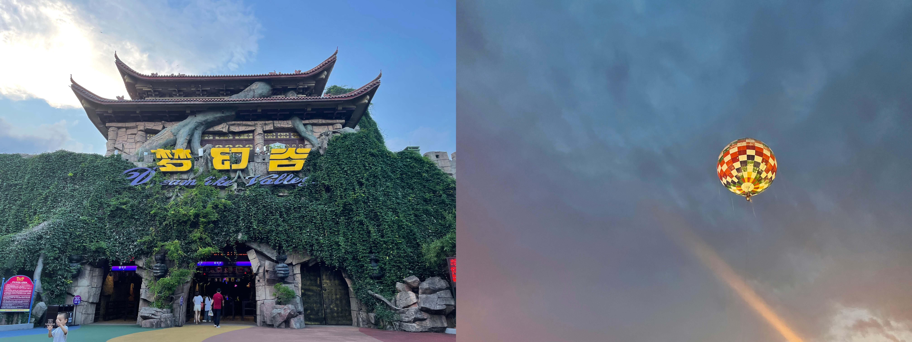

刚进门就是刺激的“雪域飞鹰”（游客坐在环形旋转的座位上越升越高），我迅速意识到我来错地方了= =回想起了海盗船的童年阴影以及温州乐园的过山车阴影，拒绝了励颖的百般邀，最后和她去坐了坐旋转木马凑凑数= =。

穿上羽绒服后进入 **冰雪世界**，有一些冰雕和一个寒冰滑道。然而我们穿的都是 **拖鞋**，寒气很快把我的脚指头冻住了，疼完一段时间后它失去了知觉= =。需要坐上轮胎滑寒冰轨道，每次滑下去我的帽子都会被气流掀开。

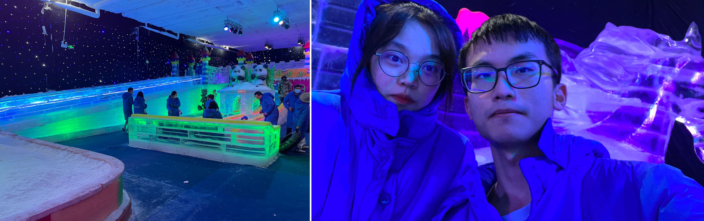

然后进入了恐怖城区域，路边的装饰挺吓人的。鬼屋做得非常的细致，比我去过的所有鬼屋都要长。我们俩一开始在门外瑟瑟发抖不敢进去，好不容易拼了两户一起上；前期走得特别缓，带头大哥走了会就怂了，我们一帮人就卡在中间；队伍后面突然跑出来一个熊孩子，大叫着窜到了队伍前面带路，“很义气”地给我们剧透前方的机关：“别怕别怕，这里没事”“前面有个人会仰卧起坐，小心”“这里有一声大吼”……害，整个队伍的游客都很扫兴，却不好意思凶这个热心的小朋友。最巧妙的还是出口处，假装写着“体验已结束”，前面一段路又突然跳出来一个鬼。

梦幻谷的夜光场地设计得很不错，有很多有趣的发光场景：月光座位、昆虫翅膀、奥特曼和月亮……

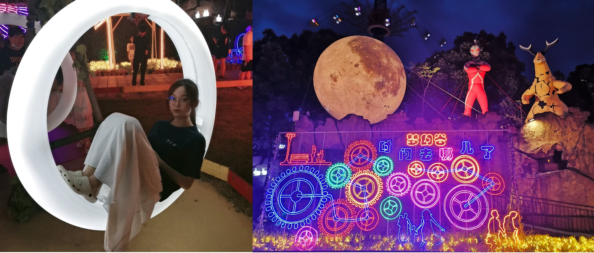

$19:00$ 上演 **暴雨山洪**，这也是众多梦幻城评论里的推荐节目。导演为剧情和场地煞费苦心，道具、灯光都很震撼，和宋城的节目体验差不多。舞台两侧是火炬，开场时信号弹掠过并点燃火炬，感觉十分刺激。

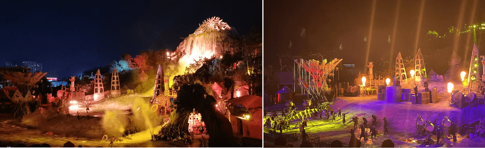

抽空去排了个 **疯狂碰碰车**。处心积虑挑了一辆好车，却被后头的一辆废车卡在原地动弹不得= =。

$20:00$ 上演 **梦幻太极**，天空飘着的小雨没有影响到节目的火焰效果。春夏秋冬各取了一个神话故事，包括后羿射日、共工怒触不周山、女娲补天等。最后，身着黑白服装的演员化成了太极图（要是跳得齐一点会更好看）。

走之前决定做一回男人，毅然冲向了 **雪域飞鹰**。上座之前和励颖约定，**要是突发不适，让她多找找话题帮我转移注意力**。一升空后我就紧闭双眼。该来的还是来了，当转速提高后，我整个人就不对了，熟悉的那种童年恐惧涌上心头。我大声叫喊着“我下次在也不来了……我要跳下去……我要死了……”霎时间天旋地转，想要极速脱离这恐怖的感觉。过了会我听到励颖在耳边安慰，我强行让自己镇定下来，找了个以前自助餐的话题疯狂和她聊天，靠着这几分钟的对话欺骗自己的大脑挺过去。当座位快触及地面时我才敢睁开眼睛，下来后仍旧天旋地转。

老套路，商家“热心”地帮拍了照片，花了 $40$ 买了两张（右图励颖的笑和我的紧闭双眼形成鲜明对比）。

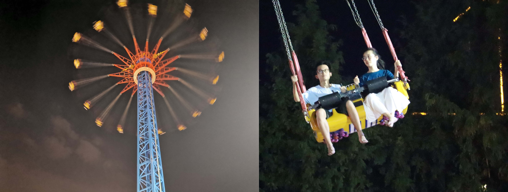

可恶，我明明是来玩水的，怎么被励颖骗进了游乐园。**下次再也不去游乐园了**……

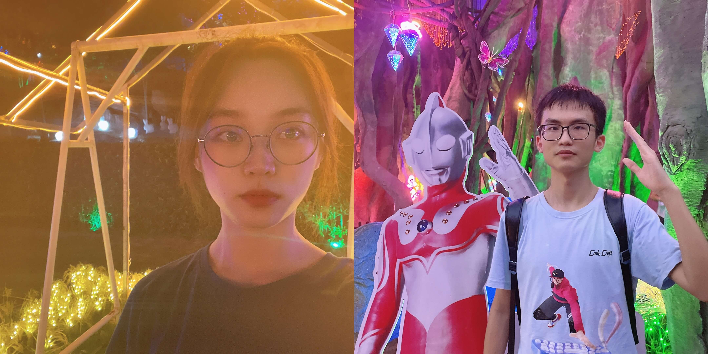

影视城边上没啥好吃的店，漫山遍野都是重庆小面和 xx外婆xx。深夜整了发麻辣烫，我还吃出了异物。

## 秦王宫

秦王宫的气派从外侧的城墙便可窥见一斑。穿过大门，正殿的 99 级阶梯映入眼帘。

我们到门口的时候大概是 $9:45$，骄阳似火。为了追赶 $10:00$ 的 梦回秦汉，我负责打伞辅助，励颖负责看地图导航。当我们辗转来到大厅时正好 $10:02$，但门口的工作人员不肯放我们进去，说 $9:52$ 时已经达到人数上限，并建议我们 $10:30$ 就可以来等待 $11:00$ 的加场了。励颖变得像刺猬一样气鼓鼓的，杵在那儿打算一直等到 加场。我心想等一个小时也太好久了，于是好言安慰了很久才把她拉离，带着她去别处转转。

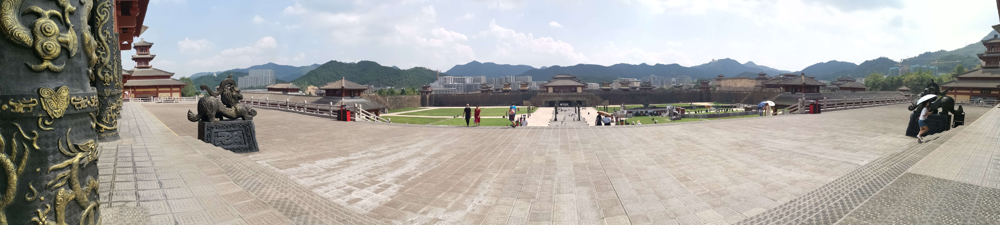

**地下皇城** 凉爽惬意，一侧展览了春秋战国时期的冷兵器，一侧还原了兵马俑。作为已经看过西安兵马俑的高级游客，我们深感不以为然。走出地下城就是秦王正殿了，殿内满是租衣服的商家和拍照的游客。再向前是帝国江山节目，门口的志愿者说一共要排一个多小时，于是我们灰溜溜地离开了。我们在 $10:25$ 返回梦回秦汉，成功做上了最早的一批观众。等待时在美团上搜了搜攻略，说最好看的节目是帝国江山和龙帝惊临。

**梦回秦汉** 开始时，一个酷似游客的人被拉上了舞台，观众哄堂大笑。随即大家发现他也是演员，整个节目以他为视角，穿越回古代和秦始皇、汉武帝对话，询问秦始皇为何用长城抵御匈奴，而非出兵攻打。剧情一般，不过视觉效果做得很好，台上的人物完全融在了背景里。我甚至怀疑舞台上有两块屏幕，演员则站在中间演戏。

结束后乖乖去 **帝国江山** 排队。好家伙，这次队伍更长了，屋子里外全是蜿蜒的通道和排队的人，一共等了 $50$ 分钟。墙上挂着告示“本项目不允许高血压、心脏病、$1.2m$ 以下儿童参加”，让我很紧张。进去后大家坐成一排，随身物品放在凳子底下，肚子前面扣上了游乐园式的闸子——我的血压瞬间拉满。随后整排座位缓缓向前移动，一直移动到一个悬空的位置——前面是一块巨大的屏幕，播放着秦帝国统一前后的历史。我一看脚下空空荡荡，连忙把注意力转移到屏幕上去。身下的座椅会随着画面运动，比如化身为鹰的时候会剧烈地向前倾。看到高潮的时候视野从高空摔下去，配合着座椅的失重，我在晕眩中急忙闭上眼睛= =。睁眼偷看旁边的励颖，她倒是看得津津有味。最有意思的是攻城环节，视野位于撞城木的顶端，观众被快速推到城墙上，然后 BANG 地弹开，如此贩毒才撞开城墙。我在每次撞击的时候都紧闭双眼，励颖则评论说想用脚踹城门（真是奇怪的反应= =）。

一经过 **影视长廊**，励颖的腿就迈不开步，疯狂找胡歌的海报。我在楼下的器械场地拍了拍照。

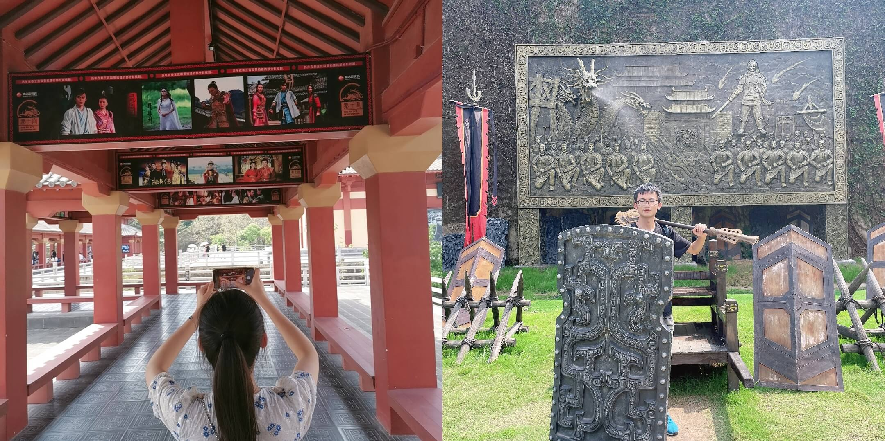

然后我们绕进西宫门，来到 **龙帝惊临** 项目，大概等了 $30$ 分钟。这个项目也比较刺激，七八个游客一组坐上一辆小车，在昏暗的隧道里向前开。每一处地方都有大屏幕，播放着“秦始皇化身恶龙出现在人间”的剧情。这个项目由于佩戴了 3D 眼镜，视觉冲击力更大，配合小车的旋转和失重，再一次让我感到不适。对于坠落和冲击的镜头我按惯例闭上眼睛= =等到小车开出场地，我兀自头晕眼花，励颖则评论说“就这结束了？”

走的时候发现了一个出售纪念币的自动售货机（和鹿回头那里的类似）。我对这种纪念币毫无抵抗力，束手就擒。

## 清明上河图

清明上河图距离秦王宫一公里。烈日炎炎，我们坐了个 $10$ 块的皮卡去检票口，体验感极好。该景点以张择端的《清明上河图》为模板，打造了汴京繁华的景象（其实我很不解，开封真的是这种多小桥流水嘛）。

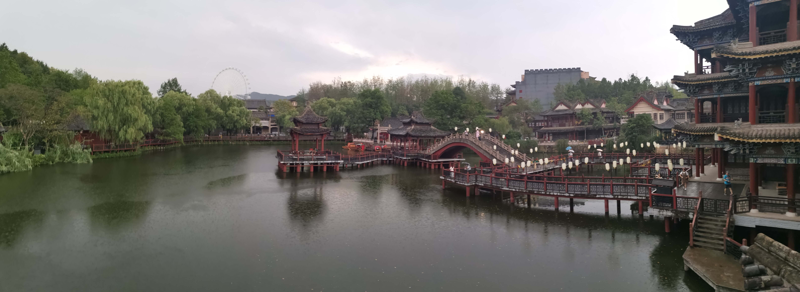

惊险地赶上了 $14:00$ 的 **汴梁一梦**。总时长 $50$ 分钟，以张择端外出取材为主题，勾勒出繁华而神奇的汴梁生活。横店的每个舞台都是为对应的表演定制的，因此舞台上突然出现房子或者桥不足为奇。汴梁一梦里有极其出色的杂技，辅以优美整齐的舞蹈和有趣的魔术，我们看得津津有味，大呼过瘾。

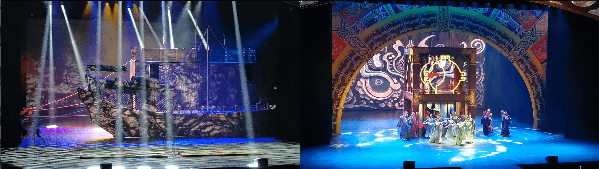

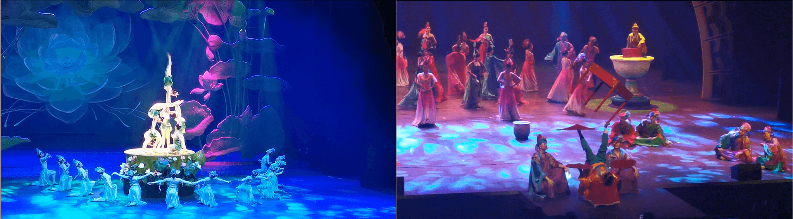

在景区里逛的时候，经常会遇到不同的剧组圈了一块地在拍戏（大概是以宋朝为背景的剧很多吧）。游客们大多只能看到外围的卡车和道具组，我俩还侥幸溜了景区看到了几个群演在拍戏。

逛到一半突然下起了大雨，我们就躲在一家汉服店里。$15:30$ 时正好雨停，露天表演 **笑破天门阵** 得以正常安排。该节目主打欢乐气氛，讲述了杨家将众人在破天门阵时搞笑经历。我比较喜欢五毒里的蛤蟆，演员硬实力很高，可以在水泥地上轻松后空翻。台词里穿插了很多现代的梗，反而让我觉得有点别扭。爆炸的火药味很浓。

随后我们去大宋坊逛街，整理点气泡水、武大郎烧饼和馄饨。顺手买了这里的纪念币。$16:20$ 的 **梦回大宋** 正好在大宋坊的街上表演。我还以为又是场高质量演出，为了和励颖抢前排不惜蹲在地上。其实是一帮杨家将大汉穿着军服来溜一圈，找了 $10$ 个观众拔了拔河（所谓招壮丁征兵），赢的五个发了份“交子”，然后就结束了……

按照我的计划，返程前我们去出口处好好购物一番（之前在明清宫苑和秦王宫的出口都有纪念品出售，但是我们来去匆匆）。走到距离近的 $2$ 号出口发现没有店。研究了一下地图，$1$ 号出口才设有两家店。此时我和励颖都很累了，纠结了半天，还是决定千里迢迢地绕一圈过去。到了后发现 $1$ 出口的店很小，且只卖吃的，真扫兴。

返程和来时一样，先搭顺风车去义乌高铁站，再高铁回杭州。

## 总结

这次横店旅行还是挺充实的，行程规划紧凑，结束后我俩都很疲倦。主要有以下几点感受：

1.  横店影视城附近到处都是汉服店，但我安排的日程太紧，导致励颖没法拍照了。
2.  明清宫苑的三轮车砍价很爽，励颖很得意。
3.  专程为梦幻谷水世界而来，而它却在 $8$ 月底就关了！结果是背着泳衣毛巾逛游乐园。
4.  我竟然狠下心来坐了梦幻谷的《雪域飞鹰》，还好最后人没事，再也不尝试了……
5.  秦王宫的《帝国江山》和《龙帝降临》都有一定的刺激性，很好玩。
6.  清明上河图的布局有点像江南的小桥流水，《汴梁一梦》很好看。
7.  返程前为了买纪念品特意绕一大圈，结果没找到店，拿着两个纪念币悻悻而归。