## 4.12 抵达冰岛 & 雷市闲逛

我们从法国巴黎奥利机场飞行 $3h$ 至冰岛雷克雅未克凯夫拉维克国际机场，在当地时间 $2026.4.12~0:00$ 前抵达。官方的 flybus 会一直等到当晚最后一班航班，很安心。着陆时我俩套好了羽绒内胆和冲锋衣，走出机场大门后仍然被冷风秀了一脸。车程约 $50\min$，虽然车窗外的景色黑沉沉的，足以判断出都是大片大片的原野（平地）。

我们住在福斯酒店雷克雅未克店（*Fosshótel Reykjavík*），正好位于 Bus Stop 12 隔壁。福斯酒店是冰岛最大的本土连锁酒店，而这家店是冰岛房间数量最多的酒店。最初订福斯酒店时无法确定冰岛的天气情况和参团顺序，我就在美团（携程上居然价格贵不少）花了 $6.6k$ 连订了七天的福斯酒店，以保证最大的灵活性。当参团顺序确定后，我发现改成订两天+空一天（两日团包含了一晚住宿）+订四天的价格是 $5.95k$，能省下一笔小钱。行李寄存每件每晚的价格是 $1300 \text{ ISK}$，这样我们在两日团的早上整理完行李退房+寄存两个行李箱就能凹回 $500$。

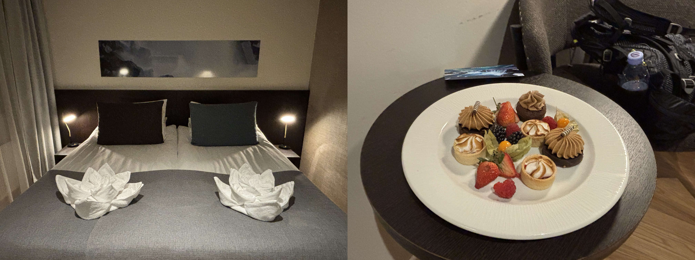

计划赶不上变化，预订时我计划不吃酒店早饭，结果励颖大早上突然提出想去尝尝（福斯酒店早饭很出名）。现场购买的单人价格高达 $4500 \text{ ISK}$（约 $250$，线上预订时加上大概是半价），正好把我凹的钱都吐回去了哈哈。自助区域不大，餐食摆得很精致，有很丰富的三明治搭配台和酸奶搭配台。冰岛的蛋是纯白色的，符合想象。

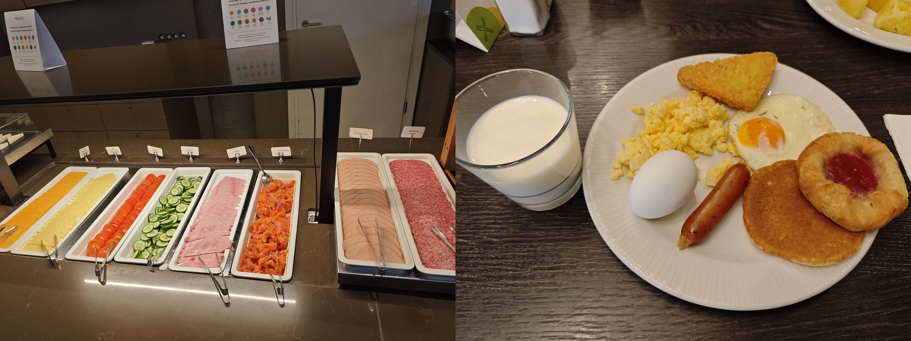

[ELDING: Reykjavík Classic Whale Watching](https://elding.is/reykjavik-classic-whale-watching)

我们原计划在第一天去参与 ELDING 的观鲸团：有 $9:00/15:00$ 两个时间段可选，没找到鲸鱼可以免费续一次。上午的时间很仓促，但励颖指出观鲸船容易触发头晕和呕吐，更应该在早上肚子空空时出发。我们就着这个活动讨论了很久，最终的结论是放弃整个观鲸计划，白天改为纯粹的雷市 City Walk。我俩从福斯酒店出发，沿着雷市最古老、最繁华的商业街 Laugavegur 步行。走了一段路后我想上卫生间，眼前的十字路口有个向左的 WC 标志，就转入这条道路向南行走。糟糕的是，我一直走到雷市的地标建筑哈尔格林姆教堂 （*Hallgrímskirkja*）都没有发现新的引导牌。想着教堂里应该有吧，结果门口摆着 $1500 \text{ ISK}$ 才能进入的牌子，工作人员说下午 $13:00$ 才免费开放。所幸小红书里有攻略，教堂的马路对面有一家名为 *Loki* 的醒目的黄色咖啡店，在里面就餐就可以使用卫生间了。点了一杯 $900 \text{ ISK}$ 的拿铁，拉花很漂亮。根据后面几次 City Walk 的经验，当时的 WC 标志指向的应该是教堂北侧的绿色铁桶。这种铁桶被当地人称为 *Almenningssalerni*，听说由于其缺乏维护，卫生状况相当糟糕。

我们从 Laugavegur 街转入彩虹街，地上多了几条靓丽的彩虹，把遥遥相望的哈尔格林姆教堂当背景的话很出片。冰岛人是真的喜欢彩虹，不仅地面上有彩虹，路边建筑的墙上也喜欢画上图画或刷成色彩鲜明的油漆。

冰岛旅游的顶流吉祥物当属海鹦（*Puffin*）了，它出现在各种墙面和书籍上，被做成各类玩偶和冰箱贴。它的外观很像黑白相间的企鹅，但有个标志性的巨大的黄色三角形鸟喙。根据我翻到的一本书里的介绍，冰岛是世界上北极海鹦（*Atlantic Puffin*）最主要的繁殖地，全世界约 $60\%$ 的海鹦每年夏季都会回到冰岛筑巢。这种鸟被冰岛人戏称为“海上小丑”，因为它们飞行和降落的姿势非常笨拙，这也是它们受欢迎的原因之一。

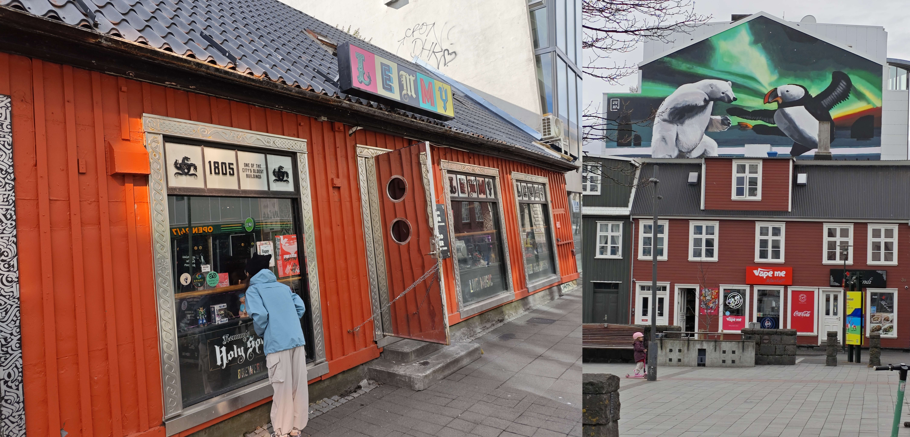

市区的这几条路上全是纪念品店，其中出现频率最高的词汇是 Icewear，这其实是冰岛非常知名的本土羊毛与户外服装品牌，在市区开有多家连锁门店。

走到 *Sæbraut* 海滨大道的十字路口时我俩转向右侧。有一个巨大的玻璃建筑映入眼帘，那就是 Harpa 音乐厅与会议中心（*Harpa Concert Hall and Conference Centre*）。其蜂巢般的玻璃外墙的灵感源自冰岛独特的玄武岩地貌，在阳光下会折射出迷人的光影。 再向前眺望就是海洋和冰川了，非常震撼。

传说中的阴茎博物馆（*Hið íslenzka reðasafn*）隐蔽在 H&M 建筑的背侧。我俩以前在小红书刷到过，对门口装饰啊门把手啊早已有了心理建设，所以一路很冷静地下楼梯来到馆前。作为全球唯一一家致力于收集与研究陆生、海生哺乳动物阳具标本的机构，馆内陈列着数百件标本，学术气息与猎奇感并存。可惜门票高达约 $200$ 人民币一个人，我们最终止步于馆前的纪念品区——这里售卖很多拿出去后显得恶趣味但契合场景的纪念品。

十字路口处有一家比较全的纪念品店，覆盖了羊毛制品和小纪念品。励颖看中了一个本地产的耳罩，我就琢磨着凑到冰岛的退税门槛 $12000 \text{ ISK}$。这家店很有创意地把举着盾牌的维京人玩偶和马玩偶组装到了一起（即维京人骑着马），我俩心照不宣地把这两个玩偶都拿下了。最后选购了两个冰箱贴凑单，包括那只很火的 puffin 海鹦。

再往前就到了网红热狗摊（*Bæjarins Beztu Pylsur*），据说克林顿 2004 年在雷市参加会议时就买过这里的热狗，加了芥末酱。我们攻略没做完全，当时拍脑袋选购了 $900 \text{ ISK}$ 的基础款热狗和 $150 \text{ ISK}$ 的本地巧克力块，后来我才发现冰岛人的经典买法是“全都要”（*Ein með öllu*）。面包的口味有点忘了，夹的香肠确实很好吃。

再往南就是特宁湖（*Tjörnin*），湖里满是鸭子、鸟和天鹅。我们逆时针绕湖走了一周，雷市的市政厅（*Ráðhús Reykjavíkur*）就建在湖边，整体呈半入水式设计。一楼大厅内陈列着一幅巨大的冰岛 3D 地形浮雕地图，朝南的大面积玻璃幕墙正好看到湖上景象。有两个人把颗粒状的食物撒在岸边，引得天鹅们争先恐后地前来抢夺。

回程路上我们商议着如何买一些冰岛的羊毛制品。我崇尚功能性，选择购买冰岛国宝级户外品牌 66°North。这个品牌始于 1926 年，顾名思义含义是冰岛横跨的北纬 66 度线，最初是为在北大西洋极端环境下作业的冰岛渔民和救援队生产防护服而创立的。我们几乎走访了 Laugavegur 街上所有 66°North，最后我看中了一顶 $10900 \text{ ISK}$ 的皮草毛帽（为了凑单补买了一顶普通羊毛帽），其厚实的毛给人一种扎实的温暖之感。励颖看中的自然是可爱，她选择了《花儿与少年·丝路季》（第五季）里打卡的 Mjúk，选购了一顶 $11000 \text{ ISK}$ 的帽子和一个替换球。

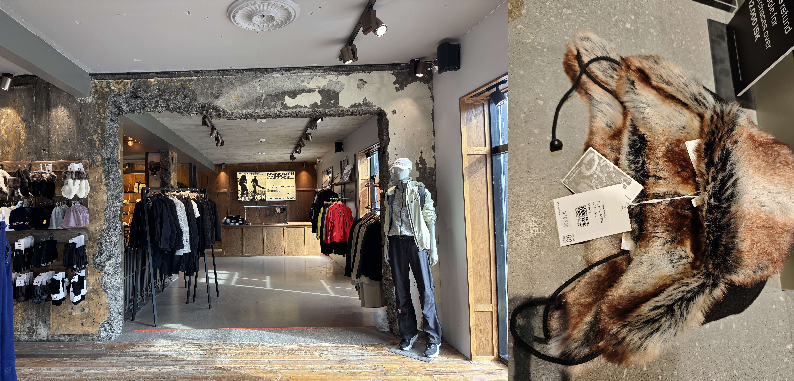

根据励颖的攻略，晚饭我们选择在 *Svarta Kaffið* 吃。这家店十分古怪，除了饮料和酒外只有两种汤可以点，我们点了招牌的羊肉汤，$3100 \text{ ISK}$。羊肉汤的口味不错，可惜很快就喝光了（事后我们才发现可以免费续一碗汤）。汤略有点咸，回去后我俩均有口干的症状。外层的面包嚼起来有点干，我努力吃了一半就吃不下了。

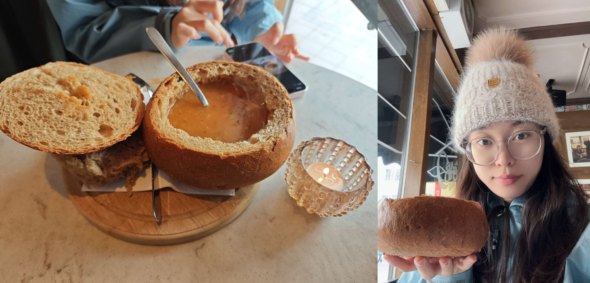

可能受到了《花少》的影响，励颖很喜欢小羊冰箱贴。去程时我们逛过了一家，被 $1490/2890 \text{ ISK}$ 一只/两只的价格吓退了。回程时励颖对小羊冰箱贴仍然念念不忘，正好路过另一家分店，我就让她挑了一只。我很喜欢店里的磁板装饰，一张冰岛的磁吸风景照（如冰川边的道路）配合两只小羊贴路上非常可爱，可惜磁板实在太贵了。

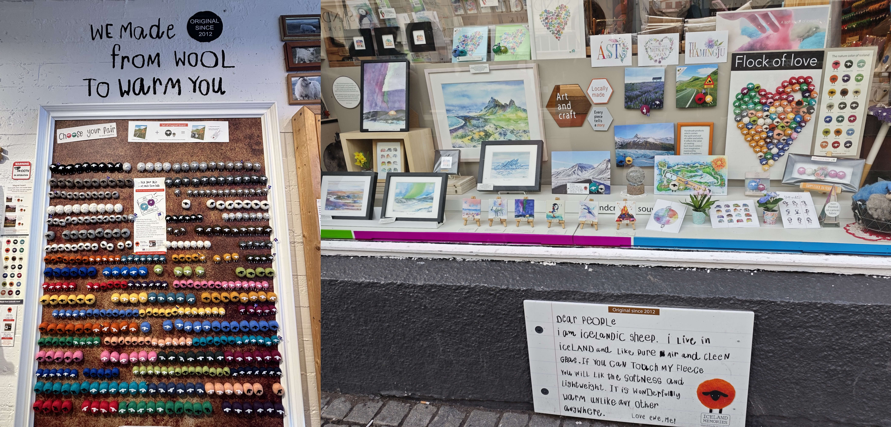

我们没有忘记在返程时拜访哈尔格林姆教堂。一天中我们在多个不同的角度从外侧观察教堂，其霸气的形状无愧于地标的地位。教堂内部的结构就差强人意了，主要因为写这篇游记时我已经浏览过意大利大量的天主教教堂。

回程路上励颖问了我一个很有趣的问题，冰岛和浙江的面积哪个大？直觉上我觉得冰岛能有浙江的两倍大，咨询 Gemini 后发现冰岛（$10.3w~\text{km}^2$）面积和浙江（$10.55w~\text{km}^2$）相当。人口的对比就差距非常明显了，浙江人口数（$6.6kw$）约为冰岛人口数（$38w$）的 $170$ 倍。由于冰岛很发达且人很少，浙江人均 GDP 只有冰岛的 $1/5$。

冰岛物价很高，一般推荐在小猪超市（*Bónus*）和笑脸超市（*Krónan*）采购生活用品和零食。回程路上正好有一家小猪超市，我们就进去随兴买了点，没想到结账时花费高达 $11683 \text{ ISK}$。主要的花销是给长辈带的四瓶鱼油——冰岛的鱼油品牌 LYSI 可谓是鼎鼎大名，据说冰岛周围海域极其纯净，鱼油主要提取自深海鳕鱼。鲜奶和酸奶的价格总体实惠一些：励颖按照小红书攻略，煞有介事地挑了两小瓶酸奶，结果结账时发现 $20^+$ 人民币一罐，我笑称买的可能是有机酸奶。我们还买了两包网红的小猪饲料，量非常大，第二天吃得我有点上火= =。

[Guide to Iceland：冰岛雷克雅未克极光大巴团 | 配有热茶点](https://cn.guidetoiceland.is/book-holiday-trips/northern-lights-4-2)

晚上 $21:00$ 我们准时等在 Bus Stop 12 参与极光团，等车时隔壁的中国游客抱怨说这已经是她补的一次了，我俩就乖乖降低心理预期。大巴沿着 KEF 机场方向开，一直开到了雷恰内斯半岛（*Reykjanes Peninsula*），具体是在 *Seltjörn* 湖附近。路上我睡了很久，大巴停下后听司机的意思是极光的希望不大，所以很艰难地从困意中醒来。下车活动了一下，果然天色很暗沉没有任何极光的迹象，银河和群星倒是很闪亮。我已经很久没有用手机拍夜景了，捣鼓了很久才搞明白夜景模式。逛了一圈有点冷了（特别是在拍照的手），随车有很浓很甜的热可可可以喝。我俩满怀倦意地回到座位坐等撤退，突然听到司机说小规模的极光出现，激动地下车查看。朝着人群指指点点的方向望去，隐隐有一些绿色的光带，手机的夜景模式拍摄更加清晰。**我们在四月，成功抓住了极光的尾巴**。

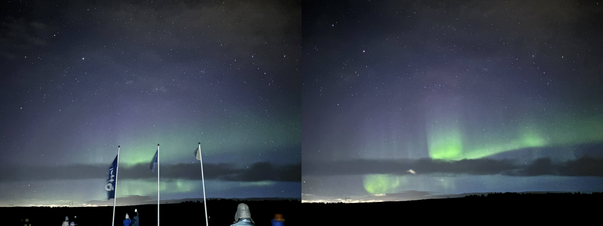

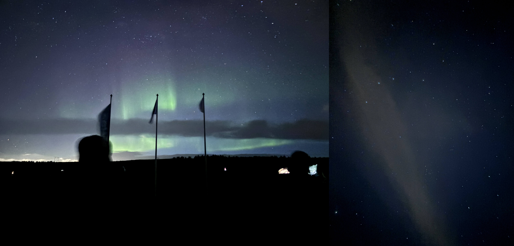

## 4.13-4.14 南岸两日团

[Troll: 2-Day South Coast, Ice Cave, Glacier Hike & Northern Lights Tour](https://troll.is/multi-day/2-day-south-coast-winter-tour/)

这里有个小插曲：出行几天前 Troll 客服 Jumary 给我发了一封邮件，问我能否把两日团和一日团交换（$4.13$ 开始的两日团推迟一天，$4.15$ 开始的黄金圈一日团提前到 $4.13$），大概是因为黄金圈一日团超售了。由于我一直在巴黎玩没有检查邮箱，逛雷市时才发现了这一邮件，急匆匆地回邮件+打客服电话表达出“我们已留出了福斯酒店的预订空隙所以很难交换”的情况。当时 Jumary 已经下班了，另一位客服帮我确认了整体行程的有效性。

早上 $8.00$ 我们准时守在 Bus Stop12，很快就等来了带有 troll 标志的中巴车，而且幸运抢到了第一排的双人座。本团游客都是成对出现的，第一排右侧空着的单人座正好可以用来放包和切换拍照位置。在后来的蓝冰洞活动中，向导为了活跃气氛各自问了我们国籍，发现 **Diversity 拉满了**：除了我俩外，是一对在英法读书的中国女孩，一对加拿大夫妻，一对哥伦比亚女人，一对澳大利亚夫妻和一对印度夫妻。这种小团都是司机兼任导游，行驶路上会时不时用麦介绍窗外风景和相关历史。我们这车的司机一直穿着一件蓝外套，英语的本地口音有点严重，讲长篇故事时总让我有些昏昏欲睡。励颖则准备得非常充分，搞了一个实时翻译软件并开通了会员，能够比我更稳定地摄取司机带来的丰富信息。出发前下了点下雨，我们非常担心路上的天气，所幸随着旅途的进行很快就放晴了。

我们的第一个目的地是斯科加（*Skógafoss*）瀑布，它的比例非常完美（宽约 $25$ 米，落差达 $60$ 米），平整的悬崖让水流像一块巨大的白布直坠而下，很符合我对大瀑布的刻板印象。步行到瀑布跟前能看到一个巨大的彩虹，难怪斯科加瀑布的别称是彩虹瀑布。导游给我们的时间是 $45 \min$，励颖沉迷于拍摄瀑布和彩虹，作为 J 人的我多次催促她先攀登右侧 500 多级台阶的木质栈道，以便更好地控制时间。攀登上去后别有一番天地：瀑布上方的河流蜿蜒流淌在黄色地貌上，徒步的步道一眼望不到头，我事后得知这是著名的 *Fimmvörðuháls* 徒步路线的起点。

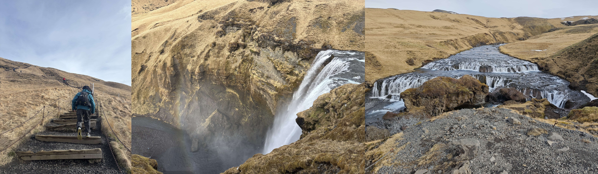

接下来我们抵达了埃尔德劳恩熔岩地（*Eldhraun Lava Fields*），有一片指定的黑色碎岩步道，能在中心处领略冰岛经典的苔原风貌。根据向导介绍，这片熔岩地是由 $1783-1784$ 年间拉基（*Laki*）火山大喷发产生的，熔岩流的覆盖面积约 $565 \text{km}^2$。经过数百年的时间，原本荒凉的熔岩石被厚厚的灰苔所覆盖（*Woolly fringe-moss*），形成了柔软起伏的绿色绒毯景观。“DO NOT STEP ON MOSS”的提示牌很显眼，冰岛法律严格禁止进入苔藓区踩踏。

下一站是**钻石沙滩**（*Diamond Beach, Breiðamerkursandur*），沙滩上有很多钻石般的浮冰。游客们在很有经验地捏冰、举冰甚至咬冰，我们也跟风摆拍了一下。浮冰的形成原理很简单，隔壁冰河湖中巨大的冰块崩塌后坠入湖中，顺着短小的水道漂向大海，被海浪冲刷和打磨后，又被潮汐重新推上沙滩。

隔壁是**杰古沙龙冰河湖**（*Jökulsárlón*），从高处俯视下去，冰雪浮在水面的场景非常震撼。我记得导游吐槽过冰岛人非常热衷于造词，这个杰古沙龙冰河湖就是个典型的例子：在冰岛语中，**Jökuls** 意为“冰川”，**ár** 意为“河流”，**lón**：意为“泻湖”。这里有很有名的 *Fancy Sheep*。因为 VISA 卡忘记从中巴车里带出来了，只得临时变成 e 人找了个英国留学的小姐姐代付，再按当时的英镑和冰岛克朗的汇率转 $173$ 人民币给她。我俩购入了经典的羊肉堡，**这应该是我第一次吃羊肉汉堡**。正好励颖闻到了羊肉的膻味失去了兴趣，我得以完整品尝这个用料非常扎实的汉堡。说实话吃的时候感知到汉堡里夹带羊肉怪怪的，但味道着实美味，吃着吃着就习惯了。唯一遗憾的是我们团即将要换车出发去冰河湖后方的冰川上徒步，为了不让大家等我太久，我只能快速地吃完这个汉堡。

我们很幸运赶上了冰川徒步的末班车，即蓝冰洞的探险会在四月结束（随着五月气温回升，冰川表面消融加速）。有个英语发音很标准的橙色夹克的老哥出现，担任我们当天冰川徒步的导游。我们按照他的要求在脚上穿好了鞋钉（以增加冰上的摩擦力）戴好了安全帽。一开始我很疑惑为什么要特意换上这么大轮胎的车，等它驶上崎岖不平的石子路时我就明白了。向导解释说：冰川是流动的导致每年冰川徒步的地点都会改变，所以没必要铺好公路，越野车和坚实的大轮胎就成为了探险的标配。我们经过一个转弯时发现另一辆车停在那里，回程时看到有一辆抢修车停在旁边，向导说这在冰岛稀松平常。当我问及他本人遇到事故的频率，他笑着说平均每周都会发生。

下车后我们沿着被白色冰雪覆盖的火山灰岩走了一阵子，就抵达了**瓦特纳冰川**（*Vatnajökull*）边缘的蓝冰洞。从物理上来说：普通的冰看起来是白色的，是因为里面充满了微小的空气泡沫，从而随机反射所有波长的光，混合在一起就是白色；冰川上的冰雪被极度压缩，内部空气被全部挤出，形成了一种致密冰晶体，从而更多地折射波长较短的蓝光。向导还解释了另一种原因：冬季与初春光线很微弱，光线需要穿过更厚的冰层才能折射出来，这加强了深邃的“幽灵蓝”的效果；随着气温升高，冰川表面开始融化，光线的漫反射使蓝色看起来变浅，甚至带上一层白色。

向导很专业，带我们领略了多个形状各异的蓝冰洞。先是一个很矮的蓝冰洞，我们不得不排成一排蹲下，双手支撑着冰面侧向移动。当我在一个很窄的蓝冰洞里行进时，一只脚突然踏空踩进了很深的积水，水漫过了鞋子的防水线从而让整只脚都浸满了水，随之而来的是长久的冰冷感。在一些关键的洞口处，向导会耐心地为我们拍照。

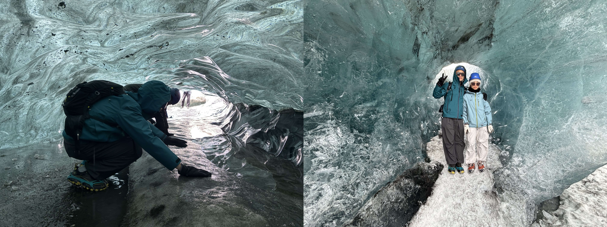

冰川徒步耗时约 $3$ 小时，结束后已临近傍晚。蓝衣导游带着我们向西折返，看地图里黑沙滩边上的维克镇（Vik）越来越近，我和励颖都很激动——她此前做过维克镇美食的攻略，我俩都非常期待 *Black Crust Pizzeria* 的薄底小龙虾披萨和 *Suður Vík* 的羊排红点鲑正餐餐厅。可惜导游在教堂镇（*Kirkjubæjarklaustur*）附近的 *Klausturvegur* 就提前停下了，定了路边一家饭店让大家觅食，我俩不得不怀疑 troll 和这家店有合作。同团的其他人都把桌子拼在一起坐，只有我俩因为空间不够+是 i 人就单独坐在两人桌里。励颖因为错过维克镇心情不佳，点了 $3850 \text{ ISK}$ 的奶油蘑菇（宽）意面和 $2850 \text{ ISK}$ 的红点鲑脆饼。她不习惯脆饼上接近刺身口味的红点鲑，我被迫全部笑纳。

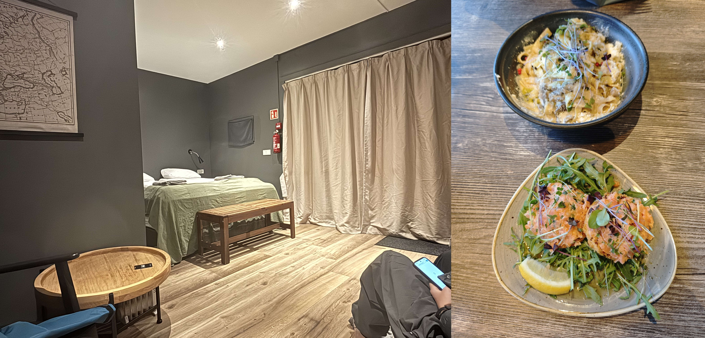

晚上导游给我们拉到一个神奇的住宿点，那里散布了几幢独栋的单层小别墅，整车人正好每对分上一幢。我在携程上搜到了对应的酒店名，赫利弗恩冰川景住宿加早餐旅馆（*Hótel Hrífunes by Tröll*）。酒店老板很热情地上车为我们分发房卡，不过他的英语也带有很重的口音哈哈。白天玩得有点累，晚上我们没心气去屋外追极光，早早地睡下了。房间里有很多带管道的加热器，我们把潮湿的速干袜和冲锋衣裤挂在周围，第二天醒来时全干了。

第二天早上 $8:15$ 集合，我们提前去餐厅用餐。这个酒店更偏向于民宿性质，早饭虽然有些简陋，室内的沙发、面包机、咖啡机、落地窗等陈设却更显温馨。餐厅里座位不多，好在其他团员都已吃过早饭，和我们一道吃的只有那对中国女孩。店家提供了丰富的三明治配餐，我和励颖就重点 DIY 了三明治，她对配料里的红椒赞不绝口。

第二天的第一站是维克镇西边的 **雷尼斯法尔黑沙滩**（*Reynisfjara*）。黑沙滩地表不是细腻的细沙，更多是由磨圆的黑色玄武岩颗粒、小石子和碎石组成的。这里的黑石全部来自附近的卡特拉（*Katla*）火山喷出的玄武岩岩浆。岩浆遇海水迅速冷却碎裂成大块岩石，再经过北大西洋数千年的剧烈冲击形成细小圆润的石头。左侧的巨大黑色山体就是雷尼斯山（*Reynisfjall*），它的根部呈现出一排排笔直的黑色石柱，据说这种六角形玄武岩柱状节理是岩浆在冷却过程中受力均匀收缩形成的。海面上耸立了两座名为雷尼斯德兰格（*Reynisdrangar*）的海蚀柱。冰岛大部分本地人都相信小精灵（*Huldufólk*）和巨人（*Tröll*）的存在，传说这两块就是没来得及躲避阳光而石化的巨人。

下一站是去 **索尔黑马冰川**（*Sólheimajökull*）徒步，刚抵达营地就幸运地邂逅了一道巨大彩虹。这次的装备由专业的 Troll Expedition 装备车提供，比上一次更加先进：强制换上高帮的徒步鞋，冰爪固定得更紧，腰间束起稳固的安全腰带，手上拿一把可凿冰可支撑的冰镐。在这一身硬核装备的加持下，仿佛我俩也成了这片冰封世界里的专业探险家。这次营地与冰川的距离不远，可以步行过去。领头导游是个印度口音的老哥，后方一男一女两个工作人员镇后，阵容拉满了。女导游的发音非常标准，我很喜欢听她在过程中补充关于冰川的介绍。

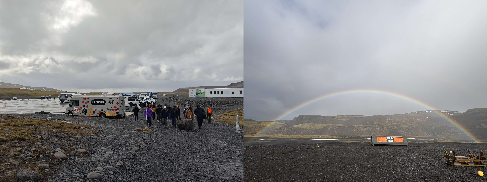

Sólheimajökull 以其鲜明的黑白条纹著称，励颖称之为“奥利奥山”。向导介绍说冰川表面覆盖着大量的黑色物质是火山灰，主要来自附近的卡特拉火山（*Katla*）以及 2010 年大喷发的埃亚菲亚德拉冰盖火山（*Eyjafjallajökull*）。这些火山灰层嵌在冰层中，随着冰川的消融和移动而显现。这次活动没有冰洞探险，主要是在冰川表面行走。和上一次徒步一样，向导一直在强调要小心隐秘的冰裂缝，敏感区域要由其先探路我们排成一排跟上去。冰面上有些位置会有融化的雪水甚至形成涓涓细流，整个步行过程中我和励颖先后踩进冰水里，其中我踩湿了一只她两只脚全军覆没，这种冰冻感比上一次徒步还剧烈。向导为我们在经典位置拍照，我们又捕捉到两条彩虹。冰川上先太阳和小雨交替，再是彩虹，复又大雨，正如冰岛谚语所述：If you don't like the weather, just wait five minutes.

向导为我们讲解了冰川消融杆（*Ablation Stake*）：科学家在冰川早期向下钻一个很深的垂直孔，一根绑定于支架的测绳下放下去，现在绳子的刻度正在随着冰川表面的融化而不断减少，每年高度会下降 $5 \sim 10$ 米。

回去卸下装备后有热可可和巧克力棒可以吃，我非常喜欢这里提供的巧克力棒，后来在笑脸超市找到了同款。

午饭停在了名为 Faxi Bakery 的小地方。买了一个 $550 \text{ ISK}$ 的经典的 Faxi Ball（椰子巧克力能量球），以及一碗 $2500 \text{ ISK}$ 的番茄汤。番茄汤有点咸，其附送的面包味道还不错。励颖咬了一口 Ball 觉得不好吃就丢给我了。

返程途中打卡了**塞里雅兰瀑布**（*Seljalandsfoss*）。塞里雅兰瀑布高约 $60$ 米，瀑布后方有一个深凹进去的岩洞。由于悬崖底部的岩石较软，经过长期侵蚀，形成了一条可以环绕瀑布一周的步道。这个步道非常潮湿，需要小心翼翼地下脚，所以我们走到瀑布后方的位置就驻足了。瀑布外围有一条小路，沿着小路向左走可以看到好几个 “迷你瀑布”（从悬崖上下落的细流）。天气系统有点古怪，持续在下小雨但阳光很灿烂，很轻易就能捕捉到彩虹。我们经过一座小桥后看到地上有个 GoPro，保持其遗弃状态方便失主来寻找。向前行进了一会儿看到一对慌慌张张的夫妻，上前一问果然是落下了 GoPro，我俩完成好事一桩。我们看集合时间临近就从小路折返回中巴车上了，我事后才得知小路的尽头有一个被岩石裂缝挡住的 **秘境瀑布**（*Gljúfrabúi*），留下了一个小小的遗憾。

总结这次两日团的感受：**团员少，素质高，体验很好**。回到雷市后我们重新办理福斯酒店的入住手续，趁着天色很亮再次去雷市 City Walk，重点挑以前忽略的店逛。这不，我们发现 *Polarbear Gift Store* 就非常好逛（当时我们只是匆匆和矗立在门口的北极熊合影），纪念品种类多且价格属于雷市较低的一批。

网红餐厅 *messinn* 和 *Caruso* 都坐落在 *Lækjargata* 和 *Austurstræti* 这两条主干道的交汇处，当晚我们选在了前者就餐。据说高峰期需要预约或排位，实测我们 $18:20$ walk in 还是有几个空位置，再过一会就基本坐满了。我们点了 $5900 \text{ ISK}$ 的北极红点鲑（Arctic Char）和 $5450 \text{ ISK}$ 的冰岛式鱼泥（*Icelandic "Plokkfiskur"*），没想到这通盲点 **带来了非常好的味觉体验**：前者是三块鱼排的形式，励颖评价“甜甜的很好吃”，我就多让给她了一块；后者把鳕鱼鱼肉做成了鱼糜的形式，几乎没有刺（但是励颖还是被一根刺卡住了哈哈，她评价说被唯一的鱼刺卡住很扫兴），结合土豆奶油等配料拥有绵密的口感。两道菜的份量都挺扎实的，正好适配我俩的食量。

晚上我俩顺路去小猪超市采购了一些水果、鲜奶和零食，伴随着雷市的夜色回去休息了。

## 4.15 黄金圈

[Troll: Golden Circle, Bruarfoss & Kerid Volcanic Crater - Small Group Day Tour](https://troll.is/day-tour/golden-circle-bruarfoss-kerid/)

黄金圈一日游居然 $9:00$ 才集合，悠闲得都有点不适应了。这次在 Bus Stop 等了十几分钟，无聊时我和励颖就在打赌是不是昨天那位导游来接，赌注是一只未来我们会在雷市吃的龙虾（一份一般是三只龙虾）。背景是昨晚两日团的大部分游客都在返程路上靠近黄金圈的位置统一下车住宿，导游说明天会去接他们玩黄金圈，所以励颖很肯定会是同一批人游览；而我推测那些游客订的是和我们不同的更长的套餐，我们当天可能会走其他散团。最后是我获得了胜利多收获了一只龙虾，换来的结果我们最后一批上车坐在很后面，跟团体验远不如前一次。

第一站是 **辛格韦德利国家公园**（*Thingvellir National Park*, *Þingvellir*）。这里坐落在欧亚板块与北美板块交界的大西洋中洋脊上，这两大板块撕裂形成巨大的阿尔曼纳峡谷（*Almannagjá*），至今仍以每年约 $2$ 厘米的速度互相分离。我们从 *Hrafnagjá* 观景台切入，相比人声鼎沸的主游客中心，这里提供了一个更宏观、更安静的俯瞰视角。

沿着步道向前走，可以看到公元 $930$ 年冰岛定居者建立的世界最早的民主议会 *Althingi* 的遗址。辛格韦德利国家公园的命名 *Þingvellir* 即意为“议会平原”。这里游客很多，我们能偷听到很多正在用英文甚至中文解说的导游。站在遗址上向下眺望，可以看到广阔的平原（地堑）和开阔的水域（辛格瓦德拉湖），远处还有绿色的教堂。

下一站是 **秘境蓝瀑布**（*Bruarfoss*），这个瀑布深藏于黄色的荒野之中，要循着蜿蜒的小道才能找到。瀑布的水流呈现出一种极其纯净、近乎透明的 **冰蓝色**。这种色彩源自上游的 *Laugarvatn* 冰川融水，由于水质极度纯净，在落入河道中央的深邃裂缝时由于光的散射作用呈现出如蓝宝石般迷人的光泽。*Bruarfoss* 在冰岛语里是 *Brúar*（桥）和 *foss*（瀑布）的组合，因为这里曾有一座天然的石拱桥横跨瀑布，后来为了防止饥民和外来者进入属于教区的丰饶土地就被拆毁了。如今官方在上面修建了一座观景木桥，俯视向下风景正好，赋予了 *Bruarfoss* 一层新的意义。

继续向东行驶 $15 \min$ 就到了**史托克间歇泉**（*Strokkur*）。这里原本最著名的是大间歇泉（*Geysir*，英语单词间歇泉 *Geyser* 因此而得名），但其已进入了长期的休眠期，偶尔才喷发一次；相比之下史托克间歇泉就极其活跃，平均 $5-10$ 分钟就会喷发一次，高度通常在 $15-20$ 米。去史托克间歇泉的路上有很多冒着烟的小坑，官方在周围一圈围好了栅栏，提示说温度可能会高达 $80-100°$。我俩前后一共经历（拍摄）了三次史托克间歇泉的喷发，中间那次甚至见证了双重喷发（*Double Blast*），可惜我俩没有经验提前撤下了手中的设备。

我俩就在隔壁的 *Geysir Glíma* 用餐，点了经典的 $4280 \text{ ISK}$ 的羊排套餐。当时我看价格有点小贵，不忍心点别的土豆、西蓝花、米饭等辅食，没想到是羊排套餐里赠送的。在这里能看到米饭属实有点吃惊。据说冰岛羊吃的是纯天然的草、苔藓和浆果，没有人工饲料导致羊肉几乎没有膻味。励颖吃了几小块，评价说仍然有点味道。

黄金圈的压轴大戏当属 **黄金瀑布**（*Gullfoss*），气势非常恢弘，可惜只能远远俯视观赏。它分成了两个阶段，水流先经过一个约 $11$ 米高的斜坡，紧接着急转弯猛地跌入一个 $32$ 米深的巨大缝隙中。从某些角度看过去，奔腾的河流仿佛直接消失在了地底深处。*Gull* 在冰岛语里是黄金，一是因为阳光照射在飞溅的水雾上会产生璀璨的金色光芒，二是因为朗格冰川（*Langjökull*）夹杂着冰川泥沙，水流在阳光下会呈现出一种特殊的古铜金色。

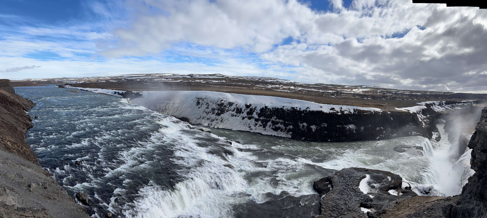

接下来司机为我们停在一家马场，我事后查阅判断是**菲里德海玛农场**（*Friðheimar*）。这里不仅有专门的马场，还有利用地热能驱动、全年生产西红柿的巨大玻璃温室。有三只马和我们亲切互动，它们的脑门上有一撮标志性的**刘海**，腿短。司机为每人发了一颗饲料。我有点胆小，摊在手上小心翼翼地递过去后，被马儿一下子舔着卷走了。励颖喂食时很紧张，摸起马毛来倒是大大方方的，摸着摸着就朝它们身上摸过去，我必须提醒她别摸到马的腹部。刚到的时候我就看到远处有一只马儿背对我们站立不动，后来经旁边游客提醒后，我发现它脚下已经多了一坨屎。

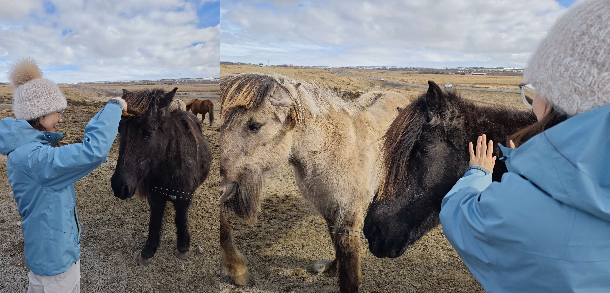

最后一站是 **火山口湖**（*Kerið*）。比较反直觉的是这个地方是私人运营的，自驾游需收费 $600 \text{ ISK}$ 用于维护步道。总共有两条步道：一条围绕火山口湖口一圈，可以全角度俯视盆底蓝绿色湖水；一条沿着红色的岩壁拾级而下，能一路通到湖里。此时正是冰消雪融的季节，坐在湖边的长凳上，可以听到微弱的叮叮咚咚的冰块融化的声音。我以为这个地方是前两个世纪火山喷发形成的，查阅资料后发现其拥有约 $3000$ 年的历史，而且地质学家认为形成的直接原因是周边火山喷发后耗尽了地下岩浆，上层岩石结构失去支撑向内塌陷，从而形成了这个火山口湖。坑底的湖水并不是雨水积聚形成的，而是与当地的地下水水位持平，所以湖水会随着地下水的变动而涨落。

我们发现最近开销有点大，晚上一合计，每人分配了 $100$ 人民币预算去小猪超市采购，目标是覆盖第二天跟团的早饭和午饭。冰岛的主食着实有点贵，冷藏柜里最便宜的三明治或者鸡肉卷都要 $50$ 人民币。

## 4.16 斯奈山半岛

[Snaefellsnes National Park | Small Group Day Tour](https://nicetravel.is/iceland-tours/snaefellsnes-day-trip/)

我们选了 Nice Travel 的斯奈山半岛一日游。Bus Stop 12 的权重有点低，$8:30$ 开始接送，我们等满半小时后最后一批上的车。Nice Travel 的风格和 Troll 高度相似，同款奔驰中巴（只是 Logo 换了换），同样的司机兼导游，甚至是同样带口音英语。这个司机头戴一顶橙红色的毛线帽，喜欢用手写的时间牌子提醒我们下一次集合的时间，很合我这个 J 人口味。这个团的人数介于 Troll 的两个团之间，我俩能选到靠中间的位置。

去斯奈山半岛的必经之地是博尔加内斯（*Borgarnes*），这里是个全能的交通枢纽，有加油站、充电站和大型超市（*Netto* 和 *Bónus*）。我们来回都在这里停留。过去的时候在 *Netto* 看到有售 $1298 \text{ ISK}$ 一罐（$500g$）的巨大蓝莓，不仅比小猪超市 $1499 \text{ ISK}$ 的质量高，同颗粒大小按汇率折算比国内都实惠，高低得买一份尝尝了；回程的时候注意到服务站的机打冰激凌卖良心价 $299 \text{ ISK}$，买了份尝尝味道不错，和肯德基圣代差不多。

我们的第一站是 *Ytri-Tunga* 的 **海豹聚集点**（*Seal Colony*）。刚下车时只能看到一片由黄转黑的沿海滩涂（在冰岛能见到传统的金黄色沙滩不容易），以及一块要求“冬/夏季和海豹保持至少 $100/50$ 米“的指示牌。灰海豹和港海豹是冰岛的“两大主角”，如果它很大、脸长、看起来有点“凶”或好奇地盯着你很可能是灰海豹；如果它较小、脸圆、安静地躺在远处很可能是港海豹。我俩走在游客的最前面，缘着沙滩碎石向大海方向行进。等到岩石间开始潮湿和蓄水时就出现遍地的海藻，走起路来不太方便了。先映入眼帘的是海鸥和鸭子，随后我们望见了远处岩石上依稀在动的几团动物。正当我们想跨越眼前阻隔的溪流走上前去，后方的导游大声把我们拦下来了，示意我们驻足观赏。导游很专业地随身携带了望远镜，我和励颖就借过来轮流望了一段时间。望远镜下的海豹肥肥的，有的一动不动，有的在用身体蛄蛹着。

下一站是 **布迪尔黑教堂** （*Búðakirkja*）。这座教堂的历史可以追溯到 $1703$ 年，后在 $1848$ 年重建。它的外墙涂有沥青，这在冰岛早期的建筑中很常见，主要是为了抵抗北大西洋极其恶劣的咸湿海风和雨雪的侵蚀。我俩都觉得这个教堂很小很普通，但导游介绍说这是著名的婚礼举办地。

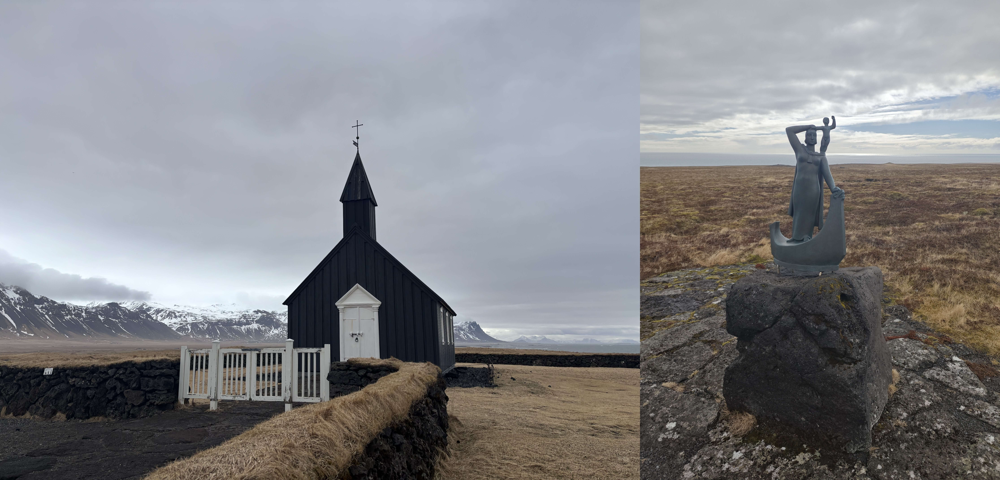

路过 *Laugarbrekka* 时看了一位传奇维京女性 *Guðríður Þorbjarnardóttir* 的雕塑。她是著名的探险家，曾在公元 $1000$ 年左右穿越大西洋到达过北美的“文兰”（比哥伦布早了约 $500$ 年）。她一生中跨越了大西洋 $8$ 次，晚年曾徒步前往罗马朝圣，最后回到冰岛成为一名修女。怀里的孩子是她的儿子，据信是第一个出生在美洲大陆的欧洲人。

下一站是 **阿尔纳斯塔皮**（*Arnarstapi*），这里曾是冰岛一个非常重要的贸易港口，而现在是斯奈山半岛最著名的旅游小镇之一。导游为我们开到阿尔纳斯塔皮港口（*Arnarstapi Harbour*）处，我们正好沿着海边的步道一路向南，他在终点处停车等我们。此时正值午饭点，我们掏出鸡肉卷和三明治边走边吃。天空阴晴不定时不时就下起雨来，海风混杂着雨水寒意刺骨，手被吹得几近麻木。第一个拍照点是 *Músagjá*，外侧有一个天然形成的石拱桥，内侧是怪石嶙峋的峭壁，栖息了很多海鸥。成对的游客往往分头行动，一个走到对面的石拱桥上摆 pose，一个坐在峭壁靠前的石头上拍照。注意到整个结构里没有任何警示标志，我看励颖迟迟没有从石拱桥回来，着急地跑过去想把她拽回来——**这一步很幸运地被同团的中国游客拍到**。南边下个拍照点名为 *Gatklettur*，是大自然鬼斧神工形成的天然海蚀拱门。它是由常年受海浪拍打侵蚀的火山玄武岩形成的，岩石拱门和周围险峻的峭壁上栖息着大量的海鸟。其西侧矗立着一座瞩目的由石块堆砌而成的 **巨人雕像**（*Bárður Snæfellsás*），传说是斯奈山半岛的“守护神”。

励颖攻略里的 *FRISTA Food Truck Arnarstapi* 就在附近，我俩利用午餐的时间步行来回，发现没有营业。

下一站是 **Lóndrangar 观景台**（*Lóndrangar View Point*），拾级而上远眺远处的**怪物海岸**（*Lóndrangar Cliffs*）。古老火山口被海水长期侵蚀后留下的两座巨大的玄武岩石柱（分别高 $75/61$ 米），像城堡一样矗立在海边。

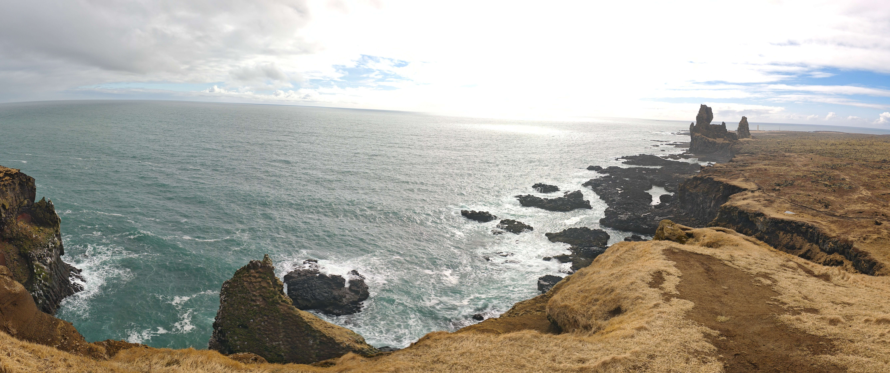

向西来到**深渊珍珠沙滩**（*Djúpalónssandur*）。我们小心翼翼沿着结冰道路往下走，穿过一些嶙峋怪石来到海边。与维克镇细腻的黑沙滩不同，这里的“沙滩”实际上是由被海浪常年冲刷得圆润光滑的黑色火山鹅卵石组成，所以当地称之为 *Djúpulónsperlur*（深渊珍珠）。沙滩上放着四个鹅卵石，本以为官方在很风趣地考验游客的臂力，没想到这是古时渔船船长用来测试船员力量的试金石，隐藏着冷酷的筛选逻辑：四块石头分别是无用（*Amlóði*）$23$ 公斤、弱者（*Hálfdrættingur*）$54$ 公斤、半力（*Hálfsterkur*）$100$ 公斤 、全力（*Fullsterkur*）$154$ 公斤，过去想要成为一名合格的划桨手，至少需要举起 $54$ 公斤的 *Hálfdrættingur* 到齐腰高的石台上。我试了试只能举起 *Amlóði*，果然不适合捕鱼的工作。看到大海前首先会注意到散落在海滩各处的生锈金属残骸。这是 1948 年 3 月在此触礁失事的英国拖网渔船 Epine GY 7 号的遗迹。那场海难导致很多人丧生，冰岛人就选择将这些残骸保留在海滩上，作为对遇难者的纪念和对大自然无常的警示。这片海滩的海浪很大，据说被称为疯狗浪（*Sneaker Waves*）。

最近我在小红书上刷到一条搁浅的鲸鱼，没想到导游消息很灵通，主动带我们去深渊珍珠沙滩隔壁看了这条鲸鱼，并介绍说这是上周六被发现的。在高高的乱石堆里向下俯视，鲸鱼撞击的血痕历历在目，非常可怜。

下一站是**英贾德霍尔教堂**（*Ingjaldshólskirkja*），即著名的“红房子”。站在柏油公路这一头，远远望向坡顶那座红顶白墙的孤独小房子时，那种视觉纵深感，简直和医院里用电脑验光仪测视力时机器镜头里那条公路尽头的“红屋顶小房子”一模一样，这个极具共鸣的视觉梗让它成为了网红打卡地。开到教堂旁边时我们再次发现一道彩虹。

最后一站是**草帽山**（*Kirkjufell*），它是冰岛的标志性山峰，位于 *Grundarfjörður* 小镇旁。这座山长得棱角分明，其独特而匀称的圆锥形外观从特定角度看就像一顶巨大的草帽，因此得名。我们深入了山脚马路对面的步道打卡了教会山瀑布（*Kirkjufellsfoss*），它是由三条并排的小型瀑布组成的瀑布群，瀑布上方有一座石桥。

我们 $18:00$ 从草帽山开始返程，司机一路狂飙，$19:00$ 就抵达博尔加内斯，停留一刻钟后返回雷市。我俩对 messinn 的那顿美味晚饭仍然心心念念，就想着当晚将就着吃点，腾出资金第二天晚上再去潇洒一番。这次我带励颖去了反向（东侧）的笑脸超市 *Krónan*，买了鸡肉拌沙拉、鸡翅套餐、寿司套餐等填饱肚子的套餐。

## 4.17 蓝湖 & 离开冰岛

我原计划在蓝湖泡 $4h$ 的温泉，即大巴集合时间/蓝湖进入时间/大巴返程时间为 $10:30/12:00/16:15$。客服发邮件告诉我四五月份蓝湖大巴的时刻有调整，BSI 出发的时间缩减为偶数整点，我不得不推迟前两个时间各 $1h$。上午最后一次逛雷市，在北极熊纪念品店凑了最后一波退税额度，包括小羊、肥皂、puffin 玩偶、袜子等。

一开始我很奇怪，蓝湖大巴为什么只支持一部分 Bus Stop，而且接和送的站点不尽相同。经历了整个接送过程后我逐渐明白：官方在每块区域都指定了沿大路的代表性 Bus Stop，并设计好了非常顺的接和送的大巴动线；这两个动线往往是方向相反的，所以对应的 Bus Stop 也会随着大巴行进的方向做调整（往往是换到马路对面）。

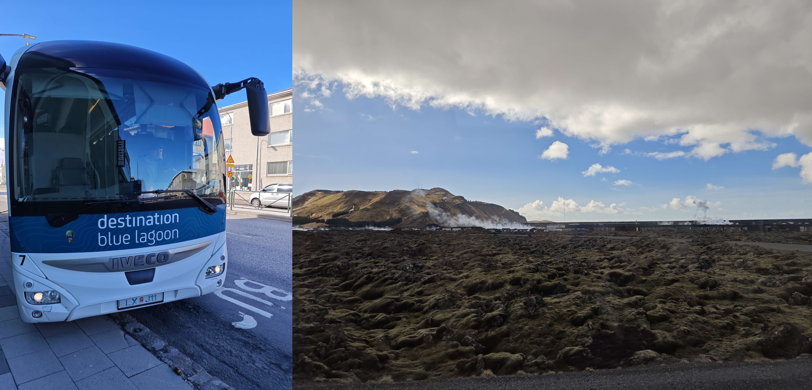

$50$ 分钟顺利抵达蓝湖温泉周边。当时我们一脸懵逼：根据定位和时间感觉应该快到了，但是路边一直都是光秃秃的黑色火山岩，根本没有温泉的踪迹。停车场处正在返修扩建，蓝湖公司野心不小。下车后沿着一条两侧都是火山岩的步道走了一段路才正式抵达蓝湖温泉入口处。淋浴间的设备不错，但有点混乱缺乏引导。每个人都会发一个手环（不同档次的手环颜色不同，这就是资本主义），靠上面的芯片可以任意绑定洗浴间里空的柜子；淋浴间的设施非常高级，喷头采用的是通过按钮激活并限时出水的方式，三种沐浴露靠感应流出非常卫生。

我俩没有准备手机防水袋，带着手机进入后甚觉不便，沿湖快速拍一圈后就把手机放回去了。整个蓝湖水在阳光下呈现淡蓝色，看起来很干净但温泉里的可见度很低。基础票附送一次面膜体验，工作人员会在沿湖的小房子里依次给我们挤一团面膜膏，均匀涂抹在脸上等待 $5-10\min$ 后再冲洗，我这个榆木疙瘩皮肤感觉不出什么效果。刚进入温泉会觉得暖暖的温度正好，泡久了下半身就会觉得很热，我们急匆匆地去找了一圈赠送的蓝莓冰饮。 

$14:00$ 一个老哥拍着手把大家招呼到蓝湖一侧的圆形空间里，说是给我们讲讲有趣的蓝湖历史。他首先调研了全场游客的来源，大家的分布非常广，来自北美的多一些，我们是唯一的亚洲游客。值得注意的是没有来自冰岛本地的游客，侧面体现出蓝湖的网红和性价比低的属性。接着这个老哥就夸夸其谈了起来，说这里本来是地热发电的工厂，有一次因为事故导入了地下的温泉，因为找不到合适的地方排出就保留在原地，结果隔了很久水都没有渗走。后来有个名为 *Valur Margeirsson* 的大胆老哥为了治疗牛皮鲜，不顾劝阻跳地跳入蓝湖池子，泡了几天发现没什么事，找了个医生 *Grímur Sæmundsen* 检查发现各项指标均已恢复正常（这里推销了一波蓝湖的水质）。这个教授就来实地考察，最后毫不犹豫地买下了整块蓝湖区域——他至今仍然是蓝湖集团的 CEO。后来工作人员就把切换到一些精灵的故事，比如有段时间疑似忤逆了精灵，修建饭店机器总是故障 balabala。

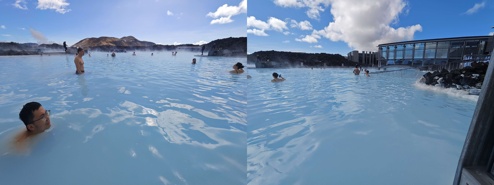

洗浴完准时赶上了 $16:15$ 离开蓝湖的大巴，早早地抵达了 *Lækjargata* 和 *Austurstræti* 这两条主干道的交汇处。原计划是去吃 *Caruso* 的烤龙虾，小红书上清一色地指责服务员种族歧视让我有点犹豫，走到门口看到 $9990 \text{ ISK}$ 的标价彻底把我吓退了。注意到 *messinn* 的龙虾几乎是半价（$5250 \text{ ISK}$）且数量相同，那就继续投靠 M 记吧！除了龙虾外我们又点了一份 $5550 \text{ ISK}$ 的海鲜意面。龙虾肉比较 Q 弹，**除此之外没啥亮点，两个菜都不及预期**。

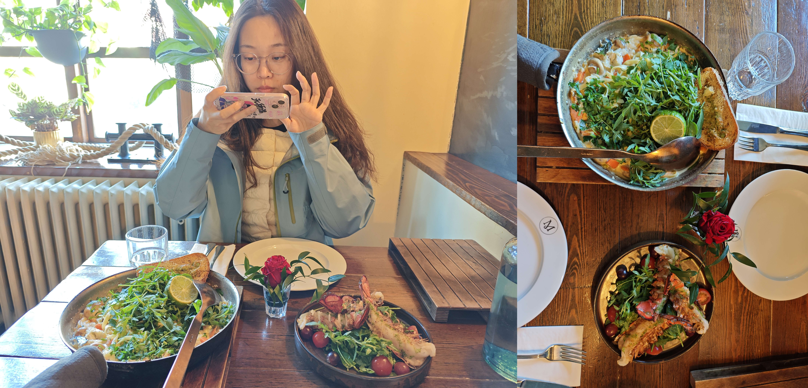

我订了第二天 $9:30$ 从 BSI 出发去机场的 flybus，匆匆整理好行李并老老实实在 $9:00$ 前赶到 Bus Stop 12，刚到就看到路边已经停了 flybus，麻利地校对姓名、麻利地上车、麻利地发车——难以想象迟到五分钟的后果。

冰岛的退税流程非常丝滑，但是整个值机和候机流程让我们非常后怕：来冰岛坐了廉航法国泛航（*Transavia*）体验很丝滑，离开冰岛选了老牌航司德国汉莎（*Lufthansa*）结果全是幺蛾子。我们的航班是 $14:20$ 从冰岛出发中转德国法兰克福去意大利威尼斯，起因是我发现汉莎线上预订座位的价格非常昂贵（而且要分开订两程），就想着贪下这笔钱提早来值机。冰岛的值机系统要求不早于起飞前三小时，所以我们 $10:30$ 抵达值机口时需要先等待半个多小时。我们在队伍的第一位，本来以为座位稳了，结果工作人员给了带有 Stand By 标记的登记卡，说是要由登机口统一办理。紧急在网上搜索了一下，发现汉莎这种操作非常常见，航司肯定是想等值机结束后来准确确认超售人数并制定策略。我们早早地抵达登机口，$13:00$ 左右就在工作人员的指示下占据登机口侧面（非标准登机队伍），位列换票队伍的第一名。工作人员承诺在登机开始后为我们换票，但事实上优先去处理 Group 1 和 Group 2 的登机队伍。这本来没什么，但是汉莎的系统和工作流实在是太垃圾了：总共只有一台电脑串行处理登机，时不时来个轮椅老哥或疑似签证有问题的老哥，在登机口一卡就是十分钟。最令我震惊的操作是：工作人员通过广播找来一个兄弟，告诉他说航班超售了，**问他能否同意坐在驾驶舱折叠座上**。整个场面非常乱，中途还有几个人来登机口讨要说法，大致情况如下（大家用带口音的英语交流，听得我晕头转向的）：他们原计划转机去慕尼黑，因为超售被推迟到下一班了，有个女士大声抗议说她可是选了座的。虽然我们排在换票第一位，一直卡到过了原定起飞时间时才兑换成功。整个过程中我就一直在反思，这种关键交通场景不该贪小便宜不订座。好在从结局来说是完美的，尽管第一程有些晚点，我们的下机口和新一程登机口就紧挨在一起，最后准时抵达威尼斯。

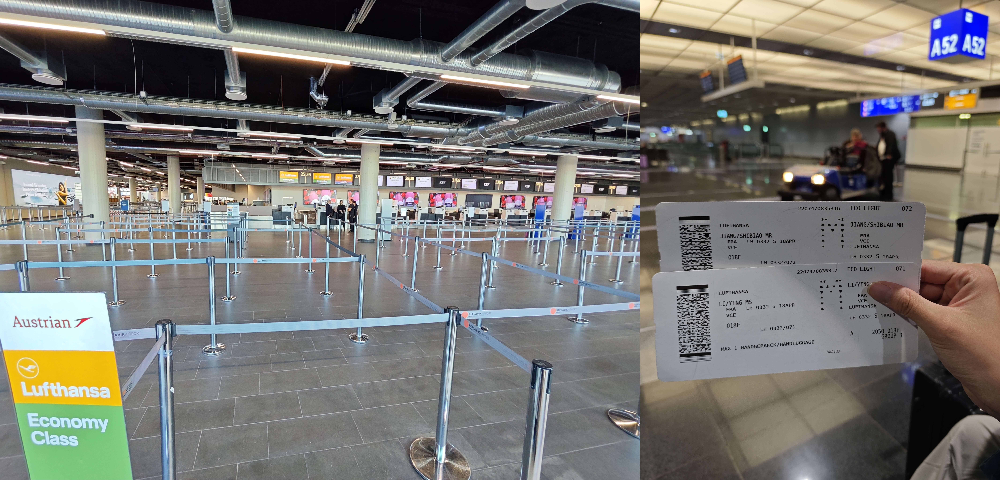

小红书上的意见是在机场买蓝湖面膜最划算，我们就花了 $15300 \text{ ISK}$ 入了个面膜小套装。飞机上继续吐槽汉莎，三小时的跨晚饭飞行只给了一块小巧克力和一瓶水，不得不在飞机上买了 $\euro 8.5$ 的三明治。

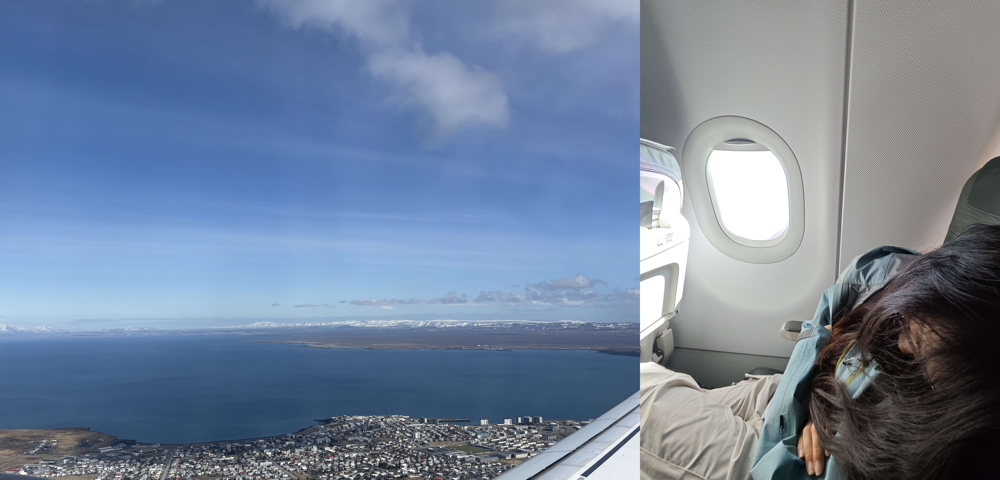
