## 威尼斯

汉莎航空自冰岛经法兰克福中转威尼斯，前一趟航班坐得满满当当而后一趟航班入座率不及 $1/3$，很担心后一趟机票钱是否抵得上油费。威尼斯不大，三个交通枢纽分别是马可波罗机场（*Marco Polo Airport*）、位于大陆的梅斯特雷火车站（*Mestre Station*）和位于岛上的圣卢西亚火车站（*Santa Lucia Station*），彼此之间都很近。为了优化行李中转的动线，我们预订了 *Mestre Station* 边上的威尼斯梅斯特雷康铂酒店（*Campanile Venice-Mestre*）。

意大利公交车的标准资费是单趟 $1.5$€，但从机场出发的票价高达 $12$€，玩法和巴黎的地铁机场线差不多。小红书上有很多攻略会建议先拖着箱子走一站绕开机场限制。考虑到天色已晚+行李多，我选择了最稳妥的 $35$ 路直达 *Mestre* 火车站的方案，以减少行李被盗风险——只是这 $10$ 公里 $20$ 分钟车程两个人收 $24$€ 着实有点膈应。由于整个行驶过程都位于威尼斯的大陆地区，沿途看不到任何水域。狭窄而陈旧的道路满是萧条之感，体感不及国内三线城市。从 *Mestre* 火车站向东走，一字排开的都是酒店。*Campanile Venice-Mestre* 外观不错，前台有种小作坊的感觉。店家收了我们 $9.6$€ 的城市税，并在我们无早订单里赠送了早饭，规格不高但足够惊喜。

第二天一大早我俩轻装上阵，从大陆的 *Mestre* 火车站坐火车去主岛的 *Lucia* 火车站。“主岛”本质上是坐落在亚得里亚海（*Adriatic Sea*）上的 $118$ 个岛屿，它们被 $176$ 条运河分隔，通过 $400$ 多座桥梁相互连接，在地图上看就像是一个完整的岛。这个岛就是课本里的水城威尼斯，也正是我们 City Walk 的目的地。意大利的火车站非常神奇，**整个场所完全是敞通的**，没有安检或是上下火车的验票闸机，全靠自觉。火车/公交车的纸质票很多是不限时的，所以上车前需要在特定机器上打卡表示核销——很多旅客总是忘了这一茬，小红书上铺天盖地的都是意大利公交车忘打卡被检票员巨额罚款的经历。我俩买完火车票后就如临大敌，找到如图的绿色机器打完卡后才放下心来。

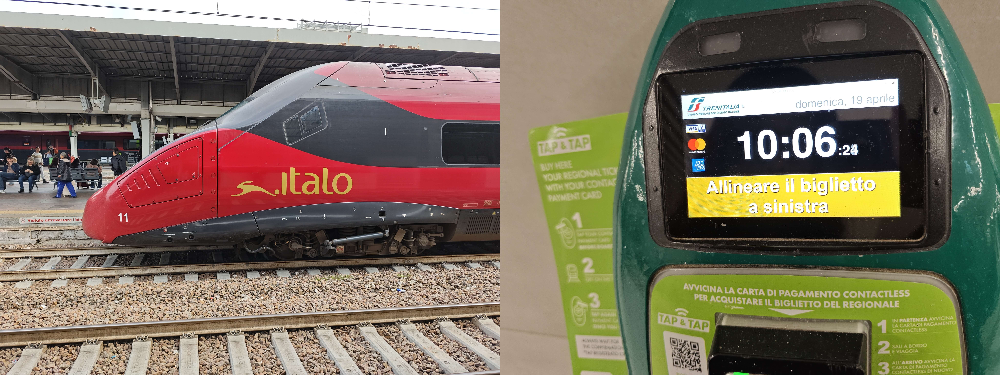

*Lucia* 火车站坐落在威尼斯大运河（*Canal Grande*）边。大运河上总共有四座主桥，从 *Lucia* 火车站出来就能看到第一座主桥**赤足桥**（*Ponte degli Scalzi*）：赤足桥之名来源于桥边曾经的赤足教堂，天主教加尔默罗修会的僧侣在修行时有赤足或仅穿凉鞋的传统。大运河宽阔的水面上停满了威尼斯特色小船贡多拉（*Gondola*）。

励颖的攻略建议去 *Pasticceria Nobile* 买个 $5$€ 的炸松饼，我们找到这家店后发现柜台里摆满了琳琅满目、各式各样的小面包，完全分不清楚哪个是松饼。店家很忙不方便细问，干脆就挑了个喜欢的样式品尝。

我们路过一家便利店去买了瓶水，**结账的时候经历了一个奇妙而温馨的插曲**。排队结账的队伍很长，排到我时我手上只准备了一张面额 $50$ 欧的纸币，结果店员摇摇头表示找不开。我的信用卡锁在背包的防盗夹层里，就当我满头大汗地翻包时，后面一位意大利绅士递上一枚 $1$€ 的硬币想帮我代付。我感觉非常不好意思，结结巴巴地用英语表达我正在找信用卡付款，他打断我说 **Boy where are you from?** 我回了一句 **From China**，他回复说 **OK, I love China** 并执意把硬币塞我手里。我涨红了脸实在不愿意收，最后是收银员接过了硬币把账结了。

午饭我们选在**里亚托桥**（*Ponte di Rialto*）附近的 *Rosticceria Gislon*。这家店主打的是炸海鲜，包括墨鱼面、烤鱼、炸鱿鱼、扇贝等。二楼正式座位需要预约，一楼流动座位很拥挤，我花了很久找座。励颖盲点了炸鱿鱼圈和烤鱼排，一下子就刷走了 $30.5$€。每一道菜里都有一块白色玉米糊，事后查阅这叫做白波伦塔（*Polenta Bianca*）。不同于意大利其他地区常见的黄色玉米糊，威尼斯人更偏爱用白玉米粉制作，口感更细腻，常用来搭配海鲜。

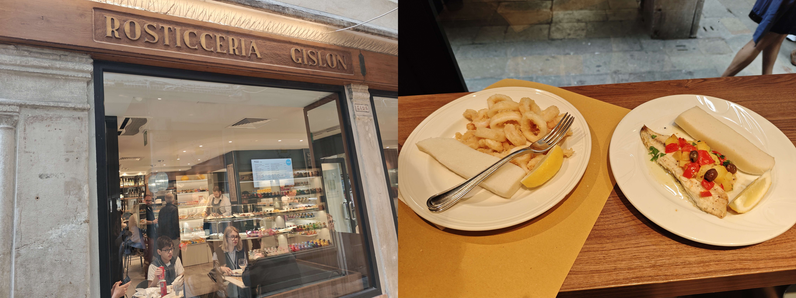

励颖钦定的饭后甜点是 *Gelatoteca Suso*，这是威尼斯全城人气最高、最受游客欢迎的冰激凌店，甜筒会插着标志性的带有 SUSO 标记的饼干。选口味的时候服务员嘴里突然蹦出两个很生硬的中文，试着和他聊了几句，他能说一口不太流利的中文——但这已经是我们在欧洲遇到的中文最好的外国小哥了，他解释说他在本地大学学习了四年中文。我喜欢红色的莓果味，励颖喜欢白色的酸奶味，这两个味道也是我们在后续意大利冰激凌品鉴之旅里常点的口味。行走在主岛的河边或小桥上，风景和小时候课本里描绘的一模一样。河道上随处可见威尼斯特色小船贡多拉（*Gondola*），据说价格高昂（政府定价包船在白天/晚上分别花费 $90/110$€，$30$ 分钟）。河道会有一股臭味，事后查阅资料可知这是生活污水在河道里累积成淤泥所致，内含的有机物暴露在空气中并被阳光照射会发酵。

主岛上的商业化非常严重，主要体现在随处可见的纪念品店，卖着琳琅满目的商品（各种冰箱贴，纸袋、钥匙扣、小模型等）。可能欧洲人比较喜欢吃这一套，但作为精通拼多多和义乌小商品的中国人来说实在是有点审美疲劳。值得一提的是，**威尼斯的纪念品里有各种各样的面具出售**，这是其他欧洲城市所不具备的。事后搜索发现，这是由威尼斯的传统所致：尽管威尼斯共和国鼎盛时期社会等级非常严苛，法律允许甚至鼓励威尼斯人在一年的很多月份里佩戴面具上街——当大家都戴上面具时，贵族、贫民、神职人员和赌徒在街上是无法分辨的。

下一个站是沉船书店（*Libreria Acqua Alta*）。店主 *Luigi Frizzo* 为了保护藏书不被频繁进水的运河毁坏，突发奇想地将书堆放在贡多拉船、废弃的小船以及浴缸里。这样即便潮汐来袭，河水漫进书店，书也会随之漂浮而不会被泡烂。整个过程和莎士比亚书店非常类似，我们得顺着人流排队进入，按照规定的线路缓慢移动，从一侧穿出书店绕一圈后再回入。书架上的英语书标题只能走马观花地欣赏着，书店外侧的沉船装饰也只能匆匆拍照打卡就撤。

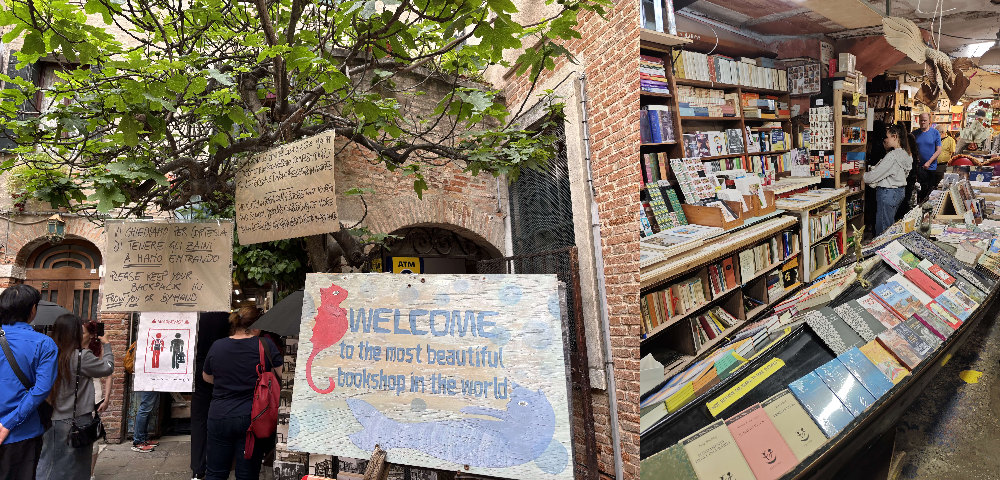

接下来是圣马可广场（*Piazza San Marco*），广场东侧坐落着融合拜占庭风格的圣马可大教堂（*Basilica di San Marco*）与曾作为政府驻地的总督宫（*Palazzo Ducale*），四周由新旧行政官邸建筑环绕，是汇集了圣马可钟楼、圣马可时钟塔等标志性历史建筑于一体的城市核心地标。广场里全是鸽子和海鸥，一点都不怕人，甚至很爱飞掠游客的头顶引起惊呼。我们还看到几只鸽子正在分食地上的一块披萨。广场四周有很多沿街摆满椅子的咖啡馆，规模较大的咖啡馆还有乐队在门口演奏着。正好我俩走累了，我就提议找个咖啡店点两杯咖啡休息下——哪知刚落座就看到菜单上写着座位费 $7$€/人的提示，吓得我俩立刻蹦出座位。广场南端连接着被称为圣马可小广场（*Piazzetta*）的开阔地，直接通往外侧的码头和入海口。水边站立着两根巨大的花岗岩石柱，分别是圣狄奥多（*San Teodoro*）柱和圣马可飞狮（*Leone di San Marco*）柱，这便是威尼斯的“大门”。码头上停靠着标志性的贡多拉，石柱与水面交织，是进入威尼斯海上门户的视觉终点。由于码头视野开阔且常有海风，大量鸽子会从广场中心盘旋至此。

叹息桥（*Ponte dei Sospiri*）是连接威尼斯总督宫和威尼斯监狱的一座全封闭巴洛克石桥。桥的得名有个令人忧郁的历史渊源，过去囚犯在总督宫接受审判后经此前往监牢，通过桥上的小窗最后看一眼外面的世界后往往会发出叹息。现在这座桥已成为威尼斯的标志性景点，桥下是繁忙的贡多拉水道，因“日落时在桥下接吻能获得永恒爱情”的传说而深受游客欢迎。可惜的是需要购买价格高昂的总督宫门票才能走上这座桥参观，我们只能在总督宫入口处遥遥望向叹息桥的正面，或是在隔壁的麦草桥（*Ponte della Paglia*）上平视叹息桥的侧面。

整个威尼斯 City Walk 的过程中，我们手上的小吃和冰激凌不断。威尼斯有个特有的概念叫做 *Cicchetti*，指代沿街柜台中琳琅满目的小食，从海鲜串、炸丸子到经典的各式面包片应有尽有。我买了一小块 $2.5$€ 的八爪鱼面包片过过瘾，口感和定位都很像寿司。对当地人而言，吃 *Cicchetti* 往往并非为了正餐，而是一种社交习惯：我们总能在一段狭小的巷道里，碰到一群正站着喝着小杯白酒、吃着几样小食、大声欢笑着的年轻人。

**学院桥**（*Ponte dell'Accademia*）是四座主桥里唯一的木质拱桥，连接着圣马可区与学院美术馆。虽然它是一座“临时”修建的木桥，却因其古朴的质感深受当地人喜爱。这里有一个水上巴士站点 *Accademia*，会有巴士 1 号线和 2 号线停靠。研究 Google Map 发现，1 号线沿着大运河贯穿全城，最后抵达主岛东侧狭长的丽都岛（*Lido*）；2 号线会以更少的停靠点环绕，同时会绕行到主岛南侧的朱代卡岛（*Giudecca*）。单次船票的价格是每人 $9.5$€，支持在 $90$ 分钟内任意换乘水上巴士或公交车。我们从学院桥站上车，$90$ 分钟里正好沿着 2 号线环绕一周。船上人很多，我一开始找了个靠窗的位置坐下来休息，行至中途励颖抢到了两个船尾的位置，我们得以欣赏水景。

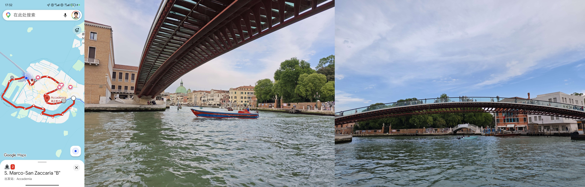

**宪法桥**（*Ponte della Costituzione*）是大运河上四座主桥里我们唯一没有步行抵达的（通过 2 号线途经）。这座桥是钢结构玻璃桥，直接连接了罗马广场巴士站与 *Lucia* 火车站。其极简的现代弧线造型与两岸传统的古建筑形成了鲜明的视觉对比，据说玻璃桥面在雨天容易打滑，所以它自建成起就一直伴随着当地人的争议。

晚餐我们选在 *Trattoria Bar Pontini*，这是一家非常火的意式家庭餐馆，需要排队一会才能进入。我们按照推荐点了 $19$€ 的海鲜意面和 $18$€ 的墨鱼面。这两种意面都是这家店的招牌，我俩各自分食，**口感真的非常棒**。

## 佛罗伦萨-第一天

意大利的高速火车主要由国铁 *Trenitalia* 和私铁 *Italo* 运营，其售票政策更偏向于国内的民航而非高铁，即提前一个月左右购买的商务座和临期的标准座价格接近，对于我们这种精准控时的游客来说非常友好。我俩起了个大早，坐 $7:17-9:20$ 的 *Italo* 商务座从威尼斯 *Mestre* 火车站前往佛罗伦萨 *Santa Maria Novella* 火车站。

值得注意的是，佛罗伦萨是意大利的托斯卡纳大区（*Toscana*）的省会，而我非常喜爱的桌游《葡萄酒庄园》的核心扩展《托斯卡纳》（*Viticulture: Tuscany*）就指向了这一地区。托斯卡纳地区超过 $60\%$ 的土地都是高低起伏的丘陵。这种地形虽然不利于大规模机械化农业，却因为排水好、日照足成为了葡萄种植的天然温床。

我们预订了火车站附近的四星级酒店 MH 佛罗伦萨酒店及水疗中心（*MH Florence Hotel & Spa*），这应该是我们整个欧洲出行里预订的最豪奢的酒店，主打一个交通便利和行李周转安全。佛罗伦萨 *Santa Maria Novella* 火车站门口的道路规划非常复杂，大大小小的分岔路，有轨电车道、机动车道、非机动车道、人行道总是频繁换道，更别说穿梭于其中的凌乱的斑马线。别看导航上火车站距离酒店只有几百米，我俩初来乍到切换错了好几次道路。前台为我们安排了一个靠内侧的幽静的房间，窗外可以看到酒店内景。离店后交了 $28$€ 城市税，每人每晚是 $7$€。

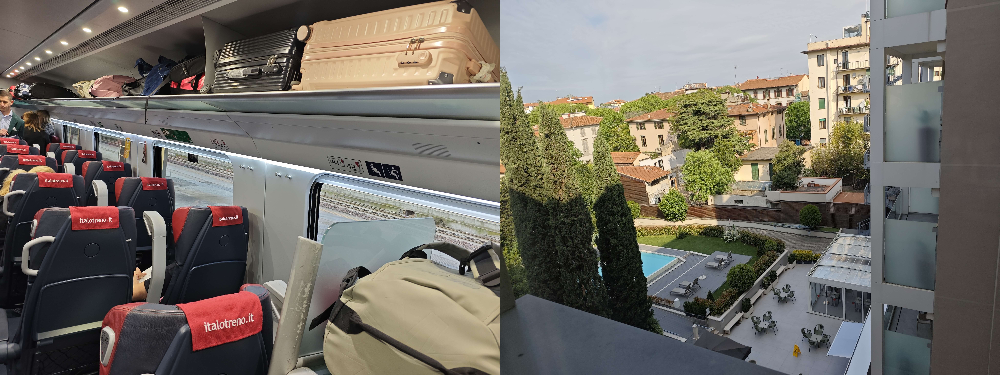

我们的第一站是距离火车站不远的中央市场（*Mercato Centrale Firenze*），这里总共有两层，各自代表佛罗伦萨 “传统市井菜市场” 与 “现代美食广场” 两种风格。我们直奔一家牛肚包百年老店 *Da Nerbone*，点了一份 $5.5$€ 的招牌牛肚包 *Panino con Lampredotto*（*Lampredotto* 特指牛的第四个胃皱胃）。牛肚包的用料非常扎实，励颖评价说是整个佛罗伦萨之行里最实惠的美食，难怪我们进餐过程中店门口始终排着一支队伍。

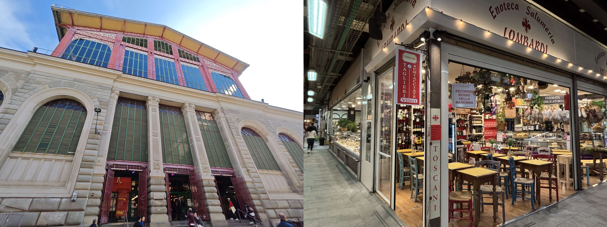

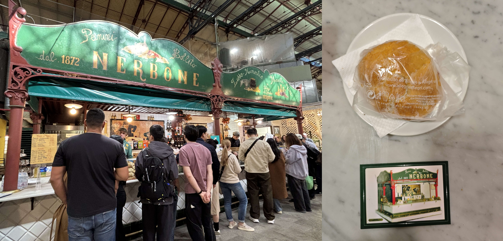

一楼有一家 *Ditta Artigianale* 的连锁店，我们点了一杯 $3.2$€ 的拿铁（*Latte*）。点餐前 Gemini 贴心地告诉我最好念完整的 *Caffè Latte*，因为 *latte* 本身在意大利语里就是奶的意思，容易导致歧义。

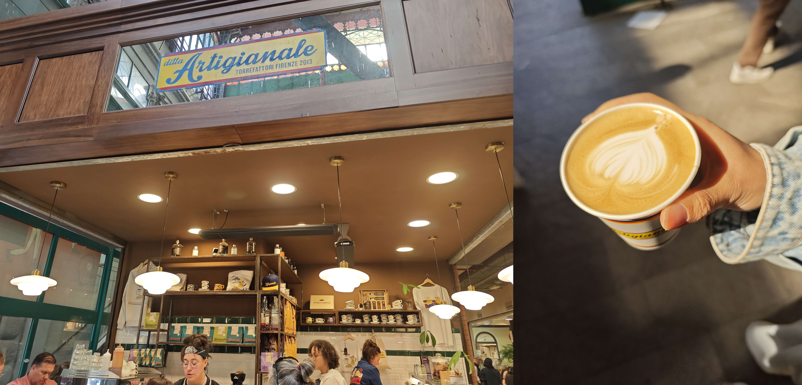

火车站出发的路上会经过圣洛伦佐大教堂（*Basilica di San Lorenzo*），经过后来顾爷的点拨我们得窥其中奥秘。这座教堂的外墙 **是由米开朗基罗设计**，他本人为此制作过对应的木制模型。之所以外表风格看着格格不入，是因为**这座教堂从十六世纪烂尾至今**：1515 年，出身美第奇家族的教皇利奥十世（*Leone X*）决定给这座古老的教堂加盖一个无比奢华的大理石正面，米开朗基罗击败了拉斐尔等一众对手赢得了这个项目的设计；然而 1520 年由于教皇财政危机、美第奇家族在海外战争花销巨大，教皇突然宣布取消了这一合同。五百年来没有人敢轻易改动这位大师未完成的立面，所以这座教堂的正面就一直保持着粗糙、光秃秃的原始红砖胚子状态。门口的雕塑纪念的是美第奇家族的雇佣兵队长乔凡尼·德·美第奇（由他儿子打造），采用这种坐姿（而非骑马）纪念武将有点不寻常。

圣母百花大教堂（*Cattedrale di Santa Maria del Fiore*）可谓是佛罗伦萨的地标建筑。它是世界第四大天主教堂，整个建筑群由大教堂本身、乔托钟楼和“天堂之门”圣乔瓦尼洗礼堂共同组成，始建于 1296 年，历时近 150 年才基本完工。进入大教堂中殿参观是免费的，可能正因如此，教堂门口排起了极其恐怖的长龙，我俩转了好几个弯才找到队伍的末尾。教堂外侧部分区域正在施工，施工墙很人性化地贴了原来的花纹，远望过去以假乱真。两天逛下来后我们发现 **圣母百花大教堂几乎是佛罗伦萨的市中心**，向外辐射很多条道路，景点之间的导航总会穿过它。

与无比奢华、色彩斑斓的外墙相比，教堂内部显得异常空旷、朴素和冷清。抬头可以望到穹顶内壁的巨幅湿壁画《末日审判》，由文艺复兴晚期的乔尔乔·瓦萨里（*Giorgio Vasari*）及其弟子费德里科·祖卡里（*Federico Zuccari*）完成。一层绕一圈就逛完了，狭窄的负一楼里藏着一个纪念品店和一个博物馆。

漫步在佛罗伦萨城市街头，到处都是古典的中世纪建筑，让人目不暇接。就连路上的行人都很有艺术气息，有街头拉琴唱歌的、有街头作画的（不过据说存在某些印刷画冒充手绘真迹的骗局）、甚至有骑马的。

下一站是旧宫（*Palazzo Vecchio*），其粗犷的锯齿状外墙看起来像一座巨大的中世纪防御工事，矗立在领主广场（*Piazza della Signoria*）之上。旧宫始建于 1299 年，最初是为了作为佛罗伦萨共和国的最高行政长官办公和居住的“领主宫”；1540 年美第奇家族的托斯卡纳大公科西莫一世（*Cosimo I*）对其内部进行了极尽奢华的文艺复兴式改造；后来美第奇家族搬到阿诺河对岸的“皮蒂宫”（*Palazzo Pitti*），这里就被人们称为“旧宫”。旧宫门口矗立了瞩目的大卫像复制品，象征着佛罗伦萨人无畏强权（反美第奇）、捍卫共和国自由的精神。据说 1504 年米开朗基罗的原作完工后便安放在这里，陆续遭遇了断手、雷击、鸟粪侵蚀等危害，直到 1873 年佛罗伦萨政府将其替换为复制品，并将真品移入佛罗伦萨学院美术馆（*Galleria dell'Accademia*）室内专门展厅里。

我们原计划购买 $20$€ 的旧宫登顶票，可惜工作人员说当日登顶票已经售罄，励颖对此非常懊恼。抱着来都来了的心理，我们转而购买 $18$€ 的旧宫博物馆票。这两种票的入口正好位于一楼内庭院的两侧，本质上就是在同一幢楼里，但每一层都有工作人员阻拦不允许跨区。更有甚者，旧宫博物馆里高处有很多可以眺望佛罗伦萨城市的地方，但无一例外都被围栏围住或被网格栅栏封住，意思就像是只有购买登顶票才给看，一鱼两吃有点恶心。

爬上旧宫博物馆就能看到宏伟的五百人大厅（*Salone dei Cinquecento*），这里曾是佛罗伦萨共和国议会的会场。关于大厅有一段浪漫的传说：共和国政府曾邀请了达芬奇和米开朗基罗来绘制表现佛罗伦萨光荣历史的巨幅壁画，前者在创作《安吉亚里之战》时试图使用一种类似于“蜡画”的新技术，但没能控制好颜料的干燥速度，最终导致颜料熔化、色彩流淌；几十年后，美第奇家族为了重新装饰大厅，由乔尔乔·瓦萨里（*Giorgio Vasari*）主持改建。接下来我们沿着博物馆的动线参观了很多装饰华丽的房间，英意双语的讲解牌着实看得吃力，我全程通过拍讲解牌或实物照片给 Gemini 的方式获取讲解。印象最深刻的是科西莫自住的元素之厅（*Quartiere degli Elementi*），房间装饰主题以水、土、火、气等自然元素为核心，结合了很多古代神话传说，即象征水的维纳斯的诞生（*Birth of Venus*）、象征土的向萨图恩献祭大地的果实（*Fruits of the Earth offered to Saturn*）、象征火的伏尔甘的锻造场（*The Forge of Vulcan*）、象征气的萨图恩割裂天空（*Saturn Mutilating the Sky*）。

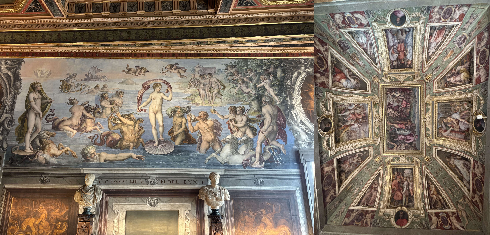

午后我们腹中饥饿，前往网红三明治店 *I' Girone De' Ghiotti*。这个店名翻译过来是老饕之环，致敬了佛罗伦萨最伟大的诗人但丁的《神曲·地狱篇》。菜单的命名也非常有风格，不同口味的三明治居然用不同的罪行来命名——例如我们点的是 $9$€ 的 *suicida*（自杀者），实际上是意式五花肉+托斯卡纳羊奶酪口味的三明治。励颖的评价是咬合困难、味道很咸，所以三明治大部分都是我吃的。我们还买了杯 $1.5$€ 的盒装冰茶 *Estathé in brick*，在蜜桃味和柠檬味两个口味中选了前者，据说这是意大利国民级饮料。

老桥（*Ponte Vecchio*）横跨在阿诺河（*Arno*）上，是佛罗伦萨最古老、最上镜、也最具传奇色彩的桥梁。它的历史最早可以追溯到古罗马时期，今天看到的这座三孔石拱桥重建于 1345 年——它是欧洲第一座在中世纪建造的低圆弧拱桥，这种设计大大减少了桥墩数量，让桥面更宽，同时也更不易被洪水冲垮。下面是老桥两侧眺望图。

整座老桥开满了金光闪闪的顶级高定珠宝店、钟表店和古董首饰铺，豪华得令人咋舌。从第二天游玩的乌菲兹博物馆的窗口可以眺望到这座老桥的全貌。桥上盖了一座瓦萨里走廊（*Corridoio Vasariano*），是一排带着整齐小窗户的封闭式空中长廊，当时的大公和家眷们可以在走廊上欣赏风景或俯瞰脚底下的市民。根据顾爷的介绍，这是美第奇家族的托斯卡纳大公科西莫一世（*Cosimo I*） 于 1565 年下令建造的，为了方便将官邸从旧宫搬到河对面的皮蒂宫。事后我查阅资料得知：从 14 世纪老桥重建一直到 1565 年盖完走廊后，老桥上集中的其实是肉铺和鱼铺；大公每天从走廊去上班时，脚底都会传来阵阵腐肉的恶臭；直到 1593 年，忍无可忍的托斯卡纳大公斐迪南一世下令把桥上所有的肉铺全部赶走，只允许金匠、银匠和珠宝商入驻，这才慢慢演变成如今的样子。

跨过老桥后左转，一直沿着阿诺河（*Arno*）向东走，遇到中世纪古城墙的遗迹后就不断向上爬楼梯，最后走到了米开朗基罗广场（*Piazzale Michelangelo*）。这个广场始建于 1869 年（并不是文艺复兴的产物），系佛罗伦萨本土建筑师向艺术巨匠米开朗基罗致敬而得名。广场地势很高，栏杆边上站满了游客，可以眺望佛罗伦萨全景。我俩光顾着眺望和拍照，事后才听说广场正中央矗立着一组包含《大卫》复制品在内的宏伟的青铜雕塑群。

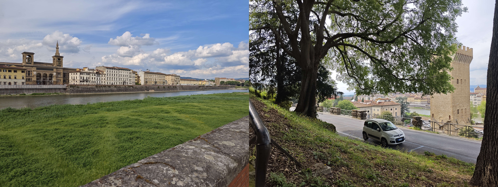

傍晚是米开朗基罗广场最热闹、最浪漫的时刻。夕阳西下，金色的阳光把老桥、旧宫的阿诺尔福塔和百花大教堂的超级大穹顶染成一片辉煌的暖橘色，美得让人屏住呼吸。游客们会自发地坐在面向城市的巨大阶梯上，欣赏乐队的表演。我们先后目睹两对 e 人情侣求婚，主唱会很贴心地唱起 *Marry You* 和 *Beautiful in White* 这类歌曲，观众们也会欢呼着尖叫着给足情绪价值。小红书上说米开朗基罗广场每天都会有很多情侣来求婚和互动，其中中国人占比特别高。我们隔壁坐着的老哥甚至自带一瓶啤酒，很潇洒地对着阶梯旁的树荫弹射瓶盖，伴随着歌声小酌。

我们在米开朗基罗广场从 $17:00$ 一直待到 $19:30$。折返市区，夜幕降临下的老桥和城市别有一番风味。

晚饭我们选在了大名鼎鼎的 *Trattoria Zà Zà*。抵达时已经 $21:00$，街区里人和车已经很少了，唯独 ZA ZA 门口排起了长队。我们按小红书上的攻略点了两份菜，口味不枉我们排长队，我尤为喜欢其中的西葫芦意面。

+ $27$€ 樱桃番茄牛排 *Za Za style Beef Fillet (sautéed with fresh cherry tomatoes and dried herb)*
+ $19$€ 松露虾仁西葫芦意面 *Prawns and zucchini Flowers Spaghettini topped with fresh Truffle*

回去路上我们意外走到华人一条街上，川菜馆啊小商品啊应有尽有。印象深刻的是大叔超市，汇总了中国各式各样的零食，很多国人游客在此购物。目测店主放心不下来意大利读书工作的孩子，干脆搬来这里开起了超市。

## 佛罗伦萨-第二天

佛罗伦萨第二天上午的规划是学院美术馆（*Galleria dell'Accademia*）。线上门票很抢手，我提前半个月看的时候早已售罄，只能在携程官方买了代抢票，单人成本从 $24$€ 提高到了 $255$¥。携程上只提供 $8:15-10:15$ 的区间抢票，不幸地 roll 到了 $8:30$ 的门票。为了防止超时后无法进入，我们不得不订好闹钟睡眼惺忪地过去。

学院美术馆外侧狭窄的道路上挤满了人，我们不由地庆幸提前搞到了票。进门后我俩就蒙圈了，正好有点没睡醒，索性先找个座位坐下来参阅顾爷的 [AAAAA 佛罗伦萨学院美术馆全攻略](https://www.bilibili.com/video/BV1QYkLBPExg)。我们从中学到了很多有用的概念，例如入口宗教画展里高频出现的老头、耶稣、鸽子等意象被称为 *Trinity*，指的是圣父、圣子、圣灵三合一。不过正如顾爷吐槽的那样，学院美术馆的画作具有高学术性的特征，大多数人排了老长的队进来只是看了个热闹。

转过走廊，米开朗基罗的《大卫》（*David*）真迹渺小却又清晰地矗立在远方。沿着走廊慢慢向前走，这个 $5.17m$ 的雕像就像在聚光灯下慢慢变大，终于到了只能仰望的程度。

+ 根据《圣经》记载，大卫在迎战巨人歌利亚之前拒绝了扫罗王（*King Saul*）提供的盔甲，选择只用信仰和一件简陋的投石索去面对强敌——米开朗基罗就把他解读成了光着身子，好像哪里怪怪的但也没啥问题。
+ 《大卫》作品的历史背景非常耐人寻味。1410 年美第奇家族正在崛起，百花大教堂工程局大搞“12尊圣经人物雕像”项目，多纳泰罗（*Donatello*）率先用陶土制作了第一尊雕像约书亚。1464 年工程局从卡拉拉采石场运来这块 6 吨重的巨石，委托雕塑家阿戈斯蒂诺（*Agostino*）雕刻大卫。1466 年阿戈斯蒂诺因驾驭不了石头而停工，从此这块名为巨人（*Il Gigante*）的石头一直躺在教堂工坊的院子里。等到 1501 年米开朗基罗接手这个烂摊子时，美第奇家族已被赶下台，成立了佛罗伦萨共和国（*Repubblica Fiorentina*），这个雕塑被赋予了更深刻的意义。大卫在圣经中是一个弱小的牧羊童，靠着智慧和勇气打败了全副武装的巨人歌利亚——大卫以弱胜强的故事是当时共和国反抗独裁者的图腾，大卫就是新生的佛罗伦萨共和国，而歌利亚就是那些对共和国虎视眈眈的强大敌人（包括在罗马试图复辟的美第奇家族、教皇势力以及法国人）。
+ 和多纳泰罗的原计划不同，米开朗基罗大胆地删掉了巨人歌利亚脑袋的部分，只留下大卫本体。他将雕塑画面定格在战斗发生前的那一刻，大卫眉头微蹙，双眼紧盯着远方的对手，处于一种高度警觉和专注的状态。
+ 专家指出大卫的脑袋和手相对身体偏大，这是为了放在高处而刻意设计的透视效果。巨大的右手象征着强壮之手（*Manu Fortis*），代表了大卫（以及当时的佛罗伦萨共和国）坚韧不拔的意志。
+ 后来美第奇家族真的复辟了，但他们非常有格局：不仅没有毁掉这座雕像，还把它放在领主广场上。
+ 大卫上方这个宏伟的半圆形空间，是 19 世纪末由建筑师德法布里斯（*De Fabris*）专门为《大卫》设计的。抬头看上方的天窗，它为雕像提供了柔和且多变的自然光，使大理石的质感仿佛真实的皮肤一般。
+ 背面，左手紧握的是投石索的末端，投石索的带子顺着他的背部延伸到右手。力量正从承重的右腿向上输送，穿过臀部，一直延伸到紧绷的肩胛骨。大卫右脚后侧有一个树干形状的支撑物，防止雕像因自身重量而在脚踝处断裂。这种肌肉的联动，体现了人体在准备发动攻击前的瞬时状态。

大卫所处的走廊两侧，放置了一批米开朗基罗未完成的雕像，这种雕琢未满的风格给人以更多的想象。顾爷提到米开朗基罗说过的一句很装逼又很有诗意的话：**我不是在雕刻，而是将原本已经存在的形象从石头中解放出来**。原文出自他写的《十四行诗第151首》（*Sonetto 151*）：*Non ha l'ottimo artista alcun concetto / c'un marmo solo in sé non circonscriva / col suo superchio, e solo a quello arriva / la man che ubbidisce all'intelletto*。

我们找到了一个很大的石膏陈列室（*Gipsoteca*），展示了拿破仑家族御用雕刻家巴托利尼（*Bartolini*）的作品。这里陈列的几百尊雕像都是石膏而非大理石，它们是巴托利尼在创作最终大理石雕像前制作的 1:1 石膏原型。作品的表面留有很多烦人的黑点——它们其实是金属钉，经过近两百年的氧化发黑变成了现在的样子。在 19 世纪的雕塑测量技术里，这些钉子是关键的基准点。工匠们利用一种名为指点机（*Macchina da punta*）的工具测量这些点之间的深度和距离，从而精准地将石膏母版上的每一个细节，一比一完美复刻到昂贵的大理石块上。

我俩缺少必要的美学造诣，学院美术馆逛了半个多小时就逛完了。纪念品店里买了一块很好看的 $5$€ 的绿色佛罗伦萨冰箱贴，结果出去后各种店里更便宜。有一本标题为《卓越的洛伦佐》的书，回想起我们此前玩过同名桌游，搜了搜两者果然是有关联的：卓越者洛伦佐（*Lorenzo de' Medici, "the Magnificent"*）是美第奇家族奠基人科西莫的孙子，他是文艺复兴时期佛罗伦萨事实上的统治者，也是达芬奇、米开朗基罗等天才的最重要赞助人。同名桌游就让玩家扮演佛罗伦萨显赫家族的首领，通过派遣家族成员（骰子驱动）去获取领地、建筑、人物和风险投资。

中午我们返回中央市场觅食，自由发挥把二楼逛了一圈。买了一颗 $5.5$€ 的肉酱味西西里饭团（*Arancina*），说是意大利国民级的小吃，可惜我俩并未 get 到美味之处；还买了个 $10.5$€ 的巨大玛格丽特披萨（*la Margherita*）。

市场门前的景象相比前一天热闹了很多：**路的两侧摆满了卖皮革制品的摊子**，包啊皮带啊琳琅满目——这和威尼斯的特色面具形成鲜明对比。原来在文艺复兴时期，美第奇家族大力资助佛罗伦萨的各种手工业行会，其中就包括皮革加工。这项技术传承了几百年，让托斯卡纳地区形成了世界上最顶尖的植鞣工艺（*Concia al vegetale*）。可惜我们对皮革制品一窍不通，心痒痒地总想买点啥，却望着花花绿绿的商品和价格无从下手。

我预约了 $13:45$ 的乌菲兹美术馆（*Galleria degli Uffizi*） 。乌菲兹大楼由文艺复兴大师乔尔乔·瓦萨里（*Giorgio Vasari*）设计，前身是佛罗伦萨机关单位（意大利语的 *Uffizi* 就是英语里的 *Office*）。感谢顾爷的 City Walk 攻略 [AAAAA翡冷翠City walk（上）](https://www.bilibili.com/video/BV1jYmuBBE5m) 和 [AAAAA翡冷翠City walk（下）](https://www.bilibili.com/video/BV1VHBXBYE5r)，我俩在过去路上发现了很多潜藏在建筑里的美第奇元素。美术馆本身的参观攻略参考了顾爷的 [《乌菲兹全攻略》](https://www.bilibili.com/video/BV1JxQAY5EzZ) ，目标就是把所有提到的画作都打个卡。

1581年美第奇大公将大楼的顶层长廊改建为艺术画廊（*Le Gallerie*），形成了世界上最古老的现代博物馆的雏形。意大利语里的 *Galleria* 本来只是指连接两栋建筑之间的“长廊”或“走廊”，当这种“在长廊里欣赏艺术品”的模式风靡了整个欧洲后，就逐渐演变成了“艺术品陈列馆”的代名词，英语里的 *Gallery* 由此得名。走在这条大画廊里，天花板上装饰的是怪诞风格壁画（*Grotesques*），沿途整齐地陈列着上百尊古希腊和古罗马时期的雕塑、半身像和石棺，窗外是明亮的阿诺河，从这角度可以很明显地看到架在老桥上、连接皮蒂宫的瓦萨里长廊。

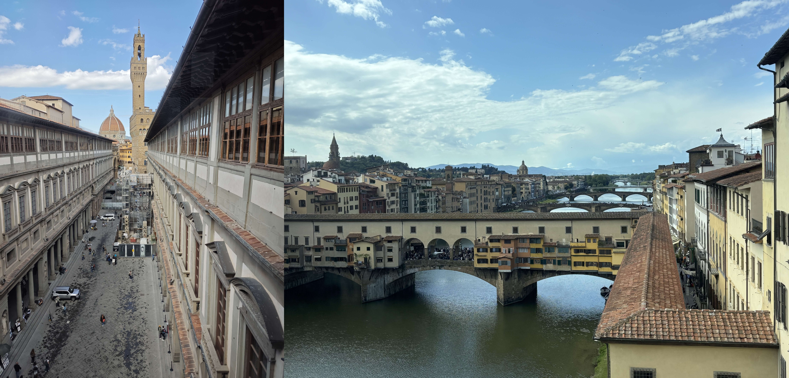

《三博士来朝》（*Adoration of the Magi*）是公认的国际哥特式风格的巅峰之作。 画中大量使用了真金箔。真蒂莱不仅将金箔平铺，还使用了“浮雕”技术，让王冠、马具、宝剑和织物的边缘微微凸起，在博物馆的灯光下会产生真实的立体反光。画面左侧是圣母、圣婴和圣约瑟，右侧则是规模宏大的随从队伍。画面主体是三位贤士（代表老、中、青三个阶段）抵达伯利恒，正在向圣母玛利亚怀中的圣婴献礼。

乌菲兹博物馆把桑德罗·波提切利（*Sandro Botticelli*）的两幅镇馆之宝放在同一个狭小的房间里：

+ 《春》（*La Primavera*）。人物从右往左看：西风之神泽费罗斯（*Zephyrus*）正在追逐森林仙女克罗丽丝（*Chloris*），后者被触碰后变为左侧的花神芙罗拉（*Flora*）；维纳斯（*Venus*）站在画面正中央，上方是蒙着眼睛的爱神丘比特（*Cupid*），左侧是美惠三女神（*The Three Graces*）；最左侧男性是墨丘利（*Mercury*），他正举着神杖拨开云雾，象征着理性和春天秩序的守护。Gemini 介绍说画面中描绘了超过 500 种不同的植物，其中至少有 **190 种** 不同的花卉被专家辨认出来，都是托斯卡纳地区在 3 月到 5 月之间真实开放的花朵。
+ 《维纳斯的诞生》（*La nascita di Venere*）。人物少很多：左侧就是风神和花神，右侧是时序女神（*Hora*），她正拿着一件绣满矢车菊的繁花斗篷准备为赤裸的女神披上，象征着从自然状态向人类文明社会的过渡。可以发现 **维纳斯的脖子长得有些夸张，其左肩下垂的角度也很奇怪**。据说这种“错误”是故意的，波提切利追求的是维纳斯那如波浪般的长发和飘逸的衣角的**流动感**。

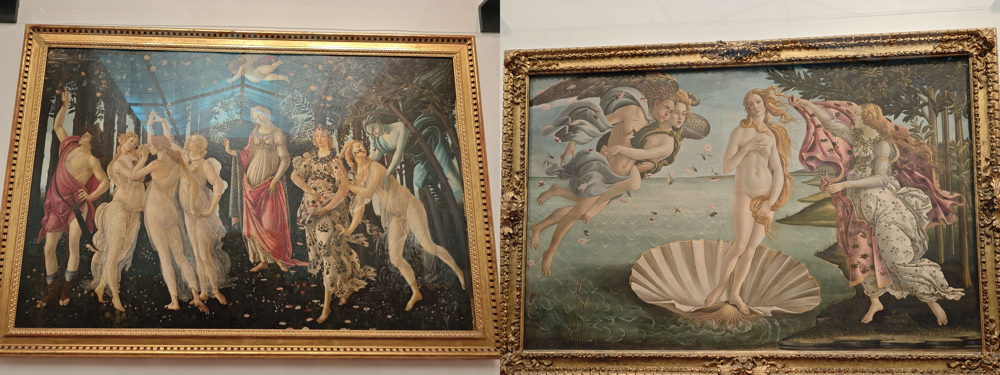

画廊某处排起了长队，每位游客只能在房间门外观赏十秒左右（只够快速拍两张照），超时就会被工作人员劝离。这个房间叫做至宝厅（*Tribuna degli Uffizi*），里面保护着珍贵的大理石拼接地板、雕塑和精细的墙面装饰。走到画廊尽头也有个无法进入的小房间，这被称为迷你画像厅（*Gabinetto delle Miniature*）或小珍宝馆，同样拥有极其精美的壁画穹顶和华丽的大理石拼接地板，墙上则挂满了美第奇家族历代收藏的微型肖像画。

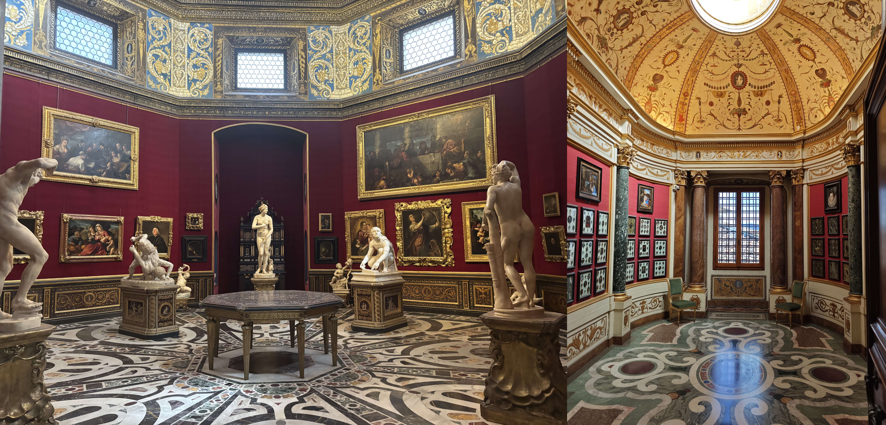

达芬奇（*Leonardo da Vinci*）的画作被独立放置于一个展厅，我俩结合 Gemini 的讲解逐帧欣赏这些画作。

+ 《圣母领报》是公认的达·芬奇独立完成的第一幅重大委任作品，描绘了圣经中经典的一幕：大天使加百列（左侧）向童贞女玛利亚（右侧）宣告她将受圣灵感孕，诞下圣子耶稣。天使加百列的翅膀以鸟类翅膀的解剖学结构为基础绘制的，极其写实。背景中的丝柏树和远山运用了“大气透视法”，色彩随距离变淡变蓝。玛利亚伸出的右手似乎显得过长，且她与读经台的距离在空间关系上稍显别扭。艺术史学家解释说因为这幅画最初是为教堂侧墙设计的，专为观众从右下方斜看而进行了视差矫正（*Anamorphic Perspective*）。
+ 《基督受洗》描绘了施洗约翰在约旦河为耶稣洗礼的场景，由达芬奇的老师委罗基奥（*Verrocchio*）和达芬奇共同完成。老师委罗基奥使用了传统的蛋彩画技法，笔触相对硬朗、线条清晰；最左侧的跪地天使由学生达·芬奇绘制，使用了当时刚从尼德兰传来的油画。据说委罗基奥在看到年轻的达·芬奇画出如此完美灵动的天使以及背景中轻柔朦胧的风景后，深感弟子的才华远超自己，从此便搁下画笔，一生专攻雕塑。
+ 《三博士来朝》是达·芬奇受佛罗伦萨一所修道院的委托但未最终完成的画作。画面上保留了极其复杂的透视线、木板底层的炭笔线条以及用棕褐色调勾勒的最初光影，揭示了达·芬奇构思画面的全过程。

在顾爷的引导下，我俩特地观赏了拉斐尔和米开朗基罗各自画的圣母。前者符合人们预期的优雅，而后者居然是正在展示肱二头肌的力量圣母。顾爷吐槽说，米开朗基罗玩雕塑玩惯了，身后不画点裸男浑身不舒服。

乌菲兹美术馆的动线设置得非常合理，全程沿着一条线移动。走完画廊、穿过一堆艺术家的肖像画后，我们数次以为要逛完整个博物馆了，没想到峰回路转陆续打卡了非常多的名作——乌菲兹馆藏作品远超我的想象。

+ 威尼斯画派泰斗提香（*Tiziano Vecellio*）的巅峰之作《乌尔比诺的维纳斯》（*Venere di Urbino*）是西方艺术史上躺卧裸女这一题材的开山鼻祖，其将世俗欲望、婚姻道德与极致色彩完美融合。这幅画的寓意放在当下有点政治不正确：右手紧握的玫瑰象征维纳斯，背景中的女仆与嫁妆箱点明出嫁场景，脚边沉睡的小狗暗示忠贞，窗台上的香桃木暗示多子多福——结合裸女妩媚的姿势，主题即为作为人妻既要性感妩媚又要忠贞不屈。
+ 波提切利的老师菲利普·利皮（*Filippo Lippi*）画的《圣母、圣婴与两名天使》，打破了中世纪圣母像刻板、冰冷的宗教教条，首次将圣母描绘成一个身着佛罗伦萨时尚长裙、头戴精致珍珠发饰的优雅少妇。
+ 女性画家阿特米西亚身世凄惨，她绘画的圣经故事《朱迪斯斩杀霍洛芬斯》，体现了女性视角的暴力美学。
+ 作为文艺复兴和样式主义的颠覆者，卡拉瓦乔（*Caravaggio*）以其革命性的明暗对照法，成为了开启绘画巴洛克时代（*Baroque Era*）最耀眼的先驱。巴洛克一词源于葡萄牙语的 *barroco*，意为“变形的、不圆的珍珠”。这个词最初是 18 世纪古典主义评论家用来讽刺前代“流于古怪、缺乏理性”风格的贬义词，如今则成为了客观描述 17 世纪西方艺术中动态、情感、戏剧性与极致写实的代名词。在《酒神巴克斯》（*Bacco*）里，卡拉瓦乔没有把酒神画成光彩照人的完美天神，而是找了一个脸色微红、眼神迷离颓废、甚至指甲缝里还带着污垢的罗马市井青年作为模特。在这幅表面上看起来是“青春与享乐”的画作中，前景的果篮里的苹果带有虫眼、葡萄已经干瘪、叶子也开始枯萎，这正是巴洛克时期非常流行的“虚空（*Vanitas*）”主题。

逛完博物馆后前往网红甜品店 *Vivoli*，从副店名 *Affogato Bar* 可以看出这里的招牌就是阿芙佳朵（*Affogato*），排了老长的队买了一份 $6$€ 的原味。我很喜欢这个口味，而励颖觉得甜度过高（符合我们对欧洲的刻板印象）。

傍晚意外路过一家超级大的桌游店，各类德式、美式、道具甚至宝可梦卡牌应有尽有，我买了一盒 $4$€ 的卡牌收纳盒。现场没有客人在打牌，倒是有很多像我俩的参观者。店铺居然 $18:30$ 就关门了，和国内的风格大相径庭。

晚饭励颖选在 *Mangiafuoco Bracerie*，她解释说这不是一家网红店，而是一家能够以高性价比体验佛罗伦萨地道 T 骨牛排的店。T 骨牛排通常按每 $100g$ 标价，这家店允许我们点六七百克的单人份，非常棒。可选品种包括：

+ $5.90$€ 的 *Scottona Nazionale*：*Scottona* 指未生育的小母牛，*Nazionale* 泛指意大利境内饲养的普通品种。
+ $7.90$€ 的 *Scottona di Chianina*：奇亚尼那牛，意大利国宝级肉牛，做“正宗佛罗伦萨大牛排”的首选品种。
+ $8.00$€ 的 *Scottona Prussia*：普鲁士牛，近年来在欧洲餐饮界非常流行的品种，主要产自波兰，肉质带甜味。
+ $9.90$€ 的 *Black Angus Dry Aged*：黑安格斯牛，国际公认的高品质肉牛，丰腴多汁、油脂感重。

想必我们难以品出各类品种的区别，干脆就点一份最普通的 *Scottona Nazionale*。称重后价格是 $37.4$€，即重量是 $634g$。要了五分熟，少量部位带有明显的血丝。切块后的油脂感很重，很多块都是肥肥的油油的，和想象中紧致的牛排不太一样。励颖对肉酱千层面上瘾了，再度点了份 $11.5$€ 的 *Homemade lasagna*。

回酒店后我俩都很困，准备早早地洗漱休息了，结果晚上 $21:00$ 左右遭遇暴击：一开始是楼上传来脚步声和桌椅移动声，持续一段时间后不仅楼上没有好转，隔壁房间也持续传来插头声、水声和吹风机声——原来四星级酒店的隔音效果这么烂。出门在外懒得投诉，结果我俩一直坚持到 $23:00$ 仍未停止，听得我都有点神经衰弱了。我在备忘录草拟了一段投诉英文致电前台，前台表示会派出工作人员去核实情况并上门劝阻，不久噪音终于停息了。

## 罗马第一天

我俩坐 $7:43-9:19$ 的 *Italo* 商务座从佛罗伦萨 *Santa Maria Novella* 火车站前往罗马 *Termini* 火车站。同样的时间和套路，我俩轻车熟路地打卡上车，商务座发的同样是一杯饮料加一包坚果。一路上经过很多山和隧道，信号不太好。过九点后火车在一个站前停下，我瞄了眼 Google Map 发现已经到罗马了，着急忙慌地指挥励颖带着家当下火车。站台上没什么人让我有点起疑，正好有位乘务员在车门外站岗，看到我们在愣头愣脑地张望就主动走上前来，用听不太懂的英语/意大利语提醒我们这里是罗马 *Tiburtina* 站而非 *Termini* 站。火车停靠的时间不长，所幸我们运气足够好得以重新上车——不得不吐槽罗马搞的这两个站的站名都是 *T* 开头的，非常容易搞混。

我们住址选在罗马普拉蒂区（*Prati*）的卡西奥多罗 19 号酒店（*Cassiodoro 19*），距离圣天使堡和梵蒂冈很近。地铁站在 *Termini* 火车站的外侧，里面设施陈旧，当时卫生间也是关闭状态很不方便。我们从 *Termini* 站坐地铁 A 线去 *Lepanto* 站，站外正好有个小卖部出售纸质地铁票，$1.5$€ 一份，正好买两份留作纪念。抵达后天下着雨，行李搬运时着实有点狼狈。出站后的建筑具有清一色的古典和厚重的风格：建筑底层采用粗面岩处理，门墙高耸，呈现出一种厚实、坚不可摧的视觉感；窗框上部常有浮雕装饰，阳台通常带有复杂的铸铁围栏——如果没有明确的招牌，完全区分不出住宅楼、商品楼和酒店。果然，当我们在雨中狼狈抵达 Google Map 指向的建筑时，各扇高耸的单元门都关着，完全找不到酒店的入口在哪。打电话给酒店前台后有工作人员为我们开门引路，首先进入一道整栋楼共享的单元门，接下来才是酒店自身的门。酒店的城市税收了 $36$€，每人每晚 $6$€。事后搜索，普拉蒂区是 20 世纪初流行的“翁贝蒂诺”风格：当时罗马市中心人口过密，街道狭窄，基础设施陈旧；普拉蒂区（*Prati* 在意大利语意为“草地”）被选为新行政和居住中心，用来安置大量涌入的罗马公务员和中产阶级；建筑风格可总结成 **古典结构的现代重构**，它汲取了文艺复兴时期的比例感，但不再使用昂贵的手工精雕，而是采用了当时工业化生产的建筑构件，在能够快速批量施工的前提下保持了“看起来非常高贵”的古典外表；这里的每一条大道都设计得笔直宽阔，采用了当时巴黎那种“奥斯曼式”的辐射状格局。后来我们遇到的酒店大多是这种藏身于高楼内的风格。

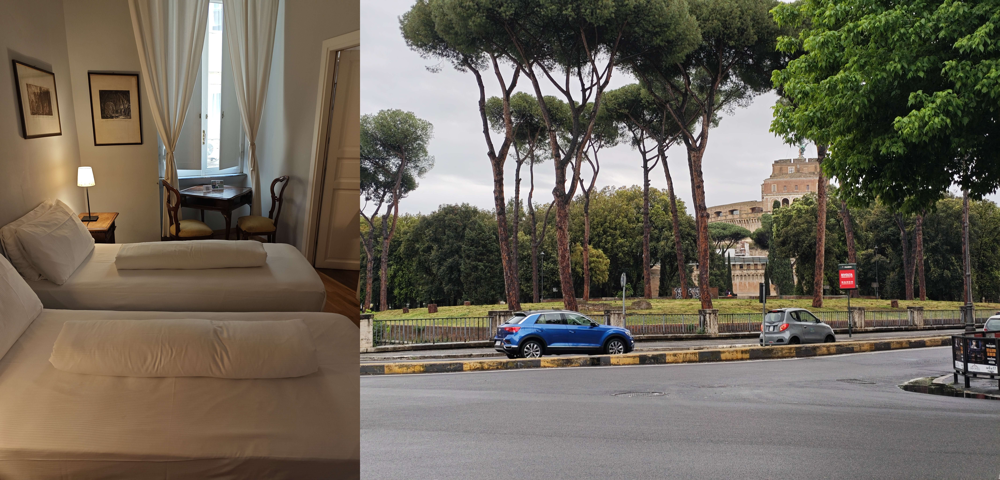

午饭选在了网红店 *Borghiciana Pastificio Artigianale*，这家店的外观颇具风格。抵达时距离营业时间 $11:45$ 还差一些，我们就在这家店所在的街上逛了逛。结论是 **罗马的物价显著低于佛罗伦萨**，因为那里 $3 \sim 5$€ 的冰箱贴和模型放到罗马来最低只需要 $1$€。 卡好时间回程，屋子里仅有的六个座位已经坐满了五席，再迟一步就要在门口排队了。考虑到来意大利还没吃过通心粉，我就点了的 $9.5$€ 番茄罗勒通心粉 （*Rigatoni with Tomato and Basil*），味道和预想中的差不多；励颖点了完全吃不厌的 $11$€ 肉酱千层面（*Lasagna with Meat Sauce*），口味不错；这家店的提拉米苏（*Tiramisu*）也是招牌，点了份 $6$€ 的原味尝尝，我觉得很赞而她觉得过甜。

午后第一站是西班牙阶梯（*Scalinata di Trinità dei Monti*），这是一座建于 1723-1725 年间的宏伟台阶，是全欧洲最长、最宽的室外阶梯，共有 135 阶。它以不规则的“蝴蝶翼”结构闻名，完美融合了巴洛克艺术与城市规划。**我们很幸运地赶上了西班牙阶梯一年一度的春日限定**：台阶上满目的杜鹃花（*Azalee*）并不是全年都有，而是罗马市政府自 1951 年起，在每年四五月份才会限时摆放的。2019 年起罗马法律禁止在台阶上坐下、进食和饮酒（为了保护历史古迹），但当日仍有很多游客坐在阶梯上拍照。台阶脚下是破船喷泉（*Fontana della Barcaccia*），由巴洛克大师贝尼尼的父亲彼得罗·贝尼尼（*Pietro Bernini*）设计，外形是一艘半淹没的台伯河漏水木船。

第二站是特雷维喷泉（*Fontana di Trevi*）。作为全球最著名的巴洛克式喷泉，特雷维喷泉于 1762 年完工，依附于波利宫（*Palazzo Poli*）的墙面而建，展现了气势磅礴的海神俄刻阿诺斯（*Oceano*）凯旋的场景。 这个喷泉流传着广为人知的“背投硬币”传说（右手持硬币从左肩向后投入水中），而现场有很多工作人员巡逻阻止游客投入硬币。喷泉正前方挤满了黑压压的游客，右侧有一条收费小道，花 $2$€ 即可步入限流的海神雕像和碧绿池水的正前方。

万神殿（*Pantheon*）是罗马保存最完整、最宏伟的古罗马帝国时期建筑，**距今已有近 2000 年的历史**。*Pantheon* 源自希腊语，意为“所有的神”。殿前有一串很显眼的文字 M·AGRIPPA·L·F·COS·TERTIUM·FECIT，这是古罗马式的拉丁语缩写，翻译成中文就是“路奇乌斯之子、三次执政官马尔库斯·阿格里帕建造了此建筑”。根据考古学家考证，万神殿最初确实是由屋大维的女婿阿格里帕于公元前 27 年修建，后毁于大火。现存的建筑是由热爱建筑的哈德良皇帝（*Imperatore Adriano*）于公元 125 年左右重建的，他原封不动地复制了第一代建筑的铭文。公元 609 年，拜占庭皇帝将万神殿赠送给教皇博尼法斯四世，教皇将其改建为圣母与诸殉道者教堂（*Santa Maria ad Martyres*）——这一身份让它免遭中世纪基督教徒对“异教建筑”的拆毁。迄今为止，万神殿依然是世界上最大的无钢筋混凝土穹顶。穹顶的正中央有一个直径达 9 米的圆形大洞，这是整个大厅唯一的采光来源。注意到下雨时雨水会从洞口落入神殿，所以地面上设计了 22 个隐蔽的排水孔，配合中央微凸、四周微凹的弧形大理石地面，让雨水能迅速排走，地面绝不积水。万神殿前廊一共有 16 根巨大的科林斯式（*Corinthian*）圆柱，按照 8-4-4 的纵深矩阵排列，每一根柱子都是整块完整的大理石/花岗岩雕刻而成的（中间没有任何拼接）。我们在家时早早地从《七大奇迹》里抽出了 $7$ 分蓝卡万神殿，没想到临行前忘记带上了，只能在现场举着冰激凌打卡。近年来为了保护古迹，万神殿需要购买 $5$€ 的门票才能进入。考虑到门口排队的游客非常多，我们选择放弃进入，错过了拉斐尔之墓。

咖啡之家·金杯（ *La Casa del Caffè Tazza d'Oro*）是万神殿边上的百年咖啡老店，标志是一个拿着咖啡豆播种的印第安少女。店内的咖啡菜单非常精细，借助大模型的帮助，我们从花花绿绿的条目中选择了 $4$€ 的咖啡冰沙配双倍鲜奶油（*Granita al Caffè con Doppia Panna*）。零售货架堆满的咖啡女王（*La Regina dei Caffè*）带有浓厚的巧克力和坚果香气，一下子吸引住了我们的鼻子。这是他们家最经典的招牌调配豆，正是店里 *Espresso* 所用的豆子，典型的南意风味，油脂丰富，醇厚度高。$6.5$€/$250g$ 性价比很高，正好买两包回去喂给家里的咖啡机。

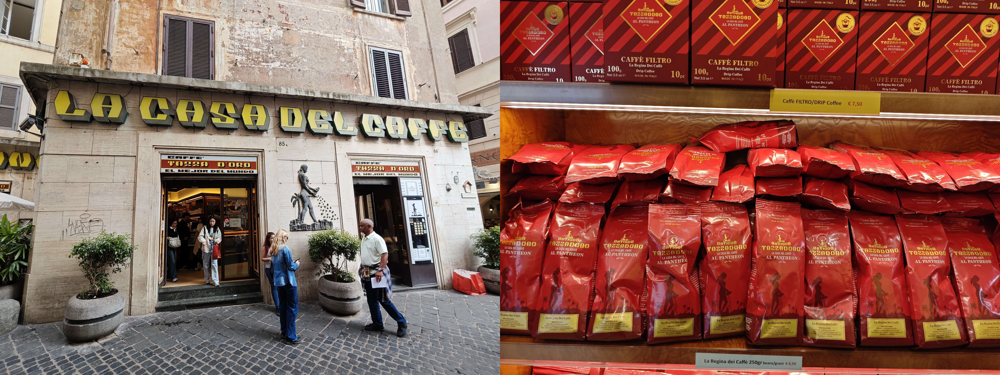

下一站是纳沃纳广场（*Piazza Navona*），这是罗马最美丽、最繁华的巴洛克式广场。高空俯瞰纳沃纳广场呈现出一个非常规整的长椭圆形（两端圆弧，长边笔直），因为它的前身是公元 1 世纪罗马帝国图密善皇帝修建的用来举办希腊式田径比赛的露天竞技场。古罗马人常说去竞技场比赛（*in agone*），这个词在漫长岁月中逐渐被念成现在的 *Navona*。广场中央最瞩目的焦点的就是四河喷泉，由巴洛克雕塑巨匠贝尼尼（*Lorenzo Bernini*）于 1651 年设计。喷泉中央托举着一座古埃及方尖碑，基座上雕刻着四尊神态各异的巨型男神，分别代表 17 世纪天主教势力所及的四大洲的四个主要河流：多瑙河-欧洲，尼罗河-非洲，恒河-亚洲，拉普拉塔河-美洲。值得玩味的是，正对喷泉的宏伟白色凹面立面和巨大穹顶的教堂，由贝尼尼一生之敌、天才建筑师波罗米尼（*Francesco Borromini*） 设计。纳沃纳广场可以算是全罗马对街头艺人管理最规范的舞台，开阔的场地和平整的大理石地面很适合发挥。当天我俩就看到有一位艺人在跳大环舞（*Cyr Wheel*）：依靠身体的重心倾斜、腰腹力量和核心控制，带动整个铁圈在广场光滑的大理石地面上进行疯狂的旋转、倾斜、倒立，做出类似于滑冰一样的飘逸弧线。

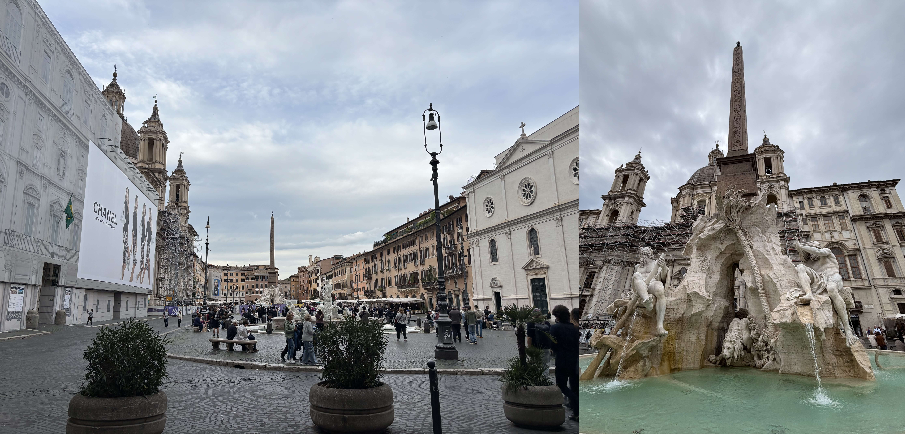

纳沃纳广场周边遇到一家名为 *Wings Chicken* 的炸鸡连锁店，可能是好久没吃这类食品了，我看到门口的花花绿绿的海报后就忍不住了，买了份 $8$€ 的 Value Box 套餐，包含三个鸡翅、两块原味鸡、一份薯条和一份百事可乐。

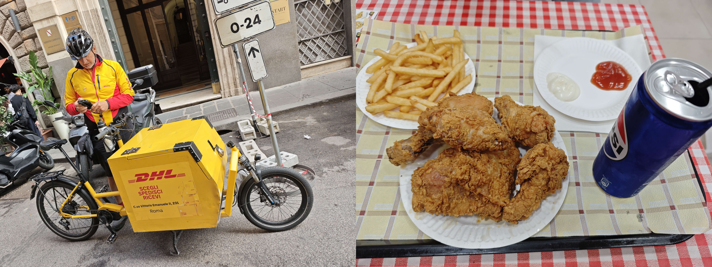

打卡纳沃纳广场边上 *Two Sizes*，它是全罗马非常著名的提拉米苏网红甜品店。他们家最招牌的提拉米苏是用透明塑料小圆杯装的，店名顾名思义只提供小杯（*Piccolo*）和大杯（*Grande*）两种尺寸。我俩共享了 $4$€ 的大杯开心果提拉米苏。励颖锐评这是她吃过的最好吃的提拉米苏，口味比冰激凌醇厚，完美地结合了开心果风味。

晚饭选在广场附近的罗马本土风味餐厅 *La Nuova Piazzetta Navona*。餐厅所处的巷子有点偏，我们东张西望地路过时，被路口坐着的一位大哥识破并带进去。这家店是少有的提供扫码看电子菜单的店，招牌是意面和披萨。经过一番研究，我发现 *Pasta* 是意面的统称，但细分起来有很多门道 ，比如 *Spaghetti*（实心细长面，是国内通常指代的意面），*Bucatini*（中间带孔的粗长面），*Linguine*（扁头细长面）等。餐单里高频出现罗马羊乳酪（*Pecorino Romano*）和风干猪脸颊肉（*Guanciale*）这两种原料，经搜索，这些原料构成了罗马四大特色意面：

+ *Cacio e Pepe*：食材只有面条、罗马羊乳酪和现磨黑胡椒，吃起来微咸、浓郁。
+ *Gricia*：上述意面加入风干猪脸颊肉 ，油脂的荤香和乳酪的咸香结合在一起。
  + *Carbonara*：上述意面加入蛋黄，酱汁由生蛋黄和大量的羊乳酪搅拌而成，口感绵密，带有奶香和蛋香。
  + *Amatriciana*：上述意面加入圣马扎诺番茄一起炖煮，口感酸甜解腻，带有微微的辣味。

作为游客完全分不清其中门道，就选了一手不容易踩雷的海鲜意面吧，$26$€ 的 *Chef's fantasy sea*。面条品种就选择最传统的、小时候在英文课本里学过的 *Spaghetti* 。披萨点了 $13.5$€ 的 *Devil*，但我俩早已被甜品撑满肚子，只能在吃完海鲜意面后把一整块披萨都带回去，作为后两天的早饭。说是魔鬼辛辣味，吃起来完全没感觉到。

伴随着夜色和凉风，我们从纳沃纳广场步行返回酒店。途中会穿过温贝托一世桥（*Ponte Umberto I*），这座桥的建造目的就是为了连接台伯河（*Tevere*）上左岸的罗马老城区与右岸当时正在蓬勃发展的普拉蒂区。桥对面宏伟的大楼是罗马最高法院（*Palazzo di Giustizia*），1911 年落成，采用了夸张的新文艺复兴与巴洛克混合风格。建筑顶部耸立着一座巨大的青铜四马战车雕塑。它的体量非常庞大，在周围古朴的建筑中显得极有压迫感，而且后续数次因为地基下沉而紧急加固，所以被当地人称为 *“Il Palazzaccio”*（意为“大坏楼”或“丑陋的巨厦”）。

我们沿着台伯河的林荫步道散步走向圣天使堡，一侧是滚滚西流的台伯河水，一侧是高耸的罗马式建筑。河岸边支着一些白色帐篷，有很多纪念品摊位。我俩看中了一批 $3$€/个、$10$€/四个的冰箱贴，好不容易和店主沟通好 $5$€ 买两个，摸摸口袋发现这两天把所有的现金用完了。本以为掏 VISA 卡只是麻烦了点，殊不知摊主闻卡色变，先是推说没法用卡支付，当我一再强调用光现金后，他表示如果用卡支付就不能额外优惠 $1$€。后来两天的行程里我陆续在各种小店遇到了这个问题，很后悔在意大利图方便用光了 $250$€ 现金。理由很容易推测，POS 机和信用卡肯定要问商家收手续费（第二天买了瓶 $1$€ 的水看到小票上写着 $0.18$€ 的手续费），而且走卡支付会自动算入税收。

圣天使堡（*Castel Sant'Angelo*）是罗马最具标志性的地点之一，其在历史变迁中承担了多种多样的功能。

+ 圣天使堡最初由罗马帝国哈德良皇帝在公元 135 年左右下令建造，作为他自己和家族的皇家陵墓。
+ 随着罗马帝国的衰落和外族入侵，这座坚固的建筑被罗马教皇改造为了军事堡垒。它厚重的城墙和易守难攻的地势，成为了教皇在危急时刻的保命符。
+ 文艺复兴时期，教皇在城堡内部修建了极尽奢华的寝宫和防御系统，曾作为关押重要政治犯的监狱。圣天使堡里面有一条名为博尔戈通道（*Passetto di Borgo*）的秘密高架城墙通道，将梵蒂冈的圣彼得大教堂与圣天使堡内部连为一体——当罗马遭遇围攻或叛乱，教皇就可以通过这条秘密通道从梵蒂冈逃到圣天使堡避难。
+ 如今，这里作为圣天使堡国家博物馆向公众开放，展示着古代的武器、教皇的精致壁画和罗马的城市变迁史。

圣天使堡得名源于一段传说。相传公元 590 年罗马爆发了极其严重的鼠疫，全城死伤惨重。当时的教皇格里高利一世组织了一场规模宏大的忏悔游行。当游行队伍路过哈德良陵墓时，教皇突然看到大天使长米迦勒（*Michael*）降临在城堡顶部，不久后瘟疫神奇地消散了。为了感谢天使的显圣，这座城堡从此被命名为“圣天使堡”。

沿着林荫道走到圣天使桥（*Ponte Sant'Angelo*）时，天色由淡蓝转为深蓝。这座桥是罗马帝国哈德良皇帝建造圣天使堡时一并建造的，即桥的主体结构和拱门已经默默伫立了近 2000 年。桥上最瞩目的风景是两侧伫立的 10 尊大理石天使雕像，这是 1669 年教皇克莱门特九世专门邀请了巴洛克大师贝尼尼雕刻的。天使手上拿的都是耶稣受难时的刑具和圣物。继续向前行进，天色倏地从深蓝转为了深黑。一群人聚集在圣天使堡前高处的草坪上，正在排队朝着远处的圣彼得大教堂拍照。我俩研究了半天没找到绕上去的路，一问才知道要强行跳上一米多高的石阶——全程居然是用中文交流的，想必我们误打误撞碰上了被小红书机位推荐而来的国人群体。这个角度确实非常神奇，穿过一棵树的视线，可以在圣天使堡外墙的圣凯瑟琳雕像的掩映下看到远处的圣彼得大教堂。

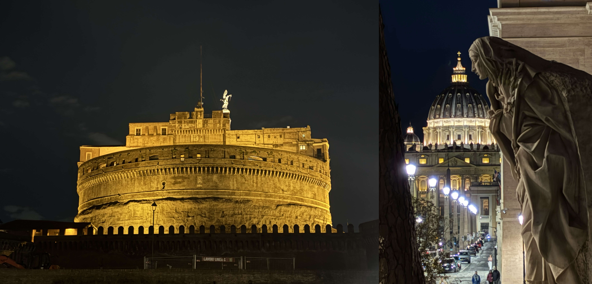

## 罗马第二天

早前我通过闲鱼代抢了含金量极高的 $9:30$ 罗马斗兽场阁楼门票。当天我预留了充足的时间出门，因为交通的不确定性和前一天的怠惰：理论上最佳交通方式是 $87$ 路公交车直达，再不济就是步行一段路去 *Lepanto* 站坐地铁，A 线转 B 线前往 *Colosseo* 站。罗马地铁/公交单程票费用 $1.5$€，能在 $100$ 分钟内乘坐一次地铁和无限次公交；最推荐的方式是 Tap&Go，即通过扫 Apple Pay/Visa/MasterCard 来自动计时并扣费。糟糕的是我只带了一张卡，没法灵活地为两个人服务（事后发现可以 Apple Pay 绑定这张卡 + 单独刷这张卡达成两人独立计时）；另一种方式就是在街头的报刊亭购买 $1.5$€ 的纸质带芯单程票，然而前一天我忘记多储备了，已知地铁站一定有售但是公交站边上不一定有。当天早上出酒店后简单绕了一圈，没有任何报刊亭的迹象，我决定放弃公交、降级至地铁出行的方案。快走到 *Lepanto* 站时找到了零售店，我干脆多买了一组纸质票以备不时之需，结果最后没用出去= =。

罗马斗兽场（*Colosseo*），正式名称为弗拉维圆形剧场（*Anfiteatro Flavio*），是古罗马帝国时期最宏伟、最著名的建筑标志，也是世界新七大奇迹之一。斗兽场由罗马帝国维斯帕先（*Vespasian*）皇帝于公元 72 年开始建造，在其子提图斯（*Titus*）统治时期的公元 80 年完工，随后由图密善（*Domitian*）皇帝进行了进一步的改造。由于这三位皇帝均属于弗拉维王朝，因此得名“弗拉维圆形剧场”。很容易发现 **斗兽场外墙呈现出一种不对称的状态**：一侧保留了完整的高耸外圈，而另一侧则缺失了最外层，露出了里面的拱门结构。最直接的原因是千百年来罗马遭遇的地震，例如 1349 年的大地震导致南侧外墙大规模坍塌，掉落的石块散落了一地。结果在中世纪和文艺复兴时期，大量大理石被运走用来建造罗马的其他著名建筑，包括圣彼得大教堂、威尼斯宫以及许多横跨台伯河的桥梁。**斗兽场外墙石头上布满了密密麻麻的孔洞**，这些孔洞原本嵌有铁制的连接栓，但人们在金属匮乏的中世纪会为了取铁熔炼强行凿开这些孔洞，这在一定程度上削弱了墙体的稳定性，使其在地震面前更加脆弱。

相比于普通的入场票，阁楼票发放的数量非常稀少。工作人员亲自把我们护送进入一台向上的电梯，体验了一把人上人的感觉。比较反直觉的是，电梯下来后是一条半圆形的隧道，这是斗兽场第四层实心墙体的内部通道。据说当时的斗兽场设计了一套复杂的分流系统，用于防止底层的达官显贵（元老、骑士）和顶层的平民在进出场时发生混杂与冲撞，平民顺着陡峭的独立楼梯爬上顶层后，必须通过这条环形隧道进行横向移动来寻找自己的座位。在隧道斑驳的墙体上，至今还保留着古代的一些白灰泥痕迹，隐约可见当年罗马工匠或观众留下的涂鸦和刻字。

我在和 Gemini 交互时尝试点开了 Live 语音模式，**跳出了黑色的语音输入界面，甚至支持拍摄视频**。正好斗兽场视野开阔信号好，我便用得一发不可收拾，全程“哪里不会问哪里”就行。

阁楼的风光非常好，天色很蓝，很多海鸥盘旋在半空或歇息在废墟上。据说古罗马时期顶层的外墙上插有 $240$ 根木杆，罗马海军会在这里操纵巨大的帆布遮阳棚，根据太阳的方位调整阴影。向内可俯瞰庞大的竞技场（*Arena*）遗址。*Arena* 在拉丁语里是沙子的意思，其用于吸收角斗士在比武时留下的鲜血。椭圆形的一侧留有一块小的平面区域，这其实是现代修复上去的竞技场地面；而大部分裸露出来的错综复杂的墙壁结构是当时的竞技场“后台”，被称为地下迷宫（*Hypogeum*），是用来关押猛兽、准备道具和角斗士休息的地方，里面藏着几十部人力升降梯。最令我震惊的是这里 **甚至可以模拟海战**，把地下灌满水并使用特制的小船即可。

阁楼向外可以眺望君士坦丁凯旋门（*Arco di Costantino*）和古罗马广场废墟。前者看起来保存得不错，其实是公元 315 年古罗马时期的建筑，距今已经一千七百年了。门前的四个人物雕像是更早期（罗马皇帝图拉真时期）的作品，君士坦丁把这些装饰浮雕拼接到凯旋门上，表明自己和先王一样拥有至高无上的荣耀和合法性。主拱门就是专门给获胜的军队举行凯旋仪式的，旁边两个小一点的拱门则是给普通百姓日常通行的。

从顶层下楼，游客就多了起来。外圈的走廊比较狭窄，可以近距离欣赏看台和地下迷宫。注意每一层的这一圈结构是支撑看台的拱门和墙体，当时的大理石座位已经看不到了。内部的走廊是个博物馆，介绍了斗兽场的历史背景和相关建筑。斗兽场从下到上采用叠柱式风格，即第一层使用最朴素、最粗壮的多立克柱式（*Doric*），第二层使用带有涡卷装饰的爱奥尼柱式（*Ionic*） ，再往上使用带有毛茛叶装饰的华丽的科林斯式（*Corinthian Order*）。

我们在斗兽场纪念品店购入了几张明信片。斗兽场周边一路都是各种古典的建筑，建筑层次横跨两千年，从古罗马时代、到中世纪的文艺复兴、再到 19 世纪的现代纪念碑，完美展现了罗马"永恒之城"的历史积淀。

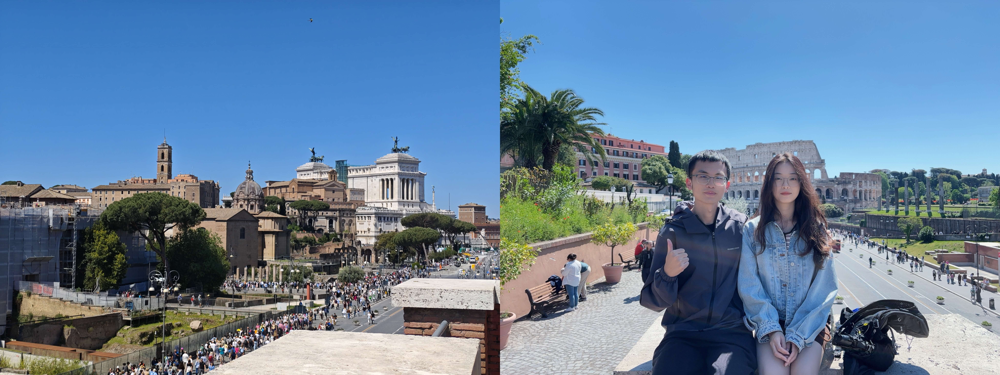

有了前一晚在小摊的经验，我们的主线任务是用信用卡换一些小钱出来。绿色的 ATM 机器随处可见，找了两台试了试，手续费高达 $14.95\%$，就作罢了。后来在街边小店买 $1$€ 纯净水的时候，只能求着店主用 VISA 卡支付了。

午饭我们选在了斗兽场周边的 *Iari the vino*，招牌是开心果意大利面。我们选购了 $20$€ 的虾仁番茄开心果酱意大利宽面（*FETTUCCINE " GAMBERI, POMODORINI E PESTO DI PISTACCHIO*）和 $6.5$€ 的炸薯条（*PATATE FRITTE*）。这道意大利面让我对宽面的刻板印象大为改观，趁着励颖因为天热食欲低进食慢，我风卷残云地全吃光了。薯条默认没带番茄酱，我正想找店员索要两包，脑海里始终回忆不出来番茄酱的英文，查了查才知是 *ketchup*。

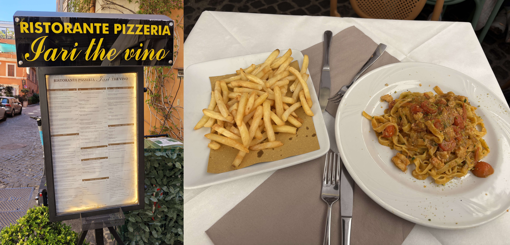

天气炎热，我们在意大利的冰激凌几乎没断过。一般都是花 $4 \pm 0.5$€ 买两个球（选两个口味），在 *Cone*（甜筒）和 *Cup*（盒装）两种配置里偏爱前者。口味集中在椰子、酸奶、开心果、莓果等。

接下来我们排队凭票进入古罗马广场（*Foro Romano*）遗址，我照例用 Gemini Live 模式，通过拍摄视频和语音提问获取讲解。古罗马广场最初是一片沼泽地，公元前 7 世纪末期进行了改造；罗马共和国建立后广场迎来了大发展，元老院（*Curia*）、演讲台（*Rostra*）和各类巴西利卡（*Basilica*，用于法庭和会议大厅）环绕四周；进入帝国时期，奥古斯都等皇帝对广场进行了大规模的大理石翻修，古罗马广场依然是罗马的精神象征和举行重大仪式的核心；公元 4 世纪后，随着罗马帝国衰落和基督教成为国教，这片曾经的帝国中心长满杂草沦为放牧的地方。

古罗马广场发生过的代表性历史事件包括：

+ 公元前 44 年凯撒在元老院遇刺，他的副手安东尼在广场的演讲台上发表了极具煽动性的演说。广场上的民众被彻底激怒，发生暴动。这一事件直接引爆了罗马的内战，共和国名存实亡。
+ 举行古罗马最高荣誉的庆典“凯旋式”（*Triumph*）：得胜的将军身穿紫袍，率领浩浩荡荡的军队沿着神圣大道穿过古罗马广场，押解着敌方首领和战俘，展示掠夺来的金银财宝，接受两旁民众的欢呼。
+ 时任执政官的西塞罗（*Cicerone*）在广场的演讲台上公开指控贵族喀提林企图通过武装暴动推翻罗马共和国，成功说服了元老院粉碎了那场阴谋，被元老院授予国父称号。意大利语把 *cicerone* 引申为 “导游” 意思（特别是博物馆或古迹的专业讲解员），正源于西塞罗这位古罗马最伟大的演说家和博学者，用于指代那些知识渊博、能像西塞罗一样滔滔不绝为你讲解的人。可惜西塞罗后来被政敌杀害，头和手被钉在演讲台上示众。

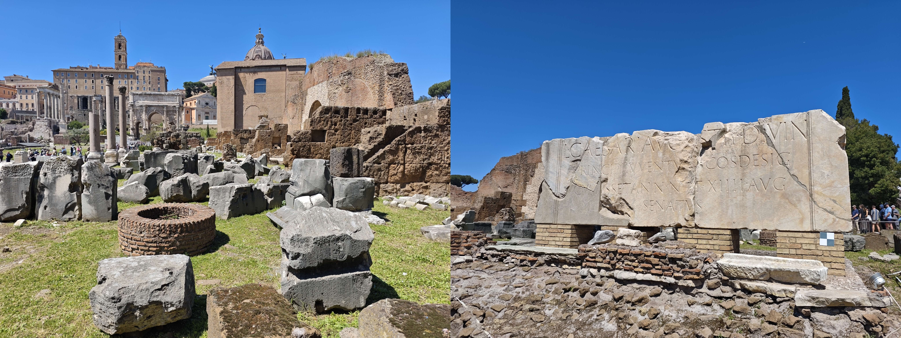

帕拉蒂尼山（*Palatino*）和古罗马广场遗址相通。据说罗马的创始人罗慕路就是在这里建立了最初的定居点，后来 这里成了罗马权贵和皇帝的居住区。英文里的宫殿 *Palace* 一词就是从这演化而来。

从帕拉蒂尼山离开后，我们步行前往真理之口（*Bocca della Verità*）。路上我们走得口干舌燥，不太敢接路边的直饮水喝，愣是一家便利店或超市都没有找到；好不容易遇见一个流动摊贩，动辄 $5$€ 一瓶可乐，欺人太甚。真理之口位于希腊圣母堂（*Santa Maria in Cosmedin*）的门廊内，门口需要排十分钟左右的队。这是一块巨大的大理石圆盘，上面雕刻着一张留着胡须的男性面孔，其确切用途在历史上众说纷纭。民间传说称，如果你将手伸入它的口中并发誓说谎，真理之口就会合拢并咬掉说谎者的手。这一典故在 1953 年的经典电影《罗马假日》中得到了全球性的传播，这也使其成为罗马最著名的打卡点之一。真理之口围栏前有个工作人员，他很娴熟地帮游客们拍照。

走到威尼斯广场（*Piazza Venezia*）后发现尘土漫天正在施工，原来这里在进行罗马地铁 C 线的威尼斯站的建设。为了配合这一大型交通枢纽的建设，周边的威尼斯宫（*Palazzo Venezia*）等历史建筑也同时在进行修复和结构加固工作。百无聊赖之际，我们干脆直接走向纳沃纳广场附近的晚饭地点 *Mariuccia*。路上看到两位正在骑着马巡逻的警官（系意大利宪兵队下属的骑兵团），有一种很神奇的历史割裂感，我俩激烈讨论着这应该行走在机动车道还是非机动车道。经过一个巷子时看到里面隐藏了一个家乐福，这下终于能敞开怀买买买了：欧洲的水果种类少且价格普遍偏高，只能适当地买一些李子和橘子；遇到了纯净水特价，$2L$ 的水只需要 $0.37$€，居然比国内还便宜。

*Mariuccia* 的招牌是炸可乐饼，这种小吃以土豆泥为底，外皮炸至酥脆，内部填入各种丰富的配料。根据推荐，我们选购了 $10$€ 的火腿开心果碎土豆泥（*PISTACCHIOSO: Mortadella, pesto di pistacchio, granella di pistacchio*）和 $15$€ 的柠檬八爪鱼土豆泥（*POLPO: Polpo, crema verde al prezzemolo, limone*）。励颖当日行走疲倦，就餐时遇到了头疼的情况，最后我们打包回酒店吃。八爪鱼土豆泥让我印象深刻，料很足。

## 罗马第三天

由于没有提前订票，我俩 $8:30$ 就步行抵达梵蒂冈城（*Vatican City*）的圣彼得大教堂（*Basilica di San Pietro*）。圣彼得是耶稣的弟子，也是罗马的第一任教皇。耶稣赐给他两把可以打开天堂之门的钥匙，所以圣彼得在艺术形象里通常拿着两把钥匙。广场正中央竖着一根方尖碑，据说它曾见证了圣彼得的死刑（圣彼得当时是头下脚上钉在十字架上，因为他觉得自己不配和耶稣以同样的姿势殉道）。广场两侧分别立着圣彼得和圣保罗的雕像，而抬头可以看到教堂和长廊的顶上站满了雕像。正面屋顶上竖立着耶稣和十二尊雕像，分别是 $10/12$ 位门徒（除圣彼得和犹大）、施洗者圣约翰和圣马提亚。圣彼得广场的空间非常大，前面排满了空着的座椅，看起来非常宏伟。

我们的运气很好，在广场里排了 $10$ 分钟左右就进去了。

圣彼得大教堂本身是免费的，登上穹顶需要额外付费，攻略里一般都建议登顶。进入教堂后我俩径直去排队购票，总共排了 $25$ 分钟，正好刷下顾爷 [《圣彼得大教堂全攻略》](https://www.bilibili.com/video/BV1s6SxYLEys)  很棒的讲解。楼梯上顶 $10$€/人，电梯上顶 $15$€/人。由于电梯上到中间的平台后仍需步行登顶，且电梯很小需要排队，我们就选择了朴素的楼梯登顶。一开始的螺旋阶梯相对宽敞，不过连续转一段时间容易出现眩晕感，需要停下来歇一歇。中间有一段路环绕在大教堂内部的高处，用铁丝网划出了一段狭窄的通道：这里向外可以俯瞰内饰、仰望穹顶，向内可以欣赏整个环形墙壁上的马赛克画。再往上有一个很大的平台，这里是电梯上行的终点站，有咖啡店、纪念品店和卫生间等设施。再往上楼梯就变得狭窄甚至倾斜，非常不适合有幽闭恐惧症的游客前来，我总是很担心上方的游客摔落导致一连串的踩踏。

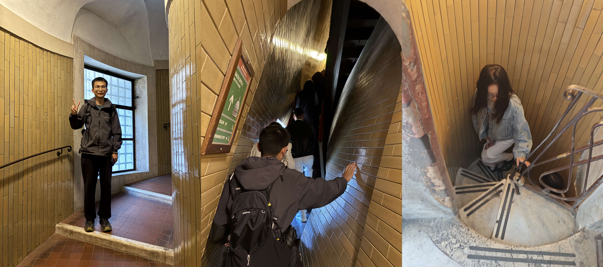

平台上可以窥得大教堂顶端的各种建筑。如果这里是中国典型景点，咖啡店和纪念品店肯定会狠狠地宰一波游客；梵蒂冈恰恰相反，一杯摩卡奇诺（*Mocaccino*）只收 $1.6$€，甚至比大街上卖得还便宜。这里的卫生间也令我有些震惊，男卫四个隔间里有两个马桶间和两个蹲坑间——这是我第一次在欧洲见到蹲坑的地方。

**穹顶之上的景色无需多言**。这里设有的铁丝网间距很宽，只需穿过相邻的铁丝网就能拍到梵蒂冈和罗马的景致。从正面俯视圣彼得大教堂，广场看着很像钥匙孔或十字架，不禁让人感叹广场设计者贝尼尼高超的技术。

圣彼得大教堂总共有五扇门，通常只会开两扇门。最右边的门叫做圣门（*Porta Santa*），每隔 25 年开启一次，打开的那一年会被称为禧年（*Jubilee*），最近的两次就是 2000 年和 2025 年。据说穿过这扇门后所有犯过的罪孽都会被赦免，出自《新约·约翰福音》“我就是门，凡进入我者会获得救赎”。在顾爷的引导下，我们在进门后特意去找地上猪肝色的斑岩（*Porfido*）。斑岩由于其坚硬的特性常用于雕塑、立柱和铺路，而这种紫红色的斑岩稀有到被罗马皇室垄断，用来象征财富和权力。根据教会的解释，将斑岩踩在脚下，象征上帝眼中众生平等。教堂地板下方是著名的梵蒂冈墓库（*Vatican Grottoes*），行走时总会看到各种带有标记的石板和石碑。

圣彼得大教堂高耸、庄严、肃穆。我俩跟随着拥挤的队伍，依次打卡了三件镇馆之宝：

+ 贝尼尼的《青铜华盖》（*Baldacchino di San Pietro*）。这是巴洛克大师贝尼尼的杰作，位于大教堂中央穹顶的正下方、圣彼得坟墓的正上方。这件华盖由四根巨大的扭曲青铜柱（这被称为所罗门石柱）支撑，柱身上装饰着金色的橄榄枝和蜜蜂（这是乌尔巴诺八世家族的族徽）。柱脚处一共镶了 8 个纹章，每个纹章上都刻着一张脸，前七张是不同的表情而最后一张是婴儿脸——有人就猜测这是在刻画分娩的过程。
+ 贝尼尼的《圣彼得宝座》（*Cathedra Petri*）。视线穿过青铜华盖向教堂最深处的祭坛（后殿）望去就是这件宝贝。起因是有一把古老的圣彼得的木椅子不易保存，教皇便请贝尼尼做一个套子。贝尼尼为了给这个椅套塑造张力，干脆在背后做了一整套“黄金炸弹”。一把巨大的青铜镀金宝座被戏剧性地“悬浮”在半空中，下方由四位天主教圣师的青铜雕像用衣带轻轻牵引。只可惜整个祭坛的空间都被围住了，这个作品只能遥望。
+ 米开朗基罗的《圣殇》（*Pietà*）。这是米开朗基罗 23 岁时的成名作，表现了圣母玛利亚怀抱着被钉死在十字架上的基督耶稣，其大理石雕刻出的衣褶与人体质感达到了极高的写实艺术水准。据说米开朗基罗听说有人把这件雕塑误认成了另一个艺术家的作品，一气之下就在圣母胸前的衣带上刻上了拉丁文“*MICHAEL. ANGELUS. BONAROTUS. FLORENT. FACIEBAT*”，即“佛罗伦萨人米开朗基罗·博纳罗蒂所作”，这也成为了他唯一一件有亲笔签名的作品。这个细节很难看清楚，这一切都归咎于 1972 年有人爬到雕像上把圣母玛利亚的鼻子和手臂都砸断了，导致现在只能隔着玻璃远眺。注意到耶稣死的时候是 33 岁，而这里的圣母玛利亚看着非常年轻，米开朗基罗对此的解释是：保持圣洁的女性在肉体与精神上都不会像凡人那样迅速衰老。

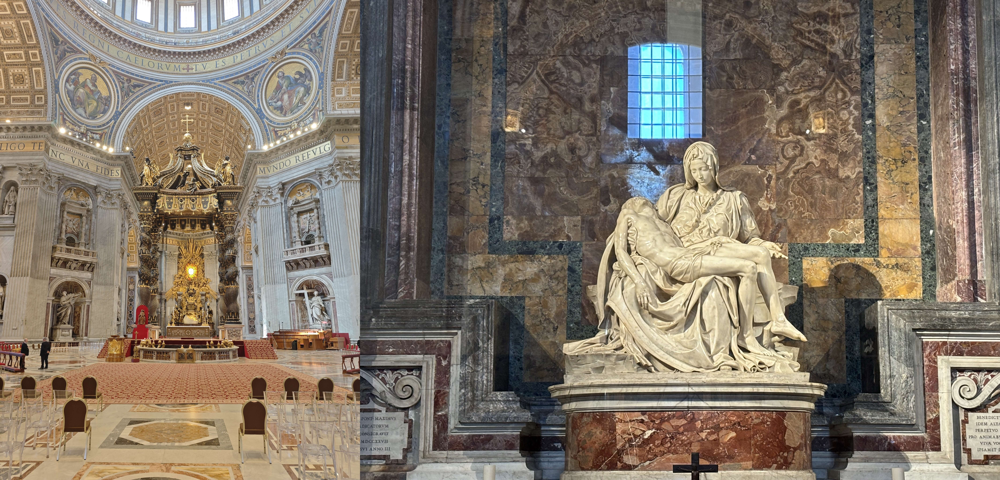

圣彼得大教堂里的杰作远不止顾爷提到的那些，我们信步绕行大殿，兴趣所致就借助 Gemini 的讲解来略窥一二：

+ 教皇亚历山大七世墓碑，贝尼尼在 80 岁高龄时的巅峰之作。中间有一块巨大的用红玛瑙大理石雕刻而成的虚拟帷幕，帷幕里的镀金青铜骷髅象征着死神，其手中举着的沙漏昭示着时间的流逝与死亡的不可避免。上方的教宗亚历山大七世没有戴三重冕，而是摘下帽子、双膝下跪在祈祷，展现了面对死亡时的谦卑与虔诚。
+ 教皇庇护八世墓碑。最高处坐着的是耶稣，左右两侧分别是圣彼得和圣保罗，下方中心跪着的就是教皇庇护八世，姿态非常谦卑。这扇门是大教堂圣器室和宝库博物馆的入口，这种穿行时仰望的视角才是作者的期望。
+ 圣塞巴斯蒂安祭坛。下方亮着光的玻璃龛里安放着教皇圣庇护十世的遗体，脸部和手部覆盖着银色的面具——这是圣彼得大教堂内少数几位可以被信徒直接瞻仰遗体的教皇。祭坛上方的巨大画作描绘的是圣塞巴斯蒂安殉教的场景，看起来像是一幅色彩丰富的油画，但实际上是用数以万计的马赛克微小石块拼贴而成。

值得注意的是，圣彼得大教堂里有三位女性拥有独立的纪念碑：

+ 伯爵夫人玛蒂尔达纪念碑。玛蒂尔达是 11 世纪欧洲最有权势的女性之一，去世后将所有领地遗赠给了教会。这座纪念碑出自贝尼尼之手，玛蒂尔达手持象征权力的权杖、三重冕和钥匙，这象征着她对教权的守护。底部的浮雕描绘了发生在她城堡的卡诺莎之行：当时神圣罗马帝国皇帝亨利四世为了请求教皇格里高利七世宽恕，在雪地里跪了三天三夜；玛蒂尔达作为教皇最坚定的盟友和保护者，促成了这次和解。
+ 波兰公主玛丽亚·克莱门蒂娜纪念碑。她是波兰国王的孙女，不顾家人的反对逃脱来到罗马嫁给了英国詹姆斯党王位宣称者，成为名义上的英国王后。纪念碑中心是一个巨大的圆形肖像，那是用马赛克拼接而成的她本人的画像。最精彩的是那块石刻的帷幕，看起来像真布一样轻盈柔软，甚至还有流苏装饰。
+ 瑞典女王克里斯蒂娜纪念碑。她是瑞典瓦萨王朝的唯一合法继承人，但她为了信仰天主教，毅然决定放弃瑞典王位。她的改宗在当时的天主教世界引起了巨大的轰动，教廷将她视为反宗教改革运动的重大胜利。

在欣赏各类雕塑和纪念碑时，我萌生了一个疑问：为什么罗马教皇会使用“几世几世”的世系名号，但这些数字往往都不大？这意味着存在许多不同的名号，他们背后又是如何传承的？查阅资料可知，教皇没有世袭制和王朝传承。当一位新教皇被选举出来时，他会完全放弃自己原本的本名，为自己新挑选一个“教皇名号”。历史上 266 任教皇中一共出现了 80 多个不同的名号，重复最高的是若望（二十三世）、格里高利（十六世）和本笃（十六世）。

离开圣彼得大教堂已是 $13:00$，而我预约的是 $13:45$ 的梵蒂冈博物馆（*Musei Vaticani*）。没时间享受午饭了，优先根据 Google Map 的指示前往下一站。*Musei* 在意大利语里是复数的形式，更准确的译名是梵蒂冈博物馆群：这意味着其并不是单体的一座大建筑，而是由历代教皇在不同时期收集、扩建的多个独立的博物馆、美术馆和宫殿（比如著名的西斯廷教堂、拉斐尔画室等） 。从地图上看，梵蒂冈城主要只包含了教堂和博物馆，没有什么多余的建筑——所以我们行进路线的另一侧其实归属罗马管辖，临街开满了接地气的纪念品店。我俩找了一家面包店，励颖选购了一个 $3$€ 的开心果可颂（她锐评没有法国的可颂正宗），我选购了一个 $6$€ 的奶油面包。经过转角后，左手边就是笔直、高耸、冷峻且色彩单调的梵蒂冈城墙，中世纪时期为了保护教皇免受外敌的侵略，现如今成为了博物馆的外壳。一路上排满了无预约现场购票的游客，我不禁暗自庆幸此前加价抢到了预约票。

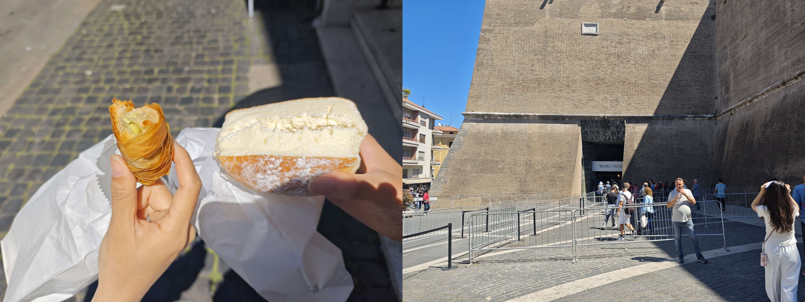

我们照例跟随顾爷的 [《梵蒂冈博物馆全攻略》](https://www.bilibili.com/video/BV1qayAY9EHS) 打卡。进门后有一块很大的草坪，中间有一个瞩目的大铁球，据说可以按着转但现在已经被围起来了。与之遥相呼应的建筑前面的一个巨大的青铜松果，它是古罗马时期（约为公元 1 世纪或 2 世纪）的文物。 松果两侧的青铜孔雀是复制品，原作由于非常珍贵被移入博物馆室内。为什么教皇会把古罗马时期的松果放置于此呢？松果内部孕育着无数种子，在古代文化中常被视为生命力、丰饶、繁衍和永生的象征；此外，其形状又像人类大脑中的松果体，隐喻人类与神圣世界沟通的“第三只眼”或精神觉醒的源泉。

走上室内的阶梯后，首先映入眼帘的是古埃及文物（其中就有木乃伊）。我们遵照顾爷的嘱咐快速打卡穿过，接下来进入一个放置了很多雕塑的天井。最有名的雕塑是《拉奥孔与儿子们》，古希腊先知拉奥孔因为泄露特洛伊木马被神降下了三条巨蛇，这座雕塑雕的就是他们父子被三条蛇缠住的瞬间。关于这个雕塑还有一则趣闻：当年挖出来的时候拉奥孔的右手是断的，教皇计划给他安装个“假肢”；拉斐尔认为他的右手臂应该是伸直的，而米开朗基罗则认为是弯的，教皇采纳了前者的意见；几百年以后，这个雕塑的原配右手被找到了，印证了米开朗基罗的说法。对此有一个都市传说：这个雕塑实为米开朗基罗自己雕塑并埋在地里的，所以他才这么确信右手臂的情况。

缪斯馆的核心是一座无头无四肢的雕塑《贝尔维德尔躯干》（*Belvedere Torso*）。这尊雕像大约创作于公元前 1 世纪，是一尊古希腊原作或古罗马时期的精良复制品。下方基座的石头上有一行古希腊铭文，大意为“雅典人阿波罗尼奥斯，内斯托尔之子所作”。米开朗基罗称自己是这座雕塑的学生，拒绝教皇出资修补这座躯干的四肢。

圆形大厅（*Sala Rotonda*）半球形的穹顶完美致敬了罗马万神殿，光线从顶部的天窗（*Oculus*）倾泻而下，照亮了大厅中央由整块红斑岩雕琢而成的巨大盆体——相传这曾是暴君尼禄皇帝（*Nero*）金宫里的私人浴缸。浴缸下方的地面铺着保存完好的古罗马马赛克拼贴画，四周红墙壁龛内则伫立着一圈巨型神祇雕像。

顺着通道往前走，能看到各种教皇和皇帝署名的门，我选取的照片是 “庇护六世之门”，门楣上用拉丁文铜字刻着 MVSEVM • PIVM。大门两侧的两尊红色花岗岩埃及男形柱（*Telamones*）极为引人注目，它们并非来自埃及，而是出土于酷爱埃及美学的哈德良皇帝的私人行宫。穿过石门，旁边是一间相对独立的双轮战车厅，大厅中央停放着一尊双马战车大理石雕像。这尊雕像其实是一件“拼凑”的作品：战车车身是古罗马文物，中世纪时曾被搬到教堂里当作主教的正式座椅，直到18世纪才由雕塑家为其重新雕刻补齐了缺失的双马和车轮。接下是烛台廊，以巨大大理石烛台（*Candelabra*）得名，里面整齐地排列着大量古罗马雕塑。沿途会经过几扇巨大的半圆形高窗，透过玻璃窗向外远眺，罗马城密密麻麻的红砖瓦顶与远处的群山尽收眼底，缓解了游览过程中的审美疲劳。

接下来我们领略了梵蒂冈博物馆著名的两大长廊：

+ 挂毯廊（*Galleria delle Arazzi*），这是一条相对宽敞、光线柔和的长廊，两侧挂满了巨大的手工编织挂毯。右侧主要陈列着 17 世纪罗马本地制造的挂毯，左侧墙壁上则展示着更为珍贵的 16 世纪比利时布鲁塞尔挂毯，它们是由文艺复兴大师拉斐尔的徒弟们根据素描底稿设计绘制的。耶稣基督的复活是其著名的场景，这幅巨大的挂毯运用了极高超的透视技巧，画中耶稣脚下的墓穴盖板采用了移动透视设计。当游客在长廊中缓缓走过时，无论你站在哪个角度，都会发现墓穴盖板的朝向和耶稣的目光似乎都在随着你的移动而转动。
+ 地图廊（*Galleria delle Carte Geografiche*）。这条长廊长达 120 米，两侧的墙壁上绘制了 40 幅巨大的地图画。整个长廊的地图以亚平宁山脉为界，左侧墙壁描绘的是面向第勒尼安海的意大利西岸地区，右侧则描绘了面向亚得里亚海的东岸地区。在这些巨大的墙壁地图中，最令人惊叹的是其超前的测绘精度。其中一幅全景意大利地图更是将整个靴子形半岛的地貌和周边海域的船只刻画得栩栩如生。在当时还没有卫星和现代测绘仪器的年代，地理学家们完全依靠数学计算、罗盘步行和视线交会法，就在几年的时间里拼凑出了如此精准的全国鸟瞰图。地图廊不仅墙壁宏大，头顶上那条金碧辉煌的筒形拱顶天顶画更是引人注目。天顶上密密麻麻地绘制着风格主义时期的湿壁画，展现了与下方地图区域相对应的圣人神迹和宗教故事。

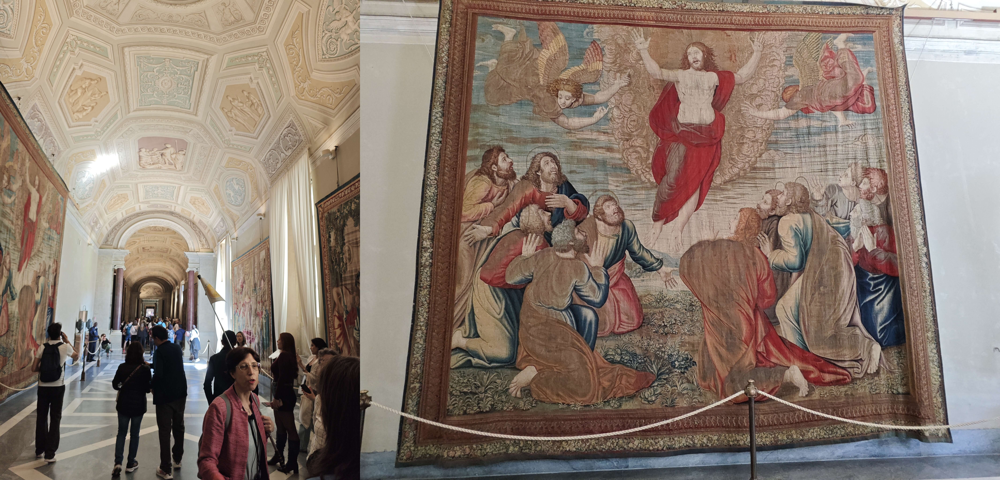

在穿过漫长的长廊区域后，观众便会正式步入举世闻名的“拉斐尔画室”。这四个房间最初是教皇儒略二世（*Julius II*）的私人寓所，当时年仅 25 岁的拉斐尔（*Raphael*）奉命带着一个团队主持这项庞大的壁画工程。拉斐尔主要负责整体构图、核心底稿的设计以及最重要人物的亲手绘制，而团队的学徒们则负责填充背景和次要部分。这四个画室包括君士坦丁厅（面积最大，主要用于官方宴会，拉斐尔早逝后主要由团队接手）、埃利奥多罗厅（强调上帝对教会的秘密庇护，政治隐喻极强，基本由拉斐尔本人亲手设计）、签字厅（整个画室最核心、最神圣的房间，曾是教皇的私人书房，拉斐尔在这里达到了他艺术生涯的最高峰）、博尔戈火灾厅（曾被用作教皇的餐厅）。

+ **雅典学院**（*Scuola di Atene*）：这幅画位于签字厅，代表着理性的真理与哲学的最高成就，是拉斐尔一生中最无可争议的巅峰巨作。**这幅画于我来说也有一种特殊寓意，因为它是华为心声社区（内部论坛）的开屏图画**。拉斐尔在巨大的半圆形透视拱门大厅内，突破时空限制，将古希腊不同时期的五十多位伟大哲学家、科学家完美地汇聚在了一起。画面正中央并肩前行的是两位核心灵魂人物：左侧手指向天的是柏拉图（*Platone*），代表唯心主义和形式论（脸是以达芬奇为原型绘制的）；右侧手掌向地的是他的学生亚里士多德（*Aristotele*），代表唯物主义和经验科学。整幅画构图对称、井然有序。在画面的最右侧角落，拉斐尔也把自己和同僚们画了进去（戴黑帽看镜头者），巧妙地让自己与人类智慧的巨匠们永远并肩同行。这里有个历史趣闻：台阶下左侧正抱头在石板上孤僻苦思的是哲学家赫拉克利特（*Eraclito*）。这幅画在动工初期其实并没有这个人，当时拉斐尔偷偷去隔壁西斯廷教堂看了一眼米开朗基罗刚揭幕的部分天顶画，被其雄浑的肌肉线条和艺术张力深深震撼，临时决定将他的形象和那种标志性的狂野人体风格画成了这位苦思冥想的哲学家，以此向其致敬。
+ **圣礼的辩论**（*Disputa del Sacramento*） ：这幅画正好绘制在《雅典学院》的正对面，代表着信仰的真理。画面采用了宏大的多层纵向结构：上层是天国，圣父、复活的耶稣基督以及一众圣徒和先知在金色的神圣光辉中安坐；下层是人间，世俗的神学家、主教、教皇和信徒们正围绕着祭坛上发光的“圣体”展开探讨与辩论。这幅画与《雅典学院》遥相呼应，构成了人类精神中理性与神学两座高峰的对望。
+ 其余壁画包括：《米尔维安大桥战役》展现了君士坦丁大帝大败篡位者的宏大战争惨烈瞬间；《圣利奥会见阿提拉》展现了教皇在神迹下吓退阿提拉的对峙；《博尔戈的火灾》描绘了教皇祈祷扑灭罗马大火的混乱火场；《奥斯蒂亚之战 》 则记录了基督教联军在港口大败萨拉森海盗并押送战俘的历史战役。

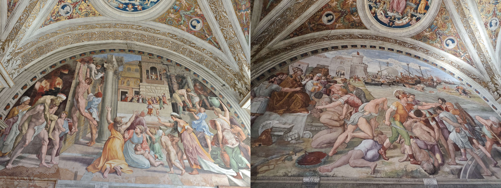

拉斐尔画室顺着楼梯向下就是终点 **西斯廷教堂**（*Cappella Sistina*），这里拥有整个梵蒂冈博物馆里最严格的一条禁令：不能拍照。我本以为这项规定是为了保护五百年前的湿壁画免受闪光灯的损害，没想到搜索后发现另有原因。20 世纪 80 年代前这里是允许拍照的，当时梵蒂冈教廷决定对壁画进行一次史上最彻底的全面修复。耗资极其巨大，而日本电视台愿意全额资助高达 420 万美元的修复费用，唯一回报条件是在修复期间及修复完成三年内获得西斯廷教堂内所有艺术品的独家摄影、摄像以及出版版权。日本电视台的这笔独家版权其实在 1997 年 就已经正式过期了，而梵蒂冈博物馆选择将这项禁令延续下去，大概是为了保护文物和维持神圣感吧。

如果说拉斐尔画室展示的是一个精英团队的完美协作，那么西斯廷教堂则是一场属于米开朗基罗个人的孤勇史诗。1508 年，专注于雕塑、对湿壁画并不熟练的米开朗基罗被迫接受教皇儒略二世的命令，开始绘制这间教宗选举秘密会议所在教堂的天顶画。在接下来的四年时间里，他解雇了所有助手，独自躺在高耸的脚手架上作画。1512年，这幅长 40 米、宽 13 米的旷世巨作《创世纪》（*Genesi*）横空出世，彻底改变了西方美术史的走向。整幅天顶画由 9 个连续的圣经故事核心场景组成，在密密麻麻的 300 多个巨型人物中，有几处最为瞩目的视觉核心：

+ 《创造亚当》：这是整座天顶、乃至全人类艺术史上最著名的画面。拉斐尔当年偷偷溜进教堂，正是被这一幅画里的力量感惊得目瞪口呆。画面中，右侧上帝在天使的簇拥下从天而降，左侧新生的亚当赤裸着充满雕塑美感的肉体瘫软在山坡上。**两人的指尖即将触碰却又留有一丝缝隙**——这一极具戏剧张力的“指尖微距”，正巧定格了上帝将生命之火、灵魂与神性传递给人类的永恒瞬间。很多周边纪念品都会沿用这个指尖相触的意象。
+ 《原罪与逐出乐园》：这幅画将两个时间点戏剧性地拼在了一起。画面中央是一棵盘踞着人面蛇身魔鬼的禁果树。左侧，亚当和夏娃正在诱惑下伸手采摘禁果，体态还带着肉欲的饱满；而右侧，天使手持利剑将他们驱逐，此时两人的面容瞬间变得苍老、丑陋且充满了羞愧与绝望。
+ 《大洪水》：作为九大场景中人物最多、场面最宏大的一幅，它表现了天降暴雨、洪水吞噬大地的末日景象。远处的诺亚方舟在风浪中飘摇，近处绝望的人群正赤身裸体地往残存的山丘上攀爬。这幅画由于是米开朗基罗动工初期的作品，人物相对较小且密集，从中能清晰地看到他在摸索湿壁画技巧时的心路历程。

顾爷指出看天顶画的角度暗藏玄机：教堂里在米开朗基罗作画之前就已存在的栅栏，其作用是把普通民众和统治者隔开，即当时的老百姓是没有资格穿过栅栏的；站在神职人员的宽敞场地向上看，看到的全是神迹（上帝创造世界的七天）；站在平民的场地向上看，看到的全是灾难（逐出伊甸园、大洪水、诺亚醉酒等）。

当我们把视线移向正前方的祭坛主墙面，便会迎来米开朗基罗在三十年后为这座教堂留下的另一场视觉海啸——**《最后的审判》**（*Il Giudizio Universale*）。1535 年，已经六十岁高龄、饱经沧桑的米开朗基罗再次被教皇召回。此时的罗马刚刚经历了惨烈的政治洗劫，教廷威信动摇。带着对时代的悲凉感与对生命终极的思考，米开朗基罗几乎以自虐般的热情，独自在这面巨大的墙壁上泼洒了近六年的色彩。1512 年天顶画里的清朗与神圣在墙面上荡然无存，取而代之的是一个由四百多位赤裸、强壮、扭曲的肉体所组成的、充满动荡与清算感的巨型风暴漩涡。值得注意的是，**米开朗基罗在画中把自己画成了一张人皮，而拎着皮的人正是以他当时老板教皇儒略二世为原型**。

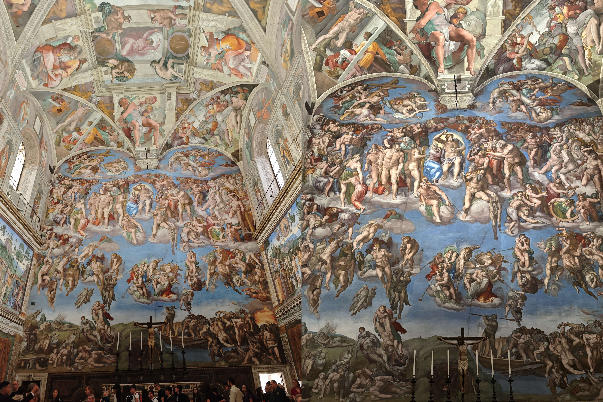

在出口纪念品店里买了份 $3$€ 的《雅典学院》冰箱贴后，就到了我本次来梵蒂冈最心心念念的环节了：在博物馆内的邮局里购买专属邮票并寄出明信片。我充分实践了中国人的中庸之道，花了 $4.85$€ 买了两组明信片和邮票：一组意大利境内的邮票用于带回收藏，一组寄回亚洲的邮票用于实际寄出（顺利的话一个多月可以寄到中国）。

梵蒂冈博物馆里有一条神秘的布拉曼特螺旋阶梯（*Scala di Bramante*），为了保护文物目前不对普通公众开放。这座阶梯建造于 1505 年，由当时的建筑大师多纳托·布拉曼特（*Donato Bramante*）为教皇儒略二世设计。为了让马蹄不打滑、马车不剧烈颠簸，布拉曼特用砖块铺成了特殊的鱼骨纹斜坡，组成了一条无台阶的坡道——据说米开朗基罗在西斯廷画天顶画的日子里，每天都从这上下班。1932 年为了迎接激增的现代化游客潮，教皇庇护十一世下令建造一个足够高效、安全的出口通道，意大利建筑师朱塞佩·莫莫（*Giuseppe Momo*）在博物馆出口处用现代青铜与大理石重塑了“新布拉曼特楼梯”。这座楼梯采用了极其超前的双螺旋（*Doppia Elica*）结构，一条通道专门用于“上行”（当年供教皇的马车或特定人员使用），另一条专门用于“下行”（也就是今天游客离开的单向通道）。

备选的晚饭地点都在台伯河对面，我们现场在小红书上搜索梵蒂冈附近美食，找到了连锁店 *Pastasciutta*。这家店主打的就是最纯粹、最接地气的意面快餐文化：总共只能选择六种意面（*pasta*），一份只需 $8$€，两到三分钟就能打包出餐，游客们往往会坐在店前的空地上吃。我们各自选购了芝士胡椒意粉（*Spaghetti Cacio e Pepe*）和肉酱宽面（*Pappardelle al Ragù*），吃的时候总有鸽子和麻雀在身边盘旋着，虎视眈眈地盯着我们手中的面。

晚上是自由活动时间。励颖突发奇想在 Google Map 和小红书里搜索桌游店，想偶遇佛罗伦萨那般的惊喜。搜到一家名为 *Avalon* 的桌游店，步行前往逛了逛。这是一家纯正的桌游馆（无模型、卡牌等周边），位置有点偏僻，店里也没什么客人，而且 $19:30$ 就会关店（欧洲的桌游店果然都是这个德性），想象不出来有何利润空间。

晚间我们步行前往大名鼎鼎的冰激凌连锁店 *Gelateria La Romana dal 1947*，四球 $5$€ 可谓是物美价廉——励颖锐评可以和威尼斯的 SUSO 比肩意大利最好吃的冰激凌。回去路上我们特意去家乐福绕了下，因为励颖对上次购买的绿色薯片念念不忘，这次复购了三大包。我提着篮子在冰柜前选购三明治时**遇上了离奇的一幕**：一个小黑突然拍了拍我的肩膀和我套近乎，说来说去是想托我多买一包薯片送给他；我颇为反感但没有勇气拒绝，先回了个 *Let me talk with my wife*，然后着急忙慌地跑路到水果摊前找励颖救命；她喷我太软弱不懂得拒绝，但自己害怕英语交流不肯帮我去，我踌躇半天只能硬着头皮去尬聊拒绝。排队结账时我对这名小黑尤为关注，关注到他左手在背后扣住了一瓶冰柜里拿出来的鲜奶，右手上前去拍了拍收银队伍里的一名老哥（不知道是熟人还是刚套近乎），交流了一会突然闪身从无购物通道里走出去了。这还没完，我注意到他一直靠在门外的栏杆上，很担心等会又被缠上，匆匆打开 Google Map 选了一条更热闹的路线。好在我们结账出门后小黑已不见人影，长吁一口气。

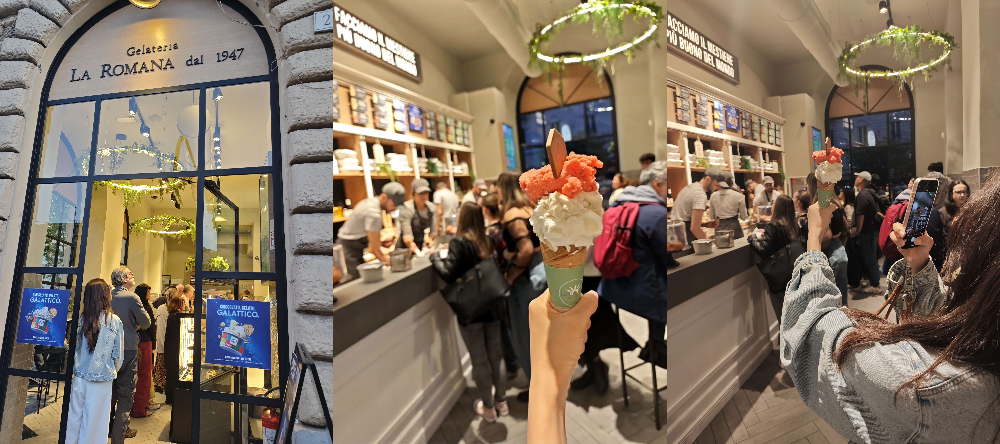

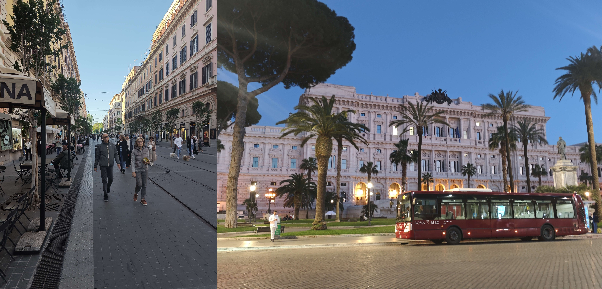

## 回程

圣天使堡附近有一个 *Rome Vatican Via Crescenzio* 公交站，运营着黄色的 *SIT Bus Shuttle* 和红色的 *Terravision* 两种机场巴士，从酒店步行过去甚是方便。我提前预定了 $9:00$ 出发的 *SIT Bus Shuttle*，$14$€/人价格不贵，$40$ 分钟直达罗马菲乌米奇诺机场（FCO）。川航有一排柜台同时开着，值机完全不用排队，比西安飞巴黎爽多了。

过了安检和海关后，巨大的 *Aelia Duty Free* 映入眼帘。这是全欧洲最大的机场免税店之一，店内没有传统商店那种拥挤的货架感，而是采用了一楼大平层的开放式设计。香水、化妆品、烟酒以及意大利本土的巧克力和食品，都像艺术品一样分散在不同的小岛台和独立区域。我们在现场了解到意大利国宝级巧克力品牌 *venchi*，吭哧吭哧选购了一堆散装巧克力。打卡了机场里同名的冰激凌店，这次我们要了 cup 类型，三球冰激凌 $5$€ ，可同时选购最多五颗 $1$€ 的 *venchi* 巧克力球。**吐槽两名店员非常佛系**：柜台前排起的长队就当没看见，完全按照自己的节奏在整理货品。因为 E31-44 登机口要坐摆渡车，等得我俩血压飙升。客观来说冰激凌的口味很不错，特别是巧克力味。

罗马菲乌米奇诺机场被誉为全球买 LV 的终极圣地，因为它的价格卡在全欧标价最低的意法价格线上，且出示非申根国登机牌后即可在结账时自动免除 $22\%$ 的增值税。抵达登机口等待时，排队的国人几乎人手一个 LV 袋子。

