## 总体印象

2024 年的中秋假期前往马尔代夫的莉莉岛玩了五天四晚，感受总结如下：

+ 开放式管理，上岛后要签免责协议，沿海的平台没有护栏，游到深海也没人管。
+ 莉莉岛上中国人很多，平均占比超过 50%。欧美日韩俄的游客都有。
+ 马代除了本地语言外，和游客沟通的标准语言是英文。很多人会说几句常见的中文（如莉莉岛上服务员会说西瓜、谢谢等，购物时店家会说便宜、中国、冰箱贴等）。
+ 水很蓝很清澈，人很少，浮潜能看到很多珊瑚和鱼。
+ 莉莉岛的饮食马马虎虎，酒水饮料的品种很多。
+ 关于小费，经过几次大手笔的 $5$ 美元的失败尝试后，我们把进餐或搭车的小费稳定在 $1 \sim 2$ 美元。

## 临行准备

马尔代夫印度洋上的群岛国家，首都马累，主要产业是旅游业和船运业。马代旅游模式主要包括以下两种：

+   居民岛：岛上选酒店，自行 DIY 交通、餐饮和活动，预算偏低。最有代表性的就是马富士岛（*Maafushi*）。
+   度假村：一岛一酒店的开发模式，商业化成熟，预算偏高。旅行社可代订五天四晚套餐，主流价格区间是人均 $1w-2w$ 人民币。岛屿酒店的房型主要分为沙屋和水屋两种：沙屋坐落在岛的陆地上，往往面向海滩和泄湖，据说蚊虫会比较多；水屋通过木制结构完全搭在海上，据说风浪大的时候房子可能会晃。岛屿酒店的餐型有若干种，包括含早餐（*BB*）、含早晚餐（*HB*）、含早中晚餐（*FB*）和一家全包（*PAI*）。

我们在众多岛屿中千挑万选，锁定了一个综合配置不错且浮潜（*snorkeling*）环境很好的岛屿——莉莉岛（或称丽莉岛，*Lily Beach Resort*）。莉莉岛是一价全包的鼻祖，即所有餐食酒水均包含在房价内，并提供四选三的免费出海活动（日落海钓、珊瑚花园浮潜、探访居民岛和日落巡航）。$5 \sim 10$ 月是马代雨季，所以是旅游的淡季，价格相对便宜（中秋节没有让费用变贵）。我们选了二沙二豪华水的配置，因为淡季成功升级到了四豪华水。通过对三方旅行社的比价后选择了马代实验室代订，共计 $3w-$。莉莉岛水屋的一大特色是提供玻璃大地砖来看鱼。按照小红书上的攻略，付尾款前我向莉莉岛官方发一封邮件确认是否订购成功。默认的上离岛方式是内飞+快艇（飞到临近的大岛屿再坐快艇），我们的套餐里赠送了一趟水飞（水上飞机直达），这样上离岛可以体验不同的感觉。

马累最大的机场是维拉纳国际机场（*Velana International Airport*），国内能直飞的城市不多（主要包括北京、上海、成都和香港），所以订购合适的往返航班是一件很头疼的事情。强如上海都只有一趟往返航班，而且时间都是糟糕的中午到下午——由于马累晚间没有合适的上岛方式，游客往往要先在马累城市里过渡一晚，对请假出行的打工人很不友好。于是我们计划订购中转一次的航班，主要中转城市是吉隆坡或新加坡。携程或飞猪上提供的最低中转时间是 $3$ 小时，这样整趟航线用时在 $13$ 个小时左右，为了节省休息日大概率要坐红眼航班。上海往返的航班基本都是浦东机场出发，杭州到浦东的交通很不方便，我们索性就挑从杭州往返的航班。经过精心安排，我们计划用中秋节+请假两天的方式拼五天四晚的假期，过去的航班是 $0:15-9:50$（马累时区慢 $3$ 小时），正好利用了前一天下班后的空余时间，抵达马累后就能愉快上岛玩耍，除了极度劳累之外没有缺点；回来的航班比较难挑（要追回 $3$ 小时的时差，时间跨度来到了 $16$ 小时），我们选在了 $21:15-13:10$，优点是离岛当天能够足够悠闲，缺点是额外透支了一个上午的工作时间。往返航班都是无敌实惠的亚航，单人单趟平均价格是 $2.3k$ 人民币。

我们走前在小红书上研究了很久的攻略。我带了张 VISA 的信用卡，取了 $200$ 美元现金（适应小费文化）。如果要体验浮潜的话最好自带潜水服、潜水镜和呼吸管，这些都是勤劳的励颖帮我端到端选购搞定的。马代是英标插座，不过岛屿酒店大多自带全球各地的转换头。亚航没有默认的托运规格，每人随身行李不能超过 $7kg$，有很多人吐槽亚航执行严以此牟利。我们携带了一个行李箱+一个包，出发前严格控制了行李总重不超过 $14kg$。

## 第一天

原定于 $0:15$ 的飞机延误到 $0:51$ 起飞，我和励颖等得很焦躁。航班上座位没连在一块，好在我的座位靠过道，轻松找了个大叔交换。抵达吉隆坡后为了防止人生地不熟错过中转，我们快步而行。吉隆坡机场给人的感觉是干净、小巧而实用，我们一路沿着 *International Transfer* 的绿色指示牌走，在一个口子因为没有第二程机票被拦了下来。在底楼绕了一圈，柜台人员告知不出关只能用亚航 APP 的电子机票登机，稳一点就不去取票留作纪念了。励颖没忍住在一家便利店买了个 $20.5$ 马币的双子塔冰箱贴，假装就来马来西亚玩过了。候机室虽然窄，和萧山机场一样也设有自助饮水装置。我开心地取了一个纸杯，结果水直接从杯尖全漏了出来，只能胡乱吸两口= =。

第二程的飞机上，我和励颖玩起了掼蛋。通过航旅纵横内置的机上蓝牙连接，凑齐四个人不容易。掼蛋的总体规则和双扣类似，关注级牌、2 是最小的、同花顺堪比炸弹等规则即可。我和励颖互为敌方，她的队友似乎不太会玩，总是把她的大牌压住，所以我连赢了三把。这两程都是四五个小时，坐到后来我浑身不舒服，腰和脖子都很疼。

$9:50$ 下飞机，马代的入关很简单。我根据小红书上的攻略，在出口处的 *Bank of Maldives* 换开 $100$ 美元留作小费。收银的小哥很专业，换成了只有 $5$ 美元和 $1$ 美元的面额。在 C15 找到了莉莉岛的对接人员，带着我们上了专车，接送至水上飞机（*sea plane*）机场的贵宾休息室。贵宾室里已经有一对欧美情侣在看电视。

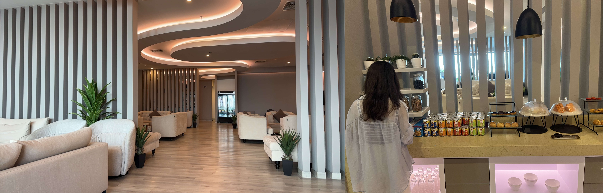

贵宾室里有精致的零食和饮料，我们很纠结要不要放开吃（万一岛上提供午餐就亏了），浅尝辄止。在阳台上观察楼下起降的水飞，原来它们并不是一直在水面飞，只是能很方便地在水上起降。苦等到 $11:20$ 下楼登机。

我们抢到第一排左右靠窗的座位，不仅能看到窗外的风景，还能看到两位驾驶员在仪表盘前的操作。起飞前在水上滑了很久，像是在给别的飞机让位置。起飞的时候劲有点大，汽油味很重，好在我早已磕了一片晕车药。飞行时噪音很大，工作人员给每个人发放了一个耳塞。飞行途中风景绝美，陆续看到好多个泄湖和小岛。

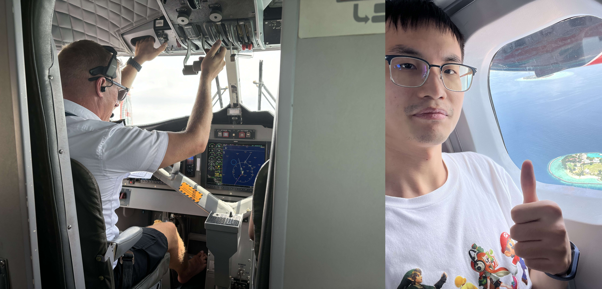

本架水飞总共接送三个岛屿，莉莉岛是第一个，用时半小时。目的地附近悬浮着一个木筏作为中转，水飞和接送船都停在木筏边上。前来接送的船是马尔代夫传统渔船多尼（*Dhonis*）。行李全程都有小黑帮忙搬运。

抵达莉莉岛后，很多工作人员在码头迎接，为我们每人戴上一个粽叶编织的项链。和我们对接的是 *Luna* 管家，她是前来打工的中国人，会中文、英文和韩文。莉莉岛的经理在接待处为我们用英语做了简介和注意事项，*Luna* 全程用中文翻译并做了更多补充，并找我们签署了免责声明书。注意事项包括：不能触碰或破坏珊瑚，否则会罚款 $500$ 美元；中午两点前上岛会消耗午饭配额，所以临行前的那顿无法享用（或者支付 $50$ 美元一个人的餐标）；要尊重马代当地的习俗，餐厅就餐时不穿背心和吊带；岛周围部分区域禁止浮潜，傍晚 $17:30$ 之后不建议浮潜；如果有问题可以联系她微信或打电话给前台。我们备注了蜜月但没有结婚证，她表示烛光晚餐会检查这个证件，所以只能为我们申请其他小福利（香槟，蛋糕，床上摆件等）。后面几天里我们互动不多。

岛上有四个餐厅：主餐厅 *Lilymaa*、泰餐厅 *Tamarind*、酒吧 *Vibes* 和酒吧 *AQVA*。所有餐厅都提供免费的午餐，但只有 *Lilymaa* 提供早饭和免费的晚饭。 **遗憾的是，我们入住期间 AQVA 酒吧一直都在装修**，据说持续到月底。

接待处附近就是 *Spirit* 酒吧和 *Lilymaa* 餐厅，地面上都是沙子（其实就是沙滩上盖个房顶），我球鞋踩得很难受——励颖猜测这样就不需要打扫了。 *Lilimaa* 一日三餐都是自助，规模不大，我们在那里吃了午饭。最让我瞩目的是海鲜区，我点了两条石斑鱼（*Grouper*）和半条帝王鱼（*Emperor Fish*）。石斑的味道不错，样子和深圳吃过的东星斑很像；帝王鱼的鱼肉呈大块状但淡而无味，必须和着调料吃。这里的厨师似乎只会烤鱼这一种烹饪方法，我们刚接触时很新鲜，吃了几天就有点吃腻了。

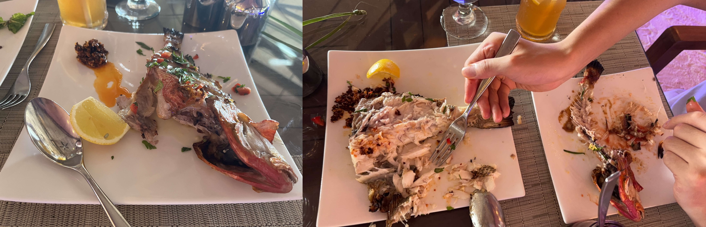

吃完后 *Luna* 开观光车送我们到水屋。水屋在整个岛的西南边，道路和房间都是由木头搭成，总共分为两排。我们被安排在右侧比较靠前的位置（Room 333），但励颖觉得水浅鱼少想换到另一侧，于是 *Luna* 载着我们折返接待处向前台确认。被告知左侧还有 313 和 301 两个选项，前者比较远（倒数第四间），后者需要再等一天才能切换（期间暂住 333），我们选了前者。糟心的是 313 未打扫干净，我们不得不回到 333 暂时休息。鉴于换房间流程复杂，*Luna* 驾车回去时我们给了她 $10$ 刀的小费，后面想起来有点懊悔。这段等待的时间很烦人，行李不太方便摊出来，只能傻傻地躺着并反复找前台确认，前后总共折腾了两小时才入住成功。

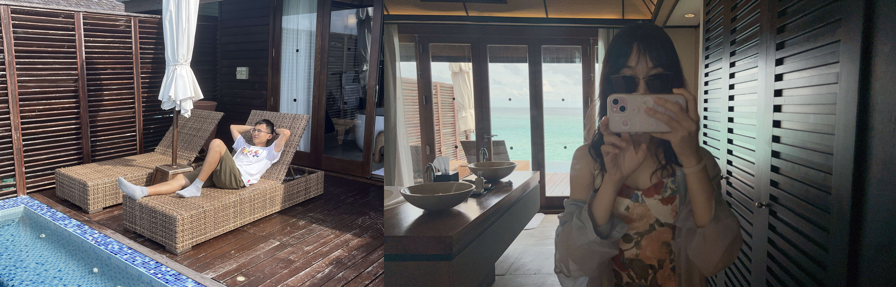

不能浪费了莉莉岛完美的浮潜环境，刚安顿好后我就准备去水上中心（*water sports center*）借浮潜设备。电话按铃致电前台，巴拉巴拉说了一堆搭车需求。抵达水上中心后和两个小黑欢快地聊了很久，他们问我是否游过泳，并表示大海里游泳很不一样因为浪很 *leap*（我当时忘记了 *leap* 的含义，他们就用手给我比划），似乎想通过教我游来赚点小费。我告诉他们我只想穿着泳衣（*life jacket*）浮潜，借到了两份救生衣+脚蹼+呼吸管（我们自带了）。他们向我强调不能触碰珊瑚，我表示已经被告知过触碰后会罚款 $500$ 美元，他们哈哈大笑说是骗我的。回去的时候再次搭车到了载我来的那个胖胖的小黑，一冲动给了他 $5$ 刀小费。

傍晚我们就在水屋阳台边上下水浮潜。大家都是新手，小心翼翼地穿好装备。励颖不肯穿上长得很怪的脚蹼，又是穿了救生衣又是紧抱着刚吹起来的救生圈，让人忍俊不禁。我俩只在浅水区游了半小时，鱼和珊瑚都很多。呼吸管让人不太适应，刚开始我总是想用鼻子呼吸导致泳镜松动，习惯了用嘴呼吸后止不住会流口水。

励颖钻研了 *Lilymaa* 每晚的自助主题和小红书上的评论，决定把“最难吃的地中海美食之夜”替换成赠送的泰餐厅。当晚 *Lilymaa* 的主题是“马尔代夫之夜”，确实比中午丰盛很多。有两只很大的烤鱼，不过尝了尝味道一般。

第一天行程很累晚上我想早回，但励颖正在兴头上怎么也不肯回去，在接待处的沙滩上品尝着 Spirit 的水果鸡尾酒，硬是等到了码头 $21:00 \sim 21:15$ 的喂鲨鱼活动。码头的水里早早地聚集了大量的鱼，主要包括护士鲨、白鳍鲨、魔鬼鱼和一种黑鱼。魔鬼鱼往往三五成群地一起游，看着笨笨的；有几条护士鲨的体型已经变得特别庞大，褐色身躯看久了有一种恶心的感觉。喂鱼的师傅推着绿色的小推车过来，桶里装满了被切开的血腥的鱼。师傅先在码头内侧的浅水区投喂，而后走到码头外侧的深水区投喂。据说以前有专门喂魔鬼鱼环节，而这几天都是无脑往水里丢——黑鱼夺食比鲨鱼还快，而可怜的魔鬼鱼游速很慢根本抢不到食物。码头的位置很奇妙，浅水区不足一米，隔着一条线外面就深不见底。我不得不感叹马代的开放，深水区完全没有护栏，一个趔趄掉下去就完蛋了。励颖总是试图头向外看或者脚朝下坐在木板上，我狠狠地把她拽着防止她掉下去。

与此同时，*Lilymaa* 主餐厅前的木制舞台上正在上演马尔代夫民族舞活动。他们很钟爱一种鼓，按一定节奏敲个不停。喂鱼结束时我们经过那里，主持人正在邀请观众上去一起跳舞，吓得励颖花容失色避之唯恐不及。

码头上总是站着一两只苍鹭，大部分时间都是一脸深邃地站在沙滩上，有时候会飞掠海面换个新地方。我们合理推测这几只苍鹭是莉莉岛的工作人员饲养的，因为他们总是肆无忌惮地在岛上散着步，喂鱼的时候也总能分到一块。

## 第二天

*Lilymaa* 的自助早饭口味挺不错。除了西瓜、菠萝、橙子、芒果这些常见的热带水果，我把没见过的三种水果都尝了尝，味道一言难尽。我想吐槽的是随桌只提供干布没有湿巾，没法很好地擦手和擦嘴。

我们上午去水上中心逛了一圈。船具零零散散地漂浮在水面上。我们沿着沙滩一直往南走，东面是一间间通向海滩的沙屋，有个游客正趴在躺椅上做太阳浴。沙地+时不时涌上的潮水正好适配励颖的洞洞鞋，我的球鞋很尴尬。

我们抽空逛了逛岛上唯一的纪念品商店。瓷砖地板，进去得脱鞋，有点怪不适应的。商店不大却种类繁多，生活用品、服饰、纪念品都有涉及。柜台边是个东北口音的大姐，自称是辽宁人，为我们介绍着商品。冰箱贴一律 $8$ 刀一个，中型模型手办在 $20 \sim 40$ 刀。这里能同时买到明信片和邮票，据说有概率能寄到国内——我选择买一套人工带走。励颖喜欢上了一支头上带有沙子和乌龟的小球的铅笔，居然要卖 $7$ 刀。我们在一个锤头鲨玩偶和一个鲸鲨手办里纠结了半天选了后者，加上两个冰箱贴、一支铅笔和一套明信片邮票，总额 $70$ 刀，挂在了房费上。

中午早早地来到 *Vibes* 品尝午饭。*Vibes* 是个沿沙滩而建的酒吧，地处整个岛的最东北边。酒吧内有餐桌、沙发和两个台球桌，外有乒乓球桌和游泳池，附近还有网球场和健身房。柜台边上有一台冰激凌机，可以手打不同口味的冰激凌。游客不是很多，绝大部分餐桌都处于闲置的状态。我们选了靠外的餐桌，能望到沙滩和海面。

餐前服务员端过来几个面包，看着像是不太好吃的摆设，结果励颖眼疾手快地抓了两个吃了起来，一副超级好吃的样子。对着两个 pad 里的一份 pdf 点餐，全英文，包括 *Salad*, *From the Sea*, *From the Farm*, *Pizza* 和 *Dessert* 几页。我们按照拍照翻译结果和小红书的推荐点菜。网友普遍认为牛排很不错，浅尝了一块，分量很足，口味确实和国内吃惯了的制品牛排大相径庭；沙拉虾串里的虾只有两串，我们完全吃不惯里面的沙拉；牛肉薯条的量很足，口味很赞，励颖居然独自吃掉了大半盘；点了 *Chicken Wings* 本以为是翅中结果是翅根，味道不错我俩抢着吃。

四选三活动中，我们最期待的日落海钓在入住周期内只有一次活动（就不能重复选啦），相对喜欢的珊瑚岛浮潜几乎每天都有，剩下两个日落巡航和探访居民岛兴趣都不大。我建议励颖先在家门口玩熟练了再去海里浮潜，但她执意想先试试，玩得爽就重复选。中午背上包出门，在接待处换好泳衣，$14:00$ 带着脚蹼和呼吸管坐多尼出发去珊瑚岛浮潜。莉莉岛上提供的拖鞋是我不习惯人字拖（说是沙滩上行走会更安全），这次出门只能硬着头皮换上了。出发路上小黑会依次帮大家洗呼吸管的咬嘴，回程时则提供毛毯和饮料。多尼将我们捎到一处海沟附近，小黑用蹩脚的英语给我们讲了浮潜方向和注意事项。励颖胆子小迟迟不敢跳船哈哈。一开始我很担心她游得慢，于是左手持着 GoPro 右手扶着她向大部队游着。她很快就适应了海上浮潜的节奏，自发地沿着海沟游着，并包揽了所有拍摄任务。到后来她游得越来越快，我得时不时地探出海面观察多尼和大部队的方位，指导她改变方向或者减速。总共游了一个小时，励颖自称看到了两条鲨鱼，而我海龟和鲨鱼都没看到，有点遗憾。

回来后去 *Vibes* 品下午茶，其实是自助的水果、冰激凌和面包。室外的乒乓球桌太热了，我们就玩起了台球。我们都是台球萌新，我在小红书里看了遍中八规则后就制定村规开始玩了。我俩的失误率都贼高，大好的直线球可能都打歪或者打轻。励颖的稳定性略胜我一筹，我们打了漫长的三局，我以 $1:2$ 的比分落败。

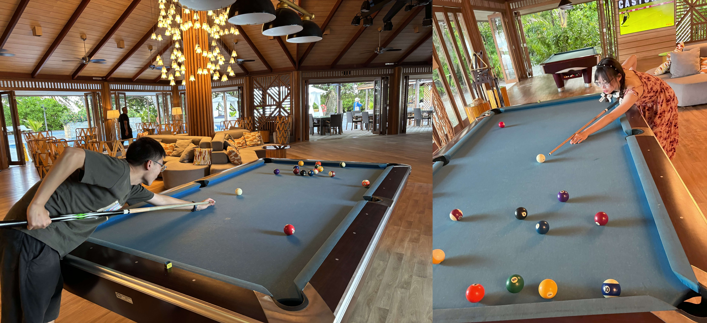

晚上按计划去 *Tamarind* 吃晚饭。*Tamarind* 本意是罗望子树，提供泰国菜和印度菜。点菜和上菜需严格按照前菜 *Appetizer*、汤 *Soup*、主菜 *Main Course* 和 甜点 *Dessert* 的顺序来，一人只能点一份。我的前菜和主菜分别点了虾和章鱼，汤我们一律选了冬阴功。为了便于拍照，和服务员沟通把除甜点外菜一起端上来。这里的冬阴功汤多了很强的辛辣感，明明应该很违和实际却很搭配。章鱼和虾仁味道都很赞，可惜菜的分量普遍很小。

今晚继续去码头看喂鲨鱼。莉莉岛的明星苍鹭依然在，从喂鱼师傅那获得一条鱼后扑腾着就飞走了。

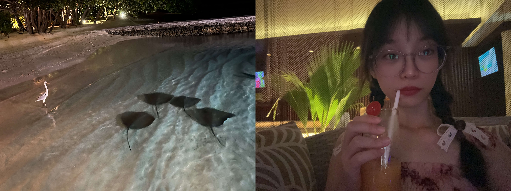

## 第三天

大清早在床上被一句“我去浮潜啦”惊醒，迷糊着走到阳台发现励颖已经带着 GoPro 扑腾着远去，于是匆匆茫茫换上泳衣跳下去。我俩浮潜都愈发熟练，所以这次一直横向游到海沟并沿着海沟纵向游着。

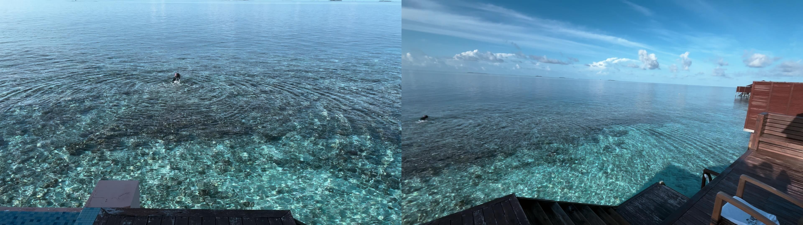

洗漱完毕后前往 *Lilymaa* 吃早饭。我们把招牌上的三种鸡蛋制品都尝了一遍，励颖评价是第三种最棒。我居然发现了两种中式点心，海鲜烧麦 *Seafood Siu Mai* 和包子。海鲜烧麦的味道超级赞，有点像港式点心里的虾饺，我一口气吃了好几个直接吃饱了。励颖就更加奔放了，各种不知名的汤、华夫饼、水果吃得不亦乐乎。

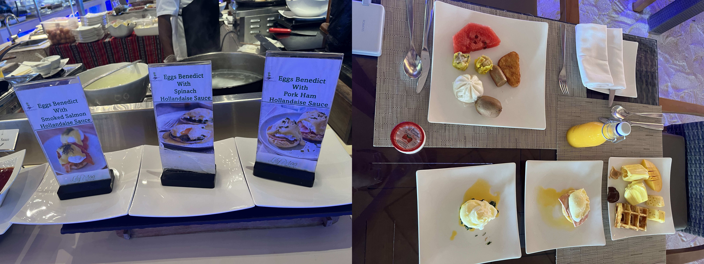

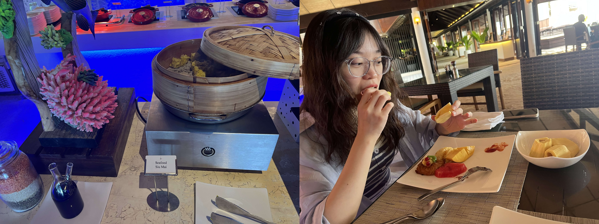

上午去 *Vibes* 蹭喝，偌大的泳池没有人很可惜。台球战至 $1:1$ 平，因为天太热没有决出胜负。

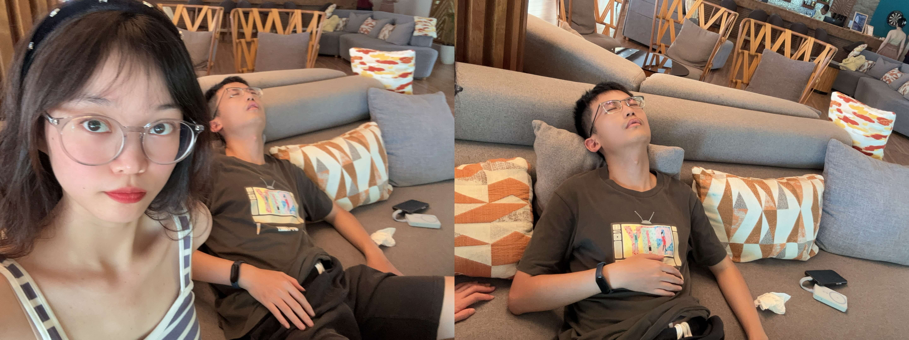

*Tamarind* 的午饭没有晚饭那么正式，和 *Vibes* 的风格很接近。我们有些自不量力了，点了沙拉和主食（包括牛排和鸡排）后仍然点了一个海鲜披萨，吃到还剩半个时实在吃不下了。找服务员要打包盒，她很细致地用锡纸封好交给我——这顿留下的一刀小费名正言顺了。如我担心的那样，后续行程忙+伙食充足，这半个披萨终究没有吃。

我们一致认为珊瑚花园浮潜的活动不过如此，将第三个活动定为探访居民岛。受莉莉岛日程安排的制约，当天下午我们接连参加了 $14:00-16:00$ 的居民岛活动和 $17:30-19:00$ 的日落海钓活动。

居民岛的活动最为休闲，轻装上阵即可。有一个小黑当导游，说着不是那么标准的英语，就当练习听力吧！这个居民岛离莉莉岛并不远，多尼单趟在 $20$ 分钟出头。两点多的太阳甚是毒辣，而且我偷懒忘记涂防晒了，上岛散步时励颖总是呵斥我远离太阳。导游先带我们走街串巷逛了十几分钟，讲了讲当地的特色。马代当地的社会与现代化的岛屿酒店相比落后了不少，房屋和设施很陈旧，很多地方还在做着砌墙等施工。岛上没看到汽车，摩托开开足矣。

参观了一棵有着八百多年历史的大树，导游让大家竞猜是什么品种，励颖居然猜对是榕树（*Banyan Tree*）。当地把这棵树称为 *moving tree*，因为它在一天的不同时段垂下来的枝条位置是不一样的。在树下少许站立拍照，我和一个日本男孩的腿立马被蚊子咬了。接下来我们还参观了学校、诊所、体育场等建筑，主打一个五脏俱全。

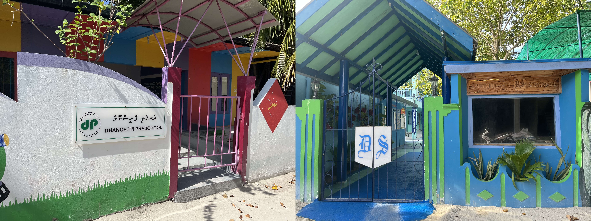

导游把我们带到主路的尽头，上面挂着牌子“游客止步”。他留给我们一小时沿着主路步行回船，两侧全是应运而生的纪念品店。纪念品比莉莉岛上的价格便宜很多，光是冰箱贴的均价从 $8$ 刀下降到 $4$ 刀，更不必说鲸鲨手办——我们直呼亏爆。小买了两个冰箱贴和一袋当地硬币，我还看中了一个手柄是海豚模样的杯子，砍价到 $15$ 刀。品尝了 $3$ 刀一个的椰子（莉莉岛的酒吧要 $5$ 刀一个额外收费呢），口味比国内的淡很多，好亏。

最刺激的日落海钓还是来了。小黑开了十几分钟的船，带我们来到一片深度约为 $25m$ 的海域。一路上有一对欧美夫妇甚是吵闹，那个女人外放着带有节奏感的音乐，手上拿着一瓶香槟，逢人就想跳上一支舞。船员一开始饶有兴趣地陪她玩着，后来也逐渐受不了哈哈。装备不是寻常的杆状鱼竿，而是其貌不扬的线圈状，可能这就是深海钓法吧。据说最佳的钓鱼高度是先把线圈放到海底，然后往上收回七八圈（$2m$）。钩子很锋利，鱼饵是切好的鱼肉，由小黑挨个给我们串好。小黑建议每隔几分钟没动静就把线收上来查看一下，因为鱼饵可能已经被小鱼啃食干净了。我笨拙地尝试了半天，才学会怎么把线流畅地滑入海底。一下水就感受到一丝抖动，我开始激动地往上收线，谁知阻力十分巨大，我甚至怀疑这个细线会在上升途中会被割破。我紧张地用 *help* 叫来了一个小黑，他稍微感受了一下力度就喊道 *It's coral*，空欢喜一场。就在小黑帮我整理线的过程中，他突然大叫 *Oh, It's fish!* 并提示我赶紧收线。可能是为了让我有参与感，他在下面拽线，让我在顶端转圈圈回收线。我的旋转速度远不及他的收线速度，他一边摇头晃脑地收线一边大喊着 *quick, quick, fish!* 我其实没感受到鱼的震动，将信将疑地把线转完，果然有一条红鱼跃上甲板！小黑看到鱼后略一皱眉，主动协助我拍照留念，并解释说这条鱼太小了得放生。在随后的一个小时里，我和励颖各自独立钓着鱼，双双空军，遗憾而归。那个欧美老哥钓上来一条很大的石斑鱼，收线的时候就像是在拔河，全船人都羡慕不已。害，怎么看着最划水最休闲的夫妇能有最大的收获，可能心态是钓鱼的成功关键。此外不得不提，海钓纯纯是体力活，主要的体力消耗都在每隔几分钟的收线和换饵上。

Lilymaa 晚饭主题是“世界经典美食”。国外对沙拉真是狂热喜欢，看着这些五颜六色的水果和蔬菜，完全吃不惯。我对鱼柜台很好奇，用英语支支吾吾地告诉师傅说前两天只吃过东星斑和帝王鱼，问能否尝尝后面几种鱼的味道。师傅很快就理解了我的意思，不仅把其他每一种鱼都切了一块，还在几分钟后亲自送到餐桌上。**原来他们真的只有烤鱼一种做法**，配合相同的蘸料，我感觉这几种鱼肉的味道完全一样。

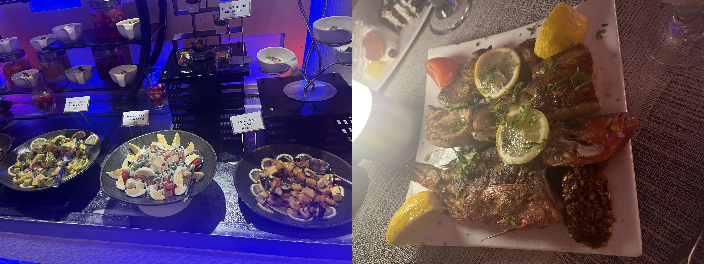

当晚我们连例行的码头喂食都没去看，直接回房休息，结束这疲惫的一天。

## 第四天

*Lilymaa* 早饭的两个蒸笼档里没找到虾烧麦，遗憾。包子保持不变，虾烧麦换成了蝴蝶饺（*butterfly dumping*），口味一般。励颖在不亦乐乎地品尝各种菜肴，炒饭啊汤啊面包啊水果啊完全不放过，简直就是大胃王。

闲来无事就去 *Vibes* 玩台球，偌大的空间里没有别的游客。这次我 $1:0$ 击败励颖，三天的战绩加起来打平了，可惜因为天太热就休战了。吧台的服务员突然准备了好多根串起来的水果，这种花样也就骗骗女孩子。

再次品尝了 *vibes* 的午餐。牛排有点厚重，我准备换一点轻量的。当我们点了两份 *Salad*、两份 *Sea Food*、两份 *Farm Food* 后企图再点一份 Pizza，被服务员耐心地制止了。他解释说 *Food* 和 *Pizza* 都算作主食，一人最多点两份，如果吃不够可以再加。感谢他善意的提醒，我们把手头的菜肴吃完后已经很饱了。

叫车回 313 午睡，躲避炎热的太阳。下午我们换好泳衣准备去浮潜，我先致电前台用英语咨询合适的浮潜位置。前台的口音小哥叽里呱啦说了一大堆，我尴尬地不知道怎么回应，只能连连说 *Thanks* 并叫了个车。等小黑驱车赶来后我对着小黑问了一遍，这次大致听懂了，*From Life(?) center to your house*，但是这个 *Life center* 究竟是啥？他重复了半天我俩也没听懂，就先让他捎过去了，下车后发现是深潜中心——意识到他说的是 *Dive Center*。

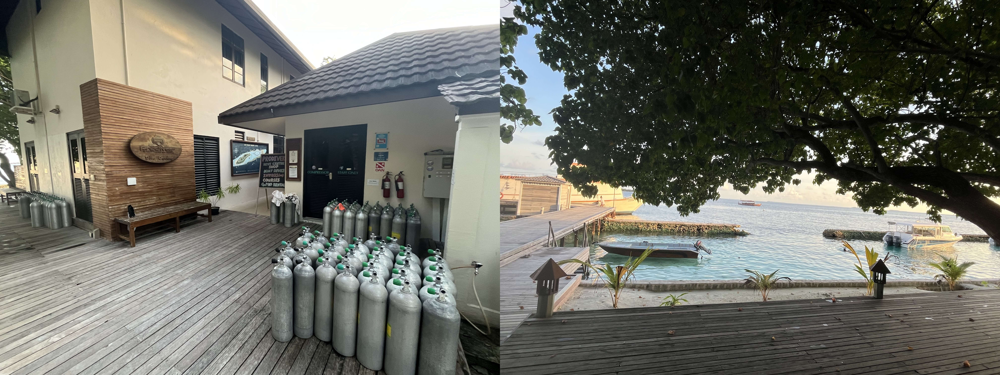

我们讨论了一下，决定从深浅中心一路向南游到水屋的阳台再上岸（我把眼镜和房卡放在附近的房间寄存）。这条最佳浮潜路线果然不一样，一下水就能看到海沟和很多鱼群。我们沿着海沟内侧一路向南，外侧靠下的位置游过一条乌翅真鲨，我还没感到害怕它就游远了。

出门去食堂的路上，我们目睹着夕阳一步步沉入海底，直至圆月当空。临近中秋，天空中的月亮很圆很圆。

*Lilymaa* 晚饭的主题是东方美食遇见西方美食，不知道东方美食指的是啥，除了寿司之外没有看到眼熟的。我在寿司柜台拿了几块寿司，厨师贴心地递给我酱汁和筷子，我念了句 *chopsticks* 后他哈哈笑了起来。励颖对各种炒饭和汤类很好奇，东蹭蹭西尝尝，再评价一句“味道不错”。学到一种奇怪的植物：欧防风（*parsnip*）。

最后一晚喂鲨鱼啦！可能因为国内放中秋假了，码头上的国人多了很多。依然是黑鱼抢食最快，我向投喂的师傅咨询它们的名字，得到的答案是 *Jack Fish*。喂食结束后我们意犹未尽，根据节目单前往 *vibes* 酒吧听 DJ。有三个哥们在台上忘情地歌唱，歌词听不懂，台下的观众也寥寥无几。我们已经把酒吧里的果汁和混合果汁（无酒精鸡尾酒）都喝遍了，和着音乐尝试了两杯带酒精的，只觉脑袋和脸热热的，不一会就撤退了= =。

## 第五天

我建议先浮潜再早饭，可有人实在忍不住了想先吃东西。*Lilymaa* 每天都会更换一些食品，比如当天新放出来了红毛丹，尝着味道不错。我爱的海鲜烧麦回来了，搭配的是蝴蝶饺——这三天的两个蒸笼其实就是这三个菜品排列组合。我蛋制品吃厌了，返璞归真找师傅做了两个溏心荷包蛋。励颖从刚来莉莉岛开始就叫着想吃山竹，结果外置水果盘里一直没见着，也不敢开口和水果师傅说话。早上终于鼓起勇气提出，师傅真从后厨拿出来的五片山竹。

很纠结临行的上午要玩什么。APP 里可以预订追鲸鲨或海龟之旅两个付费活动，前者单人 $150$ 美元，后者单人 $75$ 美元，价格都偏高。励颖否决了前者，因为追鲸鲨需要反复从快艇里跳下去游泳，她觉得自己不敢跳也游不快；海龟之旅就比较纠结了，难得来一趟马代，但花 $1k$  出游一趟且不保证能找到海龟总觉得有点亏。

不如家门口浮潜吧，说不定能找到海龟呢！当我们换好泳衣准备下水时，天空突然下起了雨，海上的风浪变大了。来马代的前四天根本没有下过雨，猝不及防。裹着泳衣在房间里傻坐了一会，雨转大了一会后渐渐停下，我们这才探头探脑地下水。我本计划最后一天脱掉救生衣潜入水里玩玩，安全起见只能作罢。励颖刚游到海沟时突然惊慌地拉着我往回游，游了几米回到浅水区后就悬停在岩石上，说是泳镜漏水了。我俩都有点慌，因为当时距离水屋还有一段距离，而海上的风浪比平时大些。我全力保持自身不动（穿着脚蹼站着很不舒服，时不时就会晃到一边），励颖就靠在我身边临时修眼罩。勉强能用后我俩携手游回水屋，她在台阶边详细测试了一下，漏水现象消失了。

为了不辜负这里的环境，我们决定重启浮潜，沿着海沟游向深潜中心。路上没见着海龟也没见着鲨鱼，有点遗憾。浮潜中心水域的景色非常好，经常会有不同颜色的鱼群在礁石和珊瑚边游来游去。励颖上岸后，我在岸边的一块方形水域里试了试脱掉救生衣游泳。习惯了浮潜的呼吸方式后，我的憋气时间短了很多，一潜到底就向浮上来换气。

在深浅中心暂存脚蹼和救生衣后步行回水屋。因为没带房卡，我得从水屋的公共阶梯下水游泳至 313 阳台上岸。意犹未尽地整理行李，$12:00$ 叫车去接待处。我给前台打电话的姿势越来越老练了，一句 *Room 313，needs a car / take a ride* 就拿下。前台小哥一般会先说一句 *Good Afternoon, I'm xxx, welcome to xxx.*，听完我的要求后说 *Ok, Thank you.* 或 *My colleague will come in 5 or 10 minutes*. 不知道为啥他们要对我说谢谢。

打开房门换鞋时发现鞋里已经湿透了，没时间吹干了，只能将就着臭烘烘地穿着。开车过来的是我们最喜欢的胖乎乎小黑，他递给我们一瓶葡萄汁，说是当地很流行的饮料。味道确实不错，有那种浓缩葡萄汁的厚重感。在前台签字付完这两天的额外费用后，前台表示扫码完成 $50$ 字的评价即可送一顿午饭。早说呀，怎么还有这种中式套路！当时距离出发时间 $13:00$ 已不足半小时，我们匆匆跑去 *Lilymaa* 吃了顿“快餐”，抓着东西往嘴里塞。

早早地吃了片晕船药来到码头。小型快艇晃晃悠悠划过来，行李照例是小黑全程帮忙搬运。有一对中国夫妇同行，我们各自坐在两侧。第一次坐游艇，体验和休闲的多尼完全不同。经历了一段推背加速后，快艇全程保持在高速前进，两侧和尾部全是被激起的白茫茫的水花。快艇总共开了半个多小时，深海里的水是深蓝色的，即将抵达目的地时海水变成了果冻状的蓝绿色。上了个不知名的中转岛，专车接送至内陆飞机（*domestic plane*）的机场。

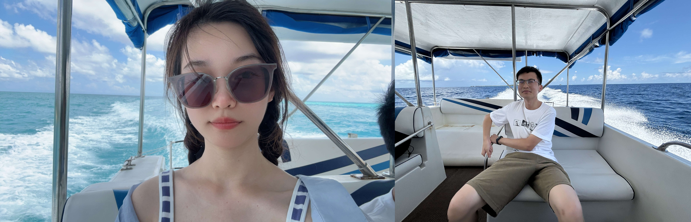

在候机室等到 $15:30$ 才开始登机。这个机场叫 *Villa*，我们全程只在跑道上看到一架飞机。结合莉莉岛淡季离岛时间只有早上 $7:30$ 和中午 $13:00$ 两班，我们合理怀疑这个机场每天只派这架飞机来回飞两次。候机室里很无聊，结合离开马代的航班很迟，研究了一番怎么去马累市区。掏出吹风机对着鞋子一通吹，缓解了一点潮湿。

小小内飞机场的安检居然很严格，出发前买的防晒喷雾被工作人员翻出来检查并扣下。励颖愤怒地用她的哑巴英语质问，因为喷雾的包装外侧写着 $100ml$，完美符合各大航司的液体携带标准。工作人员指了指墙壁上贴着的告示，说这里的规定是液体不能超过 $100ml$ 或 $80g$，而喷雾包装没有标明符合规定的克数。我们对他的说辞十分怀疑，因为墙上告示里完全没有出现 $80$ 这个数字，所有示例也都是针对液体是否超过 $100ml$ 画的。纠缠了半天，工作人员一直不肯让步，我们只能将这瓶喷雾留下了。励颖嘴里嘟囔着“这岛真穷，防晒喷雾都要创收”。

$16:50$ 飞抵马累，不过提取行李花了十几分钟。出口处被一个莉莉岛的工作人员拦下，会协助我们托运和登机。他怎么识别的呢？励颖发现了玄机，我们的箱子上挂着一块 *Lily Beach* 的牌子。我提出想去马累市区看看，对接小哥建议我们把箱子寄存在机场，说着 *There are many motorbikes* 并比着飞车抢劫的手势。寄存一件价格是 $6$ 刀，比小红书攻略里少 $1$ 刀。机场和市区分属两个不同的岛，摆渡船一趟 $1$ 刀 / $15$ 拉菲亚。马累城市的交通比较乱，小巷子里经常有电动车窜出来，画风有点像国内的二三线城镇。我紧紧拉着励颖的手，先步行去离码头不远的网红首饰店，$18:00$ 就会关门。这家店里有很多首饰，最有名的就是魔鬼鱼项链。正常价格是 $35$ 刀一个，今日深蓝色的有 *special discount* 只卖 $28$ 刀一个，而最好看的白色已经售空。

根据 Google Map 的提示步行去纪念品一条街。纪念品类型和莉莉岛、居民岛上的大差不差，款式变杂了。不同的店之间卷的很激烈，有的会派营业员在外面拉客，有的支持支付宝，有的店老板会说中文。砍价的空间变大了，所以均价能比居民岛还便宜些。经典的鲸鲨、海豚或魔鬼鱼的冰箱贴 $3$ 刀一个。我们曾在莉莉岛看中一只锤头鲨玩偶，大号 $38$ 刀小号 $20$ 刀，在马累一家店里找到大号 $20$ 刀的，做工上可能会有区别？励颖真的猛，用着一股奇怪口音的英文疯狂和老板砍价，从 $15$ 刀压到了 $12$ 刀，老板都快哭了，她仍坚持不到 $10$ 刀就不买，遂不欢而散。

马累免税店的纪念品去很全，价格也不是特别贵。我在纠结要不要买杯子，最后只买了我俩都很喜欢的水飞钥匙串（别的地方没见过）。在免税区服务员的建议下买了两种口味万宝路的烟，两位父亲分一分。

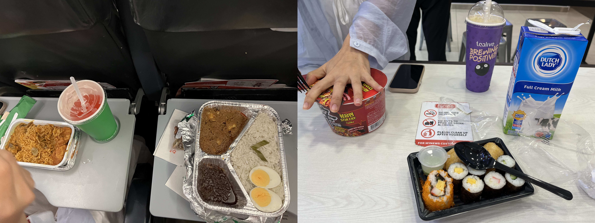