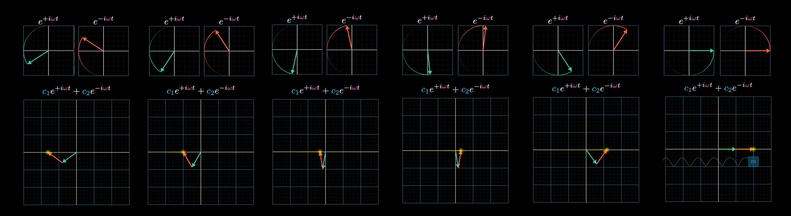
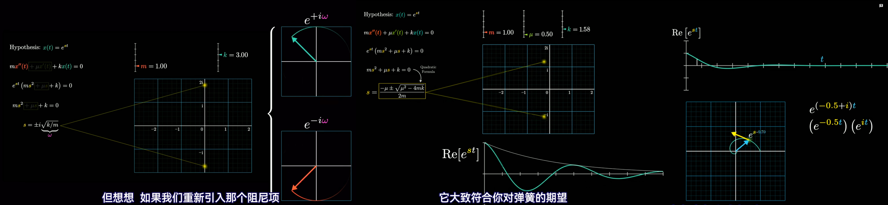
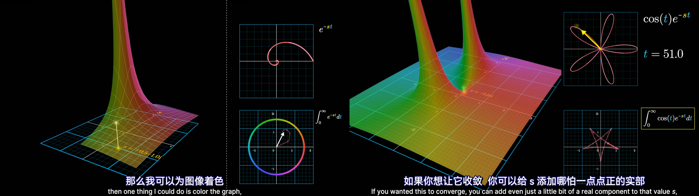
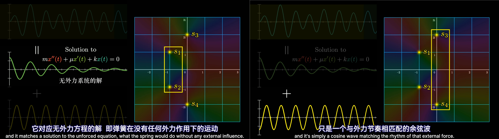

## 虚数和复平面

引入 $i=\sqrt {-1}$ 后，核心定律为如下的欧拉公式：
$$
e^{i \theta}=\cos \theta+i\sin\theta
$$
利用 $e^x,\sin x,\cos x$ 的泰勒展开可证明欧拉公式：
$$
\begin{aligned}
e^x &= 1 + x + \frac{x^2}{2!} + \frac{x^3}{3!} + \cdots, \\ 
\sin x &= x - \frac{x^3}{3!} + \frac{x^5}{5!} - \cdots, \\ 
\cos x &= 1 - \frac{x^2}{2!} + \frac{x^4}{4!} - \cdots, \\
e^{i\theta} &= 1 + i\theta + \frac{(i\theta)^2}{2!} + \frac{(i\theta)^3}{3!} + \cdots \\
&=\left(1 - \frac{\theta^2}{2!} + \frac{\theta^2}{4!} - \cdots\right) + i\left(\theta - \frac{\theta^3}{3!} + \frac{\theta^5}{5!} - \cdots\right) \\
&= \cos\theta + i\sin\theta 
\end{aligned}
$$
虚数 $i$ 出现在指数上，本质上是利用泰勒展开将指数运算延拓到了复数域。

复平面（*Complex Plane*）：特殊的二维坐标系，横轴称为实轴（*real axis*），纵轴称为虚轴（*imaginary axis*）。

+ 从欧拉公式可知，$e^{i \theta}(\theta \in \mathbb{R})$ 描述了复平面内单位圆上的点。
+ 结合模长缩放，任意复数都可以写成极坐标形式 $re^{i\theta} (r, \theta \in \mathbb{R}, r \ge 0)$，它能表示复平面上的所有点。

重要性质：将复平面上任意一点$\times i$，几何效果等同于将其 **绕原点逆时针旋转** $90 \degree$。

+ 代数证明：设该点 $z=x+y \cdot i(x,y \in \mathbb{R})$，则 $i \cdot z=i(x+y \cdot i)=-y+x\cdot i$，即 $(x,y) \to (-y,x)$。
+ 极坐标证明：设该点为 $z = re^{i\theta}(r,\theta \in \mathbb{R},r \ge 0)$，则 $i \cdot z=i \cdot re^{i\theta}=e^{i\pi/2} \cdot re^{i\theta}=re^{i(\theta+\pi/2)}$。

考察复平面上的运动函数 $f(t)=e^{st}$，其中 $t$ 是时刻，$f(t)$ 代表 $t$ 时刻在复平面上的位置向量。

+ $s=i\omega (\omega \in \mathbb{R})$ 描述了一个点在复平面单位圆上的逆时针圆周运动。证明：对 $f(t)=e^{\omega it}$ 求导后的速度向量是 $\frac{d}{dt}e^{i \omega t}=i \omega \cdot e^{ i \omega t}$ ，几何含义为"即时速度向量严格垂直于当前位置向量"，其中 $\omega$ 控制旋转速度。
+ $s=a+bi(a,b \in \mathbb{R})$ 描述了一个点在复平面上沿着螺旋轨迹运动，其中 $a>0$ 表示螺旋向外、$a<0$ 表示螺旋向内。证明：$f(t)=e^{(a+bi)t}=e^{at} \cdot e^{bit}$，前者（实部）是模长的放缩，后者（虚部）是旋转。

## 弹簧的微分方程

### 不带阻尼的弹簧系统

由胡克定律和牛顿第二定律，可推导弹簧位移 $x(t)$ 和时间 $t$ 的关系：
$$
m \cdot x''(t) + k \cdot x(t) =0
$$
常微分方程经典技巧：猜测解的形式是 $x(t)=e^{st}$，代入可得 $e^{st}(ms^2+k)=0$，即 $s=\pm i \sqrt{k/m}$。

**线性齐次微分方程的解具有线性叠加性**，该方程的通解为：
$$
x(t)=c_1e^{i \omega t}+c_2e^{-i\omega t}, \omega=\sqrt{k/m} \quad (t \in \mathbb{R},x(t) \in \mathbb C)
$$

从纯数学来说，常数 $(c_1,c_2)$ 可以取任意复数，即 $x(t)$ 可以带有虚部；但从物理世界出发，$x(t)$ 只在实数上有意义。有一个操作叫做取实部（记为 $\text{Re}\{x(t)\}$），即 $x(t)$ 复数值的实部投影能完全对应物理世界的位移。

特定的取值可以使得 $x(t) \in \mathbb{R}$，如 $c_1=c_2=1$ 时，代入欧拉公式得 $x(t)=e^{i \omega t}+e^{-i\omega t}=2\cos(\omega t)$。

为了研究 $x(t)$ 何时为实数，我们可以把基底 $\left\{e^{i \omega t},e^{-i \omega t} \right \}$ 通过线性组合变换到新基底 $\left\{\sin(\omega t),\cos(\omega t)\right \}$：
$$
\cos(\omega t)=\frac{1}{2}(e^{i \omega t}+e^{-i \omega t}) \\
\sin(\omega t)=\frac{1}{2i}(e^{i \omega t}-e^{-i \omega t}) \\
x(t)=c_1e^{i \omega t}+c_2e^{-i\omega t}=A\cos(\omega t)+B\sin(\omega t) \\
\begin{cases}
A=(c_1+c_2) \\
B=i(c_1-c_2)
\end{cases}
$$
参数 $(A,B)$ 同样可以任取复数值，此时这两个基底表达的解空间完全相同。 

用基底 $\left\{\sin(\omega t),\cos(\omega t)\right \}$ 描述解的好处是：

> **参数 $(A,B)$ 取实数，是位移 $x(t)$ 为实数的充要条件**。

+ 证明充分性：$\cos(\omega t)$ 和 $\sin(\omega t)$ 在 $t$ 为实数时始终是实值函数，他们的实线性组合 $x(t)$ 自然也是实数。
+ 证明必要性：注意到 $x(0)=A,x(\frac{\pi}{2\omega})=B$，若 $\forall t,x(t)\in \mathbb R$，显然有 $A,B \in \mathbb R$。

回顾原基底 $\left\{e^{i \omega t},e^{-i \omega t} \right \}$，如果要有 $\forall t \in \mathbb R,x(t) \in R$，则 $A,B \in \mathbb R$，即 $c_1=\overline{c_2}$，可得结论：

> **参数 $(c_1,c_2)$ 是共轭复数，是位移 $x(t)$ 为实数的充要条件**。

### 带阻尼的弹簧系统

现在引入阻力系统 $\mu$。假设它关于速度有个一阶线性近似，则弹簧位移 $x(t)$ 和时间 $t$ 的函数拓展成：
$$
m \cdot x''(t) + k \cdot x(t) + \mu x'(t)=0
$$
同理代入 $x(t)=e^{st}$，得一元二次特征方程 $e^{st}(ms^2+k)=0$，解得
$$
s=\frac{-\mu \pm \sqrt{\mu^2-4mk}}{2m}
$$
考察 $s$ 落在复平面的位置。$\mu=0$ 时只落在实部为 $0$ 的虚轴上；当 $\mu$ 不断增大时，两个共轭的 $s$ 慢慢接近实轴。由于实部始终 $<0$，$e^{st}$ 会呈现出螺旋向内的运动，其实部会震荡趋向于 $0$，这被称为欠阻尼。

当 $\mu^2$ 增大到 $4mk$ 时达到临界阻尼状态，此时 $s_1=s_2$ 有重根。为了找到另一个线性无关的基底，运用参数变易法（*Variation of Parameters*）增设一个参数函数 $u(t)$，把 $x=u \cdot e^{st}$ 代入原方程得 $u(t)=c_1+c_2t$。

当 $\mu^2>4mk$ 时达到过阻尼状态，此时 $(s_1,s_2)$ 时两个互异的复实根，虚部的消失意味着复平面上的旋转消失。
$$
x(t) = 
\begin{cases} 
\text{1. 欠阻尼 (Underdamped, } \mu^2 < 4mk\text{):} \\
\quad \text{特征根: } s_{1,2} = \alpha \pm i\omega, \quad \text{其中 } \alpha = -\frac{\mu}{2m}, \omega = \frac{\sqrt{4mk-\mu^2}}{2m} \\
\quad \text{复数形式: } x(t) = e^{\alpha t}(c_1 e^{i\omega t} + c_2 e^{-i\omega t}) \\
\quad \text{实数形式: } x(t) = e^{\alpha t}(A \cos\omega t + B \sin\omega t) \\
\\
\text{2. 过阻尼 (Overdamped, } \mu^2 > 4mk\text{):} \\
\quad \text{特征根: } s_{1,2} = \frac{-\mu \pm \sqrt{\mu^2-4mk}}{2m} \quad (\text{两个互异负实根}) \\
\quad \text{通解: } x(t) = c_1 e^{s_1 t} + c_2 e^{s_2 t} \\
\\
\text{3. 临界阻尼 (Critically Damped, } \mu^2 = 4mk\text{):} \\
\quad \text{特征根: } s_1 = s_2 = -\frac{\mu}{2m} \quad (\text{二重负实根}) \\
\quad \text{通解: } x(t) = (c_1 + c_2 t) e^{s_1 t}
\end{cases}
$$

## 傅里叶变换

🚧待施工

## 拉普拉斯变换

### 拉普拉斯变换的定义

拉普拉斯标准变换公式如下：
$$
F(s)=\int_0^{\infty} f(t)e^{-st} dt
$$
这里 $f(t)$ 是 $\mathbb{R} \to \mathbb{C}$ 的原函数，我们将其变换成 $\mathbb{C} \to \mathbb{C}$ 的另一个函数 $F(s)$。$s \in \mathbb{C}$ 可以是任意复数值，考虑其所在的复平面（这被称为 *s-plane*）。我们可以对每个可能的 $s$ 都求出 $F(s)$ 并画出 *s-plane* 的函数图像。

> 拉普拉斯变换涉及到对复数函数求积分，我们需要把对积分的理解从 **面积** 转换到 **分段求和+向量合成**。假设我们要计算 $\int C(t)d t$，取某一段 $\Delta t$ 得到复平面上的一个向量，把所有向量按 $\Delta t$ 缩放后首尾相接拼成一个大向量，这就是整体的积分值。最后的积分结果可能收敛到某个点，也可能到震荡到无穷大。

以 $f(t)=1,t \ge 0$ 举例，代入拉普拉斯变换可得积分结果：

$$
F(s)=\int_0^{\infty}e^{-st} dt=\left[-\frac{1}{s}e^{-st}\right]_0^{\infty}=\frac{1}{s}
$$

+ 当 $Re\{s\}>0$ 时：整个积分收敛到 $1/s$，这被称为 **收敛域**（***R**egion **o**f **C**onvergence*）。
+ 当 $Re\{s\} \le 0,s \ne 0$ 时：$F(s)$ 存在唯一 **解析延拓**（***A**nalytic **C**ontinuation*） $F(s)=1/s$。
+ 当 $s=0$ 时：积分值达到正无穷，在 s 平面里的函数值存在一个高峰，这被称为 **极点**（*Pole*）。

> 拉普拉斯变换感性理解：想象 $f(t)$ 是疯狂震荡或增长的函数，引入 $e^{-st}=e^{-\sigma t} \cdot e^{-i\omega t}$ 来过滤和对冲：$e^{-\sigma t}$ 负责压制 $f(t)$ 过快增长，$e^{-i\omega t}$ 负责逆向对冲本以频率 $\omega$ 旋转的 $f(t)$。当 $s$ 恰好匹配了 $f(t)$ 内部的增长率和频率时，$f(t)e^{-st}$ 在积分内部趋于平稳或变成常数，积分值 $F(s)$ 趋于无穷大，即出现我们要找的极点。

拉普拉斯变换是线性的，我们可以从 $f(t)=1$ 拓展到 $f(t)=e^{at},a \in \mathbb C$ 和 $f(t)=\cos(\omega t),\omega \in \mathbb{R}$

$$
\begin{aligned}
\mathcal{L} \left\{f(t)=e^{at}\right\} \to  F(s)&=\int_0^{\infty} e^{at} \cdot e^{-st} dt=\frac{1}{s-a} \\
\mathcal{L} \left\{f(t)=\cos(\omega t)\right\} \to  F(s)&=\int_0^{\infty} \cos(\omega t) \cdot e^{-st} dt \\
&= \int_0^{\infty} \left( \frac{1}{2}e^{i\omega t}+\frac{1}{2}e^{-i\omega t} \right) \cdot e^{-st} dt \\
&= \frac{1}{2} \left( \frac{1}{s-i\omega}+\frac{1}{s+i\omega} \right) \\
&= \frac{s}{s^2+\omega^2}
\end{aligned}
$$

### 拉普拉斯变换的重要性质

拉普拉斯变换可以将时域中的求导转化为 $s$ 域中的乘法：
$$
F(s)=\mathcal{L}\left\{ f(t) \right\} \\
\mathcal{L}\left\{ f'(t) \right\}=sF(s)-f(0)
$$
我们可以用分部积分来证明这个变换：
$$
\mathcal{L}\left\{ f'(t) \right\}=\int_0^{\infty}f'(t)e^{-st}dt \\
u=e^{-st},dv=f'(t)dt \to v=f(t), du=-se^{-st}dt \\
\mathcal{L}\left\{ f'(t) \right\}=\left[f(t)e^{-st}\right]_0^{\infty}-\int_0^{\infty}f(t)(-se^{-st})dt=sF(s)-f(0)
$$

### 带阻尼和固定频率外力的弹簧系统

在工程实际中（如桥梁震动、汽车悬挂、交流电路），系统不仅仅是被动衰减，还会受到一个持续的外部驱动力。想象你正在有节奏地推一个正在荡秋千的人，或者一个马达正以固定的角频率 $\omega$ 周期性地拉扯弹簧。

假设外力呈现余弦波形式 $F(t)=F_0\cos(\omega t)$，此时牛顿第二定律方程变为非齐次微分方程：
$$
m \cdot x''(t) + k \cdot x(t) + \mu x'(t)=F_0\cos(\omega t)
$$
我们对其两边同时进行拉普拉斯变换。利用导数的性质：
$$
\begin{aligned}
\mathcal{L}\left\{ \mathcal{L}\left\{x''(t) \right\} \right\}&=s^2X(s)-sx_0-v_0 \\
\mathcal{L}\left\{x'(t) \right\}&=sX(s)-x_0 \\
\mathcal{L}\left\{x(t) \right\}&=X(s) \\
X(s)(ms^2+\mu s+k)&-mv_0-(ms+\mu)x_0=\frac{F_0s}{s^2+\omega^2}

\end{aligned}
$$
我们假设系统从静止开始（$v_0=x_0=0$），可将代数方程大幅简化并求出 $X(s)$：
$$
\mathcal{L}\left\{x(t) \right\}=X(s)=\frac{F_0s}{(ms^2+\mu s+k)(s^2+\omega^2)} \\
s_1,s_2=\frac{-\mu \pm \sqrt{\mu^2-4mk}}{2m}, \quad  s_3,s_4=\pm \omega i
$$
通过部分分式展开（*Partial Fraction Expansion*），并利用拉普拉斯变换的线性性，可得 $x(t)$ 的通解形式：
$$
\begin{aligned}
X(s)&=\frac{F_0}{m} \cdot \frac{s}{(s-i\omega)(s+i\omega)(s-s_3)(s-s_4)} \\
&=\frac{A}{s-s_1}+\frac{B}{s-s_2}+\frac{C}{s-i\omega}+\frac{D}{s+i\omega} \\
\mathcal{L^{-1}}\left\{X(s) \right\}&=\mathcal{L^{-1}}\left\{\frac{A}{s-s_1} \right\}+\mathcal{L^{-1}}\left\{\frac{B}{s-s_2} \right\}+\mathcal{L^{-1}}\left\{\frac{C}{s-i\omega} \right\}+\mathcal{L^{-1}}\left\{\frac{D}{s+i\omega} \right\} \\
x(t)&=Ae^{s_1t}+Be^{s_2t}+Ce^{i \omega t}+De^{-i\omega t}
\end{aligned}
$$

从 $x(t)$ 的解析解中可知，$(s_1,s_2)$ 对应无外力系统的解，$(s_3,s_4)$ 对应与外力节奏相匹配的余弦波。

+ **暂态响应**（*Transient State*）：极点 $(s_1, s_2)$ 是系统自身的固有根。因为存在阻尼（$\mu > 0$），这两个根的实部必然为负。随着时间 $t \to \infty$，$e^{s_1t}$ 和 $e^{s_2t}$ 都会指数级衰减至零。
+ **稳态响应**（*Steady State*）：极点 $(s_3, s_4) = \pm i\omega$ 是纯虚数根，它们对应于与外力节奏相匹配的、不衰减的余弦震荡。当暂态响应消失后，系统完全被外力“接管”，以频率 $\omega$ 进行持续的受迫振动。

如果系统处于几乎无阻尼（$\mu \to 0$）的理想状态，稳态的解析解可化简为：
$$
x(t)=\frac{F_0}{m(k/m-\omega^2)}\cos(\omega t)
$$

这个公式揭示了一个极其震撼的物理现象：当外力的驱动频率 $\omega$ 越来越接近系统的无阻尼固有频率 $\sqrt{k/m}$ 时，分母会趋近于 $0$，稳态振荡的振幅会急剧放大。这就是物理学中著名的 **共振**（*Resonance*）。在 $s$ 平面上看，也就是外部极点越来越靠近系统固有极点所在的水平位置，引发了能量的狂飙。

### 拉普拉斯逆变换和围道积分

🚧待施工

$$
\begin{aligned}
F(s)&=\int_0^{\infty} f(t)e^{-st} dt \\
f(s)&=\frac{1}{2\pi i}\int_{a-i\infty}^{a+i\infty} F(s)e^{st} ds
\end{aligned}
$$

## 优化乘法卷积

互联网上资料很多，本章灵感和表述主要参考自 [如何计算百万位级别的大数乘法？-好地方bug](https://www.zhihu.com/question/2510240856/answer/18989697232)

考虑系数未知的 $n$ 次多项式 $f(x)=a^nx^n+a_{n-1}x^{n-1}+\dots+a_0$。

如果我们能求出其在 $n+1$ 个位置的点值 $(x_0,f(x_0)),\dots,(x_n,f(x_n))$，就可以通过差值求出原始系数 $a_i$。

不妨设 $n$ 是 $2$ 的幂次，我们考虑如何快速求出 $n$ 次多项式 $f(x)$ 的 $n$ 个非平凡位置（已有 $(0,f(0))$）的点值。

+ 如果 $f(x)$ 是偶多项式，我们只需对 $\frac{n}{2}$ 个不同的正数 $x$ 求点值再利用 $f(x)=f(-x)$。
+ 如果 $f(x)$ 是奇多项式，我们只需对 $\frac{n}{2}$ 个不同的正数 $x$ 求点值再利用 $f(x)=-f(-x)$。

我们利用以上两个 trick 对 $f(x)$ 进行重组，使其只需计算 $\frac{n}{2}$ 处点值而可以复用另一侧：
$$
f(x)=(a_0+a_2x^2+a_4x^4+\dots+a_nx^{n})+x(a_1+a_3x^2+a_5x^4+\dots+a_{n-1}x^{n-2}) \\
f(x)=f_{even}(x^2)+xf_{old}(x^2) \\
f(-x)=f_{even}(x^2)-xf_{old}(x^2)
$$
变换只需分别对 $f_{even}(x)$ 和 $f_{old}(x)$ 这两个 $\frac{n}{2}$ 次多项式求 $\frac{n}{2}$ 处点值，再将其扩展到 $f(x)$ 的 $n$ 处点值即可。合并复杂度是 $O(n)$，根据分治主定理可知总复杂度是 $O(n \log n)$。现在只需解决一个问题：我们分解原问题时，要求子问题里求得的所有点值都满足 $x^2$ 这种非负形式，那么子问题里就没法继续用 $\pm x$ 这种对称性的 trick 了。

总结我们在上述分治算法里对 $\left\{x_1,x_2,\dots,x_n\right\}$ 的取值诉求：

+ 这 $n$ 组取值一定能拆分成正负成对的两部分，使得我们能应用 $\pm x$ 的分治算法。
+ 不妨设拆分后其中一半是 $\left\{ x_1,x_2,\dots,x_{n/2} \right\}$，要求 $\left\{ x_1^2,x_2^2,\dots,x_{n/2}^2 \right\}$ 递归地满足上述性质。

引入复数后，$x^n=1$ 的 $n$ 个根正好满足上述诉求：
$$
\left\{x_1,x_2,\dots,x_n\right\}=\{w^0,w^1,w^2,\dots,w^{n-1}\} \\
w=e^{\frac{2 \pi i}{n}}=\cos\left(\frac{2 \pi i}{n}\right)+i\sin\left(\frac{2 \pi i}{n}\right)
$$
因为可以拆成  $\left\{w^0,w^1,\dots,w^{n/2-1} \right\}$ 和  $\left\{w^{n/2},w^1,\dots,w^{n-1} \right\}$ 两部分，前者平方后正好是 $x^{n/2}=1$ 的解。 
