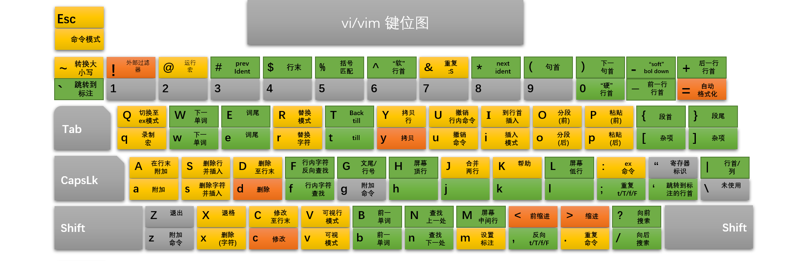

## 服务器常用操作

+   pip 换源：`pip install -i <url> <package_name>`
    +   `https://pypi.tuna.tsinghua.edu.cn/simple`
    +   `http://mirrors.aliyun.com/pypi/simple/`
+   Jupyter Notebook 的跨 ssh 连接
    
    +   服务器：`jupyter notebook –no-browser –port=8890`
    +   本地：`ssh -N -f -L localhost:8888:localhost:8890 usr_name@server_ip`
+   nohup
+   tmux

## 深度学习相关

+   查看 cuda 版本：`cat /usr/local/cuda/version.txt`

+   指定显卡训练：`CUDA_VISIBLE_DEVICES=1,2 python ...`

+   [pytorch 安装网站](https://pytorch.org/)
    +   查看 pytorch 版本：`print(torch.__version__)`

+   指定 CUDA 编号：CUDA_VISIBLE_DEVICES=1

## Anaconda

第一次安装 anaconda 时，可能需要激活环境变量：在 `vim ~/.bashrc` 里 `export` 一下。

| 需求                 | 指令                                                         |
| -------------------- | ------------------------------------------------------------ |
| 查看当前所有环境     | `conda info --env`                                           |
| 新建一个环境         | `conda create --name experiment python=3.5`                  |
| 在某个目录下新建环境 | `conda create --prefix ~/env/experiment python=3.5`          |
| 激活环境             | `conda activate<name>`                                       |
| 关闭环境             | `deactivate <name>`                                          |
| 删除环境             | `conda remove -n python35 --all`                             |
| 复制一个配置         | `conda create -n experiment_new --clone experiment_last`     |
| 导出环境（相同 OS）  | `conda list --explicit > requirements.txt`                   |
| 根据列表创建环境     | `conda create  --name python-course --file requirements.txt` |
| 导出环境（跨平台）   | `conda env export > environment.yml`                         |
| 重建环境（跨平台）   | `conda env create -f environment.yml`                        |

注：上述表格里的”导出环境“都是导出一个配置列表，重建时 Conda 会重新下载安装包。在实际应用中，如果新环境网络状况不稳定，可以考虑用 **Conda Pack** 来 **打包整个环境**。

Conda 操作可以参考这个[教程](https://zhuanlan.zhihu.com/p/87344422)。 首先我们用 `conda install -c conda-forge conda-pack` 或者 `pip install conda-pack` 安装 conda pack。也可以直接在官网上下载 whl 安装（体积特别小）。

打包一个环境的两种方法
+   `conda pack -n my_env -o out_name.tar.gz` 
+   `conda pack -p /explicit/path/to/my_env`

将 tar 包复制到新平台即可重建环境（操作系统要一致）
~~~shell
mkdir -p my_env
tar -xzf my_env.tar.gz -C my_env
source my_env/bin/activate
~~~

修改 channel：打开 `~/.condarc`
```Python
channels:
  - https://mirrors.tuna.tsinghua.edu.cn/anaconda/pkgs/main/
  - https://mirrors.tuna.tsinghua.edu.cn/anaconda/pkgs/free/
  - https://mirrors.tuna.tsinghua.edu.cn/anaconda/cloud/conda-forge/
```

## Linux Command

**cat/more/head/tail**: print the file content on the screen.

~~~shell
cat [file...]
head/tail -n [file...]
cat /etc/passwd > passwd.back
cat test1 test2 >test3
cat a.txt | more

more [-options] [-num] [+/pattern] [+linenum] [file_name]
-d : help the user to navigate.
-s : squeeze multiple blank lines into one single blank line
~~~

**find**:  find files and directories and perform subsequent operations on them.

~~~shell
find [path...] [-options]
-[i]name: find by names (i: whether ignore the case)
-exec [CMD \] : do this command on found files
-empty: find the empty files
-perm xxx: find files with permission xxx
-type f/d: find files/directories only
-size [+/-]s: find files with size
-mtime [+/-]t: find files with modified time

find ./GFG -name *.txt 
find ./GFG -name sample.txt -exec rm -i {} \; 
find ./ -type f -name "*.txt" -exec grep 'Geek' {} \;
find . -type f (-name "*.txt" -o -name "*.pdf" -o -name "*.doc" )
find / -type f -exec grep -l "hyperconvergence" {} ;
~~~

**grep**: Search the matched line from a source.

~~~shell
grep [options] PATTERN [file...]
-c: only count the lines that match a pattern
-n: display the matched lines and their line numbers.
-A/B/C n : print searched line and n lines after/before/after before the result
-i: ignore the case
-v: display the unmatched lines
-l: list the file name who contains the specific content
ps -ef | grep <pattern> | grep -v grep
~~~

**ln**: Create a [hard link](https://en.wikipedia.org/wiki/Hard_link) or a [symbolic link](https://en.wikipedia.org/wiki/Symbolic_link) (symlink) to an existing file or directory.

~~~shell
ln [-fs] [-L|-P] source_file target_file
-L: if the source_file is a symlink, create the corresponding hard link to the source.
-P: if the source_file is a symlink, create the corresponding hard link to itself.
-s: create symbolic links instead of hard links(-L and -P options are ignored)
~~~

**ls**：查看目录下的文件。

~~~shell
ls [options] [file...]
-a: list all files including the hidden one
-l: list with addtional properties like permission and size
-t: sort with the created time
-r: reverse the order
-R: show all the files recursively

ls -lh
~~~

**ps**: Process Status, list the currently running processes and their PIDs.

~~~shell
ps [options] [--help]
-a  : view the processes not associated with a terminal
-T  : view the processes associated with a terminal
-A/e: view all the processes
-f  : view the processes with full-format listing
aux : display processes in BSD format (with their CPU, MEM)
~~~

Note: The TIME column counts the total accumulated CPU utilization time for a process, and 00:00:00 indicates no CPU time has been given by the kernel till now. For example, bash always shows 00:00:00, because it is just a parent process for different processes which needs bash for their execution.

**tar/gzip/zip/rar**: compress/decompress the files. `-v == --verbose`: show the process.

~~~shell
tar xvf <name>.tar[.gz/bz2]                   
tar cvf <name>.tar[.gz/bz2] [file...]   # -z: use gzip; -j: use bzip2
gzip -d <name>.gz / gunzip <name>.gz      
gzip <name>                             # gzip can not compress the folder
unzip <name>.zip                        # -d: decompress to the given -path
zip -r <name>.zip [file...]             # compress the following files recursively
rar x <name>.rar
rar a <name>.rar [file...]              # -p: set the password, e.g.: -p123
~~~

## vim



**移动光标**：可在前面加数字表示移动的次数。

| key       | function                     |
| --------- | ---------------------------- |
| h/j/k/l   | 光标向左/下/上/右移动一位    |
| w 或 W    | 光标移动至下一个单词的单词首 |
| b 或 B    | 光标移动至上一个单词的单词首 |
| e 或 E    | 光标移动至下一个单词的单词尾 |
| 0 或 Home | 光标移动至当前行最前面的字符 |
| $ 或 End  | 光标移动至当前行最后面的字符 |
| G         | 光标移动至文件最后一行       |
| gg        | 光标移动至文件第一行         |
| ctrl+f    | 向下翻页                     |
| ctrl+b    | 向上翻页                     |

**查找和替换文本**

| key             | function                                                     |
| --------------- | ------------------------------------------------------------ |
| /abc            | 从光标所在位置向前查找字符串 abc                             |
| /^abc$          | 查找以 abc 为行首/尾的行                                     |
| ?abc            | 从光标所在为主向后查找字符串 abc                             |
| n               | 向同一方向重复上次的查找指令                                 |
| N               | 向相反方向重复上次的查找指定                                 |
| r               | 替换光标所在位置的字符                                       |
| R               | 从光标所在位置开始替换字符，其输入内容会覆盖掉后面等长的文本内容，按“Esc”结束 |
| :n1,n2s/a1/a2/g | 将文件中 n1 到 n2 行中所有 a1 都用 a2 替换                   |
| :%s/a1/a2/gc    | 尝试将文件中所有的 a1 都用 a2 替换，取代前会询问用户         |

**插入删除操作**

| key    | function                |
| ------ | ----------------------- |
| x/X    | 向后/前删除一个字符     |
| dd     | 删除当前行              |
| yy     | 复制当前行              |
| p/P    | 粘贴到当前行的下/上一行 |
| u      | 撤销上一个操作          |
| ctrl+r | 重做上一个操作          |