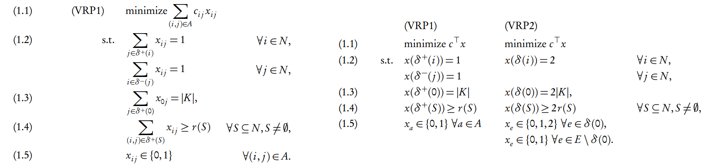
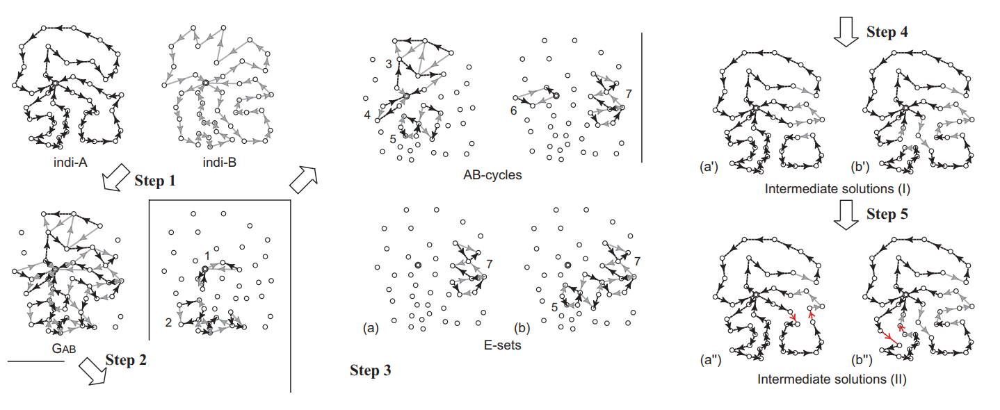
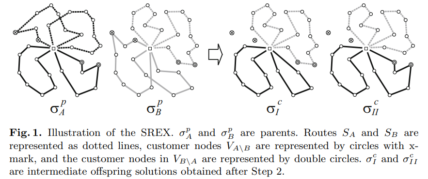
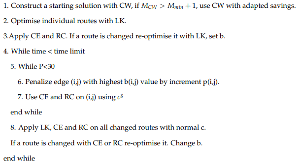

**[DIMACS](http://dimacs.rutgers.edu/)** 是美国罗格斯大学和普林斯顿大学共同发起的离散数学和理论计算机科学中心，每隔若干年会指定一个话题，举办一场理论与实际结合的大赛，以推动相关领域的蓬勃发展。例如，上一届 DIMACS 竞赛在 2013-2014 年举办，内容是斯坦纳树。本届 DIMACS 竞赛正好在 2020-2021 年举办，内容是 [车辆路径问题](http://dimacs.rutgers.edu/programs/challenge/vrp)。

车辆路径问题（**Vehicle Routing Problem**，以下简称 **VRP**）由 George 和 John 于 1959 年提出，是一个经典的组合优化问题。VRP 还具有很强的实践价值，是现代物流系统优化的关键内容。

$2020.12 \sim 2021.5$ 我在华为实习，主要研究了 CVRP 和 VRPTW 的启发式解法。

【等待更新 DIMACS 最新进展】

## VRP 问题简介

VRP 主要有以下几种类型/变种：
  + **Capacitated Vehicle Routing Problem**：给定一个货仓和 $n-1$ 个用户位置，设计若干条从起点出发并回到起点的 route，使得每个用户恰好被访问一次，且每条 route 的货物总量不超过货车容量上限 $Q$。 
  + **Split-Delivery VRP**：每个用户有个需求总量 $q_i$，可以被多条 route 覆盖 。
  + **CVRP with Time Windows**：每个用户会给出一个额外的时间窗 $[st_i,ed_i]$ ，要求在该时间段间开始服务用户 $i$。一般还会有一个 $service_i$，表示用户 $i$ 总共需要服务这么多时间。
  + **Pickup-and-Delivery Problem**：每个用户会有一个接受货物或是递送货物的需求。最简单的模型里一共有 $N/2$ 组用户，其中一个要向另一个递送若干重量的物品。同样要设计多条 route，使得每个用户被访问一次且货物成功送出去。
  + **Inventory RP**：货仓每单位时间会生产 $r_{0,t}$ 的货物，而每个用户会消耗 $r_{i,t}$ 的货物。货仓和用户处可以储存多余的货物，但是要支付每单位时间 $h_i$ 的代价，且每个用户只能储存 $[L_i,R_i]$ 单位的货物至下一天。有 $M$ 辆容量为 $Q$ 的卡车，要求在满足所有限制的情况下，距离代价加储存代价最小。
  + **Capacitated Arc RP**：每条边有一个货物需求 $q_{i,j}$。设计若干条线路使得每条边仅被遍历一次。

求解 VRP 有以下两个大方向（也有将两者结合起来的算法）：
  + 精确算法（Exact Algorithm），基于数学推导并借助计算机的暴力穷举求得精确解，耗时往往很长。
    + Branch-and-Bound Algorithms
    + Early Set Partitioning Algorithms
    + Branch-and-Cut Algorithms
+ 启发式算法（Heuristics Algorithm），多使用局部搜索策略，试图用较低的代价去构造和迭代高质量解。
  + Local Search Algorithms: Simulated Annealing, Tabu Search, Variable Neighborhood Search...
  + Population-Based Algorithms: Ant Colony Optimization, Genetic/Memetic Algorithms...

## CVRP 的数学规划

CVRP 是最经典、最简洁的 CVRP 版本。

设 $N=\{1,2,3,\dots\}$ 是需求点，$V=\{0\} \cup N$ 是总点集。

设 $r(S)$ 为最少用多少辆卡车覆盖点集 $S$。$r(S)$ 可以用 $q_i$ 和 $Q$ 构建 bin packing problem 来解，下界是 $\lceil \frac{q(S)}{Q}\rceil$。

那么 CVRP 可以用下图的整数规划来描述（1表示无向图，2表示有向图）：

条件 1.4 看起来很像霍尔定理，我们在有向图版本里分析一下这个条件的正确性：

1. 如果存在一个包含起点 $0$ 的但是超过 $Q$ 的假 route，我们把它剔除 $0$ 后的集合 $S$ 拿出来（ $S \subseteq N$），那么有  $q(S)>Q,\delta^+(S)=1$。但此时明显满足 $r(S)>1$，所以 1.4 的条件不成立。
2. 如果存在一个不包含起点 $0$ 的假 route，我们直接把这个集合 $S$ 拿出来，满足 $\delta^+(S)=0$。但此时 $r(S)>0$，同样不符合这个条件。

以上数学模型的条件数量是指数级的。应用经典的 **MTZ-formulation**，我们可以把变量和条件个数降为 $O(n^2)$。

引入 $n$ 个新变量 $(u_1,u_2,\dots,u_{n-1},u_n)$，$u_i$ 表示从 $0$ 走到 $i$，卡车已经累计在这条 route 里分配了多少货物了。

那么我们有：
$$
u_i-u_j+Qx_{i,j} \le Q-q_j \quad \forall (i,j) \in A(N) \\
q_i \le u_i \le Q \quad i \in N
$$

+ 考虑所有 $x_{i,j}=1$ 的约束。一个不包含 $0$ 的 route $(i,j,k,\dots,i)$ 会得到 $(u_i>u_j>\dots>u_i)$ ，不合法。
+ 考虑所有 $x_{i,j}=0$ 的约束，得 $u_i \le u_j+Q-q_j$，这个是恒成立的。

此外，还有一个更复杂的 **three-index (vehicle-flow) formulation**，这里不做介绍。

## 解 VRP 的经典技巧

#### Neighborhood

进行 local search 的时候，最关键的就是定义和生成 neighborhood。

点级别的 neighborhood 分为 intra-route 和 inter-route 两种，即内部变更和跨路径变更。

+ $\kappa$-opt：变换 $\kappa$ 组路径内的边。常见的就是 2-opt，3-opt。
+ Relocate：将一个点从某条路径中删除，插入到另一条路径。
+ Exchange：交换两条路径里的两个点。
+ Cross Exchange：交换两条路径的两条链。

#### Population-based Algorithm

一个求解 VRP 相关问题的 Population-based Algorithm 的通用框架是：

1. 先用某种方式得到 $N$ 个解，并把这些初始解维护在池子里。
2. 每次将池子里的解打乱，按顺序枚举相邻两个解进行 crossover 操作。
3. 得到的一群解经过 Repair 和 Local Search 后再放回池子里去。

#### Guided Ejection Search

GES 是 VRP 问题的常用技巧。我们经常会遇到这样一个操作：试图删除一条 route 并努力把所有点都并到别的 routes 里使其成为合法解（这样一来就能进一步降低 routes 的数量了）。

一种 naive 的实现是：我们每次随机一个未匹配点，枚举一下位置塞进去。但一旦出现无法塞入的情况就 GG 了。有可能需要通过弹出一些点才能塞入成功，然后把弹出的那些点额外调整到别的 route 里。

GES 给出了一个漂亮的、形式化的策略。给每一个点分配一个 $\mathbb{penalty}$，初始时 $\forall i~~p_i=1$。每当我们尝试塞入点 $k$ 时，如果直接塞入失败那么 $p_k \uparrow$。然后我们将选择一条 route，先弹出 route 里的若干个点 $k_1,k_2,\dots,k_m$ 再塞入 $k$，使得 $\min\{p_{k_1}+p_{k_2}+\dots+p_{k_m}\}$。经过足够多的操作后，$\mathbb{penalty}$ 系统能近似刻画出每个点的“插入难度指数”，并会优先插入那些限制比较大的点。

#### Edge Assembly Crossover

**EAX** 最初是在 TSP 问题中被提出，随后被应用于 CVRP 和 VRPTW。

下面针对 VRPTW 讲解。假设两个解的有向边集分别是 $A,B$，定义有向边集 $G_{A,B}=\{A \cup B\}-\{A \cap B\} $。

1. 定义一个（极大的） $\alpha\beta~cycle$ 为：交替在 $G_{A,B}$ 里取 $A$ 中和 $B$ 中的有向边（共享一个端点且方向反向）。
2. 在 $G_{A,B}$ 里把所有的 $\alpha\beta~cycles$ 全都取出来，并选择一部分 $cycles$ 构成边集 $E$。
3. 那么新的解 $C=\{A-(E \cap A)\}\cup \{E \cap B\}$。注意这个解不一定经过仓库，所以我们需要再调整一些环。

#### Generalized Cost Function

对于 VRPTW 的一个合法解 $\sigma_0$，它的每条 Route 需要同时满足 Capacity 和 Time Windows 两个限制，在此基础上总距离值要尽量小。Heuristics 方法的关键是解的变换，有可能 $\sigma_0$ 变成的 $\sigma$ 后某些 routes 不再满足限制。我们尝试用一个函数 $F_g$ 来刻画新解 $\sigma$ 的“优越程度”。它是由 “总距离值” 和 “相对满足限制的程度” 结合而成：
$$
F_g(\sigma)=F_{dist}(\sigma)+\alpha P_c(\sigma)+\beta P_{tw}(\sigma)
$$
其中 $F_{dist}(\sigma)$ 是该 Route 的总距离，$P_c(\sigma),P_{tw}(\sigma)$ 分别刻画它在两个限制上的“满足程度”。我们有：
$$
P_c(\sigma)=\sum \limits_{i=1}^m \{(\sum \limits_{v \in R_i}q_v) -Q,0\} \\
l'_i=l_{pre_i}+service_{pre_i}+dist_{pre_i,i} \\
l_0=st_0, l_i=\min(l'_i,\max(l'_i,st_i)) \\
r'_i=r_{succ_i}+service_{succ_i}+dist_{i,succ_i} \\
r_0=ed_0, r_i=\max(r'_i,\min(r'_i, ed_i)) \\
P_{tw}(\sigma)=\sum \limits_{i=0}^n \{l'_i-ed_i,0\}=\sum \limits_{i=0}^n \{st_i-r'_i,0\} \\
$$
其中 $l_i$ 表示某条 route 从起点开始最快能什么时间到 $i$，$r_i$ 表示某条 route 从终点开始最快能什么时间倒回到 $i$（或者说最慢何时必须从 $i$ 正向出发去终点）。如果途中早到了就必须停留，如果迟到了就要获得额外的惩罚。

一般取 $\alpha=\beta=1$。这样，对于任何两个解 $\sigma_1,\sigma_2$（即使他们不合法），我们都能通过比较他俩的 Generalized Cost Function 来判定他们的优越程度。

此外，GCF 的引入还能使 Local Search 的计算和比较 **更加高效**。假设我们正在执行 VRPTW 的 Crossover 操作（我们以 EAX 算子为例），并希望选择领域内 GCF 最优的 $\sigma$ 保存。如果在 neighborhood 里试探一步，看似需要 $O(N)$ 的时间来暴力计算新解的 GCF。但是如果本次 EAX 是路径间的变换（$v,w$ 不属于同一条 Route），计算新解的 GCF 的复杂度就能降为 $O(1)$。具体地，假设一个到 $i$ 的前缀路径和一个到 $j$ 的后缀路径需要合并，那么这条新路径的时间窗违反程度之和 $P_{sum}=PreSum_i+SuccSum_j+\max(l_i+service_i+dist_{i,j}-r_j,0)$

#### Selective Route Exchange Crossover

VRPTW 的拓展问题 PDPTW 限制更紧，crossover 更容易破坏解的合法性，所以 Nagata 又提出了 [**SREC** 算子](https://link.springer.com/chapter/10.1007/978-3-642-15844-5_54)。

考虑两个父解 $\sigma_A,\sigma_B$，设 $S_A,S_B$ 是我们选出来的路径集合，$V_{A \backslash B},V_{B \backslash A}$ 为只出现在 $S_A$（$S_B$）但不出现在对面子集的点集。现在我们想从父解出发生成尽量符合限制的子解。有两种以下两种生成子解的方案：

1. 在 $\sigma_A$ 里去掉 $S_A$ 的路径集合以及 $V_{B \backslash A}$ 的点集（对应路径上边跳过它们相连），并加上 $S_B$。
2. 在 $\sigma_A$ 里去掉 $S_A$ 的路径集合并加上 $S'_B$，$S'_B$ 是 $S_B$ 里把 $V_{B\backslash A}$ 删除后的点集（对应路径上边跳过它们相连）。

路径上删 $V_{B \backslash A}$ 后依然合法（因为卡车容量需求变小了，且你可以多等一会来满足 Time Windows），所以我们只需把多余的 $V_{A \backslash B}$ 也弄合法（注意里面一定是递送点/接受点成对出现的）。这时候可以直接枚举每组需求 $i$，尝试把 $(d_i,r_i)$ 插入到某个路径里去，使得满足 Time Windows 的限制且 Travel Distance 尽量的小。 如果找不到这样的合法解，那么本次遗传就失败了。

$|V_{A \backslash B}|$ 越小找到合法解的概率就越大。所以作者找 $S_A,S_B$ 时最优化 $\min\{|V_{A \backslash B}|\}$。具体地，规定 $|S_A|=|S_B|$，定义 $(S_A,S_B)$ 的 neighborhood 是把每个 $S$ 替换一条 route，然后用爬山去找（近似）最优的 $(S_A,S_B)$。

## CVRP & VRPTW 启发式解的前沿探究

所有 CVRP 经典数据集都收藏在了 [CVRPLIB](http://vrp.atd-lab.inf.puc-rio.br/index.php/en/) 里，同时每个 instance 能查看当前最优解、是否被证明最优等。

VRPTW 的公认数据集只有两个：[Solomon](http://web.cba.neu.edu/~msolomon/problems.htm) 和 [Gehring & Homberger](https://www.sintef.no/projectweb/top/vrptw/homberger-benchmark/)，后者比前者大很多。在 [TOP](https://www.sintef.no/projectweb/top/) 里能看到 PDPTW 和 VRPTW 每个 instance 的当前最优解。在 [COMBOPT](http://combopt.org/tables/GehringHomberger/) 还能看到近几年的最优解更新记录。

让我慢慢更新一下……

## Paper->Knowledge-Guided Local Search

Florian Arnold 在 2018 年的 [博士毕业论文](https://repository.uantwerpen.be/docman/irua/0afe42/153464.pdf) 里提出了 KGLS 算法，并和导师 Kenneth Sorensen 于 2019 年发在 Computers and Operations Research 上（*Knowledge-guided local search for the vehicle routing problem*）。算法主要是用来解决 CVRP 问题，在 X instances 上的实验结果相比于 SOTA 略逊一筹，不过速度优势明显。

**CW**：这是 Clarke 和 Wright 在 1964 年提出的 CVRP 初始化方法。设 $s_{i,j}=d_{0,i}+d_{0,j}-d_{i,j}$，把 $n^2$ 个 pair 从大到小排序（越大表示越远离 depot，需要尽快连接）。顺次枚举每组 pair，能连就连。

**CW Adapted Savings**：这是 **CW** 的改进版，综合了用户需求 $q_i$，即 $s^w_{i,j}=\frac{s_{i,j}}{\max_{k,l}s_{k,l}}+\frac{q_i+q_j}{\max_{k,l}q_k+q_l}$。

**LK**：这是 Lin-Kernighan 在 1973 年提出的一种 intra-route optimization，也就是 $\kappa$-opt 算子。LK 算法最多会重复 $\kappa$ 次（作者设 $\kappa=4$），每次会删除一条边并增加一条边，要求操作完后距离增量 $\Delta c$ 小于 $0$。每条操作边都要和上一条边共享同一个端点（作者只考虑和该端点相连的最近的 $10$ 条边，走增量最小的一条过去），一旦形成了闭合回路即得到一个更优的解。估价 $c_{i,j}$ 的优劣会影响邻域大小。

**CE**：CROSS-exchange，交换链，经典 inter-route optimization。枚举某条路径的某个点 $i$，在离它最近的 $C$ 个点中找另一条路径的某个点 $j$，连接 $(i\rightarrow j,j^-\rightarrow i^+)$ （不变向）或 $(i\rightarrow j,i^+ \rightarrow j^+)$（变向）。

**RC**： Relocation chain，经典 inter-route optimization，基本操作是把某条路径的点 $i$ 插入到另一条路径的某个位置，使得路径增量最小。注意新路径的需求总量可能超过 $Q$ 了，这时我们在新路径里继续挑选点 $i'$，选择增量小于 $0$ 的向外 Relocate 的操作，直到满足需求限制或超过 Relocations 上限（$=3$）。

**Penalty**：设 $p_{i,j}$ 表示边 $(i,j)$ 被扰动的总次数。我们希望合理地设计 $p$，使得 $p_{i,j}$ 高的边更容易被移除。为了达到这个目的，我们改设一条边的距离 $c_g(i,j)=c(i,j)+\lambda p(i,j)L$，其中 $L$ 用来归一化（是上一轮平均边长），$\lambda=0.1/0.01$。作者在 *perturbation* 阶段会更新一些边的 $p$，并改用 $c_g(i,j)$ 的估价来 Local Search。

**Badness**：该算法是一个 Solution 优化到底，Local Search 是一成不变的，核心就是如何 *perturbation*。作者希望存在一套 $b_{i,j}$ 来评估每条已选的边的 Badness，然后优先扰动那些 Badness 大的边。一个快捷的定义方法是：设 $b^c_{i,j}=\frac{c_{i,j}}{1+p_{i,j}}$：因为距离越长，这条边需要扰动的概率就越大；$p_{i,j}$ 是用来增加 Diversification 的（防止长边反复被 *perturbation*），优先扰动 $p_{i,j}$ 比较小的边 。作者认为 **compactness** 是较优解的通性，每条路径构成的凸包的宽度应该越小越好，所以提出了一种新的长度度量方法： $w_{i,j}$ 表示边 $(i,j)$ 投影在 ”仓库中心和当前 route 的重心之间的连线“ 的垂线的长度。然后定义 $b_{i,j}=b^w_{i,j}=\frac{w_{i,j}}{1+p_{i,j}}$。

## Paper->Hybrid Genetic Search

HGS 由 Vidal 在 Operation Research 2012 上发表（*A hybrid genetic algorithm for multidepot and periodic vehicle routing problems*），全名是 Hybrid Genetic Search with Adaptive Diversity Control（**HGSADC**）。HGSADC 求解的是泛化的 multi-depot 问题，其良好的实际性能自然也成为了 CVRP 的 SOTA。

Thibaut Vidal 在 2020 年针对 CVRP 优化了 HGS，增加了 SWAP* 算子并做了一些微调（*Hybrid Genetic Search for the CVRP: Open-Source Implementation and SWAP\* Neighborhood*），在 X-instance 上的平均偏差从 $0.24\%$ 降到了 $0.11\%$。Vidal 还开源了他的 [代码](https://github.com/vidalt/HGS-CVRP)。

#### 种群交叉算子——OX

1. 把每个解 $P_i$ 去除 $0$ 后的路径连接起来构成一个染色体排列 $p_i$。
2. 用 binary tournament 找到父节点 $P_A$ 和 $P_B$ ，试图用 $p_A$ 和 $p_B$ 生成新染色体 $p$。
3. 随机选取 $p_A$ 的一段连续串放入新染色体 $p$ 的对应位置，然后把剩下的点按在 $p_B$ 里的相对位置填入 $p$ 。
4. 用 Split 算法将 $p$ 拆分成最优的 route 组合得到 $P$。可以用单调队列优化到 $O(N)$。

#### 种群管理

种群最低数量是 $\mu$，每当超过 $\mu + \lambda$ 时会触发删除机制，把种群数量重新减至 $\mu$。

作者会优先删除完全重复的解，否则删除综合估价 $BF(P)$ 最劣的解 $P$。

设 $\phi(P)$ 表示解 $P$ 的惩罚函数（距离和+是否超出需求限制）。

设$\Delta P$ 表示解 $P$ 的种群内分化程度：$\Delta P=\frac{1}{n_{close}}\sum \limits_{i=1}^{n_{close}} \mathrm{NormalizedDiff}(P,P_i)$。

设 $tot$ 是总的解数，$control$ 是要“保护”的解的个数。

设 $fit(P),dc(P)$ 分别表示解 $P$ 的 $\phi(P)$ 和 $\Delta P$ 在所有解里的排名（值域 $[1,tot]$），则综合估价 $BF(P)$：
$$
BF(P)=fit(P)+(1-\frac{control}{tot})dc(P)
$$

$BF(P)$ 保证了非重复的 $fit$ 最优的 $control$ 个解必然不会被删掉。假设它们是 $P_i$，$fit$ 最劣的解是 $P_{worst}$。
$$
\begin{align}
BF(P_i) &\le control+(tot-control)=tot \\
BF(P_{worst}) &\ge tot+1 \ge BF(P_i)
\end{align}
$$

#### 局部搜索

HGS2012 一共有九个算子（是 FILO 算子集合的子集），分别是 `ex<1,0>, ex<2,0>, rex<2,0>, ex<1,1>, ex<2,1>, ex<2,2>,TWOPT,SPLIT,TAILS `；HGS2020 新加了 SWAP* 算子。

采用 RND 的思路不断局部搜索，每次只考虑点 $i$ 或点 $j$ 所在路径被更新的 pair $(i,j)$。 

经典优化：给每条路径打上最后变动的时间戳。pair $(i,j)$ 的上一次枚举时间必须小于 $\max\{T_{r_i},T_{r_j}\}$。

## Paper->Fast ILS Localized Optimization Algorithm

作者主要用来解决超大规模的 CVRP 问题，所以在经典 ILS 的不同层面都做了加速。

#### Move Generators and Granular Neighborhood

GN 为 FILO 规定了边集上限，即每个点只和与其最接近的 $n_{gs}(e.g.~ n_{gs}=25)$ 个点之间有边（注意如果 $j$ 在 $i$ 邻域但 $i$ 不在 $j$ 邻域，我们仍然认为有向边 $(i,j),(j,i)$ 都存在）。

Move Generator 是每一次解变动的发生器，每个 MG 是依托在一条有向边 $(i,j)$ 上的。例如，邻域算子 TAILS 会交换两条路径的后半段，则可定义 $MG_{tails}(i,j)$ 表示删除 $(i,succ_i),(pre_j,j)$ 并加入 $(i,j,pre_j, succ_i)$ 的这个操作。每一次 Local Search 的本质是选出若干对 Move Generator 并施加它们的变换操作。

在 FILO 实际跑的过程中，邻域可能进一步缩小。作者用 $\gamma_i$ 维护每一个 customer 目前的邻域收缩比例（初始时 $\gamma_i=0.25$，即只考虑每个点周围的 $\lceil 0.25n_{gs} \rceil$ 个点）。$\gamma$ 会随着 FILO 的过程而动态变化，每个阶段会有少量的 $\gamma_i$ 发生变化。所以我们需要一个数据结构来快速维护 $(i,j)$ 的加删，而不用每次重构当前的合法边集。

#### Hierarchical Randomized Neighborhood Descent and Static Move Descriptor

ILS 算法往往采用 Variable Neighborhood Descent 或 Randomized Variable Neighborhood Descent 的框架。VND 会把一系列的邻域算子按 Cardinality 从小到大排序（比如 $k-opt$ 会按 $k$ 排序），每次从左往右检查是否有 $delta<0$ 的算子，若存在则施加变换并继续从头开始枚举。RVND 则是每次随机打乱所有算子再枚举。

作者提出的 HRND 其实就是两种算法的结合。把邻域算子分成好几层，每层随机打乱做，层之间用 VND 做。

Static Move Descriptor 的结构是本文的核心亮点。其他 ILS 做法在经过一个 MG 的变换后又要重新局部搜索（因为解的结构变了），但是本文针对不同的算子设计了不同的更新策略，**SMD 结构能够快速对某种算子施加 Move Generators，直到无法再利用这种算子进行更新**。 

1. 在某种算子的搜寻初始化阶段，枚举所有可行的 MG $(i,j)$，并把 $delta<0$ 的 $(i,j)$ 放入一个小根堆。
2. 若堆是空的，则该算子无法被更新，SMD 操作结束；否则进入第三点。
3. 我们总希望找到一个 $delta$ 尽量小的 MG。这里用到了 *rough-best-improvement* 的思想：把堆维护在线性数组里，每次从左到右扫描，找到第一个**合法**（第一次扫描的时候所有 MG 肯定都是合法的，但是当应用了某些变更后，解的结构会发生变化，原先枚举的某些 MG 可能不再满足 $capacity$ 的限制）的 MG 更新。
4. 如果没有找到合法的 MG，SMD 操作结束；否则进入第四点。
5. 应用选中的 MG。同时根据当前算子的性质，我们可以确定所有 $delta$ 受到影响的 MG（一般和当前 $(i,j)$ 前后的点有关）。把这些 MG 重新算一遍，更新它们在堆里的位置（可能因为 $delta<0$ 被踢出堆）。

#### Selective Vertex Caching

作者提出了一种 Selective Vertex Caching 来加速 SMD 的初始化阶段，从而加速局部搜索。

在 perturbation 结束后或是在每一种局部搜索算子更新完成后，我们把所有涉及变化的点（插入的点以及它前后的点、删除的点以及它前后的点）都放入 SVC 的数据结构里。在 SMD 初始化阶段开始时，我们不再枚举全图所有的 MG，而是只枚举所有 SVC 里的点 $k$，然后枚举和 $k$ 相关的 MG $(i,k),(k,i)$。

我们需要限制 Cache 的大小来有效加速，作者设了 $C=50$。当塞入的点的数量超过 $C$ 后，作者采用经典的 *least recently used* 策略来筛选点。实验表明，$C=50$ 和 $C$ 开得足够大的效果差不多。

注意这里涉及到“枚举和点 $k$ 相邻的 MG”，所以 MoveGenerators 的数据结构需要增加功能。

#### Construct & Route Minimization & Perturbation 

解的初始化就用经典的  Clarke & Wright 即可。

作者提出了一个额外的 RM，用来把路径个条数尽快减少至合适的值。通过对 $q_i$ 和 $Q$ 做 first-fit 可以大概确定合适的路径条数。RM 的具体做法很简单，每次随机 $1 \sim 2$ 条路径删掉，把所有点都加入删除集合 $L$。然后按 SISR 的四种可能把 $L$ 里的点排序，依次尝试贪心插入，失败后就新开路径。

Perturbation 是 ILS 类框架里重要的一步。作者为每个点维护一个 $\omega_i$ ，表示如果以该点为起点进行扰动，总共需删除多少个点。一开始 $w_i=w_{base}=\lceil \ln |V| \rceil$，后来会随着 perturbation 效果的好坏而动态调整。 Pertubation 开始时，随机一个起点 $k$ 并开始游历，有 $0.5$ 的概率访问其前驱或者后继，另有 $0.5$ 的概率跳到离当前点最近的另一条路径上。所有游历的 $w_k$ 个点都会被删除，然后和 RM 里类似地排序+插入。

原作者在 RM 和 Perturbation 里没有使用 blink rate，实测用了后效果会好。

#### Core Iteration

核心框架是一个模拟退火，接受函数采用经典的 $c(S')=c(S)+\tau \ln U(0,1)$。

作者在 FILO 里迭代了 $10^5$ 轮，在 FILO-LONG 里迭代了 $10^6$ 轮。

每轮迭代就是基本的 ILS 流程，伴有大量的自适应参数调整。先 Perturbation，然后把 SVC 里的点用 HRVND 进行 Local Search 直到局部最优解。然后根据局部最优解的性质调整 $\gamma_i,w_i$，并按接受函数判断是否接受。

如果每连续若干轮都没有更新最优解，$y_i$ 会自适应地增加；一旦更新了最优解，$y_i$ 会恢复成初始值。

有两个固定参数 $I_{LB},I_{RB}$，同时设 $\Omega_{LB}=I_{LB}\overline{c}_{best},\Omega_{RB}=I_{RB}\overline{c}_{best}$，其中 $\overline{c}_{best}$ 表示当前最优解每条 route 的平均路径长度。我们希望每次 Pertubation 后，新的解要不比原来的解更优，要不差在 $[\Omega_{LB},\Omega_{RB}]$ 之间。

计算当前局部最优解和 Pertubation 前解的差，然后枚举 SVC 所有点 $i$，分类讨论 $w_i$ 的变化。

1. 如果 $0 \le delta \le \Omega_{LB}$，说明震荡幅度不够大，所以我们设 $w'_i=w_i+1$。
2. 如果 $delta > \Omega_{RB}$，说明震荡幅度过大，所以我们设 $w'_i=w_i-1$。

## Paper->Penalty-based Edge Assembly Memetic Algorithm

Nagata 在 2009 年提出了一个针对 VRPTW 的初始化解的方法（*A powerful route minimization heuristic for the vehicle routing problem with time windows*)，2010 年又提出了针对 VRPTW 的 EAMA 算法（*A penalty-based edge assembly memetic algorithm for the vehicle routing problem with time windows*）。他的论文十分 solid，甚至给出了在 Gehring & Homberger 数据集上的所有 instances 结果（在当时刷新了一半多的记录）。

本模型其实分成两个部分：一个部分叫做 *Route Minimization*，是用来确定最小路径数量的；另一个部分作者取名为 *Edge Assembly Memetic Algorithm*，就是用 Metaheuristics 的方法来优化解的总距离。

#### Neighborhood

作者定义了四种基本的邻域算子。

+ 2-opt* neighborhood（这个是路径间的，其实等价于 Cross Exchange）
  + 删除 $(v^-,v)$ 和 $(w,w^+)$，加入 $(w,v)$ 和 $(v^-,w^+)$。
  + 删除 $(v,v^+)$ 和 $(w^-,w)$，加入 $(w,v)$ 和 $(w-,v^+)$。
+ Out-Relocate
  + 删除 $(w^-,w),(v^-,v),(v,v^+)$，加入 $(w^-,v),(v,w),(v^-,v^+)$。
  + 删除 $(w,w^+),(v^-,v),(v,v^+)$，加入 $(w,v),(v,w^+),(v^-,v^+)$。
+ In-Relocate
  + 删除 $(w^-,w),(w,w^+),(v^-,v)$，加入 $(w^-,w^+),(v^-,w),(w,v)$。
  + 删除 $(w^-,w),(w,w^+),(v,v^+)$，加入 $(w^-,w^+),(v,w),(w,v^+)$。
+ Exchange：删除 $(w^-,w),(w,w^+),(v^-,v),(v,v^+)$，加入 $(w^-,v),(v,w^+),(v^-,w),(w,v^+)$。

#### Route Minimization

RM 的目的只是确定一组 $m$ 尽量小的解，而不擅长在 $m$ 确定的情况下继续优化 distance；或者可以说，RM 过程中总距离我们并不关心。根据实验结果，RM 出来的解的总距离往往是特别大的。

初始解 $\sigma_0$ 就是所有 customer 都归做一个单独的 route，这样所有限制都是满足的（$0$ 号点的时间窗接近无限大）。RM 随后会重复这个流程：每次随机选择一条 route $R$，将其从图中移除（这些点处于 unserved 状态）；随后依次访问 unserved 的点，尝试重新将其插入到别的 route 里。如果路径数量不能再减少就结束。

注意这里有一个讨论点：假设运行了若干时间后，我们发现当前枚举的 $R_0$ 删除后无法插回所有点，那我们需要继续尝试插入还是更换别的路径 $R_1,R_2,\dots$ 来删除？通过实际实验我发现以下结论：
1. 假设 RM 最终把步数减到了 $m$，$(m+1 \rightarrow m)$ 这一步是最耗时最棘手，也是唯一需要优化的步骤。
2. 如果是用作者的方法进行插入，$(m+1\rightarrow m)$ 用任何一条路径 $R_i$ 都能做到。
3. 尽管 2 成立，但是不同数据集的耗时方差不尽相同。有些数据集（不同路径的）的耗时较为均匀，有些则可能出现若干倍或者几十倍的差距。 对于后者可以考虑两种优化：1. 固定线程数量一起跑 RM，限制每个线程每次的运行时间上限；2. 在跑 RM 时，采用多线程删除路径，取最快的。这两者本质类似。

插入 unserved 节点使用的算法是 RM 的关键。Nagata 提出了三个连续的流程 *Greedy Insert, Squeeze, Eject*。
1. *Greedy Insert* 是最容易理解的，对于当前考虑的点 $v$，直接枚举所有可以插入的位置 $(p,q)$，计算 $(p,v,q)$ 后的 Generalized Cost Function（注意这是可以 $O(1)$ 算的），并在那些插入后合法的位置（$P_{tw}=P_c=0$）里 **随机** 选择一个（因为只要限制满足要求，我们并不关心总距离大小）。
2. 如果上述操作不存在合法位置，则要进行 *Squeeze* 操作。我们先在上述的位置里找到 $(P_{tw},P_c)$ 加权和最小的，并把 $v$ **强行** 插入其中。此时解 $\sigma$ 是 **不合法** 的，但是我们可以利用局部搜索使其变得合法。在邻域里不断寻找 $\sigma'$ 使得 。具体地，随机一条不合法的路径 $R$，围绕着 $R$ 的领域寻找解 $\sigma'_i$ 使得 $(P'_{tw},P'_c)$ 的加权和能进一步变小，每次找到最优的那个 $\sigma'_{*}=\min\{\sigma'_i\}$ 并爬山过去。重复此操作直到 $\sigma$ 满足所有限制。
3. 如果 *squeeze* 也不能满足要求，作者提出了一套 *eject* 机制：枚举每一个插入 $v$ 的位置，通过删除该条路径上的一个或者多个点来强行使 $\sigma$ 满足限制（这些被删除的点会被加入 unserved 集合，等会接着考虑插入）。那么我们如何评估删除一组点的优劣程度呢？作者又引入了 Guided Ejection Search 的技巧，每个点维护一个 $penalty$ 值，在所有插入位置的所有合法删除组合里找到 $penalty$ 之和最小的点集（注意一定存在这样的点集，因为我们总能把 $v$ 重新弹出来）。唯一遗憾的是，没有好的方法能够快速找到这个点集，所以作者限制了点集大小上限（$k_{max}=5$），并用搜索+剪枝的策略去寻找。

保存 unserved 节点该用什么数据结构，又要怎么接收被 *eject* 出来的点集来重新插入呢？Nagata 波澜不惊地说：用 Stack 的结构。令我惊讶的是，这似乎是所有能简单实现出来的方法里面效果最好的。我曾想当然地维护了一个基于 $penalty_i$ 的优先队列，每次优先插入 $penalty$ 最大的 unserved 的点，效果却不理想。

#### Edge Assembly Memetic Algorithm

EAMA 的框架就是传统 MA 的套路，维护种群，用 EAX 进行 *Crossover*，随后进行 *Repair* 和 *Local Search*。

在使用EAX 从父解 $\sigma_A,\sigma_B$ 获得子解 $\sigma$ 时，需要注意以下几点：

1. ABcycles 的分解时不唯一的。一个简单的随机分解方法是：每次随机一个还和 $G_{AB}$ 相关联的点 $v$，作为当前 ABcycle 的起点。从 $v$ 出发不断交替选边，如果不经过仓库分解方法是唯一的，一旦经过仓库就随机取边。
2. 如果初始化的解的 $m$ 不相同（差 $1$），在 EAX 时会遇到一些分解问题（比如遇到一个奇数边的 ABcycle，不能应用于后续的变换）。当然我们也可以强制保证 RM 后的路径数都相同。
3. 确定了边集 $E$ 后，得到的 $\sigma$ 可能会包含若干个不经过仓库的环，我们称之为 subtour。对此，作者枚举所有合法路径的相邻边 $(u,v)$ 以及 subtour 的每条边 $(p,q)$，尝试把整个 subtour 通过 $(p,q)$ 接到 $(u,v)$ 上（即 $u \rightarrow q \rightarrow \dots \rightarrow p \rightarrow v$）。通过最优化 Generalized Cost Function 来找这样的四元组。 
4. 获得 ABcycles 后如何生成 $\sigma$ 也有很多方法。作者提出了 *Single Strategy* 和 *Block Strategy*，前者的 $E$ 只采用一个 ABcyle，当连续若干代种群只用 *Single Strategy* 无法更新答案时才启用后者，用一定规则来应用多个 ABcycles 。前者改变幅度较小，较为稳定；后者有利于打破困境，但是也很容易遇到难 repair 的解。
5. 直观感受和实验都说明，subtour 越多 repair 成功的概率就越小，所以也可以从这方面入手优化。

*Repair* 和 RM 里的 *Squeeze* 流程类似，每次随机一条不合法的 route $R$ 修复。只是此次我们的优化函数发生了变化，需要同时考虑总距离。作者采用的策略是：在 $(\Delta P_{tw},\Delta P_c)$ 加权和是负数的情况下，挑选 GCF 最小的。 

*Local Search* 也是在邻域内爬山，只是搜到的解都要保证是 **合法** 的，在此基础上不断优化总距离。一个很实用的优化手段是：我们保存一下 EAX 前 $\sigma_A$ 的解，每次只在 $V_{\sigma}-V_{\sigma_A}$ 的点集里进行邻域搜索。

*Repair* 和 *Local Search* 里一个很重要的提速方法就是：把路径内和路径间的变换操作分开实现。路径间的所有 operation 均能通过 GCF 的性质进行 $O(1)$ 维护；而对于路径内的变换，我们可以通过一定的顺序来减少复杂度（如路径内 In/Out-Relocate 需枚举 $O(NM)$ 次，复杂度依然能降为 $O(NM)$，其中 $M$ 是枚举两点的最大间距；路径内 Exchange 能做到小常数 $O(NM^2)$）。根据实验结果，优化后还是路径间的变换比较耗时。

## Paper->Ruin & Recreate Strategies - String Removals

为了更好的搜寻 VRP 系列问题的邻域，传统的策略完全不够用。一种新兴的邻域构建方法 Ruin & Recreate 的思想是：先用一定手段破坏掉解得一部分，然后在重建它。这样大大增加了邻域的解集大小。

1998 年被提出的 **L**arge **N**eighborhood **S**earch 是一个经典的 Ruin & Recreate 算法。它每次会删除一些相近的点，然后用 branch-and-bound  技术 **最优化** 地找到重建方案。Pisinger 和 Ropke 在 2007 年提出了 **A**daptive **L**arge **N**eighborhood **S**earch 并取得巨大成功。

Christiaens 在 2018 年提出了 **S**lack **I**nduction by **S**tring **R**emovals，模拟退火 + Ruin & Recreate 框架。

SISR $\mathrm{R}^-$ 采用的是 adjacent string removal 策略。

1. 决定多少 route 里的多少 customer 被删除。
   + 设定参数 $\bar c$ 表示希望删除的 customer 的期望，$L^{max}$ 表示每条 route 最多删除的点数。
   + 假设随机到某条 route $t$，那么设删除点数上限 $l_t^{max}=\min(|t|,l^{max})$，实际删除 $l_t=[1,l_t^{max}]$。
   + 推导出删除 route 的条数上限为 $k^{max}=\frac{4\bar c}{1+l^{max}}-1$，实际删除 route 数 $k=\mathrm{random}[1,k^{max}]$（这样算期望后，删除的 customer 点数正好是 $\bar c$）。
2. 找到要删的 route 和对应的 customer。该算法之所以称之为 Adjacent String Removal，因为作者认为删除的所有 customers 如果是一个 cluster 就能更好地进行 recreate。所以它先取一个起始节点 $c_{start}$，然后把所有 customer 按到 $c_{start}$ 的距离排序。按顺序考虑每一个 $c$，如果它所在的 $t$ 还没有执行过删除过就做一次删除，直到有 $k$ 条 route 被删。删 customer 的方法在以下两种里随机：
   + 直接随机一个包含 $c$ 的长度为 $l_t$ 的 $t$ 的子路径并删掉。
   + 先随机一个包含 $c$ 的长度为 $l_t+m$ 的 $t$ 的子路径并删掉，然后把中间某连续的 $m$ 个点再加回来。其中 $m$ 满足 $m \in [1,|t|-l_t]$ 且 $Pr(m=k) \sim \alpha^k$。

SISR $\mathrm{R}^+$ 采用的是 Recreate greedy insertion with blinks 策略。

1. 将那些还未并入 route 的点按一定顺序排列。作者列举了四种可能的方式：随机，距离从远到近或从近到远，需求量 $q_i$ 从大到小。
2. 依次枚举每一个点 $c$ 以及所有能让它并入的 route $t$。每次枚举到一个合法位置的时候，程序有 $\beta$ 的概率触发 blink（skip），若没触发则会比较该位置和当前最优插入位置的优劣性并选择较优方案。对于一个第 $k$ 优解，它有 $(1-\beta)\beta^{k-1}$ 的概率被选择。

此外还有一个 Fleet minimization 需要考虑（即构造路径数最小的初始解），作者应用了一种叫做 absences-based 的思想。

1. 总体框架是：设当前解 $s=\{T,A\}$ （其中 $A$ 表示失配点集合）， $\mathrm{R}^- \& \mathrm{R}^+$ 操作得到了新解 $s^{\ast}$，若 $|A^{\ast}|<|A|$ 那么移动到 $s^{\ast}$。
2. 对于每个点 $c$，用 $abs(c)$ 表示整个爬山过程中点 $c$ 在几轮里位于失配点集合。显然 $abs(c)$ 越大表示 $c$ 越难进入一条 route以每次比较时，如果 $|A^{\ast}|=|A|$，改为比较 $\sum abs(|A^{\ast}|)$ 和 $\sum abs(|A|)$ 的大小，选择小的。