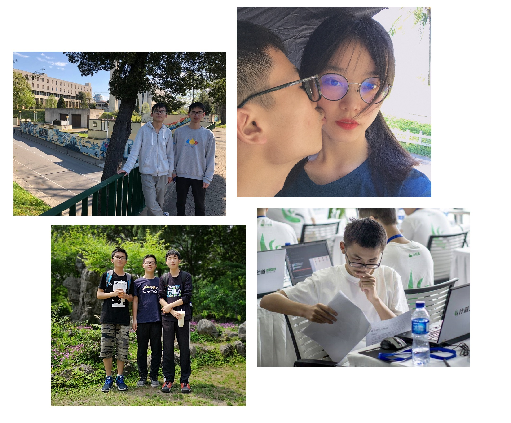

## Description

I am a person who pursues technology and enjoys life. I don't want to change the world, but I want to use my blog to describe the world in my eyes. Here is my [CV](/download/Curriculum-Vitae.pdf) (updated at 2021.05).

我是一个追求技术至上、注重享受生活的人。我并不奢望能够改变世界，只是想用自己的笔触来描绘这个世界。

这里是我的 [中文简历](/download/中文简历.pdf)（更新于 2021.05）。

## Background

I came from the ancient city Shaoxing. During my high school in Shaoxing No.1 Middle School, I took part in the informatics competition (**OI**) and got three first prizes in NOIP, but only the silver medal in NOI 2016. 

我来自历史悠久的古城绍兴，曾就读于绍兴市第一中学。高中时NOIP三年省一，省队第七，憾获 [NOI 银牌](https://www.zhihu.com/question/32768648/answer/260554761)。

I received my B.S. degree from Zhejiang University, majoring in computer science. During that time, I was involved in Qiushi Honor's Program of Chu Kochen Honors College, advised by Prof. Chun Chen.

我毕业于浙江大学计算机科学与技术专业（竺可桢学院求是科学班），师从陈纯院士。

I was involved in Competitive Programming in my first two college years and won gold medals in each ICPC competition, and finally the 21st in the World Finals. In the later period, I'v tried a lot of scientific research, like Face Clustering, Document Structurization, Video Analytics, Logical Reasoning in Geometry Problems, and Vehicle Routing Problem. Due to the COVID-19 situations and Sino-US relations, I gave up studying abroad, and got a full-time position in Huawei Cloud.

我在大学前两年主攻 ACM 竞赛，大二下获全球总决赛第 21 名，刷新了浙大近几年的记录；大学后两年以科研探索为主，做过人脸聚类、文档结构化、视频分析、几何题的可解释性推理、车辆路径规划问题等研究。由于新冠疫情和中美政策等原因，我放弃出国深造，目前任职于华为云。

## Publication

**Inter-GPS: Interpretable Geometry Problem Solving with Formal Language and Symbolic Reasoning**
Pan Lu\*, Ran Gong\*, **Shibiao Jiang**\*, Liang Qiu, Siyuan Huang, Xiaodan Liang, Song-Chun Zhu
The 59th Annual Meeting of the Association for Computational Linguistics (ACL), 2021
Website: https://lupantech.github.io/inter-gps/  

**FHCSolver: Fast Hybrid CVRP Solver** 
Shibiao Jiang, Zhu He, Weibo Lin, Fuda Ma, Zhipeng Lv
Workshop Paper, DIMACS 12th Challenge: Vehicle Routing Problem
Website: http://dimacs.rutgers.edu/events/details?eID=2086

**FHDSolver: Fast and Effective VRPTW Solver**
Shibiao Jiang, Zhu He, Weibo Lin, Fuda Ma, Zhipeng Lv
Workshop Paper, DIMACS 12th Challenge: Vehicle Routing Problem
Website: http://dimacs.rutgers.edu/events/details?eID=2076

## AWARDS 

| Year      | Title                                                        | Prize                               |
| --------- | ------------------------------------------------------------ | ----------------------------------- |
| 2014-2016 | NOIP                                                         | First Prize\*3                      |
| 2016      | NOI                                                          | Second Prize                        |
| 2017      | ICPC Beijing / Nanjing / Shanghai (EC-Final)                 | First Prize\*3                      |
| 2017      | CCPC Final                                                   | Runner-up                           |
| 2017-2020 | Zhejiang University Scholarship                              | Second Prize\*1, First Prize\*2     |
| 2017-2018 | Zhejiang Provincial Government Scholarship                   |                                     |
| 2018      | Zhejiang University Programming Contest                      | Champion                            |
| 2018      | Zhejiang Provincial Collegiate Programming Contest           | Runner-up                           |
| 2018      | ICPC Beijing / Nanning / Xi'an (EC-Final)                    | Second Runner-up\*2, First Prize\*1 |
| 2019      | ICPC World Finals                                            | Rank 21st                           |
| 2019-2020 | [National Scholarship](http://www.moe.gov.cn/jyb_xxgk/s5743/s5744/A05/202012/t20201217_506100.html) |                                     |
| 2020      | [Collegiate Computer Systems & Programming](http://ccsp.ccf.org.cn/ccsp/Bulletin/2020-10-26/710521.shtml) | First Prize                         |
| 2020      | [ICPC NERC Huawei Challenge](https://codeforces.com/nerc2020) | Second Runner-up                    |
| 2021      | Golden Code Competition in Huawei Cloud                      | Champion                            |
| 2022-2023 | 12th DIMACS Implementation Challenge: [Capacitated VRP](http://dimacs.rutgers.edu/programs/challenge/vrp/cvrp/cvrp-competition/) | Champion                            |
| 2022-2023 | 12th DIMACS Implementation Challenge: [VRP with Time Windows](http://dimacs.rutgers.edu/programs/challenge/vrp/vrptw/) | Second Runner-up                    |
| 2022-2023 | 12th DIMACS Implementation Challenge: [VRP with Split Deliveries](http://dimacs.rutgers.edu/programs/challenge/vrp/results/) | Champion                            |

## ACM Problem settings

Here list some of my problems. 

- 2015 **BestCoder Round #44**：[BestCoder Link](http://bestcoder.hdu.edu.cn/contests/contest_show.php?cid=603)
- 2015 **BestCoder Round #60**：[BestCoder](http://bestcoder.hdu.edu.cn/contests/contest_show.php?cid=641)
- 2016 **BZOJ 4389**
- 2016 **HDU多校第二场C**：[Hdu Link](http://acm.hdu.edu.cn/showproblem.php?pid=5754)
- 2016 **51nod 算法马拉松#12 E**：[51Nod Link](http://www.51nod.com/Contest/Problem.html#contestProblemId=128)
- 2017 **51nod 算法马拉松#28 D**：[51Nod Link](http://www.51nod.com/Contest/Problem.html#contestProblemId=192)
- 2018 **百度之星初赛 Round A**：[BestCoder Link](http://bestcoder.hdu.edu.cn/contests/contest_show.php?cid=825)
- 2019 **浙江省省赛 M**：[ZOJ Link](https://zoj.pintia.cn/contests/91827364650/problems/91827370494)
- 2019 **CCPC 哈尔滨站 A, B**：[CodeForces Link](https://codeforces.com/gym/102394)
- 2019 **ICPC 香港站 E, H**：[CodeForces Link](https://codeforces.com/gym/102452)
- 2020 **ICPC 南京 G**：[CodeForces Link](https://codeforces.com/gym/102992/problem/G)
- 2020 **ICPC 上海 H, L**：[CodeForces Link](https://codeforces.com/gym/102900) (idea is not mine)
- 2019 牛客暑期多校 **第三场**：[Nowcoder Link](https://ac.nowcoder.com/acm/contest/883)
- 2020 牛客暑期多校 **第四场**：[Nowcoder Link](https://ac.nowcoder.com/acm/contest/5669)
- 2021 牛客暑期多校 **第一场**：[Nowcoder Link](https://ac.nowcoder.com/acm/contest/11166)
- 2021 **ICPC 澳门 B, J**：[Nowcoder Link](https://ac.nowcoder.com/acm/contest/31454)
- 2021 **ICPC 南京 F**
- 2022 **字节跳动冬令营 Finals J**

